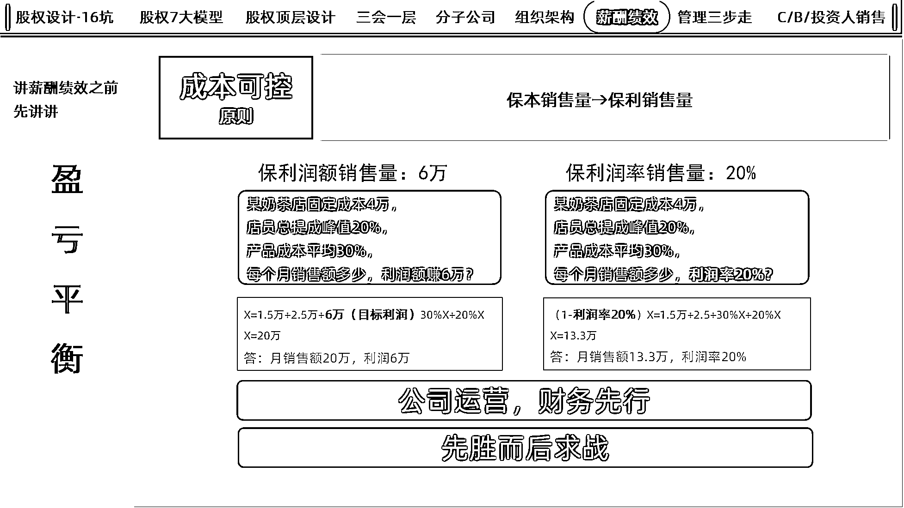
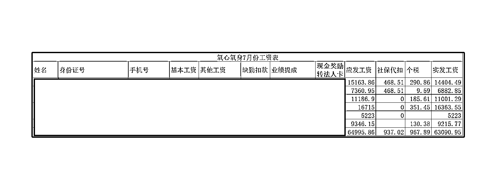

# 如何通过财务模型开“连锁实体店”（国医仲景艾灸养生馆）

> 原文：[`www.yuque.com/for_lazy/zhoubao/ma01lbcb849h1guo`](https://www.yuque.com/for_lazy/zhoubao/ma01lbcb849h1guo)

## (25 赞)如何通过财务模型开“连锁实体店”（国医仲景艾灸养生馆）

作者： 深圳刘宁培

日期：2024-08-23

大家好，我叫刘宁培，生财第二期就一直续费至今的老圈友；

主业企业咨询：擅长股权、薪酬、管理体系；

综合能力模型：项目 0-1 跑通，项目市场容量大的情况下，擅长做将项目的体量从 1 做到 10，能做利润/业绩翻倍；

副业做点小投资：开开知名品牌的加盟店，年底线下摆摊卖卖红包对联；

未来 2-3 年的重心放在“国医仲景-艾灸养生馆”的直营门店扩张+市场招商；

感谢生财有术平台，感谢亦仁大哥，生财平台遇到认识了刘驴、旭教练，并决定一起合伙做大健康的项目，经过几个月的筛选，最后选择了“国医仲景-艾灸养生馆”。

先说下成绩：

**直营店业务：**1 月 3 日一店开业，7 月初二店试营业，三店选址筹备中

**招商业务：**4 月份开始做招商，目前旗下招商门店数 20 家（其中标准店 13 家+合作店 7 家）

这个项目做了半年多时间了，现在分享，主要三方面：

一方面是我们选项目、做项目的逻辑；

一方面是将这套逻辑，可以套到自身的项目里，进行查漏补缺；

一方面是欢迎各位建议、意见、合作；

以下是本篇内容分享的全景图：

以下是本篇内容分享的主题：

一、选项目

二、会算账：保本销售量，保利销售量

三、收入=流量×转化率×客单价×复购/转介绍

四、支出=固定支出+浮动支出（薪酬绩效）

五、利润：约定比例分红（股权激励）

六、复制

### **一、选项目**

我们选项目的逻辑很简单，主要看以下几方面：

#### 1、不对抗趋势：

只做正处在上升期的业务，顺势借力，顺着潮流走，哪怕是新手，赚钱也能轻松些。

相反，像现在的房地产、教培行业等，它们就像夕阳下的风景，再努力也难有大成就。我们不会把钱投在这种被趋势抛弃的行业上，哪怕投入再小。

凭借过去做企业咨询的经验，大概知道哪些行业是上升期的业务，“大健康赛道”就是我们的选择，因为大家都经历过疫情的冲击，健康的重要性已经深入人心。即使没有做大健康经验的老板，也知道这是个好赛道。

所以，“国医仲景-艾灸养生馆”正是我们看中的大健康赛道的一员，顺应了时代的健康潮流。

#### 2、不对抗平台

要紧紧抱住那些大平台的大腿，比如京东、淘宝、拼多多、抖音、美团、视频号这些。这些平台已经拥有海量的用户和强大的技术，我们不去跟它们对着干，而是巧妙地利用它们。

就像搭顺风车一样，我们选的项目总部要有对接这些平台，借助它们的力量，让业务跑得更快更远，提升运营效率，降低营销成本。

就像国医仲景总部那样，他们不守旧，知道实体店缺流量，就积极在抖音直播引流，给全国门店带来客源。现在抖音团购都破百万单了；他们还在不断拓展新的流量渠道，今年 5 月就开始尝试美团流量；

#### 3、不教育市场

有位前辈告诫过我，别轻易碰教育市场的业务，即使你是对的，因为那需要很多很多钱，没个千万级别的资金打底，就别想教育市场。教育市场就像推广新玩意儿，大家还不熟，得花大钱花时间，还不一定成功。

（都知道一流企业做标准，二流企业做品牌，三流企业赚差价，想做制定标准的企业，谈何容易。）

所以做项目的选择，优先考虑有一定市场认知度和接受度的项目。这些项目经过市场的初步检验，消费者对其有一定的了解和需求，降低了教育市场的成本和风险。

中医六艺包含砭石、针灸、艾灸、汤药、导引、按摩。“国医仲景-艾灸养生馆”，它做的是艾灸相关的品项，现在社区里艾灸馆到处都是，不用再去费劲教育市场。

#### 4、不创造需求

别凭空去造出大家想要的东西，这特别费钱，比教育市场还要烧钱得多。

要创造需求，得准备好多东西，这里就不细说了。

#### 5、我只要 80 分

我们很有自知之明，不奢望找到一个 100 分的项目，80 分就挺好。能找一个 80 分的项目，稳稳当当赚上 10 年，实现长期稳定的盈利增长，我们就心满意足偷着乐了，所以有那 20 分的不足，我们都能包容。

“国医仲景从产品、品牌、营销、营销、工具 5 个角度

出发，每样都能打个 80 分以上，后面会展开阐述。”

#### 6、背靠大树好乘凉

我们都是一介平民，知道自己几斤几两，不奢望改变世界，也不想当啥大人物，也没做大健康项目的经验，我们就想赚点钱，同时让家里人身体健康。所以啊，我们选了条省心又稳的路——加盟，背靠大树好乘凉。

就我之前的加盟项目“优剪”来说，在“优剪”项目赚的轻松的被动收入，不是我多能干，主要是总部实力强。

精华帖链接：被动收入副业，加盟纯托管优剪理发店：https://t.zsxq.com/feyvnIM

最后选国医仲景也是如此。

旭教练找了几个朋友，把在杭州把大健康相关的项目（美团、抖音上的团购数据比较好的）选了 27 个牌子一个个试。我们扮成客户去体验，问东问西，还跑到总部实地考察。最后，从产品、品牌、营销、运营、工具的全方位对比，国医仲景脱颖而出，成了我们的首选。

**Q&A：**

**以上选项目的逻辑，代到自己的项目里面：**

**有没有对抗趋势，对抗平台，有没有教育市场、创造需求，有没有追求完美主义要求样样 100 分。**

### **二、会算账：保本销售量，保利销售量**

在生意场上，两个词特别关键：“保本销售量”和“保利销售量”。简单来说：

“保本销售量”就是销售额多少时，刚好能收回成本，不亏也不赚。

“保利销售量”就是想要的利润得达到的销售量，这样除了成本，还能留点利润在兜里。

这两个指标，就像是我们项目的指南针，告诉我们该怎么定目标，怎么努力。大家可以把这两个概念用到自己的生意或项目上，算算账，心里就有底了。毕竟，公司运营，财务先行。

#### 1、保本销售量

项目的总收入等于总成本，即项目既无利润也无亏损。

保本销售量是项目进行成本管理和利润预测时的一个重要指标。保本销售量的计算公式通常基于项目的成本结构，包括固定成本和浮动成本。

具体计算公式为：

税前保本销售量 = 固定成本 / (单价 - 单位变动成本)

税后保本销售量 = 固定成本 / [(单价 - 单位变动成本) - 单位税金]

其中，

固定成本是不随销售量变化而变化的成本，如房租、书电、杂费、折旧摊销等；

变动成本是随销售量变化而变化的成本，如原材料费用、员工提成等；

单价是产品的销售价格；单位税金是每单位产品应缴纳的税金。

不涉及应缴纳税金的情况下，出一道题：

准备开 1 家奶茶店：

固定成本：房租+水电费+摊销=1.5 万，人工底薪+社保=2.5 万，

浮动成本：奶茶成本 30%，员工提成 20%，

问：每个月做到多少钱不亏不赚？

根据盈亏平衡公式，收入=支出

流量×转化率×客单价×复购/转介绍=固定成本+浮动成本

假设收入为 X：

X=2.5 万+1.5 万+30%X+20%X

X=8 万

其中得出：

税前保本销售量 = 固定成本 / (单价 - 单位变动成本）

#### **2、保利销售量（保利润额、保利润率）**

保利销售量是指项目在实现特定利润目标时所需的销售量。

与保本销售量不同，保利销售量考虑了项目的盈利目标，即除了收回成本和缴纳税金外，还要实现一定的利润。

保利润额销售量的计算公式为：

保利润额销售量 = (固定成本+目标利润) / (单价 - 单位变动成本)

保利润额率销售量的计算公式为：

（1-保利润率销售量）=固定成本 / (单价 - 单位变动成本)

不涉及应缴税金的情况下，再出一道题：

准备开 1 家奶茶店：

固定成本：房租+水电费+摊销=1.5 万，人工底薪+社保=2.5 万，

浮动成本：奶茶成本 30%，员工提成 20%，

问：每个月做到多少钱可以赚 6 万？

问：每个月做到多少销售额可以赚 20%？

以下是解题思路，大家看图，计算公式就不再复述了。

小结：

保本销售量和保利销售量都是项目在经营过程中需要关注的重要指标。

保本销售量代表了项目维持基本运营所需的最小销售量。

保利销售量代表了项目实现盈利目标所需达到的销售量水平。

这两个指标有助于企业制定合理的销售计划、控制成本和优化利润结构。

公司运营，财务先行；过程会骗人，最后财务数据不会骗人。

先胜而后求战，先知道怎么赢，再定怎么打。

我们是直营店+招商两个业务一起启动，所以我们开的的第一家国医仲景艾灸养生馆馆是大店（一部分场地用于招商），直营二店、筹备中的直营三店都是小店。

国医仲景艾灸养生馆直营一店：

门店员工满员的情况下，每个月保本销售量是 7 万元。

计算出保本销售量，我就可以倒推流量指标、转化指标、交付指标。

例如：

但是我门店的业绩不止 7 万，因为门店有复购。

如果项目没有复购，就代表要一直开发新客户，要一直给流量成本、转化成本。

**Q&A：**

**以上算账的逻辑，代到自身项目里面：**

**自身项目每月/每年的保本销售量是多少？**

**自身项目达到想要的利润额/利润率的保利销售量是多少？**

**达到想要的保利销售时，要不要增加其他固定成本，例如更多的人员？**

**有了详细的财务数据支撑，就可以算出要不要招更多的人。**

### **三、收入=流量×转化率×客单价×复购/转介绍**

项目的收入来自四个关键子因素：流量、转化率、客单价和复购/转介绍。

这四个子因素就是全部了，公司所有的运营努力都是围绕着它们转的。

要提高这四个子因素的值，发力的端口主要是：产品端、品牌端、营销端、运营端、工具端

我们选择加盟项目时，我们愿意支付一定的费用，如加盟费、利润分成（优剪）、从总部补货时总部赚取的供应链差价等，因为我们和总部的商业模式不同，我们赚 C 端消费者的钱，总部赚 B 端的供应链差价，这很公平。

但我们交了这些费用，就希望总部能给我们提供全方位的支持，包括产品端、品牌端、营销端、运营端、工具端的帮助。如果大部分要我们自己来，那加盟就没什么意义了，还不如自己单独干呢。所以，我们希望总部能做好这些服务，让我们省心省力，共同赚钱。

之前做了一份很详细的 PPT 资料，资料图片有点多，就不上传全部图片了，上传重点部分，有需要的可以找我要，

#### 1、产品端

2、品牌端

  

#### 3、营销端：流量

#### 3、营销端：转化

#### 4、运营端

运营端还有这么多的培训（图片太多，就不一一上传）

线上培训：

（1）1100 分钟繁星计划课程（免费）

（2）每周一三五早上早间晨会（免费）

（3）每周一下午八点核心直通车（免费）

（4）每周三下午俩点 BOSS 茶话会（免费）

（5）每月 2 次线上节气微课堂（免费）

线下培训：

（1）6 天 5 夜最美灸师培训会（1000 元包吃包住）

（2）5 天 4 夜精英馆长研习社（200 元以内）

（3）3 天 2 夜名人堂锻造营（200 元以内）

（4）御养膏专场（200 元以内）

（5）艾灸沙发专场（200 元以内）

（6）私艾堂培训（200 元以内）

（7）抖音高级孵化班（200 元以内）

（8）9 天中医全能人才班（1500 元）

#### 5、工具端

**小结：**

之前优剪项目的文章里面，也有讲到加盟项目时，要考虑总部在产品端、品牌端、营销端、运营端、工具端的帮扶，是否足够多。

总部中台托住门店经营的下限，突破门店经营的上限。

**Q&A：**

**以上在流量端、转化端、交付端的帮扶，代到自己的项目里面：**

**自身项目在产品端、品牌端、营销端、运营端、工具端是否完善得足够多？**

**如果自己的项目放到市面上招商招代理，别人会不会跟你干？**

**别人跟你干的 10 个理由是什么？**

**别人不跟你干的 10 个理由是什么？**

### **四、支出=固定支出+浮动支出（薪酬绩效）**

这里就不说公司的固定支出、浮动支出了，在第二板块的保本销售量、保利销售量已经讲解过了。

这里要讲的是员工的固定收入、浮动收入。

不管是薪酬绩效、KPI、OKR 还是积分制，这些管理方式对我来说没有区别，都是换汤不换药的管理手段，这是“因”；不管是哪种管理手段，员工最后到手的收入是“果”，公司会根据这些管理方式设定薪酬，员工则按照这些规定去完成工作，员工最后到手的收入能不能比同行高 10-20%？如果不能，离开是早晚的事情。

先讲一个大数据：不要去压基本工资，假设一家公司给你高 20%的工资，全世界的高管有 90%会走

理由如下：年终结余（年终存款、年终净利等）

我刚开始在惠氏公司做销售时，底薪 4000 元，加上绩效 3000 元（上图），不过没有额外的提成。这样我一个月最多能赚 7000 元。每个月要花掉大约 5000 元，所以能存下 2000 元。一年下来，我就能存到 2.4 万元。在惠氏工作的几年，每年大概会给爸妈 2 万元。

如果 A 公司花 9000 元（工作量差不多）挖我，我大概率会跳槽过去，

同理可得，一年存款 2.4 万，虽然收入只增加了 30%，但是我的存款增加了 2 倍；

相当于我在 A 公司工作一年的存款，等于在惠氏公司工作 2 年的存款；

如果 B 公司花 15000 元（工作量增加）挖我，我肯定跳槽过去，

同理可得，一年存款 12 万，虽然收入只增加了 2.1%，但是我的存款增加了 5 倍；

相当于我在 B 公司工作一年的存款，等于在惠氏公司工作 5 年的存款；

年终结余（年终存款、年终净利等）

这个概念放到工作个人身上、公司身上，道理是一样的，如果时间精力消耗差不多，你更愿意做一年赚 50 万的项目，还是一年赚 100 万的项目？

所以招聘员工的时候，给店长提了要求：

1、月光族不招

2、不想赚更多钱的，不招，

3、对存钱没太大欲望的，尽量不招

我们做薪酬绩效的底层逻辑：80%+（用钱来激励）+20%（情绪价值 /感情）

简单点来说，我一定要让员工赚到比同行更高的钱。

所以薪酬除了基本底薪外，有流量提成、成交提成、服务提成、各种奖金，

绩效就想对简单了，了解公司的产品体系+学习公司的专业+配合店长。

为什么可以给分更多的钱？回到前面奶茶店的案例：

同比，我做了直营二店的财务模型表：

随着收入的增加，公司的固定成本（房租、人工底薪）不变或者稍微增加，固定成本费比会被不断摊薄，浮动成本不变，公司的利润率增加。所以是有更多的钱可以分的。

7 月份工资表：

#### **Q&A：**

#### **以上薪酬的分钱逻辑，代入到自身项目，**

#### **自身公司员工的收入，是比同行高，还是比同行低？**

#### **平时更多跟员工是谈钱，还是谈情怀？**

#### **如果公司厉害的员工离职了，离职的主要原因是什么？**

#### **如果公司厉害的员工离职了，有没有方法留住他？**

### **五、利润：约定比例分红（股权激励）**

#### 1、把门店流量端、转化端、交付端业务流程完善到 70 分左右；

不能把店丢给店长，就什么都不管了，去总部学习完基本的业务流量，助理整理好，再让店长业务总部学习 6 天 5 夜，这样子管理门店上手更快。

#### 2、将所有的成本体系告知店长，跟店长谈利润分红，设置 3 个阶梯；

详细的财务测算+老板愿不愿意分+分到手有没有感觉。

非常透明地跟店长分享门店的所有成本构成，包括租金、人力、产品成本等各项开支。这样做是为了让店长对门店的财务状况有一个全面的了解。然后我们会和店长定利润（能完成）分红方案，设置三个不同的利润阶梯。这样，店长就能根据门店的实际利润情况，获得相应的分红奖励。我要让店长的年薪，是同行店长的两倍。

（我们门店的第一任店长被我们辞退了，目前是第二任店长，经过 2 个月的磨合期，各方面理念契合，跟店长提出了利润分红。）

#### 3、人权（开人留人）、财阿权（花钱）给到店长；

在人权方面，店长有权根据门店运营需要，决定员工的招聘、培训和去留，确保团队的高效和稳定。

在财权方面，店长将有一定的预算支配权，用于改善顾客体验、提升服务质量或进行其他有助于门店发展的投资。这样的授权，将让店长在经营中更加灵活主动。

#### 4、店长自己不能解决的问题，我们来“采购”；

我们一直跟店长说，我们 3 个人是你的后勤部门，有什么缺的、不能解决的，你跟我们说，我们来解决；

太阳底下没有新鲜事，咱们解决不了，就花钱找专业的人来解决，全国 4000 多家国医仲景，有哪个门店做得比较好的，我们花钱让店长去学习；

#### 5、跟店长讲未来的规划，除了直营一店的底薪+提成+分红的收入，还有其他门店的收入；

我们目标不是 1 家店，目标是 2 年内做 30 家直营店，

未来的二店，店长可以投资占股，店长也可以技术占股（教会其他门店的店长）

争取让厉害的店长，年薪百万。

#### 6、未来还有股权回购的收入

**Q&A：**

**以上股权激励的方法论，有没有用到自身项目？**

**有没有做好详尽的财务测算，给多了，自己亏了，给店长打工？**

**给少了，店长没感觉，不如加 1000 底薪来得直接。**

**有没有把权力充分下放，把人权、财权给到店长？**

**你的项目离开了你，会不会跨？**

### **六、复制**

做国医仲景-艾灸养生馆一开始的目的，就是奔着复制去的。

不是“平台”类的项目，都有人效坪效的上限，

卷销售、卷运营，卷 996、007，这个月多一个订单，每个订单金额增加 10%.....

人效、坪效终归有上限，要打破上限，就去做复制，线上的复制叫矩阵，线下的复制叫连锁。

好比我做的企业咨询，每年服务的客户数有上限，服务客户的上限值就决定了我收入的上限。

不要完美主义、不要完美主义、不要完美主义！！！如果你想做复制，就不要完美主义。

业务流的三个端口，如果能做到流量 80 分、转化 80 分、交付 80 分，就可以超过 80%的同行了，如果要求 100 分，那就复制不了。除非你账上有很多很多很多......钱。

所以只要 80 分，并且要把这 80 分的经验总结下来，形成可以直接上手的文字版；

要做 1 次，用万次，才能慢慢突破“人效、坪效”的阈值。

分享结束：

望选项目、做项目的逻辑对各位有帮助；

望公司运营、财务先行的运营逻辑对各位有帮助；

望各位建议、意见、合作；

* * *

评论区：

T 教练（徐敏明） : 讲真的是认识刘老师之后我们觉得自己才开始真正懂什么是“商业”，也才明白老板原来是赚了什么钱！这篇帖子价值百万不为过，可以细品
修 : 很干，非常有启发[666]

* * *