# 小红书上半年搜索报告，10 大趋势个个都藏着商机！

> 原文：[`www.yuque.com/for_lazy/zhoubao/rqr4nc9kb869gabh`](https://www.yuque.com/for_lazy/zhoubao/rqr4nc9kb869gabh)

## (30 赞)小红书上半年搜索报告，10 大趋势个个都藏着商机！

作者： 颜乐乐｜小红书

日期：2024-08-12

生财圈友，见贴欢喜。我是颜乐乐，今天来给大家分享一份很有趣的报告 2024 上半年《小红书 10 大搜索趋势》。

小红书的搜索，已经成了大家生活的百度！作为 3 亿人的生活指南，搜索这个功能的打开率非常高。月活的 70%用户，平均每天搜索 6 次，而有搜索的地方，就有商机呀！一起来看看这份小红书 10 大搜索趋势洞察报告。

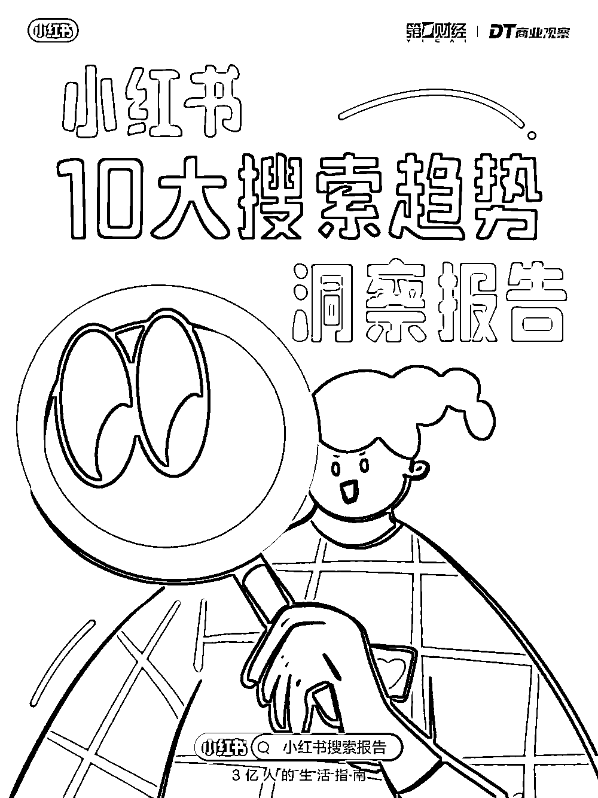

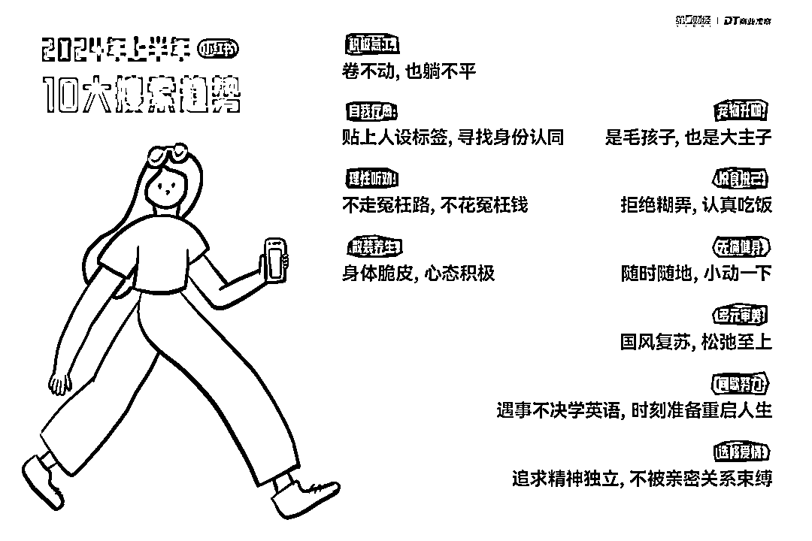

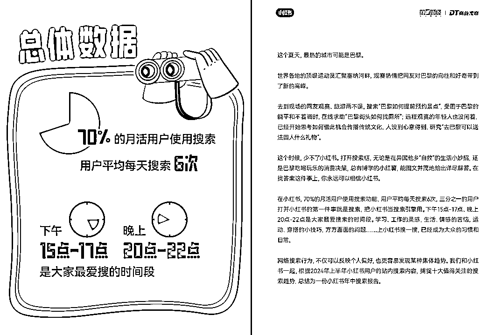

## ***01*** **卷不动,也躺不平**

**TOP3 关键词：兼职 /简历 /摆摊**

这届打工人终于开始对工作这件事本身袪魅,意识到自己可能是 NPC 的一员。不上班是会上瘾的,越是快乐的假期，后劲越大。

“薪贫气和”的年轻人身体在工位,灵魂在找下家。

在小红书上认真搜索有没有什么兼职可以增加收入水平,简历到底要改成什么样才会被 HR 捞,摆摊作为副业到底靠不靠谱,如何才能成为一个与城管博弈时游刃有余的街头 freelancer。

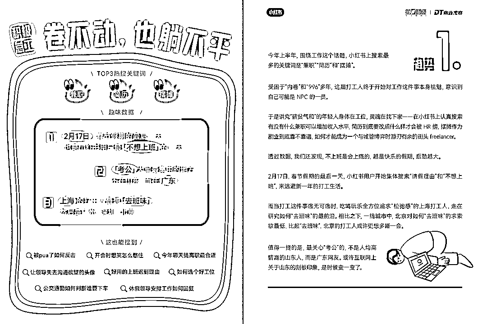

## ***02*** **贴上人设标签。寻找身份认同**

**小红书上最受关注的 mbti: infp infi enfP**

**你是 I 人，还是 E 人。**

这届最受关注的 MBTI 分别是 INFP(调停者)、INFJ(提倡者) 和 ENFP(竞选者),按照 MBTI 的细分,N(直觉)、F(情感) 型人格代表的“小绿人”最爱在小红书自我拆解。

从星座运势到 MBT,为了更好地了解自己,人们一边撕去旧标签,一边给自己找“人设”由此衍生出来的“为ì做 e”“e 言不发”“浓人”“淡人”也成了新的流行语。

不过,在“认识我自己”这件事上,小红书用户搜索的远不止 MBTI

无数个辗转反侧的夜晚,搜索行为承接着用户的 emo 时刻。

刚刚过去的春天,集体失眠和想哭的网友,都曾在小红书上试图寻求自我疗愈的办法,下定决心将自己重新养一遍。

网友们尝试“发疯”坚信“与其内耗自己,不如外耗他人”。

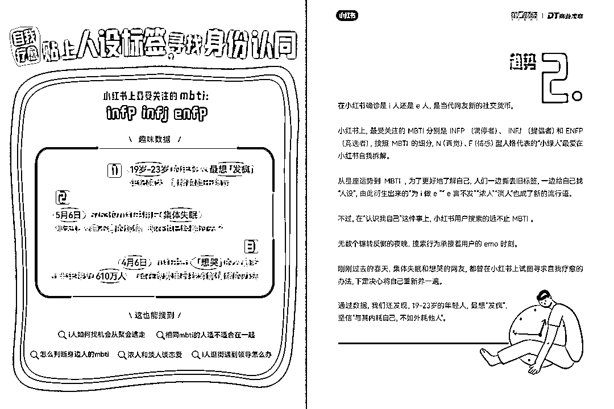

## ***03*** **不走宽枉路,不花冤赶钱**

**新晋热门目的地：小城**

**最受关注的小城：运城 ，毕节，衢州。**

出去玩不可能不搜小红书的！哈哈

博物馆预约抢票攻略、高铁如何快速进站的实操图解、签证材料如何准备、去异国他乡水土不服拉不出屎怎么办、特种兵旅游路线深度度假休闲酒店推荐

只要搜索,就有答案。在出行这件事上,小红书网友通过不断提问,收获极致的效率和性价比。

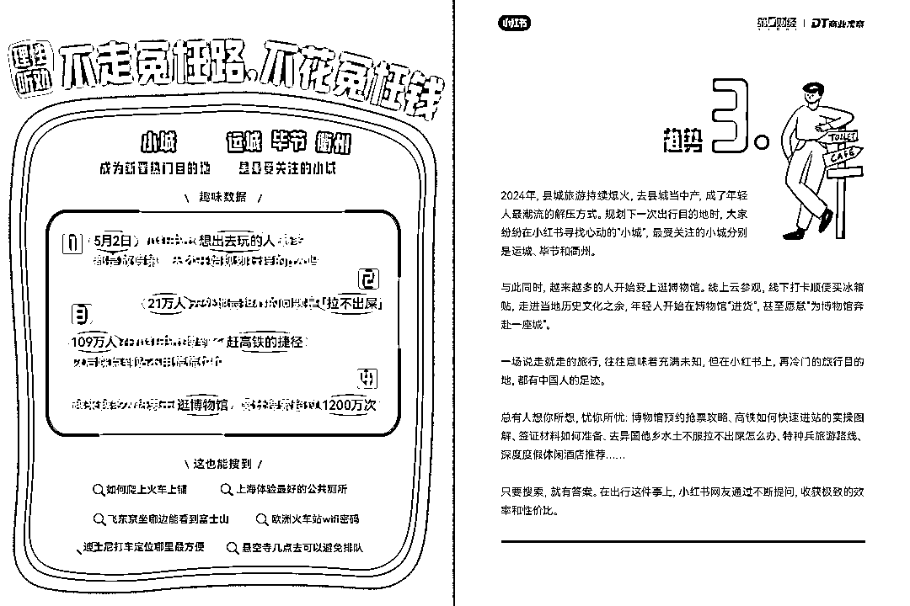

## ***04*** **身体脆皮，心态积极**

**上半年最困扰大家的小毛病：便秘**

哈哈哈哈，真的是万万没想到呢。2024 年上半年,最困扰大家的小毛病是便秘,“大便通畅”成为了一种无声的炫耀。

136 万小红书用户, 热衷于夏天晒背。广东人，最关心如何活到 100 岁。养生类的商家可以把大家的搜索问题结合进去~

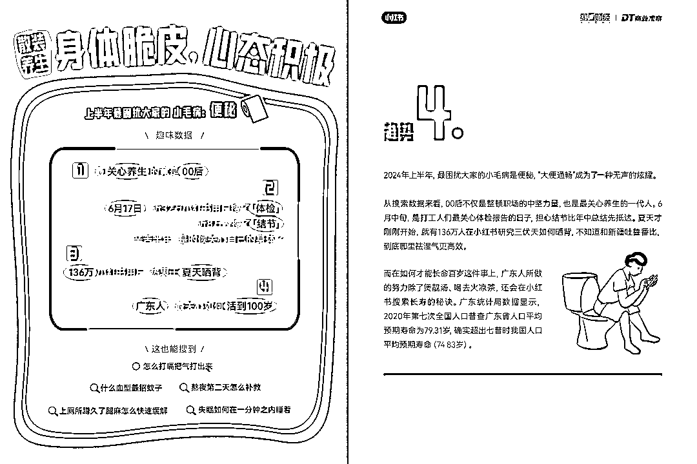

## ***05*** **毛孩子，也是大主子**

**最热门的小狗：比熊**

**最热门的小猫：布偶**

哈哈哈哈，猫党 vs 狗党,猫党胜,猫党比狗党多了近 2600 万。

小红书还肩负起《宠物取名宝典》的重任,养宠人纷纷翻小红书给毛孩子取名。仅 2024 年上半年,就有 4758 只小猫的名字,是小红书用户帮忙起的。

关于如何与宠物相处这件事,大家像新手爸妈一样,认真搜索,虚心请教,问出的问题包括但不限于：我们家孩子能当童模吗?床单被小猫抓破了“凶手”应该判几年?

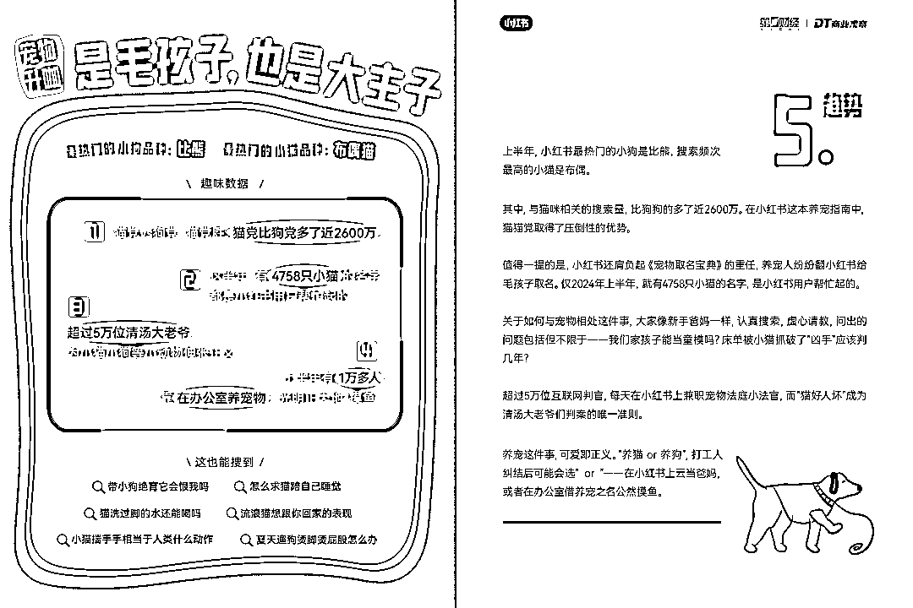

## ***06*** **悦食悦己：****拒****绝糊弄，认真吃饭**

**最多人搜索的一道菜是：可乐鸡翅**

哈哈，我上半年也搜了好几次这道菜。白人饭、酸奶碗和干巴 lunch 再火,都比不上家的味道。

成都人最爱搜“好吃不长胖,把成年人的既要又要刻在脑门上。

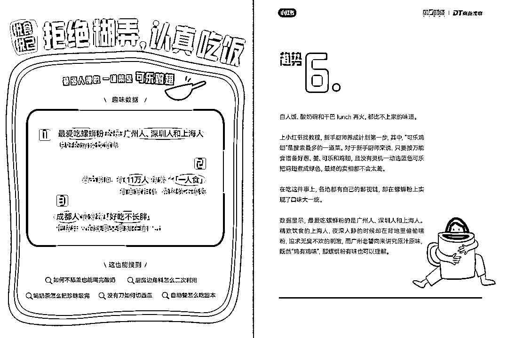

## ***07*** **无痛健身：随时随地动一下**

**最热门的运动：散步**

近 6 万人 最爱的健身地点是“家”，居家减脂，这一块的市场需求是非常大的。

在 Citywalk 席卷朋友圈的日子里,“散步”也成了小红书上最热门的运动。

打开小红书,有人在搜散步路线,有人要找散步穿搭,还有人默默研究散步时的心率多少算稳定、和相亲对象散步聊什么...

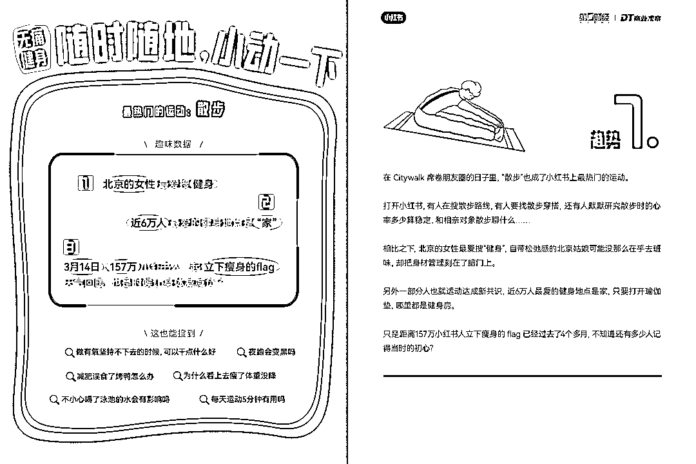

## ***08*** **国风复苏，松弛至上**

**最火的类目：新中式 马面裙旗袍**

至于穿搭，“老钱风”“辣妹风”“侘寂风”都输给了国风。新中式、马面裙、旗袍成了最火类目,成为中式梦核的关键素材,属于中国人的血脉觉醒。

比起高跟鞋，如今的女生更偏爱舒适的运动鞋。上半年,**有近 2 万男生在小红书认真听劝求改造****,**下一个「小艾同学」,就在你们中间。

还有一个有意思的数据，是在夏天大家来小红书搜“羽绒服“，反季低价捡漏。

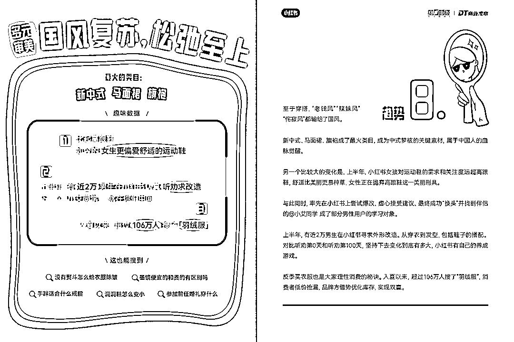

## ***09*** **遇事不决学英语，时刻准备重启人生**

**大家最爱在小红书上学的科目:英语**

对现状不满的成年人下定决心想要做出改变时,会率先从两件事着手:健身+(再次)开始学英语。

在小红书上，重启人生的选项还有了进阶版-一读研。上半年,有 8 万人在认真研究大龄如何重返校园。

不学习就紧张,没进步就焦虑,一生追求成长的中国人,为了哄自己学习,还会寄希望于自律 APP--或许这也是为什么,那个变着花样来提醒你今天背单词的多邻国 APP 能在小红书胜出。

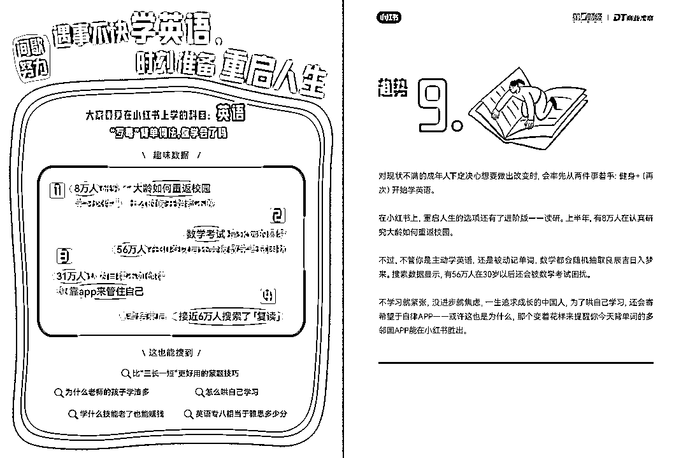

***10*** **追求精神独立，不被亲密关系束缚**

**TOP 搜索词：送男朋友礼物**

“送男友礼物”在情感话题赛道的搜索量一骑绝尘,成为最受关注的问题。不同于直男在电商平台直接搜索“女朋友都感动哭了”小红书女孩选择借鉴别人的成功经验。

有人欢喜有人忧，一部分男朋友们收到精心准备的礼物,一部分“前男友们”在小红书学习如何“求复合”而且这个“心碎”的群体还不小,接近 95 万人。难怪今年做情感咨询的在小红书赚翻了。

而在 520 当天,也有超过五千人在搜索分手和离婚。亲密关系是一生的课题，爱情只是其中的一部分。

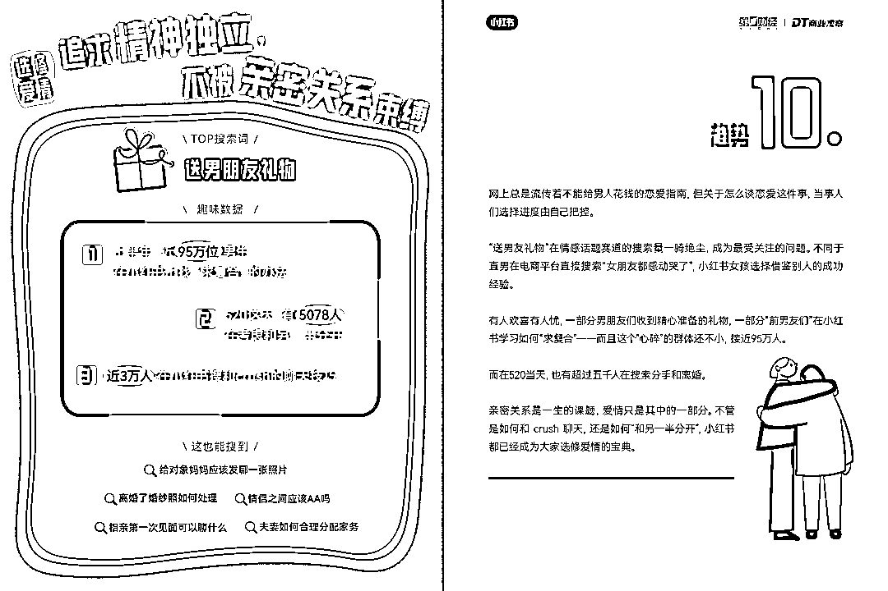

——

以上是这份报告的全部内容，透过这些趋势，是不是发现了不少商业机会？你正在做的业务，可以和哪个趋势结合呢？欢迎评论区聊聊哇~

* * *

评论区：

青城 : 遇事不决学英语[捂脸]太真实了

* * *