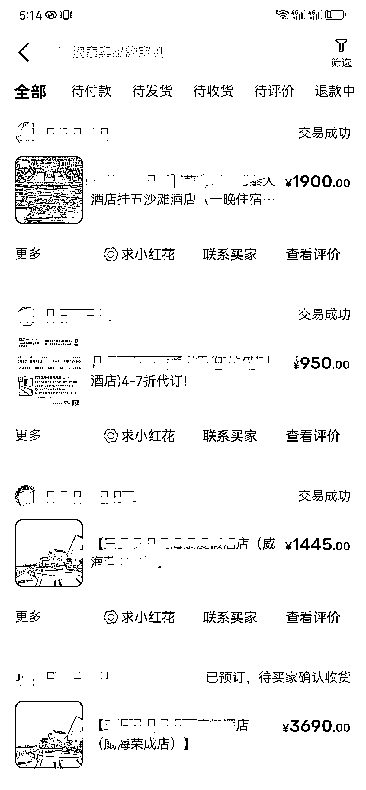
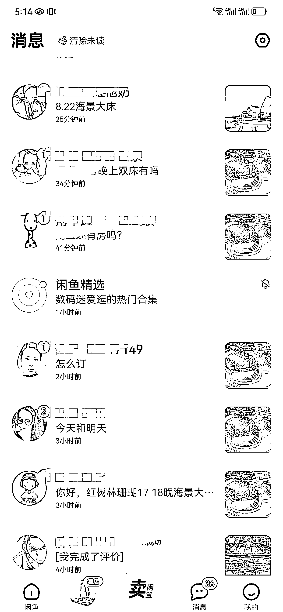
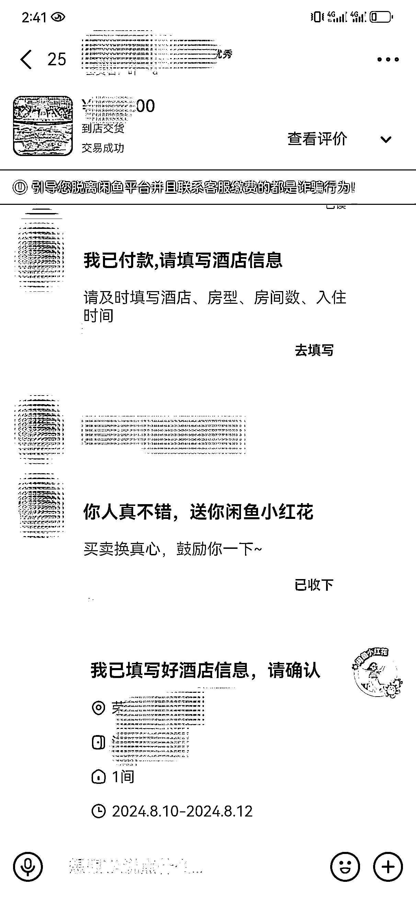
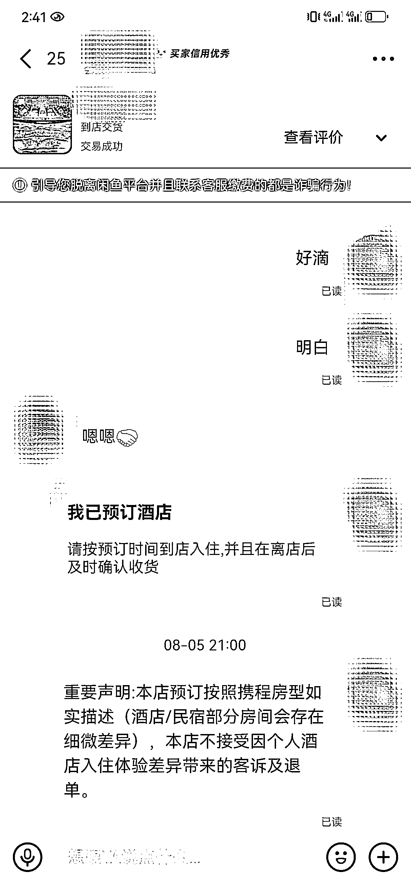
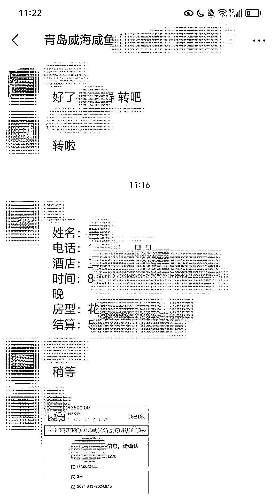

# 闲鱼酒店代定项目，一个正反馈比较快的项目

> 原文：[`www.yuque.com/for_lazy/zhoubao/xcylatyvv1grpxdk`](https://www.yuque.com/for_lazy/zhoubao/xcylatyvv1grpxdk)

## (25 赞)闲鱼酒店代定项目，一个正反馈比较快的项目

作者： 一来

日期：2024-08-13

上次发了个风向标，很多人非常感兴趣。虽然说现在旺季已经过了，但是这个项目还是值得说下。

**因为至少有一点，咱们以后自己出去旅游，定一些不错的民宿和酒店，就可以通过咸鱼或者是小红书拿到便宜的价格，省点钱。很多人其实还不知道这个信息差。**

自己也作为这个项目的实践者，说下这个项目的感受。

**一．项目缘由**

7 月中旬，一个做旅行社的朋友打电话给我，意思是他们在抖音给一些酒店和民宿卖房间卖得非常不错，表示咸鱼和小红书也可以来卖。知道我做自媒体，希望能带一些人一起做。

因为是好朋友，本身对于电商这一类项目没做过，也没想太多，结果朋友太热情，我也不好意思，就带着一些伙伴一起尝试下。

因为咸鱼不需要起号，小红书麻烦点，那么他就手把手带着我做了这个项目。

**二．项目原理及利润**

一些热度很高的旅游景区的酒店和民宿，平时在携程上来卖，是比较贵的，比如我们卖的酒店一间房在 300-1500 元之间。

因为携程平台扣点比较重，加上商家希望能够将更多的房间预定出去，于是便和旅行社合作，委托旅行社来卖酒店房间。

1\. 对于商家来说，可以把携程这些扣点的钱给到旅行社，通过旅行社卖出去更多的房间，降低空房率，提高营收。

2\. 对于旅行社来说，招募更多的人在咸鱼小红书卖房，比如酒店给到旅行社一间房 20%的利润空间，旅行社可以给到咸鱼小红书卖房的人（为了方便，我称为代理）10%-15%的利润，旅行社靠数量挣钱，以及有了数据后未来能够和酒店谈更多的合作，以及更高的利润空间。

3\. 对于卖酒店房间的代理来说，只要发布了，有人问，卖出去，就可以挣酒店房间和携程比的差价。

4\. 对于客户来说，反正都要订房，在咸鱼和小红书找代理来买，要便宜不少，尤其是人多连住的情况。

所以这个项目也就成立了，是可以做的项目。

代理们的利润，做的人少，利润就低。最早我自己的做的时候，一个房间一晚上利润在 100 元，有的客人连续预定 2 间房以及多个晚上，所以一单利润在 100-400 及以上。

后来很多人跟着做，利润就降低了，变成一旦在 50-200 元。（50 元是旅行社为了保持合理竞争，规定代理一个房间一晚上至少加 50 元作为利润。）

当时一起做的不错的小伙伴，10 天的时间差不多在 9000 多的利润，也有 7000 多的，大部分人都能够卖出去。

**三．咸鱼代订酒店项目的优势**

1\. 能够来咸鱼定酒店的人，大部分都是尝过甜头的，也就是之前定过，知道有优惠，所以基本上不需要解释是否被认为是骗子的问题。

2\. 咸鱼本身就有“酒店代订”的服务，所以客人预定后，整个流程都是非常完善的，正规。

3\. 不需要做内容，基本上就是复制同行的酒店信息，标题带有酒店名称关键词就好了，上架非常简单。

4\. 正反馈很快，基本上上架之后，当天就有人来咨询，这种简单的正反馈让人兴奋。有些朋友跟着我一起做，第二天就成交了，所以反馈快。后期要想做的好，需要想办法提高曝光量。

**四．咸鱼代订酒店的烦心点**

1\. 酒店渠道。这个其实不好找，我这边因为是线下的朋友开的旅行社，他们前期和酒店谈好的合作，所以我才有了这个渠道。很多普通人找不到这个资源。

2\. 垫资。这一点需要特别说下。如果不垫资，旅行社担心代理收了钱跑了，或者是客户临时取消房间，代理同意，造成后续工作麻烦。如果垫资的话，代理也怕旅行社跑路，所以这也是这个项目的难点。

因为旅行社是我线下的朋友，认识很多年了。所以这一块的顾虑才会小很多。

一般客户在下单之后，代理提前 2 天将房间的钱（和旅行社的房间结算价，自己的利润留下来），转给旅行社，旅行社进行预定。

客人在住宿离店之后，可以提醒客户确认收货，客户确认了，那么钱能够直接到代理的支付宝里。客户如果没有确认，一般是 3 天内自动收货。

但是不管怎么说，这件事情事需要垫资的。你卖的越多，垫的越多。

3\. 聊天耗时间。代理的决角色相当于电商的客服，主要就是回答客户的问题，大部分是关于酒店的信息，再加上咸鱼 APP 的性质，不像是微信，常常你回复了，客户又不见了，说不定跟其他人讨价还价了，所以是一件比较麻烦的事情。

4\. 是有淡旺季的。这个感受比较明显，因为做的晚点了，7 月底和 8 月初的订单量特别大，后面就少了一些了，毕竟暑假是旅游旺季。但是也问了下旅行社，一年一半以上时间都还不错。比如国庆节，元旦。以及寒假等重要节日，平时也有。

5\. 特别旺季的时候，酒店给的房间数量少。很多酒店在旺季的时候，需求大的时候，自己也会降价卖，给到旅行社的房源就少点。

**五．咸鱼酒店代订的流程**

1\. 和旅行社确定好可以卖的酒店货源，以及知道酒店房间的结算价。

2\. 找到同行发布的酒店信息，直接复制到自己的账号，进行发布，多上一些货源。

3\. 客户询问，答疑回复，报价。

4\. 因为填写的价格并非实际价格，根据客户要的房间数量，以及住宿的时间段，算账改价。

5\. 客户拍下付款后，会弹出一个酒店行程单，代理填好之后，发给客户，客户点击确认。

6\. 代理将客人预定的信息发给旅行社，旅行社进行预定，代理在咸鱼上点击“我已预定”。

7\. 告知客户拿房卡的步骤（有的是前台直接报名字和联系方式，有的酒店是导游提前一天联系）

8\. 然后给客户发送一条“酒店预定免责协议”，避免后期发生矛盾，客户退款之类的问题。

9\. 提前 2 天打款给旅行社。

10\. 客人住宿，离店之后，确认收货或者等待自动收货，完成一个完整的步骤。

六．总结一下

1\. 自己后期定酒店，可以在咸鱼或者是小红书来定，有优惠。

2\. 如果能够签到很好的酒店资源，尤其是一些位置不错的，有点像电商的选品，好的酒店供不应求，只要有房间，都能卖出去。那么可以 3-5 个人小团队来操作，还是很挣钱的。

3\. 如果想要扩大，必须能够拿到足够多的酒店资源，走量。

4.小红书做起来的话，空间利润更大。

因为自己做了差不多 20 天的时间，作为从 0 到 1 的过程，分享这么多，还有很多不完善的地方，后期再补充。

* * *

评论区：

薄荷 Heidi : 很干的内容~~从 0 到 1 的正反馈特别适合新手[鼓掌]
豹子哥 : 刚去前段时间刚去威海，不过酒店渠道蛮难找的，
一来 : 有的酒店估计没有对外合作
牧之 : 可以可以 支持一下
牧之 : 还有本地导游也是有很多资源的 我朋友做导游 我订房都找他 又便宜又好[奸笑]
波本零 : 想问一下我发的品发出去总是没流量，你是一家酒店上很多链接吗
清味 7701 : 威海怎么样，我本来打算下周去的
豹子哥 : 不错呢，景子比较美，随便一拍都是大片

* * *