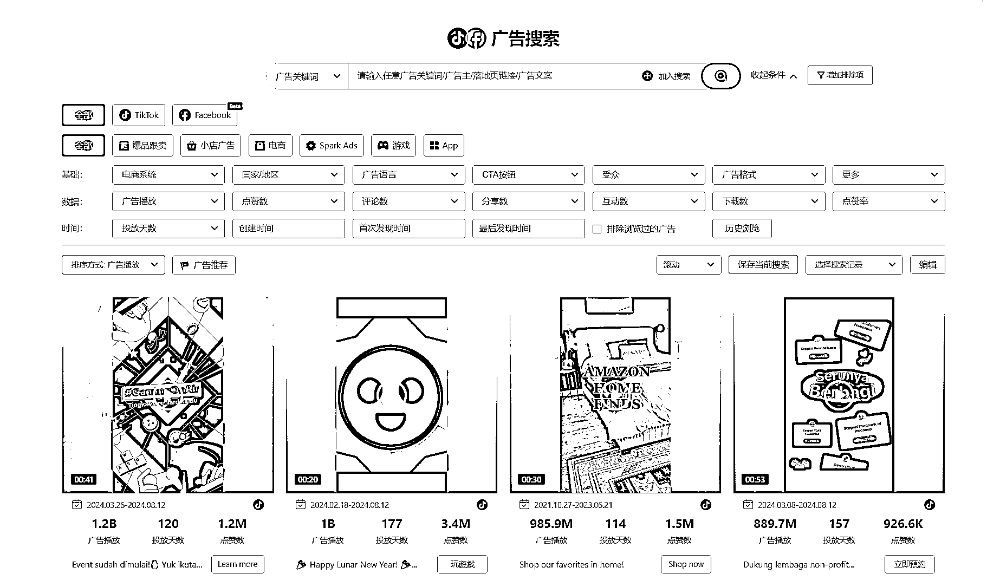
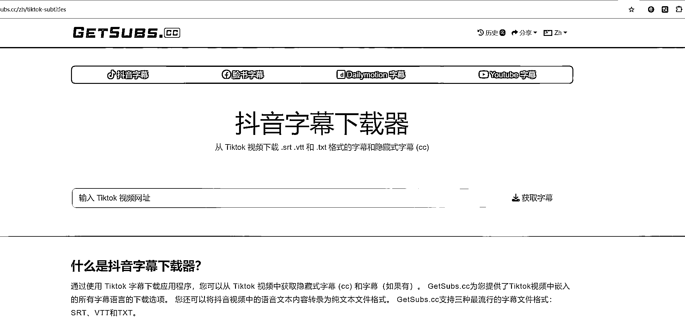
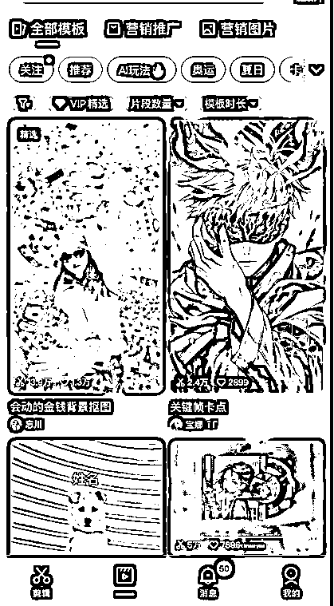

# 人人都能学会的 TikTok 橱窗带货

> 原文：[`www.yuque.com/for_lazy/zhoubao/obtumdtcu1or5gpz`](https://www.yuque.com/for_lazy/zhoubao/obtumdtcu1or5gpz)

## (23 赞)人人都能学会的 TikTok 橱窗带货

作者： 梁小伟

日期：2024-08-12

今年我们发现了一个很有意思的点，自己挂橱窗，有时候 200 播放就能出一单，一方面是随着平台电商标签的完善，电商数据逐渐精准，另一方面，随着平台的发展，玩家们对平台的了解也逐渐加深

不知道你有没有真正的去思考过，自然流橱窗带货的工作流是怎么搭建起来的。

很多商家的卡点，我有认真的和大家探讨过，

第一：很多商家还停留在一个误区，觉得自然流来的太慢了，不稳，对这个渠道不够上心

第二：想做，但又不知道怎么切入，因为做过橱窗的都知道，账号难绑，很容易扣分。

这篇文章，皮皮会用自己的实战经验告诉大家。怎么去解决问题。

关于播放量停留基础流量池 200-500 的误区

不知道你有没有发现，大家纠结网络，纠结各种技术问题的时候，反而没有回归到兴趣电商的本质上，核心还是你的内容问题。

关于玩法的误区

不管达人，广告，自然流，直播。能带来 gmv 的都是好玩法。

一方面，和你公司的战略规划有关联，另一方面，和你团队擅长的点有区别。

不同的阶段做不同的事情。

自然流的带货效果

当我们持续通过 200 播放出一单，几百播放出几单拿到结果后，我发现对于商家来说，这是利好的。

一方面，可以多一个渠道增加 GMV，另一方面，其实它的运营难度并不大。

店铺绑定 TikTok 账号实战分享：

新店铺新手期（普招）

可以绑定一个 0 粉官方号和 1 个 5000 粉渠道号

新手期过后

商家可以绑定两种类型的 TikTok 账号：官方达人和渠道达人。其中商家最多可以绑定一个官方达人，四个渠道达人，但一个达人只能被一个商家绑定，并且在绑定后，1 天后才能解绑

1.  •**官方达人和渠道达人的区别**
2.  官方达人：直接把商家的商品同步到官方达人的橱窗中，也可以通过 Add from shop 把商品手动添加到橱窗、视频和直播中
3.  渠道达人：可以直接在渠道达人的橱窗中，通过 Add from shop 把商品手动添加到橱窗、视频和直播中

注意事项：

官方号可以筛出几个流量正常，播放稳定，基础播放大于 1000 流量的 0 粉账号去绑定

渠道号需要 1000 粉（账号稳定，最新的 app 版本，稳定的环境)

1.  绑定的账号需要符合以下规定：
2.  TikTok 账号所有者必须年满 18 岁。
3.  TikTok 账号状态正常。
4.  TikTok 账号所在地必须与店铺经营地一致。
5.  TikTok 帐号未曾有过任何违规记录。
6.  注意：
7.  TikTok App 是最新版本
8.  选择合适的网络环境扫描二维码

### 第一步**打开 TikTok 商家后台绑定 TikTok 账号**

点击我的账号>绑定 TikTok 账号>绑定新的 TiKTok 账号

### 第二步**根据指引完成操作**

打开 TikTok App >扫描二维码> 确认绑定

### **Step4：授权绑定**

确认信息>点击【授权】

### **绑定中常见问题**

1.  绑定失败可能是哪些原因？
2.  当前网络地址与经营国家不一致；（选择与经营国家一致的网络环境）
3.  TikTok 账号未满 18 岁；（查看 TikTok 的年龄设置，若账号年龄设置≥18 岁，可建立客服工单处理）
4.  店铺状态或 TikTok 账号状态异常；（检查店铺状况与 TikTok 站内信通知）
5.  TikTok 账号已被绑定；（1 个 TikTok 账号仅能被 1 个店铺绑定）
6.  账号有隐性风控（内容，违规，流量异常）

实战经验篇：

经过我大量的测试。我店铺推广喜欢 15 个账号一起去推广

其中有官方绑定的账号，也有自己打的达人账号。

我目前的账号配置比例是 2:2:9

1 个官方达人号 1 个渠道号 （新手期只能两个号）

2 个 5000 粉达人号

9 个没有电商权限的推广账号

这个配置是最低配版，并且我们拿到结果的模型。如果有更多的号和电商权重的号，那肯定是越多越好。

后续我把达人 4 个号统称为橱窗号

其中橱窗号一定是主力。因为是可以直接转化让客户下单的。

而其余 9 个没有电商权限的推广账号，有没有效果呢?

我今天可以告诉大家，有，并且效果特别明显。

首先先拿一个新店铺来举例，这个店铺的数据如下：

这个店铺起店纯自然流橱窗带，半个月的效果，第 10 天迎来爆发。

其中视频占比 33.9% 商品占比 66.1%

商品数据如下：

其中有一万人，其中有 2500 美金的 GMV 是搜索带来的。

搜索趋势图：

目前最大的问题，就是电商权限账号不好开。

包括渠道号，经常会出现这个问题

所以我新店起店铺的时候，除了橱窗号，会结合打一批白号去做搜索和曝光

我在这里说个直观的数据。

你让团队一下子就想打几十万播放或几百万播放的带货视频，说实话还挺难的。

我用 9 个号去发，每个号每天三条，每条播放 200-1000 播放

那我一天能曝光 5400 个人-2.7 万个人观看。

一个月也有 16 万-81 万播放

这是很理性的数据，我抛开期间打爆的一些极个别素材。

单独做这个事情，我一个月能获取几十万流量。

好，当我们梳理完了之后，肯定会有很多人觉得这个事情还是做不大。

接下来，我分享关于这种非橱窗账号的细节。

1：关键词 seo 优化

从标题到内容-标签全部埋上你的店铺或者商标关键词

2:视频素材标签：

视频场景放入 TikTok Shop 商品页或者你的下单页截图

3：埋用户常搜关于你的品类的热搜关键词

如拖鞋：

最好穿的拖鞋

质量最好的拖鞋

云朵拖鞋

情侣拖鞋推荐

蓝色拖鞋

当你理解了这个逻辑，那我们来聊聊内容侧

我可以跟你们说一个数据，其实带货视频我们录制一个小时的素材，可以生产出几十上百条高质量的素材，混剪出上千条粗糙的素材。

我们是怎么做的，基本上所有的广告创意来源于 pipiads，大多数的脚本也来源于 pipiads，可能你们会觉得我是推广皮皮，这一方面的因素肯定是有的，但最重要的，确实我们自己去执行的使用，就是用了这种方法。

为什么是 pipiads 呢？

pipiads 上面所有的素材，都是花钱投广告的，而且美区通用 cpm5-20 美金 1000 个播放。

抛开大品牌，像那些大结果的视频素材，能放这么大量，这一点他们的广告创意就是值得研究的。

因为付费广告，付费流量。这一批人能赚到钱，他们的广告创意是花钱总结出来的，为什么不学习。

我带的内容，纯小白，可以说是网感都弄不明白的人，对互联网一窍不通的。

我花了 4 个月的时间，到现在他们可以很兴奋的跟我说，今天某个号又出了 10 单，某个号又出了 14 单

互联网的创意素材玩的起飞

第一步打开 pipiads

找到哪些投放很猛的广告主，收藏你觉得不错的广告创意。

好的广告：可复制-可迭代

第二步：皮皮复制文案链接，下载他们的文案，

第三步，拿到 GPT 去帮你总结脚本和延伸脚本框架

总结脚本核心：

钩子（前三秒）

视频讲的分镜故事

营销引导关键点（几秒到几秒放什么文案，什么时候开始解说，第几秒图标引导小黄车）

提炼脚本框架：

如描述痛点+产品功能+使用场景

拍摄测：

1：同一个场景可以多个账号使用，你可以拍 1 小时，切 10 个号去发，是有播放的。但不要一个号反复发，会有一定概率掉车和判低质量

2：拍摄的场景近中远都可以同步进行，期间可以 pdd 买一些微场景结合

3：拍摄的时候可以加一些动作，特效，切镜（如倒放，旋转）

剪辑测：

这个我真没什么好说的，多看多学，多模仿。

混剪目前市场上常见的手法：

缩放，加速，翻转，拉伸，碎剪，加边框，打乱顺序，贴纸，滤镜，文案，配音，抽帧

温馨提醒（大量的创意模板，如剪映，可以用效果很好，像一些绿幕模板

内容的批量化：

其实很多人做内容都会有误区，不知道 可以产出什么内容。

现在展现形式，无非图文和视频

图文：把你的商品图做图文卡点，是不是变成了一条素材

视频：学会用 ai，例如最简单的可灵 ai 生成一些老外真实露脸的视频做背书（效果很好）

关于放大：

很多人对自然流的看法就是觉得见效慢，放不大。

你可以试试听听我的理解。

玩法一：没有挂车的视频

一些播放比较优秀的视频素材，24 小时内可以加热刺激

1 选择 tt 做号自然流量好的视频，比如在 2000--5000 播放左右

用 20-30 美金去建组 ，刺激自然流量 拉到下个流量池持续引爆，我测试过十个视频

最好的一条从几千播放，加热了三十美金 几天翻了几千倍，点赞 12 万

正常的翻了几倍，十几倍左右

：比较吃素材本身质量，核心基于高质量视频素材（看自然流量趋势），然后去投互动

：一旦自然流量被成功刺激到，又是赚了一波流量

；没必要刺激 500 播放的，这种加热也没用，至少要推到那种二级流量池，2000 播放左右的，看点赞和评论数，有些互动指标少，你投流刺激一下，又继续拉流量池

广告流量撬动自然流量，本身就是可以撬动的，国内的玩家应该不陌生。

再次强调

第一，一定是素材

第二，看前期自然流是否有一定基数，建议二级流量尺池 标准是不到 5000

账号随时盯

盯着主要看播放，比如正常投互动，在人群受众不变的时候，你投 20 美金，系统正常给你 1 万播放，但是这个时候你发现视频已经到了 2 万甚至更高的时候，这就刺激成功了

就停掉广告，等订单就好，这种情况不知道视频播放能走多远，取决于素材

玩法二：挂车的视频，出单效果好的素材

直接投流拉量，这里我就不过多说了，具体可以去看我往期的文章。

这样去辅助做，就是自然流的一些心得和思考。

* * *

评论区：

冬日暖阳 : 怎么玩 tk 带货
冬日暖阳 : 感觉 tk 难玩

* * *