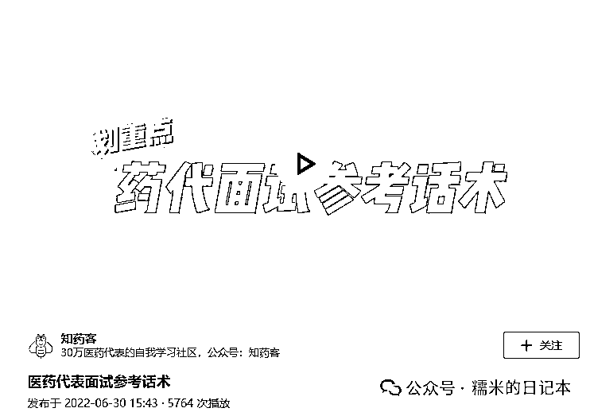
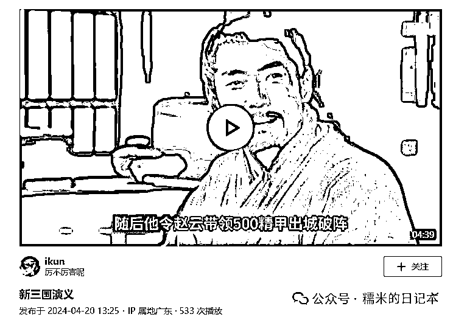

# 全自媒体平台，陪诊账号调研（4）

> 原文：[`www.yuque.com/for_lazy/zhoubao/urf6kr41icnen0by`](https://www.yuque.com/for_lazy/zhoubao/urf6kr41icnen0by)

## (12 赞)全自媒体平台，陪诊账号调研（4）

作者： 糯米

日期：2024-08-12

**糯米认为，作为陪诊行业的操盘手，一定要掌握最新的行业动向，其中就包含了陪诊自媒体获客，即**

陪诊行业，近期大家都是在怎么通过各种自媒体平台获客，获客做得怎么样，都在怎么玩耍？

前阵子，糯米把微信生态，抖音，所包含的陪诊内容/账号情况都扒了一遍，今天来扒一扒**知乎**

（ps.今天终于完成啦！！！！！哭死，最近忙爆炸~~~~~）

还是老规矩，我先讲我调研出来的结论

陪诊行业，在知乎上，内容和用户都是少的，但我们能在 2023 年以前看到比较不错的流量痕迹，只是在 2024 年绝迹了，但类似行业也有这样的情况，因此，糯米分析，我们曾以为，知乎是不管控我们，因为他从不通知我们违规，但事实上，人家只是悄悄不给流量，无论是图文也好，回答也好，视频也好，都没有什么流量

OK，现在我们来细说过程

在平台上检索“陪诊”，是这么个样式

首先，最上面的分类有

综合，用户，话题，视频，专栏，盐选内容，电子书，有这么几个栏

**我还是选择先看用户**

因为以“陪诊”为昵称的用户数量多与少，能在一定程度上反应这个平台的行业拥挤程度

陪诊账号首先是能穷尽的，总共 200 个账号左右

这其实也就说明了这边暂时还没有大量的垂类用户涌进来做内容获客，粗看是个蓝海平台

然后我们对这些用户进行简单分析

这些是我上次刷完了当时的全部用户后，摘出的部分用户

都是有一定的粉丝量（相对而言），有输出过一定量的内容的，但他们的内容几乎都没有得到很好的反馈

比如点赞量几乎都是寥寥无几，收到的喜欢也并不多

略举几位

先不考虑创作者个人的内容能力如何，但起码我们能看出，目前知乎上没有做陪诊内容很出色用户，没有人通过这个平台拿到大量的曝光和关注（起码在昵称有“陪诊”这个词条的用户里没有）

**接着我们讲一下话题这个栏目**

之所以第二个讲**“话题”**这个栏目，是因为糯米经过研究，发现通过话题，可以挖掘隐藏的陪诊同行

**如图，先通过话题这个栏目，找到讨论数多的，浏览量高的陪诊话题，进入话题之后，选择精华**

（ps.讨论也就是帖子，相当于我发了一个帖子，关联了某个话题，这个话题之下，我这个帖子就是其中一条讨论）

**精华是按照高赞排序的**

如果出现了一条陪诊领域的高赞帖子，起码说明贴主在陪诊领域是有点东西的

这个时候挖掘出来的账号，就不会像刚才我们检索“陪诊”用户一样，受昵称限制，必须包含“陪诊”这个词条了

**那这个时候，我们就能看看这个获得了高赞的宝藏博主，在陪诊领域最近做得咋样，有没有什么独家手段来玩陪诊内容**

但是观察过后，我也有点失望

观察过这些获得过精华的账号之后，我发现

垂直做陪诊内容的账号很少，或者说，垂直做陪诊的没啥好反馈，大部分都是非垂直的，而且非垂直也没有做得多好

比如这个精华帖主，她获得的高赞精华帖是，《陪诊师小白如何入门》，内容就是列举科普，也不需要很会写作

博主总共发文有 2，除了刚才那个，剩下的一个是关于买摩托车的，这类账号我归类为素人账号，更新随心的

也有类似于这种，官媒类型（也不一定是官媒，但差不多）

陪诊只是他们日常报道中的一次报道而已，对于我们来说参考性也不大

也有这种

樊少这个 IP 在 B 站做得好像还行的，但是后来确实也是从陪诊这个细分赛道脱离出来了，看他现在的定位，也是以副业/赚钱为定位，而不是仅仅陪诊一个范畴了

而垂直类型的呢，像是这几个，大多是以机构为主体身份的（或者以机构中的个人为 IP 形象），但几乎没啥好看的数据，还比不上素人号

**那糯米得出结论，正如之前所说，垂直的没啥流量**（最后一张截图的账号，最新一条文章是有不错的数据的，但是是 2022 年发布的）

OK，挖掘陪诊用户这个事儿，我们就不继续研究了，继续聚焦话题这个栏目

糯米发现，陪诊相关的话题也是有穷尽的，估摸着 2-300 个话题

但我对比“医药代表”这个词条，发现这个词条相关话题也不多，也能穷尽，而且有很多是书籍话题

综合了糯米在这个平台反复滞留了三四天的思考，我认为，只能这么评判：

**一个关键词检索出来的话题量多还是少，其实不重要，看有没有大曝光量/大讨论量的话题即可**

哪怕关键词检索出来只有 10 个话题，但如果四五个都是十几亿的曝光，几十万的讨论，那也不影响，对么？

**果不其然，陪诊的相关话题曝光量合计不超过 500w，讨论数（帖子数）合计不超过 1w，而医药代表的相关话题仅一个就秒杀了全部的陪诊话题累计量**

**2.8 亿浏览+14.2w 讨论**

结合以上的情况看，我们先初步得出结论，无论是陪诊账号数，陪诊内容，在知乎上都还蛮贫瘠的

接下来我们去看视频这个栏目

同样，也是能穷尽也，从上往下扫了一下，大量的内容是 2022-2023 年的，2024 年的几乎没有，而且几乎所有的内容，点赞量都是 0

最高的点赞量也就是这个视频了

但也是个非垂直类账号！

不过在视频这个频道，糯米是发现了东西的！

请仔细看完如下图片，仔细看他们的日期，以及视频播放量变化

2022 年-2023 年年中，虽然陪诊领域视频没有在平台上大爆，但光是看着这段时间的视频曝光还是很香的，很容易拿

但是从 2023 年年中开始，流量就断档了，甚至没人更新了

张景南还是抖音上的大 IP，在知乎上的短视频也同样如此

不过我们要考虑一个问题，就是 2022 年，2023 年毕竟隔了 1-2 年之久了，之所以数据不错，有没有可能是因为长尾流量带来的增长？

OK，糯米马上就去探索了这个问题，类比其他词条

**“医药代表”，“育婴师”，“执业药师”**

糯米从词条属性都属于职业身份的维度，挑选了这几个词条，也是生活中我常用到的词条，也都还算是小众

综合下来讲，有这么几点

1.三个词条下，2022 年以及之前的视频，2023 年的部分视频，都是有不错的流量的

2.唯独在 2024 年还算坚挺的，还算正常的，是执业药师，而育婴师视频曝光量死在了 2023 年，医药代表死在了 2023 与 2024 的交界点

3.似乎 AI 数字人短视频在平台上不讨喜（医药代表词条的 2024 年 AI 数字人视频观察到的，不代表其他行业）

略举几例

如果硬要说是因为词条小众，以此来考量平台的限度是不具代表性的，那我给个稍微好一点的词条

**“三国”**

时间是 2024 年 4 月 20 日，播放量 533 次，这个播放量才是正常的，也足见代表性了

最后，糯米收个尾吧，剩余的部分也没有太多能讲了

电子书板块，主要是作者通过在平台上写付费电子书，用户有兴趣可以付费看，但是在陪诊领域，这个栏目也就这么一页可以看看，而且符合上述规律，2022-2023 是有一定流量的，2024 没有人在继续输出了

盐选内容跟电子书是同款内容，没什么变化，我也不太明白为什么重叠

盐选下面的 3 条筛选范畴可能是最大的区别了，但糯米一一点进去看过了，也都没啥陪诊内容

剩下的就是综合，以及专栏了，我先说专栏

专栏的里内容依旧不多，但可以通过专栏找到一些创建了陪诊专栏，且持续更新的博主，比如这位 IP 是北京男护的博主

**不管目前平台上用户的内容多么乏力，多关注同行肯定是没错的**

最后，**综合**栏目能聊的就多了

之所以能聊点东西，是因为综合栏目配备了筛选功能

那我认为比较好用的是“最多赞同”，“最新发布”，“一天，一周，一月...内”

**就是看看最近行业内也没有好的内容出现，如果出现了，可能是平台松口了，也可能是新的规避平台打压的办法出现了，我们要及时学习，就算是没有出现机会点，我们也应该保持对同行最新动向的关注**

通过对最高点赞，糯米发现，时间分界点依旧停留在 2023 年，2024 年之后就没有什么高赞内容了

通过看最新发布，其实我们能看到近期陪诊领域的创作内容活跃度

但目前是没有什么新内容的，大家似乎都停滞创作了（也有可能是检索不到）

其实近期小伙伴也跟我说，说是这个平台发展其实很乏力，很多内容创作者都不愿意来持续深耕这个平台了

郭拽拽老师也是一样的说法

文字固然永恒，但是载体会改变，短视频的形式是获取流量的新时代方式了

我也去查阅了芷蓝姐的账号，作为 1.7w 粉的大 v，其实也很难每篇内容都能有不错的流量的

而且，以芷蓝姐的内容能力来看，做到这些个粉丝量都如此不易，就算做到了，也很难获得大的基础曝光量，可想我们这些凡人呢

（ps.话又停不下来了，原谅我逼逼赖赖给你们多塞一点信息吧，555）

但我仍不死心，毕竟知乎还是很出名的大平台，也不至于那么差吧，然后我开始针对平台分析

于是我开始关注平台的热点内容创造者，准备找找大 v

我首先考虑了，首页的推荐问题下面的回答大多点赞不错，以此为切入点，多去看看，但是进一步挖掘，作者不一定都是大粉丝量的

也就是说，这个平台的推荐机制跟短视频推荐机制差异非常大，我们经常被推荐的短视频都是大 v 的，只有少量的素人内容会推给我们

**但知乎不是，话题下的内容几乎大部分高赞的都是小 v 写的**

思考后，我觉得逻辑是这样的

如果是通过回答问题获取曝光，那么所选的问题热度高，一定能更容易获取曝光，但既然是热点问题，下面讨论的人就是多的，你必须从中脱颖而出，如果个性不足，内容不够强，那也很难吸引关注

甚至我们都应该更多考虑，这个粉丝量在知乎上是否有那么重要（感觉这个平台还是以检索为主，用户会带着目的过来）

此外，在知乎上，我们可能会想到，是否提出一个好问题，也能获得很好的流量？

但我去挖掘了一下机制，提出问题的人是被深度折叠的，你不是刻意去查，是几乎找不到的

总之，有不少用户提出了热门问题，但是粉丝是个位数的，也有不是热门问题，没几个人关注，但却出现了流量很高的回答的，但目前我没有看到流量很高的文章，单靠文章可能很难获取大流量吧

以上内容是糯米拖了 5，6 天的知乎陪诊动态调研，希望能给对陪诊感兴趣的人提供价值，并且糯米也励志做陪诊行业的 top，真的就是如我每条短视频后所说的，有陪诊问题关注我！感谢~

* * *

评论区：

暂无评论

* * *