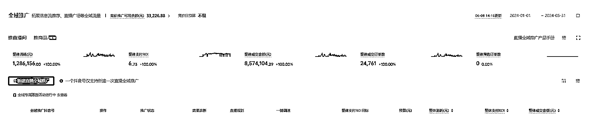
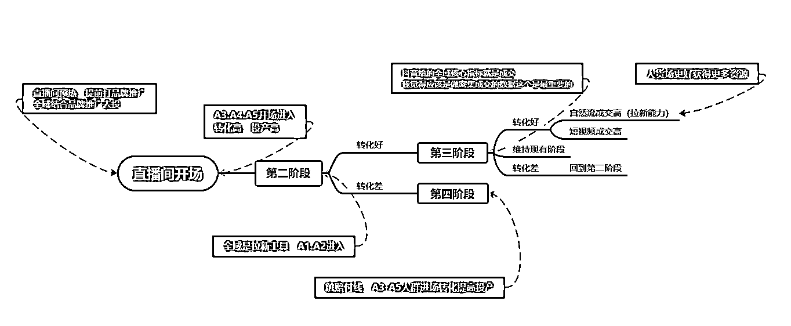
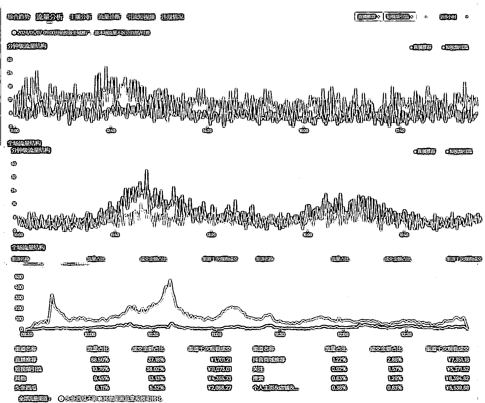

# 抖音全域如何做到 10 倍增长

> 原文：[`www.yuque.com/for_lazy/zhoubao/wkrqyfxb2hwyb3f6`](https://www.yuque.com/for_lazy/zhoubao/wkrqyfxb2hwyb3f6)

## (7 赞)抖音全域如何做到 10 倍增长

作者： 李谢谢

日期：2024-08-15

大家好，我是李谢谢，很久没有来生财分享了

今天想和大家分享的是最近收获很多的全域推广，也以点带面和大家分享一下抖音我们现在整体的一个打法，希望能对生财的伙伴们有些帮助

这篇文章从 5 月份就开始断断续续在写了，本来标题想换一个，现在抖音确实太难，特别像标题党了

后来我觉得十倍增长也不一定是增长，他可以是原来亏钱到现在哪怕挣一块钱，也算增长很大，能留在牌桌上，总会有机会的

并且即使现在这个环境也一定要思考要怎么挣钱，这样你才能挣到钱

我身边很多朋友这两个月都陆陆续续倒闭了，从来没有这么多朋友转行去别的平台，这个 618 成了压死骆驼的最后一根稻草，虽然这种大促一直和抖音没什么关系，但就像溺水的人能抓住什么是什么

**不亏就是血赚，活下去成了现阶段的唯一标准**

目前我在做的是**抖音品牌自播，高客单温州快返女鞋（我们打法都是围绕这个方向来，不同的类目可能玩法不一样，自己因地制宜）**，我们自有合作工厂自有品牌灵活性高，高客单高毛利高退货，短视频和商品卡可以平一些直播间退货，总体大概退货 60 左右，利润都在退货，这半年几个新店直播间平均投产的话大概在 6.5-8，7 算是直播间及格线

全域的出现让退货高这件事有了更多玩法，他不一定可以让你挣多少钱，但是一定可以让你少亏钱

我们几个店铺玩法都不太一样，但是我觉得目前结合全域增长最快的就是通过全域直播间做商品卡冷启动，直播间做不好可以亏钱，但是要通过商品卡来赚钱，算好两边的平衡点，和小二交流下半年也是以货架电商为主，所以这块还是可以多多尝试的

**一，什么是全域推广**

以抖音直播整体支付 ROI（直播间产生的全部成交订单金额 / 消耗）为优化目标，拓展抖音信息流推荐、直播广场、商城、搜索等直播全域流量，探索全局优质流量，带动直播成交额全面提升的产品

我觉得这里面是有几个核心点是需要注意的

首先第一个点是稳定，ROI 而非成交，我会觉得这是一个稳定的产品，所以你想通过全域来短期扩量，全域是做不到的，他是有个探索过程的，当然可能因为我们本身客单价比较高的关系

我自己在做了这么久，我觉得他是一个慢产品，会有一些启动期，以及测款转款都很慢，一个产品的测试尽量要给到三天，所以这里我觉得全域很适合做单品类直播间

第二个点就是合理，合理去花每一分钱，降本增效

当然合理在直播这种动态化本身就不合理，他毕竟是机器，无法像人脑一样有情绪波动，去思考，去想，去根据直播发生的每个点进行优化和迭代，但是它可以做到 70%的事情，这对于大多数人来说就足够了

***把重心放在内容，全域一定是未来，让兴趣电商回归内容本身，差距也是在内容拉开***

**二，为什么要用全域推广**

2.1 调控全域流量

全域推广打破付费与自然的流量划分逻辑，释放全域流量价值，撬动自然流量。

标准推广是有针对性地优化付费流量，全域推广则不再区分付费和自然流量，而是以直播间整体 ROI 为投放目标，统筹并布局抖音信息流推荐、直播广场、商城、搜索等抖音直播间全域流量。

其实大家最后的期望肯定还是希望通过全域去撬动自然流，我的看法是，你要用付费的动作去做自然流直播间

该憋的还是要憋，核心的标准就是密集成交，且赛马机制不变

2.2 扩大 GMV 规模

贴合商家整体生意目标，关注抖音电商全域 GMV，标准推广所表达的多为过程指标，而全域推广下的「直播间整体 ROI」为结果指标，可以直接设置其为投放目标，通过 ROI 设置兑换更多 GMV，最大化提升直播间生意规模，更贴合全局生意视角。

这里重点想表达一个点就是全域的 ROI 是结果，是做不到就面临赔付的结果，现在新出的拿量建议功能会告诉你多少投产能提高多少量，这个不是特别准，因为直播间本身是动态的，这个直播间肯定你比它了解的多，所以还是需要根据自身的状况进行改变

2.3 一键启动全程调配

投放效率效果双向提升，一次表达全程调控：标准推广需要产品组合搭配并做精细化投放，启用全域推广仅需设置符合利润投产比的一次表达，投前计划设置简单，投中系统全程调配盯盘，实时优化，有效提升投放人效。

总结就是操作简单，系统可以自己优化，帮你解决人效问题

但是这个点其实在前面说过，他毕竟是机器，无法像人脑一样有情绪波动，去思考，去想，去根据直播发生的每个点进行优化和迭代，但是它可以做到 70%的事情，这对于大多数商家来说就足够了，可能大多数商家本身都做不到 70%的水平，现在用了全域直接提到了 70%

这里还有个点想分享一下，你主视频在有段时间跑的不好或者换主播换岗的阶段当中有一段时间探索不出来，它其实就比较难跑了，可能还会出现本时段直播间低效，这个时候的主视频越跑不出来我个人反而会去放量，因为只是阶段问题，通过放量帮助它做决策提前进入正常的节奏，包括从云图看主视频进入衰退期，也可以通过放量延缓衰退

而且有很多人全域新视频会比较难跑，你发现你跑了几个月还是一开始的主视频在跑，我感觉全域给新视频探索的空间不多，还有就是投产太高了，新视频给不到容错，比如你主视频设置到 7 还能跑，你拿 7 的投产去跑新视频我觉得还是挺难

但是其实从另外一个角度看，ROI 设置到 7，这个 7 是一个全局的概念，并不是单个视频到 7，新视频全域自己本身肯定会给到更多机会测试，要不然就不能形成正循环

但我发现全域跑出来的视频，相较于标准真的少了特别多，所以我建议在进全域的视频都会先过一遍标准，有了数据这样会好跑很多

现在商品全域也推出来了，你完全可以拿新链接标准过一遍视频，有了销量以后，新链接和新视频再扔进全域会更好，全域和标准一定都要用起来，测新在标准，稳定在全域

2.4 高效拓新，提升 GPM

全域推广可以有效提升新粉和新客成交，拉高直播间 GPM(千次曝光成交金额)，拓展更多高转化流量。

由于全域推广通过拓展流量增量为您扩大 GMV，因此会触达更多原本没机会触达的高转化价值用户，从而带动更多新客和新粉的成交，同时提升直播间 GPM，让流量价值更大，让直播间竞争力更强！

这里想和大家分享一个点，就是很多人说全域就是收割你的 A3 人群，所以现在有很多人结合云图，做 A3 增量营销，通过达人短剧等等结合全域收割，这个我们也在做，但是我依然会觉得全域最重要的是拉新工具，每场直播依然会有大量的 A1 和 A2 进入，或者换个角度，全域会强迫 A1.A2 进入，但是因为我的直播间的人货场只可以收割 A3 人群，所以会觉得他只是在收割 A3 人群，当然并不是说这样不好，你完全可以重心在营销，直播间用来收割 A3 还有就是我们的客单价比较高，是有一定的决策周期的，所以更应该关心的不是单场数据而是 7 天的一个数据

说到营销，这里扯远一点，就是很多人特别倾向于做好营销，重金砸营销，但是我觉得他从来不是单一某个点的问题，温州鞋大家都懂，这个产品质量的营销完全没有意义，还有如果你主播不行，即便到了直播间转化率也低，从而增高转化成本，所以这三者我觉得不是某一个点特别重要，而是相辅相成的关系，从云图判断营销数据然后结合直播间收割，这个逻辑本身没毛病，我觉得营销本身是第二梯队的东西，核心还是人货场要优秀，他是增量

并且营销需要结合一个生命周期长的产品，或者你期望把它做成一个生命周期很长的产品，但是女鞋确实不适合的

**三，全域推广下的直播间/短视频**

3.1 直播间

我们可以看这个图，全域形态下的直播间大概分为以下这三种直播间，很多人说我做自然流了为什么还要做全域，自然流没有稳定性，但是全域可以给你兜底，保持一个稳定性，同水平情况下，这三张图最大的区分就在于主播，主播强弱决定了直播间的玩法

我们在安徽，电商的生态环境不是很好，人才很缺，同样招十个人的抖音团队，在杭州和在这边招的质量完全不同，当然各种成本和结果也完全不同，可以说大家根本不是一个水平的

现在整体大环境差给不了高工资，有的人可能高工资拿习惯了，总把红利当能力，于是就更缺了，因为缺乏人才导致业务团队水平降低，所以业务难启动，难挣钱，恶性循环，当然做电商这件事到如今本身就已经很难了

直播间跑量拓客，品牌沉淀商品卡收割挣钱，再加带动品牌电商全域增长，这应该是很多品牌想做的事情，但是在直播间挣钱这件事就掐灭了很多商家

如果直播间不挣钱，就形成了一个恶性循环，引出一个问题：直播间到底要不要搞？

不搞的话营销流量引到哪里？如何短期测款？款测久了料子怎么备？去那里还有抖音这么大的流量扩大品牌影响力？尤其品牌方需要你冲量怎么办？等等

还有个点就是如果直播间不搞，高客单不是低客单，不靠直播间推新链接/新款度过冷启动，纯做链接度过冷启动我觉得是一件很难的事情

搞的话月月亏钱亏的最多，人效还高到爆炸，一到算账，各个平台都挣钱，就抖音亏钱，不说亏钱不亏钱的事情，天天早上 6 点干到夜里 2 点，最后心态都崩了

干最重的活，熬最深的夜，背最重的锅，把团队开了，下一个招的说不定还没这个强

所以就导致了很多人有了一个思路，我直播间可以不需要挣钱，让直播间测款，拓量，承接营销流量，扩大品牌影响力等等，走完工序交给挣钱的平台挣钱，以淘宝为例我们做好承接可以拿到 6-8%的溢出流量（随抖音增长而变化）

全域本身带来的影响，其实不止是抖音，而是全渠道的影响，既然抖音那么难挣钱，即便亏钱也要有亏钱的价值，能给品牌本身带来的增量或者能给团队带来的成长做平衡

最后从整体看是挣钱的，但是每个人肯定是希望抖音本身能挣到钱，那全域其实就是一个非常重要的拐点

3.2 短视频

短视频肯定是整个全域的核心

短视频就是标签，短视频是由无数个标签构成的，这个标签会有密密麻麻的方方面面

很多人刚用全域的时候会告诉你把 200 个视频放满，能放多少就放多少，其实就是这样标签足够多，从而人群足够广，还有一个问题就是短视频团队水平是有限的，只能靠量打败质

所以你需要什么标签先想好在去拍什么样的视频，或者你的视频需要涵盖这些元素

但是很多人的短视频拍出来的标签是重叠的，比如你主推一个款（板鞋），这个款作为主体肯定标签是最多的，主体不变，通过变换形式而丰富标签，这就导致了很多人拍到最后都是第一种图，核心人群不变

如果想拓开核心人群，让人群从 1 变 2，有个很简单的办法

我们直接拍另外一个款（板鞋）加进去，大家都是板鞋，所以是有交集的，交集的点不在于款本身，而在于板鞋这个标签，喜欢这个板鞋的人未必不会喜欢另外一个板鞋，而且还是你直播间测出来的主推爆款，甚至可以加 3，加 4

这样是不是核心人群变多了，还会帮你测款，把固定的款化成一个个标签，你会发现你视频即便不推这个款还是能跑的，你说你担心如果不是直播间主推款跑飞了怎么办，那你不应该担心应该开心，这样款不就测出来了吗

当然核心还是提升短视频团队的水平，让兴趣电商回归内容本身，目前我们测试最好的数据就是达人的视频做混剪，投产很高，垂类视频的增长以及极其有限了

**四，Q＆A**

4.1 全域/退货/投产的影响

很多人现在对全域是有质疑的，大多数觉得我用了全域退货增高了，我觉得这是必然的，这是一个平衡的问题，有些事情他本身就是定死的，比如你直播间你这个人货场组建起来的就是 3 的投产，你非要让全域给你跑到 6，他肯定做不到，要么就根本跑不动，即使能跑得动，肯定退货要高的多，你看订单会发现都是买就退的大妈

**当然这里要强调一件事，并不是说用了全域你就一定能挣钱，核心还是自己的内容本身**

**全域是锦上添花的事情而非雪中送炭，如果你的内容不行，用什么都一样，竞争那么大，你不行你就被淘汰**

4.2 营销

我最近买了一双鞋子，我觉得这鞋子的营销做的真的挺好的，产品清晰的定位，大体重人群想跑步锻炼身体，手里有些闲钱，品牌鞋能卖出品牌溢价，产品上线以后各大合作的跑鞋博主帮忙做宣发，帮你寻找人群种草，一部分中小博主紧跟热度测评，有争议有话题，种草效果越来越好，到个大促节点稍微降点价，呼呼收割，这是我体验的一个完整链路，之前我根本不认识这样的一个牌子

这里我想表达的是，产品定位一定要清晰，这才有利于各个环节去运作，每个人都知道自己找的是什么样的人，通过结果倒推过程就会好的多，还有如果产品不行，通过营销卖爆这是不切实际的，营销只会放大你的缺点

4.3 产品和库存

目前想在抖音直播端挣钱已经非常难了， 但是我觉得货架场依然是有很大的机会，尤其在今年下半场会重点发力货架场，大家关注多的，会发现抖音活动都多了，与其想卖爆一个产品，其实对于大多数人而言都是比较困难，这种库存压力也比较大，我觉得可以拓宽产品宽度，小批量，多品类，易调头，能试错，如果实在不行可以多链接去搞，不用担心重复链接降低流量的问题，钱可以随时买来货，但是货不能随时换成钱，尤其现在这么紧张的环境下，每一步都要更加谨慎一些

以上

* * *

评论区：

景灿 : 不亏就是血赚，活下去成了现阶段的唯一标准/(ㄒoㄒ)/~~

* * *