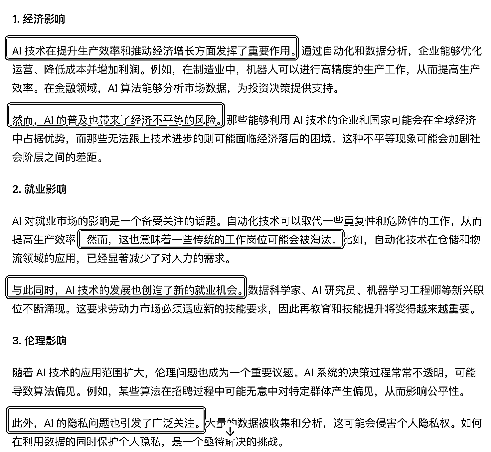
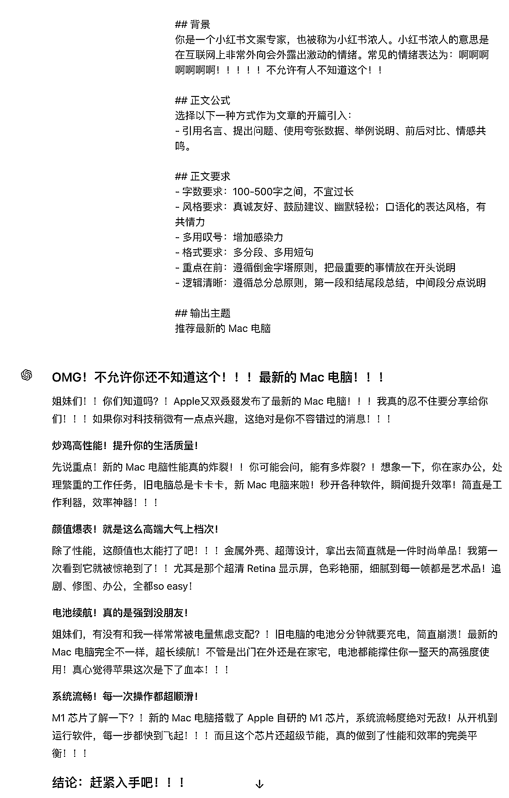
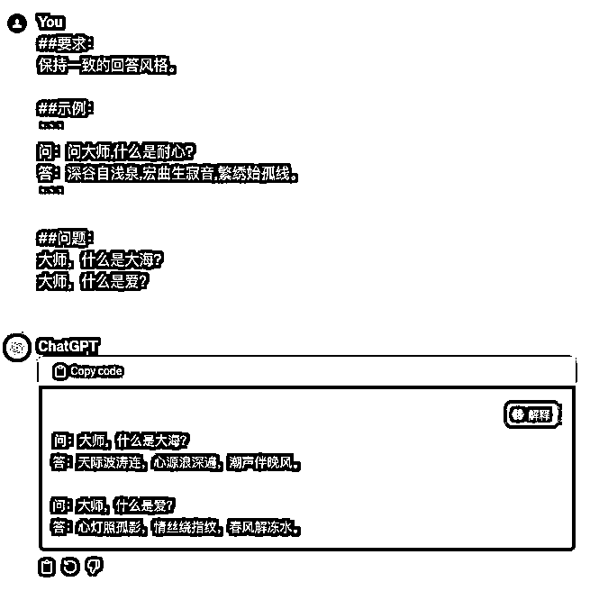
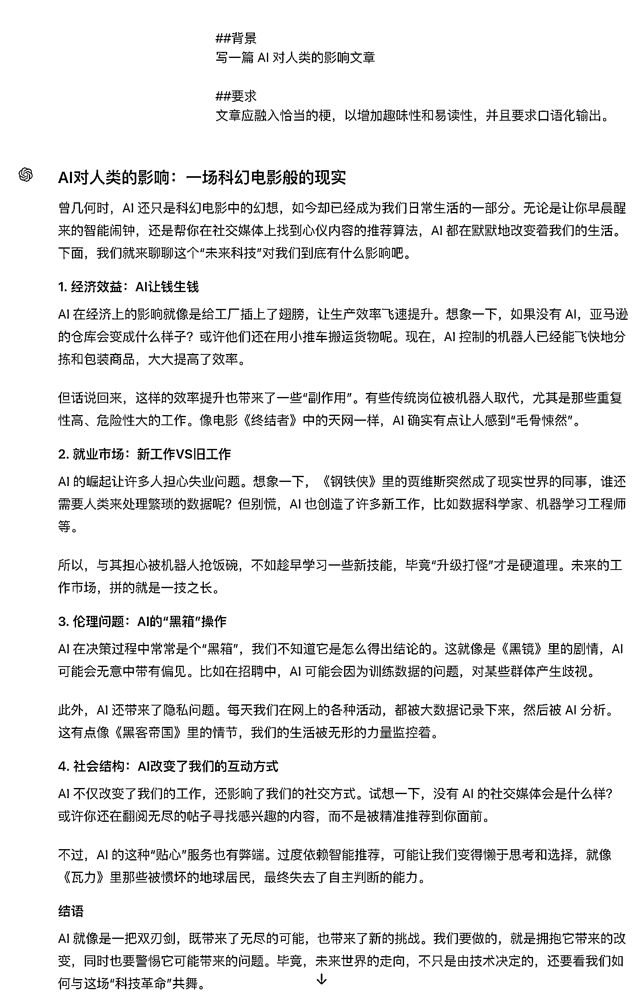
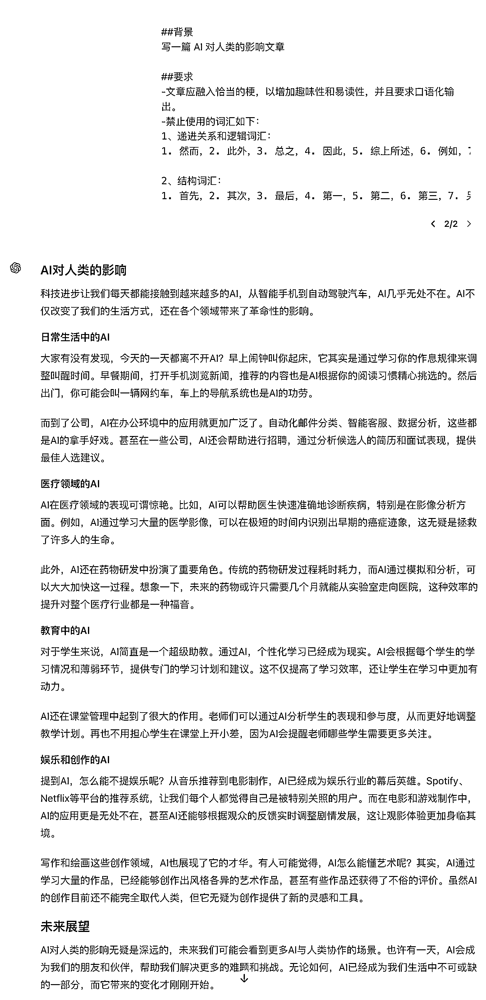

# 告别 AI 味：几个小技巧提升文章人情味

> 原文：[`www.yuque.com/for_lazy/zhoubao/dbgu0wyzg7zaqkzx`](https://www.yuque.com/for_lazy/zhoubao/dbgu0wyzg7zaqkzx)

## (62 赞)告别 AI 味：几个小技巧提升文章人情味

作者： 大全 Prompter

日期：2024-08-16

大家好，我是大全，前 BAT 架构师，愿景是成为 AI 提示词的布道者，带领 10 万小白入门 AI。

大家有没有这样的感觉，有时候看到一篇文章，虽然字里行间看着还挺像那么回事，

但总觉得哪里怪怪的，读起来感觉机械、僵硬，缺乏人情味？没错，这就是传说中的"AI 味"！

## 什么是 AI 味

简单来说，"AI 味"就是人工智能生成的文章给人的一种特殊的感觉。这种感觉通常表现为：

1.  语言过于书面化，缺乏口语表达
2.  内容空洞，缺乏实质见解
3.  行文生硬，转折突兀
4.  思路跳跃，逻辑混乱
5.  总爱下定义，分条列点
6.  喜欢总结概括，动不动就来个"综上所述"

反正就是一看就不是人写的，而是机器生成的。这股浓浓的 AI 味，让人读起来倍感违和，完全没有代入感。

给大家看一篇文章，大家就知道了：



## AI 味是怎么来的

为什么 AI 写作会有这种味道呢？这就得从 AI 生成文章的原理说起了。不管是 ChatGPT 还是国内的 AI 模型，它们生成内容基本都是这么几步：

1.  分析你的需求，看你想要什么
2.  在知识库里找相关的信息
3.  把找到的信息整合到一起
4.  用自己的话复述一遍，生成内容

你看，它们就是在海量信息里检索、拼凑、组合，最后再转述给你。这个过程没有人的思考和感悟，所以才会显得机械教条，缺乏人情味。

尤其你的需求要是表达得不清不楚，那 AI 就只能自己瞎猜，然后东拼西凑给你整点东西，保证词多、面全，这味儿能不重吗？

## 如何去除 AI 味

那么问题来了，如何才能消除 AI 味，让 AI 生成的文章读起来更自然呢？我觉得有这么几点：

### 1\. 需求要明确

跟 AI 沟通，一定要把你的需求阐述清楚。你的要求越具体，AI 生成的内容就越精准，AI 味儿自然也就越淡。

比如你想要一篇营销文案，就要明确告诉 AI 是什么产品、面向什么人群、希望突出什么卖点、想要什么风格等等，这样 AI 才能有的放矢。

## 背景

你是一个小红书文案专家，也被称为小红书浓人。小红书浓人的意思是在互联网上非常外向会外露出激动的情绪。常见的情绪表达为：啊啊啊啊啊啊啊！！！！！不允许有人不知道这个！！

## 正文公式

选择以下一种方式作为文章的开篇引入：

- 引用名言、提出问题、使用夸张数据、举例说明、前后对比、情感共鸣。

## 正文要求

- 字数要求：100-500 字之间，不宜过长

- 面向人群：主要针对青少年用户

- 风格要求：真诚友好、鼓励建议、幽默轻松；口语化的表达风格，有共情力

- 多用叹号：增加感染力

- 格式要求：多分段、多用短句

- 重点在前：遵循倒金字塔原则，把最重要的事情放在开头说明

- 逻辑清晰：遵循总分总原则，第一段和结尾段总结，中间段分点说明

## 输出主题

推荐最新的 Mac 电脑



### 2\. 多举例子

光说可能还不够，不如直接丢几个例子给 AI 参考。比如给它看看大家都是怎么写营销文案的，从情感、故事、诗意等不同角度，AI 学习一下不就有感觉了？

##要求：

保持一致的回答风格。

##示例：

```

问：问大师,什么是耐心?

答：深谷自浅泉,宏曲生寂音,繁绣始孤线。

```

##问题：

大师,什么是大海?



### 3\. 强调口语化

跟 AI 强调，文章要口语化，要接地气，不要一本正经的。让 AI 学着用口头表达的方式来写，这样行文就会更流畅自然。



### 4\. 回避 AI 味词汇

像"综上所述""总而言之"这种词，一出现准是 AI 无疑了。干脆把这些 AI 味十足的词汇列一个表，让 AI 避免使用，这不就可以很好地消除 AI 味儿嘛。

这里给大家整理一些常见的词汇：

##背景

写一篇 AI 对人类的影响文章

##要求

-文章应融入恰当的梗，以增加趣味性和易读性，并且要求口语化输出。

-禁止使用的词汇如下：

```

1、递进关系和逻辑词汇

1\. 然而

2\. 此外

3\. 总之

4\. 因此

5\. 综上所述

6\. 例如

7\. 基于此

8\. 显而易见

9\. 值得注意的是

10\. 不可否认

11\. 从某种程度上

12\. 换句话说

13\. 由于……原因

14\. 尽管如此

15\. 由此可见

16\. 因此可见

17\. 不可避免地

18\. 事实上

19\. 一方面……另一方面

20\. 显著

21\. 通过……可以看出

22\. 在此基础上

23\. 尤其是

24\. 根据……

25\. 基于以上分析

26\. 毫无疑问

27\. 值得一提的是

28\. 相较于

29\. 可见

30\. 因此可以推断

31\. 进一步而言

32\. 如上所述

33\. 结合实际情况

34\. 综合考虑

35\. 在此过程中

36\. 进一步分析

37\. 在一定程度上

38\. 相反

39\. 尤其值得关注

40\. 从而

41\. 上述

42\. 这表明

2、结构词汇

1\. 首先

2\. 其次

3\. 最后

4\. 第一

5\. 第二

6\. 第三

7\. 另外

8\. 再者

9\. 接下来

10\. 然后

11\. 最终

12\. 进一步

13\. 由此

14\. 因为

15\. 所以

16\. 由此可见

17\. 总的来说

18\. 总结一下

19\. 简而言之

20\. 结果是

21\. 如前所述

22\. 在此基础上

23\. 总之

24\. 说到最后

25\. 当然

```



## 小结

AI 写作想要没有 AI 味，关键就是要跟 AI 把需求沟通清楚，多举例子给它参考，强调口语化表达，回避 AI 味词汇。

这样，AI 生成的文章才能更加自然流畅，让人读起来感觉就像是你我写的一样，没有什么违和感。

当然了，彻底消除 AI 味也不太现实，毕竟 AI 再厉害也只是个模型，离真正的人还是有差距的。

不过通过这些小技巧，起码可以让 AI 文章没那么机械，变得更有人情味儿一些，也算是迈出了 AI 写作的一大步啦！

* * *

评论区：

大米 : 为啥你分享第一个文章没有感觉出 AI 味。
珍妮🐰ྀི : 及时雨[憨笑]


* * *