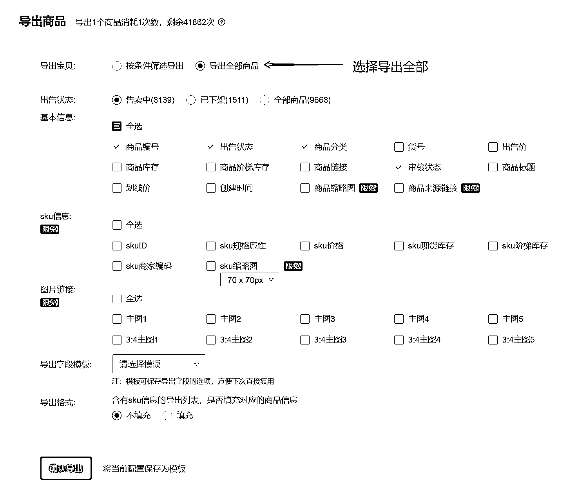
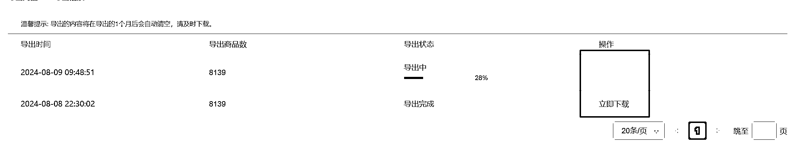
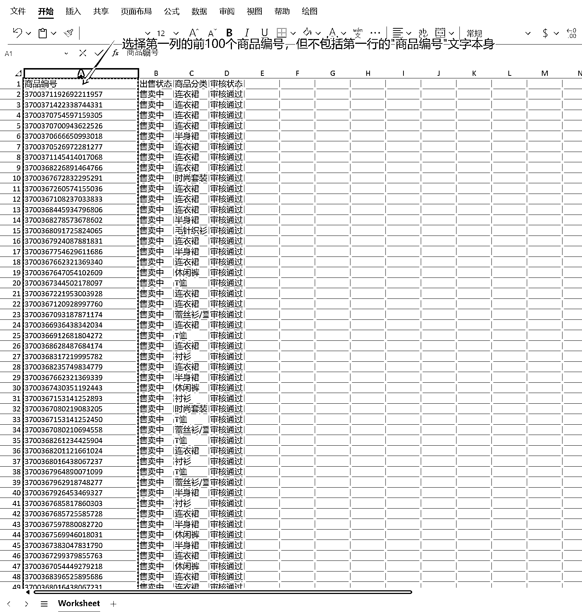
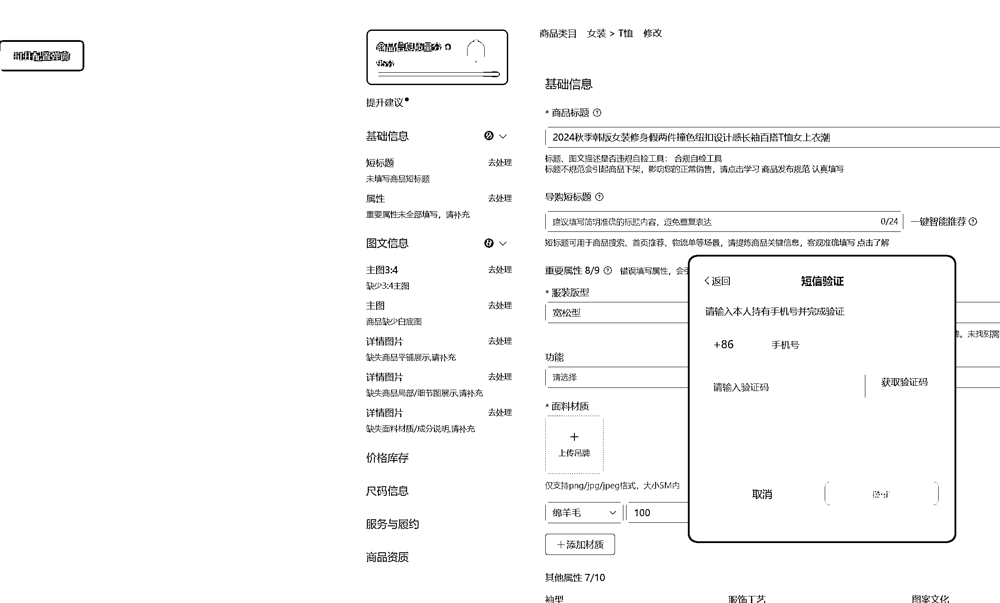
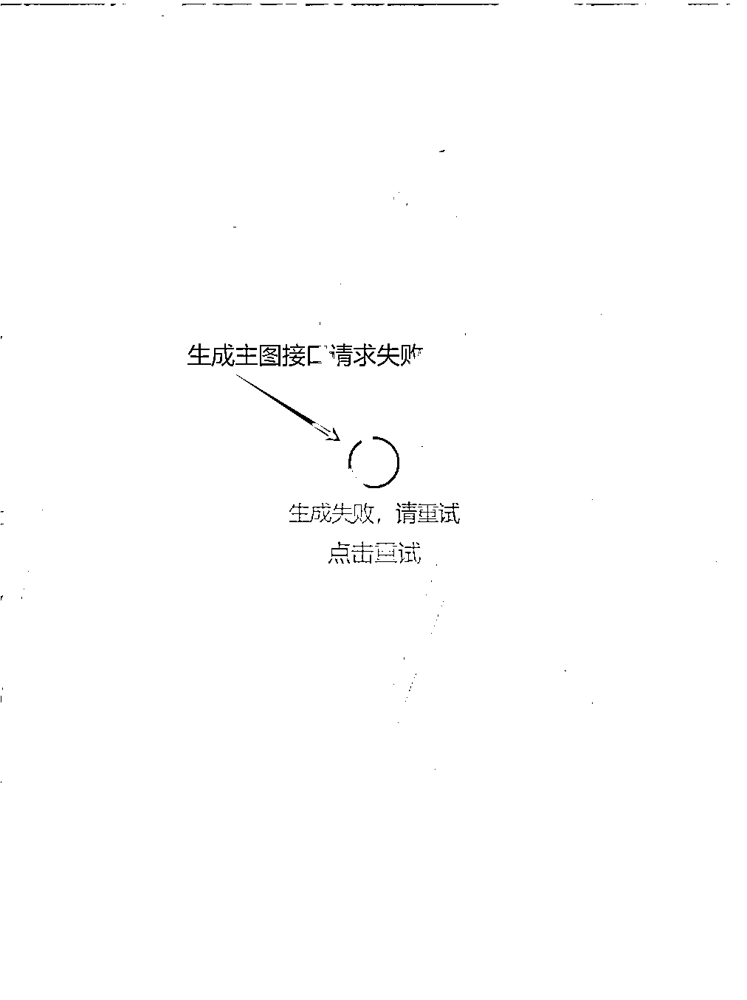
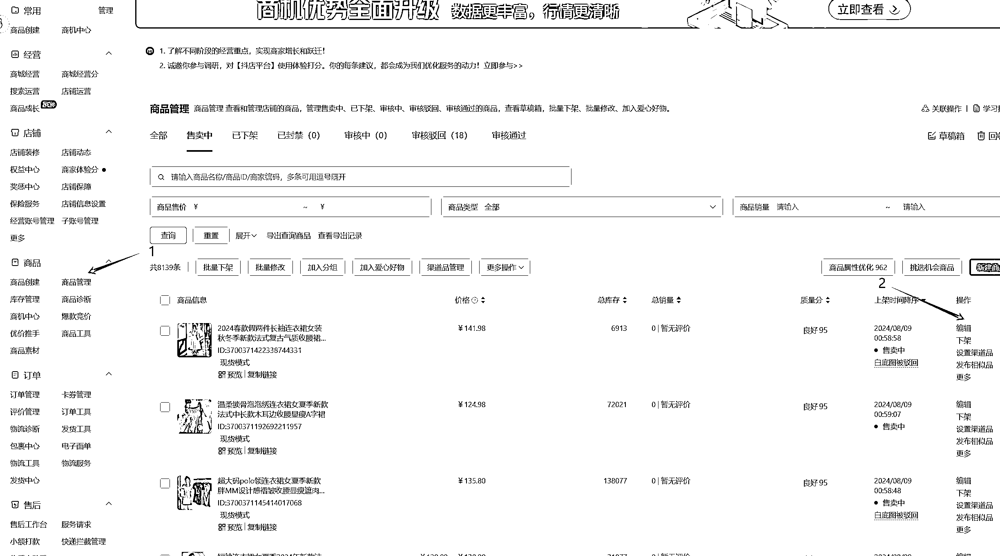
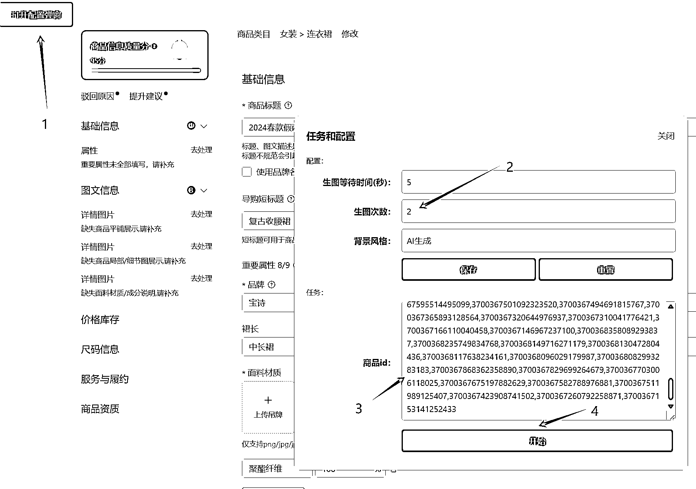
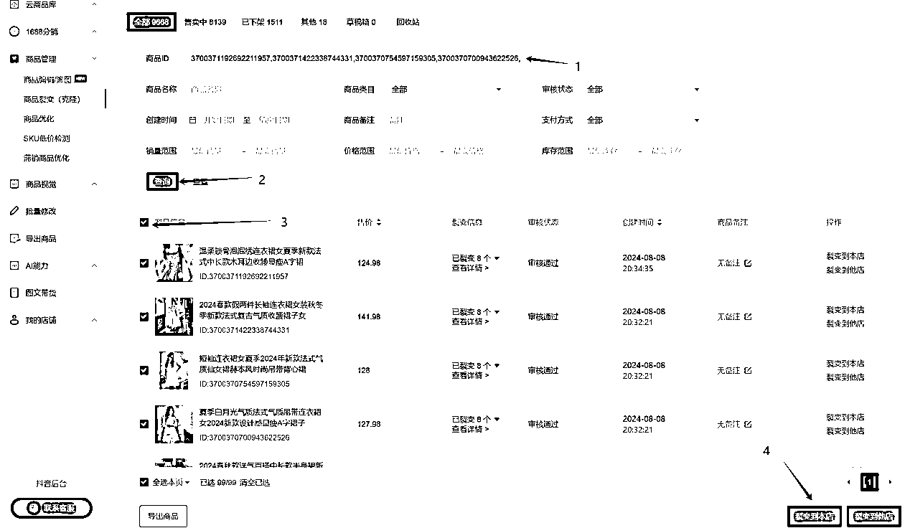
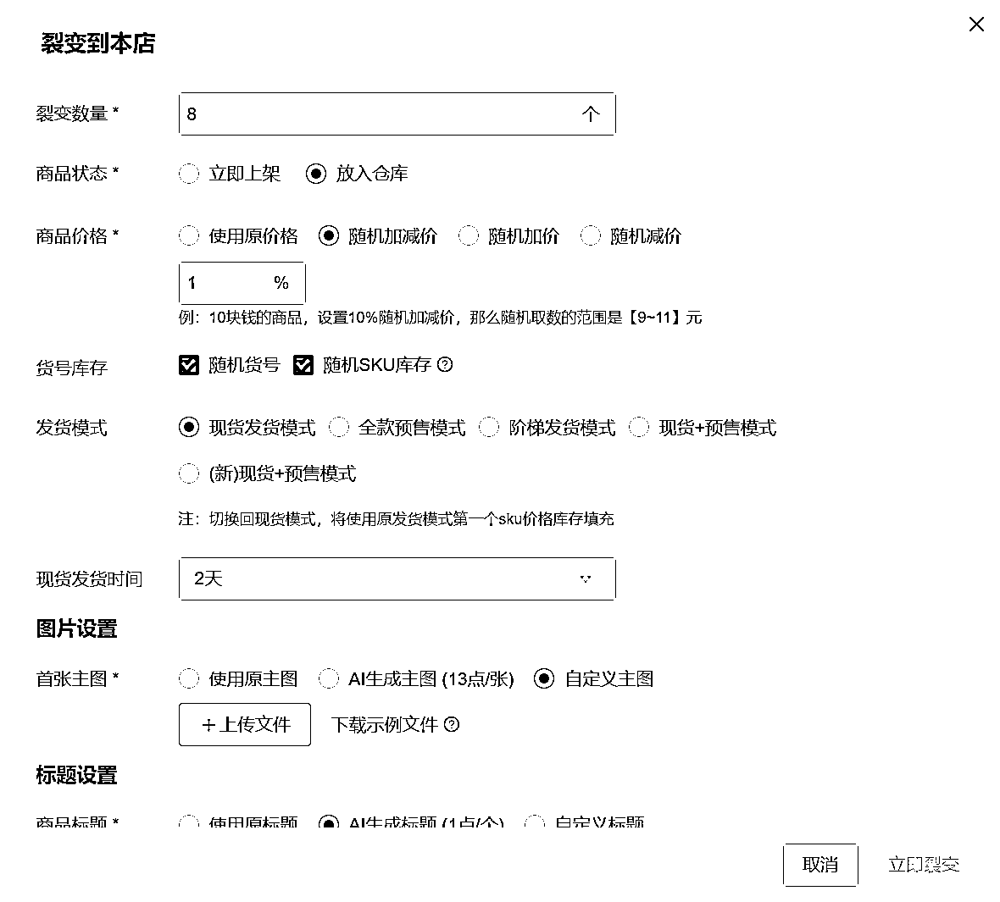

# 抖音小店(高客单)航海中，欢乐逛自定义主图裂变详细教程

> 原文：[`www.yuque.com/for_lazy/zhoubao/uggeuelas8n839y5`](https://www.yuque.com/for_lazy/zhoubao/uggeuelas8n839y5)

## (18 赞)抖音小店(高客单)航海中，欢乐逛自定义主图裂变详细教程

作者： 慕容

日期：2024-08-09

目前我所参加的抖音小店(高客单)航海中，需要用到“欢乐逛”进行商品裂变。很多圈友采用收费的 AI 裂变的方式，不过考虑到项目前期不宜投入过多资金，所以我决定采用自定义主图的方式来完成裂变，可以节省很多费用。在这里也分享给有需要的圈友，希望能有所帮助。

# **前置条件：**

1、需要认真看完安信教练的“如何做好拍单售后”直播回放，可在视频号“安信日常”获取。

2、按视频中的要求安装好“暴力猴”插件。

# **实操步骤**

1、进入欢乐逛，点击页面左边栏的“导出商品”。在“导出商品”页面选择“导出全部商品”(当然，你也可以根据自己的需要按条件筛选)，“出售状态”项根据自己的需要选择，其他保持默认，然后点击“确认导出”按钮。

2、进入新的页面后稍作等待，导出完毕后点击“立即下载”按钮，得到一个 excel 文件。

3、打开 excel 文件并复制第一列的前 100 个商品编号，但不包括第一行的“商品编号”文字本身。这里不建议选择太多商品编号，因为抖店官方对“生成主图”接口的请求频率做了访问限制，我的经验是操作大约 200 次之后就弹出验证窗口并不再响应请求了。而且请求太多主图后生成的压缩包会很大，可能超过欢乐逛上传文件的 900M 限制（后面会提到）。所以建议每次只复制 100 个。

4、点击欢乐逛左下角的“抖店后台”按钮进入抖店后台。在抖店后台管理界面左侧点击“商品”栏目的“商品管理”项，然后在右侧商品列表中选择第一项的“编辑”（此部分操作在直播回放中有演示）。

5、在弹出的商品编辑页面中，点击左上角的“打开配置弹窗”按钮，将此前复制的商品编号粘贴在“商品 ID”编辑框里（商品 ID 即前面提到的商品编号）。

页面中的“生图等待时间”项，网络慢的圈友可以设置的稍微大些，比如 5 秒；生图次数设置为 2 或 3 即可，因为暴力猴每次生成 4 张主图，2 或 3 次对应生成 8 或 12 张主图，足够我们用了，比如我采用 2，下面将提到的裂变次数则对应的填 8 即可，记得点击“保存”按钮。

点击“开始”按钮，然后就是漫长的等待了。我的情况是生成 100 个商品主图需要 50 分钟左右。期间不建议操作电脑，免得影响暴力猴脚本的执行。结束后会自动生成一个 zip 格式的压缩文件，后面会用到。

6、回到欢乐逛，点击“商品管理”->“商品裂变(克隆)”，将上面复制到的 100 个商品编号粘贴到“商品 ID”文本框内，然后点击“查询”按钮，查询结束后勾选全部结果，然后点击页面右下角的“裂变到本店”按钮。

7、在弹出的“裂变到本店”页面中，裂变数量我通常设置为 8，原因见上面第 5 项。其他选项根据自己的喜好设置，重点是图片设置中要选择“自定义主图”。

点击“上传文件”按钮上传此前下载到的压缩包。这里欢乐逛对上传的文件大小做了限制(900M)，所以此前用暴力猴生成主图时，每次不建议多于 100 个也有这个考虑。文件上传结束后点击“立即裂变”按钮，接了下来又是漫长的等待了，按提示操作就好。

8、裂变结束后，在上述的 excel 中再复制接下来的 100 条商品编号，重复以上步骤 4-7 即可。鉴于抖店对接口请求频率的限制(是对账号限制，换 IP、换电脑没用)，个人建议每天裂变一次即可。

欢迎还在本届“抖音小店(高客单)”航海中奋战的圈友一起交流。

* * *

评论区：

疯狗 : 感谢分享！

* * *