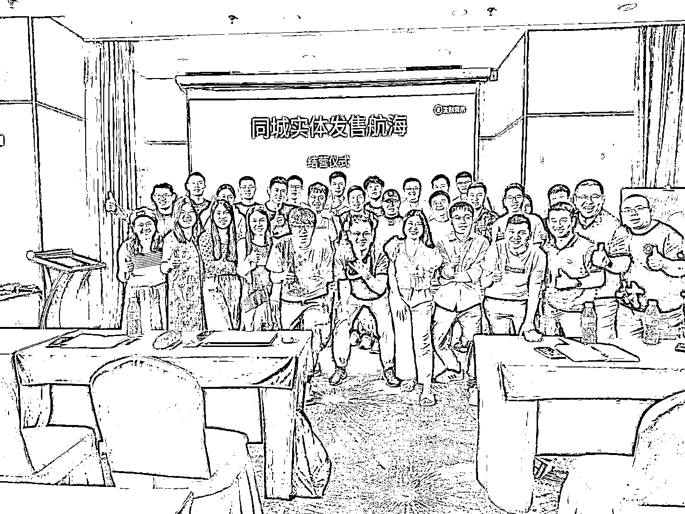

# 单人月营收 10w+，在线上流量如此卷的今天，同城实体发售会成为新的机会吗

> 原文：[`www.yuque.com/for_lazy/zhoubao/qgbmbid5grkbruq4`](https://www.yuque.com/for_lazy/zhoubao/qgbmbid5grkbruq4)

## (70 赞)单人月营收 10w+，在线上流量如此卷的今天，同城实体发售会成为新的机会吗

作者： 初心～大林

日期：2024-08-06

圈友你好，见字如面。

我是大林，生财有术 5 期老圈友，一直活跃于生财航海做志愿者，很多老圈友也比较相熟。最近志愿者活动参加的少了，偷偷做了个大动作，跟着孙策老板在做同城实体发售业务，取得了一点小成绩，特来向圈友们做一个阶段性汇报。

本文较长，主要通过以下四个问题向大家汇报，对特定标题感兴趣的圈友可以跳转来看。

**一、月营收 10w+真实吗？**

**二、商务是如何谈单成交的？**

**三、如何选择和评估一个团队？**

**四、这个业务还能做多久？**

平时输出比较少，文辞粗浅，大佬多担待。寒暄的话就不过多讲了，直接上菜。

为保证阅读体验，**请移步飞书**查看更多内容

[`s62r7yipm9.feishu.cn/docx/FM7XdNnd0owif3xpUlBcPJC6nQo`](https://s62r7yipm9.feishu.cn/docx/FM7XdNnd0owif3xpUlBcPJC6nQo)

#航海好事

# 

* * *

评论区：

丁刚 : 一天陌拜 30+客户，很锻炼人了[强]
萧 11 : 看是多思考打命中率，还是多跑动，打概率
跟团队素质有关系
初心～大林 : 嗯嗯，跟人打交道比较多
初心～大林 : 多跑是一个方面，主要还是把活动做好，用案例撬动更多高质量客户
陈俊强 : 真牛逼呀，有个问题想问问，同城发售的这个坚守本城市是不是一件复利很强的事情
初心～大林 : 是的，深耕一个城市复利还是不错的。建议周边城市一起，2-4 个城市一起来做
季博城 : 哈哈哈，这个总结帖比昨天孙策老师在直播间讲的好。昨天涛哥拼命的引导，奈何策总不解风情，笑死了。不过看得出，策总是个实在人。
初心～大林 : 孙总更严谨，我是所感所想

* * *