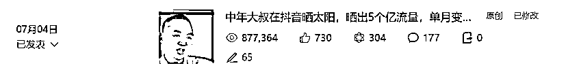
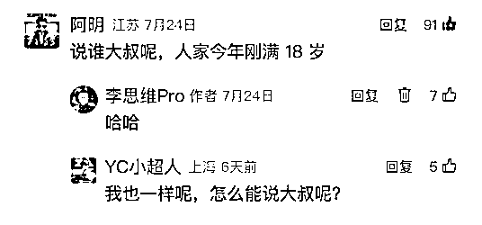
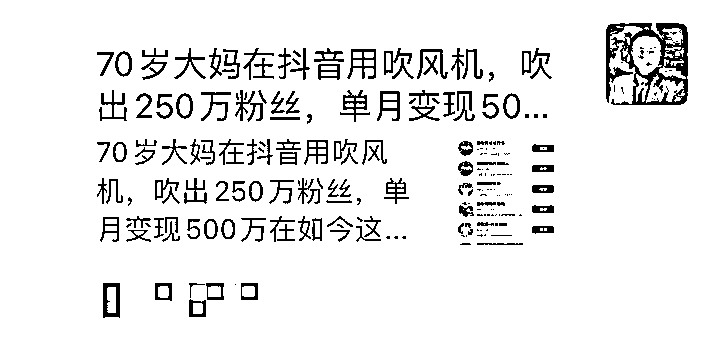
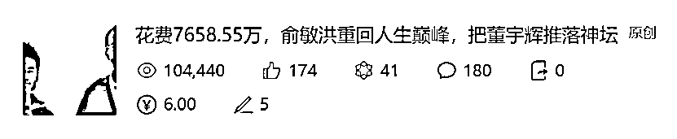

# 边刷抖音边写公众号，一个月写出 9 篇 10w+爆款，最高一篇 87.7 万阅读

> 原文：[`www.yuque.com/for_lazy/zhoubao/ug6nh97kiw6zgmkq`](https://www.yuque.com/for_lazy/zhoubao/ug6nh97kiw6zgmkq)

## (74 赞)边刷抖音边写公众号，一个月写出 9 篇 10w+爆款，最高一篇 87.7 万阅读

作者： 李思维 Pro

日期：2024-08-06

7 月份勤奋日更，账号进了流量池，总共出了 9 篇 10w+爆文：

最高一篇 87.7w 阅读

其次是 52.3w 阅读

第三是 42.6w 阅读

下面复盘一下我这个月写公众号的心路历程：

**1、边刷抖音边写公众号**

现在人的习惯是，要么就刷抖音、视频号，要么就看公众号、小红书，所以，流量基本都在这几个平台上.

如果你是做图文的，就写公众号，或者小红书，如果你是做视频的，就做抖音，或者视频号。

我目前是边刷抖音，边写公众号，公众号选题，基本是刷抖音得到的灵感。比如这篇：

《90 后小伙在抖音扛楼，扛出 260 万粉丝，还清了所有外债》

21.1 万阅读，当时我就刷到扛楼在抖音流量很大，很多大博主，比如嘴哥、李炮等等，都去扛楼蹭流量了，扛楼博主阿兴账号粉丝也有 260 万，挺火的，于是，我就写了这篇文章，跑了 21 万阅读。

**2、标题很关键**

因为我账号粉丝不多，平常阅读 1000 左右，如果标题不好的话，很难获得大的阅读，所以，得好好写好标题，才能得到粉丝阅读，才能进流量池，被系统推荐。

我复盘了一下我那些 10w+标题，都是很形象的，比如这 3 个：

①中年大叔在抖音用吹风机，吹出 250 万粉丝，单月变现 500 万

②中年大叔在抖音跳擦边舞蹈，10 天擦出 450 万粉丝，1 年不到变现 1 个亿

③90 后小伙在抖音扛楼，扛出 260 万粉丝，还清了所有外债

本来是涨粉，比如涨了 500 万粉丝，但我觉得太普通，不够形象，所以，我改成“吹”、“擦”、“扛”：

用吹风机，吹出 250 万粉丝；

跳擦边舞蹈，擦出 450 万粉丝；

扛楼，扛出 260 万粉丝。

……

一下形象多了，事实也证明，这 3 篇都得到了系统推荐，都是 10w+爆款！

我看到有小伙伴也用这种形象的表达，来写小红书喝茶博主，喝出***粉丝，也爆了，阅读量接近 10w+。

这个爆款标题框架挺好用的，可以用来拆解抖音、小红书的各个领域博主。

**3、内容有趣+有用**

我之前写干货比较多，但发现，基本上不了 10w+，怎么办？写点段子吧，于是，我加了不少段子，果不其然，一个月收获 9 篇 10w+。

所以，我个人经验就是：想要文章出爆款，有用有趣少不了。

先说有用：比如我是拆解博主的，得写怎么拍摄、剪辑，爆款底层逻辑，怎么树立人设，怎么创新形式，怎么制作内容等等，干货很多，根据每个博主的属性来写。

再说有趣：有趣就是写段子，比如在标题中写：

河北女子在抖音变装，变出 72 万粉丝，网友：彩礼说好 8 万的，怎么变成 80 万了？

在文章正文里面写：

安安教练这篇：

①最近，有几个女粉丝来问我：思维老师，我也是美女，也想做自媒体，但没有方向。我说，多看看成功案例，看多了心中就会有数，心中有数后，再来定方向。

②安安直播间 16 万人在线，12 万人是有驾照的，1 万人是教练，1 万人是交警，1 万人没有驾照，1 万人想要把驾照吊销重新考的。

③有女粉丝说，自己不小心拿男友的手机刷到了，也禁不住慨叹：我一个女的，听到她的声音都受不了。

大胯姐这篇：

标题就是段子：95 后女子在抖音变魔术，不仅变出了 200 万粉丝，还变成了很多中年大叔的梦中情人

因为看大胯姐的不仅仅只有中年大叔，很多 18 岁的小伙也喜欢看，

评论区有很多疑似 18 岁的小伙说：说谁大叔呢，人家今年刚满 18 岁。

文章里的段子：

你看，这也是美女+专业的优势，你纯展示颜值，别人来看你，就看你的颜值，看久了就没什么意思了，你得展示专业，比如魔术，大家才能为欣赏你的颜值找个借口：我是来学魔术的。

很多美女舞蹈博主也是一样，不少男同胞都评论：兄弟们，今天咱们又来学舞蹈了。

这些段子怎么来？平时积累，我建了一个段子库，没事就写几个，或者去抖音评论区搜集几个扔进去，有时候也会去公众号搜索看看有没有人模仿我写，我发现了一个号，简直离谱：

我明明是写 50 岁大叔的，怎么变成 70 岁大妈了。。。

为了去重，我也是醉了，懒得举报了，就放进我的段子库里吧。

日积月累，已经有上百个段子了，没事就去翻看一下，写文章的时候，段子就会不自觉冒出来。

**4、写公众号的几点建议**

①想到就马上写，执行力拉满

当晚我刷到一个 10w+爆款：《7658.55 万赎身，董宇辉被老俞推进深渊！》，我觉得挺不错，于是马上构思标题，立马去写，直接喜提 10w+。

②给写作赋予重大意义：

A、文字永远有价值，只要你能创造出属于自己的独特文字，它就可以跨越时空，在未来闪闪发光。

B、写作具有疗愈作用，每天早上起来第一件事就是写作，一整天都会非常充实。

C、写作日更是做好自媒体的基本功，不管你做哪个领域的自媒体，每天保持写 3000 字，都会对你做自媒体大有裨益。

③一切都是积累

比如写公众号，想要写出爆款，你得做好素材库，平时多刷推荐页，多看对标账号，看到好的标题、开头、段子、金句、结尾等等，只要你觉得不错的，都可以搜集下来，分门别类，做成素材库，你之后写起文章来，就会更加得心应手了。

以上，就是我一个月写出 9 篇 10w+爆款的复盘，希望能带给大家一点点启发。

* * *

评论区：

福姐姐 : 刷到过您的文章[强]
源 : 思维老师无处不在
源 : 主要就是账号拆解类的哇
Rio : 受教了 谢谢
D•欢 : 根据抖音热点手搓文章吗？
李思维 Pro : [呲牙]
李思维 Pro : [呲牙]
李思维 Pro : 是的

* * *