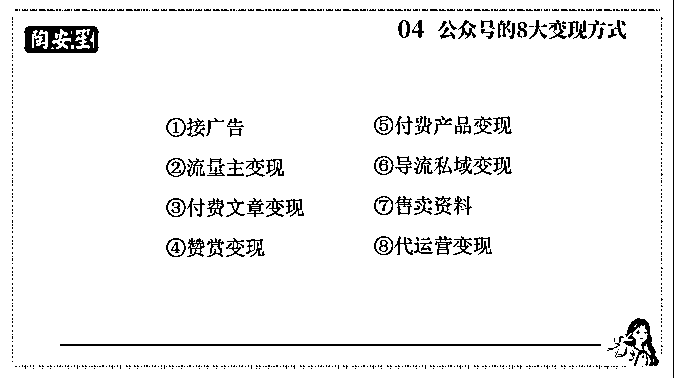

# 深耕公众号五年，实现百万 IP 的心法

> 原文：[`www.yuque.com/for_lazy/zhoubao/ig9d87sv733qvwbk`](https://www.yuque.com/for_lazy/zhoubao/ig9d87sv733qvwbk)

## (24 赞)深耕公众号五年，实现百万 IP 的心法

作者： 桃子🍑

日期：2024-08-06

哈喽，大家好，我是桃子。

我目前是 17 万粉的公众号博主，已经带了几百位的学员开启公众号变现了。

今天我分享的主题主要是《深耕公众号五年，实现百万 IP 的心法》，也是我在公众号这个平台上经营 5 年后的一些经历和感悟。

我会从以下几个方面进行分享：

**一、深耕公众号 5 年，我的心路历程**

**二、打造爆款：低粉也能写出 10W+的秘诀**

**三、精准获客：如何靠公众号实现精准获客？**

**四、闭环管理：如何在公众号沉淀 IP 心法，赋能高溢价 IP？**

# **一、深耕公众号 5 年，我的心路历程**

第一个部分，我来跟大家分享深耕公众号的心路历程，我把我过去进行的公众号探索分为**四个阶段**。

## **第一阶段：埋头沉淀，逆境重生 【月入 200+】**

这个阶段，我想告诉大家的是【**沉淀**】和【**欲望**】。

小时候家境不好，努力读书但高考失利考上二本，成为了家里第一个大学生，但是一点也高兴不起来，觉得辜负了自己和家人朋友的期望。所以高考完的暑假，一口气读了近二十本书，疯狂沉淀，其实也是在为自己的失败找补。

刚上大学，我便竞选学委，认真学习；尝试各种兼职，什么发传单、食堂打菜、做辅导助教、做家教等等，总之就是迫切想要搞钱。而此时的“**强烈的搞钱欲望**”也为我后续的坚持和努力有了好的基础。

后来偶然在知乎搜『如何才能有意义地过好大学』，得知**写作投稿的兼职**，就从这个渠道加上了一个学长。

他听说我喜欢写作，就让我发一篇稿子给他看。结果看了我的文章后，他直接聘请我当他的**签约作者**，每周供稿 1 篇，一月 200 块。

当时的我喜极而泣，这不只是一份兼职，更是一次认可！而我之前的语文素养和暑假的沉淀，都为这次机会做好了铺垫，我把握住了。

所以这里想跟大家说的是：如果做自媒体，我们一定要利用好之前的沉淀，激发自己的搞钱欲望。

## **第二阶段：突破自我，不忘初心 【月入 5000-1w】**

供稿期间，学长觉得我文字很不错，人也不错，于是提出让我帮忙**代运营公号**。也就是这个时候，我开始真正地接触了【**公众号运营**】，那年我还是大一。

但是这时候的我，对于自媒体也是完全摸不到头脑，前面两三个月拼命写文，写了几十篇文章，又**去知乎各种靠内容和资料引流想要涨粉，最后只涨粉了个位数**。

那段时间还是挺怀疑自己的，无数次向闺蜜哭诉，觉得我不适合做自媒体，每天都 emo 得要死，但还是逼自己更新，就这样持续了两三个月。

后来，我偶然得知，公众号是有圈子的，一个人摸爬滚打一年都不如在圈子里学习一个月。

也是那时候我开始知道了公众号涨粉方式，也就是【**征稿函涨粉**】和【**互推涨粉**】，之后我便开始在**小红书、抖音、快手等公域平台**去推广征稿函，但是现在这个方法其实不算好用了。

具体的方法是一是自己开号去其他平台推广（比如小红书），二是付费，组织粉丝帮忙发，三是付费让博主帮忙发。

如果大家做小红书的博主，尤其是学习类、写作类的博主，应该也经常收到【公众号推广】这类广告了。

这在 1-2 年前，其实也是一些小博主的收入来源，但是随着小红书对于“引流”行为越来越严格，这类广告对账号的风险会比较大，所以越来越多的博主就不愿意发征稿函推广了，怕有违规或者封号风险。

但是，虽然这个方法现在不行了，但绝大部分的在那时候崛起的号主都是依靠这种引流方式起来的，包括桃子也是。

毕竟“酒香还怕巷子深”，我们必须要先引来粉丝，这是前提。而后续留不留得住粉丝，这就是公众号的质量和内容问题了。

桃子依靠这种引流方法，加上内容和从原始的**2000 粉丝**（这部分粉丝是由学长通过线下发单和知乎写经验贴引来的，历时好几个月，也花了不少钱，效率还是较低的）到大概**15 万粉丝**。

这里的 15 万粉丝包括三个号：

一是我的大号**#公众号晚安西柚**，粉丝 10w 左右，以“桃子”的名字，主打做 IP；二是我的小号**#公众号陶安笙**，粉丝 4w 左右，偏电台治愈方向，以“陶安笙”的名字，主打征稿；

三是我的小小号，**粉丝一万**多，之前的名字是“全是狗粮”，主要是收集一些“爱情故事”，主打和粉丝互动，但是后面因为时间的确不够，所以直接卖了，变现 6000+。

其实我做的 3 个号，就相当于做了一个矩阵号，而做【**矩阵号**】也是有利的一个操作，好处很多：

一是一个粉丝可以关注三个号，因为三个号都征稿，且征稿类型不一致，粉丝数翻三倍；二是三个号都可以接广告，可以单接也可以打包，收入叠加。

所以，不论是之前的公众号，还是目前大家在做的小红书，都要有【**矩阵思维**】，也就是多个账号，多个平台，广撒网，东边不亮西边亮，谁又知道呢。

**总结一下，这个阶段，我想告诉大家的更多的是【圈子】、【机遇】、【坚持】：**

**第一是圈子**，做自媒体，一群人肯定比一个人要跑得快，所以要么跟着有结果的人一起做，要么和同伴相互勉励着做，结果会更快；而且，进入到一个高能的圈子，你能够接触到这个平台里最新鲜的玩法。

**第二是机遇**，虽然我们这一批号主没有赶上公众号的正当风口，也就是 15 年那会，基本上写一篇文就能转发到几万十几万的时期，很多人甚至唱衰，说“公众号已经没落了”。

但是我们还没放弃，遇到了公众号新的机遇，也就是【靠外域引流】，而且我们狠狠地咬住了这份机遇，所以才能把自己的私域文字平台做得还可以，实现快速涨粉；

**第三是坚持**，其实，和我一同做公众号的很大一批人绝大部分都已经隐退了，也有一大批号主直接卖号，之后要么转战其他平台，要么直接不做自媒体了。

说心里话，挺可惜的，前期的公众号的确很难，尤其是去年底，随着“互选平台”（类似于小红书的蒲公英平台）的出台，公众号很难有广告。

但是，最后坚持下来的，依旧能靠公众号有很大的盈利，前期都是沉淀，后期才是爆发。

就像桃子，做了 5 年公众号，前四年仅靠公众号挣了 30 万左右，而后期因为沉淀积累得足够，我借用着之前的积累，**在一年不到的时间变现近百万**。

所以，请大家明白，做自媒体一定要【沉淀】，不要妄图一步登天，而沉淀够了，接下来就是大爆发。我始终坚信，谁能熬得住困境，谁就能【绝处逢生】。

## **第三阶段：停下脚步，奔赴考研【收入 2000-1w】**

这个阶段，我想告诉大家的是【**取舍**】和【**团队**】。

到大三了，即便在大学是专业第一，但我一直都有执念，有【名校光环】，所以我在事业做得风生水起的时候毅然决然地选择了考研。

因为，我知道，自媒体的红利有很多次，但是我人生的考研和弥补遗憾的机会，只有一次，所以，取考研，暂舍自媒体。

我也想借我自己的经历告诉大家，**适当取舍**：

在学业和副业之间、在主业和副业之间，如果你的副业不是完完全全有保障可以覆盖学业或者主业，那么建议依旧还是以学业和主业为主，尤其是不要在还未稳定的时候为了副业而辞职。

虽然暂时放下了一段时间的自媒体，但是我是在 11 月初的时候才真正停更的，这也让我能在备考研究生的过程中，持续有变现，且公众号的活跃度持续维持。

而这最重要的归功于【**我的团队**】，那时候主要是一个总助和一个排版助理、以及一个商务助理，她们基本上帮我把所有的杂事都解决了，我只需要在学习之余给与一定的指导和安排即可。

所以每一个想要做大的人必然有一个合适的团队，所以当大家做自媒体到了后期，觉得有点忙不过来了，最好是学会慢慢搭建一个自己的团队。

## **第四阶段：傲然凯旋，破圈成长 【月收益 3000——10w】**

这个阶段，我不得不再提及【机遇】，与之相关的还有【破圈】、【商业思维】、【高能量】以及【初心】，也正因为有了前面的沉淀加上后期的突破，让我的月收入直接翻了几十倍。

四月份，我考研复试完毕，还没停歇几天，就又开始了自媒体之旅。

因为之前公众号圈子的更迭，我开始接触知识付费圈子，去学习更多的新鲜东西，让自己的认知和能力都提高起来。

当时，我做的**第一件事**就是，利用已有的资源，开设自己的【**知识付费产品**】，而一个付费产品也是发展和深耕一个个人 IP 所必要的。

但是，这是基于我已有的资源，如果资源不足，那么直接跳到**第二步**，也就是**破圈**，而破圈的前提是【付费】，这好像已经成为了公认的事实了。

所以我也开启了各种付费，去学习必要的认知和技能，认识更多厉害的人，把自己变成一位**『六边形战士』**，让自己变得强大且无畏。

后来，因为付费我接触到了付费圈子的很多玩法，因为【**机遇**】我开启并深耕了**公众号爆文项目一年**，因为付费学习和观察探索我学习了很多高级的【**商业模式**】，练就了自己的商业思维，也持续**高能**地开启了自己多个付费产品和搭建私教团队，以及**不忘初心**地做好服务和口碑。

可以说，正是因为我不断地坚持做公众号、探索公众号、跟着公众号的最新机制走，才能有今天的成绩，才能更加坚实地打造自己的个人 IP。

也正因为我深耕公众号五年，才更加真切地知道【公众号】这个微信最宠幸的文字平台，有多么适合做【私域沉淀】和【个人 IP 打造】。

好的，那么介绍完了我过去变现 7 位数的整个历程，可以说，因为写了公众号做了公众号，我的命运的齿轮才开始转动。

因为公众号，我才知道一个没有人脉的小镇女孩也是可以去靠自己打拼出一份小而美的事业，然后还能够成为别人的榜样的。

所以不论当时有多少人说公众号走下坡路，还是有新的问题或者怎么怎么样了，选择放弃或者停滞不前时。我都没有放弃。所有在公众号可能的机会我都会去探索，至今我也一直留在牌桌上，深耕公众号。

## **第五阶段：更加大众化和商业化的公众号时代。**

现在，也就是进入到我公众号探索的第五个阶段，在我看来，这将会是更加大众化和商业化的公众号时代。得出这个结论是因为公众号当下的四大契机。

### **首先，是公众号推荐机制开放。**

因为一开始公众号是一个私域平台，只有关注了粉丝才能看到，但是现在即便没有粉丝关注，只要触及到了被推荐的点，他也会去给你推荐。

对于大号来说，反倒是不太好的，因为关注你的粉丝可能被分散注意力了，但对于小号来说是非常利好的，因为你本身没有什么粉丝量，但是文章依旧可以有一定的阅读。你可以发现很多新注册的小号都能达到十万加阅读了。

### **第二，公众号留言免费开放。**

在 2017 年的时候，新注册的公众号已经没有留言了，就少了和粉丝的一个互动机会。

前两年我去开通留言，花了 2000 多块钱。但是没想到现在陆续免费开放了，这说明公众号主与粉丝的互动机会就越多了，也是腾讯对于公众号的一个扶持。

### **第三，公众号推出了【内容助推】机制。**

也就是公众号主可以通过付费，投流把你的内容推给更多的人去看，类似于抖音投流。

但是它有个前提：只有一万粉丝以下的人才能用到这个助推功能。而且你的内容不能是强商业性的广告等内容。

可见腾讯在大力扶持小号号主，大号甚至都没有办法投流。

投流这个方向的一个转向，其实也是商业化的一个转向，即便它不能营销味很重，但是想要去引流，或者沉淀内容什么的，还是很方便的，这也是商业化的一个体现。

### **第四，视频直接关联公众号。**

大家可以看到我们这两张图就是公众号和视频号。

我们在公众号的首页是可以看到视频号的，你点进去这个蓝色字就可以进入视频号。在视频号的首页你也可以关联到你的公众号。

还有一个好处：我们在公众号的文章里边是可以直截了当的插入视频号的内容，相当于又一次给视频号推流量了。

同时，视频号直播的时候，你的视频号直播的消息不仅会推给视频号的粉丝，也会推给公众号的粉丝。

所以对于视频号直播，公众号也是可以贡献一份力的，这是公域和私域联合的一个非常好的机会！

近两年，我发现公众号发生的改革真的很多，做了五年公众号，这于我看来，是比较反常的，其实也说明腾讯对公众号越来越重视了，才有这么多举措。

所以针对这些年公众号的变化，我总结了当下公众号平台的几个优势。

### **第五，公众号平台的优势：**

**1.一鱼多吃的平台**

它可以作为我们一鱼多吃的其中一个平台去同步内容。比如说你是做小红书的，那你可以把小红书图文的内容，或者是小红书的脚本同步到公众号，稍微改一改排版调整一下就好了。

像我有独创的一套排版方法，十分钟就可以排版好了，排版的也相对美观，所以整个来看是非常简单方便的。

加上公众号的推荐，相当于有一个流量助推，作为一个一鱼多吃的平台还是非常好的。

**2.直接精准获客的平台**

第二个就是它可以作为获客的一个平台，而且是直接、精准获客。

我们在外域引流，都会有违规风险的，但你在公众号就不会。直接贴一个微信二维码，或者是直接放上微信号都不会违规，这就是公众号一个非常好的点。

我觉得目前没有哪个公域平台能到这样的一个程度，而且你还可以直接在公众号进行招生宣传，人家直接就加到你了。

**3.个人 IP 的沉淀平台**

公众号是一个个人 IP 的沉淀平台，也可以说是一个商业企业文化的沉淀平台。不仅是个人，企业等等也是可以在公众号沉淀。

它沉淀的内容，可以是你的个人品牌故事，也可以是你的企业文化等等。

因为是文字类的内容，吸引过来的用户相对来说是比较沉浸式阅读的用户，也会更加优质。

很多同类的内容还可以利用专栏给你打包起来，这也是一个不错的优势。

**4.公域私域的过渡平台**

公众号是私域公域的一个过渡平台。比如说你的小红书可以先到公众号再到私域。

举个例子，很多博主他都会说全网同名，全网同名，是不可以搜索微信号的，很多其他公域也没法留微信号，但是同名到公众号，是可以直接留微信号，直接触达号主本人的。

包括视频号也是，目前对于视频号留微信是相对严格了一点，很多人就会利用公众号和视频号的关联，通过公众号到达我们的私域。

那么说了那么多，其实就是想告诉大家：今年做公众号是一个向好的趋势，而且它的变现方式也多了。我列举了 8 大变现模式，标红的都是普遍适用的。

比如说接广告、流量的变现，就是适用于所有做公众号的人。

对于做个人 IP 做私域的，有后端产品的，就还有付费产品的变现、私域的变现等方式。

付费文章，赞赏售卖资料等等代运营等等，也是可以实现变现的。

以上说了我做曾经做公众号的四大阶段和目前阶段公众号的方向，我想总结一下：

**第一个是小号的春天要来了，当下的趋势对于小号绝对是第三春；**

**第二个就是公众号的商业化，不论是个人 IP 还是企业，也会是一个契机。**

记得去年视频号开始的时候，我有一个很喜欢的商业博主，她当时也是从零开始去做的，建议可以依靠视频号去打造创始人 IP，她持续不断地坚持，觉得这是一个机会，到现在已经是视频号创始人 IP 里面一个 top 级商业博主了。

所以平台的红利不等人，如果感兴趣的话，可以尝试给自己一年的时间去持续更新公众号，一年之后一定会脱胎换骨。

# **二、打造爆款：低粉也能写出 10W+的秘诀**

接下来，进入到第二部分：打造爆款，低粉也可以去写出十万加的秘诀，那这个本质上也是因为推荐机制的出现。

**这部分也分为几个阶段。**

## **1、公众号推荐机制的 3 个阶段**

### **第一阶段：流量主。**

去年大概 6、7 月的时候，我就差不多接触流量主变现类的公众号了，就是单纯去靠流量变现。

第一张图就是我自己小小号发的文，当时这个是 59 万，然后这个是十九万，十二万，二十万等一些破十万的数据，我就截了部分的数据，还有其他的一些我就没有截了。

后期我们团队继续带学员去做了，大部分都有了变现，很多人都在第一个月就实现了四位数的变现，有学员还做了这个百万阅读，当天就变现了 4000 多。

还有一个私教在七天就变现了一万多，也是靠流量主变现。

从去年我们开始研究公众号爆文，一直到今年，我们发现他的推荐机制一旦推荐起来是非常猛的，好好利用这个机制是可以获得不错的收益的。

### **第二阶段：个人原创文章。**

我在大概去年 10 月份的时候，就发现了公众号还是不断地在推荐个人原创文的，因为我自己这个账号可能是个老顽童，之前一直都没有被推荐，但我还是想不断地尝试。

终于，去年十月我慢慢地尝试出来了，发现自己有的文章开始被推荐了，我就持续不断地测试。

比如说发个热点类文章被推荐了，后来我又去发了这种偏热点类，发现也 OK，然后我发现我每次发写作相关的，它都会有或多或少推荐，它也都会有推荐，而且屡试不爽，说明写作这个关键词就是我公众号的爆款因子。

只要持续不断地写这个关键词相关的内容，肯定被推荐。

但是为什么我没有每篇文章都这样发，是因为我不想去做成一个单一大干货账号，我更想做一个鲜活的有人味的号，而且我也还想不断测试其他的关键词。

后面我继续尝试，比如说我的人设故事，一个普通女孩的十年，很多其他内容也获得或多或少的推荐了。

有一段时间，我所有文章都被推荐了，只是没有太多，但是这说明，你这个账号是被看到了的。

前几天，我恢复日更继续测试偏创业和商业赛道的文章，第三篇就直接大爆，一天跑了 67 万阅读，推荐比例达到了 99%，涨粉 3 位数，引流 3 位数，流量主变现 3 位数（因为方便阅读我只开文末广告条，如果开文中收益可以翻 10 倍），而且还带动我公众号其他文章都有了或多或少的推荐。

所以，我的结论就是，一旦你这个账号入池了，且持续输出高质量的文章，即便关键词不一致也是可能被推荐的，而且一篇推荐会带动其他文章，所以第一次的尝试很重要。

以上是第二个阶段，也就是我利用自己的账号去测试原创型的这种 IP 类文章的推荐，已经测成功了，包括 6 月底都是有推荐的。

### **第三阶段：IP 类公众号。**

当我发现 IP 公众号的推荐率变高了，于是我带他们去测，给大家整理了关键词的建议和对应的选题库。

可以看到她们的数据也都是不错的，毕竟都是从新号起步，已经有爆款了，而且能持续维持。

同时我也建议我的一个专业型 IP 的私教利用爆文思维去做对应领域的公众号，坚持一段时间后，果然也被推荐进入流量池了。

现在也有三位数四位数的阅读，内容中可以直接引流，所以每天更新相当于每天引流的过程了。

对于后端有产品的 IP 来说，精准的引流就是最重要的。而且公众号还有一个非常好的点，就是文章可以重复发，有时候也可以凑凑数了。

通过以上几个阶段的测试，我还算是对公众号的整套流量逻辑有了整体的认知，也实操跑通了。

接下来给大家几个公众号打造爆款的一些小 tips。

## **2、公众号打造爆款的秘诀：**

### **（1）标题最重要，决定打开率**

对于大家做过小红书的人，标题和封面都很重要，后续的赞藏、评论更重要。

而对于公号的文章来说，可能你的点赞可能没有太大的用途，在看是比较重要的。所以在文章里面可以引导一下在看，但是最重要的还是标题，我觉得它占了 50%以上的作用。

### **（2）测出你公众号的关键词**

每个公众号的关键词可能一样也可能不一样，所以还是需要不断地测试，看看能否找到适合你公众号的某个关键词。

### **（3）测试+保底+测试**

这个是我在带公众号爆文学员的时候，时常讲的底层逻辑。

先测试出适合自己公众号的一类选题，有一定的推荐数据的，尤其是出了爆款的，可以当做保底选题，可以持续写。之后还可以持续测试其他类目的文章，使得账号多元化。

### **（4）找自己，学自己**

根据你的个人特质或者后端产品，挖掘出你自己的关键词，然后以此作为测试的关键词。测试出来之后，以自己作为对标，好好学自己，持续不断创作出优质内容。

### **（5）数据思维、测试思维、空杯心态**

测试这个动作并非是随便测试，更是需要根据数据来定夺，这里的数据主要是指推荐数据，要时常看看。

一般有 50%以上推荐数据的文章，就是相对你的公众号来说是不错的选题，或是某个关键词是 OK 的，之后再进行多次的验证即可，所以测试的前提是数据思维。

### **（6）空杯心态。**

不论你在小红书或者什么其他的平台做的有多好，可能底层逻辑是一致的。但是，当你进入一个新的平台，还是要怀着空杯心态，踏踏实实地学习这个平台的规则和底层逻辑。

就比如说我做公众号，然后转过去做小红书，我对小红书的底层逻辑也知道，而且之前也做过，但是手感不一样就没有那么透彻，所以后续我又来找花生老师精进学习小红书平台的运营技巧。

不得不说，在一个平台深耕了很久，你就会对这一个平台很熟悉，如果想要去尝试其他平台，那就怀有空杯的心态去多看，多了解。

说到这里，可能会有一些人对于追求爆款，尤其是追求热点这种东西会比较排斥，尤其是像专业型这种人才，他也比较难去追求热点，就会很拧巴。

但其实换个思想可能会更好，你想要去获得比较好的成果，那么必然是要被人看见，因为你被看见了，才能有更多的机会，被更多人看见的前提是，你的数据够好，爆款够多。

所以，追逐流量没有错，但是不能盲目追逐，而是以自己为出发点，将流量作为美丽的外壳，然后好好打磨内容罢了。

另外，针对于内容来说：我们在一个平台里边展示的应该是鲜活的你，而不是一个千篇一律、单一的文章。

不是文章都在写公众号怎么做，小红书怎么做，但是唯独没有写你这个人的那种，我觉得这样的公众号它是没有灵魂的。

我们要做的是方方面面地展示你这个人，从而吸引喜欢你这个人的人，喜欢你的思想价值观，喜欢你的文章、你的内容，从而建立信任，去喜欢你的后端的产品。

# **三、精准获客：如何靠公众号实现精准获客？**

我们如何去靠公众号去实现精准获客？

下面几张图，第一张就是我前几天被推荐了，然后就很多人添加我，但是也会因为事情忙到忘记添加导致过期。租金十天左右公众号被动添加 600 左右的人，可见你的公众号一旦被推荐了，而且还设置好了引流钩子，只要一直有数据，那么来链接你的人是源源不断的。

比如下面最右边就是我当时在文章里面展示的一个钩子，相对来说还是很隐晦的，放在这个文章最末端了，其实很多人可能都看不到，我也没有什么关系，因为我这段时间我本来就不太想引流。

但是如果你想要让别人看的更清楚，更加高效的引流，你可以去放一个很大的微信图，更显眼一点。

公众号的引流还是比较猛的，从去年 5 月份，一直到现在，我从大概 2000 左右好友到现在快满员了，然后小号还有 1000 多好友。相对来说还是可以的，主要是也不会违规，而且如果你的钩子设置得更合乎你的产品，来的人会更加精准。

在公众号获客的一个流程其实也非常简单。

**前提：要达到我们的第二部分，有爆款有数据。**

首先我们要能被看到，不然也不会有人加你。

**再者，要提前准备好你的钩子。**

比如你是小红书的，可以提前准备好一份这个小红书起号干货等这样的钩子。

**第三，进行钩子的引导。**

这里可以直接放微信即可（比如通过公众号添加我的我都会送一份公众号入门干货）

这就是公众号的获客，可以发现真的非常方便，比公域的获客都要方便很多，就是因为公众号它不违规，不限制。

# **四、闭环管理：如何在公众号沉淀 IP 心法，赋能高溢价 IP？**

最后一部分，如何在公众号上沉淀自己的 IP 价值？

我觉得公众号要沉淀 IP 价值，要公众号商业化，就应该发一些不同的能够体现你这个人的价值的文章，我大概总结了六类，主要是针对有产品的人：

## **1、有个人品牌故事文**

每个 IP 或者企业都要有一篇自己的个人品牌故事文。这篇文能够很详细地去介绍你这个人，比如说你的逆袭经历，打拼故事。我在自己的公众号里边就有一个一个普通女孩的十年系列的文章，当时还被推荐了，快到十万阅读了。

这个文章就可以让读者很好地了解我从 0-1 这样的付出，就能够激发大家的共情。当时的一个转化率也很高，不论是转粉率还是添加微信的转化率都是不错的，所以个人品牌故事文它本身就是带有比较好的一个爆点的。

## **2、有产品介绍文**

产品介绍文就是你的产品合集。

比如说你有什么样的一个产品，然后大概地进行一个介绍，让大家看到你这个产品介绍就知道你的产品都有哪些，他自己就可以去筛选，而不是每一个人来，你都要给他介绍一下。

所以你可以把这个东西沉淀在你的公众号，搞一篇收藏性的文章就好了。

## **3、有定期的复盘文**

要有定期的复盘文。

你可以每个月复盘一篇文章，写一写你这个月的做了啥，得到什么收获等等，别人可以从你的复盘文章里边，或者从你的计划文章里边去看到你的自律性更加了解你的业务和生活，她们也能从你的复盘里得到收获，所以还是有一定的价值。

## **4、有个人感悟抒发文**

其实就是普通的感悟文。比如你对于某一个事件的见解，有什么样的一个感受等等，都可以去抒发，表达你的观点。

## **5、有相应领域的干货沉淀文**

干货沉淀文是一个 IP 必须要有的，比如我会在公众号去沉淀我对公众号的想法一些文，比如怎么样去排版或者是公众号的变现模式等等，干货内容更能让人知道你是干什么的，是否具备专业性，也是很多你付费用户的“验货文”。

## **6、学员案例/评价文**

这个我觉得可以自选，有的话更好。

学员案例和学员对你的评价的这类文章，其实相当于是从侧面来反映你一个 IP 的品质，对比自卖自夸会好很多。

这六类文章都是可以去沉淀一个 IP 价值的，尤其是个人品牌故事以及产品介绍和干货类文章，便于客户更加了解你。

# **五、给想要入局公众号的伙伴一些建议：**

作为过来人，我想给目前想做公众号的人一些建议：

## **1、无产品的普通人：**

对于无产品方向，只是普通人，建议不要对公众号怀有太高期待，主要还是以“流量主变现”为主，坚持好好写也能够有不菲的收获，也可以同步其他平台的内容。

最重要的是，公众号真的非常扶持小白，只要你坚持写，就有更多人看到你的好内容，变现也是迟早的事。

目前十万加阅读，如果开通文中文末的流量主，也是有五六百的收益的，推荐很猛的时候，也是一笔不错的收益。

## **2、有产品定位/后端产品的 IP：**

对于有产品定位/后端产品的人，比如你是一个律师、老师等等，可以尝试将公众号作为商业/个人 IP/企业文化的沉淀平台，持续更新、打造爆款、引流私域变现。

公众号的 logo 是，再小的个体也有自己的品牌，即便你只是一个普普通通的人。也可以创造出价值，也可以写出好内容，也是可以被看到的，被看到就有机会成一番事。

桃子之前也是从那个还没有推荐的时代，一直写了两三个月没有什么效果，还是不断坚持，一年不到我就还算做得不错了。

所以如果觉得公众号它是一个比较适合你的平台，想要入局，可以尝试坚持一年，以年为单位，一定会有不一样的一个收获的。

以上，就是我今天分享的全部内容，感谢生财的平台。希望大家看完后，能够对公众号这个平台和当下的契机都有更加了解。不管你现在在做哪个平台，也都可以在公众号上精准获客和一鱼多吃~

* * *

评论区：

暗夜 : d ji.nnijingleihbvubuujingleijingle
Rio : 听君一席话

* * *