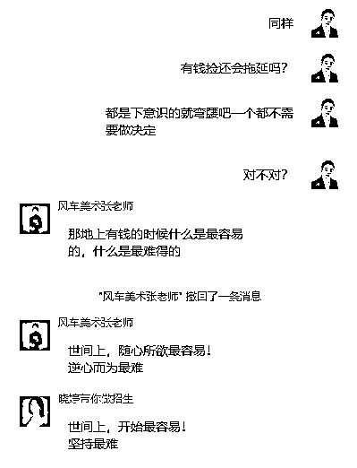
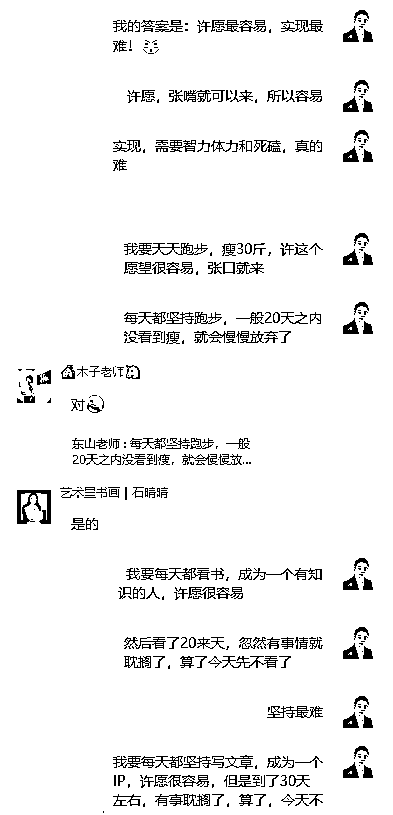
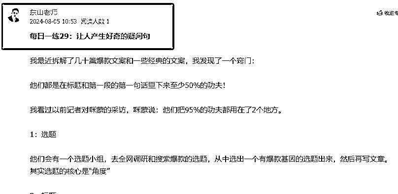

# 如何才能养成“日更”的好习惯？

> 原文：[`www.yuque.com/for_lazy/zhoubao/cwtq7icxw6xyeh10`](https://www.yuque.com/for_lazy/zhoubao/cwtq7icxw6xyeh10)

## (34 赞)如何才能养成“日更”的好习惯？

作者： 东山老师

日期：2024-08-05

前几天，在航海家群里看到大家讨论“日更”的习惯，因为我也正在坚持日更，我有一些方法可以和大家分享一下，让自己更好的做到日更。

我曾经在我的付费社群里问我的一些客户：你觉得开机构，当老板，确保能够让你一定成功的习惯是什么？

得到的答案有几十种....

"每天出去招生，坚持 2 年，肯定能成功....."

"每天坚持加私域家长好友，每天加 10 个家长，加到 10000 个，肯定能成功！”

“每天坚持发 6 条朋友圈，培养家长对我们的信任，肯定能成功。”

“每天拍一个视频，肯定能成功”

“每天用心写一篇文章，肯定能成功”

“每天好好维护一个家长，肯定能成功”

......

甚至还有人说：我要每天都坚持学习 1 个小时，让自己专业起来，肯定能成功...

其实，真的，只要能坚持下去，任何的日拱一卒最终都能成功，时间会是最好的答案。

关键你确确实实的能够做到日拱一卒，把这个习惯养成跟“吃饭睡觉刷牙”一样，不做就难受的习惯一样。

但是，据我观察，极少数的有人能做到这一点。

前几天，我在我的付费社群里发了一个讨论话题：问题是这样的:你觉得世间上 _____ 最容易？而 ____ 最难？

各种答案都有......

我的观点是：

我在 7 月 3 的那一天，给自己下了一个命令：从今天起一直到 2024 年 12 月 31 日，逢周一到周六，我都要练习一篇文案，我希望能把我的文案能力练起来。

到今天，已经更新到第 29 练习了，我有很大的信心，我能完成承诺，甚至到明年的这个时候依然在练习。

我在 7 月 22 日时，发愿要在 2024 年 12 月 31 日前，逢周一到周六，每天日更一篇文章，到今天这一篇为止，我也是写了 13 篇了。

而且我去年开始，日更视频号，我也录制了小 300 篇了。

几乎来说，我每一个“发愿”最后都能坚持下来。

现在的我， 每天是日拱 3 卒：

1）千金文案，每日一练

2）这个公众号，每天一篇

3）视频号，每天一个视频

每天我只有做完了这 3 个工作，我才会做其他工作，慢慢已经形成了习惯了。

我其实还有其他习惯在坚持着，例如“读书”的习惯。我参加微信阅读的 365 天阅读挑战，也一天不落的坚持下来了！

最近我还在坚持每天超慢跑 45 分钟的习惯，只是这个还没安排好一个稳定的时间去做，已经坚持了 30 多天，但没有形成习惯去做，所以没对外公开。

那如何才能做到“日拱一卒”呢？我琢磨了一个，有几个方法可供你参考。

**一：内功**

**1：自己发自内心觉得做这个事情：很重要，很有意义，值得沉淀和累积**

我觉得这个是超重要的，我为什么能保持着 3 个日更呢？

因为我觉希望要打造我的个人 IP，那么就需要对外去输出内容，而文章和视频是最好的窗口。

我为什么要练习文案呢？

因为文案是键盘背后的销售员，是一人顶千军万马的炸弹。

文案只是表象，骨子里包含了：心理学，营销学，人性，文字提炼等等高级的内容。

可以这么说：一个好的变现文案，真的能做到一字千金的地步，我就见过有朋友写了 200 个字的文案，收了一百多万的！

所以，我才会下决心死磕《千金文案》的每日一练！

**2：给自己一个强烈的身份感**

我就给我一个强烈的身份感：我是一个对自己负责任的人，我是说到做到的人，我不是那种半途而废的废物....

我觉得这一点也很重要。

日拱一卒到了最后，其实就是自己对自己的一个交代，我们做任何事情不是为了别人，也不是给别人看。

就是自己给自己的一个指令，自己给自己的一个承诺，自己给自己的一个交代而已。

我发现很多人，在坚持一件事情的时候，往往过多的在意别人的看法，所以很难坚持下去。

例如：怎么点击量那么少?怎么点赞的人那么少？怎么在线的人那么少？怎么互动的人那么少？

过多的把自己的事情寄托在外界的正反馈上了！

如果你只是跟自己较劲，那就可以无视这些外在的，点赞在线等有就有，没有就没有，我只需要自己坚持去做到，然后完成自己对自己的承诺。

当你真的用心输出，用心在内容上等，那些迟早都是会有的。

以上 2 点，真的很重要！我发现很多人就是默默的放弃，就是因为这 2 点没有做到，尤其对自我身份的认同等。

**二：外术**

**1：付费**

我发现，如果你真的很希望坚持一件事，最好的办法就是付费，而且付费越高，效果越好！

我问过健身的朋友，但凡是付费 2000 块买了一个年卡的，基本上都是去 3-5 次就不去了。

但是如果你是付费 2000 块一个月的，基本上每周你都会去 2-3 次以上。

我之前参加匹克球训练，也有这样的体会：

当我是借师傅的拍子在练习的时候，我基本上都是三天打鱼两天晒网的，后来，我下定决心要练习好匹克球。

我就买了很好的匹克球拍，买了匹克球网，还付费请了私教，前后投入了几千块。

为此，我在很长一段时间内，我都是一周 3 练，很用心，所以我的进步也很快。

我为了练习文案，我也前后支付了 5 位数以上的学费，买了很多文案书，尤其是港台版的，也加入了很多付费的社群。

只有增加自己的沉没成本，才会真正的死磕下去。

**2：收费**

除了付费外，让自己坚持的办法，就是收别人的费用，大家一起练。

例如【千金文案】每日一练，我就收了七八个校长的 365 元，和我一起练习。

因为我收了钱，我就有了责任，我就会坚持下去，因为我是一个负责任的人。

说真的，有那么 2 次，我真的想放弃了，周六的时候，在外面玩呢，到晚上睡觉前才发现，我去：今天的每日一练还没更新呢？

然后打开电脑，硬是日更了才睡觉！

我想：要不是有这个责任在，我肯定就算了。

所以，收别人的费用，也是一个倒逼自己不会放弃的好办法。

**3：公众承诺**

我在日更公众号文章时，我在我的社群里，在朋友圈里都发了公众承诺：逢周一到周六，如果发现我没有日更文章，随时找我，我发一个不低于 8.88 的红包给你。

我朋友圈有几千人呢？

要是我真的一天不写，光是发红包我就要亏死.....

所以，公众承诺也是倒逼自己持续日拱一卒的办法。

**4：组队**

组队一起，相互监督也是一个好办法，所以现在才有那么多打卡冲关的活动。而且最好是付费组队。

**5：为日拱一卒留出足够的时间**

我现在有 3 个日拱一卒的任务，所以我每天上午 9 点到办公室，上班了，我就先完成这 3 个事情先。

第一件事就是完成每日一练。

第二件事就是完成公众号文章。

第三件事就是写一个视频的脚本！

我把每一天精力最旺盛的事情去做这 3 件事，就代表了我对这个事情的重视程度。

所以，如果你觉得日拱一卒真的很重要的话，那么你一定要专门为此留出足够的时间。

否则，你只是说说而已！

**6：跟“赚钱”挂钩**

如果你能想办法把这个事情跟“赚钱”挂上钩，每做一点，都有正反馈进来，那么你会更有动力。

例如我的每日一练的文案练习，我练习完了，就搭配海报发到朋友圈，真的有客户直接看了就付费进来，对我就是一个正反馈。

例如我的公众文章，每篇文章的最后面都挂一个海报广告，也有人通过这个文章的阅读，然后付费加入我的社群，我也很爽。

例如我的视频，也是挂车的挂车，要么就引导加私域。。。。

当我看到我的每一个动作都有正反馈时，我也就有更大的动力去坚持下去了，直至成为一个好习惯，到那时，再讨论坚持，已经没有意义了。

* * *

评论区：

暂无评论

* * *