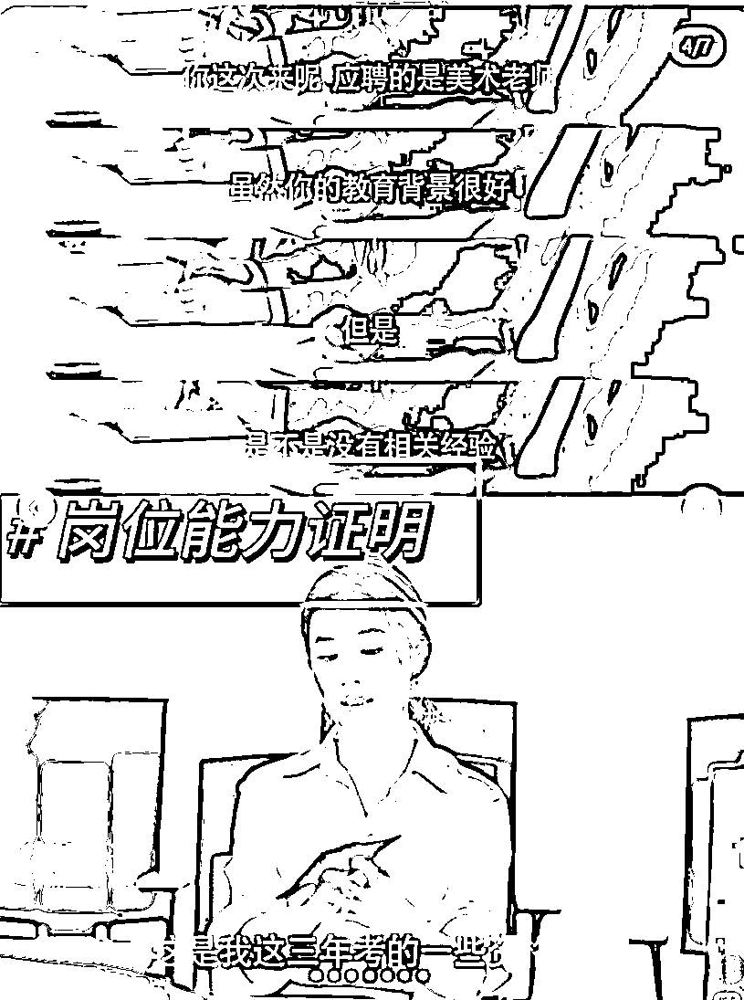

# 奥运热点又来了？发小红书怎么追热点更有效！一个公式送给你！

> 原文：[`www.yuque.com/for_lazy/zhoubao/dklg3uohugh4bi54`](https://www.yuque.com/for_lazy/zhoubao/dklg3uohugh4bi54)

## (28 赞)奥运热点又来了？发小红书怎么追热点更有效！一个公式送给你！

作者： 颜乐乐｜小红书

日期：2024-08-05

生财圈友，大家好呀！我是乐乐，一个在生财 2 年的宝子，参加了数十次航海终于开启了自由职业。前互联网媒体运营负责人。

每次热点一来，作为各大内容平台上搞流量的人，谁不想在热点的流量里分一杯羹啊！但总是把握不好尺度，最近我自己服务的客户，同样的内容，结合热点，直接爆了 3000 赞。这个方法是亲测有用的~今天给大家来分享下这个我的追热点方法。

### **一、什么样的热点值得追？**

热点这个东西吧，真的，也不是什么样的热点都能追。

比如时政类的，比较负面的时事，就不建议。

所有的内容呈现上，都尽量要选取【积极向上】的风气~这不是我们喜欢不喜欢决定的，这是大环境决定的。

所以在追的时候，为了账号安全，我们尽量不要碰那些会敏感的东西，什么 SHA 放火之类的东西，不要碰。

热点在哪看？

今日热榜：[`hot.sapi.run/#/`](https://hot.sapi.run/#/)

这个网站汇聚了各平台的话题榜，大家可以从这里进去就可以看到各种各样的热点。

有热度的明星，奥运这些最近都是可以追的。

### **二、热点到底要怎么追?**

#### **1、热点可以为我们的笔记贡献什么价值？**

1.  **点击率！**

就是点击率，你想他为你涨粉，不可能，绝对不可能，除非你是这个明星的粉丝团长。但毕竟不是啊~~~

所以，我们只要追热点，就要让热点帮我们解决点击率的问题。

热点的人物一定要放在：封面+标题上；

比如：

以最近的郭晶晶为例，他从跳水员到裁判。热度超高的~

做穿搭的，可以分享他的时尚穿搭。

做女性成长的，可以分享她从玩家到裁判，走向权利为女性争取公平的精神。

做职场的，可以鼓励女性向前一步，成为总裁，让职场更公平。

做情感的，又可以去扒他和霍启刚的爱情了

甚至做育儿的，都可以聊一下他的教育理念。

### **2、如何把热点和我，结合在一起？**

热点是热点，不是我啊，虽然我前面跟你说了，你要切入自己的赛道，热点不是话题，我们要把热点变成跟自己定位垂直的话题。

可做的时候。啊，怎么办？我还是无从下手？

一个万能公式：解析热点+你的思考+方法论+钩子

热点不应该仅仅是热点，他必须为我所用，不然就是八卦，八卦是不可能涨粉的，也不可能有人付钱的，大家只为自己的利益付钱。

包括我们有些家居博主，去拆解明星的家，不要光说明星的家多好多美，你要讲干货，然后晒出你对客厅设计的几个方案，让人觉得你又潮又有才，才会找你啊。

看个案例：前阵子很火的 玫瑰的故事

刘亦菲 产后求职这段

好多人追这个热点，什么女性成长赛道，职场赛道，心理学赛道

这就是我说的解析的部分。

**上面对这个热点的解析，可以让用户停留。**

然后他不光有解析，也放了干货，这样看完以后的感受是，我也不知道用不用得上，但先放收藏吃灰吧。

好 目的达到了！互动有了~

你图文要做数据，就是要用表格或者导图，把一些知识结构化，看起来有用实际可能没什么用，但用户会先收藏，这是我们做数据的关键。

但这个笔记缺了个啥？

钩子！所以评论区都是各聊各的 数据是很好，但没有转化的。

但好处是，他没白干，至少把数据做上来了，然后可以带动整个账号的权重，带动其他的笔记数据。

-

所以我们平时在做的时候，你说，为什么你的数据不好？热点有人看，但没收藏？你是不是有放那些让人想收藏的知识点？

为什么有收藏有点赞没人私信你，你放钩子了吗？

**万能的追热点公式：解析热点+你的思考+方法论+钩子**

热点还是要追的，点击率杠杠的！

以上是我的分享，我是乐乐，一起在小红书上搞流量呀~

* * *

评论区：

廖廖🌠 : 好棒👍 颜乐乐｜小红书 : 谢谢宝的鼓励，一起生财~

* * *