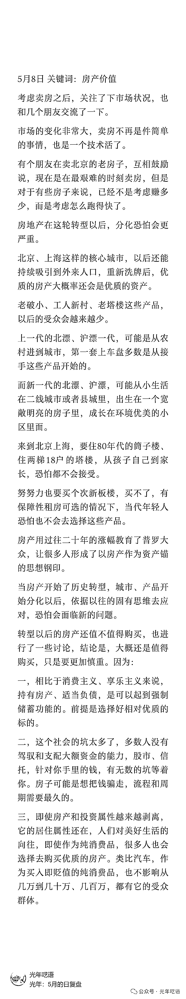

# 我卖掉了上海的自住房：个人家庭资产配置方案

> 原文：[`www.yuque.com/for_lazy/zhoubao/wfynhoy1dvbht8yc`](https://www.yuque.com/for_lazy/zhoubao/wfynhoy1dvbht8yc)

## (16 赞)我卖掉了上海的自住房：个人家庭资产配置方案

作者： 光年

日期：2024-08-09

7 月份的日复盘里，记录了我卖房子的事情。

公众号发了以后，太多朋友来问了，我把这件事情详细写一下，回答一些共性问题。

首先要说明的是，每个家庭的家庭关系、收入情况、资产配置、预期目标、风险偏好都不一样，**没有一个普适的家庭资产配置方案可以通用。**

以下只是基于我个人家庭的情况做出的判断，这些思考不一定对，但是**绝对真实，而且言行一致。**

**关于为什么要选择卖房子和以后住哪：**

大的原因是，上海房子占我家庭资产的比例太高了，还有高额贷款，我不能只把房子当做自住的消费品，只能当做资产看待来处理。

直接原因是，孩子 9 月入学初中已经确定，学区的问题我不需要考虑了。那么房子就只剩下了资产和自住这两个属性。

他初中附近，有公租房可以长租，自住的问题可以通过公租房来解决了，没有要频繁搬家的担忧。舒适性上，社区的环境要更好；地理位置和周边的配套要差，公共交通不方便，我上班不方便，刘老师和魏小想上班上学都更近；室内虽然是精装修配齐家具家电，比我自己的装修还是要差，住起来还是不如自己家舒服，但也能接受。

从资产的角度，我计算了继续持有这套房子的成本和卖房后租房的成本，均以支出最高、收益最低做的保守测算，详细数据因为太私密了不好公开

**结论是，以租房 4 年的时间线来对比：**

如果房价维持平稳，4 年租房的正收益是 7 位数。

如果房价上涨 10-12%，约为卖出租房的策略收益持平线。

如果房价下行，卖出租房的收益更高。

房价不是指均价，均价没有意义，只有自己房子能卖出的价格才是真实的价格。

考虑到我这套房子的房龄已经偏老，房龄不可逆，4 年后只会更老，都会体现在价格里。而我的装修正在最佳使用期，当前还可以作为卖点卖出溢价，4 年后也会失去价值。

综合权衡下来，我决定选择卖出租房的策略。

**关于刚需、自住：**

房子在我们的社会里，确实承载了很多，在一座城市里立足的标志，拥有一套自己房子的满足感和安全感，丈母娘的要求，孩子读书的关联，以及前些年里家庭资产上涨最大的推进器。

有朋友昨天说是刚需。每天需要吃饭是刚需，每餐需要四菜一汤不是刚需，**在买房这件事情上，其实更没有刚需。**

如果确定性的知道晚买一年可以少花 100 万，刚需的需能不能克服一年？

刚需、唯一自住房，都只是房产进程里的一个标签，不是真正要买或者不能卖的理由。

应该考虑的，是买入的房产，是可以单纯作为消费品，下跌 50%也并不在意，还是花了家庭的所有积蓄，会影响家庭生活质量 30 年。

如果是前者，就跟买车使用一样，不会过分考虑它的保值作用，使用的开心就好。如果是后者，就应该抛弃开刚需、自住房这种观点，客观看待房子的价值和自己家庭的承受力。

**关于是不是长期不看好房产：**

**是，也不是。**

这轮全国范围内的下跌，是一轮周期的正常触底，还是房地产的趋势发生了根本性的扭转？

我个人倾向于后者。全国范围内的房产，将不会再有普涨性的行情，脱离基本面的全面上涨不会再出现。2021 年我就写过这个判断：[楼市的黄金期，再也不会回来了](http://mp.weixin.qq.com/s?__biz=MzIwMjA5NDE5Ng==&mid=2247484161&idx=1&sn=e9ca36b01056dac410441782344e2cb7&chksm=96e2a01aa195290cd9509123de558728a043c9520566c650028e2bf476a1cec00ee18bd87d61&scene=21#wechat_redirect)

但即使在上海二手房价格持续走低的市场环境下，上海陆续开盘的豪宅，却一直卖的不错。

我和上海的朋友聊天，说，庆幸自己的房产是在上海吧，一是享受到了上海城市发展和地产行业的戴维斯双击福利，二是上海终归还有购买力在，狠得下心降价房子终归还卖的出去，很多城市的房子已经失去流动性了，三是如果未来地产回暖，全国只剩几个城市或者城市圈的房产还有价值，上海还会在其中。

**也就是，我认为以后的房地产市场，会是个分化的市场。**

**只有少数城市的房子还有资产的属性，多数城市的房子只剩下消费性的居住属性。**

**少数城市里的房子，也会有产品的分化。**豪宅和优质的商品房，交给市场定价。公租房、收储后的租赁和出售、以旧换新，会在保障居住的基础上，持续消减老破小、老破大、远郊房子的价值。

包括学区房，随着出生率的持续下降，学历贬值的逐步传导，到人们开始认识到卷基础教育失去了意义，**长期我看衰学区房的价值，**尤其是学区溢价过高的老破小。

这个价格重新洗盘和确立的过程，需要几年才能完成，我不确定，我选择观望。

以及有可能我的思考是错误的，这轮行情已经走到了接近周期底部，很快将迎来筑底和反弹。供您参考。

**关于卖房后资金的使用：**

卖房后如何保住手里的资金不减少，是最大的课题。而不是首先考虑怎么增值。

因为之前我就写过，普通人很少有驾驭大额资金的能力，房子已经是很难得的适合普通人的资产了。

以及当手里资金量富裕的时候，很容易做出过度投资的行为。觉得这个机会可以试一试，那个机会也可以试一试，只投一点，但是因为资金量大了，拿出的一点可能就超出了试错应该容纳的资金量。

另外就是当没有了房贷的压力，在消费上可能会趋向于更随意，投资的浮盈阶段，可能也会加剧这一倾向。

**所以，控制不乱投资和不改变消费习惯，是卖房后要面对的两个最主要课题。**

目前的策略是，卖房后 80%的资金给刘老师拿着买固收类，她还有部分美元理财资产，维持不动，只要固定收益。

20%的资金我拿着放在相对高风险高回报率的领域，其实也只是看起来的高风险。近几年的实际操作下来，我已经认识到自己不适合做交易，也不适合冲土狗，目前主要就是持有主流币、低风险套利、打新等。20%里的 80%还是会放在主流币和套利、打新、理财上。

**一个字，就是求稳，不追求高额收益。**

**关于风险：**

主要的风险，一个就是负债降低、持有大量现金后，过分投资、过分消费的风险，应对策略如上。

另外一个就是判断错误、房地产筑底成功，重新开始新一轮行情，或者大放水救市，资金继续沉淀到房子里、现金贬值的风险，**二者的本质和结果类似，就是踏空了新一轮楼市周期。**

应对策略是我也会持续关注着市场，有明显的信号和迹象，也会考虑重新入场置换我认为更优质的房产，**踏空的部分就是为自己的认知买的单。**

**关于是否要卖房：**

开篇说了，每个家庭的情况都不一样，没有普适的策略。

只能根据自己家的情况来做决策。

就像同样我的小区邻居里，有上海土著，小区里两三套的家庭就有很多家，买入时间足够早，涨幅足够大，现有的回调再增加一倍，他们也并不怎么关心。

而新上海人，在 2020 年后才买到小区的，这轮下跌已经跌到买入的成本线了，多数还都有着高额贷款，持有资金成本就需要统筹考虑了。

**关于卖房的策略：**

如果确定要卖房，要做的功课也有很多，卖房也是一门学问。

心态要调整好，现在明显不是卖方市场，在买方市场里，卖家就得态度好、服务好、心态好。

不要摇摆，没想好要不要卖就不卖，决定了卖就坚决执行。

主动把能挂的渠道挂满，友好真诚的告诉每一个渠道的中介，诚心出售。

租客退租，杂七杂八东西扔掉，保持屋里干净整洁清爽，是最起码的标准。

用智能锁或者放钥匙，随时配合看房。

清晰认知自己房子的情况，卖点是什么，缺陷是什么，对比本小区竞品和周边竞品，合理定价，坚决的走，就可以考虑挂卖 1 出货。

尊重市场，忘掉锚定的价格，就是曾经房子能卖多少钱，去年邻居卖了多少钱，当下能成交的价格，才是真正的价格。把自住的情绪刨除，自己特别喜欢和市场能卖多少钱，没有联系。

情绪稳定，心态平和，和中介的交涉和谈判，友好而坚定，不被中介拿捏。

等一个有缘人。

7 月的日复盘结尾，我写：

当时代进入了一个全新的阶段，以前的历史经验开始失效，个体能做的只有**多思考，少预测，重应对。**

思考未必正确，尤其是不要对一个走势过于笃定，尽可能做好应对各种情况的思想准备，不至于一种极端情况下被击穿。

以上是我卖房的思考全过程，根据思考的结果会有选择的倾向性，但不会就一个方向做出笃定的预测和判断，在自己判断的基础上，会假设如果自己是错的，如何应对出现的不同情况。

所谓知行合一。

* * *

评论区：

暂无评论

* * *