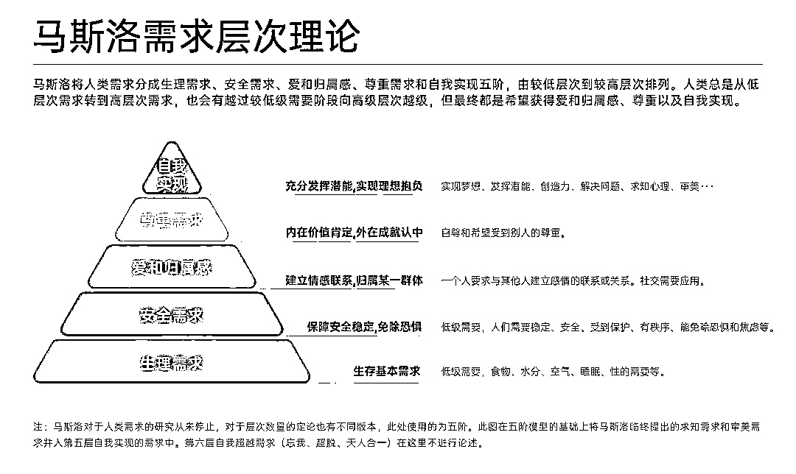

# 广告营销心理应用方法论

> 原文：[`www.yuque.com/for_lazy/zhoubao/kkh884e3lyouy2gz`](https://www.yuque.com/for_lazy/zhoubao/kkh884e3lyouy2gz)

## (10 赞)广告营销心理应用方法论

作者： 陈磊

日期：2024-08-09

我们做投放是为了卖产品、卖服务，而产品是为了解决用户需求，产品实际上就是解决方案。**营销的内核就是帮助客户解决问题，心理学效应只是辅助手段。**

我们要清楚用户的需求是什么？产品能否解决客户需求，如果可以这个产品就是好的解决方案。做广告的目的就算卖这套解决方案，为什么用户要选择你的解决方案？同行那么多，选择的方案也多，你又不是稀缺方案。通过在营销上应用心理学效应，从而提高用户选择你的概率。

**所谓的心理学效应，对应的是人性（无论是优点还是弱点），人会潜移默化的做出对应的行为，这行为是不经过大脑理性思考，纯粹靠本能驱使使然。**如果你能看透人性，你会比芸芸大众活得更通透，试问谁又能做到？很多人明明知道自己有些小毛病，但改了几十年，依旧没能改掉。当以一个小毛病非常多的人都有，那这个小毛病就算一个标签，就是一个人群，例如：贪小便宜（占便宜心理）

**1、马斯诺需求理论**

可以了解一下，非常知名的理论模型，诠释了用户不同层次，对应的需求发生改变，对我们来说，用户群体不同，使用的营销策略也不同。

**2、投放心理应用方法论**

**2.1、映照拆解流程**

**2.1.1、同行广告拆解**

知己知彼，百战不殆。可以对照下方的心理学效应，看看同行的广告作品都采用了哪些，分别起到了什么作用。

**2.1.2、自己广告拆解**

我们做出了一个作品，可以自行拆解，看看引用了哪些心理学效应，我见过一条心理学效应都没有使用的广告，效果可想而知，一个作品的好坏看看引用了多少心理学效应就知道了，营销作品的流量都是买的，不必担心因为过度营销而没有流量。

**2.2、内容制作应用心理**

**2.2.1、明确产品功效**

产品的核心卖点有哪些？

产品能解决哪些需求？

产品的能展示的效果图或视频？

产品有哪些技术优势？

产品有没有价格优势？

产品有没有品牌优势？

**2.2.2、明确用户需求**

在制作广告投放素材时，明确用户需求是至关重要的。以下是一些关键角度，可以帮助你更精准地定位广告内容和设计：

目标用户的基本情况？年龄、性别、职业、兴趣

目标用户目前的痛点是什么？

目标用户为什么需要你的产品？

目标用户在马斯诺需求模型中属于哪一层？

目标用户的需求是刚需还是？

**2.2.3、提高说服力**

当我们知道产品卖点和用户需求后，可以加以心理学效应说服用户，心理学效应可以大幅度提升营销效果，例如一个广告作品用了心理学效应，一个没有用心理学效应，获客成本就会相差很大。**人性如此，我们要尊重人性。**

**心理学效应可以用一条，也可以同时用多条，自由组合，举一反三，不必硬套。**

**自查方法：**只需要换位思考，体验一遍服务链路，如果非常的舒服，没有卡点和厌烦就算是可以了，当然也可以反过来用，故意制造难度，劝退一些用户，我称之为筛选链路

**3、心理学效应**

**3.1、影响力原理**

**3.1.1、承诺和一致性原理**

**人们倾向于保持自己的行为与之前的承诺或行为一致。**对我们来说，如果能让客户做出一些承诺，那么在后面兑现承诺的概率就会高很多，例如用户预约了你的公开课，如果没有意外的情况，去听的概率就会很高，这就是承诺和一致性原理导致的结果。

例如：引导小承诺、积极正向反馈、一致性奖赏都是为了迎合承诺和一致性原理

**3.1.2、对比原理**

**人们通过比较来判断事物的价值。**有一句话，没有对比就没有伤害，在用户面前做对比，高低立判，会引导用户判断，毕竟对比的关键因素，是由你的决策的，换一句就是对比结果在你的预判范围内。

例如：效果对比场景，拥有失去对比场景，特点对比场景，参数对比场景等都是为了迎合对比原理。

**3.1.3、社会认同原理**

**人们倾向于模仿他人的行为，尤其是在不确定的情况下。**每个人都社会上都是一个角色，每个角色都是一个群体（种族、性别、国籍、宗教、职业等等），这个群体有一个共同的属性，很多人想要成为这个群体的一员，因此选择。人们渴望成为某个群体的一部分，并遵循该群体的行为规范。

例如：身份地位类产品，某群体必用产品等都是为了迎合社会认同原理。

**3.1.4、权威原则**

**人们倾向于服从权威人物的指示或建议。**想要让别人听从你的建议，你必须是一个专家，你分享的内容非常专业，标准的高维打低维，因为你是专家，听你的建议可以减少试错成本。或者说你是行业知名人物，或你制定了规则，那么你的话就会非常有说服力。

例如：专家分享，权威讲座，响应政策等都是为了迎合权威规则。

**3.1.5、稀缺心理**

**认为稀缺的物品更有价值。**古董值钱这个事是印入人心，但古董真的值钱吗，非也，单纯论证其使用价值，一文不值。而另外一方面因为少，而且能在市场上流通，有人认可才值钱。一个产品因为数量少，需要的人多，所以这个产品的价值上升，所以人们更愿意高价追求一些稀缺的产品。

例如：限量售卖，限时抢购，限量赠送等都是为了迎合稀缺心理。

**3.1.6、从众心理**

**人们倾向于遵循大多数人的行为或观点。**如果是很多人都认可的东西，出问题的话，吃亏的不只我一个，那么多人都认可，说明产品是被验证过的，试错成本。

例如：社会认同场景，流行趋势场景，用户评价和推荐，限时抢购与稀缺性，社会压力（主流价值观），群体使用场景等都是为了迎合从众心理。

**3.2、情感驱动心理**

**3.2.1、恐惧心理**

**利用人们的恐惧感来影响他们的行为。**人们对未知的东西都会害怕，因为害怕所以会做些避害的行为，在实际应用中，让用户知道不使用你的产品，会面临可怕的后果，所以会买单，但要掌握分寸。

例如：风险提醒，危机情景，对比效果（强调不行动后果），负面后果展示，权威信息警告等都是为了迎合恐惧心理

**3.2.2、自私心理**

**人们倾向于优先考虑自己的利益。**自私是人性，人们只会关注和自身利益有关的事情，也就是趋利，这里的自私心理指的是占有欲，希望自己独占利益，不希望他人分羹，排他性很强。

例如：个人利益突出，展示自我提升，个性化解决方案，独特性强调，占有欲激发（限量版产品、专属服务），直接回报等都是为了迎合自私心理

**3.2.3、好色心理**

**对性相关事物的自然倾向。**基因的使命的传递生存，好色是基因想要延续的表征，因此产生行为不需要经过大脑，纯粹的本能驱使。

例如：美女帅哥代言，性感形象，浪漫情节，美学设计，时尚元素等都是为了迎合好色心理

**3.2.4、懒惰心理**

**人们倾向于选择更省力或更少努力的选项。**懒惰是人性，能躺着绝不坐着，能坐着绝不站着。在广告投放上，用户成交链路越长，需要用户行动的节点也会越多，流失就会越大，反过来也是如此。

例如：一键操作。节省时间，自动化和智能化，即食即用，便捷配送，简化流程，傻瓜式教程，整体解决方案等，都是为了迎合懒惰心理。

**3.2.5、贪婪心理**

**过度渴望财富或物质。**贪婪是人性，不管自己是否用的上，先索取在说，越多越好，没有接收上限。

例如：价格优惠，捆绑销售，买一送一，限时促销，赠品策略，积分奖励等都是为了满足贪婪心理

**3.2.6、存在感心理**

**人们渴望被认可和注意。**如果被人认可，是一件非常愉悦的事情，肯定客户的存在，让用户得到被重视的感觉，

例如：个性化服务，用户参与互动，定制化产品，社交媒体分享（使用体验），VIP 待遇，故事化营销（用户和产品的故事），意见领袖合作，品牌社群共建等都是为了迎合存在感心理

**3.2.7、名片效应**

**通过展示与用户的相似之处来增加信任和影响力。**找到与用户相同的地方，告知用户咱们是一类人，你可以信任我，不用排斥我。

例如：相同的三观，来自同一个社群，某某课堂的同学等都是为了迎合名片效应，增加信任度。

**3.3、行为驱动心理**

**3.3.1、猎奇心理**

**人们对新奇事物的好奇心。**没有见过东西，最吸引人，这个就是新鲜感，对未知的东西，充满了好奇心，在自身认知角度，没有危险的情况下，本能的愿意去探索。

例如：神秘感营造，独特卖点突出，限量版产品，未公开信息预告，探索式广告，文化元素融合产品，跨界合作产品，科技亮点展示等都是为了迎合猎奇心理，满足好奇心。

**3.3.2、即时反馈心理**

**人们渴望立即看到他们行为的结果。**我们打游戏的时候，每点击一下，金币数字就会增长，这个过程就是即时反馈，心情会非常好，因为拿到了结果。

例如：互动式广告，问卷调查和投票，即时聊天沟通，评论互动，动态广告内容，即时优惠和奖励，进度条和完成度展示，即时的用户评价等都是为了迎合即使反馈心理。

**3.3.3、成就感心理**

**完成某项任务后获得的满足感。**花费了时间精力，克服了层层困难，终于攻克了难关，这个伴随而来的就是成就感，这个成就感可大可小，但不影响成就本身

例如：产品使用后目标设定，进步可视化，挑战与奖励，等级与勋章系统，用户评价和分享，成功案例，个性化成就等都是为了迎合成就感心理

**3.3.4、攀比心理**

**人们倾向于与他人比较，并希望超越他们。**攀比是人性，没有人希望比他人差，都想比他人强，为了比他人强，会愿意付出各种各样的成本。

例如：社会地位象征产品，限量版和稀缺性产品，高端生活方式展示，明星代言产品，用户评价和社交证明产品，产品使用后成就展示等都是为迎合攀比心理

**3.3.5、慕强心理**

**人们倾向于崇拜或模仿强者。**一个人很强会吸引很多崇拜者，跟随者，人们都希望向上社交，和优秀的人合作，向优秀的人付费，普遍做法就是晒肌肉，让他人知道你很强。

例如：权威代言，成功案例，领导品牌定位，专业性强调，高端形象塑造，潜力展示，优势展示，成就展示等都是为了迎合慕强心理

**3.3.6、捷径心理**

**人们倾向于寻找快速解决问题的方法。**走捷径这事不对，但人人都想走捷径，虽然可能会为此付出更大的代价，也会在所不惜，给用户一个捷径，就是最好的产品，但前提是你真的能提供。

例如：自动化工具，一键完成，标准化方案，代运营代操作等都是为了满足捷径心理。

**3.4、决策心理**

**3.4.1、损失厌恶心理**

**人们对损失的反应比对同等收益的反应更强烈。**没有得到没关系，但不能失去，营销上也就是让用户感觉到即将失去，从而盲目的下决策，冲动消费。

例如：限时购买，限量购买，优惠活动即将结束，产品短期试用等都是为了迎合损失厌恶心理

**4、认知偏差知识手册**

飞书出品的《认知偏差手册》 反响热烈，官方公开的电子版。推荐拜读

[`s75w5y7vut.feishu.cn/docs/doccn3BatnScBJe7wD7K3S5poFf`](https://s75w5y7vut.feishu.cn/docs/doccn3BatnScBJe7wD7K3S5poFf)

* * *

评论区：

暂无评论

* * *