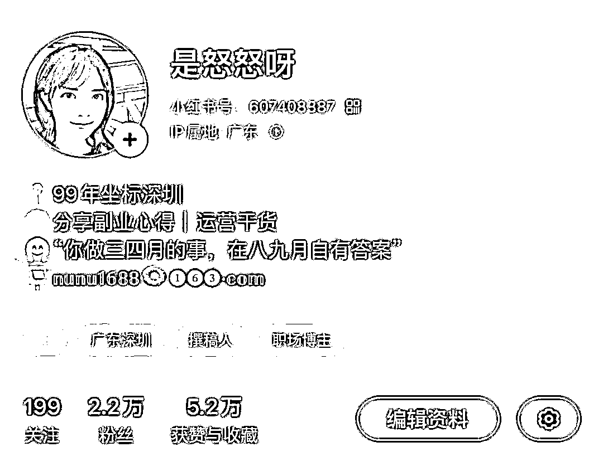
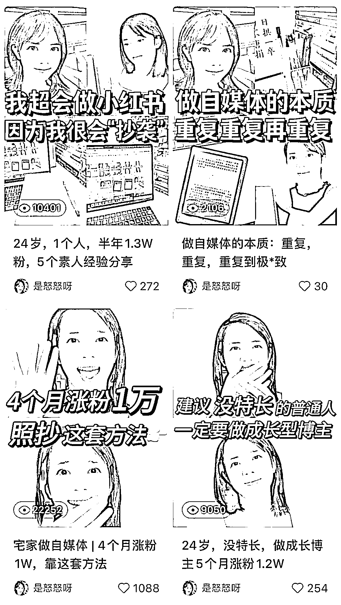
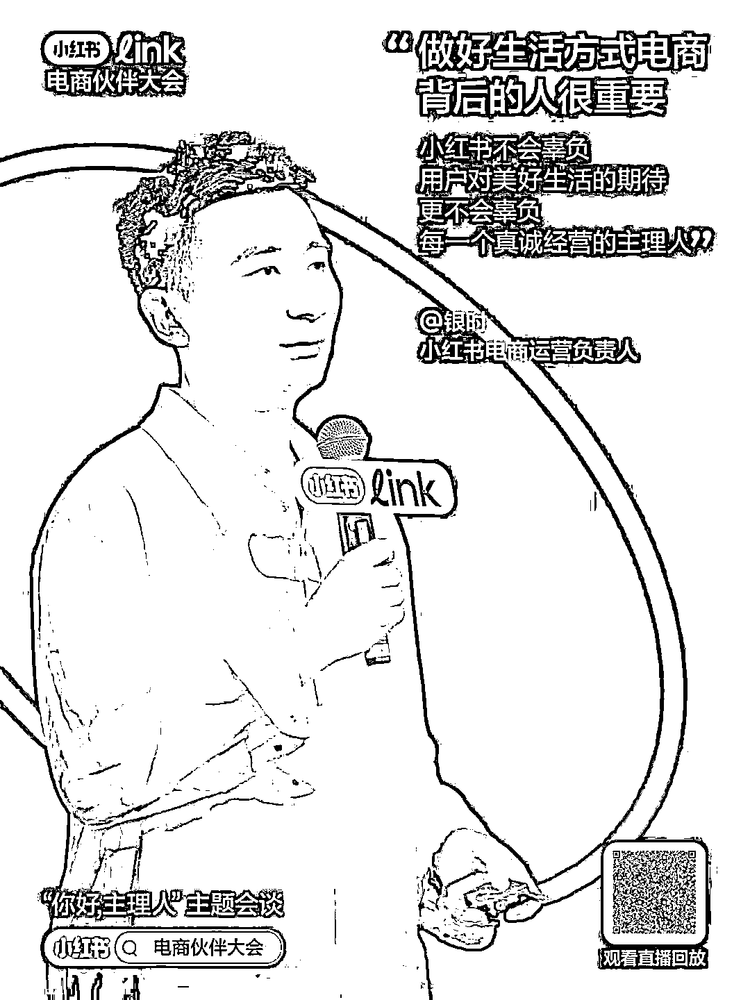
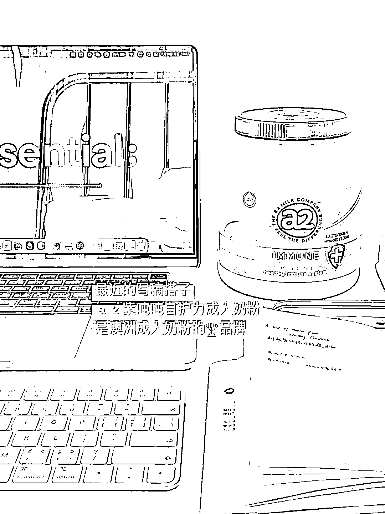
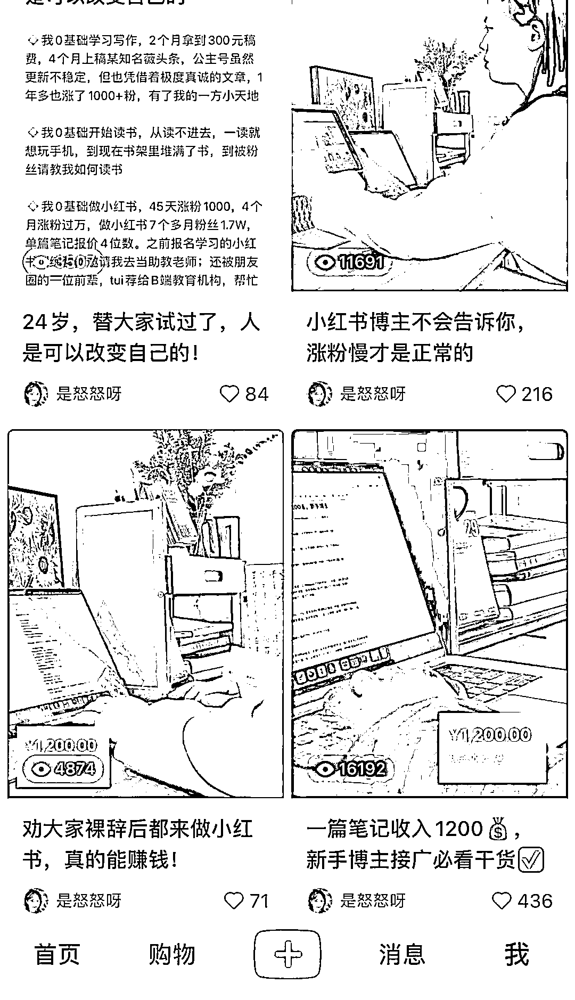
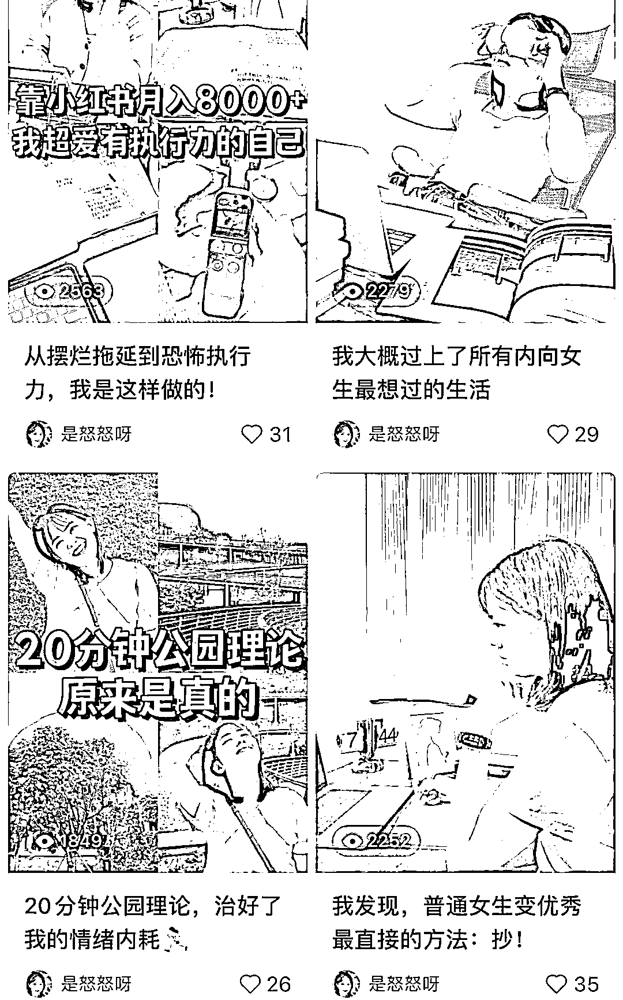

# 小红书 2W 粉了，靠接广变现 5 位数，给新手分享 6 个独家运营经验

> 原文：[`www.yuque.com/for_lazy/zhoubao/syb0220wul46gqvb`](https://www.yuque.com/for_lazy/zhoubao/syb0220wul46gqvb)

## (66 赞)小红书 2W 粉了，靠接广变现 5 位数，给新手分享 6 个独家运营经验

作者： 是怒怒呀

日期：2024-07-29

你好呀，我是怒怒。

去年 6 月 14 日，我正式开始更新小红书，到今天 1 年 2 个月了，在此期间，我一共发布了 90 篇原创笔记，涨粉 2.2W，变现 2 万多。

因为这个账号，我被全网 30 万粉丝的博主，邀请当小红书训练营助教，深度辅导了 10 多位小伙伴做小红书；也因为这个账号，我有了在百万大 V 的小红书实战营当助教的机会。

作为一个自媒体运营小白，能做出这点小成绩我付出了很多，也走了不少弯路。

今天这篇文章，都是我这 1 年多做小红书的实战经验，分享给想要靠接广变现的博主，希望能帮你们少走一些弯路。

## 01 **持续且稳定地更新，是博主的基本功**

如果说让我分享最重要的一个经验，那持续且稳定地更新一定排在第一条，因为更新真的太太太重要了。

做账号就像线下开店铺，店里营业了才会有人来逛，有生意可做。如果**账号不更新，就相当于店铺不营业，自然就不会有流量和广告收入。**

我接触的接广多的博主，更新频率都很高，基本保持周更 2 篇以上，有的博主甚至还会周更。

一是因为小红书的算法是按照单篇笔记推送，**笔记发得多，流量相对来说就会更多**，账号也会得到更多的曝光。

对于靠接广变现的博主，每周更新一篇是不够的，更新 2 篇是基本功。

接广告，就跟线下卖摊位一样，你的位置人流量大，才能卖个好价钱。

提高笔记数量，一定程度上能提升爆款的概率。有了爆款笔记，会带动整个账号的数据，比如点赞、收藏、涨粉等等，数据好了，品牌方会更愿意投放广告。

二是，**持续且稳定地更新，也是一个博主创作能力的体现。**

这意味着博主要在平台深耕，要了解平台的趋势，要不断学习、迭代账号，一个长期在平台混的人，大概率要比三天打鱼两天晒网的博主创作能力强。

## 02 **想好变现方式，以终为始做账号**

一开始做账号，我没想清楚变现方式，一心只想着快点发笔记，做了初版定位之后，就去找热门选题，什么火我就做什么。

没想到运气还不错，被我遇上了一些好选题，4 个月账号就突破万粉。

**可是，人不可能一直有好运气。**

**万粉之后，我的挑战正式来临：变现难。**

因为起号时我发的内容都是小红书运营干货，虽然涨粉很快，但是没有广告位，品牌方觉得我的账号是教别人做自媒体的，不愿意找我合作。

这也是很多新手都会踩的一个坑，只知道分享干货，把账号弄得像是引流到私域卖课的，不受品牌方青睐。

**「以终为始做账号」的意思是，以变现方式倒推账号要用什么人设、发什么内容、图片怎么拍。**

如果你明确了账号要靠接广告变现，就找广告多的博主对标，去参考对标账号的选题、文案结构还有图片布景，而不是去找靠卖课变现的账号对标，不然整个账号的运营方向都是错的。

（账号的接广情况，在蒲公英或者灰豚数据上都可以看到，不过需要会员，在闲鱼上买比官方渠道便宜一些，这笔钱花在找对标账号上很值得。）

## 03 **广告位不是简单地露出物品，还需要种草**

总有人说小红书接不到广告，让你去私域赚钱。

事实上，私域卖课具有一定的壁垒，做一套课程需要有足够的知识积累，也需要较多时间做交付，卖别人的课程又会有一些隐形问题，比如课程交付质量没办法把控等。

**对大多数想发展一门副业的打工人来说，接广告是更适合的变现方式。**

其实一开始，我也以为小红书博主接不到广告了，纠结过要不要在私域卖别人的课来变现。

后来发现，不少博主每个月都能接到很多广告，广告收入从几千到几万元不等，关键还是看账号的内容质量。

一句话说就是：

不是小红书没有广告接，而是大多数博主还达不到接广告的标准，账号没有出现广告位。

那什么是广告位呢？

**简单理解是「什么人，在什么时间、什么地点，做了什么事」。**

**这个广告位的理解，跟前两天小红书的官方直播传递出的信号不谋而合。**

直播里提到，小红书今后要主打“生活方式电商”这个方向，意味着博主如果想要更好变现，就要在账号里多呈现自己的生活方式，以及生活方式下对应的场景，让粉丝为你的生活方式买单。

举个例子，假如你白天是打工人，晚上下班后做副业，那就围绕着这个身份，去分享你的生活方式，你作为有副业的打工人的一些日常，比如你每天穿什么、吃什么、买了什么等等。

这些**吃喝玩乐里面就会有各种场景，场景下面会有很多产品，这些产品就是所谓的“广告位”。**

再比如，我目前账号的人设是一名自由职业者，我经常在书桌写稿工作，我的账号会出现书桌场景，在我的书桌场景下有电脑、键盘、ipad、书本等等，那品牌方就可以在这个场景下面植入广告。

前段时间我接了一个奶粉的广告，使用场景是“作为博主有时候需要赶档期，来不及吃早餐时，我会喝上一杯牛奶，满足一天营养所需，让我快速进入工作状态”。

配图是在书桌上，这样一来，奶粉就有了具体的场景，能激发出部分人的购物需求。

博主的种草能力可以一步步提升，前期不会种草很正常，需要多看其他博主的广告，学习他们如何软性植入广告，再根据自己的人设和场景去创作内容，写得多了，种草能力就会提升。

另外值得说的一点是，**新手前期接广告，可以不用太介意单篇广告的价格，用广告倒逼自己输出，提升商单创作能力，积累作品**，**后续不愁没有广告接。**

## 04 **给账号立一个人设，人设跟变现息息相关**

人设并不是用来装 X 的，是为了让品牌方和观众更快地知道你是谁，如果你不给自己贴一些标签，那账号就很难有目标人群。

**因为，用户在搜索的时候，用的是关键词搜索；平台算法，也是基于关键词推荐。**

人设分为几个方面：特质、身份、场景、道具。

特质，比如真诚、会说段子、长得好看；

身份，比如宝妈、打工人、985 学姐；

场景，比如书房、客厅、草坪；

道具，比如玩偶、服装。

可以结合自己的情况，选择 2-3 个作为核心人设。

要立人设的另一个原因是，人很容易被自己类似的人、或者对自己有用的东西所吸引。

比如，某个博主的人设是“有点小钱的国企打工人”，那观众可能就会被“有点小钱”、“国企打工人”吸引，成为她的粉丝。

再比如，我现在想转行新媒体运营，会在小红书上搜索“新媒体运营”的一些职场干货，如果我发现了一个也是转行做新媒体运营的博主，内容质量还不错的话，那我很可能就会关注她，因为对我有用。

再者，**博主的人设，也体现了粉丝群体的购买力**。

25 岁打工人的人设，大概率会比大学生人设更容易获得品牌方青睐，因为打工人有更强的购买力。

## 05 **账号转型急不了，要结合粉丝需求慢慢过渡**

我今年做小红书犯了一个错误：转型没有顾及粉丝需求。

我的账号是靠自媒体干货起号的，这个方向前期起号和涨粉很快，但后期比较难变现，因为很容易被 pr 认为是教别人做小红书的号，加上我没有植入广告位，接广情况不乐观。

当时有个博主给我的解决方案是拓宽选题。

刚好那段时间我发腻了自媒体干货，就发了一些跟账号原本方向很不一致的内容，比如“普通女生变优秀的方法”、“内向女生最向往的生活”等等。

又加上账号断更了一段时间，导致数据出现较大的下滑，这对于之前笔记数据普遍比较好的我来说，是一件比较难接受的事。

吃了这个大亏以后，我才明白：

**（1）账号转型急不了。**

不是之前发自媒体干货，今天发现这个方向有瓶颈了，明天立马就去做想做的赛道；而是根据粉丝的需求、忍受度慢慢过渡。

**假如再给我一次机会，我会在账号流量高峰时就开始转型。**

转型思路依然是拓宽选题，但会控制原有选题的占比，比如自媒体干货的选题占 70%、自由职业占比 30%。

**同时，一段时间就只改变一个元素。**比如我想改变封面风格，就不能动原有选题；我变了选题方向，就不动封面形式。

**如果同时换封面风格和选题，粉丝认不出我是谁，接受不了我的新内容，数据很可能出现比较大的波动，带来不必要的焦虑。**

**（2）不要完全相信任何一个人说的话，哪怕这个人是你很信任、很喜欢、很认可的人。**

每个人说的话，都是基于他过往的经验。

立场不同、喜好不好、经历不同、能力不同、对事情的预期不同，就决定了我们不能完全按照某个人的经验行事。

而且，在付费的情况下，如果某个老师对你提的问题一知半解，那她只能一知半解地给你解惑，你无脑地听话照做，必然会踩坑。

如果想解决某个问题，自行先了解、做拆解，实在不懂再去付费，付费也要找到靠谱且有成果的人。

比如我搞不懂广告位是怎么回事，那我就去找那些接广多的博主，拆解他们账号的选题、文案、图片等等。实在解决不了的问题，我就付费找了一个腰部博主做咨询。

## 06 **做自媒体，本身就是一场学习之旅**

当了 1 年多小红书博主，我发现这个职业挺苦的。不仅要保持稳定的更新，而且要不断学习。

刚开始学如何做定位、如何做选题、如何拆解爆款内容等等，后期需要学习如何提升账号调性、如何拍好看的图片、如何露出广告位、如何做视频，还要学习平台动向、学习平台的新玩法。

有时真觉得这样一直学习有些痛苦。

但是认真想想，**其实每一份职业都会有很多变化，博主是互联网行业下的一个职业，变化自然比其他职业更快。**

只有拥抱变化，在变化中持续学习和迭代自己，提升能力，才能不被平台淘汰，拥有更多机会。

那些停止学习和迭代的博主，最终也会反映到账号上，比如账号数据下跌，商单数量减少等等。

董宇辉说：**“顺境时多做事，逆境时多读书。”**

如果你的账号遇到了瓶颈，那就去读书、去学习、去拆解优质账号，把学到的东西迭代到账号上，迟早都会突破瓶颈。

## **写在最后**

以上就是我做小红书 1 年多的感悟。

回过头来看，做自媒体给我最大的收获是，**让我见识到了这个世界的多样性、见识到了现实生活里见不到的人生和活法。**

让我变得豁达，让我的格局变大。

让我更加了解自己，让我看到自我的价值，让我有勇气奔赴那个想去的未来。

还让我结交了一群志同道合的伙伴，在成长路上不再孤单。

做自媒体的好处远远不止于此，借用杨天真的话来说就是：“自媒体是一把钥匙，既然是钥匙你就打开它，打开了才知道门后面有什么。”

祝每个有野心的普通人，

都能靠自媒体闯出一番事业，

我们一起顶峰相见！

* * *

评论区：

暂无评论

* * *