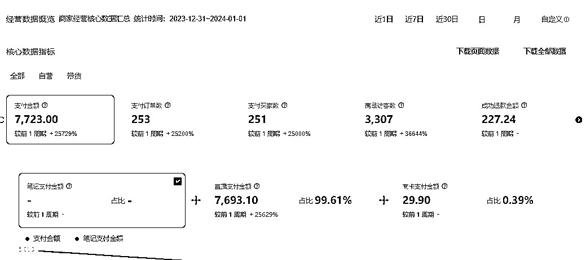
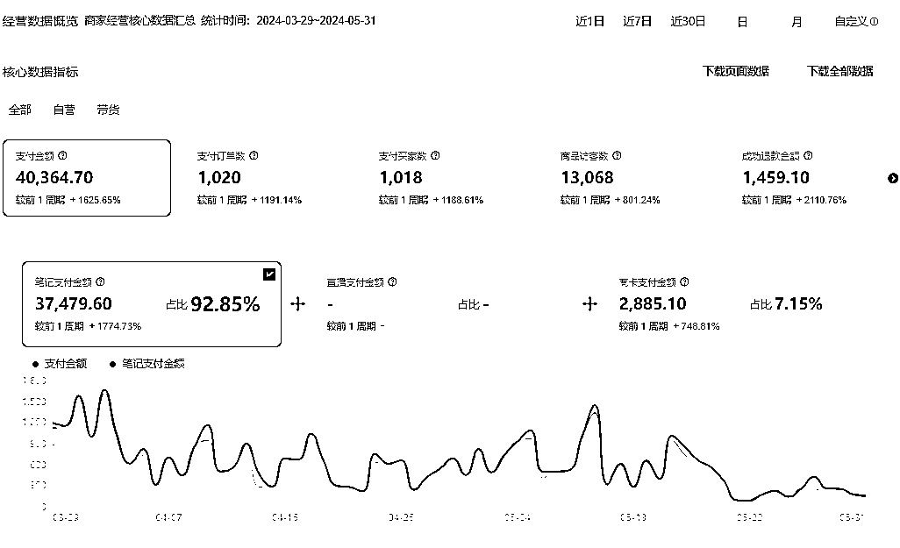

# 在杭州卖了几年房子，回家做了一年小红书店铺的复盘

> 原文：[`www.yuque.com/for_lazy/zhoubao/ofahnrrdv45o46vw`](https://www.yuque.com/for_lazy/zhoubao/ofahnrrdv45o46vw)

## (30 赞)在杭州卖了几年房子，回家做了一年小红书店铺的复盘

作者： 大鑫 Xin

日期：2024-08-02

大家好，我是浙江衢州的圈友大鑫。

在离职创业做小红书店铺之前，在杭州从事五年的房产中介工作，离开房地产行业是因为大势已去。

我对杭州的楼市很熟悉，也赶上了杭州楼市的一波五年的小红利。

芸芸众生，我们不过时代变化之下的一粒沙。

行业决定我们的命运，离开房地产行业，也是我自己深思熟虑后的一个选择。

楼市下行期，我再怎么努力，都抵不过行业下行趋势的势不可挡。

在杭州压力很大，生活成本也很高。

我选择回到衢州，在家乡起码没有生活成本，能住在自己的大房子里，生活的也更舒心。

在加入副业之前，从来没有真正意义上的做过电商这个项目。

2023 年在杭州从房产中介离职之后我一直苦于寻找合适自己的项目，因为自己没有太多互联网上的经验，一直在小打小闹。

刚好 23 年是小红书电商的元年，感谢副业，一直在副业参与小红书店铺的航海。

## 一、心路历程

2023 年 9 月，我做过小红书笔记搬运混剪，自己手上一个号刚起来半个月卖了 2.2 万 GMV，很不巧的在 2023 年 11 月碰到了小红书平台打击笔记混剪二创，大面积封号。

然后又到 12 月月底去测试小红书无人直播，当时我选择了百货的赛道，因为退货率低，客服量也低，这是我当时单场直播的数据，百货虽然转化率低，但是这场直播也到手了 3000+。

等到 2024 年 1 月份，小红书平台又慢慢的严查无人直播，很多还没有起号就被封了，心力交瘁，刚好过年了就休息了一段时间。

年后，小红书笔记混剪松了很多，又可以做了，自己也结合去年在笔记带货上面的正反馈于是就决定继续做笔记带货。

因为之前从来没有任何平台的电商经验，但是对应自己之前卖房子的一些经验。

做到现在我认为小红书上做电商其实跟实体店卖东西是一个门路，笔记封面对应的是实体店的门面，选出来的品就是我们要卖的产品，笔记视频就是实体店销售员推销产品的场景。

## 二：选品思考

选品定生死，再好的产品卖不出去就不是好产品，即使它多么好看，有多么好用。只有经过市场检验过的产品且有一定销售量的品才是我们要选择要卖的品，我自己会在小红书平台上找销量过千的且产品销售时间越短越好。

因为小红书用户群体女性基数比较大，年龄分布在 24-35 岁之间，这个年纪的女性群体。

共同特性就是爱美、要变优秀，也可以围绕用户痛点去选品。比如现在夏天到了很多女生要防晒，防晒面罩、遮阳帽就可以选择。

## 三：封面思考

封面就是一个实体店的门面，门面好看才会吸引用户进来看你要卖的产品。

封面我们的原则是“抄”，我们选出来的品已经经过市场检验了，那一定会有对应的笔记。

关于封面我咨询过@书豪 教练，教练说过，我们只要把小红书带货笔记对应的高点赞的笔记封面扒下来放入美图秀秀进行二次原创，加滤镜、贴纸等操作。然后把贴纸的不透明度设置为 1%就是做了去重。

还有就是用小红书搜索相对应的产品关键词，看看近期有没有和我们要卖的产品相似的高点赞笔记，也可以采用他们的封面。

## 四：测品

我们选出来的品，别人卖的好，我们不一定卖的好，只有发一定量的笔记测试才知道这个产品是不是属于我们的好产品。

测品我是采用多脚本+多封面标题的组合，交叉测试，一个品至少要测试 10 篇以上的笔记。

## 五：评论区+晒单笔记

评论区要用小号多发一些关于产品转化的推销词，比如：我买了，姐妹们等我反馈；这个我买过确实好用等，有助于用户点击商品。

一开始小号去做评论是够用的，等到我做了四个账号以后，发现自己的小号去做评论不够用了。后面找了@书豪教练介绍找到了一些做评论的资源。

笔记评论可以增加我们的转化。

晒单笔记：刚开始上架商品的时候，没有销售量，可以用小号或者家人的账号购买个 10 单，发货只需要发一单就行，这样用户看到商品页不会因为 0 销量就不买了。买完到货后自己做个晒单笔记，可以增加转化率。

## 六：心得感悟

小红书是一个慢热的平台，它不像抖音要每天多测品，小红书可以做到单品单店。

我现在手上这个账号，是我年后测试了一个月才开始有第一篇爆款笔记，它的长尾流量可以坚持半个月到一个月，做小红书电商一定要有耐心。

等一个商品起量之后就可以持续带这个品，因为你这个账号的商品链接有了一定的权重，发的笔记带这个商品链接，起始小眼睛就会比新号高很多，只要每天更新笔记会持续带来销量。

感谢副业开启我自由职业的大门，副业让我有机会通过航海学会小红书店铺的技能，跑通从 0 到 1。

现在做小红书每个月能有一两万的收入，足够我在老家三线城市衢州的日常开支。

也感谢副业这个大家庭，能够让我链接到很多优秀的人，做小红书店铺，感谢@书豪教练，在我从 0 到 1 的路上，给了我很多选品测品的建议。

也希望所有圈友，都能够在这个变化的时代，找到适合自己的路，找到自己热爱的生活方式。

* * *

评论区：

💙洽洽 : 感谢分享，想问问笔记评论的资源[抱拳][抱拳]
大鑫 Xin : 我找的书豪教练要的
云七 : 刚准备去尝试当海景房销售[衰]
rrcc : 想问一下一个月收入 1.2 万是多少个账号的收入
大鑫 Xin : 1 个账号
大鑫 Xin : 哈哈 现在改善型住宅需求量还是多的也保值 *(:3」L)* : 牛牛，请问货源的话是和批发商联系无货源模式吗，在考虑产品质量问题，少量品的话买得过来但可能卖得不太好，大量的品每个都要看看质量开销就太大了，这部分很头疼想看看大佬见解
大鑫 Xin : 货源的话直接 1688 下，前期选择有牛头的开店时间长的，质量问题可以看我们的买家退货和评分情况，退货率高评分低就要考虑换供应商了，不确定的话也可以买一单看看情况后期可以实拍或者七天无理由退了

* * *