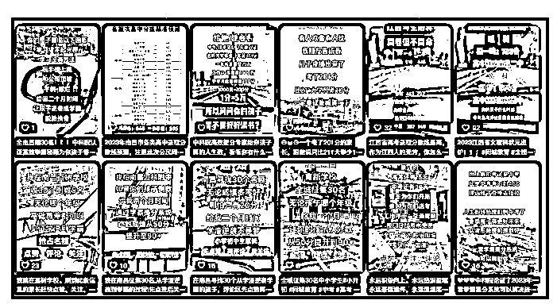

# 小红书资料号无版权纠纷，长期能赚到年入 50W 的阳谋

> 原文：[`www.yuque.com/for_lazy/zhoubao/nhco5r3scz4ml0mz`](https://www.yuque.com/for_lazy/zhoubao/nhco5r3scz4ml0mz)

## (27 赞)小红书资料号无版权纠纷，长期能赚到年入 50W 的阳谋

作者： 领飞懂运营

日期：2024-08-01

又见面了，我是领飞！

**说实话电商而言，**对新人互联网创业，都不是很友好，门槛真的很高，只有一个赛道目前来看，还算有政策扶持，那就是“三农”本地农产品。

**如果你的家乡有特殊农业，**或者你有老家宅基地，远离、逃离，都市的笙箫，这个话题普通人还是能做。

以农村 VLOG 视频形式，做一个小人物 IP，观众很愿意看，因为城市太压抑了，这种电商卖货不乏值得一试。

今年我姐夫，逃离了西安，他是一个托尼老师，本职不干了，回到了陕西绥德县，零基础卖农产品，3 个月时间做的非常不错，拍拍段子，直播卖卖本地瓜果梨桃。

把西安的房子卖了存银行，回老家陪父母，老婆热炕头，天天溜娃，也很惬意！！！

电商其根本玩爆款，你没有爆款能力，很难赚到钱，利润现在已经很低了，所以吃”人设“卖货，回农村还是比较有机会。

言归正传！！！

**“小红书”运营，火的一塌糊涂**

资本进场了，推出来的火热现象，不管怎么说，哪个平台能给你流量，你就介入，一点要看开什么是红利。

小红书由于女性居多，卖资料就成为了重灾区，如：旅游攻略，小学教辅资料，育儿资料，装修资料，考试资料等。

**其中：**育儿资料和孩子升学考试教辅资料，做的人非常多。

账号如果正常，基本发出去内容，就有人想获取，之后就可以出售了。

以及这样的教育账号 1000 粉，就能接商单广告，所以做的人非常多。

**卖资料能赚钱吗？**

其实赚不了多少钱，都是卖这个培训项目赚钱，你如果不会卖，那肯定也就只能拿到一点小小的收获。

单凭卖资料这件事，想要赚的多，必须有后端其他变现，这就是重点了。

**一、全网运营**

教育资料号，本身也是服务一类群体，这类人的钱是可以长线系统的变现，这也是能赚到大钱的根本。

一个宝妈教育的粉丝价值 20 元以上，甚至更高，所以不变现卖粉丝也是赚钱的项目。”打粉“

**资料的本质是什么？**

是可以无限复制，所以它价值不高，但是如果你长期的整理这些资料，系统的整理，规类的整理，它就值钱了。

但这种值钱，也只是短暂的稀缺性，要知道它是很容易被同行复制的。

基于以上逻辑，资料最大的价值就是赠送。

我之前写过几篇文章，“阳谋”，可以翻阅下。

**阳谋里“赠送”，**把赠送发挥到极致，不停的赠送，别人卖的你送，别人不送的你还送，这就发挥了你的价值，也让粉丝知道了你的价值。

你刻意的把资料整理起来，送给他们，长期的送给他们，他们是非常感谢你的。

尤其是对于宝妈教育粉，这个赠送性质，是能被他们传播的，她们的圈子年龄相符，会自愿被分享，如果你要卖，那肯定就不自愿了。

在小红书运营，在抖音运营，在视频号运营，在快手运营，也就基本把全网覆盖了。

**就小红书而言（其他也一样），**你做号运营正常，有基础流量推荐，这是基本的能力；

基本能力就够了，因为谁也不能条条爆款，10 个有一个，50 个有一个，100 个有一个，这都是值得博取的机会。

要知道普通人，运营任何账号都没有资本投入的能力，白嫖的流量只能用数量堆积。

发的多了自然流量就来了，白嫖流量是最稳的赚钱方式，如果爆了一条只要不违规内容，这时候花点小钱投流稳稳当当。

**我们做小项目一定要批量测试**

批量运营，因为一两个号看结果消耗时间周期太长了，会把自己的热情消磨掉，所以一上来就批量，用数量看结果最好。

下面这篇文章，你们看下：

[五个号：赚到 100 万的基础，都去执行起来](https://x87o4rv4xr.feishu.cn/docx/QEQEdPoMMonQN6x4pgLcl3rRnFE)

**宝妈教育粉，**多做几个号，一般不违规都是很稳的长期运营，流量就会不断，也没什么秘密，多发账号就起来了，多养号就正常了。

**把所有流量导入私域“公众号”**

设置公众号“自带回复”赠送资料的领取，不费时不费力，就把粉丝运营起来了。

先做一个大号私域，慢慢再拆分几个小号。

**以上这些你做到了，**你的商业价值就很高了，几个抖音、小红书号等能接商业广告，公众号天天也能流量主收钱，以及接商单广告，和合作推广业务。

不要小瞧以上变现，真的很赚钱；

**有些时候我跟大家讲：你盯着钱，你反而不赚钱！**

你盯着卖资料，反而就是赚不到钱，不如这样“阳谋”赠送，你反而赚到了钱。

也跟那些同行区分了，赚钱的格局。

**二、同城运营**

全网运营太卷了，要为自己增加渠道，同城流量成本最低，把抖音同城运营起来，效果会比全网运营提升 5-10 倍。

**就是说：**你送资料，把标签定位同城，也要多做几个号，把效果拉满。

同城的宝妈教育粉更值钱，线下的教培机构你都可以变现。

卖他们粉丝，推广他们的报名，给他们打广告，跟他们合作等。

**注意一个技巧**

同城的流量一定要先引流到微信，之后再观众公众号，因为同城流量需要直接变现。

**OK！这一套打法下来，**长期的持有宝妈教育粉，就用一个点赠送，赠送，再赠送，就分食到了这个赛道的蛋糕。

还要重要一点，资料都涉及版权，你赠送不去盈利出售，风险性会非常小。

保不准喝凉水塞牙，卖了 20 元资料，被版权方追究赔偿几万，这种事情是有的。

**长远考虑，**领飞今天给大家分享的资料号运营，是能够赚到大钱，以及长期持久的赚到大钱。

18 岁的姑娘年年有！！！

（完）

**往期领飞副业加精文章：更多的认识我**

[1、如何通过【创业知识博主】原始积累 800 万](https://articles.zsxq.com/id_sckk8imjgqgi.html)

[2、【长期暴利项目】中介思维极致，年入百万项目方法](https://articles.zsxq.com/id_cd7wutqqqa61.html)

[3、【卖服务+卖产品】个人轻资产运营，价值“百万”商业模式](https://articles.zsxq.com/id_msepc8pc7r5m.html)

[4、五年用闲钱买房赚了 50 万，小城市房产投资经验，纯干货！！！](https://articles.zsxq.com/id_s0n9vvaawd1j.html)

[5、【先拼数量，再保质量】一个素人做 IP 写小作文，108 营销方法论](https://articles.zsxq.com/id_2q75vclbo9rx.html)

[6、如何用你的“热爱”，选择创业项目方向](https://articles.zsxq.com/id_vcqr0bwozsqa.html)

[7、](https://articles.zsxq.com/id_n2uw328j6swl.html)[【中介思维赚钱术】卖人，卖项目，链接高手一起卖](https://articles.zsxq.com/id_n2uw328j6swl.html)

# [8、【大龄职场破局副业】6 个入局赛道解析，长期的搞钱策略（2 万字）](https://articles.zsxq.com/id_n3ddt25tm66o.html)

* * *

评论区：

一时 : 标题 666
亻吕゜ : 标题 666
江大虾 : 实战派
斯恩森 : 哈哈 18 岁的姑娘年年有[强]

* * *