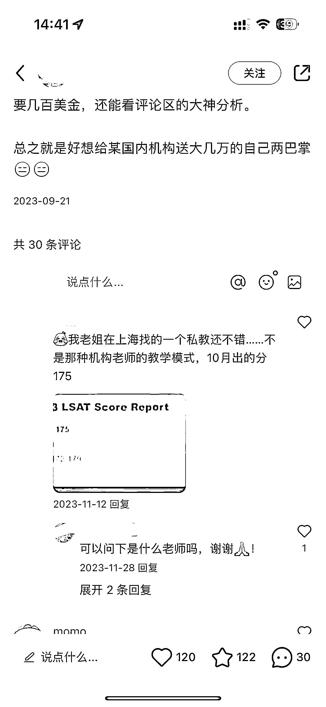
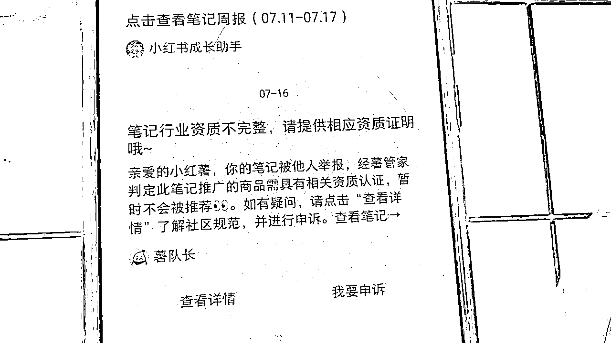

# 被机构包揽的留学赛道，一个人如何在这里面赚点小钱？

> 原文：[`www.yuque.com/for_lazy/zhoubao/og9ot2osm6k8522d`](https://www.yuque.com/for_lazy/zhoubao/og9ot2osm6k8522d)

## (11 赞)被机构包揽的留学赛道，一个人如何在这里面赚点小钱？

作者： 小铭同学奶爸 1.0

日期：2024-08-01

在小红书留学赛道，不卷头部，把它当成一个副业也不是不可。

现在留学赛道那是相当卷了，市场上已经出现了许许多多保分保录的机构了，很多家长都抵不住诱惑，不再选择自己再老老实实的进行学习，实打实的考试了。

所以，个体做留学，一定要做出差异化，比如说，尽量标榜自己的小班制，一对一私人教学等，只要后端老师教学水平有自己的特色和水准，那基本上不怕和大机构竞争的。

当然，这个时候也不要想着跟那些头部一样一夜暴富，在当下这种环境之下有个副业，每个月有个小几千，一年小几万就不错了。

那今天呢，以故事的视角来和大家分享我作为体制内的工具人，在房价只有 3500 的县城，副业能多出 5 万收入的经历。

这篇算是比较有意思的形式，希望大家能耐心看下去，接下来，正片开始。

# **第一步：确定目标和对标**

在一个平凡的午后，超级奶爸小铭坐在办公桌前，手边摊开的是他最近准备研究的文档——“普通人如何和留学机构错位竞争”。他眉头紧锁，虽然平日里已经小有所成，但总觉得还可以更进一步。

就在这时，纵横互联网多年的老易走进了办公室。他瞥见小铭手中的文档，微微一笑，坐在了小铭的对面。

“小铭，听说你最近在研究留学项目？”老易轻声问道。

小铭抬起头，眼中闪烁着期待的光芒：“是啊，老易。我发现留学语培这块市场很有潜力，但大机构竞争激烈，我这小体量，得想想怎么错位竞争。”

老易点了点头，指了指文档：“看了你的文档，思路很清晰。不过，实战中总会遇到各种问题。你想过怎么应对吗？”

小铭叹了口气：“确实有很多问题。比如，我是从零开始不知道怎么写笔记，也不懂设计封面，账号导流容易被封，私信也容易被举报。很多都不太懂。”

老易看了看我的文档，又看着我说：“你的文档整体已经很不错了，我给你提几个注意事项，你注意一下。”

小铭马上回应道：“太好了，老易你的经验在公司里面最丰富了，快快告诉我吧！”

老易微微一笑，胸有成竹的说：“首先作为小白，第一个思维就是要学会抄-超-钞！先要模仿同行去做一个要模仿的，简单的说是先找出真正值得模仿的对手！留学这个赛道有机构有素人也有和你一样的流量二道贩子。

光从粉丝量去判断是否值得模仿肯定会陷于虚假的繁荣，真正赚钱的可能都不是那些粉丝几万十几万的，也不是那些赞藏高的。”

小铭若有所思：“这也不行那也不是，那我怎么去找对标？”

老易不紧不慢的说：“留学有做聚光投放的，高赞藏可能是通过投放得来的，粉丝量高也很可能是买的马甲。你需要做的是多刷首页，看见可能的对标，先关注且记住他们的粉丝量，把主页放在文档里面。

后续观察他们的粉丝变化，和最近一两周的笔记互动情况，尤其是评论区多关注，是否有明显询单的。这样循环几个星期就可以筛选出真正有价值的对标了。实际上好多几百粉丝的账号，笔记互动询单真不少。”

# **第二步：模仿与创新**

小铭恍然大悟：“原来如此，怪不得我在数据平台上搜出来的账号看着粉丝多实际互动和笔记质量都不高呢。”

那老易啊，你和我说说笔记和封面吧！

老易：是的，数据平台在这类赛道上通过单一指标筛选出的账号可能不大准确。

你想学笔记和封面，这个都不用学啊，你只需要找到真正的对标就可以照抄了！你需要做的就是把不同的对标账号的封面进行元素重组，A 账号只要封面文字，B 账号只要封面背景，C 账号只要封面贴纸 logo。

最后把上面的元素重新组合就可以作为你自己的封面了。下一次把上面的顺序进行调换，又有个新的封面。

不过最后你发现大家的封面都差不多后就会审美疲劳，那这个时候你就需要拓宽自己的视野，不要局限于所做的留学语培了，去看看留学相关的泛行业同行：什么文书的啊，移民的啊，海外生活的啊，都可以用来借鉴。

# **第三步：关键词策略**

但是吼，我觉得你需要关注的是这些不同账号笔记下面铺设的不同关键词，这才是我想教你的第二个点。”

小铭不解的问：“关键词不就是行业关键词，笔记关键词就行了吗？”

老易立马说：“大错特错，关键词在小红书就相当于一个流量的二次分配节点，在标题在笔记在标题等地方配置关键词，就是预埋了流量接口。

关键词怎么筛选？

第一是看对标，哪些笔记数据近期表现好，那就把关键词列入关键词库。

第二是看下拉词条，小红书首页搜大的行业词看近期跳出来的行业长尾词是哪些。

第三是看聚光后台，聚光的后台有个关键词规划，你可以在那看见同行都买了什么关键词。

# **第四步：导流策略**

小铭着急的说：“老易，我没有钱投聚光啊！才起步玩不起聚光。”

老易哈哈哈一笑：“怕什么？聚光又不是要你一天烧一千，你就简单一点找服务商先充个两千开个后台，你不就可以进去使用了吗？而且后面你要说流量做大了你导流的时候有聚光加持你会轻松不少的。”

小铭尴尬的笑了笑：“嗯嗯，老易你有经验，你有什么导流的好办法吗？”

老易笑了笑，仿佛一切尽在掌握：“肯定有啦，我可以给你支支招。记得之前我提到的‘演戏’和‘偷师’吗？这两个技巧在小红书上特别有效。”

小铭眼前一亮：“对，对！你提起过。但我还不太明白具体怎么做。”

老易不紧不慢地解释起来：“演戏嘛，就是要学会在评论区留钩子。你可以找个素人号，去搜索留学相关的关键词，然后找到那些明显有需求的留言。

接下来，就像你在文档里写的那样，用不同的账号去演戏，引导对方私信你。这样一来，转化率就会大大提高。同样的，你还可以去找那些素人分享 offer 的笔记去留言‘演戏’，埋下一个钩子静等鱼儿上钩。”

小铭连连点头：“原来如此，这真是个好主意！那‘偷师’呢？”

老易继续道：“偷师就是要去观察那些做得好的卖资料的账号，看看他们是怎么导流的。

你可以后私信他们，或者直接观察他们的行为，学习他们的技巧。这样，你就能少走很多弯路。

比如说有些行业的会利用表情包，或者利用计算器也或者利用手写微信号拼接，也或者是利用收藏笔记转发，这些都可以一定程度上进行导流。但是红网恢恢，疏而不漏，你即使再如何变化导流话术依旧会被抓。”

# **第五步：投资与认证**

小铭若有所思：“哦，那我应该怎么办！老易你快教教我。”

老易笑着拍拍小铭的肩膀：“别急，还记得刚才我说的聚光吗？其实这里也有好处哦，只要你最近 30 天消耗 1000 软妹币，你就可以获得红的恩赐，导流微信会被放宽很多哦！”

小铭开心一笑：“这不就是变相收保护费吗？哈哈哈”

老易也笑了：“这还不止哦，我建议你不管是哪个账号，除非是你的助理号，小号，你要是有导流相关的行为的账号，就必须要进行 600 软妹币进行专业号认证。切记！”

小铭苦笑一声摇摇头：“没办法，在别人的地盘上，这份软妹币是交也得交，不交也得交...”

# **第六步：内容生产与管理**

老易笑着拍拍小铭的肩膀：“没错，该花的钱还是得花，但更重要的是，你要保持耐心和毅力。做这种项目，不是一朝一夕就能成功的。只有坚持下去，才能看到成果。而且你是个人，肯定上不了大规模的矩阵号，我建议你准备 3-5 个号就差不多了。”

小铭头摇得和拨浪鼓一样：“不行不行，我一个人做 5 个号，怎么可能做的过来啊！我平时还要上班的啊。”

老易看着小铭的怂样，哈哈大笑：“你别慌，你要是全做内容号，还要自己去生产内容，那铁定是搞不来的啦！

你这样做：

首先 5 个账号里可以留 2 个作为素人号，这些素人号的作用是作为‘演员’发挥在上面说过的‘演戏’，笔记基本上不用怎么发的。

其次剩下三个账号，你也不需要每个账号的内容都自己去做。你只需要参考筛选出的对标账号发布的内容，也就是你的对标内容库进行模仿改写就行了。

注意哦，对标账号也可能是抄的，那你可以平时多关注 5118 啊，知乎啊，寄托天下等留学论坛还有各大官网都可以作为内容库的信息来源，有了这些内容库储备，你把资讯分享/高分经验/聚光投流按照：6：3:1 的比例进行笔记发布，基本上不会出现内容库枯竭和不知道写什么的情况出现。”

# **第七步：差异化竞争**

小铭竖起大拇指：“不愧是老易经验丰富！佩服啊～”

老易摆了摆手：“不用拍我马屁了，要不是看你小子平时表现不错，我也不会和你说这么多。

这个项目能不能成功，其实不光靠你自己，现在外部环境已经非要恶化了，市场上已经出现了许许多多保分保录的机构了，很多家长都抵不住诱惑，不再选择自己再老老实实的进行学习，实打实的考试了。

我对于这个市场建议你，一定要找到自己的差异化...”

小铭叹了一口气说：“说啊，现在的市场上已经出现了劣币驱逐良币的情况，更难做了。”

老易手指轻敲桌面缓缓的说：“也不用太悲观，你作为小个体，首先需要放下期待，不用想着一夜暴富，你的目标其实就是把每天刷抖音看小姐姐的时间用来做小红书留学项目，每个月得个小几千，一年小几万就不错了。

在当下这种环境之下在工作之余有个这样的副业，很不错了！

最后呢，你还是要有自己的特色，比如：小个体往往区别于大机构流水线的批量化培训。你需要给自己立下一个私人定制培训的角色，尽量标榜自己的小班制，一对一私人教学等。小而精致，小而美。

只要后端老师教学水平有自己的特色和水准那基本上不怕和大机构竞争的。这就是差异化的力量。”

# **结语**

小铭恍然大悟一拍大腿：“老易，真有你的！厉害！我一定会坚持下去的！”

从此，小铭开始按照老易的建议操作，他的留学项目逐渐步入了正轨。他学会了如何在小红书上演戏、偷师，也学会了如何更好地制作差异化内容、吸引流量。虽然过程中遇到了不少困难和挑战，但小铭都一一克服了。

时间一天天过去，小铭的账号开始慢慢积累起粉丝和关注度。他的留学项目也逐渐打开了局面，成交量和收益都在稳步增长。

经过两年多的迭代耕耘，小铭的几个账号被关过小黑屋，也有小眼睛接近十来万，也有赞藏上千的笔记，在这背后小铭也收获了接近 160w 的 GMV，但是折算下来也不过成交了 6/7 十人，到手佣金也不过是小小的十来万，折算一年也不过是 5 万收入。

不过小铭已经很满足了，毕竟作为体制内的工具人，在房价只有 3500 的县城，多出来的 5 万副业收入相当于当地的一个普通上班族一年的收入了。

这一切，小铭心中充满了感激和欣慰。他知道，这一切都离不开老易的帮助和指导。

而这一切，都源于小铭与老易的那次对话，当时的小铭也只不过以为那是生命中普通的一天。

* * *

评论区：

暂无评论

* * *