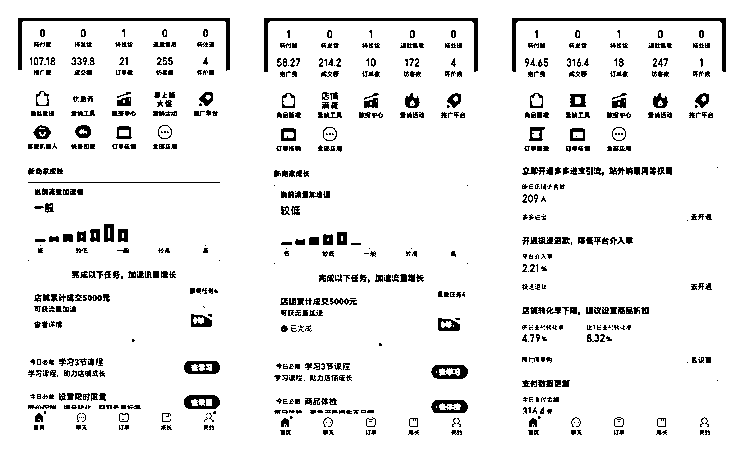
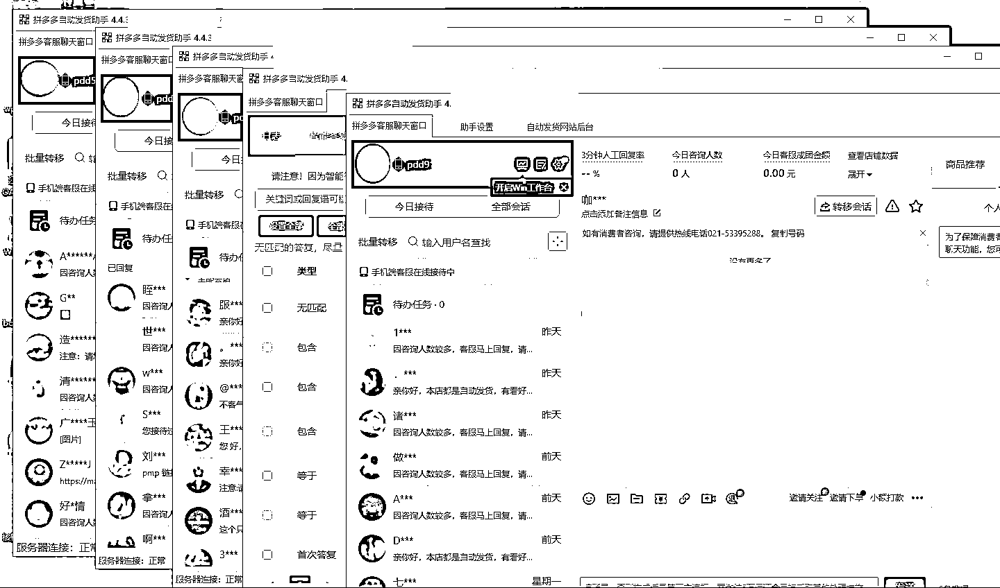

# 拼多多虚拟电商，单人操作 10 家店，单店日盈利 100+

> 原文：[`www.yuque.com/for_lazy/zhoubao/gqlxt3g4bovuuvz8`](https://www.yuque.com/for_lazy/zhoubao/gqlxt3g4bovuuvz8)

## (41 赞)拼多多虚拟电商，单人操作 10 家店，单店日盈利 100+

作者： 新侠

日期：2024-07-29

大家好，我是新侠。

今年初定下了 All in 虚拟的策略，并且先从虚拟的细分赛道：拼多多卖虚拟资料进行切入。

5 个月时间开了 12 个店铺，除了前期摸索期间 2 个店铺因二级限制退店，目前其他所有店铺都实现了日利润 100+

老规矩，先来两张收益高一点的。

当然，冷水还是要泼一下。

做的好的店铺可能有一定的偶然性，**不能代表大部分店铺的真实水准**。

大部分店铺都是单店日利润 100+左右。

另外就是，拼多多虚拟起店速度还是比较快的。

新店第三天出单，每日营业额稳步上升

下面是其中一台云电脑，挂了 5 个店铺自动发货

去年我在副业发了一篇关于付费社群实操和思考的文章，收获了一些朋友的喜爱且有幸被加精华。

[`articles.zsxq.com/id_njuxhjafxmt1.html`](https://articles.zsxq.com/id_njuxhjafxmt1.html)

算一算也有一年时间没有发文章，一直都没有时间好好梳理一下。

正好也借这个机会和大家分享一下拼多多虚拟店铺的实操玩法。

PS1：此处收益图展示均为稳定后的日常水准（剔除了收益巨大的异常值），拼多多虚拟店铺单店的天花板还是比较明确的，请各位降低期待。

PS2：以下正文无其他收益图展示，请放下焦虑，放心食用。

PS3：本文非纯粹的实操教程，一些操作细节方面难免无法面面俱到，但可以承诺的是按照本文方法直接去实操是一定可行的。

PS4：本文花费了一小半篇幅讲底层逻辑，授人以鱼不如授人以渔。

PS5：电商玩法具有一定的时效性，请各位结合实际情况操作。

以下正文，enjoy。

[`jinhuaclub.feishu.cn/docx/I2kQdP69XowMKexSxkucdf0VnXd?from=from_copylink`](https://jinhuaclub.feishu.cn/docx/I2kQdP69XowMKexSxkucdf0VnXd?from=from_copylink)

* * *

评论区：

立夏 : 感谢分享[强][强]
大米 : 大佬怎么联系

* * *