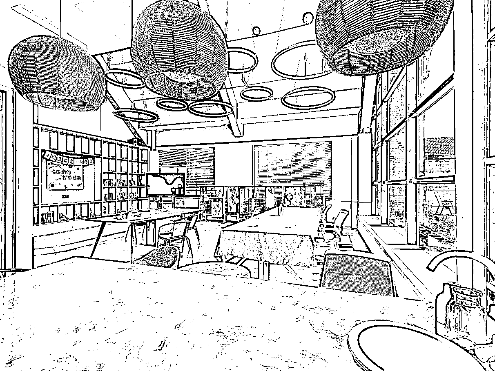

# 做教育机构 10 年，只靠转介绍我是怎么活下来的？

> 原文：[`www.yuque.com/for_lazy/zhoubao/czlr1go6unssfsp2`](https://www.yuque.com/for_lazy/zhoubao/czlr1go6unssfsp2)

## (精华帖)(56 赞)做教育机构 10 年，只靠转介绍我是怎么活下来的？

作者： 小匠船长

日期：2024-08-01

教育一直是刚需。不管是大城市，还是三四线城市，选好赛道都是有不错市场前景的。

我这个项目能做 10 年，一路走来踩了大大小小的各种坑，但也拿到还不错的结果，就可以说明一直有前景在，而且我们靠的只是转介绍客户。

如果大家想进入这个行业，靠公域引流+私域转介绍相结合，不断提升机构课程专业性，教学效果可视化，控制运营成本，以口碑作为做大的护城河，一定可以打拼出自己的一亩三分地的。

今天也借此机会分享分享我的经验，希望本文能给到你些许参考价值。第一次写文章，文笔不好还请见谅。

大家好，我是小匠船长，副业第七期圈友，大家可以叫我小匠。

目前有一家少儿口才培训公司和一家内河航运公司。感谢副业提供这样的机会，给大家分享少儿口才项目的情况，

# **一、项目概况**

我们在浙江一个四线城市，常住人口大约在 100 万左右。从 2015 年开始做线下少儿口才培训项目，发展到目前在当地有 2 个校区，场地面积加起来大概 1800 方左右，在读学员 900 余名学生。学员年龄段为 4-12 岁。

在 2021 年双减文件颁布之后，当年九月起，我们将课时包调整为 2980 元/15 节课。不再收年费课包，目前年营收 500 多万。

校区环境，这个校区是电视台授权的品牌

这个校区是我们原创自主品牌

# **二、团队配置**

我们是夫妻档创业，我这边主要负责校区日常运营管理，外部联系及活动赛事安排。我爱人主要负责教学、教研及团队管理。除了我们夫妻二人以外，配备行政 3 人，教务 4 人，教师 13 人。

# **三、项目跑通的三个阶段**

**（一）起步阶段：**

2015-2017 年是我们这个项目的起步阶段，当时我们还是国企在职员工，因为业余时间较多，想着做点副业，经过前期简单的市场调研，结合自身专业，确定了做这个项目。

我们利用下班后的时间和周末休息的时间，当时几乎走遍了全市，看了商场店、沿街商铺、写字楼等各类物业，最终发现了一个民办幼儿园门卫室边上的一个仓库，面积几十平。

当时跟幼儿园里磨价格，最终以 2000 块钱一个季度的房租租下了这个场地。租下以后，添置了一台空调，一台投影仪，部分椅子，请亲戚刷白墙，自己铺地胶，以 1 万不到的成本开始了我们的创业之旅。

上课的内容来源于网上搜索的各种教学资料，结合自身专业，现编课件。

第一期学员从公司内部同事里挖掘，推出免费学习 3 个月，并通过朋友圈推广，招到了 13 个学生，3 个月后正式付费学员 8 人，也是能正式开班了。

**（二）积累阶段：**

到了 17 年，因为也有了两年多的经验，市场明显感觉进入到了一个快速发展阶段，那时候通过简单的公众号推广，都能带来不少的咨询量。

我们找了一个 300 多方的场地，重新装修，开始进入到发展阶段，到 2020 年我们有 300+学员。

这个阶段，我们主要的动作是，加盟了地级市的电视台，有了官方的背景，跟其他机构区别开了，同时我们孩子有了官方的锻炼和展示舞台；

换校区，新场地给了家长更多的好感和信心，不再是一个小作坊了；组团队，开始招聘了教师和行政，分工开始细化；有了完整的教学体系，课程内容可以复制了。

**（三）发展阶段：**

2020 年搬校区开始，进入到了比较快速的发展阶段，我们从底商搬到了一个繁华的商业街区；

2021 年新开校区，邀请北京设计师团队从商标至校区装修全套设计；

2021 年双减，机构收费模式从年费调整到按期收费。扛过疫情和双减后，我们机构目前是地方上最大的少儿口才培训机构。

# **四、项目能做起来的原因**

我们在起步阶段，其实跟副业现在提倡的最小 MVP 模型是非常相似的。

决策的核心思想是：项目投入资金是我们能够承受的，项目本身是有前景的，项目不会影响我的本职工作，哪怕项目失败了对我们没有任何影响。

基于这样思路，小步前进，快速试错，在前几年里慢慢站稳了脚跟。

我们的发展速度其实不快，但这么多年也在稳步前进。而之前做的非常大的机构，现在很多烟消云散了。也简单跟大家分享下我们各环节决策背后的逻辑。

**（一）选址很重要**

当时选择这个仓库，600 多元/月的房租是决定性因素，能够让我放平心态开启这个项目，如果前期房租压力过大，人是会非常焦虑的。

除了价格以外，它位于市中心，附近有几个成熟小区，对面是一所小学，又在民办幼儿园内部，自带流量，综合这些因素，让我选择了这个地方起步。

大家如果想做线下机构，选址是非常核心的一部分，一定要选择居住氛围浓厚的区域，附近又有成熟的学校，且能控制住房租成本。

我后面几次搬迁，也基本遵循这样的选址策略去找的场地。如果你的地方，能方便到爷爷奶奶也能步行接送，对于招生和续费是有着非常大的帮助的。

其实在前几年逛商场的时候，大家能发现在商场里有很多的教培机构，但现在明显比之前少了。

商场店虽然流量大，但弊端也非常明显，租金贵，导致空间利用会发挥到极致，会导致公共区域过小，教室没有窗户。如果学员数量起来了，就会导致上下课非常不方便，以及家长的体验感受会很差，这在前期其实是不容易注意到的。

最重要的一个点：一定要问清楚地方主管部门对于场地消防方面的要求，长远考虑，必须过二消！！！一切按政策规定的来，会让你后期省掉非常多的麻烦。

**（二）产品是核心竞争力**

我们在度过了前期探索阶段后，始终把课程质量放在第一位，不断通过各种途径提升课程质量和专业性，各环节打造护城河。

**1、课程体系的壁垒。**

我们会加盟市场上我们认为比较好的课程体系，把各家的长处吸收进我们的课程体系中，并且在教学实践中不断打磨，内化为适合我们的课程内容，不断完善出一套科学的、满足我们当地家长需求的课程体系。

一定要清楚，家长需要的是什么，而不是你自认为什么是好的。而加盟普遍是有区域保护，这样一来，间接抬高了同行的门槛。

**2、师资优势明显。**

最核心的一点是创始人就是科班出身，并且在专业和教学领域有极强的信息获取、学习和迭代能力。而团队所有老师都是科班毕业，都是全职教师，无兼职。教师薪酬高出市场 30%以上，且缴纳五险一金，周一周二有双休。

**3、教学各环节有把控。**

每一堂课，我们都会经过三个环节的教研打磨。每一周，我们都先进行教师集体教研，教研完后，老师需要 2-3 人组队练课，并且互相评分，然后老师还需要单独练课。

这些环节都是需要填写反馈表，并且飞书发送给教学校长。以此来保证课程的质量。

这些都是常规的教研备课流程，但我们跟很多同行交流发现，能做到每课教研的，竟然都不多。

在课中，我们教学校长会随机进入到课堂，旁听老师的上课过程，对课程进行监督，并及时把老师课堂教学的评课意见反馈给老师。

每个主题课后，我们都会给孩子录制视频，并上传小程序，家长通过视频对比，能看到孩子的进步情况，对比视频，是最直观的。

**4、我们跟电视台建立长期合作关系**

每年都能承办官方的各类权威赛事。这在机构发展前期是一个非常大的壁垒优势。

而因为教学质量的保证，使得孩子们普遍有比较大的进步，在各类权威赛事中拿奖的概率就高。地方上各项比赛，一半以上的获奖选手都是我们的孩子，每次比赛后都能带来一大波的转介绍。

这是我们生源的重要保障。

**（三）重视口碑**

这其实是一个很朴素的道理，大家都明白，但我为什么会把它单独列出来，并且把它列为项目成功的重要原因，甚至是能够成功的最重要的原因？

教育行业跟其他行业不太一样，我也是一位七岁小男孩的父亲，深感小朋友童年的重要性，在兴趣班的选择上，家长花费的钱还是其次，但为之付出的时间和精力呢？

如果不好好教，怎么对得起家长的信任。

我们机构的教育理念是让孩子落落大方，出口成章。我们不断提高自我要求，保证课程质量，并且提供给孩子更多的锻炼和展示机会，所有的动作，都是围绕着提升孩子水平进行的。

这么多年下来，有不少孩子都是从幼儿园小中班开始学到五六年级毕业，目前也已经有三届毕业生了。长期学的孩子，不仅本身给机构保证了稳定的生源，而且带来了非常可观的转介绍客户。

这次的分享我没有跟大家分享流量的获取、销售转化。不是藏私，而是因为，我们的公域流量获取能力非常差，并且没有专业的销售团队。

我们绝大部分的获客都是以转介绍为主。这也是我们接下来需要重点提升的地方。

# **五、项目前景**

如果无论是少儿口才、还是少儿书画、少儿舞蹈、或者少儿编程等科目，都还是有不错的市场前景的。

虽然大环境是人口出生率下降，但在三四线城市，开一家几百人的机构，出生率的影响并没有那么大，教育一直是刚需。

公域引流+私域转介绍相结合，不断提升机构课程专业性，教学效果可视化，控制运营成本，以口碑作为做大的护城河，一定可以打拼出自己的一亩三分地的。

# **六、结尾**

最后，想以爱人本周在周报中分享给同事的感悟作为结尾，这也是我们俩一直努力的方向和坚持的价值观，也欢迎副业朋友们多交流、批评指正和建议。

创业这件事情如同刀尖跳舞，时刻面临各种挑战和危机，未思胜，先思败。无论如何生意可以不做，信誉不能丢失，一定一定要踏踏实实的去做事情。

要创立一个企业，你需要创造人们喜欢的东西。要坚持做下去，你需要创造自己喜欢的东西。我并非总是喜欢工作，实际上，工作中很多琐碎的事情都让我感到烦躁和无聊。

但是这些都是我通往自己想要通往的旅途中所必须经历的路程。梦想当然美好，但是通往梦想的旅途中必然是布满荆棘的。

我渴望创立一家企业，真正的为孩子的成长着想，让孩子在我们的课堂上，感受到快乐，被看见，被尊重，被欣赏。在陪伴孩子成长的过程中获得社会的价值和认可。

我也渴望自己一直不断进步和成长，一直不停地学习——是我的兴趣爱好。学到了有用的东西，分享给我的小伙伴，我的家长以及我的孩子。在企业经营中

学有所用，一直能够做到实践和理论相结合，这真的是一件非常快乐的事情。

在长期主义者的眼中，生活简单纯粹，没有雄心壮志的目标，也没有哼哧哼哧的咬牙坚持，有的只是日益精进的每一件小事，如同节奏稳建的匀速慢跑。

* * *

评论区：

小余同学 : 善战者无智名无勇功，日益精进，匀速慢跑[强][强][强]
精灵 : 我也是教培，前后第 8 年。也是老带新转介绍多
小匠船长 : [强][强][强]
云珞 YunL : 太赞了，课程做的好，成本控制在自己承受范围内，考虑到爷爷奶奶接孩子的问题，孩子还多次上省电视台演出或参加赛，培养孩子落落大方
蒙蒙加 : 教培行业出身的我，看到这个分享，很感动。[爱心]
你们是在认真做教育，这是初心，并且一直在坚守，所以活得越来越好。[强]
东哥 : 在长期主义者的眼中，生活简单纯粹，没有雄心壮志的目标，有的只是日益精进的每一件小事，如同节奏稳建的匀速慢跑。[强][强]
小匠船长 : 有时候家长真的忙，接送孩子对于家长来说就是一个负担，这个年龄段的爷爷奶奶都还年轻，平时孩子的教育和接送都可以爷爷奶奶负责，那家长报班的负担就小很多了
小匠船长 : 大环境还是有影响的。但认真做事，家长是能看得到的

* * *