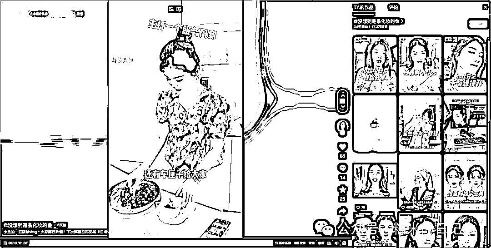
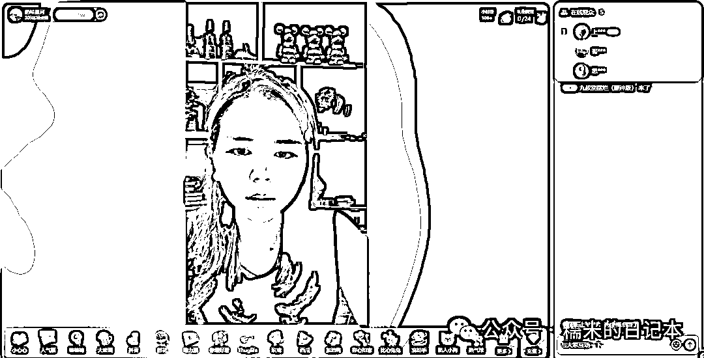
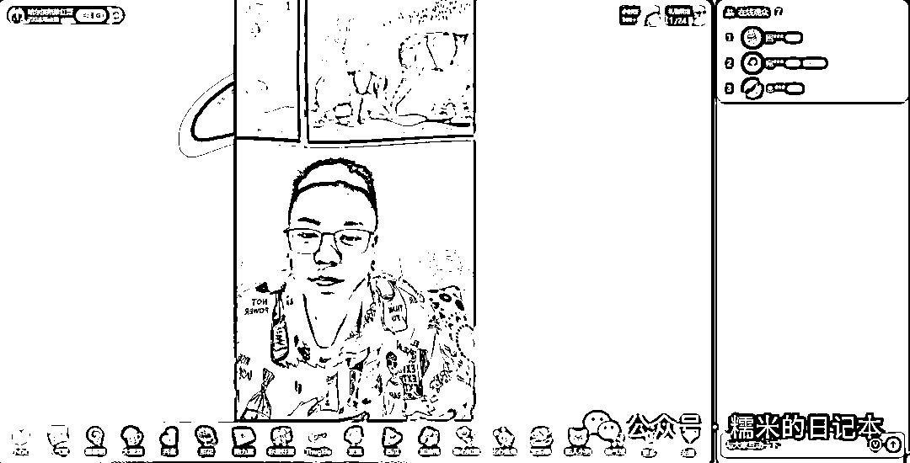
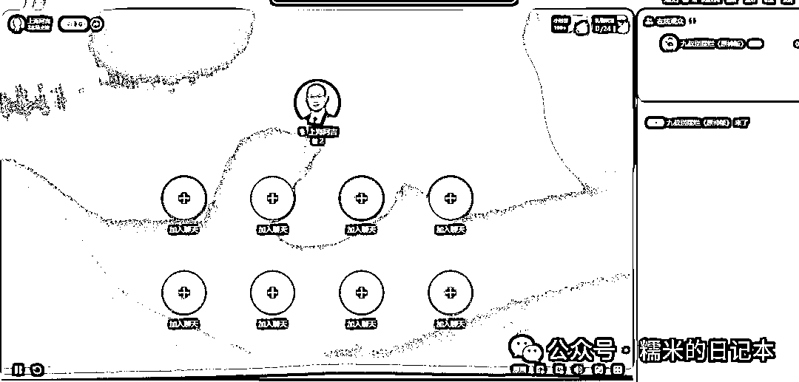
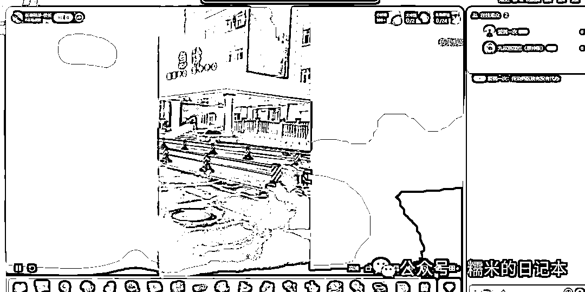
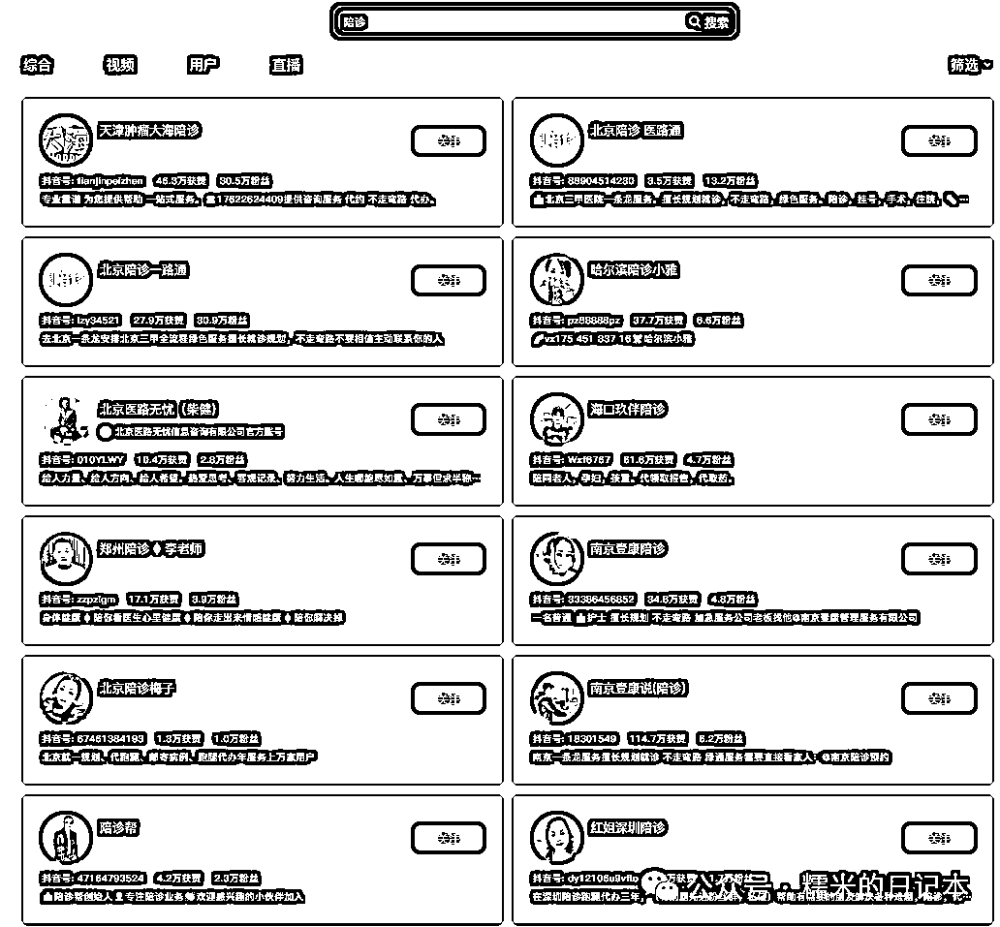
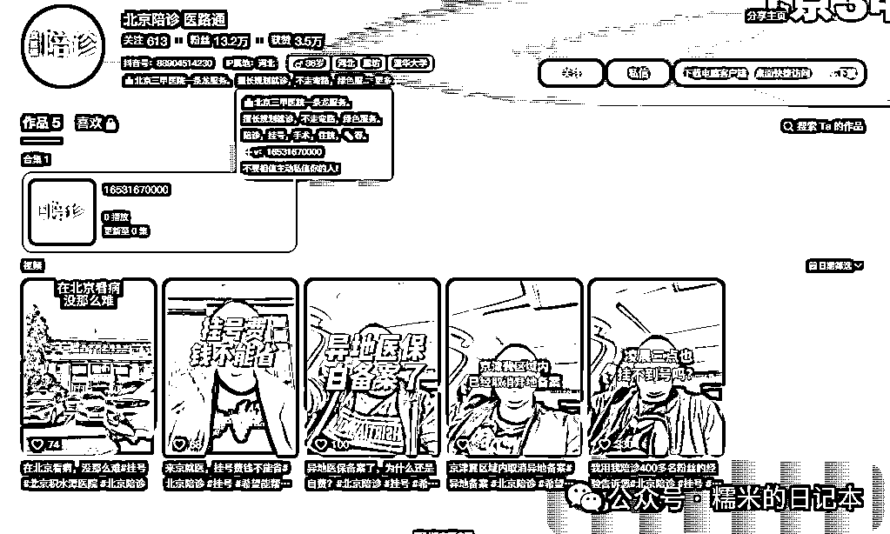
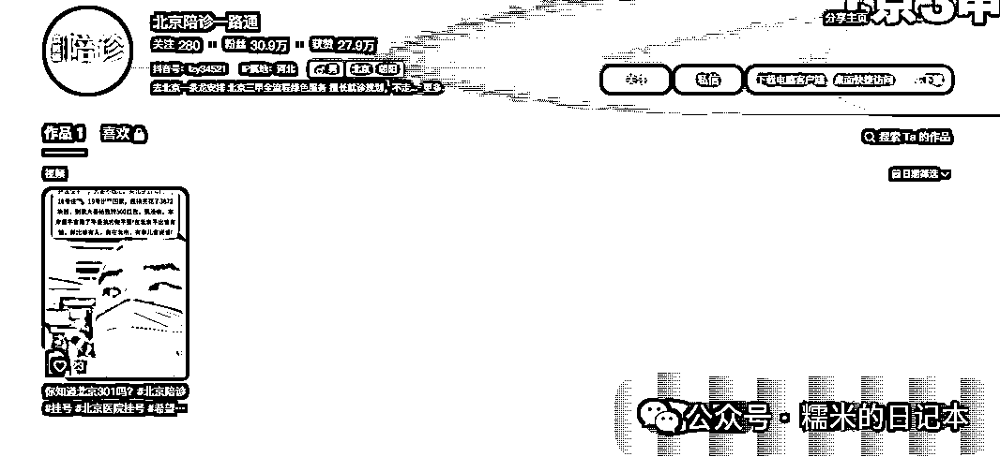
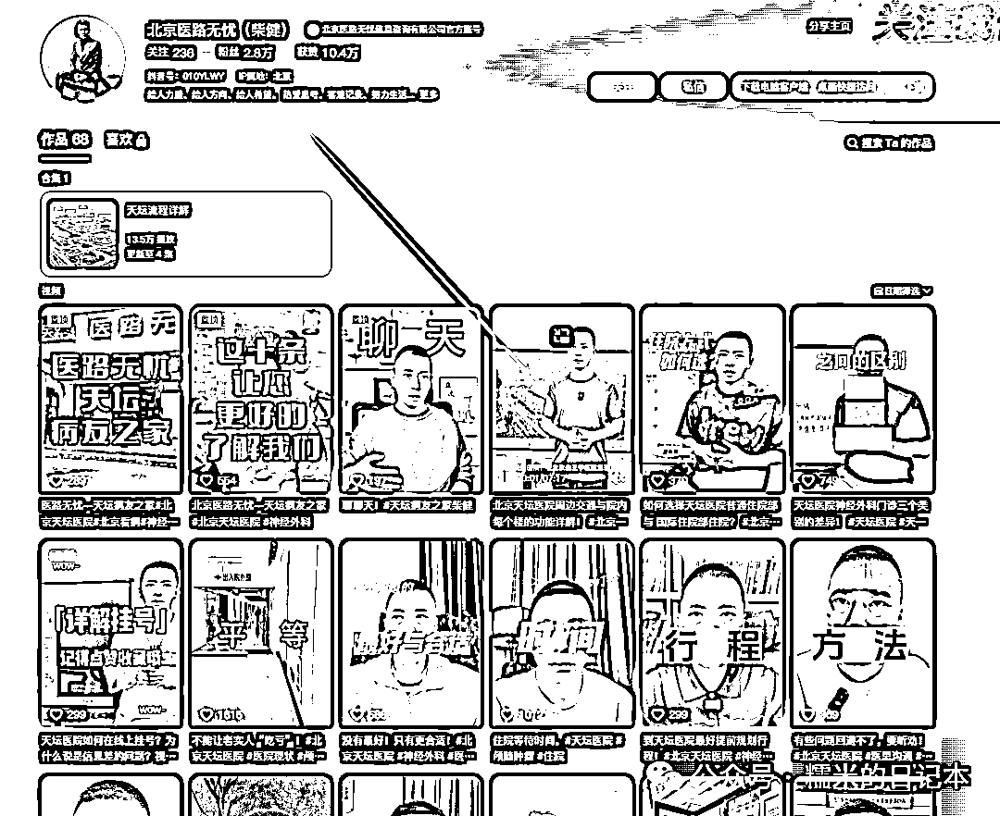

# 全自媒体平台，陪诊账号调研（4）

> 原文：[`www.yuque.com/for_lazy/zhoubao/ii6mgv307rb37lpo`](https://www.yuque.com/for_lazy/zhoubao/ii6mgv307rb37lpo)

## (10 赞)全自媒体平台，陪诊账号调研（4）

作者： 糯米

日期：2024-07-29

**糯米认为，作为陪诊行业的操盘手，一定要掌握最新的行业动向，其中就包含了陪诊自媒体获客，即**

陪诊行业，近期大家都是在怎么通过各种自媒体平台获客，获客做得怎么样，都在怎么玩耍？

昨天，糯米终于把微信生态里的陪诊获客内容账号全部收尾掉了，今天我们来扒一扒**抖音**

还是老规矩，我先讲我调研出来的结论

在抖音这个平台，陪诊已经在当下的环境下形成了一套自己的玩法，垂直视频流派是已经没有了，主流的有垂直直播流（主要玩直播，视频随意甚至不发，垂直视频几乎没有，to c 只能是顺手捡单子，或者说做大了看机会，一定是 to b 为主，卖课程卖加盟），有陪诊老板 IP 流（商业口播），有移花积木流（完全不讲陪诊，又处处暗示陪诊），商业拆解 IP 偶尔来一集流。光看粉丝量还是感觉大有可为的，为什么呢？起码证明了其可持续性，在现在的自媒体陪诊获客领域，前端能持续性积累就是一件很好很好的事儿了

ok，我们现在来细说一下

首先主页检索出来是这样的

基本上都是商业顾问 IP 分享陪诊赛道的视频，类似于粉丝答疑，采访等等这种，再细看你会发现，基本上都是 2023 年的内容了

**值得关注的是，这顶头的词条，有很多的城市，大家看下图**

糯米分析，可能陪诊内容在这些地域是偏多的，以至于可以单独成为一个分类标准

因为确实嘛，我是比较了解这些信息的，我印象中，上海，北京，南京，郑州，都还是多的，昆明也有

那我也去验证了一下

当我输入“烤鸭”的时候，分类词条并没有地区，而是出现了别的关键词分类，**说明并不是抖音以地域为固定划分，来设计的筛选条件**

OK，我们继续

简单的看了一下各个地区的，都差不多，垂直医院陪诊视频流派已经废了，大家都停留在去年

在过程中，我发掘了几个特别一点的账号，也就是我前面讲的移花接木流派，完全不讲陪诊，又处处在暗示陪诊

比如这个账号，就还挺有意思的，呈现出来的内容，其实也是护工≈陪诊，但作者能善加利用人性话题、选题，来制造论点提高评论量，是玩得挺不错的

这边也有新号注册后硬怼的，下面这个账号就是 6 月 12 日一下子硬怼几十条图文的账号

然后下面这种就是我说的，其他类 IP 偶尔来一集陪诊的，夹带私货玩法，不过这个 IP 是有自己的营生，陪诊确实是顺带的

然后就是我们的直播流了

就目前看来，大部分是素人直播，流量很差，播的很辛苦

这个直播间是我今天晚上实时看到的稍微好一点的，起码人家的人货场是强于大部分素人直播间的（也太素了）

这边就简单列举几个稍微能看的直播间（当然，主要还是看粉丝量，如果是粉丝量上千了，视频几乎没有，说明人家辛辛苦苦直播还是积累出来了一点东西的，因为我之前长期坚持直播优化直播过，也看过一些不思进取的人直播，按照那种始终不加以优化设计的直播间玩法，纯靠坚持，可能半年能有个一两千粉丝）

继续列举

继续列举

这个哥们可歌可泣，过两天他要是还在，说明小直播间，抖音不管直播医院门口的，nice

说了这么多朴素直播间，当然，也有好的

这个账号属于是 IP 短视频加持过后的，不过他的视频设计，比如每集视频的陪诊内容嵌入比重，以及搭配其他内容的发布节奏，还是很值得深入研究的

OK，直播环节我们就讲到这里，接下来看一下账号环境

还是直接词条（搜“陪诊”）看看得了，隐藏词条暂时顾不上

直接带有陪诊词条作为账号名称的，其实账号也不多，能穷尽，但大家看得到的前排大粉丝量账号，大多是买来的账号（我推测的），视频没几条（可能隐藏了），粉丝量异常大，也没看他怎么直播（也有可能我是一过性研究，没仔细挖掘人家的直播记录，但我想啊，如果这么大个账号，做直播效果好的话，那就直接雇人直播舍不得下播了都要，还会放着么）

看过他们的主页，也都是最新的视频停留在了 2023 年，这个账号的是 2023 年 6 月

这个账号的最新视频是 2023 年 9 月

另一个本家账号，虽然是 3 周前，但只有一条视频，没啥参考意义

这个 IP 我是老早关注了的，人家据说是做公益陪诊，但我知道肯定不可能，只是赚钱的点不让大家看到而已

最新视频是 2 天前更新的，IP 流派，而且明面上看确实是做好事，但是一旦这个 IP 大了，那稍微有点动作都会很值钱

所以当时我第一次看到这个 IP 说做公益，我就冥冥中感觉，这个人格局应该挺大，算盘打得比较长远

糯米也沿着粉丝量，继续往下查阅了一些账号

这个账号也是，陪诊内容没有更新了，但是身份还是放在那里的，也曾尝试过暗示版本的内容创作，比如这条

这个 2018 年转眼就是 2023 年的视频，糯米看完只能说一句：真的牛，变着花样夹带私货！

一样的，这些能跑出来一点流量的账号都是不讲陪诊，但是处处暗示陪诊

我个人推测这种可能是买的号，跟下面的企业号联动了（挖掘出来一些隐藏款，我还挺开心的）

这里就有一个非常有意思的信息了，这个老哥我蛮佩服的，一直在关注，他图中箭头视频说了一个非常好的点**，陪诊保险促进考证**，能理解背后的钱在哪的自然理解，我不多说了

OK，那至此，本次抖音平台的分析/拆解/调研就算结束了，明天我们继续下一个平台继续调研

* * *

评论区：

暂无评论

* * *