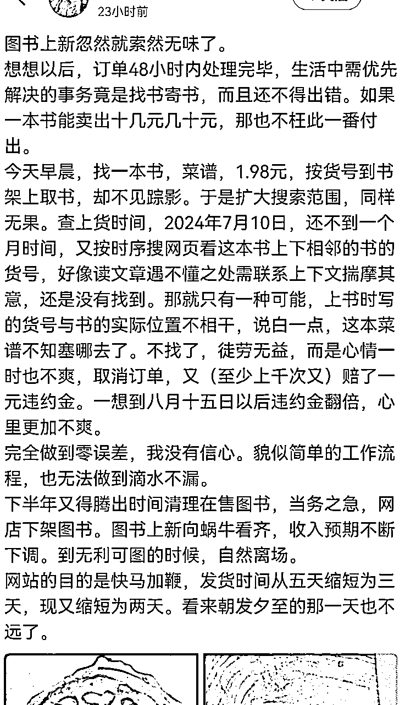

# 生财分享：作为新手，我是如何从1到10，做到月GMV8万的？

> 来源：[https://jk5inqdkoq.feishu.cn/docx/A8JldwGtnoJmFSxiQWCcYU8TnPd](https://jk5inqdkoq.feishu.cn/docx/A8JldwGtnoJmFSxiQWCcYU8TnPd)

大家好，我是阎星烁，去年9月份加入生财，并在去年11月份开始实操闲鱼二手书项目，并把精力聚焦在这一个项目上，跑通0到1大概用了一周的时间，但是从1到10进行放大，这一个过程折磨了我半年的时间，最近有一些时间，所以把经验总结出来，一方面供自己梳理反思，另一方面也希望能给相同阶段的朋友有一点点的启发和借鉴。

开篇之前，感谢生财团队对项目的筛选和手册的编写，感谢@老瞿Qu在过程中的对我提出的具体业务问题的指导。

先上7月份的成果，我有三个后台账号，目前在运营的账号有15个，七月份的GMV大概是80000，毛利大概是26%，除去人工、售后补偿等成本的净利润大概是19%。团队目前5人，除了我之外，有一位全职助理，两位发货，1位运营。目前还在继续放大，开学季预计会有一段强劲的增长。下面我就本项目从1到10放大的过程，从一个新手的角度总结一下心态和方法的演化历程。

# 一、从0到1考验的是学习能力，从1到10考验的是对风险和未知的承受能力，真正赚钱的只有从1到10到100

从0到1跑通业务闭环的能力的确很稀缺，需要的是对业务模型的拆解、学习理解、复刻，没有清晰的思路和学习能力，跑通业务闭环就是一个比较困难的事情，不光难，而且还不赚钱。

就拿闲鱼这个项目来说，跑通业务闭环，就需要学习从证照、选品、运营、货源、客服、发货、售后、成本等一系列流程，跑通以后，一个人弄着四五个闲鱼号，一天卖一两百块钱食之无味弃之可惜。那么，怎么去解决这个困境呢？就是去放大。

放大一个项目有不同的方式，我仅从我使用的方法来展开，那就是通过团队分工去提高效率、扩大规模。举个例子，一个人干项目的全流程，精力的上限可能也就五六个店铺，但是两个人通过合理的分工形成流水，通常可以产生1+1＞2的效果。

对于一个新手来说，理解这一点并不是问题，难的是迈出实际行动，用自己的真金白银去承担员工的工资，承担不稳定的利润带来的风险，也有解决方案：

1、谨慎招全职；

2、可以按量计的工作，以量为标准开工资；

3、尽量有尽可能多的现金储备（现金流出现问题的时候，心态会变化，实操的动作也会变形）。

有了解决方案，依然会有人无法行动，剩下的原因仅仅是出于对风险的厌恶。利润=营收*利润率，利润率再高，没有规模一样是小打小闹，要么就下场去试，要么就永远在0到1的阶段挣那几百块钱。

# 二、关于兴趣与动力

前两天偶然看到一个同行发的动态（见下图），感觉非常具有代表性，总结下来就是在繁琐的工作中迷失了。前一段时间我也有过类似的感受，是否以后的每一天都是无休止的运营，是否以后每一天都要面对这么多的客服和售后，对当前的工作提不起任何兴趣怎么办......

这种情况有几个陷阱：

1、首先是人们通常会认为，只有对一件事有兴趣，才能做好这件事，实际情况是相反的，只有做好了一件事，带给他人帮助并获得认可，才更可能产生兴趣；

2、其次是没有任何一项工作能满足所谓的兴趣，创造性的有趣的部分可能平均只有10%（甚至可能达不到），其余的部分大多是重复性、标准性的事务。拿闲鱼项目举例，有趣的部分可能就是分析同行和选品，每天所需的时间可能也就半个小时到一小时，其余的七八个小时都在重复的上书、发货、回客服、处理售后。

即使是每个领域的牛人，也不能保证自己干的事情就是自己感兴趣的，C罗也坦言不愿意每天都去健身房，黄仁勋也不是每天都喜欢自己的工作，但是拉开人与人之间差距的，可能就是在重复的过程中，一个人到底是精进了，还是荒废了。

# 三、关于SOP的优化，与时俱进

在做这个项目以来，我对业务SOP的优化次数估计有20多次了，遇到下面几种情况的时候，我会觉得SOP有问题需要优化了：

1、SOP上的事项根本干不完，完全是给机器人列的工作计划（每个人的精力和专注时间是有限的，不展开写了，可以找下往期的时间管理航海，内容非常受用）；

2、实操过程中发现有的动作好像可有可无，果断删掉（西昊的创始人的一个访谈里提到过，一件事情的关键成功要素可能也就3-5件；统计学的回归分析中，相关性非常强的因素通常也就3-5个；二八原则也是同理；所以如果自己每天的运营动作又多又杂，那么多半是有问题的，要找到最重要的几个动作）；

3、同一个问题多次出现，需要优化SOP（比如发货发错很多次，需要增加一个发货前的确认环节，又比如商品描述多次出现问题，应当每天增加一个抽查环节，当这些动作又变得可有可无的时候，再删掉即可）

4、在重复中找到了更高效、成本更低的方法，就将新方法纳入到SOP中替换原方法。

# 四、重在积累，把自己和同行当成人

有一种非常普遍的场景：“我今天没有完成待办任务”、“我今天没有完成运营动作”、“我今天收到一个差评/投诉”、“我今天流量不好了是不是被限流了”，等等......然后“反正都中断了，那干脆就放弃吧。”

我前几个月也有这种焦虑，为某一天的偷懒和懈怠自责不已，如果你也有类似的情况，你不妨思考几个问题：

1、你的同行是否也是人？你有中断的话，他难道能保证365天全年无休、家里人不会生病、不会出去旅游、不会朋友聚会、心态不会有一点懈怠，然后每天像机器人一样花几个小时上那几本B书吗？？

2、一个月中，你连续冲刺七天，然后自己排斥、懈怠、自责、放弃；或者你干一天歇一天。后者不仅坚持下来了，而且投入的时间也翻倍了。如果拉长到1年、3年以及更长时间，产生的差距无法忽视。

3、雷军在年度演讲的时候讲到了造车期间的一件事情，在公司的多事之秋，他和团队放下手头的事情，开了一场长达21天的马拉松式会议。你想一想你的事情能多的过雷军和小米吗，你的事情有多么重要以至于一刻也不能间断吗？

我在刚开始的阶段，也非常厌恶中断和打扰，但是本质是得失心很重，对后果不确定的焦虑。有一次我的心力被完完全全的磨没了，对项目的一切东西都十分抵触，大概一周没有运营、没有回客服，售后到时间自动同意，恢复好心态后重新捡起，其实发现也没什么大不了的，最多也就是少挣点钱。中断调整是人之常情，只要始终抱着认真的态度去工作和休息，长期来看，平均的结果就不会差。

# 五、避免完美主义

从1到10，往往伴随着他人的加入，如果你是一个精益求精且非常擅长从0到1跑通业务模型的人，那么你非常需要注意的是，要学会培训、授权和抽查，并容忍不完美但合格的成果。

起初在我每次将熟悉的工作交到他人手中时，总会不自觉地看不上别人干的活，一直在吹毛求疵，但是转念一想，我自己能大包大揽到什么程度，一个人做的再多能比上十个人吗？一种业务的放大的过程，不可避免地会伴随着低效和不完美现象的出现，利润率的降低以及利润总额的增加。

# 六、牺牲一部分利益和效率避免心力过多的消耗是值得的

在1到10放大的过程中，因为业务量的增大，早晚都会遇到这个细分领域的小概率事件，比如违规、极端客诉、团队问题等事件。这些困难一般都在SOP之外，处理这些事情本身并不困难，大不了就是放弃一些东西，但是这些事件通常会给人带来心态和情绪上的压力。这种情况下，学会放弃，迁就自己的情绪，是性价比更高的选择。

比如，号被封了，你拒绝接受现实，再抱怨几天，最终还是于事无补，不如直接注销重开，无非是多花一些时间和资金；再比如，遇到了赔本的订单，和客户无意义的纠缠消耗，有时就不如破财消灾；再比如，花时间和团队的成员一起吃饭娱乐，看上去是牺牲了当天的效率，但长期来看，对团队成员情绪的照顾，带来的可能是工作更加的投入和沟通更加顺畅。

放大的过程中，人本身是不能忽视的因素，情绪和心态也决定了解决问题的意愿，每个人都非常容易对短期经营情况进行管理，但长期的产能才决定了这个模式能持续多长时间。

# 七、把时间当作朋友

最近看了李笑来的《把时间当作朋友》，前半部分对我的启发很大，这本书可以说是给当前浮躁风气的一剂良药，读完了这本书，我才认识到自己以前对事物的期望有多么不合理，对各个行业缺乏敬畏之心。也从之前只是口中说说的“空杯心态”，有了深一层的理解和践行，也感叹“时间是最大的壁垒”这一鞭辟入里的观点。

简单分享几个书中的观点：

1、认清现实，你到底有什么，你的期望到底是不是合理的，速成绝不可能，要用自己有的（时间、精力、头脑、金钱）去换自己没有的，且现状无法马上摆脱。

2、估算时间，现在就行动，遇到困难不要回避，是最简朴的道理。

3、记录时间的花费（金钱的开销也同样重要），根据实践做出合理的计划，在执行过程中用笔纸做好待办清单，并执行到底。（一事无成的最根本原因就是放弃）

书中有更加深入的阐述和论证，建议一读。

前一阵特朗普遇刺，我对特朗普产生了浓厚的兴趣，我买来了特朗普从政前撰写的书籍通读。书中提到，他在房地产开发的过程中，他有多次因为土地产权购买、纽约市政府反对等各种原因，导致不得不将自己计划延后数年的情况，甚至不惜熬到纽约政府换届。他的观点是永远不要放弃，值得做的事情从来都不会容易。即使强如特朗普，也不得不面对事与愿违，作为普通人又怎么能够要求做事情就一蹴而就呢？

# 结尾

很早就想写文章分享，但是之前有两次写到一两千字的时候就中断了，然后就不了了之了，这次写文章想的是无论如何都要写完一篇，所以一个晚上都在写这篇文章，框架、内容和排版不尽完善，恳请各位批评指正。还有一些具体提效方法的总结，后续梳理一下再进行分享。长路漫漫，唯有奋斗。