# 搜索流2.0版！7月新玩法，抖音直播单月21W+实操复盘

> 来源：[https://u16gtzbrexc.feishu.cn/docx/ApMbdL0AXoLJElxyTkFclehKnlc](https://u16gtzbrexc.feishu.cn/docx/ApMbdL0AXoLJElxyTkFclehKnlc)

大家好，我是千易。7月初的时候给大家分享了抖音搜索流直播带货的项目复盘，很多伙伴对这个项目感兴趣，但是发券类直播间最近两个月竞争很激烈，整体成交额下滑了不少。

不过，我们团队伙伴，在7月份又跑通了新的搜索流玩法，这篇文章给大家复盘下，抖音搜索流直播带货2.0玩法，不用发券，不用垫资，不需要开LV1，直接带货，单月超过20W销售，利润10-15%。对标直播间最高可以做到100W以上，相比发券直播间，天花板更高，也可以多账号矩阵。

搜索流2.0玩法适合人群：副业兼职、个人全职，矩阵团队，单场直播时长最低4小时，8小时以上更佳。

# 项目介绍

搜索流2.0玩法，是在发券类搜索流直播间（1.0玩法）基础上发展而来的，不知道什么是搜索流玩法，什么是发券类直播间的可以看这篇文章：

搜索流2.0玩法相比1.0玩法有很多优化，不用发券，不用垫资，对产品佣金要求不高，所以选品范围更大，食品、百货、玩具、车品、园艺等类目的产品都可以做，选品范围更大，能够容纳更多的玩家，团队矩阵也可以搞。

搜索流2.0玩法我在这篇文章中有有很多案例提及，感兴趣的圈友可以看这篇文章

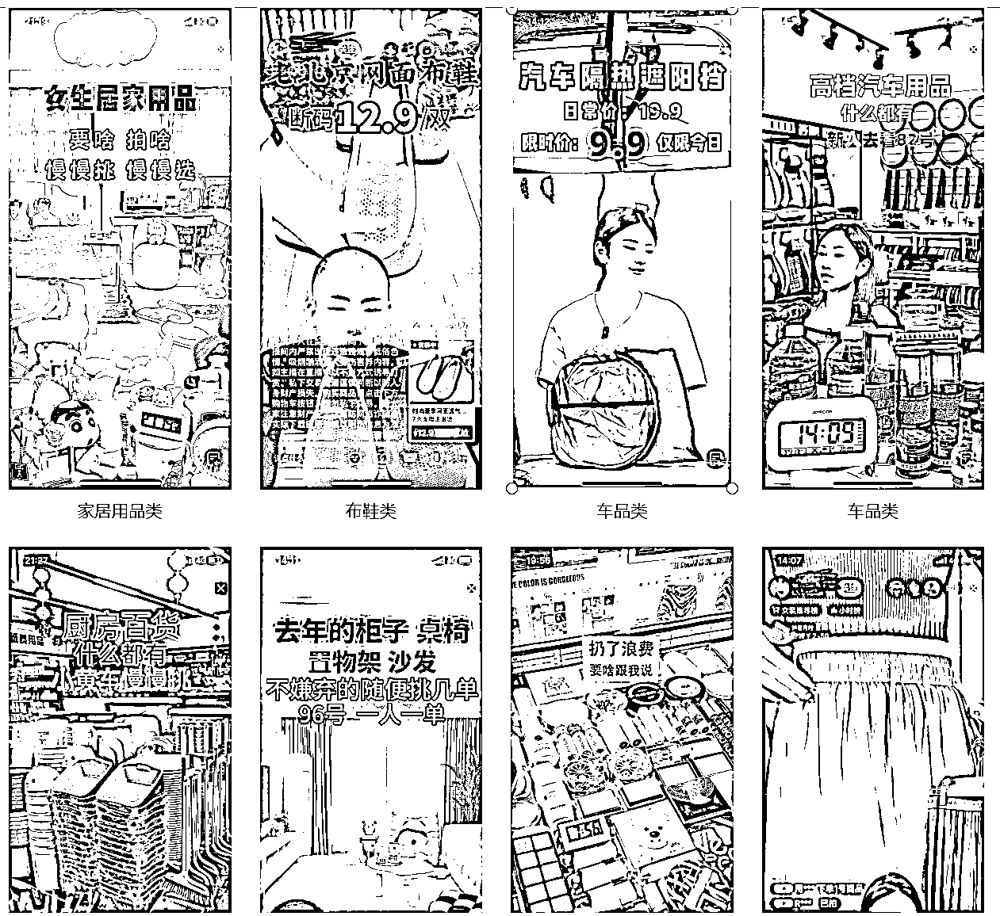

# 项目玩法介绍

很多做过半无人的朋友，可能会把这类直播间当成半无人直播间，虽然看起来画面很像，但是流量结构不同，运营操作方法也不一样。

半无人直播间流量来源推荐feed占80%以上；搜索流1.0玩法流量来源搜索流占80%以上；搜索流2.0玩法是直播推荐 + 搜索流相结合，搜索流占比在50%左右。

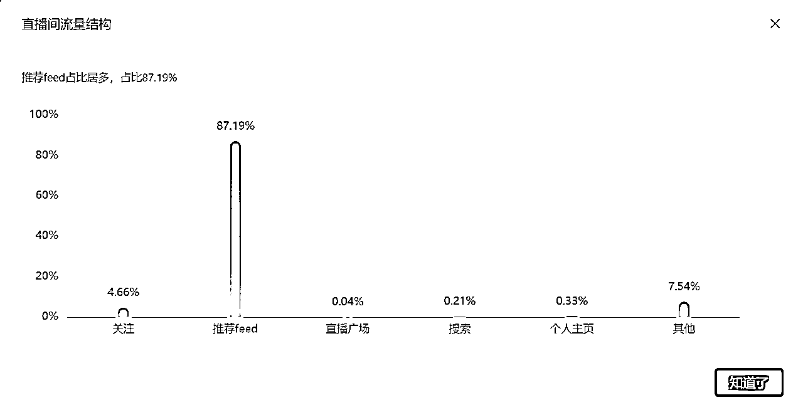

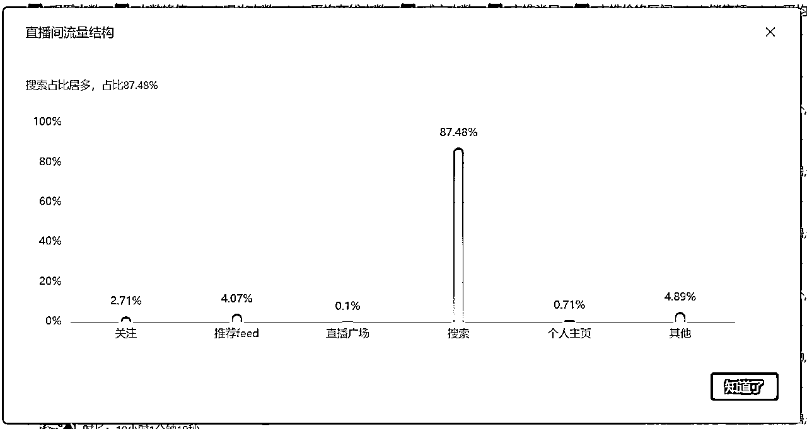

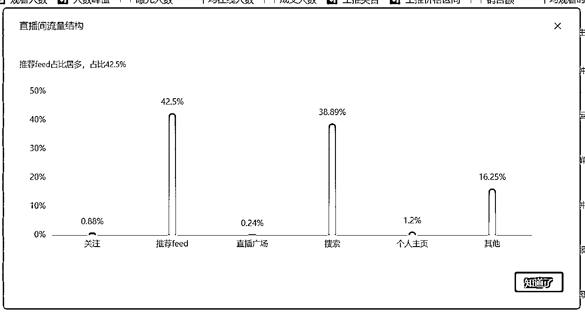

搜索流2.0玩法，搜索流 + 推荐feed相结合的好处是，搜索流转化高，人群精准，基本第一天开播就能出单，属于保底流量；推荐feed叠加搜索流量好处是流量能够更大，天花板更高，总利润可以更大；

整个变现路径解析：账号准备 — 对标选择 — 选品200个 — 搭建直播间 — 账号起号 — 稳定直播 — 矩阵放大

# 做出的成绩展示

7月份，新号起号跑了1个月，整体营收21.1W，佣金2.67W，利润率12%左右，退款退货率10-15%之间，毛利润在2.3W。

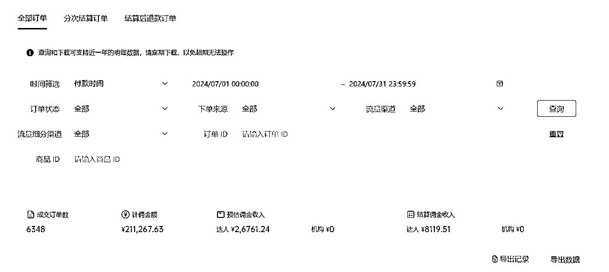

# 项目拆解流程：GMV=流量*转化

## 一、流量端

流量是直播推荐 + 搜索流两个；接下来分别说一下这两个流量如何做：

1、搜索流流量来源是产品链接，所以直播间要挂满200个商品，爆款商品自带搜索流量；

2、直播推荐流量来源是直播间停留互动 + 订单密度 + GPM数据递增破流量池做出来的，所以需要起号打标 + 破流量池操作。

3、尽可能长的开播，开播的时间越长，收益越高。

总结：流量端的核心动作就是挂满200个商品 + 直播起号操作 + 长时间开播

## 二、转化端

如何保证直播间进来的人能够产生高转化呢，这个就是直播间内容的模块了。

1、消费者为什么会在这类直播间下单，本质是产品性价比高。搜索流1.0玩法是利用达人券补贴消费者提高下单率；搜索流2.0玩法是通过选出高性价比的商品，现在精选联盟里面有很多品极致性价比，价格低，给达人5-15%的佣金，产品符合抖音“价格力”策略，有更多流量；

2、搜索流本身是精准的，所以只需要选出有搜索流的品200个 + 直播间话术承接就可以；

3、直播推荐流量在起号阶段是不精准的，需要打标签做数据才能精准流量，所以起号很关键；在起号的过程中，要配合主播拉流话术，200个商品要有主次，自然流容易出单的产品往前排；

4、整个直播间要营造低价、清仓、批发、甩卖等氛围，更容易留住消费者，促使其下单，具体表现在直播间画面、主播话术；

总结：转化的核心动作是直播画面吸引 + 打标起号 + 主播话术 + 组品排品（如果放弃直播推荐流量，仅仅拿搜索流流量，就不需要起号打标，组品排品等操作）

利润计算：净利润 = 产品价格*佣金率*90%（90%是技术服务费）

# 项目的准备工作

接下来就是我们的实操过程。这类直播间是绿幕直播间，真人出镜讲解，也有非真人类型但流量相对较低，主流是真人出镜讲解。

## 一、直播间搭建

1、手机：苹果7以上，或千元安卓手机即可，刷抖音流畅就行，不用开播；

2、直播电脑：能够正常运营直播伴侣直播；这是我们自己用的电脑配置，比这个差点也可以用；

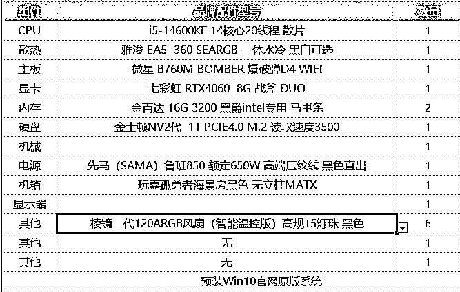

3、背景搭建：绿幕布1块；

4、直播间灯光：2个圆形柔光灯，便宜的几百，我们用的金贝；

5、直播摄像头 + 支架：罗技C920e\罗技C1000（更高清）；

6、样品准备：准备几个自己要卖的产品样品，摆放在镜头前；

7、收音麦克风：100多的就行，我们用的好牧人；

8、其他道具：一个小音箱，几十块钱那种，放歌曲；一个电子时钟（避免系统误判录播）；

9、根据对标直播间制作直播间背景图片（后面会讲背景拆解）。

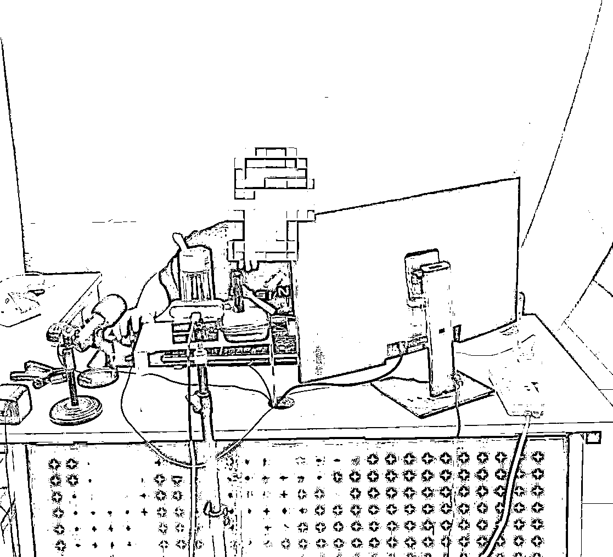

## 二、账号准备

1、一个抖音账号2个，必须用未开播新号；开播老号无流量扶持，标签不准；不要推荐feed流量可用老号；

2、抖音新号注册后养号3天左右；

3、新抖音号需要涨粉丝1000个，实名认证，开通电商橱窗、直播伴侣。

4、准备一个蝉妈妈/考古加等第三方数据软件用来找对标、选品，蝉妈妈要买企业版；

5、准备一个小不点直播软件，用来自动弹讲解、弹评论区话术，踢人等操作；

6、OBS推流 + 直播伴侣开播，电脑需下载其软件。

# 项目实操流程

这类直播间在大部分类目都有对标账号，我们首先需要找到一个合适的对标，根据对标情况判断类目竞争程度，以及起号概率，然后根据对标直播间信息，设计直播间背景图、确定200个产品，确定主播话术，让自己最快的开播拿结果。

## 一、类目选择

大部分类目都有这类账号，但是女装、男装、童装等类目退款率太高，不太推荐；美妆护肤、医药保健类目付费玩家太多，流量不容易拿到；小众类目，人群太少，搜索流难以出单。

下图框选类目都比较好，尽量选择大类目下的细分类目，这样人群规模比较大，搜索流更容易出单，推荐流量更容易起号。

另外，要想放大自然推荐流量，单个直播间必须要垂直人群，选择单一细分类目产品；不能一个直播间多类目选品，想要做多个类目需要多个账号。

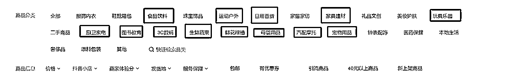

## 二、寻找对标之蝉妈妈

用蝉妈妈等第三方数据平台能够很快的找到对标账号。首先，确定一个想做的类目，然后在该类目下选择二级细分类目，从二级类目中找到对标账号。具体操作如下：

1、打开蝉妈妈，商品列表，选择其中一个二级类目；

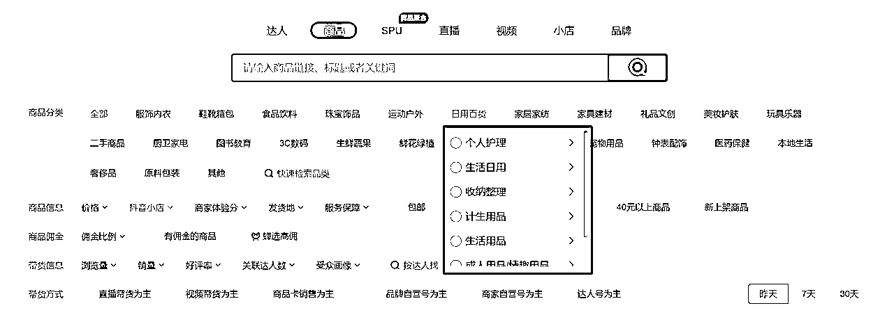

2、选择其中一个二级类目，然后看商品链接，时间选择30天

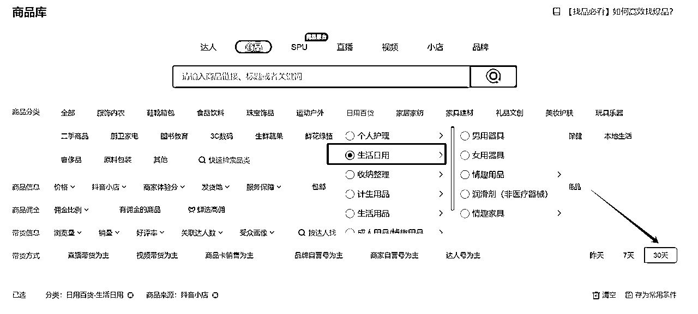

3、看达人列表，近30天，销量不错的直播达人，从里面找找看有没有我们想要的达人；

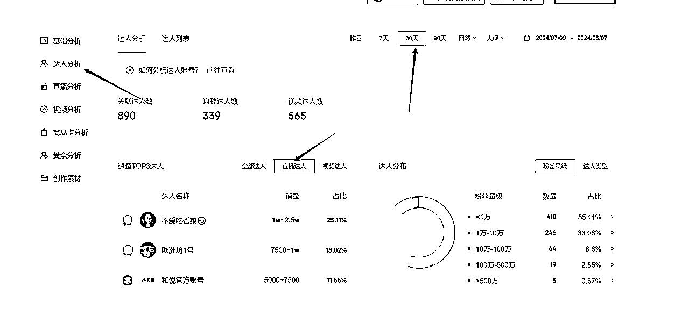

4、比如出现了，类目批发、清仓、类目合集的账号，都可以点进去看看

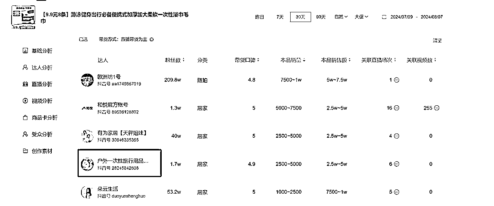

5、类似这种，直播间挂了200个品，单一类目，并且直播间背景是绿幕，真人出镜讲解，就是我们初步是筛选出来的直播间；

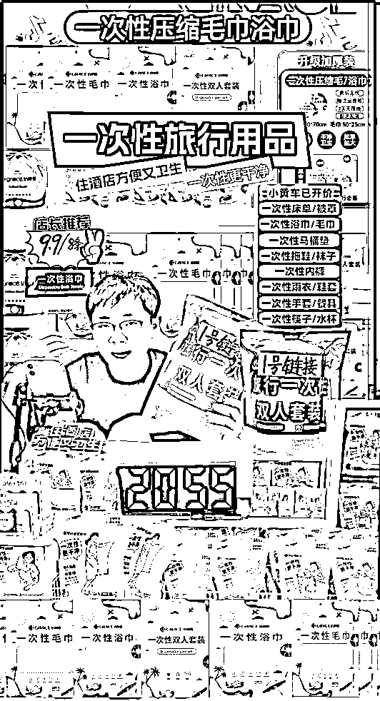

6、当我们知道了，原来一次性旅行用品可以做成直播间，那么就去搜相关关键词，一次性、旅行用品、旅行用品批发等，找到更多账号；

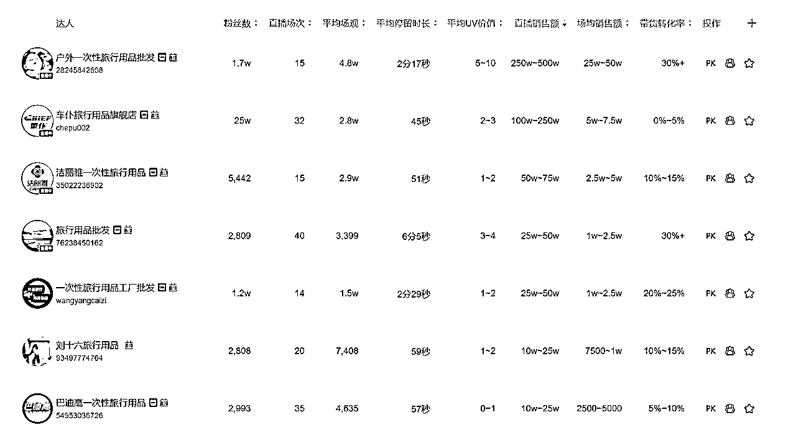

7、验证一下他们的直播间流量来源是搜索、直播推荐、还是付费？

【注意】品牌直播间、推荐feed占比超80%的直播间、其他占比超80%的付费流直播间，玩法和本文章讲的不一样，直接忽略掉。

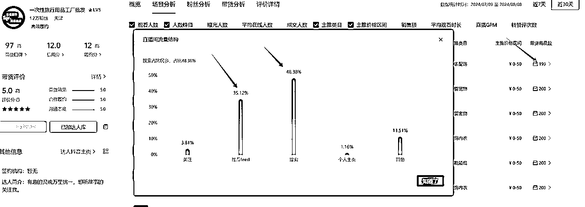

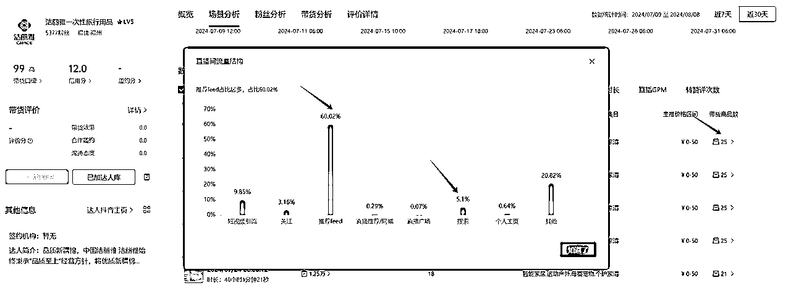

## 三、寻找对标之抖音搜索

我们知道了某个类目的账号名称关键词，就可以直接打开抖音搜索直播间，更多同类直播间就会浮现出来。

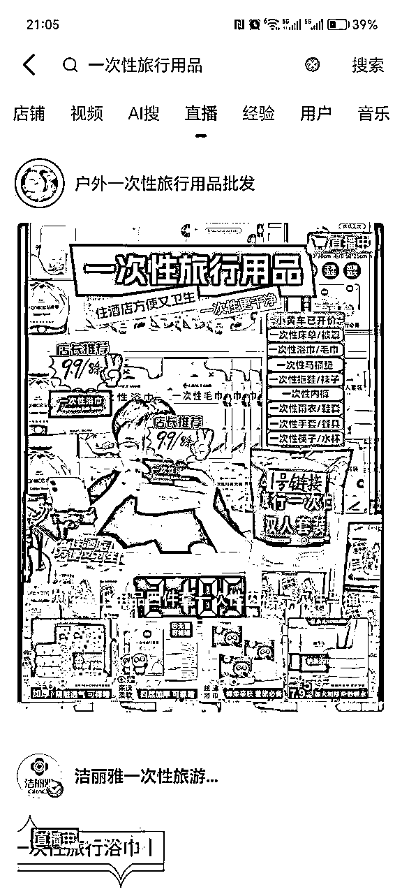

## 四、对标判断

把你找到的对标账号数据统计在表格里；然后分析这个类目的竞争程度，以下判断标准可参考；

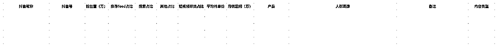

1、该类目只有两三个号，粉丝量不超过1万，且直播时长不超过2个月，GMV却很好，优先选择；

2、该类目如果有两三个老号（粉丝量1万以上）；新起的账号GMV只有老号的1/3，且大家的主推品都是一样，说明竞争比较激烈，成功概率较低；

3、该类目如果有两三个老号（粉丝1万以上），但新起的账号也有两三个GMV也不错，且主推品不一样，说明选品空间比较大，尤其是百货类目更容易选品，尽快测试；

4、如果该类目只有两三个号，直播时间超过2个月，新号一个也搜不到，这种属于成功概率不确定，只能测试下看看；

5、如果该类目只有两三个号做的好，直播时间超过2个月，新号超过三个且流量都很低，且主推品都一样，直接放弃；

6、在类目表格中找到近1个月起号，直播时间符合你的安排，GMV和利润符合预期的账号作为对标账号，模仿这个直播间，1:1复制。

总结：从众多类目中选择一个细分类目，细分类目竞争不大，有选品空间，确定1-3个对标就是本阶段的工作！

## 五、开播准备

### 1、直播间画面搭建

直播间画面直接1:1复制对标直播间的背景画面即可，首先拆解对标画面，然后在1:1复制即可；画面拆解分为背景、前景、贴纸、主题、道具、人物位置、样品位置等信息。

制作用美图秀秀、PS工具，背景图片百度、图库、小红书等平台找高清图，不需要一模一样；整体配色协调，美观，直播主题文字、重点贴纸突出颜色显示。

具体OBS + 直播伴侣怎么用，大家可以自行百度。

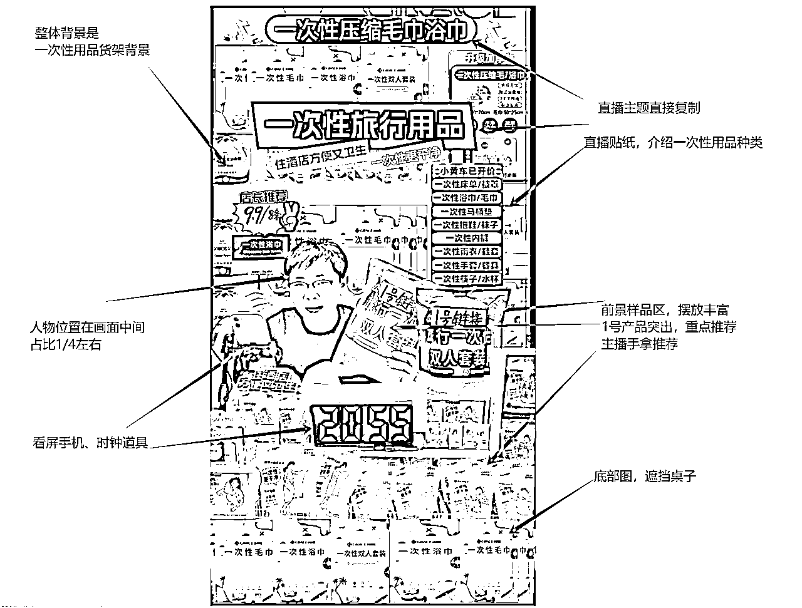

### 2、样品准备

看对标账号画面中主要推荐的产品，购买几个回来即可，重点推荐产品一定要买样品，其他不需要，前期起号有3-5个样品即可，后面有爆款产品再买也行。

注意：直播间必须要有样品摆放，刚开始起号样品准备不充分，可以直接美团当地购买；

### 3、话术准备

话术直接复制对标账号的，复制以后，要对话术进行分类，产品讲解话术、引导评论话术、引导关注话术、人设身份话术、点对点成交话术。

以下为话术列举，方便大家理解不同话术，更方便的分类；

1、产品讲解话术：重点推荐产品是如何讲解的，卖点，使用场景、使用人群、当下福利活动等；

2、引导评论话术：直播间新粉丝，想要近期旅游，带孩子出去玩儿的，想要什么找不到打出来，主播给你推荐；

3、引导关注话术：我们是一次性旅行用户工厂直播间，点点关注不迷路，以后需要随时能够找到我，我们工厂直发，一件也是批发价；

4、人设身份话术：我们是一次性旅行用品工厂直播间，16年老工厂，之前给线下XX个品牌做代工，刚开始来线上直播，一件也是出厂价，包邮送到家，产品都有XX资质，XX质检报告，放心选购。

5、点对点话术：人少和起号阶段需要点对点话术。欢迎XX进入直播间，我们是一次性用品工厂直播间，近期出游的，需要什么下方小黄车看看，工厂直发，一件也是批发价。

### 4、链接准备

登录巨量百应，选品广场，挑选自己需要带货的商品链接，搜索关键词添加到选品车 + 商品橱窗。具体操作如下：

1、登录巨量百应，打开选品广场

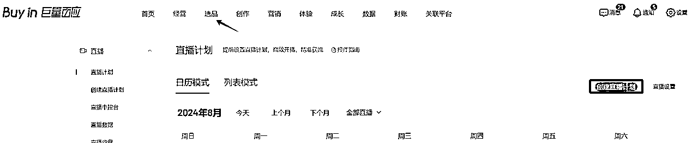

2、搜索产品关键词，找到产品

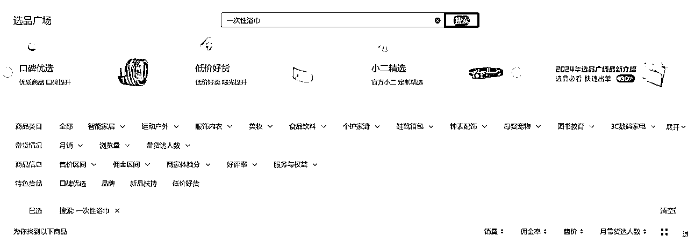

3、查看商品销量、佣金、发货店铺DSR评分，选择分高，销量大，佣金正常的品，点击选品车添加，多添加一些，可以添加200-300个，直播的时候可以再筛选；

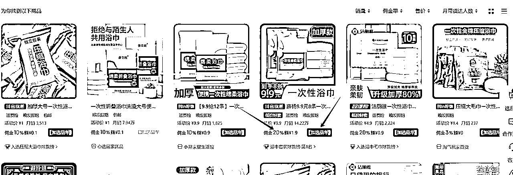

4、点击商品进入商品详情页，同时点加橱窗，橱窗也可以出单；

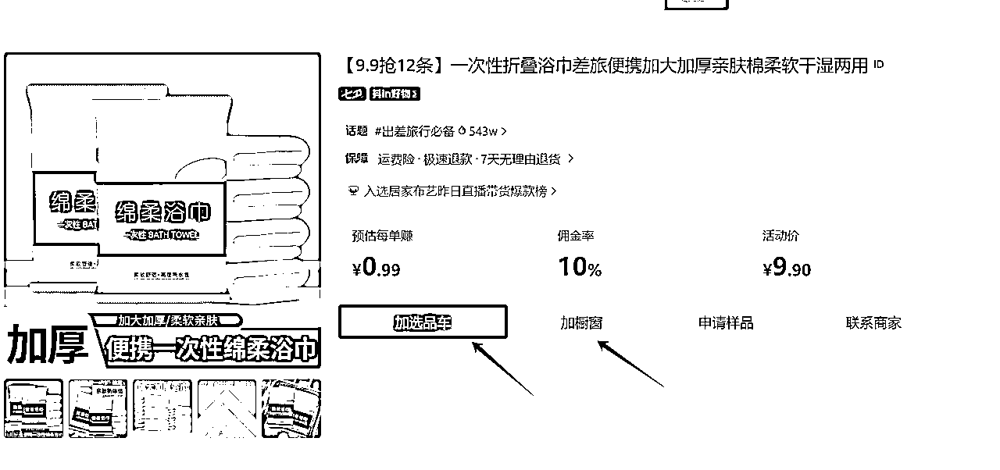

5、开播前去直播中控台，把产品添加到中控台就可以开播了，填满200个。

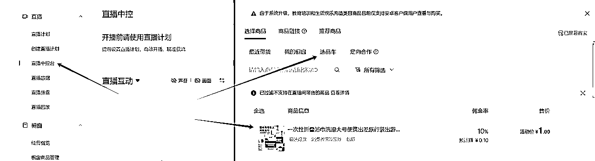

### 5、开播时间，开播时长

1、开播时间。根据自己的时间安排好，开播后，开播时间不能轻易改变，会影响系统打标；整点竞争较大，新号一般不选择整点，如果你想7点开播，就选择，6:55、7:06、7:10这样的时间。开播时间可以参考对标，比对标早1小时左右，晚1小时左右都行；

2、开播时长。参考对标的直播时长，如果对标是拉时长的，你也要尽量拉时长，很多大类目的账号都是播16个小时，如果你选择的对标是16个小时，就要考虑2-3个人换着直播，由于直播话术很简单，可以家里人一起播。

总结：这一阶段工作就是模仿对标1：1搭建直播间，注意其中的细节，选品多选，可以备用；直播间长，越长越好！

# 起号操作

以上工作完成，直播间就可以正式开播了。抖音直播间从0-1是最难的，尤其是自然推荐流量打标拉流的过程，所以在开播前要确定自己的起号方法，以及运营操作，接下来是起号的重点内容，也是直播间成败的关键！

## 一、搜索流

搜索流是因为产品优质，消费者直接搜索产品进入直播间下单的，所以没有拉流、打标的操作；搜索流大小的操作很简单；

1、直播小黄车产品200个填满，选品选择近期爆款，且竞争对手不是很多的产品链接，我们自己测试下来一个链接同时被3个直播间挂都是有流量的，最先挂的流量最大；

2、直播间的200个产品可以更换，基本一个链接超过3场一单不出就更换掉，搜索流的核心就是测品；

3、直播间话术，按照上面讲的话术循环讲解，承接流量就可以。

总结：搜索流是很容易出来的，只要选品测试循环做，挂满200个爆品，第一天就出单是很轻松的；

### 二、直播推荐

直播推荐流量是系统根据直播间的标签和流量层级推送的，所以直播推荐的流量想要拉起来，就需要有精细化的运营能力；给大家用我们最近新号的起号数据，给大家讲讲如何操作；

1、抖音底层逻辑概括：直播间想要系统推流，首先要解决两个问题：

第一是流量精不精准？系统是通过标签匹配用户和直播间的，简单来说，就是直播间有目标人群互动、下单了，系统就识别了标签，下单的人越多，标签越准。

第二是流量多不多？系统识别了标签，知道推送什么样的用户了，但是到底是推荐100个，还是10000个是流量层级决定的，流量层级如何提高呢，搜索流2.0玩法直播间就是靠订单密度拉高流量层级。从我的观察看，这类搜索流直播间大部分账号的在线人数就是100多人，就是4-6层级。

流量层级在线人数阈值：5、30、60、80、120、180、230、260、1000人。

直播推荐流量起号的过程就是，打标签，破流量阈值的过程。

2、第一场操作

第一场操作，挂满200个商品开播后，通过点对点成交的方式打标签。这个时候进人很少，每个人进来就用点对点话术洗一遍，进来就走掉的不是目标用户，进来有人提问的才是目标用户，尽可能成交他。

第一场流量走势图，刚开始在线是0-5个人，点对点成交，等到成交几单后，系统识别基本标签后，推流会相对精准，在线会进入5-20人左右，在这个阶段不断洗人，提高下单率。

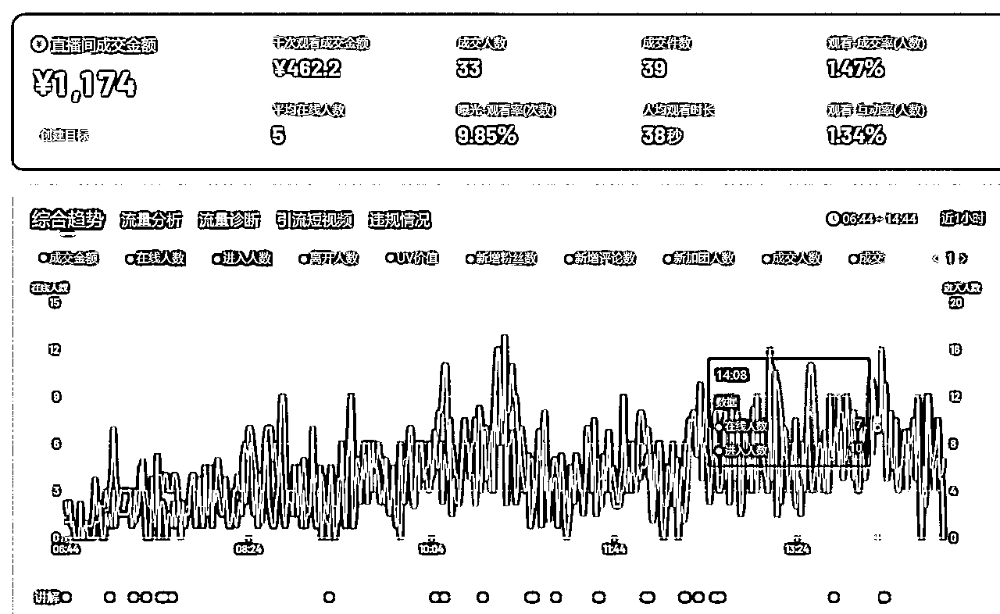

第一场基本是搜索流先出单，直播推荐流量后出单，但是一定要区分两个渠道的出单，搜索流大量出单，直播推荐不出单，是拉不起来直播推荐流量的。

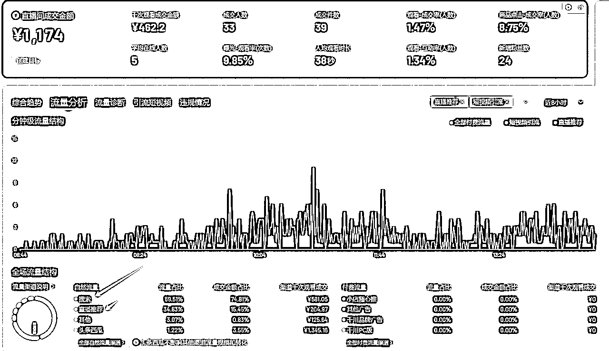

### 3、第二场操作

延续第一场的操作，还是要注意话术拉流，互动话术、关注话术等互动话术，直播推荐流量有人互动，有人下单才能拉高流量。第一天的操作一般比第一天的流量上升一个层级，也就是在线10-30人左右，如果出现途中这样的高峰，说明，前面1小时数据做的不错，系统在给更多流量，破流量层级。

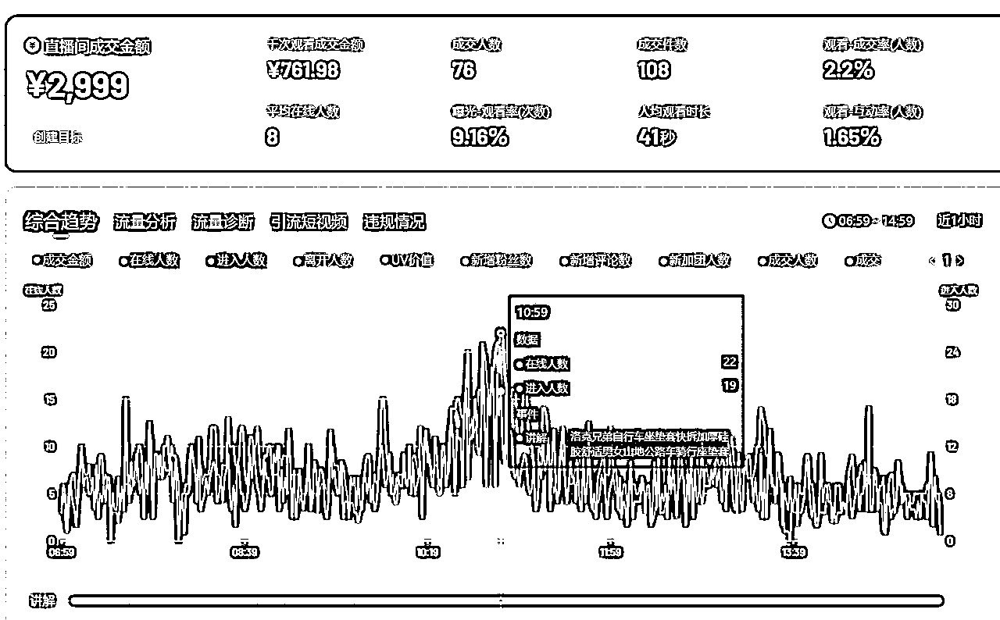

直播推荐流量占比达到50%左右，整体的订单量、GPM数据都有增长，订单密度增加。

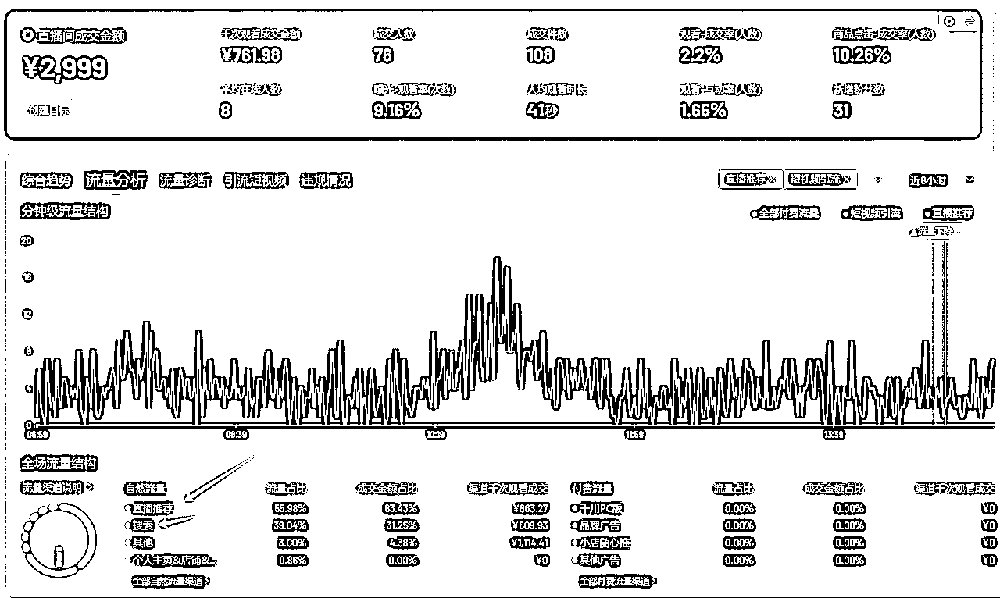

### 4、第三场操作

如果数据继续增长延续第二场操作，如果数据没有递增，第三场要做调整，这是要分析是哪个流量没有涨，或者下单，如果是搜索流问题，就换品，给直播间添加新的产品

如果是直播推荐流量，就调整产品排序，主播话术调整，重新精细化分析对标账号的话术。

正常第三场的在线是可以破30人的，也就是说账号基本打标完成，系统推荐的流量更加精准，播同样的时长，下单人数变多，GMV增加，GPM稳定。

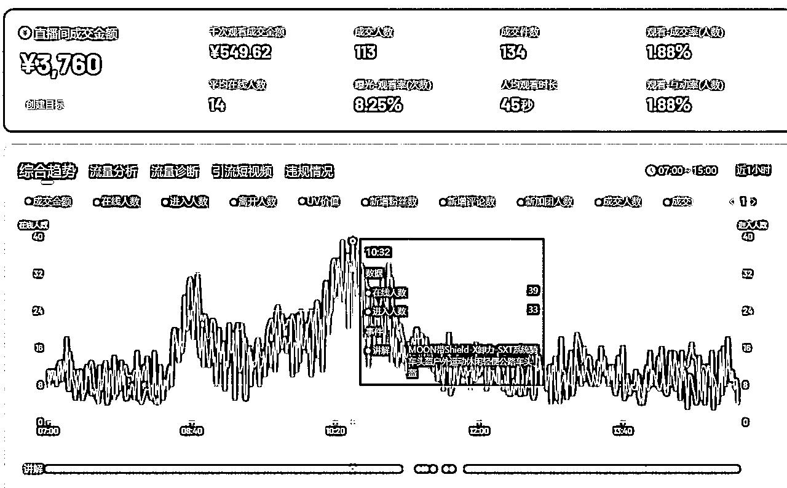

### 5、第四场操作

如果数据继续递增继续之前的操作，如果数据没有递增，还是找问题，确定是搜索流问题还是直播推荐问题，然后做操作。

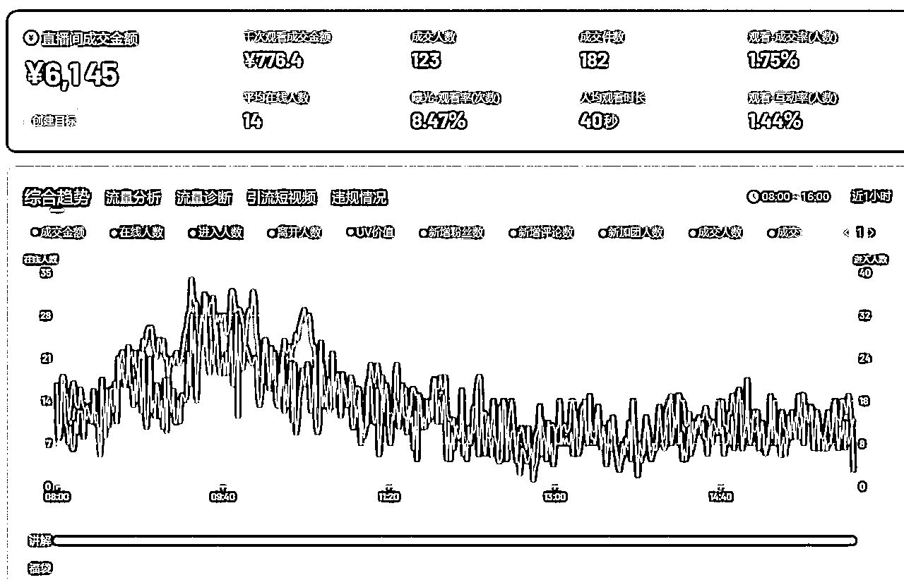

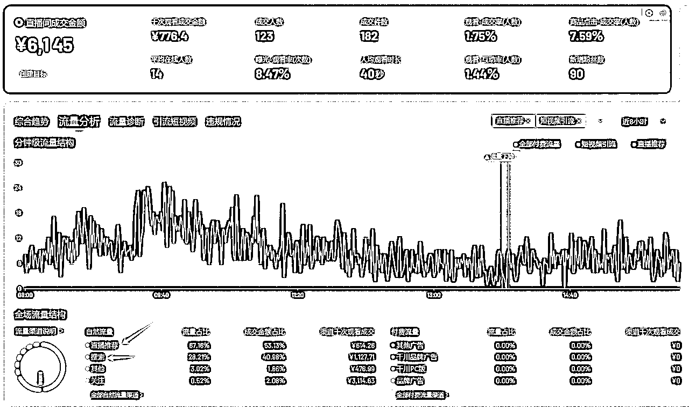

总结：直播推荐流量起号这一步是比较考验运营能力的，我上面说的第几场不一定就是第一场，如果你第二场没有做好，第三场还是延续第二场的操作。如果直播推荐流量一直拉不上来，也不用太担心，专心有话搜索流，GMV也不会很差。

这种类型的直播间起号大概就是7-10天，超过10天直播推荐流量没有起来，就放平心态，不用刻意管直播推荐流量了。专心播搜索流。如果有小伙伴做这个项目，碰到具体的问题也可以问我~

# 项目总结

1、本次项目是非常适合个人全职去干的，整体营收一个月1-5W左右，但是需要拉时长8-16小时，夫妻干最合适。单小时GMV我们测试下来是500-1000元；看多个类目同行的数据也差不多，利润单小时50-100元；

2、这个项目的成功率比较高，原因是有搜索流，搜索流本身属于保底流量，只要上满200个商品，再加上测品的操作，一天卖几千没问题；

3、搜索流2.0玩法里面加入了直播推荐的流量，更可能做大流量，但是直播推荐流量波动较大，所以在流量做起来以后，尽量每天固定时间，固定时长，断播3天就会掉流量层级；

4、搜索流2.0玩法把发优惠券的操作也去掉了，基本不会亏钱，就是比较费时间；

5、搜索流2.0玩法尽量做真人出镜的直播间，不要录播，近期平台查录播很严，录播直接扣12分关橱窗；

6、搜索流2.0玩法的背景画面都是静态图片，图片类直播间存活更久，背景不要做视频循环，容易违规；

7、搜索流2.0玩法直播间除了多品模式，还有单品打爆模式，也可以多去研究下对标；

8、如果想要把它当作项目去做的话， 一定要做矩阵，多矩阵运营收益更稳，尤其是所在城市人工成本比较低的话，可以用兼职主播模式放大。

# 个人介绍

你好，我是千易，9年自媒体人，6年电商人，17年创业做今日头条至今。头条、抖音、视频号、小红书都做过，连续三次用5W本金赚到100W，操盘过多个项目，现在主要做大健康产业的直播间和短视频带货，多平台矩阵，有相关资源的伙伴可以链接！