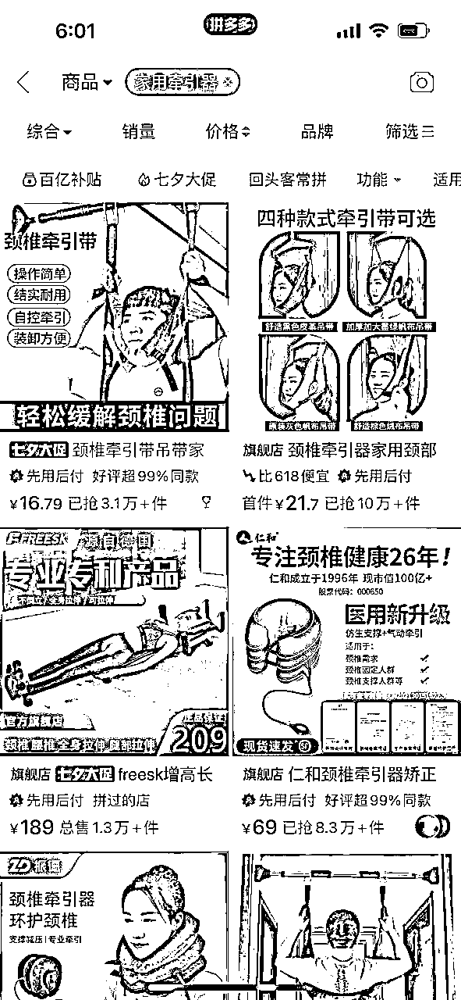

# 生财人的颈椎康复指南 暨互联网人大精力恢复术

> 来源：[https://giwb0zv0cv.feishu.cn/docx/C5YOdSCh3oMzEVxAYZCcEKbTn8c](https://giwb0zv0cv.feishu.cn/docx/C5YOdSCh3oMzEVxAYZCcEKbTn8c)

圈友好，这篇文章主要分享自己颈椎病发和康复过程的一些发生的故事和事故。

如果你是办公族 经常看手机，或脖子前倾 富贵包 精力不济 肩膀僵硬 脖子活动受限 呼吸浅 亚健康……就来看看

本来没打算写这篇文章，毕竟自我剖析需要勇气。但是前段时间看了明白老师的那篇文章 看得我猛男落泪，然后我问了一下自己是不是可以给大家带来很大价值，答案是肯定的。

第一，这算一个创业路上很大的弯路，如果少走的话 可以少很多痛苦 省下很多钱和时间，避免更多的损失

第二，感觉康复的历程和做项目很像

第三，赚钱嘛 身体是第1位，解决了颈椎病问题之后精力比之前多了1/3，能更好的赚钱

第四，大部分人还是处于无症状或轻微症状的阶段，这个时候干预其实是最好的时间

第五，康复路上坑太多而且有不少大坑 希望大家可以避过

第六，搞互联网的同志们手机电脑比老婆还亲 有劲椎问题的不在少数

身体好了才能更好的搞钱 这么一想想也是很咱们生财的主题，确定了可以给大家带来帮助和价值，那就没什么可犹豫的了。带着一点不好意思 就写了

## 前言

说个现象，6月分和山西生财的几位大佬一起吃饭@胖大玲 @奇杰 @张集慧 @李 司令。山哥 龙哥，还有我，一共8个人。期间谈到了有关健康的话题：三哥的腰椎去北京做过手术，我和司令去年也分别因为颈椎和腰椎的突出 卧床半年之久。吃完饭后去慧姐公司 分别摸了摸慧姐和杰哥的肩膀，也是硬硬的 厚厚的一大片。没有摸大玲的 未婚少女下不去手…

结论：一共7个人，3人在腰椎和颈椎方面有个大问题 严重影响到工作和生活，3人亚健康 1人未知。让我不禁感慨：实在是太可怕了。

这段时间我一直在想创业到底给我们带来了什么？有多少人钱还没赚到 身体先废了，有多少人想要扩大规模或者公司正常运营的时候身体出问题而终止，有多少人钱赚到了 但无福消受？

最后才意识到对于我们创业人来说一定要重视身体，先把健康放在第1位。可能刚开始创业 3~5年内没什么感觉，但工作或者创业5年以上，尤其是需要久坐 经常使用手机和电脑工作的话，颈椎和腰椎是90%会遇到的问题

# 引子（背景铺垫 可跳过）

从去年杭州参加生财会议开始说吧。

去年3月去杭州参加生财聚会 当时和慧姐 杰哥一起去的。第1次见面还是很局促 我是个新手 他俩是会议的分享嘉宾，现在已经是勾肩搭背的程度了 可能这就是时间的力量吧 哈哈

刚到杭州时下起了小雨 是那种毛毛细雨，和我们北方的雨不太一样，北方即便是小雨 点子也很大。很湿润的空气 呼吸的时候还带着甜甜的味道，一切都感觉很美好的样子……

会议没开始的时候还看见了谱姐，第1次见面就让我感慨：真是“小小的身躯 大大的能量”。

会场当天正在进行生财拉新，只见她坐在前排 ，时不时抬起头拍照，几秒后手机里几十个拉新群，纷纷闪烁着红点。那是谱神在拉新群同步会场的信息，滑倒朋友圈还看到了2.3条热乎拉新文案，貌似还成交了几个客户，点个赞回来又发现还在陪伴群里做着分享，等我看完分享 抬头看她的时候，她正在认真的听涛哥分享 听得很认真……

对此我心理只剩一个大写的【服】字

听老大的开场 很热血沸腾 就想加入生财，奈何已经加入了，一气之下 发了个朋友圈。回家以后让我老婆加入了，一开她是拒绝的 后来说真香：去年她通过看航海资料做抖音直播变现了小3万块钱，狠狠的赚回了10倍➕门票（后来因为品的问题，需要晚上直播比较伤身体 还要带孩子就没继续了）

印象最深的分享当属涛哥的四字生财咒语

一口气说了几十个词，听的时候，当时甚至忘掉了呼吸。我在想那口气如果去吹那种长长气球的话，一定能吹得很高吧（大概三四层楼那么高？）感慨于涛哥文采的同时，也佩服他的肺活量（等身体再好一些了我也要打篮球），不愧是生财的大师兄，真文武双全也。

参加完会议，像是吃了兴奋剂一样，准备回去大干一场。

刚回太原构思下一步发展，做项目 做矩阵 认识新朋友。这段时间参加了很多次线下聚会，认识了很多好朋友：司令 大玲 虾总 新亮 小妖 船长 一休 正记录 龙哥 ……一切都在蒸蒸日上 一切都在慢慢变好，这大概是去年所有生命中最美好时光的回忆……

为什么写这段引子 我想我是在给自己做放电影疗法吧，大家就当背景交代吧~

# 康复过程

## 忽视阶段

突然有一天脖子低头剧痛，刚开始没当回事，就像很多末世小说里面的那句话，起初人们只是以为这是一场普通的暴雨。

再到后来发展成肩膀僵硬 活动受限 不能低头，后不过依旧没有在意。其实在近半年左右已经有征兆了 就是特别容易累，基本上一到下午五六点就感觉没有精力 晚上七八点就需要躺在床上了。完全不像一个30岁左右的青壮年 那种感觉就像电池很快就用完了，后来才知道是因为脖子周围肌肉太紧导致供血氧气这些供给不足，之前一直以为是肾虚（幸好不是😍）

现在早上6点起床，中午睡半个小时 晚上也挺有精神的，能玩能闹的 吃饭光盘

一开始不舒服了我随便找个盲人按摩 结果却越严重了，这里有个大大的误区，就是我们认为只有生了大病才需要去医院 其实不对。直到现在知道了完全可以去康复按摩 价格和外面按摩的一样，而且更专业更科学。现在想起来很庆幸的，脖子周围有大量高位神经。一不小心可能会导致终身后悔。其实去了医院的专业理疗就会发现都是轻轻的按压穴位，而且还会告诉你平时应该去怎么去调整体态或者锻炼力量改变日常不良习惯

我想以后的日子 约3.5好友做康复按摩要取代了8号技师了，足疗店 干掉你的不是同行~

## 轻视阶段

盲人按摩 把我送进了医院，还是没太在意。找了家门口医院的中医康复的理疗科，这个时间大概是去年6月份了 当时也没拍片 医生给我开了10多天的理疗（中频脉冲）。跟我说理疗完了回去做做颈椎操（具体在怎么做 估计他也不知道）回家就是跟着b站周六野 范里猿等一众up主拉伸 效果微乎其微。期间芷蓝姐跟我说过一定要拍一个核磁 然后正规医院大医院找专业的医生去做康复。但是由于我个人狭隘的认知。我觉得问题不大（优势在我🤏），由此又付出了惨痛的代价，在这里我又学到一条：要找多个大夫看 不同科室，每个大夫的视角都不一样：骨科的骨头没问题就等于没事 中医的含含糊糊，就像芒格说的拿锤子的人手里都是钉子。

让回家去做颈椎操 但是去做哪个颈椎操他也不知道，建议你回家做拉伸 怎么做拉伸他也不知道，因为他是属于他的领域（比如骨科）专业，但是另外一个领域他就不是懂了。

回家瞎练，大概率自己拉伤了。

今年自己跟着运动康复师去锻炼的知道每个动作都需要正确姿势 他需要去给你纠正。

训练力量 重塑体态 一开始先放松肌肉，放松到一定程度以后再开始拉伸 拉开了再能去锻炼力量，根据你肌肉的不同紧张程度 力量强弱以及体态告诉你不同的动作。这个礼拜做的跟下个礼拜做的动作完全不一样 要达成的目标也完全不一样（在这里可以确定：在互联网上 得不到正确的方案 因为每个人的情况都不一样）

康复期间我遇到了很多刚做完手术没有及时去做康复训练的人导致终身瘸子 疼痛 活动受限，都是做完手术之后 大夫告诉他回家多活动多锻炼。病人也不会活动 有时候活动都不到位 有时候活动的过头了，然后没办法了才去康复运动，这个时候已经晚了。

在这个过程我学到了非常重要的认知。就是每个人不管做什么行业，只要他没在交叉学科上下功夫，一定是有局限性的。

问题是整体的全面的 系统的，但是大部分大夫（或者是我们找的创业教练也好 心理咨询师也罢），都可能只是从他懂的角度去给你解决问题（大部分人都是单向度的）

这也是好的大夫/教练 很难得原因，他需要精通自己的领域 还需要懂其他领域 得是T型或派型人才

## 摆烂阶段

随着治疗效果欠佳和大夫告诉我的错误的消极观念 （这个病只能靠养 没事你要多躺）

我开始摆烂了 每天躺在床上，因为这个时候也到了急性发作期 巨疼 转头 低头也做不了，每天焦虑无助 彷徨无奈，还经常哭（有点不好意思 哈哈）。【独白：我才30岁就已经这样了，想起家中有年近70岁的老母亲 想幼儿园大不了酱油的孩子 还拖累了我老婆 我真是个废物...】怎么说呢，就特别消极吧 觉的自己在物理层面废了

为了能让大家正常心情看帖，这段最难熬的日子的心理状态就不去过多的阐述了。

直接说有价值的点吧，这段时间是深刻的意识到了身体对于心理的影响，也就是身心之间的互相作用。包括最近在医院跑看到了几乎每个在身体有症状的患者都会不同程度抑郁症，结论就是身体不好了 心里也跟着不好。

那岂不是反过来身体变好了 心理也会变好呢？

我想起句心理学名言“生命若海洋 躯体以为岸”

所以说如果我们在创业的过程中焦虑的话，有个解决方案就是让自己变的更加健康一些，多去运动可能是最直接最高效 最省钱省事的方法了，运动疗法yyds！

随着身体素质的增加 体内激素逆转 不良情绪获得释放，你的心情自然而然就会变好 这是一个直接关系。尤其是最近感受更加深刻：随着脖子周边的肌肉发紧的状态消失 随着自己的精力也越来越好 雄心壮志也又回来了。真是天晴了 雨停了 我又觉得我行了...这也so神奇了，怪不得有句话说身弱不担财，雀食如此

躺着的那段时间网上拼命的找各种方法。我在小红书不断的刷贴在每个评论区看别人是怎么好的。然后记录下来写了两大张纸，一开始觉得特别有价值。

直到把这些所有的方法试了个七七八八。这么说吧，不能说毫无作用，有些招式直接差点让自己废了。

比如：吊单杠 搞了几天直接更严重了（原因是当时肌肉太紧了 没弹性不能直接拉）、还有游泳（适用于症状不是很严重的时候 前提姿势是对的）和羽毛球（太激烈了 打完更厉害😭），甚至在严重的时候 游完泳症状也更加重 一开始还觉得挺一下是不是就好了？后来才发现不是这样的，还有晒背 八段锦 狗皮膏药...基本上全试过了。

这些片面的知识不能说它是错误的，的确有的人是在他那个症状使用某个方法是可以的（一般是轻度），但是不能随便去套用，每个人病因 程度不一样。可能彼之蜜糖 汝之批霜

在这个阶段学到最重要的：就是瞎整不如不整，没有正确认知 大量瞎搞，基本上是徒劳无获，甚至是开倒车（有一个比较恐怖的是我在网上还看了牵引器 不过没有下单，因为我感觉这个可能是有点危险，实际也的确是这样的，后来才知道操作不当有可能导致瘫痪。当我看到拼多多上家用简易版牵引器的销量那就觉得愚昧太可怕了）

和创业一样，多少人一上来一顿操作猛如虎，最后负债累累 凄凄惨惨戚戚

雷军那句话该排上用场了：找个懂得人问问！

不过留给我们课题是：在任何一个“柠檬市场”，如何找到真正懂行的人 这个绝非易事。

## 消极阶段

后来消极主动的找了针灸的大夫，针灸的大夫很专业 6个疗程（半个月）效果立竿见影，症状去了7788，让我一度以为已经好了。直到后来小半年的反反复复。才不得不承认 针灸祛的不是根子 而是症状。不良的姿势这些问题还都存在 这种情况下，问题不是消失了 而是藏得更深了。

这个针灸大夫专业的一批，很多有面瘫的或疼痛的患者去找他 做几次基本上就ok了，即便如此 他对于颈椎病的看法也是这个主要靠自己恢复 具体怎么恢复呢，告诉我6个方向，倒是挺全面的：不要熬夜，不要着凉，注意情绪，注意姿势，锻炼，拉伸。问题是管理情绪 拉伸 体态 锻炼没有专业人士带，自己做不好 还可能受伤 很难落地。

所以很多地方都在告诉你是什么：你是xx问题是（认知 情绪 执行力 情商...）于是你就有了错觉 以为懂了就会了 万事大吉了，其实还是不会的，很多知识都是正确的废话，只有what（是什么）没有how（怎么办）

## 积极阶段

经过漫长的一年的消极对抗 受不鸟了，下定决心：一定要搞好身体 彻底搞好，再说别的！

先挂了骨科 先做了核磁。骨科大夫说有突出 曲度变直 不是很严重 开药➕躺着养（感觉对于骨科医生来说，只要不手术就不是很严重呢）

这时我心里就有底了 骨头是问题不大，问题应该是筋膜和肌肉。

然后查了下归哪个科室管 查到了康复科。我在手机上同时付费咨询了10+个大夫（中医康复和运动康复）我在10个里面找了出有3个通过测试的（能从多个角度的去考虑问题 能给出明确治疗方法，我已经不是小白 很难忽悠了）

比较幸运的是在6月份遇到一个不错运动康复师。

诊断：颈型颈椎病。做了手法 牵引 理疗 康复训练

一开始去了我说我每天还跟着周六野做拉伸 他让我不要做，现在肌肉太紧 不适合做。

第1步先把肌肉松开 用了5天，松开以后开始做力量练了几天（主要是劲椎上的肌肉），后来加上了拉伸，再后来加上了背部肌肉的训练，后来又上了核心训练（平板支撑不到30秒的我 让实习的小姑娘诧异半天）

5次大回血、10次获新生

就是这么快 可能这就是所谓的找对方法 选择大于努力吧

以上就是我这个颈椎病的几个阶段 现在通过锻炼可以说和正常人区别不是很大了

# 总结

下面总结几点没提到的

1.养着等于拖着

经过卧床一年的时间经验教训，躺着对康复而言根本没有任何作用。对于这个问题 很多大夫也不了解。就像上面提到的，我去做康复时有很多人做完手术 大夫让他们回家养着 结果问题发展成终身性了。大夫也不会为他的说法而责任，只会说你没养好。所以感觉还是要去魅，任何行业大部分人基本上都是局限于他那一个领域，正如乔布斯说的 世界就是一个巨大的草台班子。

2.枕头不是越低越好

得了颈椎病 枕头是个大事儿，我前前后后差不多换了10多个枕头 网上买 让我妈做，越睡越低，直到后来睡上了毛巾。坊间也一直流传 枕头越低越好（甚至骨科大夫都是这样和我说：睡低一点的枕头）

根源是不对姿势：头前伸 下巴往外 导致头呈现一个不正确的后仰状态，长年累月 最终导致枕后肌群变短（我就是萎缩了 萎缩以后就睡不了高枕头）所后来肌肉松开以后 拉伸了10多天 睡觉已经可以睡正常枕头了。

下面是我之前坐下的错误姿势 你可以让朋友帮忙拍一个 看看自己是不是也这样

3.很多大夫都是头疼医头脚疼医脚

上面提到了 还是要去魅。医生也只是一个普通的行业，里面也有很多比较水的人，骨科大夫可能确定骨头有没有问题。康复的专家只能帮你解决康复的问题。针灸专家能帮你缓解疼痛的问题。而你要做的是需要一一排除找对应的专家，确定对应的部位没有问题以后再找下一个。

4.网上充满了大量的错误的信息

互联网看病 不能说没有正确的信息，就像那张纸上，很多解决方案是ok的，但是仅仅一句话，根本解决不了问题。

就像网上有很多教拉伸的教力量训练的，即使是对的 问题是对你的症嘛，现阶段适合吗？需要练几组 怎么练？动作不对怎么纠正？下一步怎么衔接？

更何况大部分情况是屎里淘金，也就是说 十个信息里面八个是错的 两个是对的，哪两个是对的 你很难分辨。

5.是掩盖问题还是解决问题

化疗还是根治 这个一定要分清楚，是暂时处理的症状还是解决的根源呢？如果处理的是症状的话 掩盖的问题日后会以更强烈的方式暴露出来，就像我做了半年多针灸 每次都是缓解痛苦疼痛，但是每次做完以后所有的姿势和日常习惯还是错误的，这样的话还是会加重病情。

6.让你舒服的不等于变好

睡低的枕头会让很舒服，但越低代表病情越重。所以枕头越低越好应该是枕头越di枕后肌群越短缩的厉害。运动康复很累 每天还得自己做挺多动作 还枯燥 但是每天都在变好。

7.身体是第一位的

通过这次算是彻底的发现了，悟了。身体归零，一切归零，所以以后做任何事情都会基于身体健康的前提下去考虑。（除非给的太多）

8.焦虑期间 少和病友聊天

相信我 和其他重症病友进行聊天 没有互相鼓励 只有互相吓唬，带来更大的恐慌和焦虑。古代有个炸营的说法就是大家情绪都到了极点 绷不住了。光一个人的时候情绪就很难控制了

9.治未病 康复科yyds

所有人都需要运动康复理疗，不管有没有症状，提早纠正身体不平衡的地方，防患于未然

10.一定要寻求朋友的帮助

去年正好是山西生财微信群刚建立 比较活跃，

线下聚会也比较多 除了最严重时候 基本每次都去，和大家一起郊游 撸串 野营 台球 夜话是最好的良药。（简直就是续命，哈哈）

大家可以对照一下自己是什么样的阶段，大部分人应该在轻症或无症期，这时是介入的最好时期 极少的付出就能够重获健康，到了后期我感觉最重要的是心态方面要积极治疗。而且在治疗的时候一定要正规的大医院，然后多找医生不同科室，不同问题找到不同的医生 康复师 带着做。

PS：以上仅是个人一点点经历 相当的不专业和片面 极度的主观，大家有情况以大夫和医院说的为准！！！

# 结尾

有关：呼吸、体态、康复、柔韧与力量。结束了吗？并没有，相反 这才刚刚开始。

康复大师卡尔·李维特大师曾说：“呼吸不好的人，做什么都做不好。”

呼吸、是我们运动的基本组成单位。刚出生时都是腹式呼吸，慢慢长大后，随着各种刺激，发展成了胸式呼吸。这会引起肩膀 斜方肌的代偿，胸部肌肉的紧张，甚至全身肌肉发紧，很多颈肩腰腿痛都是这样引起的，为什么你比别人容易累可能是呼吸犯的罪。因此，调整呼吸得学

体态方面、涉及我们所有的行走、坐立姿势和身体结构，是否保持在最初的样子。现在的身体结构有没有变坏、崩塌或移位，因此，重新塑形得学

韧性、中国古代有句话，“筋长一寸,延寿十年。道德经也说“生柔，死脆”，柔韧性越好，代表越健康。小孩身上的肉摸上去都是软软的。因此，瑜伽拉伸得学

力量也很重要，如果没有足够的力量支撑骨骼 体重，身体的姿势和运动都不能正确。因此，健身得学

对了 还有心理学 别忘了身心的互相影响，因此，心理学得学（心理学流派更多...）

其他还有：正念 冥想 营养学......

通过很多碎片的知识我了解到：

1.康复学习非常复杂且庞大

2.穷文富武是有道理的（武道之途可以预想需要大量的金币）

有句话说得好：“上帝为万物都标记了价格，得之太易的，必不会轻易珍惜。”刚出生时，我们每个人都是最健康的状态。如果想要“复归于婴儿（语出道德经）”，就需要付出大量的努力，第一次是天赐，第二次需要自己争取、

感谢生财平台和在生财认识的各位伙伴，最后希望我和大家拥有：

婴儿般的呼吸和睡眠

婴儿般充沛的体力和旺盛的精力

婴儿般旺盛的生命力和蓬勃的生机

婴儿般强烈的强烈好奇心和求知欲，天马行空的想象力

如果说我们每个人都有一颗生财之树，

我想方法 技巧 思维都是大树上的茎和叶吧

睡眠 精力 好奇心 想象力不正是我们的生财之根吗

* * *

其他精华文章：

日产百粉·小红书低成本获客废号流玩法：https://t.zsxq.com/AQjAv

一周涨粉6000+ 变现3w 复盘：https://t.zsxq.com/xcvhN

引流效果暴增10倍的爆款笔记框架：https://t.zsxq.com/wV0I7

* * *