# 手搓流，AI如何手搓“公众号爆文”---【全网独家】手搓板工具发布会

> 来源：[https://ovumyiw67u1.feishu.cn/docx/F5Bdddp9boJqKAxZp8PcuPZ6naf](https://ovumyiw67u1.feishu.cn/docx/F5Bdddp9boJqKAxZp8PcuPZ6naf)

## 前言

嗨，大家好，我是RIO

专门研发"能搞钱的AI工具"，定期公布AI工具以及分享背后的运营逻辑

这是我第四次航海的复盘

今天分享主题是公众号爆文写作+AI编

花了好长一段时间，把这两个认知理解与消化

融合为一个“铲子”，不断打磨

尽量做到开箱即用

首先自我介绍，在国企上班，从事编程相关工作

行业不景气，许多上老同事都走光了，故狠下心专研副业

因为家在中大附近，熟悉面料市场

利用闲暇时间用AI编程，开发了一款拓客小工具

撸了一个月，拉到了一位大客户，一笔赚到了3W+佣金

从此爱上了研发铲子

要铲子起效果，必须深挖玩法的底

如果自己搞不明白赚钱逻辑的话，做出来的铲子只是自我感觉有效而已

所以喜欢看别人的复盘贴，因为大佬们愿意把赚钱逻辑总结出来并分享

我可以从他们那里吸取认知，然后把认知注入到铲子中

之前写过用AI生成文章，例如

也开发过一系列的脚本，得到好多反馈

从数据分析的角度去选题，分享如何通过提示词去仿写文章

这篇重点在于全自动，分享如何无需人工干扰，机器完成“采集-洗稿-发布”整个流程

随着AI在爆文写作的推广，越来越多的人利用AI生成文章

相对应地，带来了平台的打压，矩阵越来越难做

有没有想过，更底层原因是读者越来越反感AI味的文章

一眼AI，毫无诚意，如同嚼蜡一般

微信也察觉到问题，如果不维护手搓号权益，迟早读者慢慢离开平台

所以流量还是优先分配给本本分分手搓号

如果说AI洗稿是1.0，AI全自动是2.0，那么AI手搓就是3.0

我看过好几百个帖子，交过好几千学费，好几万字航海手册

在直播里老师侃侃而谈，在群里同学发来张张收益图

但回到自己的电脑，却依然写不出30字的标题，发出去文章还是0阅读

正如韩寒说的“我听过很多道理，却依然过不好这一生。”

反复思考，终于明白了

这些“大割”们只教了方法论，所谓听话照做

但正如你熟读兵法，手里没有兵，都是纸上谈兵

冲到战场，实打实的炮灰而已

陪跑也不过是不断地PUA

你越想证明自己，你的“韭菜味”越发不可收拾

进入一个又一个死循环

虽然好多圈友加我买铲子

铲子能解决单个问题

但解决单点问题对搞钱价值不大

搞钱需要解决一系列的问题

就好像去AI味，那是一个系统工程，怎么可能仅仅是提示词优化

所以这段时间，我试着把我对爆文全盘认知，加上AI技术

嚼碎，糅合，消化，缝合

有点像干将莫邪的故事，投身铸剑

才铸成的这把剑

再配上独门的心法

就发挥这把剑最大的威力

没想到，当年高考作文30分

这里给大家分享如何写作文

来！从理工科的角度解构公众号爆文玩法

先看看整体的效果---15分钟手搓原创文章

## 1、关于赛道

大实话，现在做公众号都是慢钱，要做好长跑的准备

起码要写50篇 甚至100篇，坚持一两个月才有收益

意味着要需要持续找题目、找素材、写文章

如果每天重复的找，等于每次都重头来，挺浪费时间

我们做副业的，每天只有1-2小时，不能老耗在那，划不来

所以最优的方案是固定以某种身份，提供标准化的产品或服务给读者，获取稳定的收入

像太二酸菜鱼那种，不会出现其他菜，但想吃酸菜鱼就会想到他

他只要保持水准，销量慢慢就能上去

做公众号道理也一样

所谓赛道，就是定位

有定位好赚钱，没定位难赚钱

一般人认为的赛道有：娱乐搞笑科技历史两性情感社会汽车游戏军事动漫美食文化生活时尚家居育儿体育健康职场宠物美女财经数码三农教育旅游科学

但这远远不够，上面的航道太大太宽，没有意义

实际的赛道就是某几个关键词

有时候是一部戏的名字，有时候是一个事件，有时候是一种观念

关键词可以通过低粉爆文账号的数据去找

因为那个数据比较纯净

通过【分析赛道】挖掘新的爆文赛道

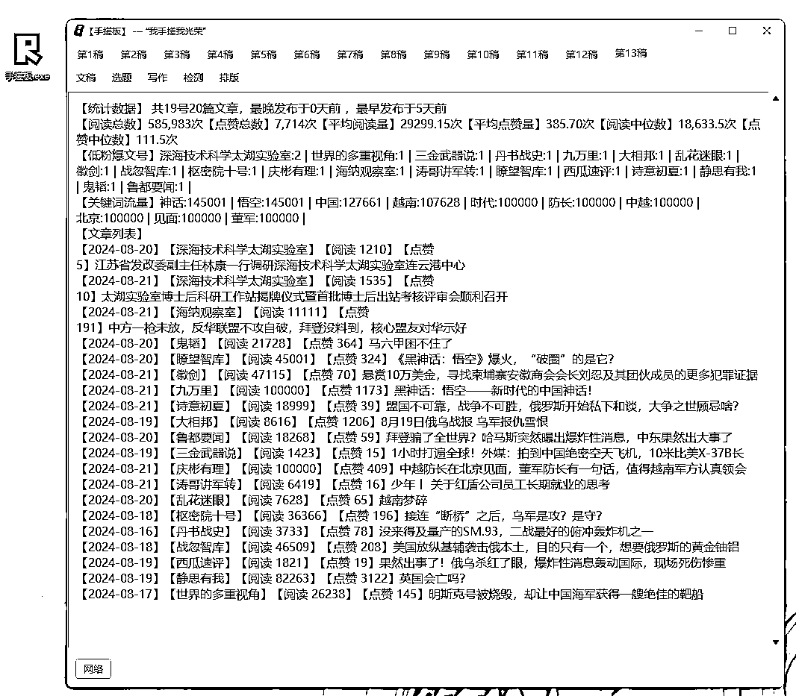

## 2、关于入池

对新手，找定位真的很难

从自身出发，有什么写什么

看到什么写什么

没有刻意练习写某一类文章

账号一直没流量

这种情况很常见

实质就是账号没打上标签

这里介绍一下公众号的推荐机制

推荐算法做得比较好的是今日头条与抖音

最大特色就是猜你喜欢

看过同类文章的人还会再看

所谓物以类聚人以群分

不断开发你的分类，不断推送同类爱看的小姐姐给你

这些背后基于庞大的标签体系

即使同一个属性可能都有多个标签

例如性别也能有好几十个标签

文章也会因为某些人看了打上文章标签

人也会因为看了某些文章打上人群标签

计算文章标签与人群标签的相似度，然后排序

最匹配的放在最前面

这就是推荐机制

所以你要考虑的问题是：

第一、账号要打什么标签

第二、文章给打了什么标签的人看

第三、怎么让带着XX标签的人看你的文章

打标签的过程很漫长，打上了也就是所谓“入池”

系统知道要推荐给谁，你的文章会出现在推荐的第一屏

推荐流量就有了

这个流量挂广告能直接变现

这就是公众号爆文项目的原理

10W以上的阅读量能赚到几千块

通过【分析账号】评估账号是否赚钱

判断这个赛道对标是谁

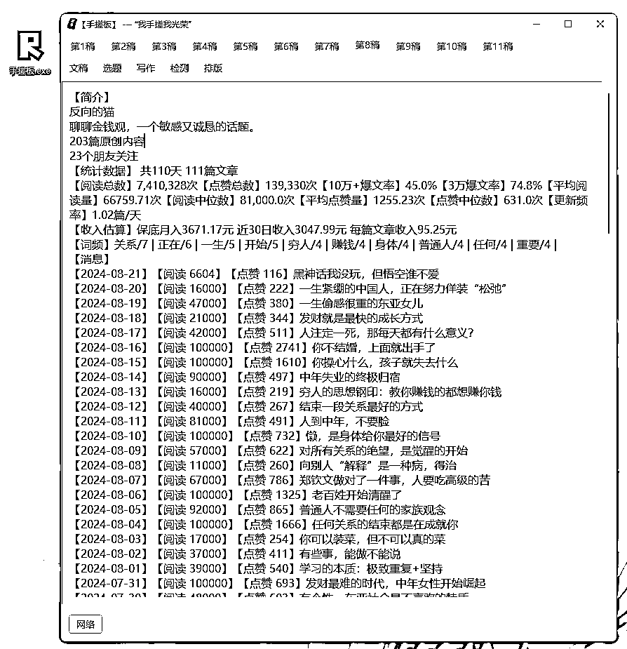

## 3、最火爆的文章类型

给大家介绍目前微信公众号最受欢迎的最典型的文章类型。

有四大类，分别

1、干货教程型

2、人物故事型

3、情感表达型

4、观点论述型

可以这么说，只要好好的掌握这四种文章类型，就掌握了80%公众号写作的秘诀

那你要掌握它，你当然就首先要了解它。

下面呢，我就详细给大家介绍一下这四种典型的文章类型。

第一种叫干货教程型。

干货教程型的文章呢，指的是以传授一些实际操作的方法，技巧和事情处理的一些方式。

因为是直接教读者一些方法和技巧，它其实是非常有价值，有意义的一件事情，你能够把价值传递给读者。

读者对你的感激和信任程度就会快速提升，所以呢，它是非常有利于提高读者粘性的，这就是干货教程文章的优点。

同时呢，它也会有一些缺点。

比方说，相对枯燥无味，既然我都说是干货教程了，那它必然专业性就会比一般的文章要高。

所以阅读起来呢，必然是相对枯燥一点的。

第二种叫人物故事型。

指的是以某个人物为核心，比较详细的介绍他经历过的一些事，当然里面可能还会融入作者的一些评论，这样子的一个类型的文章。

我列了一些标题，比方说《消失的范冰冰》，《小燕子的富豪梦》《教师马云的前半生》这些都是写人物的。

主要有一大优点，保底阅读量，也就是说写人物故事一般都会在同样的一个平台发表，阅读量都会比干货教程类的要好

为什么？

因为我们人天生就喜欢看故事，对吧？

看故事当然比学习，也就是看那个教程型的文章要愉快多了。

第三种叫情感表达型

它一般通过一些故事和少量的观点，

往往以写男女情侣之间的爱情为主的一类文章

原因在于微信公众号目前主流的读者还是以女性为主，大概有百分之70到80%左右都是女性。

而女性感兴趣的主题中呢，情感是最大的一个分类，所以但凡是情感类的文章。

女性点开的欲望相对都会比较强烈，特别是如果你文章中的观点啊，倾向于支持女性时。

就更容易引发读者的共鸣和支持，他们从而就会转发作为一种对自己观点。

第四种是观点论述型，阅读量是最容易爆的。

也是本帖的重点

观点论述型的文章指的是根据一个人一件事，或者说若干个人若干件事。

去发表自己的观点，并且呢，从逻辑上，事实上进行相关论述的这样一种类型的文章，

是整个公众号平台里面最普遍，最流行，数量最多的一类型的文章，大部分公众号爆文可能有超过80%都属于这一类型的文章。

因为他是一定有明确的观点和价值观的传递的，那这样子呢，就很容易引发读者在情绪上的反应，

这种情绪上的反应一般有两种情况，

要么是强烈的反动和厌恶

要么是强烈的认同和共鸣，那不管你是反对还是认同？

其实都很容易引起读者的转发传播，他转发要么是为了表示批判，要么是为了支持嘛，对吧？

而对新媒体写作者来说，传播是非常非常重要的，你的文章能广泛传播出去。

如何分析一篇观点论述文章

举个例子

首先找一篇爆文，复制到手搓板，点击【梳理文稿】

然后文章太长，利用AI快速阅读并分析，点击【阅读理解】

不到2分钟，了解爆文的观点与论述结构

最重要的是，这篇文章的分论点与论据就能据为己有，为你所用

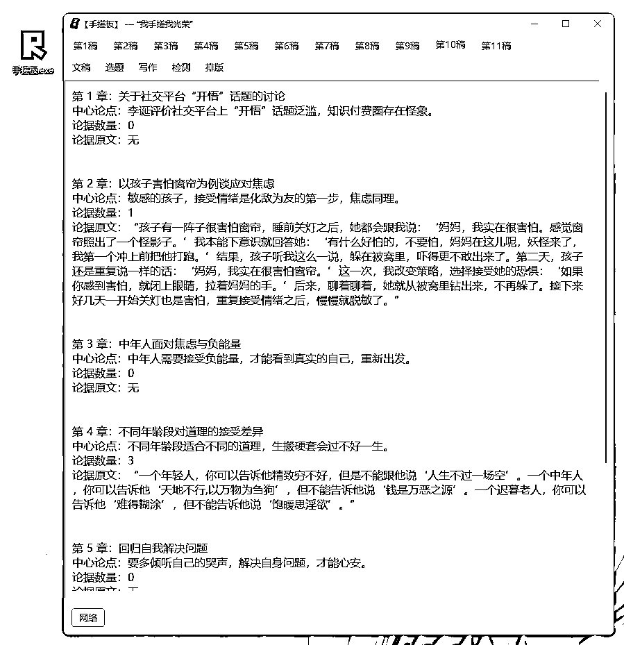

## 4、如何选题

选题分两类，时效类与非时效类

时效类就是新闻热点，必须赶紧写，慢了没有流量

非时效类就是历史、情感之类的，有些话题是历久不衰，或称老生常谈

但就是有流量，爆过还是会爆

我们这里重点聊时效类

对于时效，我们要聊到流量模型

一个话题从发生到高潮到遗忘，是有一个生命周期

记者会放出来新闻稿为开端，那是纯纯的素材

每分每秒都有可能出现，而且不是每个素材都能爆，需要时间考验

经过一段时间，产生了阅读，点赞相关数据，素材成为了话题

话题形成了基本观点

阅读量逐渐发生了异常值，然后平台抓到了放上榜

这时候一大波自媒体涌上来，文章数激增，流量会被大号瓜分，阅读需求被满足

慢慢地供过于求

平台会集中流量到某几篇，变成热点

到某个阀值话题就停止推荐，忽然在榜单消失

如图

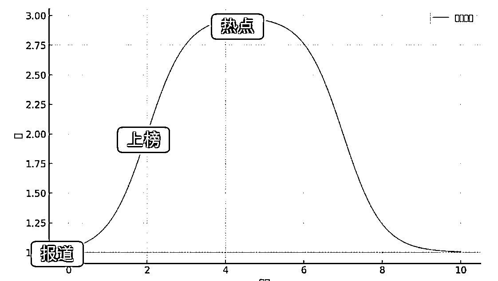

在第一阶段，我们用【实时监控】，

他的作用是监控对标账号当天文章

重点关注流量增量，即流速=阅读量/当前时间-发布时间

流速越高，流量越猛

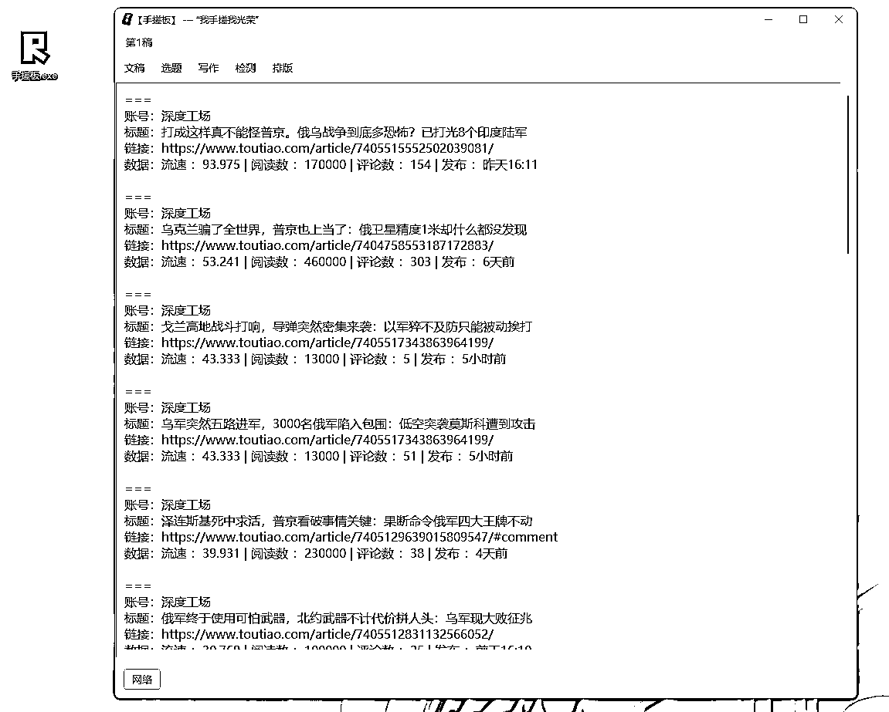

由于每天产生上万条新闻，上榜的就1000条，最终成为热点就几个

热点不是天天有，从上万条新闻中抓到热点的概率，与中彩票无异

热点更像是一种BUFF，用来蹭就好了

最好进场的时机在哪？

## 5、如何找观点

观点论述型文章能不能爆，主要看观点

够不够犀利

够不够新颖

够不够吸睛

如何找观点？通过问题找观点

问题才可以刺激你大脑动起来

如果你只盯着一个话题，例如老龄化

你是没话可说的

但是你提出一些问题，例如“老龄化是怎么导致的”“老龄化有什么危害”“怎么解决老龄化问题”

这样是不是你的论点很好找

通过【搜索议题】能推荐一些你问题，你只要提出回复

那个回复就是你的观点

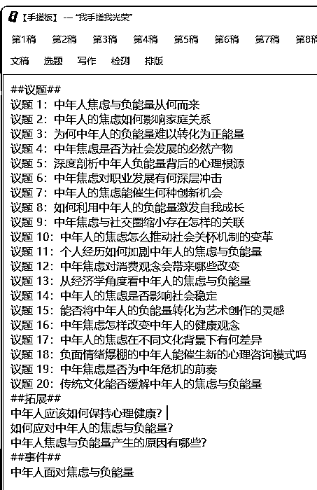

## 6、如何有深度

我们在写议论文的时候

就是在讲理由，论证“为什么论点是正确的”

一般逻辑分为并列关系、递进关系

并列就是同一个层面的分论点，例如个人社会国家，本质是同一层面

递进就是由低层面到高层面的推进

层面分共分六层

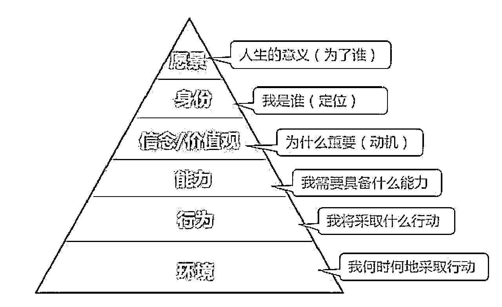

第一层，环境，类似一种甩锅的逻辑

你的归因是身边周围的人事物

例如，考试挂科，原因是旁边的人老咳嗽，监考老师总盯着我，我的笔颜色不对劲

这种理由最低级，怨妇思维，方法论就是换个环境问题就解决了

第二层，行为，干不好的原因是练得不够多，不够努力

方法论是多做，疯狂堆积时间

第三层，能力，归因是自己不够强，包含技能、思维、情绪，全都是能力

有了能力，就能选择更好的方案

第四层，信念，从这里开始，会偏主观唯心主义

信念就是价值观排序，看待大部分事物时候用一把尺去度量

哪个重要哪个不太重要

做事有一定行为准则

第五层，身份，身份决定信念

你的身份，所谓的社会地位，职业角色

你是商家，你必然是趋利，肯定把利润放在前面

你是买家，你必然是求价美物廉的好产品，把性价比放在前面

第六层，精神，能想到这层，基本是伟人

思考到人生的目的，说白了，大家都是凡人

人一般两种情况才真正的思考人生

1、遇上战争与疫情，危及到人生安全的时候

2、摆烂到无所事事，无聊发慌的时候才会思考人为什么活着

所以文章想要有深度，就不能在同一层面去论述

要找更高级层面的理由给文章来一波升华

但我们都是普通人，哪里领悟到高级层面的思考

通过【归因分析】就能做到

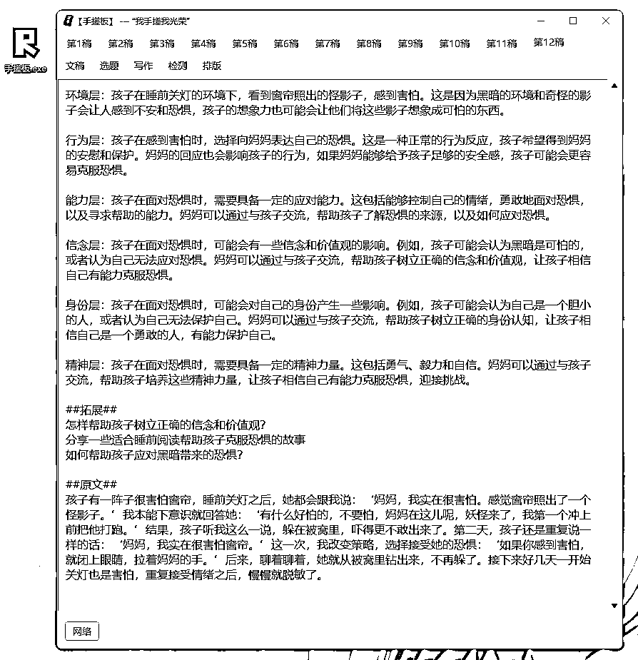

## 7、如何写标题

标题需要过滤人群

标题需要提高点击率

如果一篇文章要写1小时

标题需要花半小时才合理

满足以下三点才算合格的标题

第一，标题不要直给

标题可以是问题可以是问题+答案

但如果通过标题都猜到解题思路的话，读者不会点开文章

所以标题与封面都是钩子

第二，标题要含关键词或热词

热词用来蹭的

关键词用来锁定人群

人眼在刷屏的时候，其实只看到词

句子是屏幕停止才看完的

为什么停下滚屏呢，由于命中了某些词

第三，符合开幕雷击

不知道什么是开幕雷击请看手册

七个元素能带就带，好使

如果不知道怎么写，用【AI标题】功能让AI按开幕雷击方式修改标题

但是最好还是直接沿用原标题

因为原标题是经过市场验证的好产品

保留主句式，换其他动词形容词，这不算抄袭

【AI同义词】是最省力省心的办法

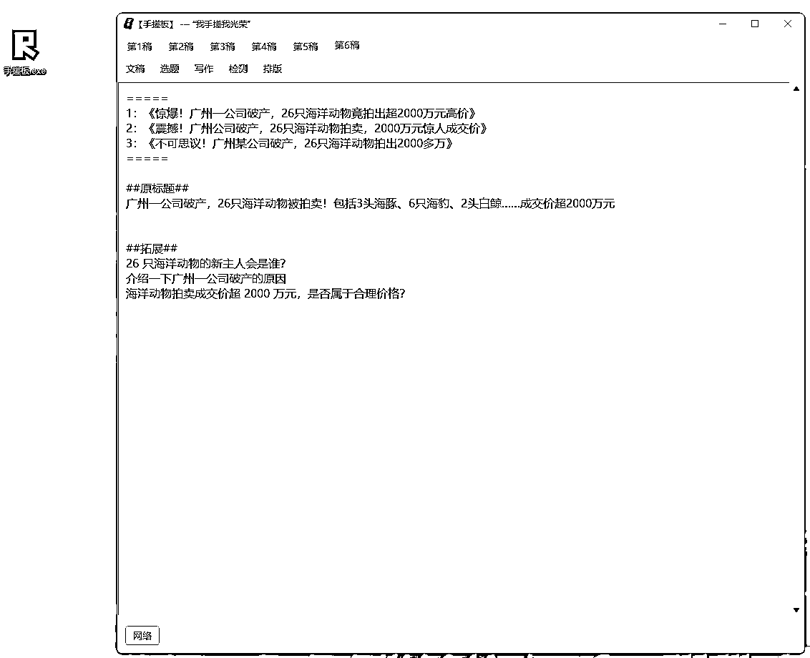

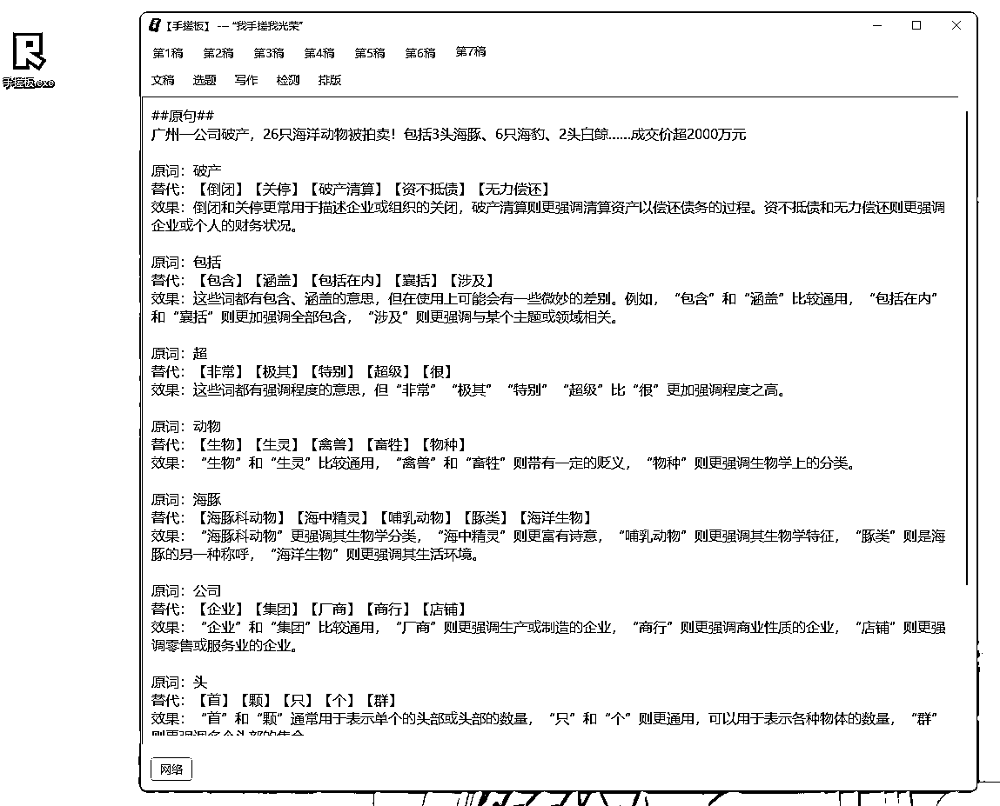

## 9、如何写正文

写正文就最简单的步骤

一般会遇到这几种情况

1、没有素材

使用【搜索新闻】

可以直接找20篇新闻给你

都是最新发布的文章

包含了标题，简介，链接

如果素材是来自抖音视频

选中整条链接点击使用【抓取链接】

软件会把视频语音转成文案

2、没有配图

使用【搜索配图】

可以直接找20张图片给你

而且是没有版权的

如果还不满意

使用【AI生图】

输入一段描述让AI生成对应的图片

3、没有案例

使用【搜索例子】

让AI去书籍、电影、电视剧里面找符合你要求的例子

虽然读书少，也不妨碍你丢书包

4、没有金句

使用【搜索金句】

只要提供一句话或一个词

让AI去找合适的名言名句，作者与这句话的释义

就是不怕套用错了，闹笑话

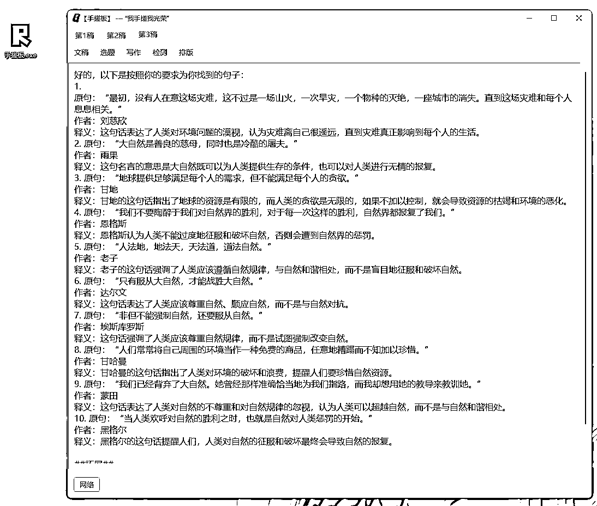

## 10、关于原创

本质就是如何把素材变成自己的文字

这里有一系列工具，方法就是脱了再穿上

第一步，【AI简写】，作用是去掉所有副词，还原文字最原始的样子

等于把衣服都全脱了

第二步，【AI细节】，作用是在句子中增加副词形容词，用于动作，让描述更加细致

等于脱光后再给穿上衣服

第三步，【AI比喻】，作用是把形容词进一步拓展，用比喻的手法更加形象

等于在衣服上面雕花

一套操作下来，原创度不低于70%

我们有【查原创度】的功能

把原创度低的词标黄，直接【AI简写】就好了，不用整篇修改

## 11、如何写出情绪

情绪背后就是身份

不同职业，不同身份，不同价值观，不同视角

带有不同感情色彩

我们通过素材中最具感情色彩的一句

通过【AI纲领】生成一段特定的提示词

配合我训练过的大模型

把素材变成一篇文章

一套操作下来，原创度不低于80%

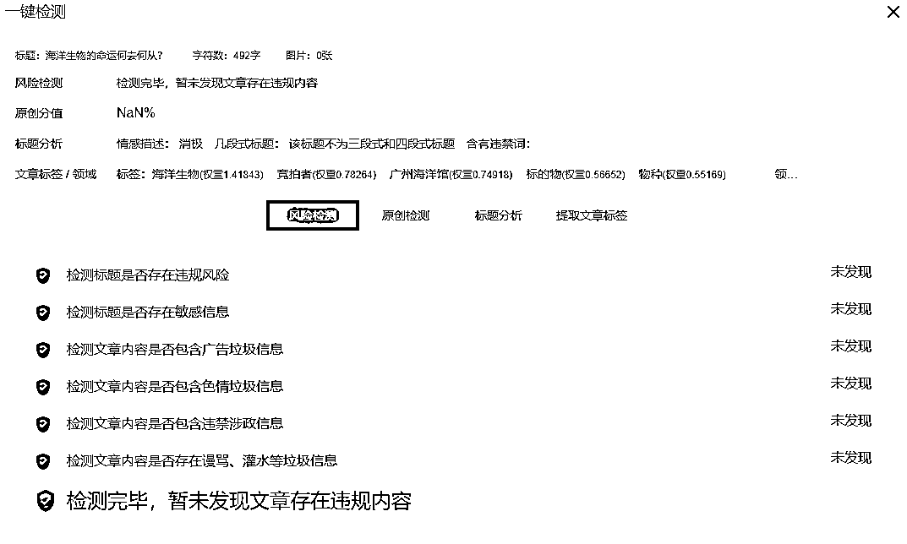

## 12、如何写出风格

所谓风格，本质就是一套固定的范式

要告诉AI你需要什么风格先投喂一篇文章

通过【分析风格】得出这篇的范式

配合我训练过的大模型

改写另一篇文章，例如董宇辉的小作文

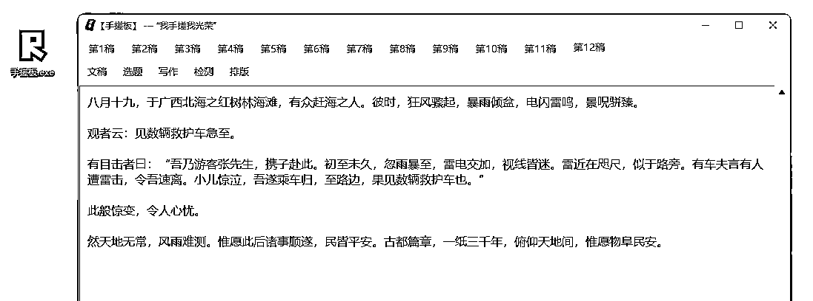

## 13、如何减少AI味道

AI味道不是某几个词

AI味道是词与词之间的关联的特征

所以切除某个词是最直接去AI的方法

但这方法会损失阅读体验

句子读不通畅了

所以建议用【AI简写】方式去减少AI

尽量用最少的词去表达

如果检测AI味百分比高于20%

证明AI味太重了 可能需要重新生成一篇

我们有【查AI含量】的功能

把高AI含量的词标黄，直接【AI简写】就好了，不用整篇修改

## 14、如何减少违规

主要是文章中带有敏感字

系统降低了权重

敏感字和违规词还挺多的

为什么没有流量，因为有些文章微信不敢推啊

尤其那些政治敏感的词

这些敏感字可以通过【查违规词】

检索出来并高亮

通过【去违规词】把词转成拼音规避风险

## 15、如何配图

生成文章后，需要配上图片

图片要过原创

本质上就是修改MD5值

然后把图片放到云床上

最终生成这行文字markdown格式

（markdown格式文字就能生成带样式的网页代码）

有三种方法：

1、插入本地图片

2、抓取网络图片

3、AI生图

## 16、如何发布

以前为了漂亮硬着头皮用XXX编辑器

现在markdown格式编辑器

可以在本文里面加符号

就可以直接转化成代有样式的网页

省掉好多设计时间

【一句一行】与【一逗一行】是顾名思义即使把文章分割

比较符合手机阅读的排

选中某个词可以加粗、备注、斜体、中划线

选中某行字可以加粗、设置为标题、引用、列表

其中可以智能识别金额与日期，进行加粗

完成排版后点击【排版浏览器】

可以看到最终效果

通过【样式】修改字体大小与主题颜色

最后复制到公众号发布页面

发头条更加简单【导出WORD】

进入头条发布页，导入文件

文字与样式都与手搓板一致

## 最后

看到各大平台在打击AI洗稿

其实是好事

作为开发者

不希望AI工具停留低端抄袭

AI应该有更大生产力

AI应该有更深的思考

人脑里有矿，思想是原油

AI是不知疲惫的油田工

目前，我们能做到的，把原本手搓2小时，优化到手搓10分钟

后续会继续优化，吸收新认知然后熔到手搓板里

希望手搓流可以给您启发

有所启发的

欢迎来链接我哦