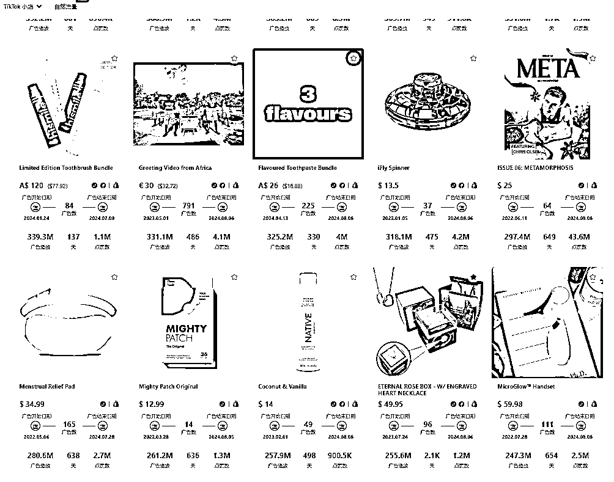

# 解锁TikTok广告的成功秘诀，这八个关键技巧，你必须要收下！

> 来源：[https://za6kyadmdr.feishu.cn/docx/DAjsdxrhkoaBckxCX8Rc7Y3qnPb](https://za6kyadmdr.feishu.cn/docx/DAjsdxrhkoaBckxCX8Rc7Y3qnPb)

### 部分TikTok用户一直被各种广告和强行推广淹没，感到疲惫不堪。现在，他们转向了一种新的生活方式：只购买和使用真正需要的东西。这种趋势被称为“低消费核心”，用户在选择产品时，更加关注其实用性和性价比。

### PipiAds观察：解锁TikTok广告的成功秘诀

在过去几个月里，我们通过PipiAds对TikTok上的热门广告进行了深入观察。我们发现，成功的广告不仅仅依赖于精美的制作，更重要的是内容的创意原生感。这些广告之所以能够引发大量互动和购买，是因为它们看起来不像广告，而更像是日常生活的一部分。那么，如何才能让你的视频也具备这样的吸引力呢？

### 如何提升TikTok视频的创意原生感

你是否辛苦拍摄了一星期，播放量停滞在200-300？观众匆匆而过，没有互动，更别提关注了，又或者投放广告时，很多素材不管怎么测试都不出单，绞劲脑汁也想不明白素材到底哪里不好。如果你也有这样的困扰，也许你需要的不是更多的拍摄时间，而是提升你的视频原生感。本篇文章将为你详细介绍提升视频创意原生感的8个关键点，让你在家中也能拍出引人入胜的TikTok短视频。

### 什么是创意原生感？

想象一下，当观众看到你的视频时，他们会不会觉得这是他们生活的一部分？创意原生感就是让观众感觉你的内容就像是他们日常生活的一部分，从而建立信任感和亲切感。你不需要流利的英语或丰富的海外生活经验，只需要掌握一些关键技巧，就能在家中创造出具有原生感的TikTok视频。

### 营销的本质是什么？

你是否曾思考过，为什么你的营销素材总是达不到预期效果？这可能是因为你的营销思路存在问题。

营销的本质在于深刻理解用户需求，创造并传递价值。有效的营销不是简单地推销产品，而是要让用户感觉到你所提供的正是他们所需要的。换句话说，营销的核心是与用户建立联系，通过内容传递有意义的信息，从而引发他们的兴趣和购买欲望。

### 关键技巧一：家居风格的统一性

曾经看过那些点击量爆棚的TikTok视频吗？大多数时候，它们的背景都透露出一种精心设计的家居风格。英美国家的家居风格通常以干净简约的北欧风格或自然色调为主的美式风格为主。

*   北欧风格：白色或淡色的背景墙，简约的花瓶和相框。

*   美式风格：红棕色的桌椅，搭配美拉德色系的靠垫和地毯。

没有条件复刻完整家居氛围？没问题！缩小拍摄场景，用拍摄背景板营造一个迷你的产品展示空间。

视频素材：搭配地毯营造舒适家居氛围感

https://www.pipiads.com/zh/product-search/662f2372932f5b1565344a62/

### 关键技巧二：色调的统一性

你是否注意到，有些视频让人一眼就喜欢上了？这背后可能是色调的功劳。色调的统一性是吸引并留住用户眼球的关键。欧美用户对用色非常包容，从美拉德色系到多巴胺色系，再到莫兰迪色系，都能找到欣赏者。然而，视频色调不仅要在单支视频内保持一致，整个账号的整体风格统一也非常重要。

*   单支视频：确保每个视频的色调一致，增强视觉吸引力。

*   整体账号：保持账号内所有视频的色调一致，便于算法精准推送给喜欢该色系的用户。 视频素材：莫兰迪色系卫衣搭配纯色背景 给人休闲舒适的感觉

https://www.pipiads.com/zh/product-search/63f6722d009def6f07602051/

### 关键技巧三：自然光线的运用

试想一下，一个明亮的房间，阳光洒在桌面上，观众会不会更喜欢这样的画面？优质画面离不开考究的灯光。国外用户更喜欢自然的光线，如明媚的阳光、柔和的家居自然光以及卧室内温馨的氛围灯。

*   自然光线：尽量利用自然光源，避免使用过多人工光源，保持画面的自然感。

*   简单打光：无需复杂的打光设备，只需确保光线柔和自然。 视频素材：户外拍摄 主要依靠太阳光 场景自然

https://www.pipiads.com/zh/product-search/64be9c203df80804d2ec06f4/

### 关键技巧四：简约的构图

你是否觉得有些视频看着就很舒服，而另一些则让人眼花缭乱？这可能是构图的差异。构图是容易被忽视的问题。国内视频拍摄常用各种小道具填满画面，但这会导致观众的视觉焦点模糊，增加观看疲劳。国外用户更喜欢简约、有层次感的画面，这样能更好地集中视觉焦点，增加沉浸感。

*   九宫格构图：在正式拍摄前，打开手机相机的九宫格，研究画面布图，为置景做减法，确保画面简洁有层次。 视频素材：背景虚化色调统一 突出产品主体

https://www.pipiads.com/zh/product-search/6267c69e3a879868acadfc1f/

### 关键技巧五：节奏的掌控

你有没有发现，节奏感强的视频总是更吸引人？快节奏的切换是吸引观众注意力的关键。TikTok上的内容通常需要在短时间内快速传递信息。

*   快节奏切换：每2到3秒切换一个镜头，保持观众的注意力。

*   卡点创意：利用音乐节奏来进行画面的切换，使视频更具动感和趣味性。 视频素材：根据音乐特效转换动作场景 吸引用户注意力

https://www.pipiads.com/zh/product-search/654ebc4f93328758adca370b/

### 关键技巧六：音乐的选择

音乐是视频的灵魂。一首好音乐能让你的视频脱颖而出。在TikTok上，音乐不仅是背景音，更是吸引观众的重要元素。

*   热门音乐：选择当前热门的外网音乐，避免使用国内音乐以免面临版权问题和文化不适。

*   音乐节奏：确保视频的画面切换与音乐节拍同步，增强观众的沉浸感。

视频素材：摇滚音乐搭配复古T 符合产品表达主题

https://www.pipiads.com/zh/product-search/6501ac78b34701042759783c/

### 关键技巧七：视角的固定

你是否因为频繁切换视角而感到眼花缭乱？频繁切换视角会让观众感到疲劳，影响观看体验。

*   固定视角：选择一个固定的视角进行拍摄，保持叙事的连贯性。

*   信息流畅：确保视频内容在固定视角下能够清晰传达，不让观众因为视角频繁变化而错过重要信息。 视频素材：拍摄一镜到底全程固定机位 可以更好地传达产品细节

https://www.pipiads.com/zh/product-search/653188a99b9ebe51251b07c8/

### 关键技巧八：简化机位

有时候，简单就是美。多机位拍摄会降低视频的连贯性和节奏感。

*   简化机位：尽量使用一到两个机位，保持画面的简洁性和连贯性。

*   统一性：确保每段视频的机位和视角一致，避免多机位带来的混乱。

视频素材：根据颜色变换中近景视角切换 展示产品更直观

https://www.pipiads.com/zh/product-search/6267cc7b3a879868acae0bfa/

内容是做TikTok的核心，一个专业的团队，本质上是可以持续迭代优质素材创意来快速获取流量的。

通过PiPiADS，你可以快速的浏览全世界的广告，站在巨人的肩膀上获取成功。