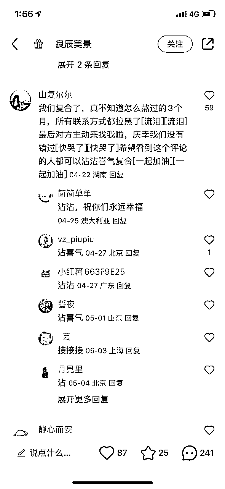

# 一天在小红书快速铺1000篇笔记的方法

> 来源：[https://thctbhym4b.feishu.cn/docx/DjkXdDB0ionwItxHgpbc1QmGnTb](https://thctbhym4b.feishu.cn/docx/DjkXdDB0ionwItxHgpbc1QmGnTb)

大家好，我是鹏哥！

有许多伙伴想在小红书铺笔记，但手头没有那么多账号，也不想要搭建复杂的矩阵运营，又想快速发超级多的笔记，在小红书上宣传自己的产品，要怎么办？

看完这篇文章小白都可以直接去实操了！

1篇文章可以引流2个客户，1000篇文章是不是可以引流2000个客户？

那要怎么快速发布这么多文章？

答案就是我今天要分享的是用素人代发模式！

找足够多的人帮忙发，用钱和有效方法，快速规模化铺稿。

我们自己做了很多分发，超过了上万条小红书代发帖，快速导流了2万多微信好友，也接过一些分发业务，小红书和抖音、视频号都有。

今天梳理一下这套打法的基本逻辑，以及想要这么操作的朋友可以借鉴的sop；

代发适用于各个平台，但是并非适用所有的行业。

铺稿适用两种预期，一个是获客，一个是种草。

种草相对来说是比较简单的，只要铺上去，算曝光就好了。

获客的话，就稍微复杂一点，因为涉及到了引流操作，引流是整个流程的关键环节。

# 1、考虑要不要做分发，先解决以下几个前提：

目标客户的需求是否清晰，需求是否足够硬，只有需求明确且强劲，才好用分发的方式做引流转化。分发通常都是素人号，愿意听素人介绍分享的，才能适用；

爆款脚本模版有没有测出来？因为分发从一开始就是花钱的事情，等同于投流。所以在开始之前，最好是自己有爆款脚本模版，自己已经测出来的，这样分发的成本才能足够低。

分发出去之后，引流sop是否顺畅？一定要记得，分发用的是别人的账号，这些账号不在你的手上，这就意味着你的把控力其实很弱。

对于兼职来说，代发很可能只是一次性交易，转眼就删掉了。

## 所以，做分发需要核心解决的几个问题：

素材生产能不能批量化？

能不能批量找到愿意代发的兼职？

代发用的是其他人的账号，你的引流模式是否能够跑通？

是A种B收？还是付费激励代发兼职协助引流？

如何尽量延迟兼职删除动作的发生时间？

# 2、代发落地流程要怎么做？

首先肯定是准备好爆款的内容制作脚本，快速产内容的方式，有两种，一种是让代发的人，做内容然后发，另一种是我们自己做好内容，再给代发去发。

两种方式的成本会有不同，内容审核流程也不同。

我们自己一般都是采取第二种的优化方式，分成两个环节，这样可以让内容生产质量更好把控。

并且要明白做内容的人，和做代发的人，本质上也是两类人。

当然现在做内容，也可以借助于AI，那就变得很容易了，多刷几次提示词，多调整出合适的，后续产内容，嘎嘎容易。

其次是把内容都放到共享文档，排好序，方便代发人员去拿。

跟代发都讲好，每个人，拿一份材料，拿完在表格上打1，然后发布完，再把链接放到对应素材同一列。

代发操作完，在群里打1，这样方便后续核对，当然还要在文档中留下自己对应微信号，这样才能找对人。

内容--文档--拿材料--发布留链接--核对--结算

流程讲起来都很简单，主要还是看执行层面。

当然，我们最近也在开发兼职分发系统，从作品检测、兼职管理、结账管理都已经提上日程，估计很快能和大家见面！

# 3.怎么尽量拉长发布链接的有效时间？

有些代发会结算完就删掉，这个很常见，小钱而已，你怎么叮咛嘱咐都没有用，结算完那一刻交易其实已经完成了。

所以核心是算概率，以及增加一些小投入去拉长它，什么小投入呢，就是设立激励门槛，比如多少小眼睛，多少点赞藏，就多给5元，10元，帮忙引流客资，一个5元或者10元具体根据项目需求成本效益，进行设定价格激励区间。

我们之前通过按照增加小眼睛数，多给钱的方式，两个月内基本有90%的链接都还在。

作为投放的人来说，你要算的，还是概率，主要是算账能力。

# 4.还有哪些关键动作需要做？

流程sop肯定要先准备好，对接话术，结算话术，检查次数等，都要先做好设计，对接兼职代发的时候，一定要讲清楚你是谁，你是干什么的，需要他们做什么，能拿到多少钱，一开始就要讲清楚这个很重要！

严重影响代发转化率。

结算要及时，不要想着几块钱的事情，还要拖着人家几天，甚至一星期啥的，没有必要，不然很多人都不会做。

另外就是，动作一定要简练，不要繁琐。

对于兼职来说，就是几块钱的事情，所以你千万不要想着让对方动脑子，只要肯动小手指就很不错了。

# 5.去哪里找代发粉？

要么自己去打，比如去小红书打粉，去Boss直聘引流，去大学生社群引流。

要么就去买，买的话，目前价格基本就是2-5元之间

小红书上这类兼职一搜一大堆，可以评论区截流，我们最多的时候，一条评论截流了将近500人

Boss直聘也可以引流兼职粉，但是很费号，而且不可逆，虽然目前来看Boss直聘来得是质量最好，也是最容易的。最多的时候，一天有800多招呼，引流了400多人。但是号很快就没了

也有人甚至去Soul引流，解决账号问题，引流模式基本差不多，嘎嘎进粉，偏年轻。

总的来说，打兼职粉，打创业粉，都是废号流。

不要在意号被封了，算好账，值得，就继续换号继续搞流量就好了。

具体引流技巧，其实也不难，回头整理sop分享给大家；

# 6.代发最麻烦的就是引流

对于获客铺稿来说，引流肯定是重要的，直接对整个规划起到关键作用，动作再多投入再多，没有引流到客户，也都是白搭。

因为账号不在自己手上，而代发兼职赚几块钱的事情，很难有积极性帮你去做引流，哪怕你设置了奖励引流一个给3元、5元、甚至10元，效果都很难有多好。

所以更多人采取的是A种B收的法子，这个方法，简单讲就是利用非帖主的账号在评论区引流，引导大家私信，在私信过程中进行转化引导加微信的操作。

拆解这些操作细节，有很多有意思的地方。

比如，你不能直接上去就是硬广推荐，让帖主直接置顶。

这个太硬了，效果容易比较差。

但是很多人会觉得这是最快的方式，最快是最快，但效果不一定好。

我们要学会利用平台规则，在帖子只有两三个帖子的时候，就去留言，然后再用水军号去点赞以及叠加留言，把你的留言内容通过算法顶到最上面。因为哪条留言置顶在最上面，不是根据时间，是根据热度的，所以你只要让你放钩子的留言热度最高，就可以达到置顶的目的了。

还要用水军在你留言帖子上留言去求推荐， 要资料要链接啥的，营造一种很真实的感觉这样效果才会好。

其实就是留钩子但是这个钩子看起来又很自然真实，我截个图，以情感赛道为例（看下图）

只要做过截流，或者做过铺稿引流，其实看到这样的内容，都会第一时间警醒，这个是真的留言，还是构建出来的场景？

但是对于大部分用户，其实是看不真切的，更多人追风跟热闹心理，你要做引流，要做的就是抓住这个心理，才能完成。

以上就是A种B收的具体操作，A发帖，B在评论区引流，CDEFG在评论区帮忙带节奏。

有人就会问，没有那么多号怎么办？你不是有很多代发兼职吗，再给一些钱，让他们帮忙去评论区做一下评论，一条0.5或者1元不就行了。

* * *

以上就是这篇文章的所有内容了

这篇操作技术帖写的有点长了，看完小白都可以直接去实操了。

有啥不懂的，+V：w0222168 欢迎大家一起来交流