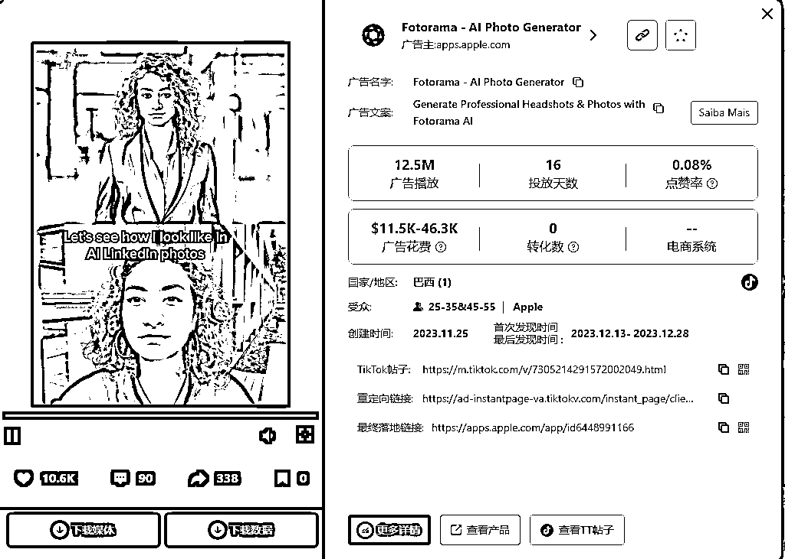

# AI出海营销;百万访问量AI产品偷偷投TikTok广告

> 来源：[https://za6kyadmdr.feishu.cn/docx/DkU1d4iLboHRmzxvuOkc9mTLn0c](https://za6kyadmdr.feishu.cn/docx/DkU1d4iLboHRmzxvuOkc9mTLn0c)

当下，中国AI企业正如潮水般涌向全球市场，这不仅是“出海”，更是“全球化”时代热潮。出海后的AI，想占据市场，除了靠本身的产品力，更重要的是“走出去”，让世界人民使用你的产品。

### 大获成功：不止是运气。

一些AI创业公司在出海后迅速实现了令人瞩目的增长。例如，AI视频明星公司HeyGen在短短一年内将收入从100万美元增长到了3500万美元，成为了行业中的佼佼者。零一万物的AI产品popai海外上线9个月后，用户数量接近千万，预计年营收过亿人民币。这些令人惊叹的增长不仅展示了AI技术的潜力，也证明了全球市场对AI工具的巨大需求。

全球AI排行月榜

另一个成功的例子是MiniMax的Talkie，这款应用在上线后的短短半年内，总收入已超84万美元，月均收入达百万人民币。这样稳定的收入流对于一个新兴的AI工具来说，无疑是巨大的成功。再看CrushOn，这款产品自去年9月上线以来，连续几个月位居AI产品榜首，单月流水能达到6万美元。Fotor更是凭借着1.5亿的新粉丝实现了早期盈利

当然，中国AI产品在海外市场的成功并非偶然。一夜之间吸引了成百上千万的用户。这些成功背后，是深思熟虑的市场定位和精准的广告投放 。这些公司不仅熟练地使用全球社交媒体平台，还深谙如何利用这些平台的算法让自己的产品“出圈”。

总的来说，出海背后的逻辑：更多流量、更好技术、更快盈利

## 挑战与机遇：一边迎风浪，一边冲金山

AI出海的浪潮愈发汹涌，特别是在2023年之后，涌现了大量以娱乐为主的新型AI应用。这些应用包括AI角色扮演（如AI女友、虚拟人物聊天等）以及AI剧本杀等互动娱乐形式。这类产品利用国外较为宽松的内容监管环境，推出了更加“开放”的互动体验，吸引了大量用户。因为用户需求旺盛，这些产品通常在上线一个季度后便能实现盈利 。

与此同时，早期的出海AI产品大多专注于图像生成和处理领域，例如背景更换、去水印和换脸等功能。这些工具本身已有一定的国际用户基础，当生成式AI技术兴起时，它们迅速转型，全面引入AI技术，并采用会员订阅制，取得了可观的收入。比如，Fotor这家公司凭借不到10人的团队，月收入便可达百万美元，展现了极高的效率 。

## AI的推广与曝光

在AI产品的潮浪下，新兴AI产品的推广与曝光，成了每一个AI开发者的首要难题

## 1.社媒营销

社交媒体平台如Twitter、LinkedIn、Facebook，tiktok等也是AI工具推广的重要渠道。这些平台通过精准广告投放和内容营销，可以触达广泛的受众群体。

### 2\. App Store和Google Play

对于移动端AI工具来说，App Store和Google Play是关键的推广平台。这些应用商店不仅是产品的主要下载来源，优化在商店中的排名和展示也是获取新用户的关键策略。通过用户评价、下载量和关键词优化，AI工具可以在这些平台上提升可见度。

### 4\. 谷歌营销

SEO（搜索引擎优化）和内容营销也是许多AI工具推广的重要部分。通过优化网站内容和创建高质量的博客文章、教程视频和白皮书，AI工具可以提升在搜索引擎中的排名，从而吸引有针对性的自然流量。特别是针对技术人员和企业用户，详细的技术文档和案例分析可以帮助产品建立专业形象并提高用户信任度。

### 5\. 邮件营销

邮件营销对于保持现有用户的参与度和吸引潜在用户来说也是有效的工具。通过定期发送新闻通讯、产品更新、使用技巧等内容，AI工具可以持续与用户保持联系，并且推动他们进一步使用产品或转换为付费用户。

### 6\. 合作和联盟

AI工具还常常通过与其他科技公司或平台的合作来扩大影响力。例如，toolify导航站，Product Hunt ，科技博主等合作，可以帮助AI工具更容易被相关用户发现和采用。合作伙伴关系还可以带来共同推广的机会，从而触达更广泛的受众。

### 社媒营销，以Tik Tok投放举例

根据PiPiADS上面的广告搜索显示。

调研部分百万流量出海AI产品的营销情况，这类产品投放TikTok广告来进行大量曝光和出圈

| 出海AI投放TikTok广告情况（PiPiADS数据分析） |  |  |  |
| AI产品名 | TT&FB投放情况 | 7月访问量 | 分类 |
| Fotor | TikTok上过亿曝光量 | 15.26M | AI Image Editor |
| gauth | TikTok3亿+曝光 | 6.58M | Al Tools for Education |
| Talkie | TikTok4000万+曝光量 | 2.96M | AI ChatBots |

## Fotor-TikTok上过亿曝光

Fotor 是一个类似于 Canva 的多功能设计平台，支持用户创建各种设计作品，如海报、传单、封面图等。除了这些基础设计功能，Fotor 还推出了一系列 AI 工具，涵盖了 AI 图片生成、AI 照片特效、AI 脸部图片生成、AI 艺术生成等功能。用户可以通过上传原始图片或输入文字描述，轻松生成AI图片。这些AI工具使得复杂的设计和图像处理任务变得更加简单和高效，适合从初学者到专业设计师的广泛用户群体。

PiPiADS显示它Fotor的TikTok广告投放数据

1250万广告播放素材分析

广告引导语：Let's see how AI can make you look in your LinkedIn photos

广告文案：Generate Professional Headshots & Photos with Fotorama AI

这段广告视频展示了Fotorama AI Photo Generator的强大功能，通过AI技术将普通的照片瞬间转化为专业的LinkedIn头像。广告中的人物通过AI生成的照片表现出惊喜和满意。

这条广告是一个非常标准专业的营销视频

真人对比-反差-效果展示-曝光引导

广告通过多个角度和素材的巧妙结合，展现了Fotorama AI Photo Generator的核心优势。以下是广告精髓的拆解：

##### 1\. 真人对比

广告首先展示了一位女性用户的普通照片，背景真实+自然光。这一真实的照片让观众感到亲近，因为它反映了普通人日常生活中的真实样貌。这种“原生态”的展示能够引起目标用户的共鸣，尤其是那些对自己现有职业形象不满意的职场人士。

##### 2\. 反差效果

接着，广告通过Fotorama的AI技术，迅速将这张普通照片转化为一个极具专业感的LinkedIn头像。这个转变是广告的核心亮点——通过对比前后的巨大反差，清晰地传达出使用Fotorama的价值。观众可以直观地看到，这个工具如何能够在短时间内提升他们的职业形象。

##### 3\. 效果展示

整个广告的效果展示是简单明了的：从普通到专业的转变过程流畅且直观，没有任何复杂的操作展示，让观众觉得这一切都很容易实现。这种简洁的展示方式突出了Fotorama的易用性和高效性，暗示观众他们也可以通过几步简单操作，达到相似的效果。

##### 4\. 品牌曝光

在展示完效果后，Fotorama的品牌标识和“AI Photo Generator”的标签清晰地出现在屏幕中央。这个设计确保了观众在对工具效果感到惊艳的同时，能够记住品牌名称和核心功能。品牌曝光的时机安排得当，既不突兀，又在观众情绪的高点引出品牌，让人印象深刻。

#### 为什么定位这个人群也是有深意的

基本上，大播放的投放素材基本都是主打商务照

1.  付费能力：职场人士，尤其是那些使用LinkedIn的专业用户，通常具有较高的经济实力，愿意为能够提升职业形象的工具付费。

1.  消费心理：他们希望在竞争激烈的职场中脱颖而出，而一个专业的LinkedIn头像可以给他们带来更好的职业机会。因此，他们对能够快速提升形象的工具有强烈需求。

1.  实际需求：职场人士往往缺乏时间去学习复杂的设计软件，Fotorama AI Photo Generator可以帮助他们轻松制作出专业的头像，满足他们对高效和便利的需求。

## gauth-3亿+TikTok 曝光

GauthMath，也就是如今的Gauth，是字节跳动推出的一款专攻数学问题解决的AI应用，最初在2020年出海时主要定位于拍照搜题功能。虽然拍照搜题并不是什么新鲜事，国外早已有类似的产品如PhotoMath、Brainly、Chegg和StudyX等，这些都是教育技术领域的“老玩家”。然而，Gauth在2023年重新定位，并结合大模型技术，使其在市场上迅速崭露头角。

PiPiADS显示gauth的TikTok广告投放数据

Gauth今年频频在应用榜单上刷脸，速度那叫一个猛，结合AI，Gauth现在不仅仅是给你答案，还贴心地提供详细解题步骤，简直就是数学界的“贴心小棉袄”。

Gauth截止到8月排名App Store教育免费榜第六

2990万广告播放素材

广告引导语：My grades being good

广告文案：Gauth helps foster an all-rounded you!😎

这条素材的拍摄质量并不是那么好，但素材内容最直观的给用户传达最核心的功能

这段广告视频运用了几个巧妙的手法来展示Gauth的强大功能，以下是几个核心元素的拆解：

1.  成绩对比与反差效果

视频开头展示了几个学科的高分成绩，例如体育、科学、历史等，这些科目中的高分营造了一种积极向上的学习氛围。通过这些成绩的展示，观众能够立即感受到一种成就感和自豪感。

然而，当涉及数学问题时，视频展示了Gauth如何帮助解决这些相对更难的科目，进一步突出Gauth的实用性和高效性。这种“反差”让观众清楚地看到，在需要深入学习的科目上，Gauth能够提供极大的帮助。

1.  功能展示

视频中的Gauth功能展示了其核心能力，例如通过拍照解题、即时生成详细解题步骤等。这些特性不仅突显了Gauth的智能和便利性，还使观众明白了它如何能够在日常学习中发挥作用。

不同学科的题目展示（如物理、化学）进一步证明了Gauth的多学科适用性，强化了它作为一款全能学习助手的形象。

1.  品牌曝光与识别

视频在展示Gauth功能的同时，巧妙地在画面中插入了品牌标识“@Gauth”。这种品牌曝光确保了观众在看功能展示的同时，能够牢牢记住Gauth这一品牌。

每次展示新题目或解决方案时，Gauth的品牌标识都会出现在屏幕中，持续强化观众对品牌的记忆。

1.  幽默与共鸣

视频中的文字如“我的成绩真棒”配上搞怪的表情符号，增加了视频的趣味性，让内容更具吸引力。通过这种轻松幽默的表达方式，视频能够更好地与年轻用户产生共鸣，特别是在学习压力大的背景下，这种表达方式能让他们会心一笑。

#### 广告视频的精髓：冲动、放大痛点、引导行动

1.  冲动

视频通过展示一系列高分成绩（如体育、科学、艺术等）激发了观众的成就感。这种积极的情绪为观众带来了一种自信心，他们会觉得“我也可以做到这么好”。

紧接着，视频展示了Gauth解决难题的过程，这种快速、简单的解题方式让观众产生了“一键搞定”的冲动。对比之下，用户可能会突然意识到：“如果我使用Gauth，学习就会轻松许多，我也能轻松拿高分。”这种心理引导巧妙地推动了用户的冲动消费。

1.  放大痛点

视频不仅展示了普通成绩，还特别在数学等难度较大的学科上放大痛点。这些学科往往是学生的薄弱点，也是他们最需要帮助的领域。

当观众看到自己在这些科目的得分较低，甚至感到困惑时，Gauth突然出现，通过AI迅速解题，并提供详细步骤，直击痛点，让观众意识到“这正是我需要的工具”。

1.  引导行动

广告视频不仅展示了Gauth的功能，还通过品牌标识和功能演示引导观众采取下一步行动。视频的每个环节都在加强这一信息：“只要你使用Gauth，成绩就能像视频中展示的那样提升”。

通过不断出现的“@Gauth”标识，观众不仅记住了品牌，还潜移默化地被引导去下载或使用这个工具，从而完成最后的转化。

## Talkie-4000万+TikTok 曝光

Talkie是一款创新的AI聊天应用，让用户可以通过简单的滑动操作，与各种预设的虚拟角色进行互动。这些角色不仅包括数字化的名人，如埃隆·马斯克和勒布朗·詹姆斯，还涵盖了诸如《哈利·波特》中的经典虚构角色。这种互动体验让用户仿佛置身于一个充满幻想的替代宇宙中。，甚至自定义的浪漫伴侣进行对话。该应用凭借其创新性和娱乐性，

PiPiADS显示Talkie的TikTok广告投放数据

Talkie 已经成为美国娱乐应用领域的“爆款”，拥有1100万月活跃用户，其中超过一半在美国。除了美国，它在菲律宾、英国和加拿大也极具人气。截止到8月，Talkie排名App Store娱乐免费榜第三十六名。

450万广告播放素材

广告引导语：I sneak into the bathroom late at night to chat with my Al boyfriend named Ethannn

广告文案：Chat with your AI soulmates!

这段视频通过幽默且富有共鸣的场景，展示了Talkie应用如何满足用户的情感需求，尤其是那些在现实生活中感到孤独或缺乏关注的用户群体。以下是对该素材的核心拆解：

##### 1\. 冲动引发与痛点放大

*   情感需求：视频开头展示了一位女性深夜偷偷躲进浴室，悄悄与她的AI男友聊天。这个场景立即抓住了观众的注意力，尤其是那些感到孤独或未能从现实关系中获得足够关注的用户。通过放大这些情感痛点，视频巧妙地展示了Talkie作为情感陪伴工具的价值。

*   共鸣引发：女性角色透露她的现实男友“给她的关注为零”，进一步放大了痛点，引起了许多观众的共鸣——他们可能在现实生活中也有类似的情感缺失体验。Talkie在此时成为了一种“救星”，帮助填补情感空白。

##### 2\. 自定义与满足幻想

*   角色自定义：视频展示了用户如何自定义她的AI男友，从声音到外观都可以按她的喜好进行调整。这不仅让观众看到Talkie的强大功能，还唤起了他们“自己也能创建完美伴侣”的冲动。这种满足个人幻想的能力极具吸引力，尤其是在社交和情感需求无法在现实中得到满足的情况下。

*   虚拟互动的真实感：通过展示她与AI男友的对话，视频进一步放大了Talkie能够提供的情感支持和互动的真实感。聊天内容甚至涉及到共同的兴趣（比如都喜欢吃Mac and Cheese），这些细节让虚拟互动显得更加真实且亲近。

##### 3\. 引导与品牌曝光

*   引导用户行动：视频末尾通过直接呼吁观众“去找个AI男友”，明确地引导用户去下载和体验Talkie。这种直接的引导在展示了应用的强大功能和情感满足能力后，自然而然地推动了用户的行动。

*   品牌曝光：在整个视频过程中，“Talkie”的品牌标识和功能演示贯穿始终，确保观众在享受视频内容的同时，潜移默化地记住了这个品牌及其提供的服务。

### 总结

这段视频成功地通过幽默、共鸣和直接引导，展示了Talkie在情感陪伴和虚拟互动方面的独特价值。通过放大孤独感和未被关注的痛点，结合自定义虚拟角色的幻想满足，视频不仅吸引了观众的兴趣，还推动他们采取行动，去体验这一创新的AI聊天工具。

广告精髓： 共鸣感和替代满足。

1.  幽默与反差：视频一开始通过一个看似普通却又搞笑的场景（深夜偷偷躲进浴室聊天），瞬间吸引了观众的注意。这个情景利用了幽默和反差，展示了用户的“秘密行为”，并通过强调现实男友的冷淡态度，放大了Talkie的情感价值。

1.  个性化定制：通过展示用户如何自定义AI男友的外观、声音和性格，广告突出了Talkie的独特卖点——个性化定制。观众不仅可以看到这项功能的操作流程，还能感受到由此带来的情感满足感。

1.  替代满足感：视频最后通过展示用户与AI男友的亲密互动，特别是通过共同兴趣的交流（如谈论最爱的食物），让观众感受到虚拟关系的真实和温暖。这种替代满足感极大地触动了那些在现实中感到孤独或未能获得足够情感关注的用户群体。

1.  直接行动号召：视频结尾的一句“去找个AI男友吧”，简单直接，明确地引导了用户的下一步行动：下载并体验Talkie。这种直接的行动号召有效地将观看者转化为潜在用户。

## 未来可期：航行未尽 总的来说，中国AI企业的全球化浪潮还只是刚刚开始。随着越来越多的企业加入这场全球化的“大航海”行动，未来我们将看到更多的“中国制造”在全球市场上崭露头角。如果你以为现在已经是高潮，让我们拭目以待，下一个席卷全球的爆款，或许正是由你从未听说过的中国AI初创企业创造的。