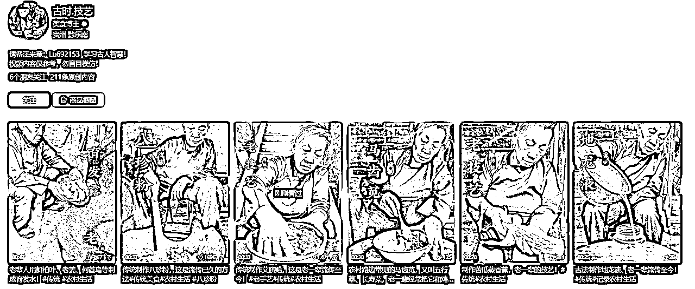

# 视频号赛道风向标：洞察行业动态，深扒账号背后爆火变现原因

> 来源：[https://lqhefhcsx54.feishu.cn/docx/FLAdd3At5o0D8JxxD1HcAT4Qnog](https://lqhefhcsx54.feishu.cn/docx/FLAdd3At5o0D8JxxD1HcAT4Qnog)

大家好，我是参加视频号风向标挖掘营的薄荷Heidi ，为期7天的视频号挖掘营刚刚结束，整理了郭晓文老师直播点评群内优秀拆解风向标的逐字稿。包含有

一、视频号还好做吗？

二、作业拆解的三要素

三、各类账号分析背后赚钱模式

四、晓文老师寄语

圈友参与110条风向标，优秀风向标30条，精选中标4条，优秀率27%。

很多小伙伴也在学着打开自己的眼界，学着用上帝的角度去全局搜集各类信息，扒出背后变现的原因，视频可复制的点可对标的点，给你们点赞！

希望这篇帖子也对视频号赛道小伙伴有用，感谢！

# 一、视频号还好做吗？

## 别着急给结论，你没看到，不代表不存在。

优点

1、视频号赛道风向标拆解很好的点：用你的眼睛自己去看，至少这步已经领先别人。

2、赛道没定，找对标难，把时间花在开天眼上，看到所有的一个视野，当你对这个视这个技能掌握得越熟悉，你开天眼的难度你看到更多东西的难度会下降。

3、随着你要做的领域确定了垂直下来，那么你的视野的范围可以更集中，聚焦在小部分里面，你不会一直要花那么长时间对标。

# 二、作业拆解三要素

三个点

## 我要怎么跟？

--我都要做什么东西？

--难度怎么样？

--我要付出什么代价？

## 我要不要跟？

--我要怎么赢？我感觉他也挺菜的，我能不能赢他呢？

--某个需求是确实存在，虽然不是我喜欢的需求，但是有人愿意为他付钱

## 我要怎么跟我这个同行？

--我感觉我跟不上，赢不了，或者是我觉得这个不大想做他那个方式，那我能不能另辟战场？

--下场后有没有可能我没看到的一些细节是致命的？

### 【声明】

再专业再详细的拆解也无法绝对的完整和准确。

没有被选中，不一定就是拆得不好，有可能你拆得晚。

### 【希望】

1、不希望大家懂得拆解后，非要追求[拆得非常细]我才现场做!

2、永远没有准备好的那一天，永远没有[你在岸上就看得很清楚了，下面有多少礁石，有多少困难，我大概要花多少时间]我才能确定性的我能赢.

3、拆解只是为了提高准确率成功率，不是让我绝对胜利，依然接受可能不成功的这个概率，多试错才能找到一个真正适合你的赛道，心理上要有底。

4、如果现在还没有一个对视频号清晰的认知，以及对我究竟该做哪个板块的内容有一个清晰的认知，那么建议大家还是去打卡群里面，每个圈友对标的都看一下。

# 三、账号分析

### 带💪🏻是晓文老师精选的账号

## 美食账号

### 楠哥美食记--拆解伙伴：คิดถึง李ྉ洪ྉ树ྉ

*   账号名：楠哥美食记

*   变现情况（如果可观测）：

*   整体变现情况：橱窗出单数据——销量2.3W，客单价9.9-19.9

*   近期变现情况：单场直播出单数据 or 记录两天橱窗销量差额100+

*   开通橱窗多长时间：2年

*   发了多少条视频：29

*   发布第一条视频的时间：23年10月29

*   每天发布视频的数量：0-1

*   如何引流

*   具体引流方式：直播

*   用什么吸引用户：

*   满足了用户的什么需求：满足了用户每天不知道吃什么，不知道怎么做菜，做菜不熟练，想要学习提升厨艺

*   怎么满足的：通过直播做菜＋讲解做菜方法步骤

*   如何转化？

*   具体的转化路径（直播间挂车成交

*   用什么来让用户愿意买单：

*   满足了用户的什么需求：满足用户做菜厨艺不精，做菜不好吃的需求

*   用什么产品/服务来满足的：用调味料，或是现成的食材，厨具

*   额外找5个以上同类型的账号：沈小厨教做菜，王二教做菜，李哥教做菜，美食探寻家，川妹子教做菜

点评

前期是公司摆拍，最近重启更新，结合菜谱加上带货内容，视频有挂车也有没挂车，核心是给大家提供的价值是怎么做菜，但是没有人设，只是菜谱，短视频流量高多为直播赋能的，直播还需要继续观察。

思考分析

1、它提供了什么价值？--日常做饭的需求。

2、账号为什么能够吸引人过来？--输出干货我给到大家解法。

3、变现效率可能并不高，具体有多少需要大家蹲直播间。

通过直播热卖数据，看单场变现多少钱，大概评估下面几个点：

（1）拍摄的成本怎么样？

（2）我能不能做出这么好的一个饭菜？

（3）我能不能拍出这么好看的一个效果？

（4）我要实现这个我的成本是多少？

（5）若厨师合作他的一个成本是多少？

然后去算一下这个账号两个点：

（1）大概一场播多少个小时？热卖中大概能卖多少钱？能赚多少钱？

（2）看商品橱窗每天的一个增长数据大概多少，扣去直播的数据，就能知道每天自然流量这些短视频能卖多少货，大概评估一下他赚多少钱。

若不赚钱，说明转化率低，白嫖的多。但是不代表转化低白嫖多这个赛道不好做，可以继续观察。

这就是拆解账号时，需要多找几个账号，对比为什么有的变现低有的变现好，为什么同样这个账号感觉画面都没什么问题，为什么有的流量好，就是流量低？

这个是大家要去思考的。

### 星星偷走睡意984--拆解伙伴：追风少年02

账号名：星星偷走睡意984

变现情况（如果可观测）：

整体变现情况：橱窗出单数据——销量3635

近期变现情况：

开通橱窗多长时间：3天

发了多少条视频：8

发布第一条视频的时间：2024-8-10

每天发布视频的数量：3条

如何引流

具体引流方式：短视频引流到开直播带货

用什么吸引用户：用炒虾的画面来吸引平时做饭下厨房的人群

满足了用户的什么需求：针对平时比较常见的炒虾这道菜，用酒店大厨的身份来介绍炒虾的做法，但是平时自己的白灼和炒虾味道一般，通过酒店大厨了解酒店的炒虾做法

怎么满足的：通过真人模拟酒店大厨身份，画面带有色香味俱全的炒虾视频画面，来表达菜色和味道

如何转化？

具体的转化路径：短视频流量爆了之后，通过开直播间挂车成交

用什么来让用户愿意买单：

满足了用户的什么需求： 满足用户对于平时自己炒虾可能味道一般，想通过学习酒店大厨的炒虾做法和比较好用的调味料来尝试提高自己的炒虾厨艺和味道

用什么产品/服务来满足：避风塘调味料包炒虾

额外找5个以上同类型的账号：

甜甜的家常菜 （2年108天。带货销量20000）

可可乐乐7969（开店113天 带货销量368）

粒粒吖123（开店4天 带货销量636）

开心果幺幺灵 （带货销量285 开店12天）

小花食谱（带货销量191天 卖了47件）

### 西施美食记--拆解伙伴：小白

• 账号名：西施美食记

• 变现情况（如果可观测）：开通橱窗 73 天，带货 11 万件

• 整体变现情况：按照客单 19.9核算 gmv不到 3 个月200万。

• 近期变现情况：最近两天橱窗销量差额 5000 单左右

• 开通橱窗多长时间：73 天

• 发了多少条视频：85 条

• 发布第一条视频的时间：2024 年 4 月 26 日

• 每天发布视频的数量：1

• 如何引流

• 具体引流方式：短视频带货不直播

。用什么吸引用户：在家就能做的应季美食

• 满足了用户的什么需求：有颜值看起来好吃的菜怎么制作

• 怎么满足的：通过开头美食成品的画面冲击做3 秒完播，原材料采购的价格做互动（目标用户会有意识的对比菜价），中间制作过程 1～2 次固定话术邀请互动。

• 如何转化？

•具体的转化路径：短视频挂车成交

• 用什么来让用户愿意买单：低价，对美食的诱惑

• 满足了用户的什么需求：在家就能制作干净卫生好吃的美食

• 用什么产品/服务来满足的：制作不同应季的菜品

• 额外找5个以上同类型的账号：同一家公司做了多个账号，林先生爱美食、雪梨爱美食、津津有味爱美食、依依美食厨房、梅子美食记

点评

不一定是抖音做得好视频号就一定做得好。

这个账号很有意思。

思考分析

1、账号跟之前的账号有什么区别？--[家人们注意喽，暑假千万不要让家里的小朋友去吃外面乱七八糟的烤肠了]结合当前大家的一个生活场景.

2、之前的账号只提供了什么信息？--有人把做饭视频当成解压视频来看，实际对于创作者来说泛流量变现价值没有意义。

3、这个账号还提供了什么？--[小孩在外面吃是不健康的，所以你要做现在某个节气到了，所以你要怎么样？]一开始用一些内容去把人群给圈定清楚。

4、真人出镜又提供了什么信息？--[告诉你，大棒骨买回来直接下锅炖，那就是大错]日常的饭菜司空见惯就说你做错了，吸引你对比收看。

5、同样需要有人去做，只不过加了表达的东西进去，加了我传递的信息更丰富，我传递的价值更高，那转化率提升的可不止一星半点。所以这个账号很有意思，可以持续关注。

### 杨家美食记--拆解伙伴：风雨

1.账号名：杨家美食记

2.变现情况（如果可观测）：

整体变现情况：橱窗出单数据——销量（跟买9671单，累积1万单），客单价（29.8--9.79元之间）

近期变现情况：单场直播出单数据 or 记录两天橱窗销量差额（9671-9754）一天卖出83单

开通橱窗多长时间：200+天

3.发了多少条视频：197条

4.发布第一条视频的时间：2023年11月9日

5.每天发布视频的数量：账号开始阶段每天1条视频，近期每天发布3-5条视频

6.如何引流

具体引流方式：短视频录制做菜视频

用什么吸引用户：家庭主妇、家里做饭的人

满足了用户的什么需求：视频播放家常菜的制作，步骤简单易学、色香味俱全，普通的食材，简单的操作步骤，就能做出好看美味的家常菜

怎么满足的：文字字幕、配音轻快的音乐和操作步骤，没有刻意做引流到橱窗

7.如何转化？

具体的转化路径（e.g. 流量主、短视频挂车成交、直播间挂车成交、橱窗成交、私域成交）采用橱窗挂商品成交

用什么来让用户愿意买单：简单易学的做菜视频吸引流量驻足观看，在简介里面加了一句引导下单的话术：视频同款产品在下方[商品橱窗]

满足了用户的什么需求：满足用户调料搭配菜品做出色香味俱全的需求

用什么产品/服务来满足的：调味品，如蒜泥蓉酱、豆豉、凉拌汁、剁椒酱等调料

8.额外找5个以上同类型的账号：

雪梨爱美食、萌妈爱美食、津津有味爱美食、小默爱美食、苏酥美食

### 💪🏻孩儿他姥姥A--拆解伙伴：悟风

账号名：孩儿他姥姥A

整体变现情况：橱窗出单数据——销量31.2W，客单价20

近期变现情况：8月7日短视频排行4，热力值7780

开通橱窗多长时间：1年60天

发了多少条视频：417条

发布第一条视频的时间：2023.5.31

每天发布视频的数量：1条

如何引流

具体引流方式：短视频挂车和橱窗

用什么吸引用户：心灵手巧的姥姥做美食

满足了用户的什么需求：家长不知道每天给成长发育的孩子做什么菜

怎么满足的：菜式好看又好吃，重点是营养丰富，而且简单易学

如何转化？

具体的转化路径：短视频挂车成交、橱窗成交

用什么来让用户愿意买单：用这个产品做出来的菜又好吃又有营养，不仅孩子可以补充营养，父母做起来也省事

满足了用户的什么需求：部分家庭做菜单调，孩子不爱吃

用什么产品/服务来满足的：海带，红糖，牛肋条，调料包等

额外找5个以上同类型的账号：

母女美食记：带货214天，带货销量818

雪吖超爱吃：带货1年37天，带货销量19.5W

乐乐美食&教做家常菜：带货159天，带货销量3091

佳味美食厨房：带货234天，带货销量5.8W

木子爱美食&每天教做家常菜：带货45天，带货销量5202

豆爸的饭和菜：带货3年116天，带货销量4.7W

点评

封面丰富有人设，拍摄是女儿，主角是姥姥，对象是孙子，转化率很高。

思考分析

1、场场都爆有没有什么诀窍或者秘诀？--有竞争力的内容，你不用纠结，只要你的视频好，它大概率都能爆的。

又如文案不是自己写的，文案找对了，他的表现力碾压市面上其他的用同样文案的人的大概率都能报，确定性很高，能自然流地持续爆。

想要常常爆，你多去琢磨一点内容上面的东西。

2、这个账号跟前面那个账号有什么区别？前面那个账号有人设吗？--前面的妈妈只出镜，没有人设，这个账号是奶奶，也出镜，但是形象很立体，非常会做饭，非常会疼小孙子，通过她的举手投足之间和孙子的互动，和她女儿关系也很好，关系平等，知道她人品、价值观这个部分。人设+干货驱动火爆。

前面的妈妈账号没人设，开播不一定有那么多人进去看，这个姥姥账号开播，是不是进去的人会更多一点？

[西施美食记[和[小燕有话说[两个账号某种程度都是演员，只是把知识表达出来。

[孩儿他姥姥A]是把人的部分放大，所谓的人带货，开播大家容易相信他，带货的类型会更多。

3、分层次：

（1）纯输出菜谱的类型转化低，没有一点粘性。--[楠哥美食记]2年带货3.8万

（2）真人出镜，普及干货知识，除了菜谱，还告诉你必要性，把具体的场景套给你，吸引人群更精准，转化率更高。--[西施美食记]77天带货11.7万

（3）立人设，受人喜欢，被人羡慕的一家子的这种生活方式，把自己好生活好的点放大，甚至某种程度上进行一定粉丝的加工，但是核心是她本身就是这样，带的货更广，转化率会更高。--[孩儿他姥姥A]1年63天带货31.6万

## 三农特产账号

### 白菜GG--拆解伙伴：薄荷Heidi

账号名：白菜GG

变现情况（如果可观测）

①整体变现情况：橱窗出单数据——销量105.6万，客单价59.9元

②近期变现情况：8月6日短视频排行11，热力值7328

③开通橱窗多长时间：1年111天

④发了多少条视频：266条

⑤发布第一条视频的时间：2021年1月8日

⑥每天发布视频的数量：2-7天一条视频

如何引流

①具体引流方式：短视频挂车、企业微信

②用什么吸引用户：

满足了用户的什么需求：市场摆摊、接地气产品

③怎么满足的：接地气的亲和力、别人家有文化的农村孩子

如何转化？

①具体的转化路径：流量主、短视频挂车成交、直播间挂车成交、橱窗成交、私域成交

②用什么来让用户愿意买单：

满足了用户的什么需求：新鲜、原生态、纯手工、熬制、配料干净、止咳润肺等的产品痛点；

挑战用多少钱买到什么然后摆摊卖出的开头停留的好奇心；

【相信99%的人都没有什么什么】【你见过/知道什么吗？】的好奇开头封面；

瘦弱白净女生挑担子的封面亲和力；

善结人员，山里收农产品，助力农品，带动村里老人工作等惠及利他慕强心理；

干净亲和力笑容大学生95后乡村守护人等个人IP标签撑起来。

③用什么产品/服务来满足的：村里的农产品，枇杷膏、童年味道麦芽糖、本地干货

额外找5个以上同类型的账号：

1、福哥三农--三农科普，短视频发布自制枇杷膏的全过程，点赞531，带货销量1.4万，同产品--枇杷膏（250g/4罐69.9元），重合的关键词 #枇杷膏

2、客家茶香--手作科普，短视频发布自制枇杷膏的制作全过程，点赞3.5万，带货销量76.6万，同产品--枇杷膏（133g/5盒19.9元），重合的关键词 #枇杷膏

3、厦门阿波--旅游助农，短视频发布源头产地枇杷膏制作过程，点赞5000+，带货销量112.9万，同产品--枇杷膏（250g/4罐69.9元），重合的关键词#枇杷膏

4、天健美食坊--美食科普，短视频发布自制枇杷膏的全过程，点赞8000+，带货销量8604，同产品--枇杷膏（300g/1罐19.9元），重合的关键词#记录真实生活#菜市场#市井生活

5、李福贵11--记录摆摊VLOG，带货销量2537，带货时间99天，同样的选题--三农摆摊，挑战多少钱批发卖出去，重合的关键词#摆摊#我的乡村生活

6、小芳海鲜原产地--记录摆摊自营，带货销量22.4万，开店时间147天，同样的选题--三农摆摊，重合的关键词#摆摊#美食#生活#三农#新农人

点评

这是一个大v，对大部分小伙伴来讲是没有太高的一个参考价值，但是对这种形式感兴趣的话，其实是可以去做，这是一个国家非常鼓励的一个方向，叫三农。

思考分析

1、账号凭什么吸引人？--用挑战性的东西去吸引眼球，类比能不能挑战用20元给小孩做一个很好的两菜一汤，并且拍摄整个过程。

定了一个目标，留下了一个悬念。

2、凭什么成交？--实现这个目标过程当中，其实对她的人设就进行了非常好的一个营销，包括真诚待人。

真诚待人这个点非常可怕，比你什么什么专业都更重要，可以去带很多类型的货。

3、如果老家县城有特产，其实非常适合有大决心的小伙伴去做。当然需要大家根据自身条件来。

### 牧飒小店--拆解伙伴：hhk

• 账号名：牧飒小店

• 变现情况（如果可观测）：开通橱窗 301 天，带货1.3万件

• 整体变现情况：只算销量最高的单品9000+件，销售额70万元。

• 近期变现情况：昨日短视频排行第六，

• 开通橱窗多长时间：301 天

• 发了多少条视频：34 条

• 发布第一条视频的时间：2024 年4 月 30 日

• 每天发布视频的数量：1条

• 如何引流

• 具体引流方式：短视频带货，公众号

、用什么吸引用户：地方特产，宁夏枸杞

• 满足了用户的什么需求：养生类产品

• 怎么满足的：短视频打造个人实在人设，原产地直发优势

• 如何转化？

•具体的转化路径：短视频挂车，公众号挂二维码引到私域

• 用什么来让用户愿意买单：产地直发，保证产品品质

• 满足了用户的什么需求：买的放心，不需要过多验证

• 用什么产品/服务来满足的：当地的特产类产品，枸杞，

• 额外找5个以上同类型的账号：

那个阿源ya，带货天数307，销量422

厦门芬兰，带货天数2年84天，销量4.3万

羊羊羊新疆干果，带货天数341，销量7732

福建大乔，带货天数2年，销量2.2万

小魏枸杞，带货天数1年317天，销量6767

点评

针对他家特产反复拍。

(1)从枸杞的生产流程的拍摄，怎么辨别这个好的枸杞？然后枸杞怎么用呢？八宝茶得用好的枸杞，需求不就出来了。

(2)针对枸杞的具体应用场景去做输出。

可以反反复复地、持续地做，卖了1.3万。

思考分析

1、针对这个产品本身到底好在哪？为什么我这买的好？--我是工厂直发，便宜，原产地的人，我更懂。

2、枸杞可以用来干嘛？--可以用来做东西。

3、做什么东西？---我教你。

4、那这个东西有什么作用呢？什么八宝粥在什么场景要用啊？--需求创造出来了，你不就得买枸杞了吗？

安吉白茶同类。

视频号蛮适合这类型的，大家都喜欢原产地，大家都喜欢，有人给我做科普。

### 小崔呀168--拆解伙伴：小李子

• 账号名：小崔呀168

• 变现情况（如果可观测）：开通橱窗 171天，销量4.5万，葡萄干客单价15-40

• 近期变现情况：昨日短视频排行第2，热力值9011

• 开通橱窗多长时间：171 天

• 发了多少条视频：52条

• 发布第一条视频的时间：2024 年7 月7 日

• 每天发布视频的数量：1-3条

• 如何引流

• 具体引流方式：短视频挂车

用什么吸引用户：开头悬念感，以返乡创业大学生的身份说明葡萄干健康安全绿色食品

• 满足了用户的什么需求：吃的绿色健康

• 怎么满足的：短视频文案打造人设，新疆原产地葡萄直发

• 如何转化？

•具体的转化路径：短视频挂车，条条挂车

• 用什么来让用户愿意买单：新疆产地直发，保证产品品质健康绿色

• 满足了用户的什么需求：

吃的健康绿色食品，基本生理和安全需求。

• 用什么产品/服务来满足的：新疆水果特产，比如葡萄干，大枣无花果……主要是葡萄干

• 额外找5个以上同类型的账号：

小崔呀-作者另外的账号，带货天数294，销量2.9万

小郝在新疆，带货天数2年89天，销量8.8万，短视频挂车+直播方式

牟晨生鲜，带货天数273天，217*145=31465，刚刚直播的数据，绿幕直播，短视频引流，直播变现。

卖水果的张大叔，带货天数335天，销量6.1万

威海清境农场老孙，带货天数1年101天，销量2.3万

点评

半年卖了4.6万单，在产品之外还加了一点情怀的东西进去，利用情绪都在煽动情绪[质量输给了价格]、[我们农村人万万没想到的还是]，然后输出自己的价值观[我们勤劳能致富]，有点在卖惨，有点在煽动情绪，很多人其实是通过情绪。

思考分析

1、为什么这个产品要更多的输入于情绪？而枸杞不需要？--枸杞对于老年人是刚需，深入人心，只需要说服在我这里买。葡萄干没有很日常，一定要激发大家的熟悉的东西，比如说情绪。

说服我去买一个新的东西，就跟知识付费一样，现在大部分知识付费都很便宜，只是大家不习惯去为知识付费，所以卖得尤其艰难。而且大家对支付费这个要求会巨高。

2、你看为什么做知识付费要煽动大家的？大部分这个知识付费要去制造焦虑，要去在情绪上使功夫，如果你不焦虑，你没有情绪，是不会去买知识付费的。

大部分的知识付费，他不会把精力花在讲这个项目的干货，以及让你看清楚这个项目究竟怎么样本身上，而是制造焦虑，这是最管用的。

卖米就不需要投入过多情绪，只需要聚焦产品本身，因为你对米已经有认知。

### 古时.技艺--拆解伙伴：云天猫猫

账号名：古时.技艺

变现情况（如果可观测）：16W

整体变现情况：橱窗销量8330，客单价40

近期变现情况：两天橱窗销量差额预估变现1000左右

开通橱窗多长时间：420天

发了多少条视频：210

发布第一条视频的时间：23年6月12日

每天发布视频的数量：1条

如何引流：

具体引流方式：视频号主页引流到个人微信

用什么吸引用户：用一些稀奇的古时偏方吸引用户

满足了用户的什么需求：一个是对于古方的好奇，一个是对于中医养生的需求

怎么满足的：用比较年老的老人展示土方制作和使用的过程，使用户了解土方的制作和用处

如何转化？

具体的转化路径：一个是商品橱窗，一个是引流到个人私域

用什么来让用户愿意买单：利用许多中老年人对于中医和偏方的信任让用户觉得偏方有用，并且私域还对接了养生的免费课程，塑造价值感和信任，然后再进一步引导下单或者课程购买

满足了用户的什么需求：主要满足了中老年人的古方养生需求

用什么产品/服务来满足的：古方和养生课程

额外找5个以上同类型的账号：

1.古时天爷

2.古时技艺-魏爷爷

3.阿凤-古法养生

4.民间百草方

5.红香益

6.食养千金方

点评

传播我们传统文化了，顺便去卖一些东西，但是赛道没有特别性感，供大家参考。

## 育儿教育账号

### 小燕有话说--拆解伙伴：大婷

*   账号名：小燕有话说

*   变现情况：

*   整体变现情况：橱窗出单数据-销量2.4W，客单价30元左右

*   近期变现情况：近一周有3条视频进入短视频排行，热力值在7000左右

*   开通橱窗多长时间：153天

*   发了多少条视频：154条

*   发布第一条视频的时间：2023.12.25

*   每天发布视频的数量：日更

*   如何引流

*   具体引流方式：短视频

*   用什么吸引用户：

*   满足了用户的什么需求：针对孩子提分，人情世故等场景来拍短视频，解决用户的痒点

*   怎么满足的：以采访的形式来解答疑惑，真人出镜，娓娓道来

*   如何转化？

*   具体的转化路径：短视频挂车成交、橱窗成交

*   用什么来让用户愿意买单：

*   满足了用户的什么需求：1.给孩子提分以及教育孩子的需求；2.情感类内容给中老年人提供情绪价值，建立信任

*   用什么产品/服务来满足的：短视频引出教育问题或给出生活感悟，挂车学生类书籍和经典书籍

*   额外找5个以上同类型的账号：桃桃老师小课堂，状元育儿宝典，超聊育儿，玲宝努力吖，清风.人生智慧

点评

用街头采访的形式，大部分的内容是属于科普，科普过程中带货，2~3条流量视频+1条带货视频。

思考分析

1、对口播航海的小伙伴有一定参考价值的，找到一个表现力好的人，去思考要用什么样的文案让他去演绎。

具体文案我们怎么参考呢？

（1）在抖音、快手平台找火的文案

（2）用表现力好的主播碾压演绎

要么你找的文案是新的，开拓一个新的战场，要么表现力要比别人更强，做到其中一个点你就能够胜出。

2、通过小燕有话说可以去搜集大量这样的账号，针对情感，针对育儿，这个视频的形式是可以的，背后的需求需要大家去挖掘，然后用这种形式有去表达需求都是可行。

3、打品有两个逻辑：

（1）平时用科普类型视频容易涨粉和涨权重，涨到一波后，用高危品跟过度营销文案做一波变现赚一波钱，同时这号也废了，需要不断换号不断养新号。

（2）同样类型，用安全文案起号，持续用安全的品变现。

### 💪🏻初高家长圈--拆解伙伴：暖暖

账号名：初高家长圈

变现情况（如果可观测）

①整体变现情况：橱窗出单数据——销量3.5万，客单价9.9～49.9元不等

②近期变现情况：8月7日卖了上千单19.9弹力腰带，橱窗还有鞋垫，防晒喷雾

③开通橱窗多长时间：2周

④发了多少条视频：44条

⑤发布第一条视频的时间：2024年7月17日

⑥每天发布视频的数量：平均每天3条，偶尔中间会隔一天

如何引流

①具体引流方式：直播挂车，短视频

②用什么吸引用户：

满足了用户的什么需求：孩子开学军训会有裤腰松大需求

③怎么满足的：用一些口播科普视频告诉家长军训得给孩子准备哪些东西

如何转化？

①具体的转化路径：直播间挂车成交、橱窗成交

②用什么来让用户愿意买单：

满足了用户的什么需求：响应开学季，满足了家长们想让孩子军训舒服一点的需求

③用什么产品/服务来满足的：用弹力腰带，芦荟胶，防晒喷雾，以及鞋垫这些军训用得上的产品，响应开学季，口播文案利用妈妈们心疼孩子心理，博主形象很像教官，平时口播出境也注意形象。同时每天早上八点开始直播，目前观察是直播一整天，到晚上，直接让家长看得到产品。

额外找5个以上同类型的账号：

这个账号算是黑马了，类似的账号都是之前做中高考的，但是带货都没这个账号好。找了几十个账号看了一下都是做中高考类的，以下是其中五个。

1、老李中高考满分课堂--也是针对初高中生的一些知识，6月开始做的账号，带货销量3000+ 重合的关键词#弹力腰带 #军训

2、用户2065838240--针对准大一的，带货销量1397，账号比较早，但是最近更新比较多 重合的关键词#弹力腰带 #军训

3、李轩说高考--带货销量3340重合的关键词#弹力腰带 #军训

4、思维说高考--带货销量2348重合的关键词#弹力腰带 #军训

5、初高阶冲刺提分站----带货销量3178重合的关键词#弹力腰带 #军训

点评

初高家长圈这个账号有点意思，把一个人群给圈住，把账号的权重给养高，选这个人群会喜欢的产品做科普的同时把品给卖了, 20 天前才开始转这个方向，直播光军训腰带就卖了 600 多单。

思考分析

1、账号围绕的是什么呢？--针对当的这个热门的品+文案来精准地圈人群.

（1）先圈人群，先去养权重，然后去选定一个当下大家特别爆的一个品，特别刚需的一个点就是马上小孩就要军训了，我所有的都是围绕着军训去输出[为什么？要注意什么啊？会需要做什么？]

（2）直播光军训腰带就卖了 600 多单，一场还有其他品，是不是当前的一个热点？你会发现几个点呢？

2、一个运营逻辑是什么？--特定人群需求我去满足他。

需要一个产品才能解决，我就卖你货。

需求里面你不需要产品，我就纯科普就能解决，纯科普去获取你的信任。

像这个这个账号就纯粹是针对品去做的，针对品去做内容也是可行的。

3、关于品的同类账号形式不是类似的？有没有同样卖这个弹体腰带的其他的账号也是可行的？--如果很少人专职针对这个品去做，那么我们其实就可以尝试入局去搞搞看。

（1）视频成本很低

（2）博主形象很像教官，塑造人设

所以这是一个蛮好的风向标。

### 一生文学9527--拆解伙伴：华子树

账号名：一生文学9527

*变现情况（如果可观测）：销售额40万

*整体变现情况：橱窗出单数据——销量9316单，客单价39.8元

*近期变现情况：记录两天橱窗销量差额8月7日12点9316单

◦8月9日12点

*开通橱窗多长时间：8天

*发了多少条视频：11条

*发布第一条视频的时间：8月2日

*每天发布视频的数量：8月2日3条，8月3日7条，8月4日1条

*如何引流：短视频

*具体引流方式：短视频挂车

*用什么吸引用户：

视频开头用名人提问”一个优秀父母的最高境界，就是这招能征服孩子”吸引目标用户

*满足了用户的什么需求：教育孩子

*怎么满足的：视频1/3处导出《49天成为教育高手》这本书，书中内容是孩子沉迷游戏，做作业磨蹭等典型问题

*如何转化？重点介绍这本书中的内容

*具体的转化路径：短视频挂车成交、橱窗成交

*用什么来让用户愿意买单：书中内容有具体的教育孩子的方法

*满足了用户的什么需求：如何教育孩子

*用什么产品/服务来满足的：书中的内容

额外找5个以上同类型的账号：

*我在路上8291 带货8天，带货销量269单

*崩崩小圆帽 带货20天，带货销量149单

*东鳕传成阅读 带货12天，带货销量464单

*好难瘦123 带货7天，带货销量638单

*白呀玫瑰 带货20天，带货销量884单

点评

账号大概率是投流，这个供投流的玩家去参考，这里不细说。

思考分析

1、这种投流的玩法如下：

拿一个爆款的一个开头放过来，然后发现视频号对原创有要求，所以在这中间还会穿插进很多的供转化的素材，或者是供我自己真人出镜，这里的真人出镜就变得不重要，它都放到很中后段，只是为了提高原创度。

2、怎么测投流？--给他投一下微信豆，如果不需要审核直接就能秒过的话，那大概率之前有投流，那我现在相当于加投了他一个素材，不会重复审核，所以就有大概的判断；如果投了显示审核中或者秒拒，大概率是没有投流。

3、跟楠哥美食记的账号类似，账号很干脆，不拉直播，他是做视频，视频拍摄成本并不高，输出干货又带货，批量输出，呆200多天卖货2万单，转化就没有花里胡哨。

频繁带货，带货夹着干货，不会影响你的权重，挂车转化率其实蛮高的。

### 小淇爱运动吖--拆解伙伴：龙客zero

账号名：小淇爱运动吖

变现情况（如果可观测）：

• 整体变现情况：销量1382，客单价138~349元，预计30万元GMV

• 近期变现情况：当天热卖显示X152

• 开通橱窗多长时间：33天

• 发了多少条视频：64条

• 发布第一条视频的时间：2024年7月9日

• 每天发布视频的数量：2-3条/天

如何引流

• 具体引流方式：短视频+直播

•用什么吸引用户：快节奏的音乐加上文案引导“爷爷奶奶/外公外婆送孩子的礼物”，以及孩子运动感强，很容易就吸引用户停留。

• 满足了用户的什么需求：小孩子锻炼身体，避免沉迷电脑、手机、游戏等，适合当送孩子的礼物。

• 怎么满足的：拍摄小孩子运动的场景，音乐节奏劲爆动感，文案引导目标用户下单，给成交理由。

如何转化？

•具体的转化路径：橱窗成交+直播成交

• 用什么来让用户愿意买单：指明目标用户（爷爷奶奶/外公外婆/爸爸妈妈）、指出效果（孩子不看手机爱运动、有益大脑）、引导购买（直播间和评论区引导）。

• 满足了用户的什么需求：父母希望孩子不要沉迷互联网电视等，希望孩子身体健康，希望孩子多运动等等。

• 用什么产品/服务来满足的：跳舞毯、音乐拳击打靶等，将运动产品和音乐结合，提升娱乐性，降低孩子抗性，更容易打动父母下单。

• 额外找5个以上同类型的账号：

1、诺可爸爸——带货256天 销量 2036。都是孩子出镜使用商品拍摄短视频。——同产品音乐拳击打靶

2、新妈加油吖——带货1年84天 销量431。也是让孩子出镜，但拍摄效果不好。——同产品音乐拳击打靶

3、珊珊童趣——带货3年124天 销量5.4万。算是很早就开始拍摄的，也是以孩子出镜为主，商品覆盖学习用品+体育用品+益智玩具——同产品音乐拳击打靶

4、小金豆爱运动——带货1年43天 销量1600。父亲和孩子一起出镜，亲子互动。——同产品音乐拳击打靶

5、熙熙童趣——带货2年99天 销量1.2万。这个有点模仿上面那个珊珊童趣，但带货范围局限在体育用品上，学习类的没有。——同产品音乐拳击打靶

点评

针对那些喜欢小孩子要运动的一个家长，卖1000多单没有很好，但是拍摄成本巨低，只是它就是展示这个产品的使用，然后我可以通过各种各样的一个方式去刺激[外公外婆送娃的假期礼物，手机、电视、游戏都不香了]，配合各种各样的一个场景，在不同的地方去使用这个其实就基本围绕这几个品不断地去输出。类似羽毛球的，大家都有一个爱运动的点。

思考分析

1、我们做内容，尽量不做很拧巴的事儿，拍摄视频的成本一高，就比如说我可能一周只能去一次，拍摄视频的成本一高，我对他期望值越高，但是往往我很难一下子就做到位，中间有很多细节是我们也要不断地完善才能做到的，你就很难坚持下来。

小孩天天在家，一个晚上我可以拍几十条。

三农也是一样的，人家天天就在那个场景里面，素材随手就能拍。

所以大家还是要找自己适合的一个场景。

注意：不要在一个场景拍，你要频繁地换换场景，不然会有同质化的嫌疑。

### 千宝爱学习--拆解伙伴：#周知

视频号机会挖掘训练营-第一堂课作业《对标账号》——周知

1、账号名：千宝爱学习

2、变现情况

（1）整体变现情况

跟买人数3.4w，带货销量3.5w，客单价25-200r

（2）近期变现情况 2天橱窗销售差额：3.5w-3.5w

（3）开通橱窗多长时间：269天

3、发了多少条视频：191条

4、发布第一条视频的时间：2023.10.19

5、每天发布视频的数量：平均一天1-2条

6、如何引流

（1）具体引流方式

短视频录制 母女2人对话学习痛点、内容的视频

（2）用什么吸引用户：

a- 满足了用户的什么需求

剖析小学/初中阶段 - 不同年级 - 各个科目的细致的小学习卡点，呈现教材资料如何解决学习难点，进一步解决学生的学习 问题

b- 怎么满足的

母女对话，女儿提出自己的学习的难点，母亲呈现出教材资料中的解决办法

7、如何转化

（1）具体转化路径

短视频挂车成交、主页商品橱窗成交、评论区挂商品

（2）用什么来让用户愿意买单

a- 满足了用户什么需求

解决小学阶段各科目学习卡点、方法的问题

b- 用什么产品/服务来满足的

不同科目的学习辅导材料，比如《初中满分作文》、《半小时晚读》

8、额外找5个以上同类型的账号

教语文的芳、小魏知识分享、叶子一家人、乐乐妈啊、77和妈妈

点评

平时短视频数据不咋地，超级卷的虎妈跟自己小孩的互动，通过跟自己小孩的互动去把一些信息给传递出。

我教育小孩的方式展示在你面前，然后我展示的这个东西如果有需刚好可以卖货的话就卖点货，不需要的话我就纯当干货给你输出了。

满足了大家偷窥欲，大家都喜欢看别人家怎么教育小孩子。

拍摄成本相对较低，可以结合在你生活中。

思考分析

1、有IP属性的账号，都是跟自己生活息息相关，做IP难的点在哪呢？--所谓的这种大 v 爆雷了，因为他是演的，那不是他的生活。

2、现在越来越多的这种朴素的 IP 是什么？--就是我把我的生活稍微粉饰一下，稍微放大一下，就放到互联网上。

3、那为什么别人愿意看呢？--我在这个角色上，我做得就比别人好，我在育儿这个角色，我本身在生活里面就做得比别人好，我在怎么关爱老人这件事儿上，我就比别人更上心，我就解决比别人更好。

孝顺的孙子女的一个角度，你做得比别人更好一些，你更用心一些，你能更好地 get 这个痛点，觉察、洞察这个需求，然后你就更好的提解决方案，不也行吗？

不要纠结于百岁老人，适老化的一些产品。

真想做一个 IP 的本质是你生活里面就是活成一个IP，你真的去关注一拨人的需求，你真的在某个角色上做得比别人更好。

### 云云单词--拆解伙伴：徐Ken

账号名：云云单词

变现情况（如果可观测）：

*   整体变现: 橱窗带货一共9733件，其中单价89.9元的课程销量8269件，预计总收益74.3万。

*   近期变现: 5月底橱窗销量5043件，距离现在不到80天，销量增加将近4700件，总销售额42.3万左右。

*   橱窗开通时间: 9个月

内容发布情况

*   发了多少条视频: 248条

*   第一条视频发布时间: 2023年7月14日

*   每天发布视频的数量: 平均1条左右

引流策略

*   具体引流方式: 短视频结合直播

*   用什么吸引用户：通俗易懂的音标教学

*   满足了用户的什么需求:

1、课程稀缺：大部分学校基本不教音标，但音标对于学习英语又很重要。

2、弥补家长短板：除非有一定的英语基础，普通家长很难给小孩教音标，不像语文数学门槛相对低一点。

3、性价比高：不到一百的价格，就能系统化学习音标课程。

*   怎么满足的: 博主本身是知名学府英语专业毕业，而且每天坚持直播，能和粉丝快速建立信任。再结合真诚的直播教学，能打动家长下单。

如何转化？

*   具体的转化路径: 短视频拉流量，再结合每天直播

*   用什么来让用户愿意买单：性价比超值的课程

*   满足了用户的什么需求：在学校很少教音标课程，而博主的音标课程很系统，价格便宜。

*   用什么产品/服务来满足的：丰富的视频课程，图文并茂，通俗易懂。

同类型账号推荐

*   英语雪梨老师

*   鲸鱼说英语

*   英语十七老师

*   谐音英语学习

*   MrYang杨家成唯一

点评

这个有意思，预计总收益74.3万件，教音标的，一个音标课。针对一个小小的需求卖了 9000 多单了。

基本是没有退货的，纯知识付费，很香。

思考分析

1、知识付费在视频号上是不是可行？--可行的

（1）接下来会越来越可行的。为什么呢？因为知识付费涉及到服务视频号，接下来全域打通之后，服务这个事是能够给大家更好的一个亲近感的，大家在网上做抖音做知识付费，很担心这个搞没了，我联系不上你，怎么办，对吧？但视频号如果这个做成全域，那么它有个很好的点。大家在微信里面添加的，距离是比较近的。

（2）我的服务甚至可以直接在我的直播间里面去进行我的部分服务。我的私域又可以反哺我的公域，我服务私域的过程又是在从公域引流的一个过程，我可以全方位地通过我的视频号的一些功能去服务你，通过我公众号的一些功能去服务你，通过我朋友圈的一些功能去服务你，但这些都在微信这个 APP 上全方位的去进，对你进行一个服务。

那所以知识付费这个事，我觉得是很接下来这个这样的场，大家很难想象在抖音会有这样的一个场，但是在视频号它会有。

这是我觉得视频号很大的一个机会，也是我接下来会盯着的。

## 书画账号

### 恒古彩铅手绘--拆解伙伴：谨年

账号名：恒古彩铅手绘

变现情况（如果可观测）：

*   整体变现情况：跟买人数 2.1 万人，客单价在 1 元，销量 1.4 万。

*   近期变现情况：每天播一小时，能卖百十来单

*   开通橱窗多长时间：1年288天

发了多少条视频：135

第一条视频的时间：2022年7月14日

每天发布视频的数量：大概一周发一条

如何引流

*   具体引流方式：直播，且有回放

*   用什么吸引用户：1元15天15节案例。关注老师，告诉你用的是什么笔，什么技法。关注的前 20 名同学多送 3 天课。

*   满足了用户的什么需求：想学画画的，提升画画技巧的

*   怎么满足的：关注我即刻得到画画的精髓

如何转化？

*   具体的转化路径（e.g. 流量主、短视频挂车成交、直播间挂车成交、橱窗成交、私域成交）直播间挂车成交

*   用什么来让用户愿意买单：不满意即可退款，不是为了赚你这一块钱，把自己定位为伯乐，免费教学开心

*   满足了用户的什么需求：爱学习想学画画，想进步，占便宜

*   用什么产品/服务来满足的：彩铅体验课，彩铅工具

额外找5个以上同类型的账号：

①凌锋彩铅手绘，147条视频，客单价1元，销量 1.2 万单，开店1年270天

②彩铅技法教程，78条视频，客单价1元，销量 1.2 万单，开店2年9天

③博洋绘画特训营，126条视频，客单价95，销量320单，开店255天

④彩铅素素手绘，147条视频，客单价299，销量63单，开店114天

⑤画笔随心小陈老师枍林，147条视频，客单价980元，销量568万单，开店 2年121天

点评

店铺带货2.1万，卖一块钱的体验课。

思考分析

1、真的只卖了2.1万吗？--实际是用这种方式去获取客资，背后是把这个客资给卖掉，后面升单才是大头，后期又转化了高价课程。公司内的多为按人头买体验课，给你几十一两百结算。

例如编程课之类的，这种叫做用价值输出在直播间里面展示，包括在直播间里面教唱歌、教画画之类的。低价课吸引他进来体验，然后后续有非常完善的一个私域转化的一个体系。

2、有人说新闻提及知识付费挂了--用自己的眼睛去看，不要整天听知识付费博主咋咋呼呼，他的高昂、愤怒、恐惧的情绪都是用来换取流量的，可以甄别一下。

## 中老年运动健康账号

### 💪🏻王教练谈中老年运动--拆解伙伴：小雨犀利

账号名：王教练谈中老年运动

（1 ）变现情况

1 整体变现情况：带货销量1.3万，客单价19.9-29.9元

2 近期变现情况：直播看了20多分钟，热卖从241增加到259，卖的是29.9的阻力圈

3 开通橱窗多长时间：49天

4 发布视频数量：53

5 第一条视频发布时间：2024/6/22

6 每天发布视频数量：每天1条（不通过短视频转化）

（2 ）如何引流：

1 具体引流方式：短视频+直播

2 用什么吸引用户：

短视频是一个健身教练（形象容易让人信任）跟老头老太太说：膝盖受损，下楼梯腿抖怎么做，用他橱窗卖的那个阻力圈让老头老太太做一做，就感觉膝盖有力了，下楼梯不抖了

3 满足了用户的什么需求：老年人下楼梯确实不方便，我想起我家人也有这样的困扰。

4 怎么满足的：短视频直接找到老年人，跟他说你这个膝盖无力，下楼梯抖要锻炼，用这个阻力圈锻炼。然后直播间转化。

（3 ）如何转化：

1 具体的转化路径：短视频吸引人，直播间转化

2 用什么来让用户愿意买单：直播间非常简单，短视频是一个健身教练出境，而直播是一个小姐姐，讲阻力圈的用处，3点半发货，售后有保障。我听了20多分钟，感觉她好像循环讲一样的内容，直播话术一般。如果我做，感觉能打得过。

3 满足了用户的什么需求：老人下楼梯不方便，买阻力圈锻炼腿部肌肉。子女们看老人们下楼梯不方便会比较担心，阻力圈也不贵，可能看看就买了。

4 用什么产品/服务来满足的：短视频分享，老年人下楼梯困难这个痛点用他这个产品解决，直播间转化

（4）额外找5个同类型的账号：甜姐专注锻炼，先贝爱生活，潜潜爱运动，喜哥运动健身，王教练中老年锻炼

赛道整体情况：这个属于购物-运动户外，公域上短视频+直播，变现感觉还可以，视频形式感觉也简单。

短视频：用带货的产品做动作，做运动的知识分享，商品链接

直播：带练或者直接口播转化

点评

这个账号大概率不是通过直播来获取流量，它是通过短视频来获取流量的。

思考分析

1、短视频是干嘛呢？--吸引这些中老年人把他们痛点和一些误区给展示出来。

2、大家觉得他视频拍得好不好看？--视频拍的还行，但是没有好到无法超越，演员过于生硬，还是有很多优化的空间。

拍摄成本很低，需求的群体是很大。

3、不卖课程，不卖康复课程来收钱，他卖的是什么？--抗阻训练里面必须要用到一些用品。

要多观察一段时间。

4、近期其实在视频号上看到大量的这个类型的账号开直播教的。

针对这个需求的，中老年人的运动这个市场是非常大的，大家可以去参考一下，包括小伙伴分享的其他账号。

现在赚钱都不容易，你一定要有某个点做得好是有价值的，纯粹靠搬运来搬运去，大家会发现现在赚钱越来越难了，就是拿来主义。

那你真的去掌握一些技能，比如说掌握这个做饭，或者多了解一些育儿相关的一些信息，真的掌握一些技能，掌握一些知识并懂得表达。这个真的有那么遥不可及吗？

5、为什么让大家看对标？

价值一：你能看到这个事挣钱。

价值二：你自己能找到什么事在挣钱？那么你不止可以自己做，你还可以说服人跟你一起做。

举例：采访类的这种账号，有那个表现力的人多不多？那是不是一个市场上很稀缺的一个价值？--不是的。

第一，想办法要创造高的一个价值；

第二，是这个价值你不一定说事事都自己做，你可以有合作的思维，我不花钱、不付钱，但是我要能够去说服别人，我看到了这个事挣钱，我们找对标了，我看到了，然后并且我通过在互联网上的一个学习，我去找对标，我去不断地拆，不断地去学，我把我运营能力给掌握了，那我去找到这样的人跟我合作。

所以能看出来赚钱的人并不多，有机会学习就抓住机会多看对标。

### 十三姨爱运动888--拆解伙伴：范磊

账号名：十三姨爱运动888

变现情况（如果可观测）：带货5765，客单价

整体变现情况：橱窗出单数据——销量5765，客单价33.9，总价19万5千。

近期变现情况：单场直播出单数据 or 记录两天橱窗销量差额

开通橱窗多长时间：2024年7月19日-今 26天

发了多少条视频：275

发布第一条视频的时间：7月8日

每天发布视频的数量：10

如何引流

具体引流方式：短视频/ 直播/其他

用什么吸引用户：利用两个核心文案，爷爷奶奶买的，每天20分钟，拒绝赘肉/被丈夫嫌弃，40岁退休大妈，

满足了用户的什么需求：中年女性减肥需求

怎么满足的：说明现实情况：水桶腰、大肚腩、被嫌弃，说明解决方案：20分钟暴汗、室内、一人、轻松一身汗。

如何转化？

具体的转化路径（e.g. 流量主、短视频挂车成交、直播间挂车成交、橱窗成交、私域成交）短视频引流直播间，直播间收银台转化减肥相关产品。

用什么来让用户愿意买单：短视频扩大焦虑，增加诱惑，突出简单，快速，容易

满足了用户的什么需求：简单方便减肥的需求

用什么产品/服务来满足的：一人羽毛球

额外找5个以上同类型的账号：

大IP号：王小羽羽毛球

腿腿羽毛球

新号：可可妈爱运动

影子S爱运动

测评类：八度测评

点评

[小淇爱运动吖]是小孩账号，这个会成人账号，各种场景拍。

思考分析

1、各种场景拍痛点是什么？--不跑不跳的运动、 40 岁大妈被老公嫌弃、奶奶给孩子买的。

## 读书账号

### 文丘ALlen--拆解伙伴：青竹

账号名：文丘ALlen

变现情况（如果可观测）：变现27万

整体变现情况：跟买人数8300，带货销量9168，单价25起，佣金25%起，

近期变现情况：单场直播出单数据 or 记录两天橱窗销量差额 90

开通橱窗多长时间：88天

发了多少条视频：102条

发布第一条视频的时间：2024年4月19日

每天发布视频的数量：2条

如何引流

-具体引流方式：短视频

-用什么吸引用户：书本讲解

-满足了用户的什么需求：对一些历史和社科内容中有反差的信息

-怎么满足的：将书中一些和常识不一样的反差信息提出来，同时进行塑品。

如何转化？

-具体的转化路径（短视频挂车成交为主）

-用什么来让用户愿意买单：混剪或者是直接拍摄书中的一些反差信息

-满足了用户的什么需求：用户知道反差信息后，不知道哪里去看，这时候直接推书就容易成

-用什么产品/服务来满足的：书，付费咨询，课程学习

-额外找5个以上同类型的账号：新知书库，秋雨爱读书，李一季，文墨居.，子曰东鹤

### 读书吧阿葱--拆解伙伴：Ann

账号名：读书吧阿葱

变现情况（如果可观测）：

整体变现情况：橱窗销量2.5w，

近期变现情况：开通小店347天，销量2.5w

开通橱窗多长时间：347天

发了多少条视频：420条，其中418条原创

发布第一条视频的时间：2023.9.2

每天发布视频的数量：一开始2-3天一更，现在一天3更。

如何引流：

具体引流方式：短视频

用什么吸引用户：

喜欢看书，但是“读书荒”的爱好者，吸引热爱文学、社科类读物的读者。

全程未出镜，采取实拍书籍➕解说的方式，直观的带观众了解书籍，读者能够通过解说了解大致的书籍内容及卖点，感受到书籍的质感。

如何转化？

具体的转化路径：橱窗+短视频挂车

用什么来让用户愿意买单：

让想看书或者对某一类型感兴趣的读者直观的感受这本书，通过简练的解说让观众了解这本书的大致内容，给观众简介但是意犹未尽的感觉。

用什么产品/服务来满足：

简单的讲解，产品实拍

额外找5个以上同类型的账号：

思想者书单

木子多看书

听久读书

爱读书的阿峰

寒轩在读书

北海读书

点评

文丘ALlen卖书的小伙伴可参考，卖了 3 个月，卖了快1万单，那变现其实应该也是相当不错的。结合账号[读书吧阿葱]一起看。

思考分析

1、结合口播的提个建议，用口播把我这个账号权重稳住，人群标签打好，然后有一些书或者有一些内容直接用这种切片带货更好。

哪一种更吸引人更能转化，那我就用哪一种。

2、账号一定要口播到底吗？--不一定

（1）本质上我是信息的表达者，我可以用口播来表达，我也可以用混剪来表达。

（2）任何一种视频的形式大家都会看腻，所以需要大家多找对标。

（3）要抽丝剥茧，本质上它传递的是信息，换一种方式，把这个信息给呈现得更好、更有层次感、更丰富，有没有这种可能？那我能不能成为一个新的内容形式的创造者？

（4）本质上就是对用户的理解，以及不断去测试。

发视频又不用钱，发视频又不会怀孕，去测嘛，测出一个好的模板，你自己吃透，你就能挣不少钱了。

### 九星人物志--拆解伙伴：蘑菇🍄阿姨

*   账号名：九星人物志

*   变现情况：

*   整体变现情况：带货3373，客单价36

*   近期变现情况：直播场观1w，大约成交580

*   开通橱窗多长时间：111天

*   发了多少条视频：22个（应该有删除）

*   发布第一条视频的时间：2024年3月30日

*   每天发布视频的数量：平均不到1个

*   如何引流

*   具体引流方式：短视频+直播

*   用什么吸引用户：

*   满足了用户的什么需求：了解中国传奇人物，读书，伟人外传

*   怎么满足的：通过短视频讲述伟人/富豪故事，黄金三秒“他才是中国真正的顶级豪门”，引起了解的欲望

*   如何转化？

*   具体的转化路径：短视频挂车成交、直播间挂车成交、橱窗成交

*   用什么来让用户愿意买单：

*   满足了用户的什么需求：满足普通人对于富豪生活的好奇，通过短视频了解一下“富人的生活及学习内容”，提升自己的认知。

*   用什么产品/服务来满足的：书籍

*   额外找5个以上同类型的账号：

应该是矩阵号来的，都是及其相似的剪辑手法，排版和内容

1.  清风人物记

1.  笔尖人物记

1.  名家说

1.  浅忆人物

1.  千风人物记

点评

这个账号很有意思，讲各种很牛的人，到最后都导向了你要买这本书，卖了 3, 000 多单。不细讲，可以去观察。

## 宠物账号

### 豆包的可爱卷--拆解伙伴：-ZERO

账号名：豆包的可爱卷

变现情况（如果可观测）：

整体变现情况：

-1万 客单价29.9-49.9

近期变现情况：

-单场直播出单数据 or 记录两天橱窗销量差额

开通橱窗多长时间：64

发了多少条视频：92

发布第一条视频的时间：

-5月1日-7月4日(中间只发了10天可能隐藏了)

每天发布视频的数量：

-7月4日开始日更1-2条

如何引流

具体引流方式：短视频

用什么吸引用户：养宠物的

满足了用户的什么需求：

-宠物护理，宠物驱虫

如何转化？

具体的转化路径短：-视频挂车成交

用什么来让用户愿意买单：

-视频开头制造焦虑，让主人联想到自己宠物，然后给解决方案

满足了用户的什么需求：

-预防宠物生病，不舒服，突发病

用什么产品/服务来满足的：

-宠物驱虫，宠物护心，洗牙、洗牙，益生菌

额外找5个以上同类型的账号：

1、柯基小毛豆：

-6.4万/1年269天/545视频/日更1条/单宠物出境

2、汪大头与爸爸快乐时光：

-16.2万/1年355/404视频/日更1-2条/孩子+宠物出境

3、边牧见见：

-8073/1年228/279 视频/1-4天1条/单宠物出镜

4、一公子和大饼子：

-5188/118天/444 视频/日更2-3条/猫和狗

5、豆包和卷卷：

-1.5万/104/117 视频/1-2日1-2条/单宠物出镜

### 李老师-宠物指南--拆解伙伴：四文

账号名：李老师-宠物指南

变现情况（如果可观测）：变现11.76万

整体变现情况：跟买人数2.2万，带货销量2.4万，单价9.8起，佣金50%，

近期变现情况：单场直播出单数据 or 记录两天橱窗销量差额

开通橱窗多长时间：90天

发了多少条视频：340条

发布第一条视频的时间：2024年5月8日

每天发布视频的数量：3条

如何引流

具体引流方式：短视频

用什么吸引用户：养狗经验

满足了用户的什么需求：养狗人群驱虫、喂养

怎么满足的：视频内容分享，提供防虫喷雾

如何转化？

具体的转化路径（短视频挂车成交、橱窗成交、）

用什么来让用户愿意买单：

满足了用户的什么需求：

用什么产品/服务来满足的：用防虫喷雾解决宠物狗的打疫苗问题

额外找5个以上同类型的账号：宠物专家-刘院长、科学爱宠小百科、李孟老师宠物科普、宠物营养师王蕾、张老师-宠物指南

点评

3个月，说专家吧很虚，宠物企业特聘顾问、宠物媒体资深撰稿人，其实没有特别强的人设，然后他也没有夹杂过多的自己的东西进去。

思考分析

1、这个人有人设吗？这个人是演员还是 IP 或者 IP 的部分多一点，还是演员的部分多一点啊？--其实是演员的多一点，虽然给自己灌了很多人设，但其实本质上他只是想要表达那个信息的传播者而已。

2、要出单要怎么样？--变现都是走一些功效品，擦边，必须要刺激你的痛点，然后过度营销，我才能把东西卖出去，这样的账号也容易违规，要做就做好违规、多号的准备，要么踏实走IP的路线。

## 情感口播账号

### 梦秋的秋--拆解伙伴：雨海

账号名：梦秋的秋

变现情况（如果可观测）：

整体变现情况：带货销量2210单，客单价平均30

销量是6.63万

近期变现情况：

开通橱窗多长时间：96天

发了多少条视频：227

发布第一条视频的时间：2023.12.25

每天发布视频的数量：1-3

如何引流

具体引流方式：

短视频

用什么吸引用户：

情感疗愈和关系处理，情感咨询

满足了用户的什么需求：

对于情感上的困惑和心理上的疗愈

怎么满足的：

通过视频讲解一些情感方面的话语

如何转化？

具体的转化路径（短视频挂车成交、直播间挂车成交、橱窗成交）

短视频穿插带货视频、橱窗成交、以及简介上情感咨询和商务合作

用什么来让用户愿意买单：知识分享，了解历史，福运传递

满足了用户的什么需求：对于情感上想不开需要疗愈的心理

用什么产品/服务来满足的：人物书籍，养生以及护肤品

额外找5个以上同类型的账号：

1.乐语讲情感

2.鱼书-雁信

3.情感大帅哥

4.元哥如是说365

5.星愿之语

点评

专注情感的口播，对情感类目的，这个需求在中老年女性里面其实是非常旺盛的一个需求，他们也愿意为之付费。

思考分析

口播归口播，但是其实口播的场景也是很多的，有的是正襟危坐的，有的坐办公室的，有的是坐车上的，那有的是在外面，你要找到一个能够让你松弛的一个场景并适合你的场景去口播，我觉得大家可以多去尝试。

讲情感，然后通过卖你一些东西，我讲情感，我甚至可以卖你口红，你信不信？

情感是一个泛需求，最后可以用咨询变现，用课程变现，但是前端其实有很多东西可以变现的，卖衣服、首饰都可以，女人要活得漂亮，要过出自己。

情感赛道也有很多可以变现的视频形式，找到一个匹配你气质的。

你要在每个赛道上都深度地去验证，但验证清楚之后，如果确实是你持续不起量的话，抓紧换你的孵化道，换你的这个表达一个内容，深度尝试之后也要及时切换，不要一条赛道走到死。

## 故事认知账号

### 娇总认知--拆解伙伴：米西恩

账号名：娇总认知

变现情况（如果可观测）：变现20万+

整体变现情况：跟买人数1.9万，带货销量1.9万，单价19.8--49.9，佣金50%起，

近期变现情况：单场直播出单数据 or 记录两天橱窗销量差额

开通橱窗多长时间：53 天

发了多少条视频：279条

发布第一条视频的时间：2024年6月17日

每天发布视频的数量：1-3条

如何引流

-具体引流方式：短视频起流量开直播带货

-用什么吸引用户：小故事讲解

-满足了用户的什么需求：真人出境，穿着正式考究增加信任感，讲述各种智慧人生小故事，用简单易懂的小故事来讲述人生智慧

-怎么满足的：视频录制讲的都是思维相关的小故事，浅显易懂但真人讲述增加接受度，并且也和售卖的书籍相关

如何转化？

-具体的转化路径：短视频挂车成交、持续直播带货变现

-用什么来让用户愿意买单：讲述各种容易让人产生共鸣的小故事

-满足了用户的什么需求：通过讲述的小故事来让人增加信任度，也想去学习这些人间小智慧，然后评论区挂车，提醒客户购买

-用什么产品/服务来满足的：橱窗带货

-额外找了10同类型的账号：

智慧人生之光1

童童亲子日记

亚总生意经

見山书苑

诸葛-智慧人生

石老师有话说

老李说国学

岩哥讲底层

.天天朗读

处事锦囊

### 贾老师讲事儿--拆解伙伴：白字儿先生

*   账号名：贾老师讲事儿

*   变现情况（如果可观测）：

*   整体变现情况：橱窗出单数据——销量难以观测

*   近期变现情况：带货商品销量过万，难以跟踪具体情况，于是换了种分析方式，橱窗开通50天，跟买人数8889，证明该账号变现能力可观。

*   开通橱窗多长时间：50天

*   发了多少条视频：目前有12条原创视频，视频总数136条

*   发布第一条视频的时间：3月6日

*   每天发布视频的数量：4

*   如何引流

*   具体引流方式：短视频

*   用什么吸引用户：通过分享“潜规则”“商业逻辑”和为人处世的道理，教人赚钱的道理和故事

*   满足了用户的什么需求：人们喜欢听故事的需求，和提高自己社会历练的需求

*   怎么满足的：通过故事分享视频和讲为人处世逻辑的视频吸粉固粉，间接插入带货视频

*   具体的转化路径（短视频挂车成交、橱窗成交、评论区贴商品成交）

*   用什么来让用户愿意买单：讲一个需要情商的故事，分析故事中的人物，最后引导到商品本身，说明商品能够提高人的处事能力

*   满足了用户的什么需求：自我提高的需求和为人处世的学习需求

*   用什么产品/服务来满足的：情商类，计谋类书籍

*   额外找5个以上同类型的账号：墨香书院 智慧锦囊 聪聪书语 强者智慧宝典 小龙哥有话要说

点评

两个账号[娇总认知]、[贾老师讲事儿]，本质和采访号一样，他核心都是演员。挑文案那个找对人群。针对是哪个需求，然后呈现的一个形式。外面的场景是他肯定不是真，大概率不是真实在路上拍车窗上贴个绿幕。卖卖育儿类的东西，对象是慕强的女性。

## 老人服饰账号

### 💪🏻金六指服饰--拆解伙伴：#七哥

账号名：金六指服饰

（1 ）变现情况

1 整体变现情况：带货+引流：橱窗出单数据：39.3w，客单价：19.9-59.9，流量主(无数据)

2 近期变现情况：单日10--30单

3 开通橱窗多长时间：363天

4 发布视频数量：897

5 第一条视频发布时间：2023/2/3

6 每天发布视频数量：最近基本一天3条

（2 ）如何引流：

1 具体引流方式：短视频+直播

2 用什么吸引用户：符合中老年的服装

3 满足了用户的什么需求：符合视频号中老年的喜好

4 怎么满足的：视频号直接简单说出用户的需求，直接简单

（3 ）如何转化：

1 具体的转化路径：直接批量发视频，然后同时在直播促单

2 用什么来让用户愿意买单：客户的喜好，比如衣服这块，符合中老年的喜好，价格便宜，夜色鲜艳又不俗

3 满足了用户的什么需求：价格合适，颜色适合

4 用什么产品/服务来满足的：符合用户心理的衣服，记上视频和直播加持，爆单产品

点评

在视频号上之类的退货率没有那么高。

这个人很聪明，他全部选择这种不过时标准品。

反复地做、反复地拍、反复地直播，直播的内容不断去做切片，其实可供参考。

思考分析

生产的成本很低，然后中老年的需求在视频号真的是巨大。

## 其他账号

### 雏菊1355--拆解伙伴：双鱼儿

账号名：雏菊1355

变现情况(如果可观测)

整体变现情况：橱窗销量3.7万，客单价9.9-29.9，佣金率平均25%左右，如果按照达人计算佣金，19.9*0.25*37000=18.4W佣金，

近期变现情况:直播间1302人看过，热卖203

开通橱窗多长时间:85天

发了多少条视频：12条

发布第一条视频的时间：2024-8-7

每天发布视频的数量：:4-5条

用什么吸引用户：开学姓名贴

满足了用户的什么需求：防止孩子开学时物品拿错

怎么满足的：通过姓名贴，解决孩子物品拿错的痛点

如何转化：通过短视频引流到直播间转化

用什么来让用户愿意买单：

满足了用户的什么需求：直击痛点，解决具体问题

用什么产品/服务来满足的：产品放橱窗，直播间转化，线上购买

额外找5个以上同类型的账号:

火火呀er（昨天还在直播，今天显示【根据作者隐私设置，无法查看该内容】

游惊龙6

田老弟玩具仓

金金19980

田家甄选

告白手工

搜索【校服经常拿错】，可以看到很多同单品的账号

点评

打品的玩法，我们不细拆。

### 扬清激浊伊主任--拆解伙伴：吕德鑫

*   账号名：扬清激浊伊主任

*   变现情况（如果可观测）：

*   整体变现情况：退保法律服务矩阵账号，60多个号，经常有爆款视频，评论超500，转发超2000，评论区多是精准客户，客单价几千到几万不等，需线下电销加网销团队转化，但是客户留资精准，转化率就很高。

*   近期变现情况：最近两三个月都有很好的效果，线下还扩张了团队（别问我怎么知道的）

*   开通橱窗多长时间：无

*   发了多少条视频：每天100多条

*   发布第一条视频的时间：年初

*   每天发布视频的数量：2～4条

*   如何引流

*   具体引流方式：短视频/和直播

*   用什么吸引用户：

*   满足了用户的什么需求: 退保

*   怎么满足的：普通用户退保会受到很多刁难，退赔率低，他们专业有法务团队做针对性的调解

*   如何转化？

*   具体的转化路径：视频号客户留资，线下电销➕网销团队转化，法务团队做交付

*   用什么来让用户愿意买单：

*   满足了用户的什么需求：退保的麻烦

*   用什么产品/服务来满足的：律师垂直团队

*   额外找5个以上同类型的账号：微信搜索关键词退保，视频号前几的账号都是他们家的，例如除了上面，还有法律援助老王等

点评

数字人的玩法，多用来引流，我们不细说。

### 二哥有点暖--拆解伙伴：Rita💕

账号名：二哥有点暖

变现情况（如果可观测）：

整体变现情况：橱窗+直播，总带货销量97.6万，客单价40左右 GMV约3900万。

近期变现情况：8月12日直播，观看人数超过5万，客单价小于100，家具日用品，小食品为主。 直播商品第一名酱牛肉，单价69.9元。累计销售6104件。

开通橱窗多长时间：1年24天

发了多少条视频：215条。

发布第一条视频的时间：2023年7月20日

每天发布视频的数量：1条

如何引流：

具体引流方式：短视频，直播

用什么吸引用户：宠妻人设。都是日常生活场景，夫妻对话。视频很多篇点赞数都过了10万+。

满足了用户的什么需求：在如今男女性对立分割的环境下，满足了女性对于另一半的要求和期待。给全网老公算是打样板。

怎么满足的：通过日常生活化的场景，男主的口述为主，传达了爱老婆爱家的美好生活。

如何转化： 橱窗带货，直播带货回馈粉丝等。

具体的转化路径：短视频挂车成交、橱窗成交，直播成交。

用什么来让用户愿意买单：爱老婆爱生活，在如今两性割裂的大环境下，爱妻人设很难得。

额外找5个以上同类型的账号：纹子和奔儿总（女老总和软饭男的人设），但是没开橱窗，貌似只接商务。

点评

宠妻个人IP账号，它不是什么被孵化出来的，它就是自己做账号。

思维分析

怎么做一个更好的老公啊？--我承接了别人对自己另外一半的期待，我承接了别人对儿子的期待，我承接了别人对老公这个角色的期待，我承接的别人对老婆这个角色的期待，那么我只要满足了这个期待，我就能吸引他，然后我能借着这个东西去带货。

# 四、晓文老师寄语

1、每天自己找找中标风向标的，时间不用花那么多，你也能够时刻地获得视频号上谁在赚钱的一个体感。这个事我觉得是蛮有价值的。

2、继续去找，继续去看，眼睛打开，你现在没有看到不代表不存在。

3、视频号大有可为，我非常看好视频号，接下来也会 all in 视频号。

4、欢迎大家跟着我们一起去执行，大家互相抱团一起去抓住这波机会。