# 做了20个月品牌流量运营，重新思考本地生活业务逻辑

> 来源：[https://izhm9eu02g.feishu.cn/docx/FtgndJJV9o4YYexSw3ucCKhen8g](https://izhm9eu02g.feishu.cn/docx/FtgndJJV9o4YYexSw3ucCKhen8g)

19张图分享本地生活的思考。从平台业务模型，到商家服务半径以及流量获取规则，云连锁的机会和问题点等角度进行分享。

内容上会比较干，这些都是踩坑过会总结出来的经验以及部分思考。

希望能帮助大家更深刻理解本地生活，做好本地生活。

大家好，我是陈导，一直在本地生活一线。

2022年底入局本地生活，2023年春节后团队all in 车后本地生活，成为车后洗美TOP1，2024年单月实现6500万的成交额，现在整个体量较为稳定。

以下是两篇主题实操的分享，也被生财精选。

1.  1天1300条视频，3个人如何打造 top1 的车后云连锁品牌

https://wx.zsxq.com/dweb2/index/topic_detail/411245282884458

1.  单月成交6500万，万字拆解本地生活，2024年该怎么做

https://wx.zsxq.com/dweb2/index/topic_detail/1522548512111122

从上次3月14日分享后，本地生活整个环境，以及平台策略发生了很大的变化。具体如下：

1.  本地生活美团和抖音确定边界：高频刚需赛道餐饮外卖是美团的优势，低频非刚需是抖音的长版。

1.  抖音的内容推送逻辑，限制中小商家做持续经营。目前抖音本地生活门店覆盖率只有30%，中小商家因为内容输出的成本以及流量的不确定性，难以做长效经营。

1.  抖音本地生活NKA（全国型重点客户）和CKA（区域重点客户）成为重要支柱。

1.  云连锁成为抖音的一种运营模式，对于同品类低频非刚需的门店成为新的线上品牌方式。即便官方规则不断提升云连锁门槛，但因为高效的流量运营方式，云连锁规模越来越大。

接下来，我们从平台、品牌以及流量获取逻辑来深度分析本地生活。对于品牌或者项目操盘手，要深度理解业务的底层逻辑，能事半功倍。

# 平台思考

## 1.1 本地生活平台业务模型

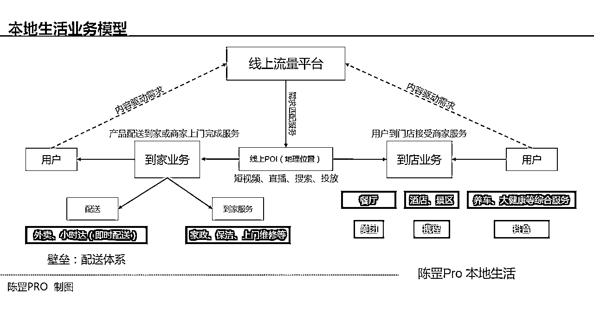

*   本地生活分为到家和到店业务两个板块。

到店包含：酒旅、餐饮以及综合业务。例如养车、大健康、美业等都属于综合业务。

到家包含：到家服务，例如家政、保洁以及上门维修；配送主要对及时性要求更高的外卖，以及小时达。

*   本地生活没有规模效应，规模越大边际成本并不会减少，例如你送1000笔订单和送1万笔订单，履约体系人员会增加，并不会减少。

*   履约无法做到规模效应，但基于抖音推荐体系的内容可以做到边际递减。1条视频覆盖10家门店和覆盖1000家门逻辑是相同的，门店越多，内容成本也就越低。

*   品牌要在线上做好自己的单店模型、区域模型以及品牌模型。要敢于承认阶段性亏损，减少战略上的错误判断。但是要做好每个地区类目天花板的预估，以及做到多大的体量才能实现盈利。沙盘上推演出来都不能盈利，在线下执行的时候能盈利的难度就会更大。

*   搜索驱动与内容驱动的异同。搜索精准度更好，对时效要求更强，用户有需求后才会产生搜索购买，核销率高；内容激发潜在需求，内容爆发力强，对时效要求会更弱，但与此对应的就是核销率不高。这也是美团和抖音两个平台业务底层逻辑的差别。

*   外卖体系的护城河，供给与可控的配送体系以及数字化的系统。这是美团的优势，今年立秋，美团9000万笔外卖，离1亿的目标快接近了，其中奶茶的订单量超2000万单。抖音外卖持续收缩，从抖音生活服务部门划归到抖音电商部门，在到菜单持续收缩，抖音不会放弃外卖，但基于内容推荐体系的外卖有难以有所突破。抖音外卖，情况两难。

*   每个平台都有自己的边界。抖音干不好外卖，但是内容驱动的综合做得不错；美团做不好内容驱动的业务需求，但刚需性的餐饮到店和外卖都是护城河。抖音做好本地生活的难度远超美团，抖音在综合类目的核销远不及预期，有些综合类目核销不到1%。

*   不要迷信抖音，有些事抖音自己都没有想明白，你可能只是它试错的手段。

*   本地生活现在只有美团与抖音，没有其他。抖音和美团慢慢确定自己的本地生活领地，唯一的变化因素就看抖音认不认可这个不是很好的结果。

## 1.2 需求高低频，美团抖音确定边界

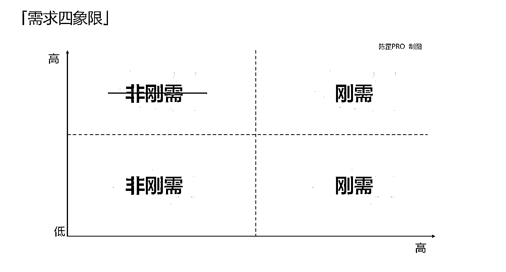

*   高频刚需餐饮---美团；低频非刚需---抖音。搜索的逻辑与内容推荐的逻辑，是两个平台最主要的区别。所以对于品牌来说，要根据自己的品类选择高效率的成交平台，其他平台作为附属运营。

*   高频刚需意味着复购，低频非刚需意味着拉新，二者逻辑不同。高频刚需同时意味着供给多样性，竞争也更加激烈；而低频拉新意味着不断消耗存量，拉新效率会逐渐减低。

*   高频无法带动低频或者说带动低频比较弱。

*   需求与供给的动态不平衡，才有可能产生平台，业务不要违背商业规律。

# 品牌业务模型与商家获客演变

## 业务半径

*   散点门店服务交付

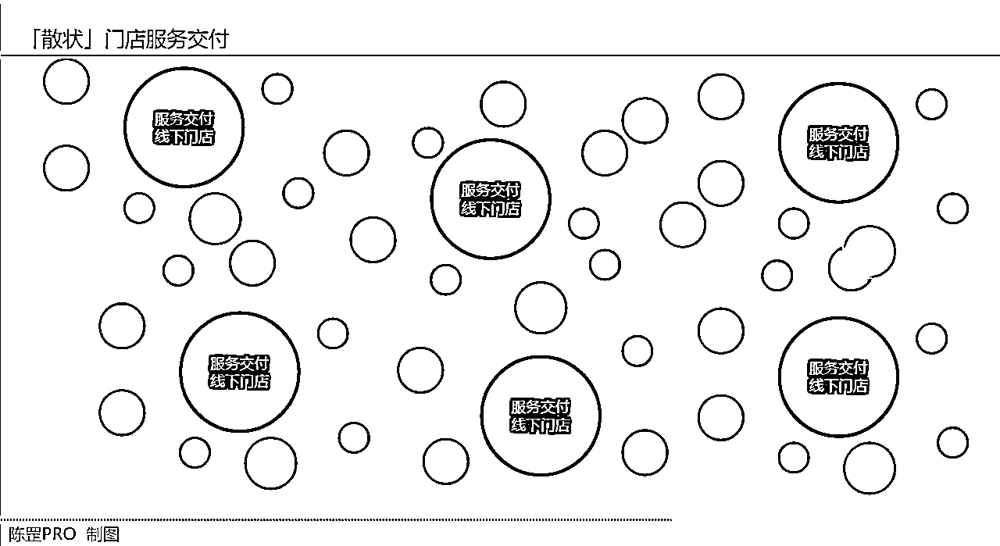

*   本地生活门店是实体门店，门店天然有自己的覆盖半径。频度越高覆盖半径越短，品牌想要提升覆盖半径有两种方式：第1种配送体系，延伸覆盖范围；第2种，自己成为移动的设备，扩大自己的服务范围，例如餐饮门店是在固定位置，但可以通过小推车等扩大自己的服务范围，找到密集人群。

*   低频非刚需覆盖半径会大。但需要关注品类的客户人群，是做社区店还是商场店要做好权衡。能做社区店就不要做商场店。社区店人群结构已经成熟，商场店服务于流动人口，而且门店盈利情况和商场整体情况紧密联系在一起。

*   中心化服务交付

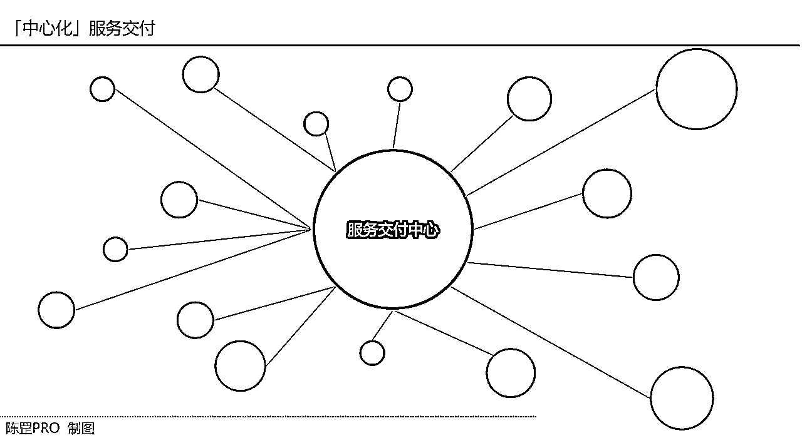

*   中心化交付，借助快递体系做覆盖。能有效节省人力成本、店租成本。但需要解决平台合规性问题。例如洗衣洗鞋品牌浣洗就因为合规性问题受到平台治理，但品牌的盈利模型没有问题。

*   到家与到店二者是不同的逻辑，到家业务体量可能会超过到店。到家业务偏向电商属性，能突破门店天花板。小时达、外卖等都属于到家业务。小时达案例代表，朴朴超市、叮咚买菜等，外卖主要以美团、饿了么为主。

## 获客方式演变

### 2.2.1 门店获客方式演变

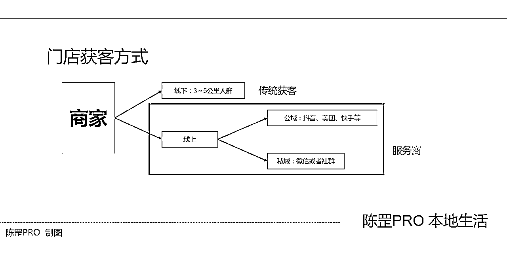

*   三种方式，传统线下获客、线上公域获客、线上线下拉入私域做复购。

*   私域是资产，中心化私域分发与散点私域分发，一个对品牌，一个对门店都至关重要。

### 2.2.2 传统门店获客路径

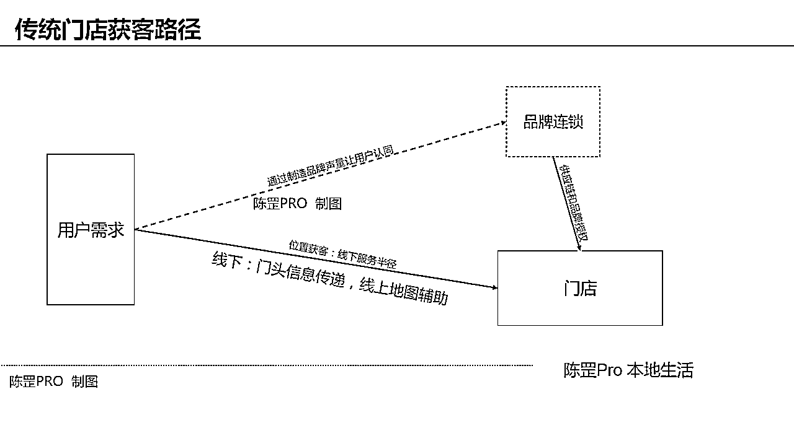

*   传统线下门店获客，主要靠自己的门头招牌以及用户的口耳相传。这种情况下，信息流动效率低。

*   而品牌的诞生主要做两个事儿，第1个对门店做供应链支撑，第2个打广告等方式制造品牌声量，在用户心里种草，减少购买的决策成本。本质上品牌通过高效的信息传播，提升了门店交易效率。

*   传统门店获客，品牌很难直接参与门店的直接获客。

### 2.2.3 搜索时代，门店获客路径

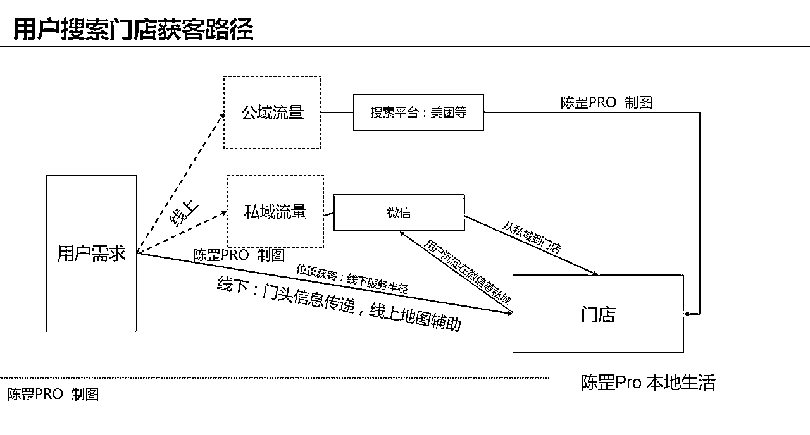

*   移动互联网提升了信息的传播效率，也诞生了微信与美团。微信靠人，基于社交；美团靠货与人，基于地域做团购。

*   用户多了选择，从线上和线下两个渠道获取产品信息；而门店也多了新的展现方式，在线上做团购。人还是那批人，店还是那批店，只是信息传输的路径发生了极大改变，提升了成交效率。

*   私域慢慢成为用户新的资产，公域获客沉淀在私域，私域反向为门店提供稳定的客流。

*   品牌此时能发力的空间不大。美团更多的是基于搜索，主动权在用户这边，而商家主要做供给。为了能获取更多的用户，商家需要通过广告投放拿更多的产品曝光，或者是增加优惠券吸引用户。

### 2.2.4 内容激发时代：短视频

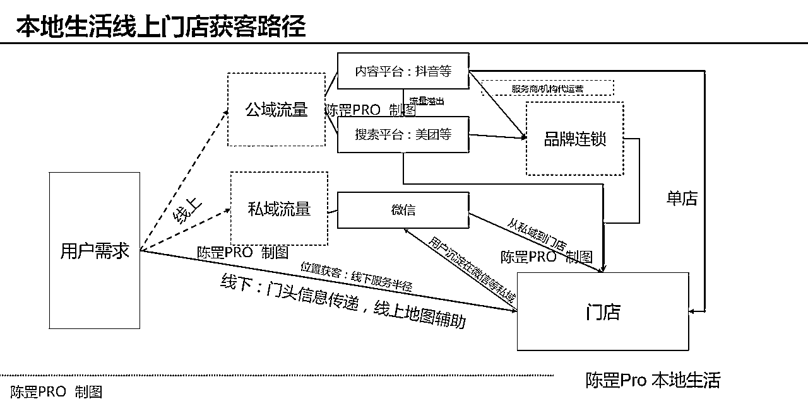

*   信息流动的3个时代。每个时代信息的流动会更快，而商业撮合方式都会发生改变。

*   内容时代，对传统行业的塑造会更强。

*   搜索是对存量需求的消化，而内容推送是激发用户潜在的需求，属于新的增量。

*   在内容平台下，品牌能有效通过内容获客方式为门店提供用户。品牌门店越多，内容边际成本也越低。

## 2.3 本地生活商家构成

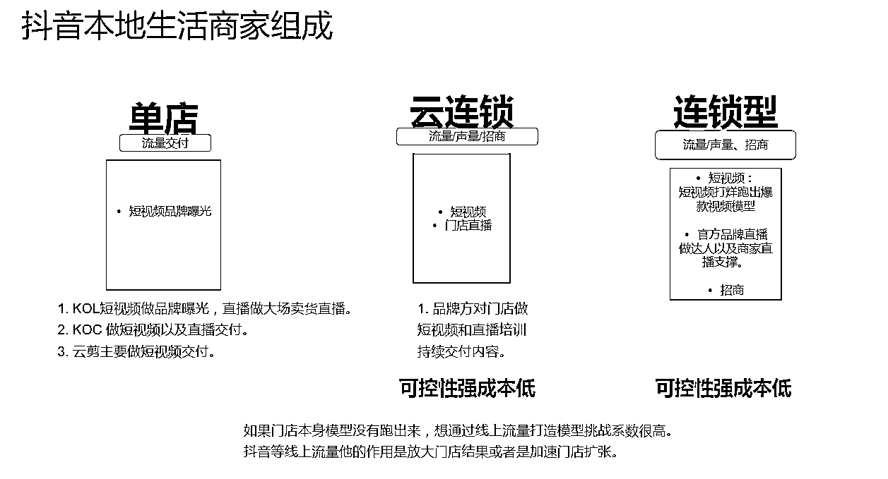

*   抖音加快连锁品牌的成长速度。招商加盟，招工体系也会被塑造。

*   跑通0~1的阶段，抖音能快速放大能力。但对于品牌来说，跑得越快会掩盖很多问题。一旦速度慢下来，品牌需要花时间重新做体系建设，对于低频业务的品牌后面会踩坑。

*   品牌快速扩展的方式，翻存量门店：翻店招牌直接改造或者做店中店。

*   每个品类都有自己门店天花板，所以达到一定体量之后，如果不再增加新的品类还需要沿着单一品类继续做门店，就需要做子品牌。一方面分散风险，另外一方面进攻就是最好的防守，先吃掉市场存量，减少其他品牌圈门店的机会。

## 2.4 云连锁的产生

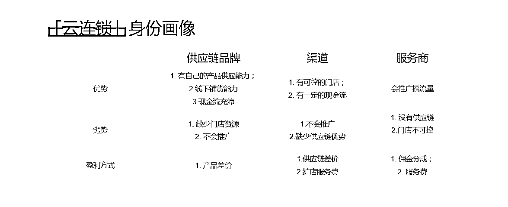

*   低频非刚需能建立云连锁。高频需求，供应链绑定更深，云连锁没有存在的土壤。

*   云连锁建立在单店模型基础上。没有自己的单店、区域和品牌模型。这些都需要花时间去补功课。所以云连锁品牌要给自己做好定位，不要既然又想。有些云连锁品类一开始就注定只能赚一道钱。例如教培云连锁。有些云连锁品类能利用流量获取效率建设自己的供应链体系，这样才能有长足发展的机会。

*   做资源撮合的低频业务，都可以做云连锁。要注意对员工或者门店有管控能力，如果自己做不好，可以通过区域服务商来解决。

*   云连锁的身份画像有3种，第1种是供应链品牌，第2种有一批自己门店的渠道商，第3种是流量服务商。3种身份的优劣势在上图中已经展现。

*   云连锁是商业的路径，不是商业的本质。做好定位，减少战略误判。

# 抖音本地生活流量逻辑

## 3.1 本地生活流量分发逻辑

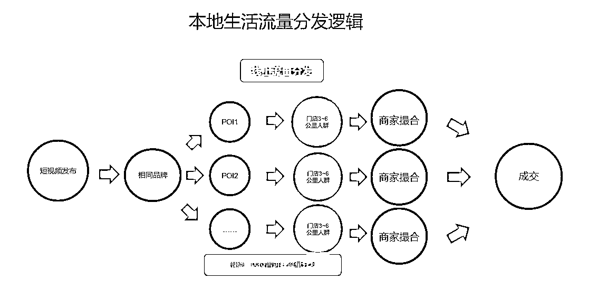

*   拉通品，提升内容规模效应。通品的设置要考虑门店的区域以及店租、人力成本。品牌需要有相应的政策对门店做好管理，如果成本高，品牌补贴；如果成本低，品牌需要多提成补贴高成本门店。具体品类具体分析。

*   做好承接品，通品成为流量分发口，其他产品做流量外溢。要注意的是，流量外溢更多是通品类外溢，很难跨品类外溢。例如做车后，有洗美、小保养和贴膜3个品类。用户有普洗的需求，是能够外溢到精洗、抛光打蜡的套餐，但是很难外溢到小保养或者贴膜的套餐上。

*   产品设计是一个重要的一环，线上流量外溢产品设计逻辑，与线下产品升单逻辑的确立。二者不同，不要混为一谈。线上难以构建综合场景，而线下门店是三维空间，用户会因为门店环境、服务质量对门店产生信任，提升后续其他服务复购。

## 3.2 本地生活流量模型拆解

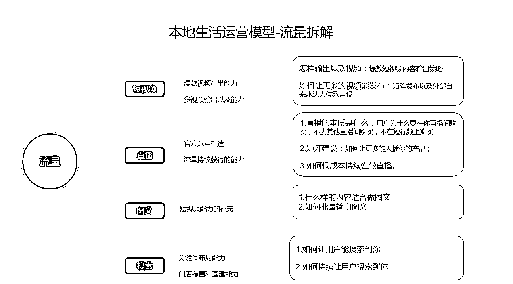

*   流量分为三种，公域流量，私域流量以及商域流量。三个体系并行，互相流动。

*   质量的不确定与数量的确定性，用确定性去冲击不确定性。

*   每个品牌发展成熟之后，都有自己的确定性流量获取模型。公域流量4种获取模型，达人、职人、品牌直播、达人直播，能力各自搭配。不要用其他品牌成熟的模型去套用0~1的项目。

## 3.3 本地生活搜索逻辑

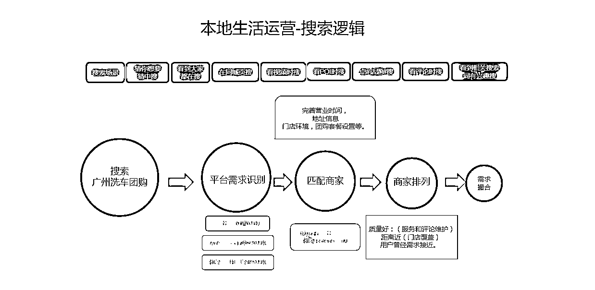

*   和电商不同的是，本地生活有物理范围。有物理范围，就有搜索，我们要关注为什么用户搜索要展现你的门店，以及你的产品。

*   用户为什么会搜索，搜索什么，怎样搜索。想清楚这个问题。

*   用户的搜索心智会越来越强。另外平台算法推荐也越来越精准，百万曝光到成交转化效率会比去年提升4~5倍

如果没有提升，去做复盘反思原因。

*   品类的天花板决定内容曝光的天花板。瑞幸咖啡的视频曝光天花板和洗车视频曝光的天花板是不同的。看得见的是曝光数据，看不见的是算法推荐的货币化率。

# 本地生活参与角色

## 4.1 本地生活参与角色

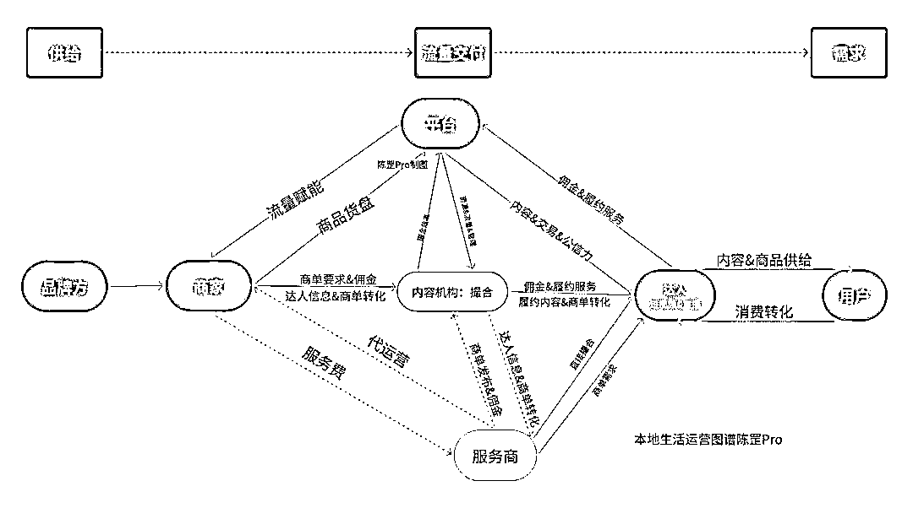

*   供给、履约、渠道，本地生活绕不开的3个话题。

*   服务商和代运营机构在成熟的业务逻辑中没有他们的位置。用户给的钱，只有商家和平台做分享。其他不能提升效率的节点都会被干掉。

*   服务商分为两种类型，做垂类的服务商，以及县域做综合类的服务商。垂类的服务商，今年活的会比较难。

## 4.2 本地生活成交模型

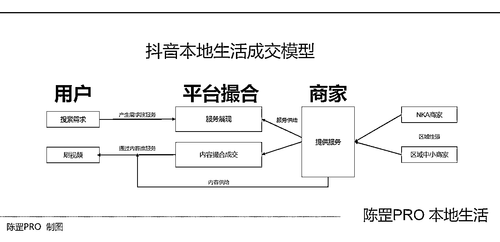

*   内容激发用户需求，搜索做确定性的支撑。

*   抖音的内容门槛，让中小商家难以持续获客。抖音的希望在头部连锁商家，或者区域连锁商家。

## 4.3 本地生活流量参与方

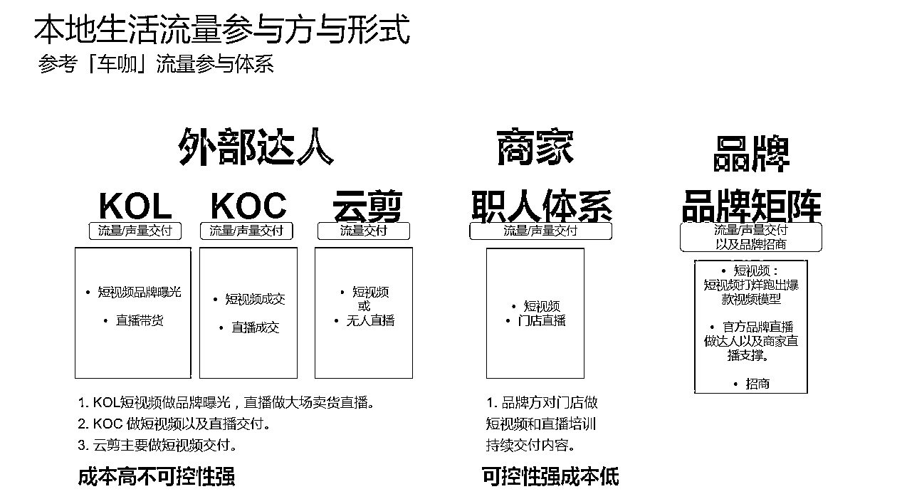

## 4.4 本地生活资源流动

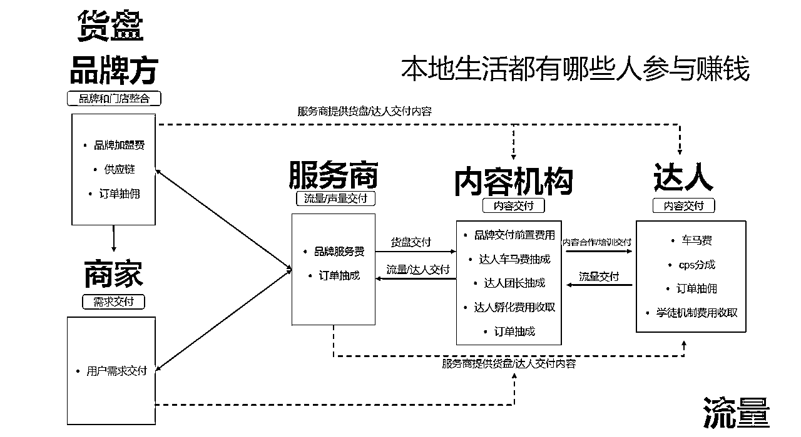

*   需要关注的是流量成交效率问题，另外两三年后再看自己的业务是怎样的情况。能沉淀什么。

# 品牌能力优势是什么

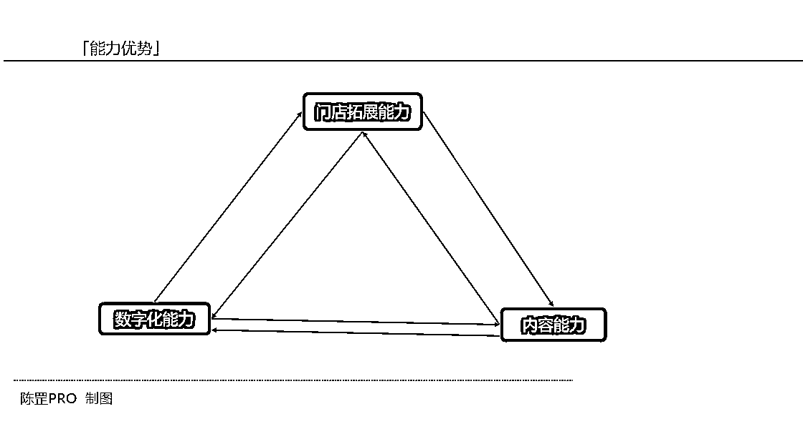

*   这张图画的有点潦草，但这张图是从晚上11点到早晨5点，7个小时头脑风暴后的结果。

*   不要用流量思维去做本地生活，站在实体的角度去想。本地生活单个门店覆盖有限，所以需要你拓展更多的门店。

*   抖音是一道数据题目，逻辑上所有的都可以用数字来反馈。例如哪个区域成交高效，是否需要补充门店；哪个地区成交少，是否有飞单的可能。

*   数字化能力对商家的数字化管理，对内容的数字化分析和处理。二者并行。

# 本地生活推广的业务逻辑

本地生活推广的业务逻辑，我们重点说说。

为什么很多品牌或商家做不好抖音本地生活，根本原因还是没有理解清楚抖音本地生活的逻辑。以为多花钱就可以解决流量不好的问题。如果这样想，很难拿到大结果。抖音本地生活的逻辑是什么，怎样才能做好本地生活。在分析这个问题之前，我们先了解抖音本地生活的成交链路。

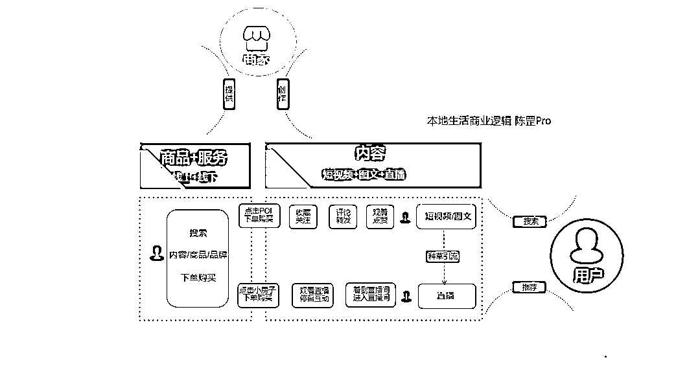

用户要么通过搜索，要么通过短视频或者直播间推荐的形式，看到门店的产品。然后下单去购买。

怎么样才能让购买服务的用户更多？

为什么用户会选择购买你的服务？

用户会不会多次购买？

这就回到一个经典的公式：

销售收入=客单价*流量*转化率*复购率

我们一个一个来说。

第1，客单价。

如果你的产品客单价越高，在其他因素不变的情况下，你的核销率也越高。

当然这是一个理想状态下，用户接受高客单价，是因为你的服务独一无二。

你进入一个充分竞争的市场下，通常市场会决定你的客单价在一个合理的范围。

过高，用户会流向其他商家；过低，很难担负成本。

第2，流量。

你可以将流量看成用户量，多少用户会看到你的服务。这由你的服务类型和门店数量决定。

一般餐饮门店可能覆盖的人群就2~3公里，但有些特色菜可能覆盖10公里以上的人群。

即便在同一商家，不同的服务覆盖人群也不全相同。同一家洗美门店既提供洗车，也提供机油和贴膜服务。

洗美能覆盖的就是3公里以外的用户，机油可能在5公里以内，而贴膜能覆盖10公里。

如果一家门店只覆盖3公里以内，那我做10家门店，和100家，1000家门店是不是就能提高用户覆盖范围。

决定流量的是什么，是门店服务本身能覆盖的范围。

以及你的门店数量。

第3，转化率。

100个用户看了你的服务，10个人购买，转化率就是10%。

如何提升你的转化率，靠你的服务，靠你的产品能力。

第4，复购。

其实和转化率有关联，用户购买第1次后，会不会购买第2次。

还是看你的服务，当然还有门店环境。例如对于餐饮门店来说，好不好停车都是判断复购率高和低的一个指标。

我们回到之前的问题，

怎么样才能让购买服务的用户更多？

为什么用户会选择购买你的服务？

用户会不会多次购买？

我们用抖音本地生活的视角来回答这些问题。

还是这个公式，但是我们增加一个核销率的问题，因为只有用户去门店使用后，才算一个完整的商业行为。

也才是门店实际的收入。

核销=客单价*流量*转化率*复购率*核销率

我们重点说流量以及转化和核销率，是很多品牌理解有错的环节。

1.  流量。

怎样才能获得更多的流量，一个是业务本身能够覆盖的人群，一个是你们的数量。

这是基础。例如你的业务能够覆盖3公里，5万的用户，如果你有10个门店，意味着可以覆盖的用户总量就是50万。

记住，这是理论上可以触达的用户。

那如何让用户每天能够看到你的门店，能够看到你的服务。那就靠一条一条视频，一场一场直播反复触达。

所以做流量的基础是门店：你的门店越多，覆盖的人群也就越多。

这里顺带提大场直播，很多品牌喜欢做大场直播，但要清楚，大场直播的本质是你将未来的用户需求前置。

不是大场直播越多越好，要分清楚自己做大场直播的目的是什么。

1.  转化。

上文提到是门店多，人群覆盖广，可转化的人群也就越多，这是基础条件。

但用户看到你的视频或直播，为什么会进去购买你的服务呢。

你的服务要做得比别人好。对于线上抖音来说，就是将你的POI点做好。

例如你的好评度都是4.8以上，你的套餐购买都是10万+，你的用户好评率都很高。

这样的服务，平台都会主动推给用户。平台也差这样的产品。

1.  核销率。

用户购买到店使用才算完整的商业行为。线上购买，什么情况会影响核销率。

是用户自己的心智。

是因为本身有这个需求，搜索购买成交，还是说没有这个需求，是因为看短视频或直播，觉得这个服务好，所以才会购买，二者逻辑是不同的。

搜索和推荐的差别，决定了核销率的差别。搜索核销率是大于内容推荐的。

这也是我为什么一直强调品牌或商家做好搜索的原因。

如果一个品牌对这套体系都没有理解清楚，就很难在线上拿到持续的结果。

最后分享一句话，也是我电脑屏保图片，每天都会多看几眼。

First do it,

then do it right,

then do it better.

加油。