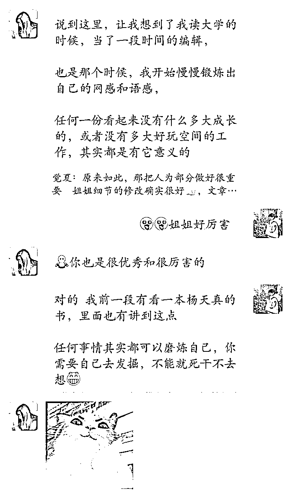

# 精华or水帖？用事实说话：04年大二助理，历时一年，从小白到平均3天一篇10w+爆文机器…

> 来源：[https://die28mmde0k.feishu.cn/docx/G63Ld7L5Bow3jvxAUw9cTcORnPc](https://die28mmde0k.feishu.cn/docx/G63Ld7L5Bow3jvxAUw9cTcORnPc)

嗨，各位圈友老铁们好，我是安七，应届毕业生，一年双百万。

这是关于“AI公众号爆文系列”的第3篇，过往系列：

系列1：我是如何链接贵人、找到AI公众号爆文方向的？

文章：

系列2：坦白局——公众号爆文还值得做吗？

文章：

上次系列2有幸被生财官方看到，并标了精华。

精华文：https://t.zsxq.com/GjvBy

评论区还蛮精彩，有圈友表示很棒，也有圈友怀疑真实性、公众号爆文还能这么好做？

咱不能“王婆卖瓜，自卖自夸”不是，正好，跟了我1年的大学生小助理，前两天做出了还不错的成绩：

1个月，11篇爆文，平均3天一篇10W+，运营的这个公众号，持续日入4位数。

看一个人做的咋样，你不能只看她一个人说了什么，做了什么。

也可以看看她下面的人、跟着她的人，做出了怎样的结果，拿到了怎样的成绩。

所以，我邀请她写了这篇文章，邀请大家看看——

一个大学生视角下的，公众号爆文到底如何？跟着安七1年时间，有怎样的收获与成长？

一个从0开始接触公众号的大学生，是如何在有学业、兼职工作下，还能做到稳定10W+文章产出的？

……

下面是正文（小助理视角）：

哈喽，大家好，我是听听。

04年即将步入大三的学生党一枚，也是安七姐的第一个小助理，很幸运有机会可以加入到安七姐的团队，并且做出一些成绩。

加入安七姐的团队还不到一年的时间，我从一个小白，再到可以一个月出10篇以上10w+，运营的号开通流量主后，目前可以做到日入千元。

# 一、公众号到底还值不值得做？

可能有些人会说：现在公众号的红利期已经过去了，已经不值得去做了。但要承认的是，现在依旧有人可以通过公众号赚到钱。

从赚钱的角度来看：只要微信公众号一直可以开通流量主，就一直有机会赚钱。

赚多少主要是能力问题，加点运气；能赚多久的钱，看自己的选择。

有的人专注做爆款内容，可能来钱快一些，相对应要承担的就是号做不长久。

有的人专注做ip，前期来钱可能慢一些，但是ip运营不仅可以转化私域，也还可以进行接广。

比如我们爆文训练营就有一位伙伴，打造读书ip，不仅自媒体副业创收，还多次供稿清华大学出版社。

很多人赚不到钱，或者赚不到足够的钱，其实就卡在1个点：不够坚持。

总有人会希望可以马上看见结果，希望可以更快看到反馈。没立马看到反馈、或者反馈比较少，就想要放弃。

但想要赚更多钱，一直都需要有更强的耐心和坚持力；当然想要看到更好的结果，除了运气，还需要一些能力。

我们团队可以做到就是：

通过训练营增大赚到钱的可能性，把账号做起来，可以赚钱，也可以做IP。

通过爆文搭子变现营提供一个可以更加省心、省力可以赚到钱的机会。

之前看到一句话：做自媒体，就是在克服人性的弱点。

我很认可这句话，因为想要通过自媒体赚到更多的钱，就需要去磨练自己，去克服人性的弱点：懒、贪。

为什么大家都很佩服自律的人？

我想有一部分原因就是这些人一定程度上戒掉了懒、贪。

而我从小白再到平均3天出一篇10w+，也有一部分原因是慢慢学会了去克制自己的人性弱点。

不想要更新写文，但是有团队的伙伴更厉害的成绩督促和激励；只想要马虎了事，但是越马虎，结果也越马虎。

事事都马虎，人就很难进步，所以也感谢自己有一份上进心，有想要去改变、突破的心。

所以，回归问题：公众号还值不值得做？我觉得值得，只要流量主收益还在，就还可以继续做；不仅可以有一份收入，还可以倒逼自己成长。

# 二、新手小白怎么写出10w+？

接下来，更加细致说说我从小白到平均3天写出一篇10w+，主要的3个原因：

## 1.跟着有结果的人去学习

我跟着安七姐学过第一期的爆文训练营，那时候我起号可能稍微慢一些，和我同一期的伙伴成绩几乎都比我好。

那段时间也会焦虑，因为大家成绩都很好，有同一期的学姐直接在21天赚了大几千，但自己的成绩却很一般，顶多赚回个学费。

但在结营之后，坚持＋记得一些正确的方法，成绩也还不错，破万的有不少。

但如果我一开始只是自己去琢磨，这条路必然是更难走的，很多卡点也解决不了。

但跟着安七姐，会很安心，因为她会很耐心去帮你分析问题，并且提供帮助，大大缩短了自己瞎琢磨的时间。

就像她的拍一拍语录：让人安心的幸运七。

## 2.坚持做，用心做

后来因为工作、学业就没有再继续经营自己的号；工作后开始经营其他账号。

从找到对应的领域，再到写文，保持更新，我经营的账号，几乎没有断更过。

在放假期间，我想要好好再重新学习爆文，提升这方面的能力，然后我去请教了安七姐，到底是怎么写出这么多爆款的？

首先必不可少的就是网感，要能识别爆款，要会分析爆款，而不是自顾自自娱自乐，感动自己。

其次需要对账号有一个认识把握，要懂自己的账号，要知道自己这个号写什么会有人看，即目标群体是什么？这个目标群体喜欢看什么？

最重要的一点就是：多练，而不是机械重复的练习。

最后一点我一开始没有意识到，我只是很机械去更文。

安七姐后来说：任何一份看起来没有多大成长空间的工作，其实都是有意义的。

有一天听杨天真的播客，她也提到了：其实任何事情你都可以学到东西，看你能不能去抓住这个点。

和安七姐交流之后，我定下了一个小目标：1个月达成10篇10w+。幸运的是，我成功做到了。

以前我不会花太多时间去分析账号，但后知后觉发现：我在用战术层面的勤奋，掩盖战略上面的懒惰。

想要做出更多爆款，一定要有分析的能力，要学会去总结反思，不断迭代优化；而不是只是在不断机械重复。

去分析成为爆款背后的原因：为什么这一篇可以爆？但昨天的没爆？是哪一步还可以继续去优化？

一定要坚持多问为什么？去找到更加核心的、可持续的内在点。

机械的进步空间很小，但是如果你拥有了分析的能力，加上网感越来越强，只要能坚持下来，内容不会太差，号只会越来越好。

如果没有这些能力怎么办？

那就回归到第一点：跟着有成绩的人去学习。

（安七补充：生财的公众号航海手册，里面就汇聚了很多高手的经验心得，多看）

如果不会，就直接问。

不要自己瞎琢磨，瞎琢磨倒是没什么，最怕琢磨了老半天还是没结果。

我自己在工作中就遇到过：自己琢磨老半天的问题，别人不到5分钟就知道问题所在。

所以，如果不懂、不会，就主动去问知道的人，有结果的人，他们会知道，专业的事交给专业的人来做。

问多了，知道多了，慢慢就会有一个思考路径的出现，再加上一定的训练，能力只会越来越强。

但很多人只是入门了，但却卡在了第一步，就更别说第二步了。

一件事情能做成功，坚持是必不可少的，就像是春种秋收，过程时间是少不了的，急不得。

半途而废，可能在某个层面上，也是不相信自己可以把这件事情做成。

所以，在坚持的道路上，也请你一定要维护好自己的心力，相信自己可以做成功。

## 3.去印证自己的想法

不知道你在突然冒出一个想法的时候，第一反应是忽略还是否定、或者印证？

换做以前我肯定就不管他，继续按原有路径一直走。但是在分析账号的时候，突然发现了1个点：爆款是重复的！

在不断分析的过程中，我越来越觉得这个点真的很神奇，感觉可以被印证出来。

我后来找了很多标题去印证：爆款是不是总能重复爆？事实证明，是的！爆款是会重复的。

因为我的很多10w+都是用了重复的爆款标题。而且如果你可以坚持做，账号的权重一直在增加，爆款的概率可能会更大。

这就形成了一个良性循环：坚持做→有结果，权重增加→结果越来越好。

其实这一点在课程里面也有讲到，但我没有理解消化到位，我也没有完全相信。

但就是这次的小有成就的经历，让我理解了：

你学了，不代表你学会了。

真正的消化吸收一定需要时间，要不然自己用更长的时间去琢磨；要不然就多问，多做。

也就是这样，我从一个小白，做出了1个月10篇以上10W+、其中还有一篇103W阅读量的成绩。

# 三、从排斥到接受爆文的心路历程

有的人一开始就奔着赚钱来，所以并不会对爆文有排斥，只会怀疑。

怀疑到底能不能做？怀疑是不是真的可以赚钱？但我不是怀疑，我是排斥。

我一开始是并不接受爆文变现的，包括AI爆文变现。可能是因为我自己喜欢写作，坚持写作也有4年的时间了，我内心有一种莫名其妙的“清高感”。

觉得用爆款标题不是一件多牛的事情，觉得如果自己有实力，爆款标题也不值一提。

当然会有这样的人存在，但像我这样普普通通的人，一开始是不具备这么强的实力的。

那就没有方法可以去赚到钱吗？有，就是像课程里面说到的：只有你的标题吸引人，别人才会想要去了解你的内容。

文章想要被看见，不能只顾着自己的需求，要学会去照顾读者的需求。在读者和自我的需求中，达到一个平衡状态，才是最优解。

所以后来我慢慢接受了爆款标题，也去学习要怎么修改、分析、找到爆款标题。也在不断学习、拆解的过程，慢慢培养了自己的网感。

AI的大趋势，自然而然也涉及到了文学创造领域。利用AI工具快速生成文章，一开始让我觉得很别扭，因为我喜欢自己去创作。

但不得不承认，AI在某些领域确实会比人更强，知识储备量也更大，所以学会去利用AI，确实可以省下一大笔时间。

轻松又可以赚钱的事情，是很容易坚持下来的。

但是坚持在最开始时很难的。

不得不承认，想要快速获得一个结果，或者说，想要不劳而获真的是很难避免的。

我自己就有很强的惰性，好在有团队的伙伴们一起在努力，一起不断复盘、优化，一直创造更好的成绩。

来来去去很多人，但是要求没有变低，反而因为自己的成长在慢慢变高，希望可以再做的好一些，也希望团队可以越做越大，越来越好。

很神奇，自媒体的这条路，不经意间促进了我的成长。

# 四、避坑指南

任何一件事情，去总结，总会有反思或者新的思路。

现在回顾起来，如果我把这几点做的更好，说不定可以有更快的进步，希望这些可以帮你避坑：

## 1.开始之前，一定要先思考清楚：自己到底想要什么？

不一样的目的，指导不一样的行动。目的不同，行动也要有所不同。

如果想要打造个人IP，那就不要选择容易爆、但相对容易死号的领域。

选择可以让自己更长久坚持、愿意一直坚持去写、去分享的领域。

如果想要赚快钱，那就选择容易爆的领域，去测，去分析。

选择做什么，就承担什么后果。

做IP，就不要过分在意一开始的数据，在学会拆解爆款的同时，也要不断提高自己的写作水平，让号可以越做越久。

做爆文，就要花大量时间去琢磨标题、封面，去仔细研究同行，不断去培养自己的网感，并保证一定质量的内容。

如果没有想清楚目标，就很容易既要又要，但是这种心态对新手来说，往往是放弃的催化剂。

## 2.不要低效努力，感动自己

提倡努力，但不要低效努力，或者说：更加提倡去学会高效努力。

低效努力的回报率真的不高，就像我一开始只是一种机械重复，不带脑子思考。

不分析、不总结，就没有优化，没有优化就很难进步，不管是对个人还是账号而言，都是一样的。

读者也不是傻子，就算有好运的一直加持，一定要有能力去接住。所以一定要坚持优化，去培养自己的网感和分析能力，不断去进行迭代。

如果不会，就主动找答案，问ai、问专业的人。

## 3.锻炼自己的心态：接受负反馈

人是需要反馈的，正负反馈都要。但可以让人坚持下来的，更多时候都是正反馈。

遗憾的是，在新手期，大部分时候都是没有正反馈的。平台推流了，但是没有点赞，关注也没有增加；推流一段时间了，但是没有大突破……

新手期，负反馈太正常了。

但是，新手期就是筛掉很多人的第一关，如果可以坚持下来，慢慢优化，有正确的方法加持，结果肯定会慢慢来。

有的人很幸运来到了第二关，坚持了一年左右，但是坚持不住了，放弃了。

个人的公众号，可以做很久，真的很不容易。但是如果你能做下去，那结果不管怎么都不会太差。

你总会在过程中收获到一些意想不到的东西，这就是坚持做一件事情很有意思的点。

所以在运营自己的账号，一定要戒骄戒躁，不要过分在意数据的结果，而是学会利用数据的结果来反向促进自己进步成长。

# 五、怎么熬过瓶颈期

最后分享一个点：怎么熬过瓶颈期？

账号一直没有起色，数据一直上不去，到底要怎么做？

总会有人在瓶颈期的时候放弃。但如果熬过去了，那大概率也能成功。

我也没有特别厉害的方法，就是去坚持做，熬一天算一天，在团队伙伴的陪伴下，一起做。

他们在努力做，我也必须要努力做。

所以如果你觉得坚持特别难，不妨试着去借助外力，和有一样目标的人，一起去前进，去进步，他们都在走，你至少不敢落下。

就算做出的成绩不算优秀，但起码比放弃会更加有成绩。

在后面慢慢养成习惯，自然而然就会有更高的要求，想要去突破，想要去进步，大家都在越来越好，也会督促你越来越好。

所以，也可以去加入一个小圈子，一起去成长进步，毕竟一群人或许可以走得更快更远。

有了目标，就要有所行动，而不是只是树立一个目标。

要去想到底要怎么达成这个目标。

比如我想一个月写出10篇10w+，那我到底要怎么去做？这个目标其实是很大的，如果之前几乎没有接近的成绩，可以说是痴心妄想。

但是，如果去细化目标呢？

一个月达成10篇，那也就是30天只要有10天有10w+就够了。

这10天可以是连续的，也可以是隔开的。

那剩下的要求就是：

至少3天写出1篇10w+。

再更加细致拆分：我要怎么去写出1篇10w+？

如果我写出了第1篇10w+，那我是不是就可以去倒推我做对了哪些点？

哪些点是可以复制照搬使用的？

用可复制的方法不断去重复撬动，只要方法对了，10w+接连爆款问题就不大了。

所以最重要的就是找到：可以不断复制的方法，去重复使用。

就像我这个号，就是利用了爆款是重复的这一点，我就达成了目标。

今天听直播还听到一句话：一个招式重复一万次就是绝招。

我目前还没有重复过1w次去做一件有挑战的事情，但是方向是对的，我觉得可以重复一万次大概率可以带来更大的效益。

就像是更文，也是在不断重复的过程，在不断重复中发现规律，在不断重复中不断迭代优化。

这一切都是对于重复的不断检验，所以如果有人可以做成功的事情，也大可以去尝试，反正就算是没有什么很大的结果，也不会有太大的损失，可能就损失了一些自己娱乐的时间。

任何一件事情，你去做了就会有所收获，不一定有结果，但一定会有所收获，只是看你到底是从哪个角度去看、去分析。

最后，也祝愿大家都可以获得让自己满意的收获，一起加油吧！

# 六、安七说

我也跟着大家一起，看完了这篇文章。

小助理之前写完初稿发给我的时候，我都没有时间看，今天开始排版了，认真看完，除了必要的数据图片补充，我没有修改一个地方，写得真好hh。

我身边的人，来来去去，她唯一一个一直跟着我，不断成长、打磨的。

这1年，我也见证了她很多方面的成长，尤其是公众号爆文方面。

上周，接到她主动反馈报喜后，还是很欣慰的。

在很多人都不看好公众号爆文、觉得流量下滑没有空间的时候，我们团队伙伴能持续深耕、保持优化，用结果说话，也确实不易。

我想说，其实我们大家的智商都差不多，

甚至有时候，人不需要那么“聪明”、“精打细算”，太聪明、精明的人，容易跳脱。

有份笨拙的坚守，发心正，走正道，赚正儿八经的钱，大概率结果不会差。

公众号爆文还能不能做、值不值得做？这个问题，精华帖中说过，小助理今天的这篇文章，也验证了，结果是什么显而易见。

加油，一起生财！

我是安七，我们下次见。