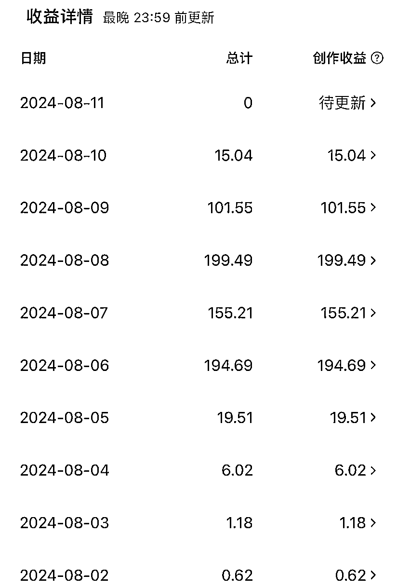
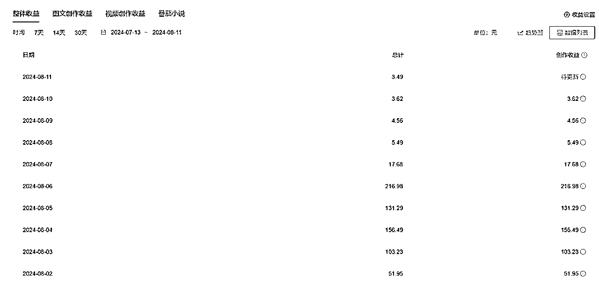
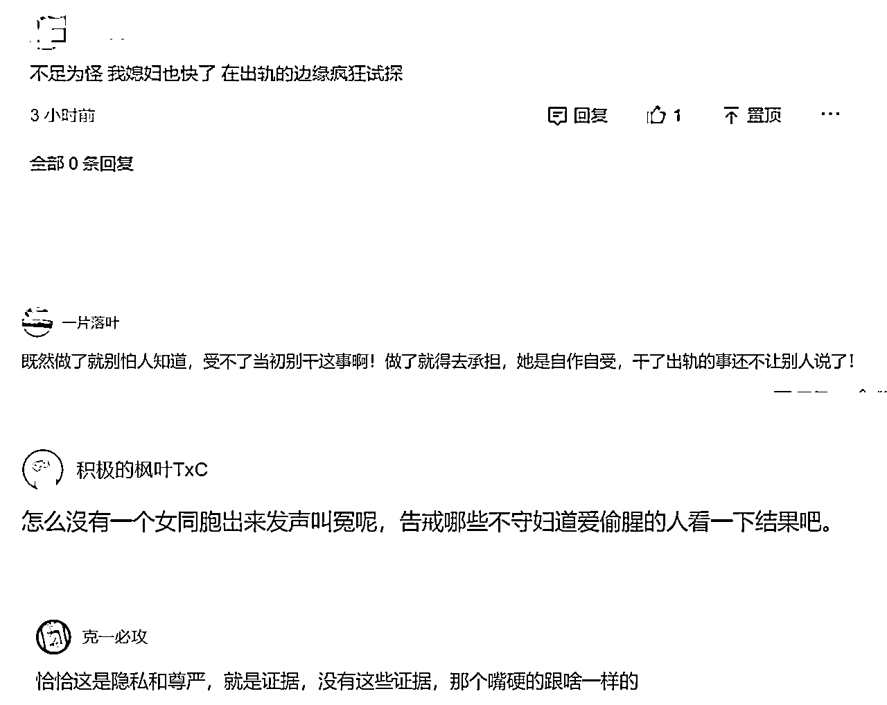
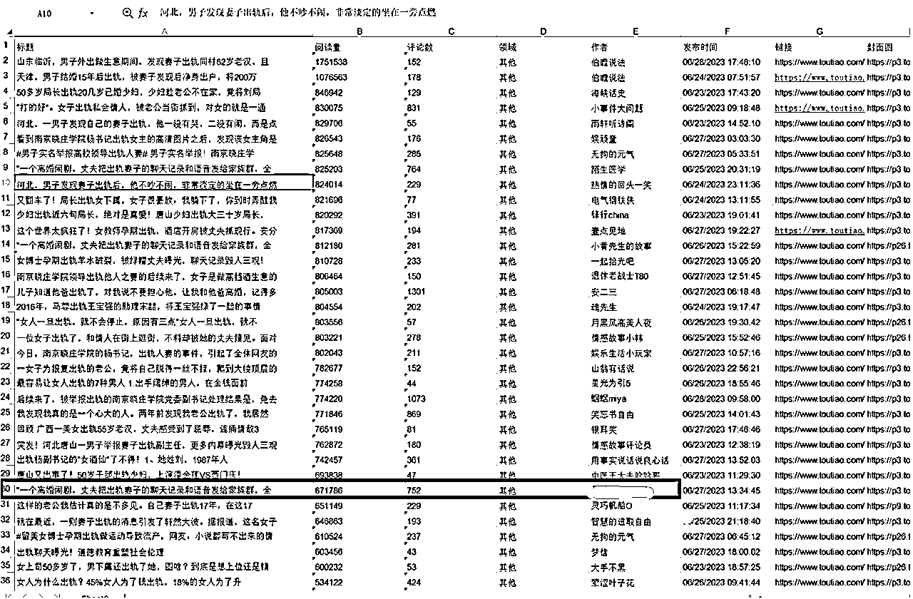
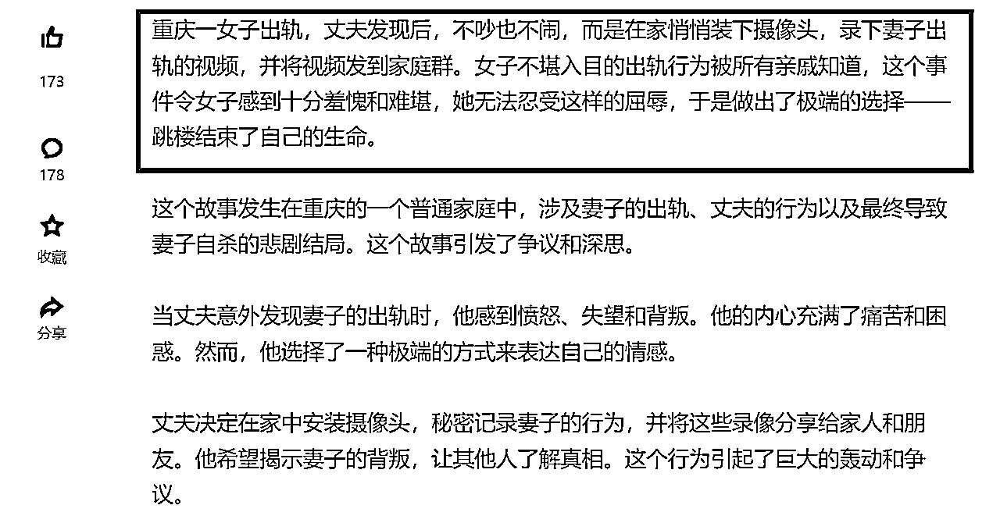
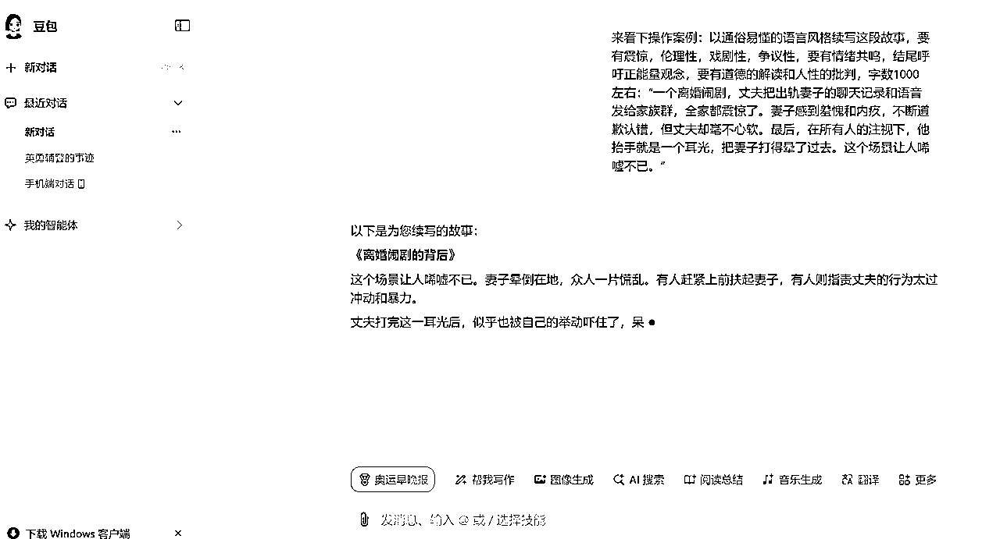

# 分享微头条出轨类赛道AI爆文玩法，单天变现200+，一条龙傻瓜式项目玩法分享给你

> 来源：[https://o0yvn3o31a.feishu.cn/docx/GZzVdX3LnoTnWsxEbIFcD1Qtnaf](https://o0yvn3o31a.feishu.cn/docx/GZzVdX3LnoTnWsxEbIFcD1Qtnaf)

大家好，我是黄岛主！

今天给大家分享一个我们最近在做的微头条AI爆文副业项目，主要赛道讲的是男女出轨方面的内容，且内容是通过AI爆款开头续写出来的500-1000字的文章，然后发布微头条去做变现。

目前这个项目大家去做完全没问太多，不是过时的赛道，可能之前有人做过，但最近半个月我们做的效果非常不错，所以这里分享给大家。当然了，大家可以以此类推发现更多的赛道，不容易容易内卷！

那么，说到出轨，可能大家很感兴趣哈。也会有人问：出轨赛道的内容也能发在微头条做收益吗？

是的，但凡出轨、小三、离婚、家暴、反霸凌....都可以让大家产生共鸣。这也是做这个赛道的主要原因，而且这类赛道的收益也是非常可观的，赛道比较窄，看的人群多，容易产生爆文，评论也多，所以收益方面不错的。

备注：6号-11号没发微头条，7号以后的收益都是之前的还在有阅读！

当然，如果你想做这类赛道，是不能恶意抹黑出轨或者当小三的人群，我们要把出轨这件事看的阳光一些，比如小三虽然可耻，但是小三也是人，也需要生存，如果不当小三可能会过的很苦，很艰难，虽然不鼓励当小三，但是可以包容小三，我不要打压小三，要让小三良性循环。当然，这是我们所想的，但是你发文之后，评论就会有一群人开喷。

用户与文章产生共鸣的评论，如图：

我不清楚大家有多少是没做过微头条项目的，这里我简单介绍下这个微头条：

微头条是今日头条下的一个模块，类似于微博、QQ空间，百家号动态，都是一样的功能，可以发2000字以内短文，说白了就是平台发动态的功能，而创作者注册今日头条后，现在0粉丝就可以开通微头条收益功能。

但是微头条现在处于非红利期的项目，不如最开始了，而且单价也下降很多，但不影响我们去做这个项目，而且现在规则也在变化，玩法也是层出不穷。只要你认真点，做这个项目的时候去研究下这个项目的一些发展，放大去做不同的赛道都是没问题的。

简单介绍到这里，下面我来说下出轨类赛道：

最开始也跟大家讲了，这个赛道就是出轨、小三方面的，内容基本上是根据爆款开头去AI续写的，你可以理解程是杜撰的，但是内容都是积极向上的，不是打击小三的那种，因为不能恶意抨击小三或出轨，不然影响很大也容易带节奏。

目前来说出轨类赛道能短期赚一些，这个是没问题的，如果想要长期发展估计够呛，反正能短平快赚一波。后续的话可以不断挖掘出和这个赛道相似的去做，比如家暴、离婚等方面，这个全靠大家去不断研究和分析了！

然后这个赛道还有个好处：如果你发的文章有一篇爆的话，我们可以继续用这个爆款开头去AI不同的文章去发，然后是可以持续爆的，如下图看下：

注意：这全部是同一个爆款开头，同一个图片哈！只是内容AI的不一样！

说真的，出轨就是情感方面的领域，当然情感里有很多领域都是不错的，单出轨、小三、打女人、离婚、家暴等这类的，都是热门领域，感兴趣可以搞。

来，下面具体说下这个项目的操作玩法：

### 一、账号注册

手机端：商城下载今日头条APP，手机号直接注册登录。

电脑端：打开www.toutiao.com 点击登录，手机号注册，如果不能注册，可以手机端注册。

注意：注册完，不要实名，什么时候提现了，什么时候在实名，不然会浪费实名账号！

粉丝不需要太多，如果有老号肯定首推，给的收益高，权重也高！

### 二、操作流程

1、素材

出轨赛道素材搜集，AI写作的爆文方式：我们是“以爆制爆”的二爆玩法。通过这个玩法去搜集素材，也就是搜集已经爆过的对标微头条，然后在AI去续写开头。

根据指标去选素材，找近期/往期（这个可以测时间段）50W+以上展现的爆文，找千赞文的微头条，优先找点赞数量1000+以上(300/500点赞)，因为我们看不到阅读量，所以需要看点赞量，点赞量越高越好爆，比如下图这篇就是爆款的指标。

2、关键词

要学会搜集相关关键词，初始化词根涵盖：出轨、小三、离婚、家暴....

通过初始词根，可以拓展更多相关关键词，例如：有染，(婚内)出轨， (抓) 小三，婚外恋，婚外情，外遇，维护小三......需要自己去拓展，我只给简单的思路，我没做过小三，也没找过小三，也没抓过小三，很多东西不是很清楚，建议大家一定要养成搜集相关关键词的习惯，这样好快速找对标内容。

3、找素材

通过拓展的相关词找到相应的素材，可以人工在头条里直接搜索相关词，如图：

也可以软件抓取，这个是要收费的，咸鱼有账号买，易撰网https://www.yizhuan5.com/ 就行，打开官网，找到微头条部分，然后输入关键词，通过软件抓取。

导出表格，可以看的很清楚，圈起来的，是我的一个爆款，这是之前的，分享快速搜集素材的方法，我们可以通过单篇，找到作者账号，搜藏整个账号，因为这个账号里面肯定有其他爆文，都可以借鉴，找到合适的爆文直接添加到浏览器的收藏夹，续写的时候直接在收藏夹找素材。

4、养号

发布之前需要养号，养2-3天，刷下赛道关键词，看看对标，顺便搜集素材，在这里搜，找到内容后，在手机端APP看完对标内容，点赞、评论、收藏就行。

不同时间段刷，分早、中、晚，可以在看的时候收藏一些爆文，到时候方便取材，养完号正常发垂直领域的微头条，后期每天都要刷内容养号，边发边养，保持标签垂直。

5、AI写作

超级简单，找素材的时候说了“以爆制爆”的二爆玩法思维，我们是找爆文的开头，然后用AI续写，所以要不断搜集爆文的开头部分，整个操作过程就4个步骤。

第一步、找爆款，复制开头，找爆款的4个指标：展现量、点赞量、评论量、阅读量，这个按照上面找素材的方法里讲的去做，复制开头，看案例：

这里有细节要注意：真实人物的不要找（李佩霞、毛佩奇这样的）、局长、董事长的不要找、有关于战争话题、政治内容、抹黑造谣不要碰、不要找已过时效内容或信息陈旧的，不过李佩霞的现在没人投诉，可以做。

第二步、AI续写

找到爆款开头后，添加指令，让ai续写，看下AI指令：

以通俗易懂的语言风格续写这段故事，要有震惊，伦理性，戏剧性，争议性，要有情绪共鸣，结尾呼吁正能量观念，要有道德的解读和人性的批判，字数1000左右：“爆文第一段”

续写这段故事，要有中国法律的解读和人性的批判，字数1000字：“爆文第一段”，以自然语言的文笔风格，续写这段故事给年龄30-60岁的人群看，包含正反观点和质疑声，字数1000：“爆文第一段”

要注意，我们写的所有内容都是积极向上，要说明这个问题所在，要告诉大家这个是不对的，比如小三虽然可耻，但是小三也是人，也需要生存，如果不当小三可能会过的很苦，很艰难，虽然不鼓励当小三，但是可以包容小三，我不要打压小三，要让小三良性循环，这类积极向上的。

AI开头操作案例：

以通俗易懂的语言风格续写这段故事，要有震惊，伦理性，戏剧性，争议性，要有情绪共鸣，结尾呼吁正能量观念，要有道德的解读和人性的批判，字数1000左右：“一个离婚闹剧，丈夫把出轨妻子的聊天记录和语音发给家族群，全家都震惊了。妻子感到羞愧和内疚，不断道歉认错，但丈夫却毫不心软。最后，在所有人的注视下，他抬手就是一个耳光，把妻子打得晕了过去。这个场景让人唏嘘不已。”

AI工具用豆包，网址：

https://www.doubao.com/chat/?channel=baidu_pz&source=db_baidu_pz_01&keywordid=weizhi7

看看生成的内容：

案例一：

“一个离婚闹剧，丈夫把出轨妻子的聊天记录和语音发给家族群，全家都震惊了。妻子感到羞愧和内疚，不断道歉认错，但丈夫却毫不心软。最后，在所有人的注视下，他抬手就是一个耳光，把妻子打得晕了过去。这个场景让人唏嘘不已。

丈夫打完这一耳光后，似乎也被自己的举动吓住了，呆立在原地，眼神中充满了愤怒、痛苦和迷茫。他原本以为，揭露妻子的出轨行为，给她一个教训，能让自己内心的愤怒得到宣泄。但当看到妻子晕倒的那一刻，他心中又涌起了一丝懊悔和恐惧。

家族群里顿时炸开了锅，各种声音此起彼伏。有的说丈夫做得对，这种背叛婚姻的女人就该受到惩罚；有的则说丈夫太过分，无论如何也不应该动手打人。而丈夫的父母则在一旁唉声叹气，不知该如何是好。

妻子在众人的照顾下缓缓苏醒过来，她的眼神变得空洞无神，泪水不停地从眼角滑落。她知道自己的错误给家庭带来了巨大的伤害，但她从未想过会以这样一种难堪的方式被揭露和惩罚。

这件事情很快就在邻里间传开了，各种风言风语不绝于耳。有人对妻子的出轨行为嗤之以鼻，认为她道德败坏；也有人对丈夫的暴力行为表示谴责，觉得他失去了理智。

然而，在这看似简单的是非对错背后，却隐藏着更深层次的问题。妻子为何会出轨？是因为长期在婚姻中感到被忽视？还是因为受到了外界的诱惑？而丈夫，他的愤怒和暴力，是否也反映出他在处理感情问题上的无能和极端？

其实，婚姻需要双方共同经营和维护。如果在婚姻中出现了问题，应该通过沟通和理解来解决，而不是通过背叛和暴力。妻子的出轨是对婚姻誓言的违背，是对家庭责任的逃避，这种行为无疑是错误的。但丈夫的暴力回应，不仅不能解决问题，反而让事情变得更加糟糕，让这个家庭陷入了更深的痛苦和困境。

这一场离婚闹剧，让我们看到了人性的复杂和脆弱。在面对感情的挫折和考验时，我们往往会失去理智，做出错误的选择。但我们应该明白，无论何时何地，尊重他人，遵守道德和法律，都是我们做人的基本准则。

我们应该从这个悲剧中吸取教训，学会在感情中保持忠诚和信任，学会在遇到问题时冷静思考，用理智和包容去解决矛盾。同时，我们也要坚决反对任何形式的暴力行为，倡导以和平、文明的方式处理问题。只有这样，我们才能避免类似的悲剧再次发生，才能让我们的社会充满爱与和谐。

让我们共同努力，用正能量的观念去经营我们的感情和生活，让每一个家庭都能成为温暖的港湾，而不是充满硝烟的战场。“

案例二：

“一个离婚闹剧，丈夫把出轨妻子的聊天记录和语音发给家族群，全家都震惊了。妻子感到羞愧和内疚，不断道歉认错，但丈夫却毫不心软。最后，在所有人的注视下，他抬手就是一个耳光，把妻子打得晕了过去。这个场景让人唏嘘不已。”

我原本以为，揭露妻子的出轨行为，给她一个教训，能让我内心的愤怒得到宣泄。但当看到妻子晕倒的那一刻，我心中又涌起了一丝懊悔和恐惧。

家族群里顿时炸开了锅，各种声音此起彼伏。有的说我做得对，这种背叛婚姻的女人就该受到惩罚；有的则说我太过分，无论如何也不应该动手打人。而我的父母则在一旁唉声叹气，不知该如何是好。

妻子在众人的照顾下缓缓苏醒过来，她的眼神变得空洞无神，泪水不停地从眼角滑落。我看着她，心里五味杂陈。

我开始回忆起我们曾经的点点滴滴，那些一起度过的美好时光。我们曾经是那么相爱，彼此承诺要相伴一生。可如今，一切都变得如此糟糕。

我在想，是不是我对她的关心不够？是不是我在忙碌的生活中忽略了她的感受？但她的背叛又让我无法轻易原谅。

这件事情很快就在邻里间传开了，各种风言风语不绝于耳。有人对妻子的出轨行为嗤之以鼻，认为她道德败坏；也有人对我的暴力行为表示谴责，觉得我失去了理智。

然而，在这看似简单的是非对错背后，我也开始反思自己。我觉得自己在处理这件事情上太过冲动，没有考虑到后果。

其实，婚姻需要双方共同经营和维护。如果在婚姻中出现了问题，应该通过沟通和理解来解决，而不是通过背叛和暴力。妻子的出轨是对婚姻誓言的违背，是对家庭责任的逃避，这种行为无疑是错误的。但我的愤怒和暴力，不仅不能解决问题，反而让事情变得更加糟糕，让这个家庭陷入了更深的痛苦和困境。

这一场离婚闹剧，让我看到了自己人性的复杂和脆弱。在面对感情的挫折和考验时，我失去了理智，做出了错误的选择。但我应该明白，无论何时何地，尊重他人，遵守道德和法律，都是做人的基本准则。

我从这个悲剧中吸取了教训，我知道以后在感情中要保持忠诚和信任，遇到问题要冷静思考，用理智和包容去解决矛盾。同时，我也要坚决反对任何形式的暴力行为，倡导以和平、文明的方式处理问题。

我希望通过我的经历，能让更多的人明白，经营感情需要用心，处理问题需要智慧。让我们都能以正能量的观念去面对生活中的种种困难，让每一个家庭都充满温暖和爱。”

注意：同个爆款开头，可以生成多篇不同的文章去发布，然后会有很大机率热门，也可以热门一个，后续都怼这一个标题。

### 三、文案配图

图片就是截原文的，把水印截掉上传即可，但是不能太血腥，不能涉黄、不能露脸，有些真实的人会投诉侵权、不要在眼睛上打马赛克，最好用表情遮住脸部，整理好内容备用等待发布，剩下的就是不断找爆款开头，制作文章，配图发布。

### 四、文章发布

后台点击微头条发布，复制开头、复制AI内容，底部添加话题，添加配图，发布即可，然后数量的话，坚持发，保持一天10条，不要半途而废。

如果发了以后遇到爆的，可以连怼爆款5-10篇，会有机会持续爆文！但可能会旧闻违规扣分！

### 写在最后：

差不多写到这里，感兴趣的圈友可以搞起来，但是很多经验大家可能是小白，需要慢慢积累，如果有问题可以私信找我交流，这个都是没问题的！