# 新手必备宽基指数基金知识是这个？

> 来源：[https://qap5dhq9e6k.feishu.cn/docx/The3dXU0koAWcNxs1CSczycFnqS](https://qap5dhq9e6k.feishu.cn/docx/The3dXU0koAWcNxs1CSczycFnqS)

hello,大家好，我是泽泽，欢迎你看这篇文章~

上次我们聊了指数基金，今天我们来聊聊宽基指数基金

上次链接：

# 指数基金分类

1 宽基指数（今天说的重点！！）

2 行业指数(投资指数全部集中在某一行业）

# 常见的宽基指数

## 上证50指数

由上海证券交易所最具代表性的50只股票组成，反映了沪市最具影响力的一批优质大盘企业的整体状况。

上证50指数的特点，包括以大盘股为主，反映大盘走势；成分股“落规则”，即上市不满一个季度的股票不选、暂停上市的股票不选、财务上有问题的股票不选、连续亏损的股票不选。

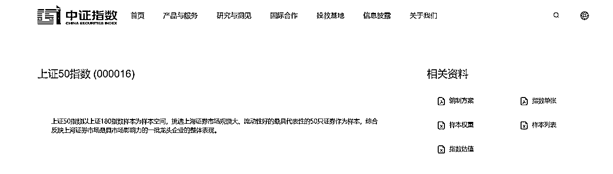

指数搜索方式：可以看我这篇文章

十大权重股分布

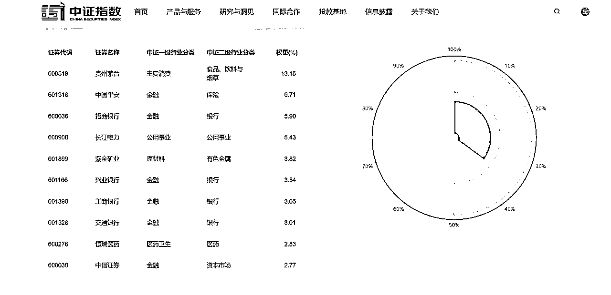

对应的产品去搜索

天天基金网：https://www.1234567.com.cn/

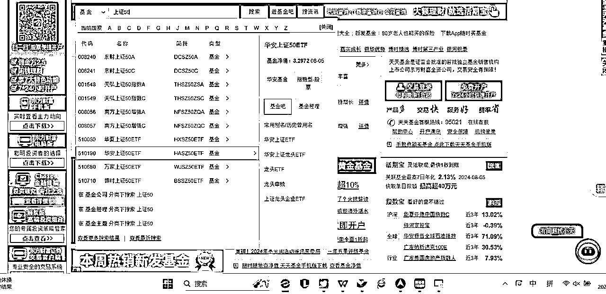

## 沪深300

沪深300指数由沪深市场中规模大、流动性好的最具代表性的300只证券组成，于2005年4月8日正式发布，以反映沪深市场上市公司证券的整体表现。

上交所和深交所规模最大、流动性最好的300只股票；以大公司为主；市值规模占国内股市全部规模60%以上；国内股市最具代表性的指数。

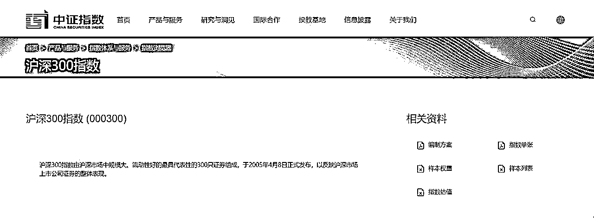

十大权重

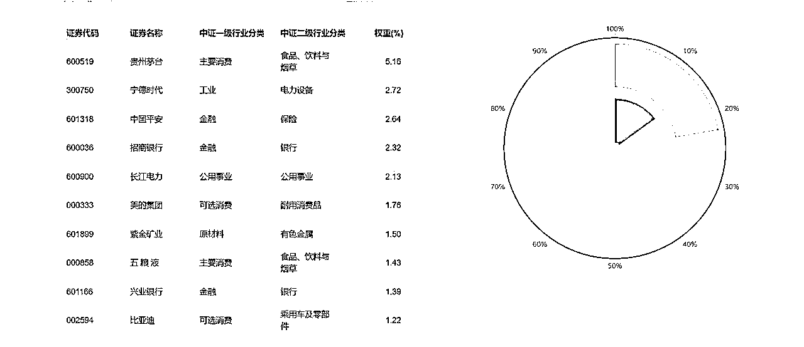

## 中证 500

在样本空间中剔除沪深 300 指数样本以及过去一年日均总市值排名 前 300 的证券；对样本空间内剩余证券按照过去一年日均成交金额由高到低排名， 剔除排名后 20%的证券；将剩余证券按照过去一年日均总市值由高到低进行排名，选取排名 前 500 的证券作为指数样本。

中证500指数：由全部A股中剔除沪深300指数成份股及总市值排名前300名的股票后，总市值排名靠前的500只股票组成。综合反映中国A股市场中一批中小市值公司的股票价格表现。

*   上证50指数：上交所的大型企业。

*   沪深300指数：上交所和深交所的大型企业。

*   中证500指数：上交所和深交所的中型企业。

中证500指数的代码为000905+399905，

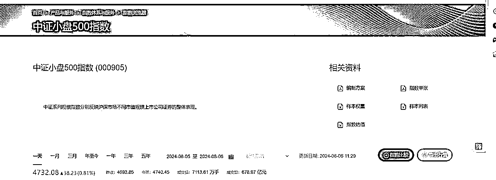

十大权重

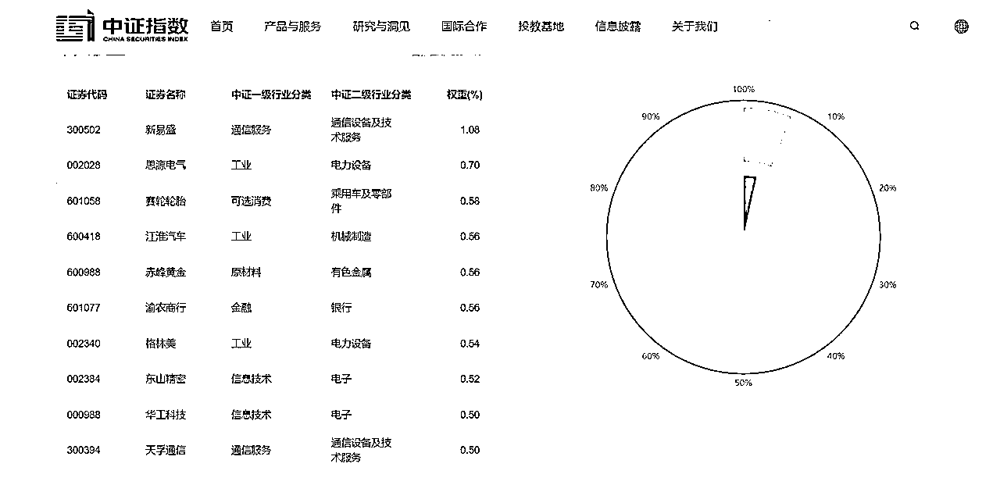

## 创业板指

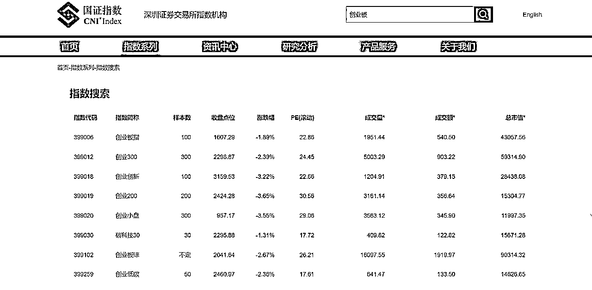

什么是主板？

对发行人的营业期限、股本大小、盈利水平、最低市值等方面的要求标准较高，上市企业多为大型成熟企业，具有较大的资本规模以及稳定的盈利能力

主板上市条件是？

1 最近3个会计年度净利润为正并且累计超过人民币3000万元

2 最近3个会计年度经营活动产生的现金流量净额累计超过人民币5000万元

3 或者最近3个会计年度营业收入累计超过人民币3亿元

对应的产品：（搜素原理同上）

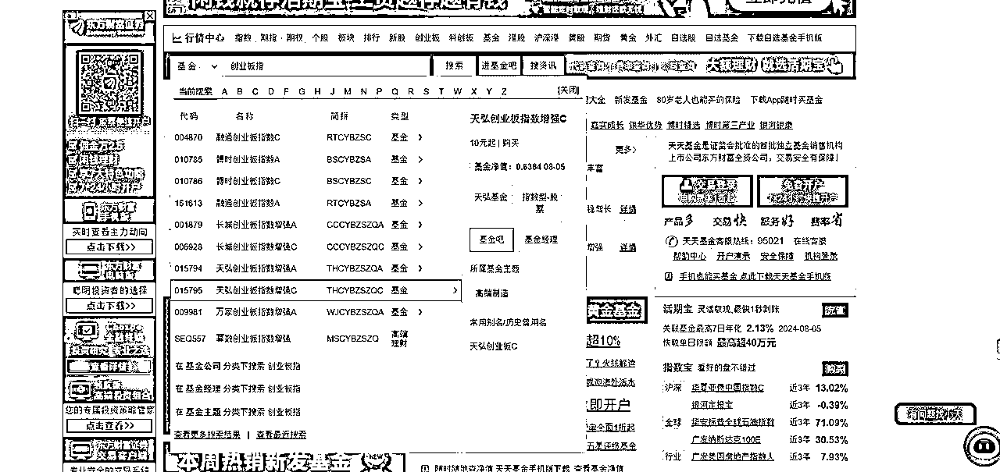

# 实操和应用

## 实操流程

1 下载天天基金app(手机软件里面直接搜 “天天基金”

2 找到指数宝

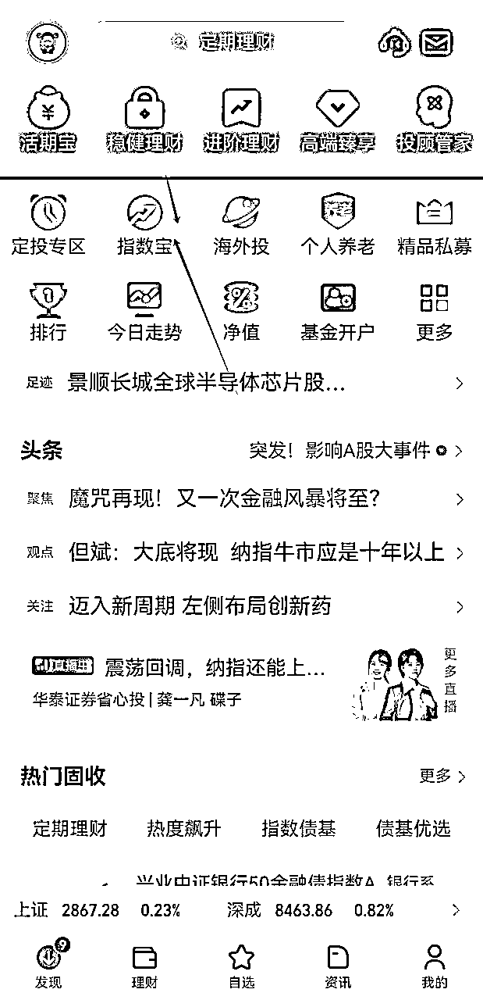

3 找到更多宽基指数

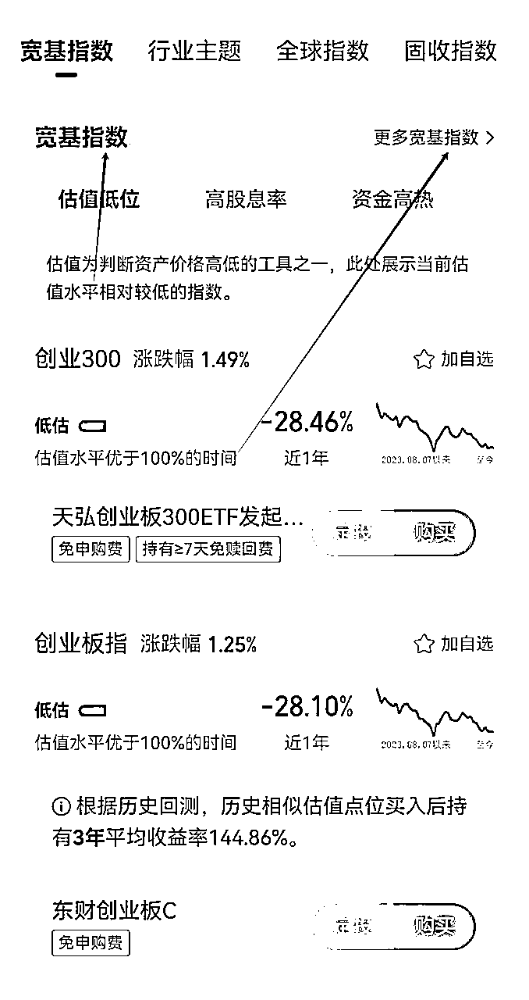

4 找到今天说的中证500（今天举例的）

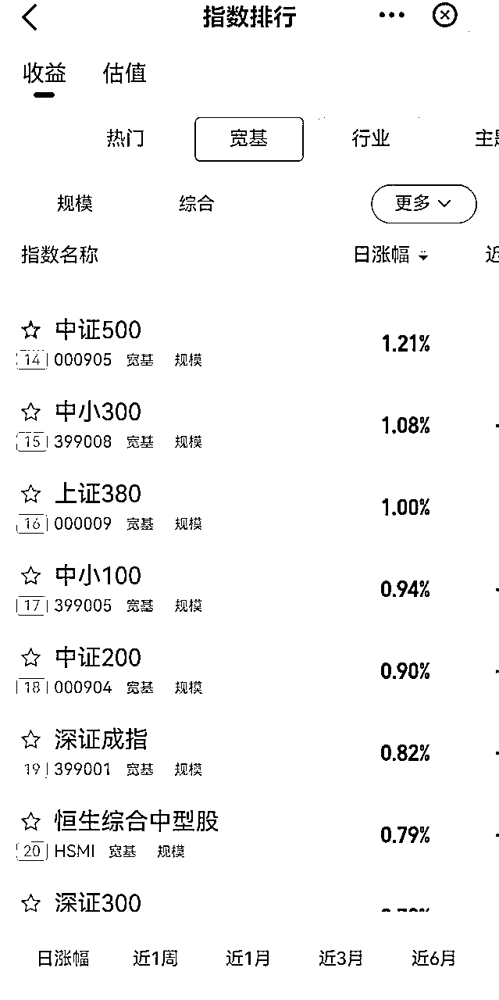

5 跟踪基金可以看到对应的产品

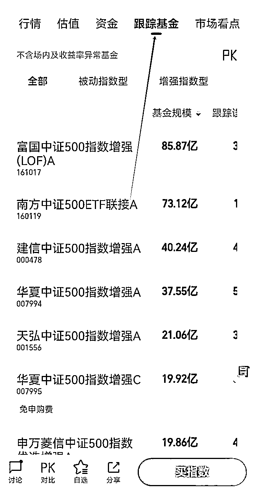

5 估值这里可以看到pe百分位处于低估位置

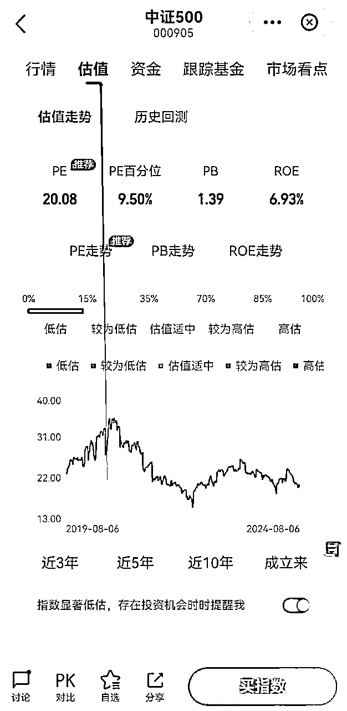

## 总结:

第一步确定指数

第二步找到自己的“指数”，继续点击“跟踪基金”，找到对应靠谱基金公司所对应的产品

第三步结合规模、年限、费用及跟踪误差锁定指数基金

具体方法：

# 风险提示

以上图片皆为参考案例，不构成投资建议。市场有风险，投资需谨慎。在决定投资前，如有需要，投资者务必专业人士咨询并谨慎决策。在任何情况下，本报告中的信息或所表述的意见均不构成对任何人的投资建议。

本报告仅反映报告作者的出具日的观点和判断，在任何情况下，本报告中的信息或所表述的意见均不构成对任何人的投资建议，投资者应当对本报告中的信息和意见进行独立评估，并应同时考量各自的投资目的、财务状况和特定需求。对依据或者使用本报告所造成的一切后果，本公司及/或其关联人员均不承担任何法律责任。

好啦，今天的分享到这啦。