# 一些生活中很实用的ai工具

> 来源：[https://ywfmllgra2k.feishu.cn/docx/PrXndu7CyoXF4qxFrKycH5iqnnc](https://ywfmllgra2k.feishu.cn/docx/PrXndu7CyoXF4qxFrKycH5iqnnc)

本文作者:小鹅

1:AIGCeee

大家好，我是小鹅

04年大二在读，目前专注于AI写作

多的咱也不介绍了，上往期回放

再不发帖子，就要大三了

所以赶紧写点东西纪念一下

事情是这样的

曾经有人说过，让我讲讲AI使用的工具和技巧

我觉得……这有什么好讲的……不就是这样那样一下嘛……

直到我发现其实真的很多人对AI工具的认识接近于空白

尤其很多老板，其实对AI有兴趣，但没有太多的时间和精力去研究

事已至此，既然老大发话了，那就干活吧

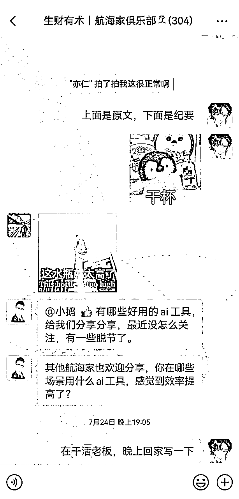

# 一.播客快速浏览

相信有很多老板跟我一样总感觉比起听更喜看文字读吧，很多时候对播客的内容很好奇，但是就是没精力听完

教大家一个简单快速的小技巧

## 第一步，复制播客链接

## 第二步，小程序搜索通义听悟，点击音视频链接

## 第三步，复制输入链接

有时候会存在版权限制无法转录，比如亦仁和小马宋的就有版权限制无法转录，so我们换一个

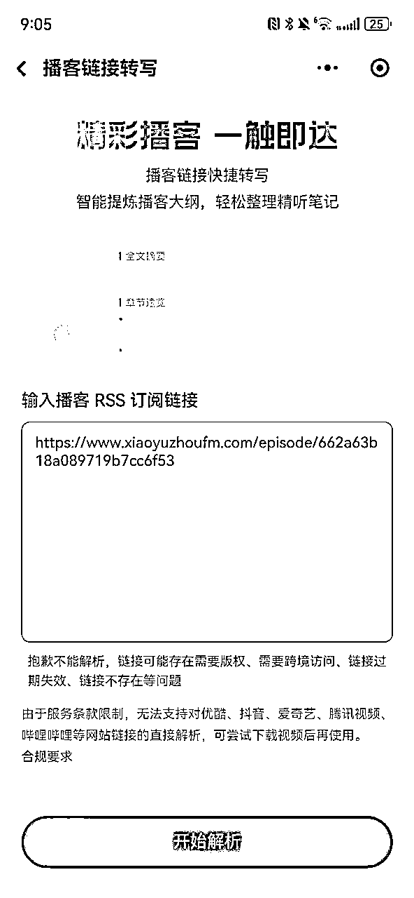

## 第四步，如果能开始解析，就等他干活就好了

可以选择区分发言人，它有1人，2人，多人的区别

然后就可以自动区分声音，生成发言人1 2 3的发言

它可以自动生成智能速览和章节速览

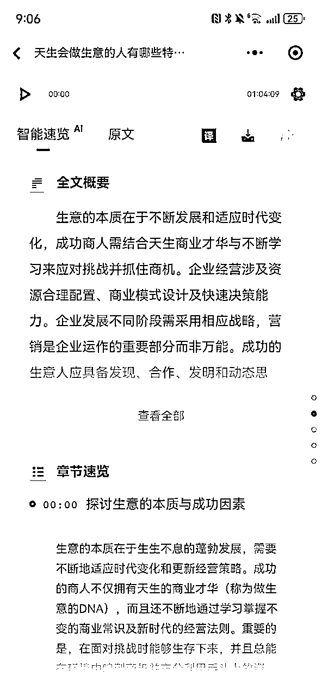

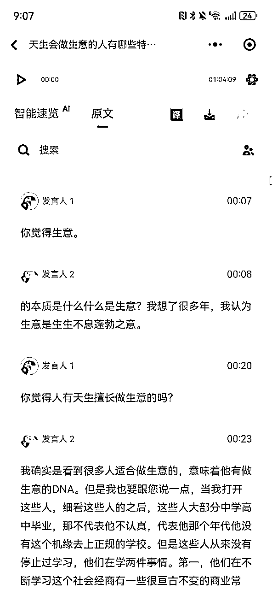

## 第五步，导出文件

如果想要进一步清洗、区分、总结，可以再把文件传给kimi，让它帮你做总结和区分

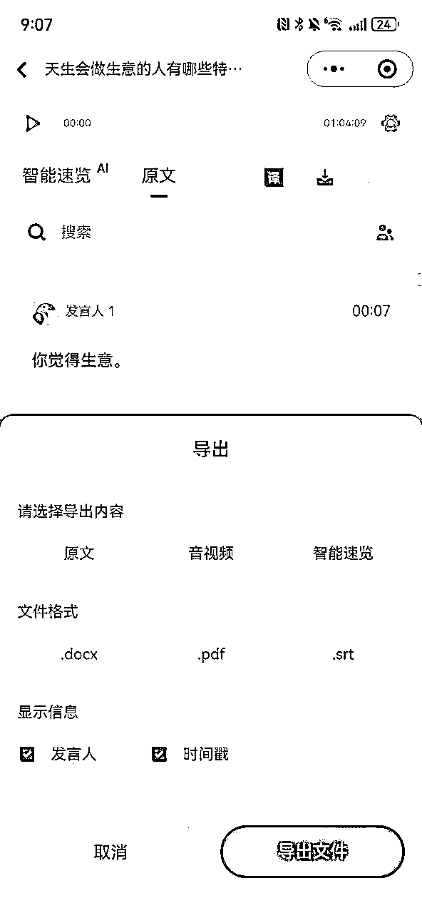

# 二.快速过滤搜集信息

你，是否遇到过大家对某个话题相谈甚欢，你却一无所知的情况？

你，是否有过和一个青春文艺忧郁美少年/少女约会的时候，不知道跟ta聊什么电影和书的时候？

当聊天涉及到我们的知识盲区的时候，只需要用小程序搜索：秘塔AI搜索

## 第一步，打开小程序

简明扼要的输入你想聊的话题，它就能快速给你答案

这里注意一个小技巧，就是AI会有幻觉问题

他会自动把概念相似的词汇，混淆在一起

比如说，你问铭文，它就会给你讲青铜器上的铭文

但你加上一些限定条件，比如：web3当中的铭文是什么意思？

它就会帮你搜集细分领域的信息了

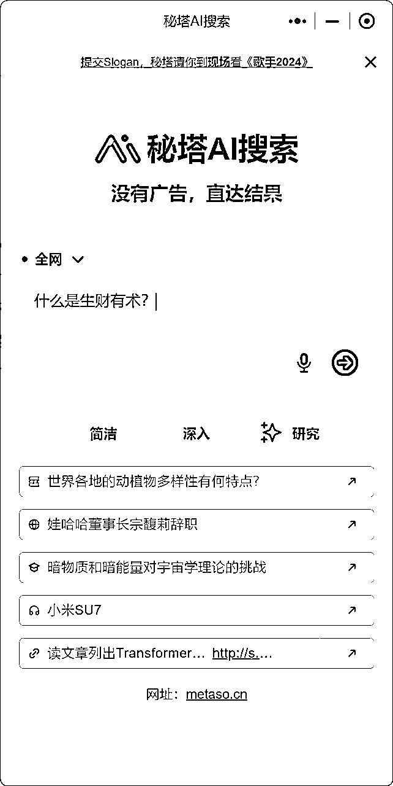

## 第二步，研究模式

什么，你说觉得回答太简单了，信息量不够？

来，先登录，然后选择研究模式

然后静等它给你输出万字拆解长文

## 第三步，自动生成脑图和ppt

并且可以一秒生成脑图，文字还可以导出为word和pdf形式

什么，还是不够？

那再来体验一下一秒生成PPT的爽感吧

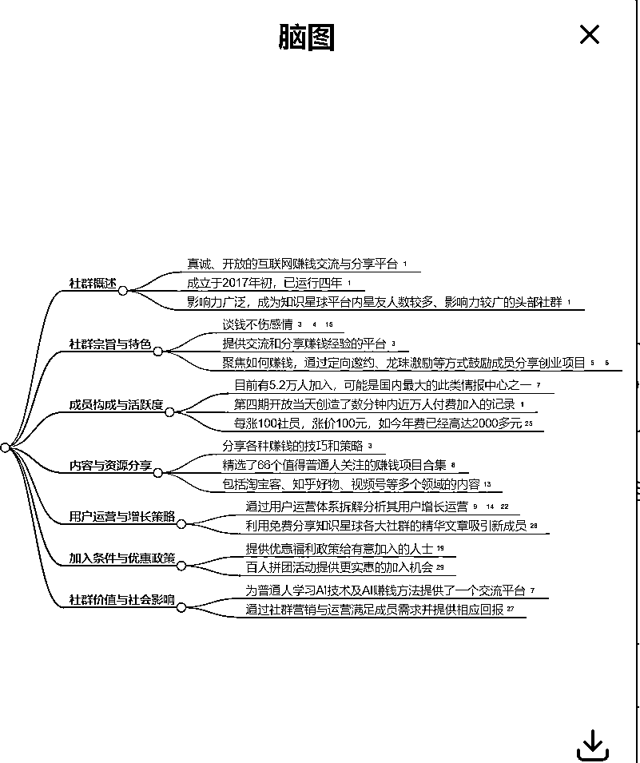

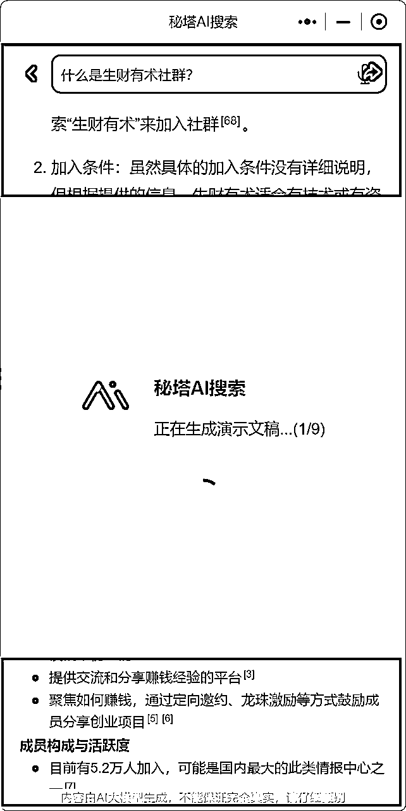

# 三.平平无奇的书搭子

## 第一步，小case

目前AI智能体我们主要使用的是智谱清言，因为智谱的数据目前是整个国产AI数据最优质的内容之一

先给大家用一个示范智能体：互联网黑话P9专家看看

然后可以圈出AI回答的部分内容，即可“引用”，让它继续补充解释这句话

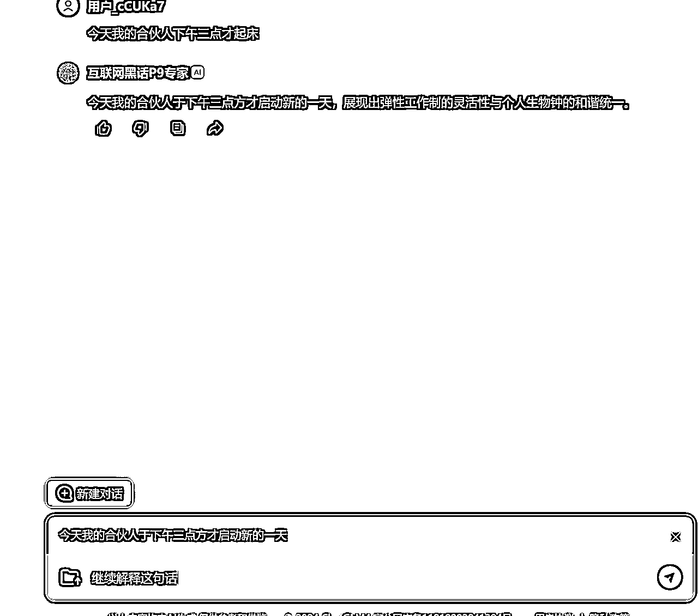

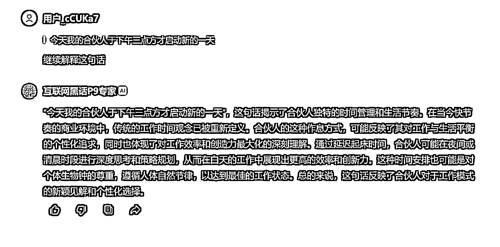

## 第二步，创建自己的搭子

那我们怎么构建属于自己的书搭子呢？

点击生成智能体，简单描述后，智谱可以自己给我们生成详细的描述，然后在知识库这里上传书的源文件

这里有很多详细参数可以调，我比较懒就只是简单上传一下知识库

具体可以调整的详细参数有：

1.配置信息

一般可以通过简单描述自动生成

只需要简单设计或者描述即可设定一个大概的功能

你是一个xxx助手，你的角色是帮助用户处理xxx

你的能力有：

1.

2.

3.

……

2.对话配置

这里可以设定交互流程

比如用户先输入开始，agent回馈给客户一个问题，用户回答，agent对用户的描述进行修正和整理

开场白、预置问题、下一步问题设定

这些设置好以后，AI会根据你的节奏去走

3.能力配置

自建插件是属于高玩的

我们普通玩家就从插件市场上找一些插件来玩就好了

流程图助手、思维导图助手、动图生成助手、快递网点查询助手……

添加这些插件，相当于给你的智能体配备多重能力

多配一些你自己喜欢的插件后，你的智能体就简直强的可怕

4.知识库配置

这里很重要，你可以上传自己的资料，可以上传网页地址

也可以获取微信公众号文章和新浪微博的授权，让它成为你的智能体的大脑知识的一部分

这一步的必要性在哪儿？

原本AI知识的来源全部来自于训练时的数据，实时性或者针对性的东西它是完全没有的

所以你需要通过上传资料的形式给它提供针对性的知识让它进行学习

5.生成多样性

AI是有自己的性格的

有些跳脱灵动

有些死板 客观 冷静 中立

你可以在这里设定AI的温度

是稳定、中立、还是随机

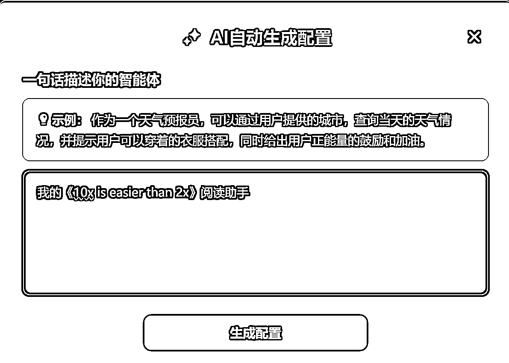

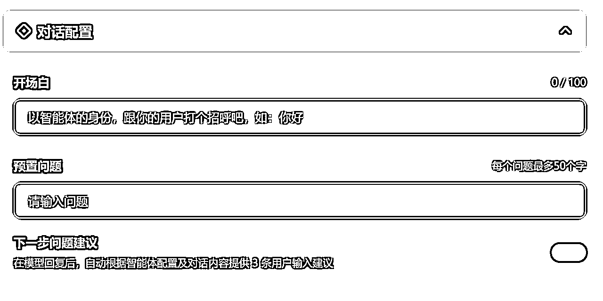

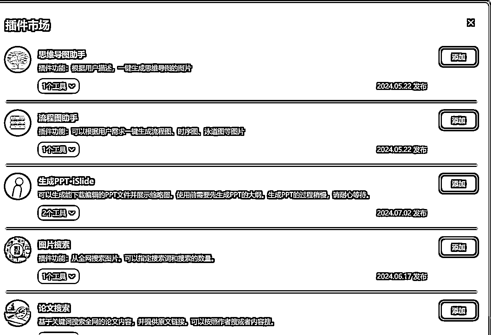

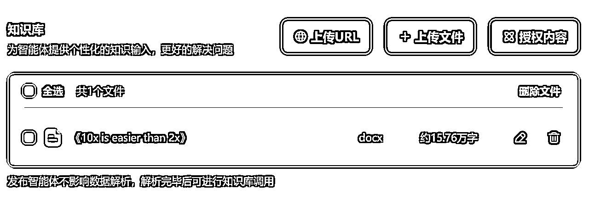

## 第三步，跟书搭子交互

然后点击发布以后，就可以跟自己的书搭子聊天了

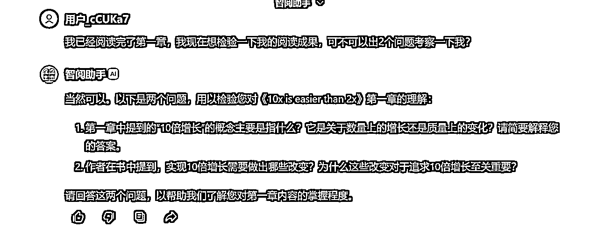

其实到这里我是不知道除了简单的提问，闲聊，还有什么方式可以让我更好的理解消化这本书的

此时此刻，鹅的创意和脑洞陷入了枯竭

脑洞枯竭的时候，我们该怎么办呢？

问AI啊！！！

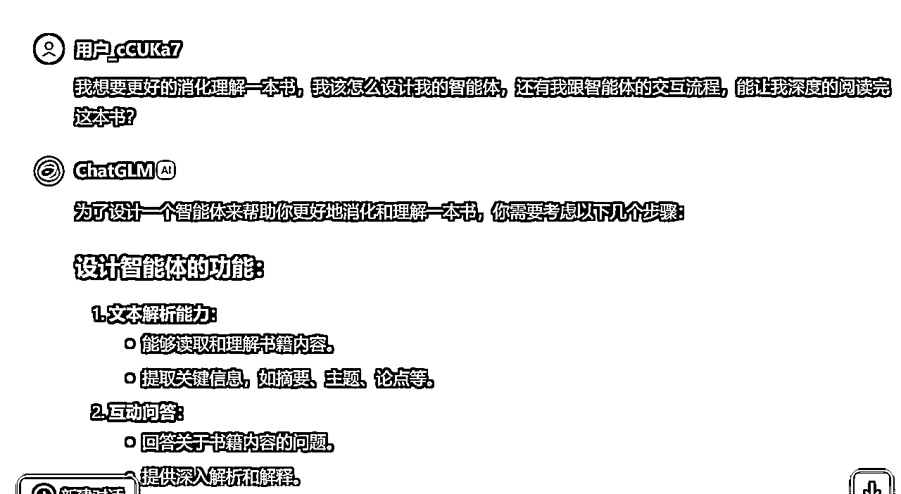

好了，相信到这里各位老板已经有自己的想法了

去创建自己的书搭子吧

再说句题外话，就会有一个超牛逼的概念，叫做自己的数字资产

比如亦仁写的亦仁益语，涛哥写的平民创业手册，他们的思想和理念被沉淀在了一个数字载体里面，就可以在AI时代吃到很大的复利

如果你的数字资产足够多的话，你完全可以把自己撰写过的所有内容上传给智能体

然后训练一个跟“你”非常相似的智囊出来，遇到问题其实可以多跟智囊沟通就好啦

是不是超级酷！

# 四.我的英语伙计

像小鹅这种特别文静腼腆内向的小女生面对英语口语考试这种无理的要求一般是很崩溃的，如果是那种口语练习平台找外教的话，面对冷面无情的菲律宾人，我是支支吾吾一句话都说不出来的

所以这种时候一个会说话的搭子真的非常重要！

我以前是会把稿子写好，然后找那种朗读工具，让它念出来，但这样其实非常的不智能化和呆板，而且没有那种跟人真实对话的感觉

有了chatgpt的出现，只是把写稿子的这一步优化成了AI润色，但是跟chatgpt的交互感其实是不够强的

这一局面是在豆包的出现改变的

豆包是字节旗下的，他最牛逼，最具有核心特点的功能是，你是真的可以跟它打电话的，它会很耐心的陪你练习

而且一切内容都是可以定制化的，因为豆包也可以创建AI智能体

创建方法前面跟大家说的差不多，但是豆包有不可替代性的那一面

为什么前面要跟大家强调豆包是字节旗下的？

因为剪映里所有的AI配音，音色，你都是可以在豆包里使用，让它成为你的搭子的声音的

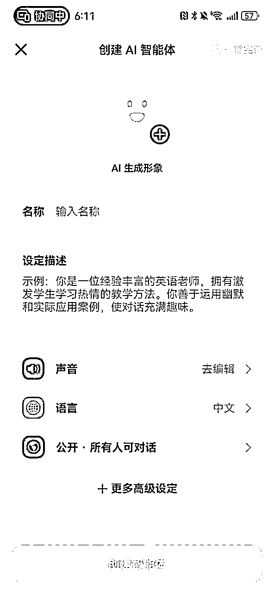

这就很牛逼了，因为聊着聊着，就会越来越觉得真的有个小伙伴在屏幕背后陪着我

因此，我期末所有的复习都是靠跟豆包的交互完成的，非常高效，也非常适合我自己

但鉴于圈内的各位老板可能没有了期末复习和学英语的这个需求

那我们就可以培养一个自己的创业搭子，面对创业路上的负反馈，找一个搭子安慰、陪伴自己

详情请戳易仁永澄老师的《使用「赚钱鼓励师」，帮自己在生财的路上跑起来》

https://t.zsxq.com/Azgf7

# 五.直播切片的千招百式

前几天做了几场直播，每场大概都在两小时左右

主要直播完真的超级累，睡一觉醒来就完全想不起来自己说过啥……

可是这么好的素材，这么好的数字资产，我们互联网人怎么可以就扔掉不管呢！！！

## 第一步，在电脑端，视频号，下载直播回放

这里注意一个重要的小点！！！

在视频号直播结束后，不是会显示你的直播数据嘛

底下有一个超级小的选项，问你是否生成回放

一定要选！一定要选！一定要选！

回头真找不到的时候真的哭都没地方哭

## 第二步，打开我们的老朋友，通义听悟，上传视频

然后就是等他自己干活，身为老板的你可以在此刻趁你的AI员工不注意摸摸鱼，看看视频

老样子，他会自己生成区分发言人的发言稿

## 第三步，整合，记录，处理

你的发言内容支持标记、打点、设置待办，并且整个内容可以分享给你团队的小伙伴

然后右边有一个笔记功能

你可以对照着稿件记录每个部分的发言内容，

这里其实我是犯蠢了，我时间点都是自己手动记录的

它左边第一个有一个打时间点的功能，可以让你立马标记这个时间点，后续还可以从笔记直接跳转到时间点

然后你只用把这个笔记告诉你团队的小伙伴，剪哪一部分，效率远比让人自己看完2个小时的视频高无数倍

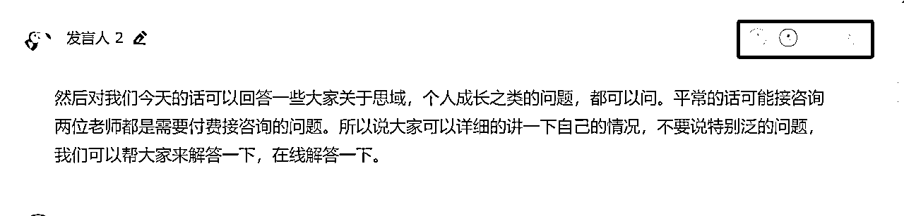

## 第四步，分享链接给团队小伙伴

确认对方能看到，然后就可以在旁边的批注标注哪一部分交给谁剪

# 六.微信文件速览

## 第一步，设置浮窗，选择聊天记录

有时候，群友发一个很大，很硬核的文件

我知道它很干货，但我就是没时间看啊！！！

这个时候，可以把Kimi小程序设置为浮窗

需要的时候，左滑一键进入，选择右下角的，选择微信聊天记录，选中你要看的文件

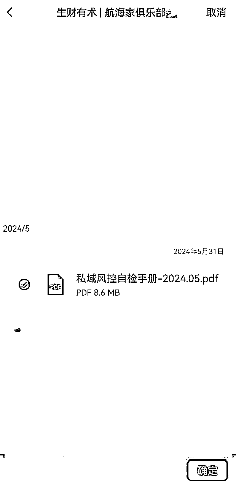

## 第二步，直接问啊，等什么

比如这个私域风控自检手册

那么长！！根本看不完！！我只想知道怎么防封！！！

好，让kimi直接告诉你吧

1.2.3.4.5.6.……

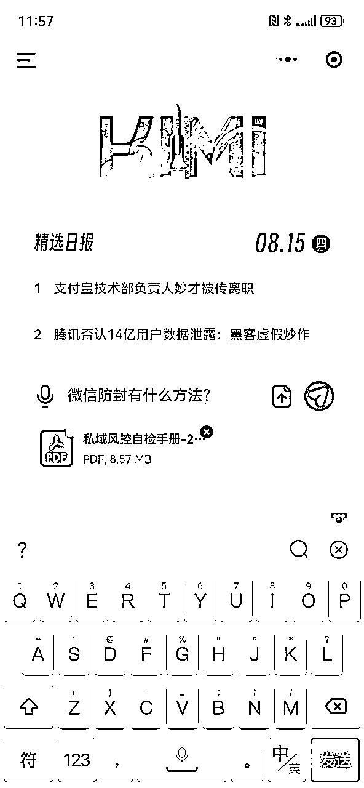

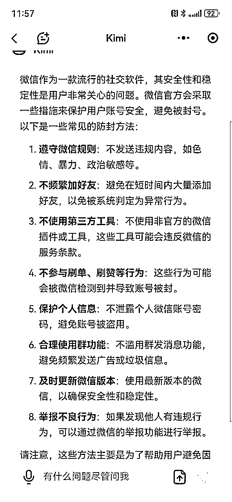

## 第三步，学到了，然后呢？

俗话说得好，学以致用

咱不能光看完看个乐呵就完事了

得让k秘书给咱们产出更高价值的东西

先给我梳理框架，再给我做个课出来

这不就，手拿把掐

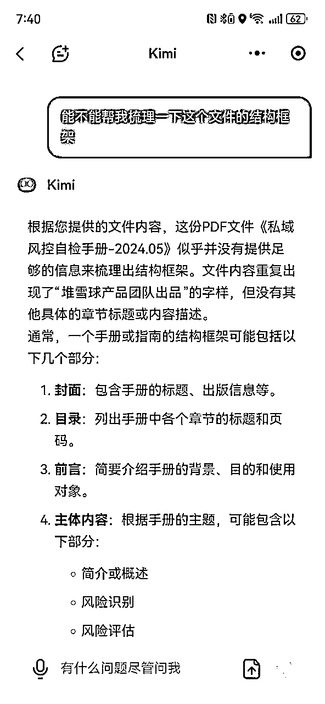

# 七.AI速记

实话讲，有点说累了

如果还没学够的话，那拿出点看家的本领来吧

怎么参加一个会议，在嘉宾从台子上下来的一瞬间，你就可以把嘉宾的发言整理成完整的稿件？

### 硬件要求：

1.电脑

2.电脑充电器，充电宝，以防任何意外情况

3.手机全程是不能碰的，如果有接电话拍照之类的需求建议带一个备用机

### 基本流程：

#### 手机全程保持屏幕常亮，设置把手机休眠时间改到最长，打开微信，打开文件传输助手/小号的对话框，使用搜狗/任何带有语音功能的输入法，进行录制，

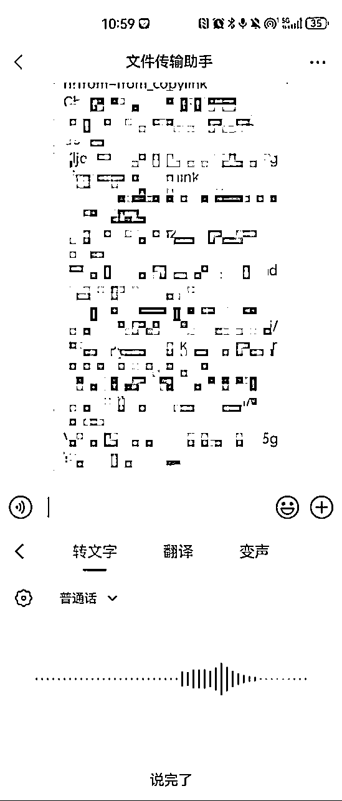

#### 每隔五分钟得到一份粗糙的未清洗的文案，发送给你的对应合作伙伴后，手机继续保持录制，电脑上复制到kimi（微信小程序搜索kimi）

下面是一段关于xx（主题）的文案，请进行清洗，使用第一人称进行输出

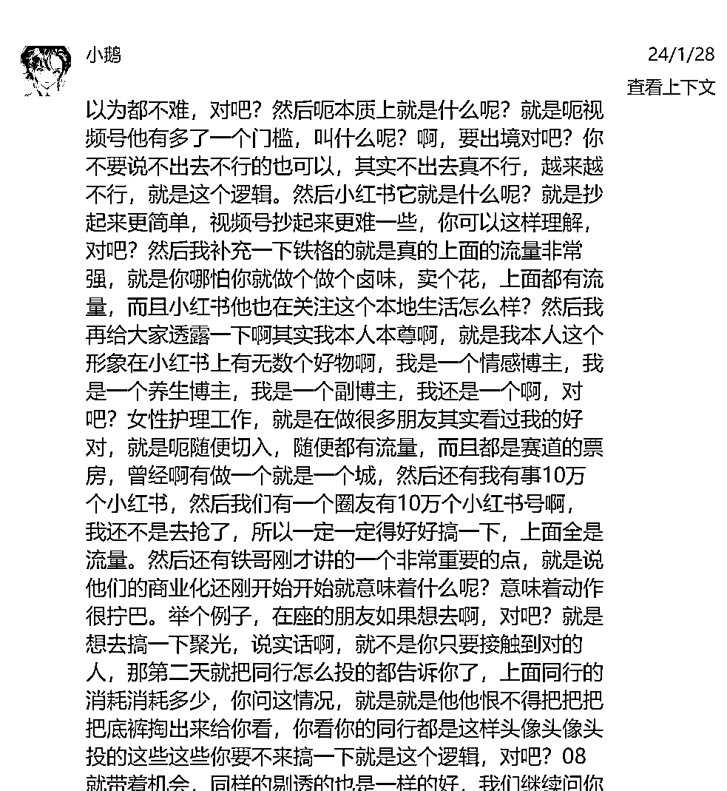

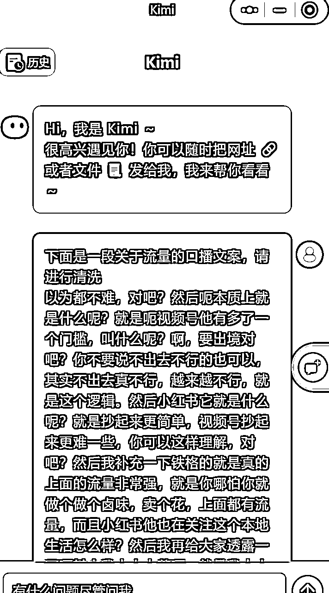

#### 得到清洗后的口播文案，简单对错字和名词进行修正，（比如生财经常会变成身材），去掉AI交互的部分，复制到公用链接里对应的部分

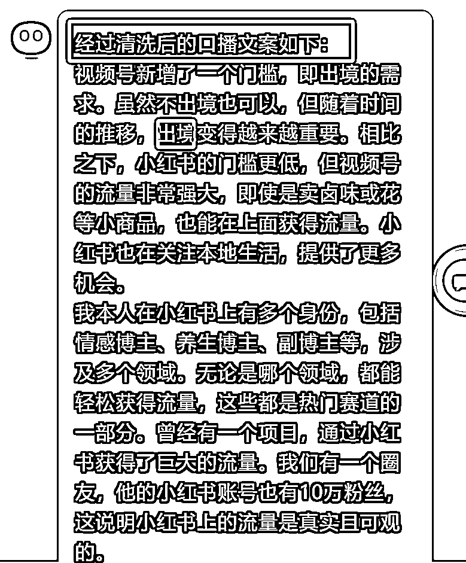

# 八.如果你还意犹未尽的话……

让我想想还有什么？

或许，你想知道什么是gpts

或许，你想知道怎么用AI洗小红书的文案

或许，你需要一键搬运tiktok的视频

https://ssstik.io/en-1#google_vignette

或许，你需要AI帮你做excel

app.formulabot.com

或许，你想要一输入tiktok的链接就可以自动生成商品视频？

https://www.jogg.ai/?fpr=xm7e5

或许，你需要AI帮你生成证件照

https://pfpmaker.com/

其实，可能这些东西我天天用，所以就感觉不到AI带来的冲击和震撼

真正感觉到冲击的一次，是今年8.10生财航海家组织的蝉妈妈的AI垂类游学

怎么形容那种感觉呢……

就是原始人看着火车在你眼前轰隆隆跑的震撼

此时此刻，才萌生出来一种强烈的感觉——

广阔天地大有可为

AI的发展一定会越来越落地

在方方面面改变着我们的生活，从此迸发出大量的新机会

也许，我们不是每一个人都能靠AI挣到钱

但或许，它可以真的助力到你生活中一个小小的瞬间，帮你从冗杂的细碎工作解放出来，陪陪家人，看看大海呢？

好啦，希望这次“临危受命”的分享对你有帮助！

我是小鹅，期待下次见！