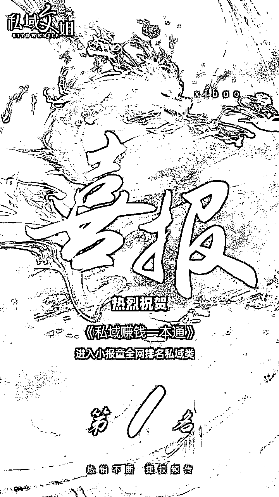
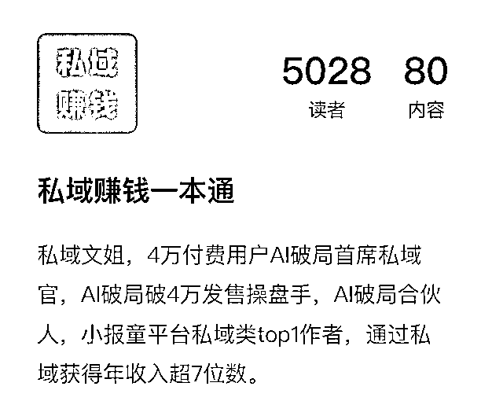

# 小报童发售超5000，其他小报童2天推广超1000单经验分享

> 来源：[https://vwyrp1o8uqk.feishu.cn/docx/I7nkdGxP7oBh8QxEK4ScKYNDngc](https://vwyrp1o8uqk.feishu.cn/docx/I7nkdGxP7oBh8QxEK4ScKYNDngc)

大家好，我是私域文姐，一个专为i人打造的不销而销私域教练。

这次主要是分享2个经验：

1、通过2天时间搞定小报童推广1000+单，并获得第一。

2、自己的小报童已推广成功5000单，总 GMV 5W，成为小报童平台订阅量综合前10，私域类第1。

# 一、2天搞定推广1000单

首先是分享一下2天搞定推广1000单的小经验。

## 1、为什么要打榜？

第1个原因是主理人给的福利足够吸引人，通过成本计算后值得去打榜

第2个原因是打榜也是在支持主理人，每个主理人都是希望自己的发售数据能越多越好，这是一个结交主理人 的好机会。

第3个原因是打榜能够增强自己的势能，更快的被看见，让大家都知道你就是销冠，你背后有强大的流量支持。

## 2、怎么能快速冲到1000单？

通过1个人快速冲1000单是基本不可能的，那么就需要一支很强大的团队，我先通过文胜军组合最开始冲500单，当时觉得500单差不多能拿到第1。

后面发现第二名的对手异常强大，500单也没办法稳住第一了，但我没有时间每天都在打榜上，我需要快速集结力量冲榜，于是在我的各个KOL群里发布了一条信息，没想到立马就有很多KOL帮我一起打榜，他们用我的码快速的去他们自己的社群推广，我们不到1天就搞定了1000单。

为什么KOL会愿意花时间帮我？

一个是我日常也有帮助对方，大家相互帮助，第2我也设置了一些奖励制度，不过这个是大家在帮我冲榜之后的。

## 3、如何用策略保障自己能低成本冲到第一

一般就1个策略，最早占据第一的位置，并与第2名拉开差距，并公开告诉大家你这次就是为了第一的位置来的。这样别人会放弃这次冲榜的念头。

# 二、小报童推广到5000单

这次推广我自己的小报童，我自己只推了600多单，437人推广成功，纯私域裂变了近4400单，新增私域好友超3000人。分享一下我觉得有用的几点经验。

## 1、内容一定要足够多

这个大家能看到，一般能卖到3000单以上的都是至少有50篇文章以上的。

## 2、定位和标题，目录都很重要

我的小册一共改过1次定位，4次标题

第一次我计划只写不销而销的秘诀，后面胜哥提醒我这个方向有点太窄了，销量不一定理想，所以我改成了私域这个更大的范围，

第二次是洋哥提醒我标题门槛有点太高了，我又改了一次，第3、4次是把名字改的更好理解，比如变现直接改成了赚钱，这样大家没有思考成本，明白易懂。

## 3、注重奖励机制

奖励机制是对一般的KOC最有动力的力量来源，现在小报童越来越卷了，产品卖的好取决于2点，一个是好卖，一个是激励机制够强，小报童太多了，大家为什么要卖你的，基本上也就是这么2个点了。

## 4、二八原则，多找KOL帮忙

这次推广成功的427人中，前30名就推广成功了3000多单，所以我们日常要多积累和KOL的缘份，相互帮助，之后KOL也愿意帮你推，要么付费要么多帮助对方，日常就要积累人脉。

## 5、注意发售的时长

一般发售的时长大约2-3周是最好的，时间太短，可能有些朋友还没有有时间帮忙推，时间太长，到最后大家都推不动了，发售氛围会比较艰难。

## 6、提升群内的发售氛围

每天要及时的提醒 大家去帮忙发朋友圈，要私聊KOL帮忙推，一定要主动，不能太佛系，而且群里氛围要营造的比较轻松愉悦，让大家乐意帮你推。