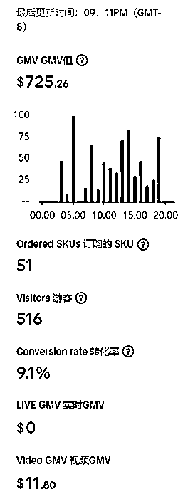
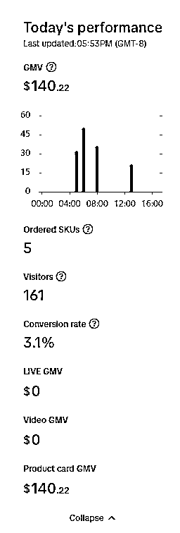
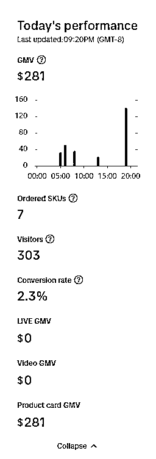
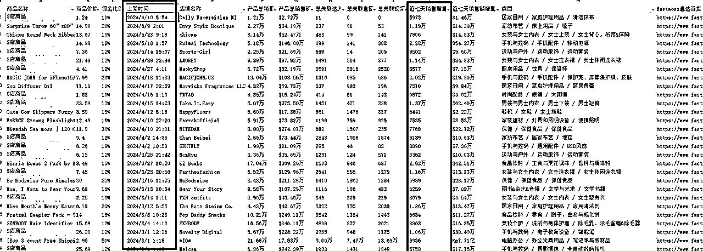
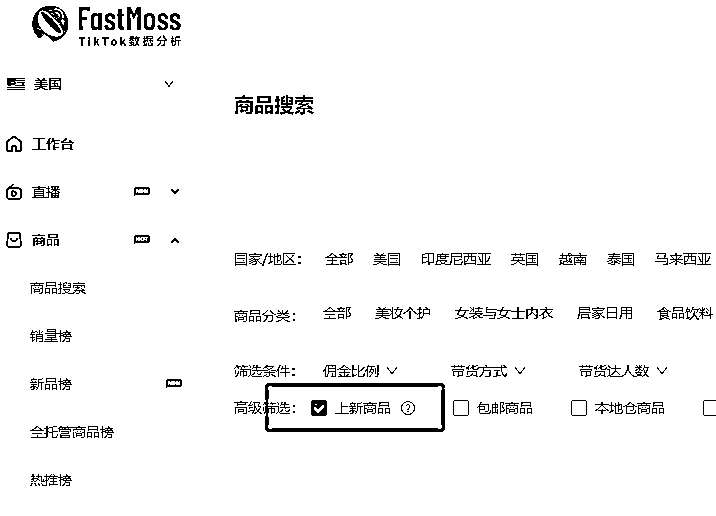
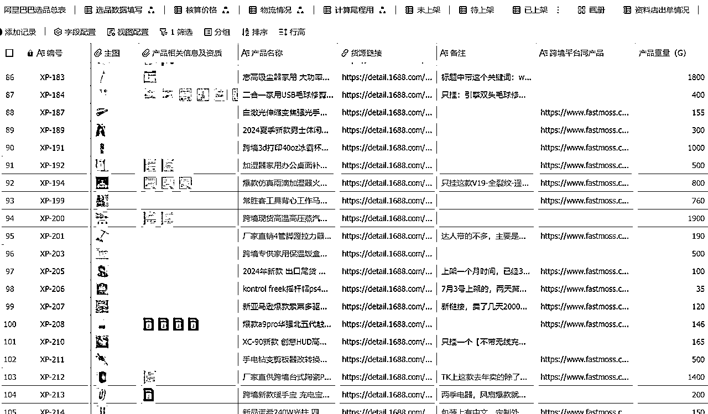

# 用漏斗思维做 TikTok 美区跟品，资料店出单8000美金

> 来源：[https://ghlf0s3q3l.feishu.cn/docx/IShhdieKWoMzpixNtXYcfnIYntf](https://ghlf0s3q3l.feishu.cn/docx/IShhdieKWoMzpixNtXYcfnIYntf)

# 前言

大家好，我是万航宇，做 TikTok 美区已经一年了。首先说明一下，测品店是不发货的，只是为了测试产品的自然流量决定是否跟品，8000美金也是多个店铺的出单总和，这篇文章主要是讲述漏斗模型来跟品筛品的一个逻辑和流程分享。

因为当我想要仔细研究选品的时候发现那么多的资料和教程都在说一种比较玄的东西，也不知道怎么落地执行。因为要备货到海外仓，所以有比较大的风险，想要用一套科学的方法，确定性高的方法去完成选品的动作。

于是我将看到的所有的选品方法都放在了第一层，能看到的，能想到的选品方法选出来的产品都先放在选品库中自动计算价格然后上架到测品店一步一步筛选。

于是就有了下面这张图....

优点是经过市场验证的爆品，跟品可以降低很多风险，主要是截流爆款的商品。缺点是这样比较慢，还需要完善关键词等细节从而获得更多的曝光。

希望能够给到大家启发和帮助~

# 一、漏斗第一层：选品

*   数据驱动选品：用 fastmoss、特看等待数据平台监控市场趋势，选择销量增长快且上架时间短的产品。可以快速找到适合跟品的产品，有潜力的产品。

*   多平台监控：亚马逊、抖音、TikTok、TEMU、阿里巴巴跨境等等，多个销售平台的爆品

## 1.1 用影刀 RPA 抓取数据

抓取到数据之后简单的就是比如通过关键词过滤 S 店商品，降序上架时间，筛选自己感兴趣的类目..或者排除销售量低于 500 的，然后就可以找到有潜力的商品啦～

用影刀 RPA 从 Fastmoss 中抓取产品的数据，主要是产品上架时间、近七天销量，之后就可以通过筛选的方式快速找到最近上架且销量高的产品了。就可以看是自然流量出单的还是达人出的，如果是自然流量为主出单的商品，这个时候我们挂上，大概率也能够出单，测试下来有的产品挂上之后一周内出了一百多单，之后就买了样品回来后确认质量没问题就直接备货到海外仓了。

## 1.2 Fastmoss 直接导出数据

现在 Fastmoss 可以直接勾选近期上架新品了....之前的话没有...就还有一个方案，是导出近七天的产品销售数据，因为有了近七天的销售量数据和总共的销售量和数据，那计算一下两个值之间的差值，越接近说明是越新的品，越接近说明是近期才启动的产品，就大有机会..

# 二、漏斗第二层：合规性

*   合规与可销售性检查：确保产品可以合法销售，具备所需的认证和证书，确认没有专利或版权问题。

筛选出可以上架的产品，因为有的被包销了，有的没有证书，有的无法上架。

这一步就筛出了可以上架的产品，证书齐全的产品。

但是专利版权之类的一些不会一下子下链接....卖一段时间才会出问题..这是比较坑的地方。所以可以看看同样的产品是不是有好几家店在卖，这样安全性也比较高一些，或者用卖家精灵之类的去查一下外观专利。卖家精灵付费可以查产品外观专利相似度，相似度比较高那肯定是有风险的。

# 三、漏斗第三层：优化产品链接

*   头图优化：选择或者制作有差异化的产品首图，以提高点击率。

*   价格策略：通过设置较低的显示价格吸引用户点击，同时可适当通过调整运费来平衡成本。

*   促销活动：利用限时优惠、秒杀等策略刺激购买。

*   SEO 优化：优化产品标题和关键词，提高搜索引擎的可见度。

*   社交证明：通过刷单等方式增加评价数量和商品评分，提升商品的信誉度。

产品有曝光之后也是需要优化链接的，因为是用自然流方式测品，所以核心就是商品卡，而用户商品卡外面看到的信息主要是产品的头图、价格、产品名称、活动、已售出多少件，评价数量，商品评分..

所以想要用户点击无非就是优化这几个点。可以同一个链接出单之后，多复制几个，然后修改关键词、头图..比如搜索了一个关键词，你只有一个链接，那你的产品链接只会有一次被用户看到的机会。如果你复制三个呢..就是三次。用数量来对抗算法的不确定性，也大大提高了曝光量和出单的概率。自然流测品环节，效率越高越好。。

## 3.1 头图

头图和其它同产品做出差异化，如果都用一模一样的图片，那就没有什么吸引力，不一样一些就可以从头图上做出差异化。

头图是商品卡中画面占比最高的，所以要做出吸引人和点击的产品图是非常重要的。国内淘宝、拼多多都是各种骚操作，目前 TK 中看到的主要还是白底图为主，尽量选择一个和别人头图不一样的作为首图，一模一样是下下策。

可以加上文字、或者AB测，测试出点击量高的头图，。

## 3.2 价格

价格尽量比其它链接要低，因为是跑自然流测品，所以计算完产品的基本成本之后，不亏本的情况下，价格尽量要比别人低，因为这也是一个很大的优势。如果别人卖的比自己成本还低，那就放弃这个品，继续下一个了。

*   可以上架一个产品设置一个 SKU 低价然后库存设置为 0，这样用户再外面看到的就是那个最低价。

*   可以把一部分价格加在运费里面，比如这个产品定价是 10 美元，但是运费设置了 4.99 美元，产品的链接价格可以是 4.99，反正最后我们到手还是 10 美元这样..但是同样的两个产品商品卡再用户面前，用户会先点击 4.99 美元的产品链接，因为足够的便宜..而不会先点击 10 美元的产品链接..而且有的用户是有包邮券的，所以对于用户来说，可能买的这款产品就是花了4.99。

## 3.3 活动

*   用打折的形式，秒杀的形式，优惠券的形式这些方式都可以促进用户下单。

*   秒杀可以带来危机感，这个价格还有多久多久就结束了，也算是一种逼单，让用户尽快下单，不然这个优惠的价格就没有了。

*   打折的形式可以设置一个比较高的原价，然后然后再打折打下来，让用户有一种买了就很划算的感觉。

*   官方还有很多活动，能报名的也可以报名上，正式店铺的运营也是如此。

## 3.4 产品名称（关键词）

标题非常重要，决定着是否能被用户搜索到。通过关键词获取搜索流量，所以要做好关键词的优化。

*   具体的方法有很多，比较省事儿和简单的就是直接找别人同产品的高销量的产品链接标题，直接复制然后做修改..

*   骚操作就是在开头加一个自己起的品牌店铺名，或者开头加上 2024 NEW、最后一天、限时抢购等等之类的，让用户搜索关键词进入搜索结果页面之后，第一眼能够看到我们的链接。

*   从亚马逊、谷歌指数，或者借助第三方的关键词工具去找到热门上升的关键词，加在自己的产品名称中从而带来更多被搜索到的机会。

## 3.5 评价数量

评价数量主要是先动销才会有评价，一般的话会先刷几单，这样就有评价了，破0是第一步。然后就慢慢的去养这个链接。就像我们在淘宝买东西一样，肯定是选销量高的，这样有保障，有的0销量的肯定是不敢买...

## 3.6 商品评分

和评价一样，刚开始0销量肯定是都没有的..需要有足够的优势动销起来才会有。

*   关于商品评分，选品的时候也可以多关注一下同产品的评分和评价如何，太低的就不能上架了，后面售后会很麻烦。

# 四、漏斗第四层：转化和买样

*   产品转化分析：分析有转化的产品，进行竞品分析，考虑利润空间后决定是否备货。

*   内容营销：判断是否适合制作符合目标市场的短视频或直播内容，提高产品吸引力。

有自然流的产品，加上后面我们去找达人或者自己通过短视频直播去推流，会更容易做一些，因为产品已经是用户接受程度很高的产品，也是经过市场验证的，不需要去教育用户的使用习惯。

自然流选品也是目前阶段的一个筛选方式，其它选品类型，比如专注投流的团队会去考虑这款产品的合规性，是否容易制作短视频素材内容，是否适合投流等等..也会通过投流的方式去测试素材和产品，点击率和转化率以及投流消耗的金额等等数据来判断..

# 五、漏斗第五层：备货销售

*   海外仓备货：将经过验证的产品备货到海外仓，开始正式销售。

确认了自然流不错，有潜力的产品。并且买了样品回来之后感觉也OK，那就可以备货到海外仓正式销售了。有的产品可能有一定的时效性，就可以用快递的方式尽快运过去销售。如果产品的销售周期比较长期性，就可以通过海运的方式运过去销售，毕竟海运和空运价格相差还挺大的。海运过去还有比较大的价格优势。

# 碎碎念

关于选品思考了很久，也踩坑了不少地方。最终梳理出的一套自然流选品的流程，分享给大家这套思路，现在依然在不断迭代当中。

找到规律和提高成功率的那一刻是最开心的，虽然这样的方式还有很多的限制和不足的地方，但是思考的感觉和过程是最好的。不断迭代，会越来越强！