# 新手玩家公众号如何1个月赚到10w+

> 来源：[https://zymjoclzk2.feishu.cn/docx/IrQndItCkog3Ovxpj8UcUMMAnmg](https://zymjoclzk2.feishu.cn/docx/IrQndItCkog3Ovxpj8UcUMMAnmg)

# 前言

大家好，我是IIXX，因为这个昵称不好叫，大家也叫我字母哥。今天主要想分享一下作为公众号小白，如何通过视频号的玩法从今年6月底开始收入10w+的一些经历。

本文主要有以下几个部分：

1、单号单月收入9.8w，我做了什么

2、放大，测品？测号！

3、跟着周期走

4、心态

❤️先来上一些收益图吧，这是单账号单月9.8万的。

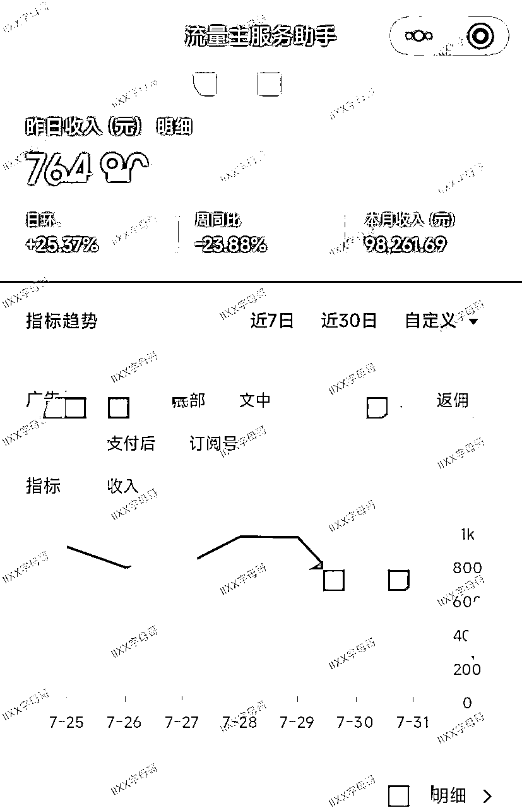

这是一些代运营子账号的数据：

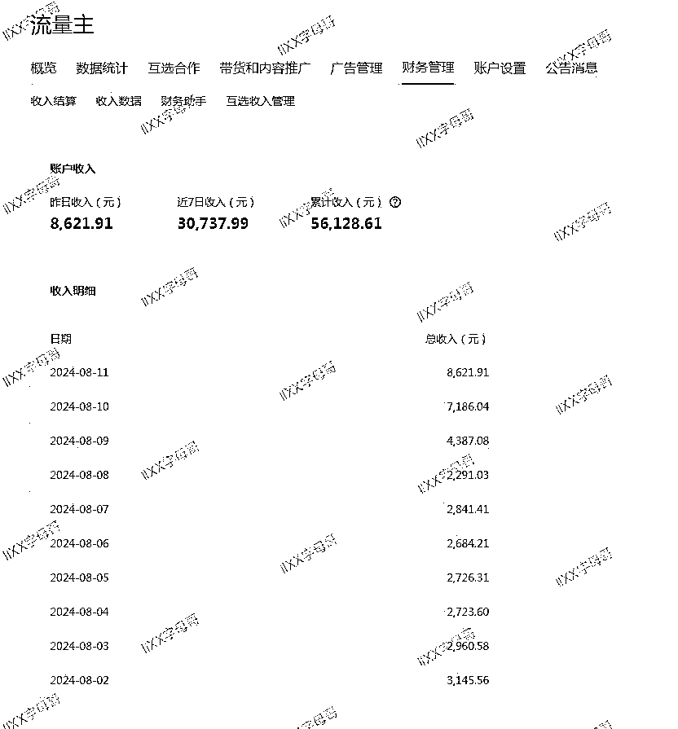

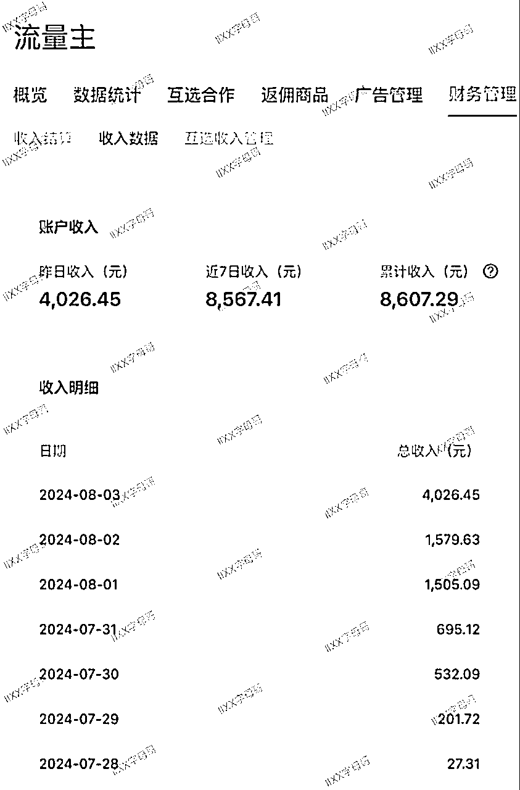

❌当然绝大部分账号都是这样的数据，可能发了一个月，才10块钱收入。

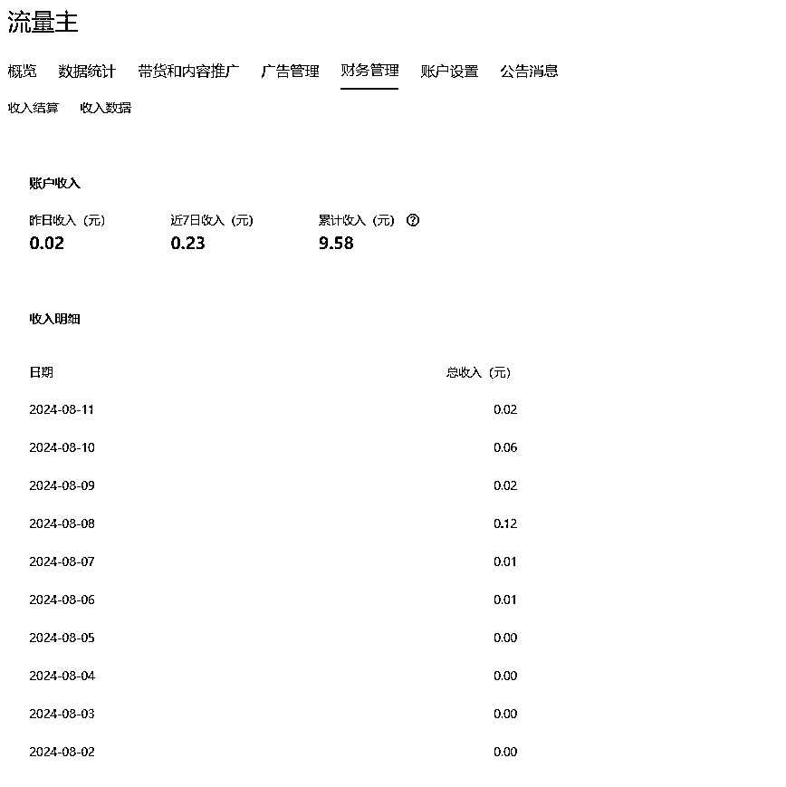

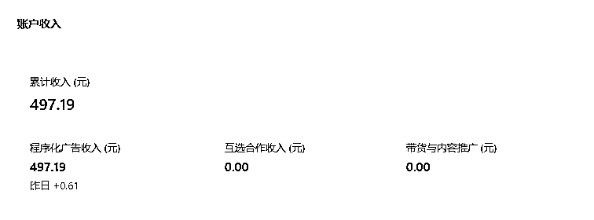

# 1、单号单月收入9.8w，我做了什么

我主业小码农，平时业余时间搞搞副业。之前主要做视频号，不过最近视频号随着入场人数越来越多，也越来越卷，我就没怎么做了，都交给我姐实拍去了，不做之前的抠像混剪了。所以最近几个月有些空闲的时间。恰好6月底看到各个社群开始说公众号好像流量起来了，我就打算开始做做公众号吧，然后命运的齿轮开始转动，❤️在这里十分感谢生财的猫哥，兔子鱼，易生等人的帮助。

其实我之前跟着生财航海做过几次公众号，不过当时还是随便玩玩的心态都是随便发，随缘发了3个月才100多收入。不过当时也没对公众号报太大希望，预期足够低，所以对我来说也没啥影响。

然后配合自动化，产文成本足够低，每天花10分钟发布就行，这样时间成本也足够低，我觉得十分适合我，然后就开始做了起来，赛道当时选择的是教育，因为6月底看到猫哥说，高考热度来了，可以试试教育赛道。

✅和视频号一样，开始选择多号进行测试。我选择了3个，为什么选择3个，因为当时有人说超过3个号要做IP隔离，我嫌麻烦，所以就选了3个号。目前看这个选择是对的，如果我当时就去做IP隔离，看着那么麻烦的操纵，我可能直接就放弃在这个项目了。

✅然后是选题，赛道定了，我选什么素材什么标题呢？我是去次幂数据和易撰，搜爆款标题，就是找自己的赛道，选择最近3天或者7天的爆款的标题。

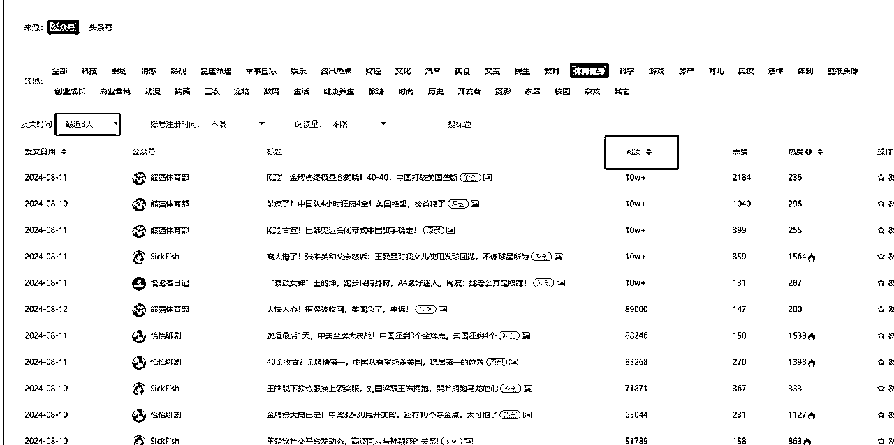

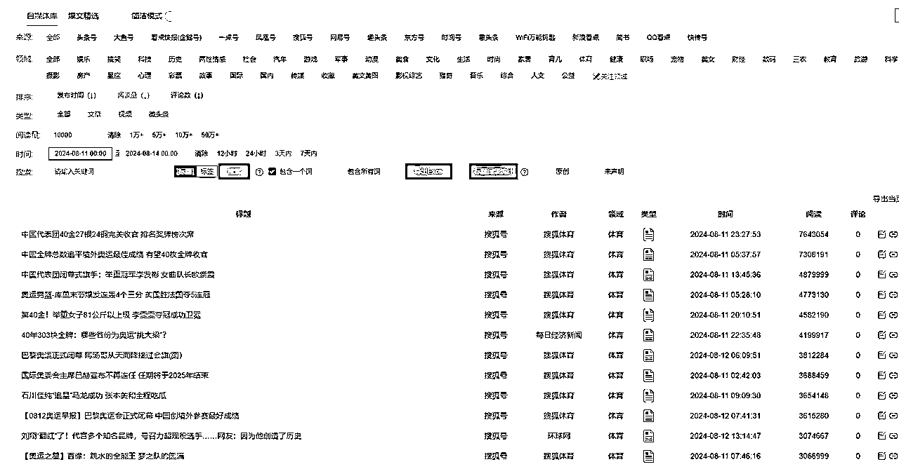

我没有选择去刷对标，是因为刷对标我觉得麻烦，之前做小红书就让天天刷对标，我直接就放弃了，上面的这种方式简单直观，比较适合我。✅大家可以按照自己习惯的方式来，因为刷对标刷出来的标题可能和这些网站筛选出来的差不多，并且目前看来选题的优先级并不一定高于选号，这个我后面会说。

这样自动化跑出来的文章直接放到公众号上去发布，就是这么简单。什么排版，什么找图，通通不考虑，就是直接发，先发了再说。千万不要在文章内容上纠结太久，觉得这里需要润色一下，那里需要修改一下，先发出去再说。只有发出去以后才能知道到底哪里有问题。

✅自动化的方法大家可以去看下航海手册的最后一部分，还有之前猫哥在航海的直播，真的很干货。

❌也千万不要自我感动，觉得自己内容写的多好，发出去感觉肯定会爆。做项目预期先要拉低，不要先考虑爆不爆，因为这个你很难控制。我们新手的话要先考虑怎么可以把这个项目坚持下去，我的习惯是把一个项目拆分成我自己可以控制的步骤。文章爆不爆我控制不了，但是我能控制我每天发几篇，发几个号。

就这样测试了一周，其中一个号爆了，3天500万阅读，第二个号，正常，每天有个几万阅读，第三个号，我觉得也正常，每天几个阅读。这三个号我的选题都是差不多的，领域也是一毛一样，所以不是发了都能爆的，和视频号一样，这是拼概率，拼运气的，如何提高概率，只能多发多号，用数量来对抗概率。

✅所以目前我选的是AI自动化的方式，这样生成文章成本很低，我可以坚持下去，可能后面某个号起来，我会考虑自己原创，但是前期我肯定会选择成本最低的方式去测试。

❌再提一下排版，插图这些，也重要，但是个人感觉没那么重要，至少我爆的这个号还有后面代运营的号上没有体现出来多么重要。就像之前做视频号一样，抠像混剪，我把人头扣掉一半，直接加一堆蒙版，人都看不出来是谁了，该爆还是会爆的，照样能爆个几百万播放，主要还是在选号和选题上，对了，视频讲究黄金三秒，公众号也是，除了标题，封面，前面的内容尽可能吸睛吧！

就这样，最爆的那个号单月跑了9.8万收益，主要都是7月1号~15号跑的，有7.5万的收益。❗❗❗然后这里提醒一下，如果单账号爆了，收益超过1w，最好尽快去办理公户，然后委托公户收款，别嫌麻烦，越快也好。这个号公户晚两天提交，7w5扣税扣了1w7。

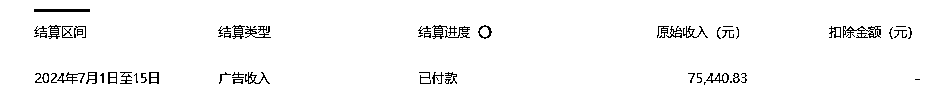

另外两个号，其中一个号像是单篇入池，就是两三篇跑到了10w+，但是其他的流量就很差，几百几十的都有，这种号一般持续个三四天就断流了，后面再发文就是几十阅读，然后看内容分析，推荐流量很少。

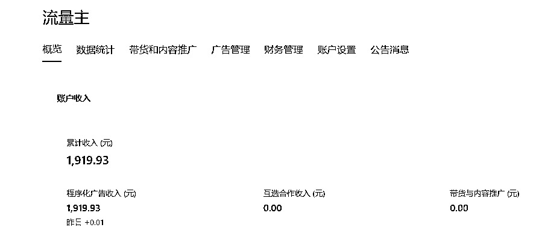

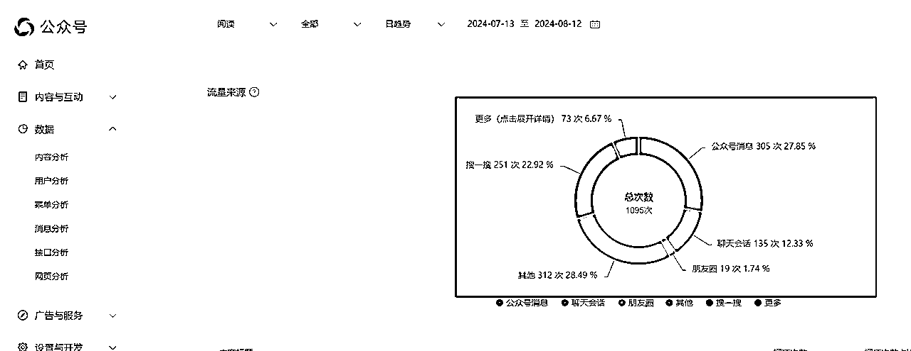

❌其实这种号还挺痛苦的，如果开始就遇到这种号并且只有这一个号的话，因为给了你希望，但是突然之间坠入谷底，很有可能接受不了。所以多号的重要性就出来了，这个我后面也会讲。

❓另外对于这类号怎么养回来，我试过发小绿书，换领域，断更一段时间再发，不过都没太多效果，可能我测试的周期太短，不到一个月的时间，后面实在不行就只能注销重来了，如果大家这个方面有什么经验的话，欢迎来交流，我可以付费咨询，多谢多谢。

最后一个号发了一个多月，就赚了9块多。

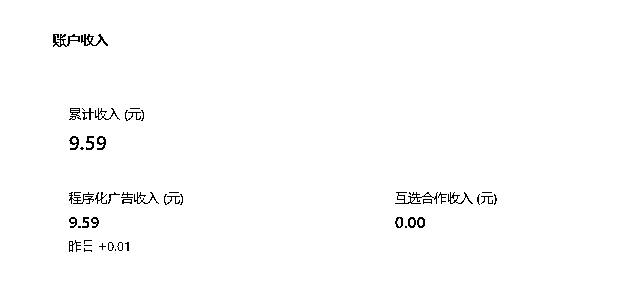

巧合的是，我这三个号的收益很符合后面我代运营账号的三种情况。

# 2、放大，测品？测号！

6月底到7月初，跟着教育爆了一下，然后根据三个号的情况，我有种感觉，这好像视频号啊，好像视频号刚开始可以搬运混剪的时候，也像去年口播文案抠像分发的那个时候，总结一下就是平台给量，但不是每个账号都有量，不过你测出来哪个账号有量后，就怼视频就行，会爆的很彻底。

（这是22年在生财视频号的分享，感觉有些方法现在还可以使用：https://t.zsxq.com/R3s1n）

有了这个感觉后，我立马考虑放大，就是加号，但是我自己号不多，还得做IP隔离，新注册的还要等刷粉开流量主，时间来不及，✅所以我选择了代运营分成的方式。

✅然后朋友圈找人开始测试，目前有100个左右的号进行了代运营，先放结论，一个月的时间，目前破万的号只有7个，破千的大概在15个左右，其他的大部分账号都是几十的收益。

然后说下我是怎么做的，来人咨询代运营，我会把流程发给对方，主要设计分成比例，发文方式，还有告诉对方不保证收益，可能一个月收益只有几块钱。然后看对方的反应，如果还是一直执着于收益，一直问很多细节的问题，一直纠结的朋友直接就不收了，只选我感觉可以坚持下去的朋友。

账号的话，我建议每个人先三个号，因为一个号太难跑出结果来了，如果有老号重启的更好。测号和视频号一样，测号测品，测号就是测试账号会不会给推流，测品就是测领域，因为有的账号这个领域不行，换领域后直接起飞。

关于发布策略，如果是老号重启的，直接发最近热门领域的文章，比如最近的奥运，看看流量，如果流量不错，那可以怼量发这个赛道相关的文章，比如我开始群发3条文章，然后根据流量情况，如果一直有流量，然后每隔1~2个小时去补一篇文章，每天发布不超过16篇。如果流量不行，那就换赛道去试试，不过要设置一个周期，不能测了一天，发了3篇文章发现这个领域没量就换赛道，可以一个账号，一个领域每天发3条，发5天，如果一直没流量，我就换赛道，一定要把这个测号测品的流程量化，这样可以更容易坚持下去。

新号的话，也是先发不同赛道的文章去测试一下看下是不是有流量，如果运气好测得正好有流量，那就可以一直怼这个赛道的了，目前测下来有些新号开始给的量很猛，不过一般持续时间会短，很容易持续几天就出池了。如果测了当前赛道没量，那和老号一样切换赛道，不过这个周期可以短一些，比如3天一换。如果测了几个赛道还不行那就开始养号了。

关于养号我使用的是视频号的方法，就是在视频号出现低质量之类的违规后，我们会把视频都删掉，然后发10条原创，然后去申诉，让平台再次认为你是一个热衷于创作的优质作者，很多情况会把账号给养回来。

养号视频也从之前的发10条风景视频，到发怼脸特效自拍，再到怼脸读古诗，为什么会有这个变化，是因为之前的养号方法被越来越多的人用，导致最开始比较简单的原创方法不能用了，只能一点一点去更新，所以卷和入场的人多会加速玩法的升级。

✅因为我也不知道这个理论对不对，只是视频号这么做我就这么做了。关于公众号怎么养号我这里就不具体说我的方法了，因为把方法具体化带来的问题就是这个会很快被卷死，导致所有人都原创低，新号出现原创低，后面起来的概率就降低很多。

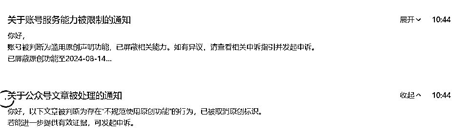

✅我的原则就是养号的内容可以质量不高，比如那种流水账都行，可以是自己熟悉领域的内容，降低产文成本，但是必须原创度要高，不能有原创违规，可以找一些小赛道，玩的人比较少的去当养号。

✅一个月的测试周期，只能说我这边测下来的规律，号的重要性比赛道更高一些，一个号好，发什么领域的都会爆，一个号不行，发什么都不行，所以在这个公众号放量的周期里，别纠结，一个号不行立马换下一个号，直到测出一个爆品号来。

# 3、跟着周期走

话接上文，在这个公众号放量的周期里，别纠结，一个号不行立马换下一个号，直到测出一个爆品号来。

我做项目都是跟着周期来，就像之前的视频号，我从22年5月份开始做的，到现在两年多，不是一直在做，就是感觉周期来了，就冲一波，然后吃一波的红利，然后再沉寂，再等下一个周期的到来。

比如22年5月份做的老中医就很爆，之前单视频就爆过千万播放，那个时候真的是红利，你随便发视频都爆，这个和方法有关系吗？关系不大，你加号就行。然后6月份的教辅吃了一波，后面核废水，卖盐吃了一波，疫情期间艾条还有甘草汤吃了一波。印象最深刻的就是去年做口播文案的抠像分发，那个时候真的是拿到视频直接抠像换一张静态背景图就可以，发了就能爆，还是多号爆，再到后面严格一些，就得把静态背景换成动态视频，然后慢慢又变成多加几层蒙版，就是去重手段你要不断升级了，爆的概率也越来越低了，为啥，因为入场的人多了，卷了，现在变成卷原创口播，还有数字人了，这里插一嘴，数字人这个不错，也是可以降低成本的。

所以在正确的周期做正确的事，在去年的时候，就是加号去多发抠像视频，趁着红利期，能吃多少吃多少，等到后面卷的时候，我就少做一些，多研究研究玩法，提高一下自己的能力。

✅然后公众号也是一样，在目前有量的周期里，那就是多号去怼，去测爆款号，测出来以后就怼量，把流量和收益吃完，同时继续测其他的号。中间什么排版，什么时间发文，怎么起号，给量的周期里多号就完了。等后面卷了，不给量的时候，再去完善这些能力也来得及，然后再等下一个周期。

# 4、心态

其实很想和大家说一下心态的影响，很多人看到别人爆了会焦虑，其实真的大可不必。

因为每一种花都有自己的花期，我们也有我们自己的节奏，尤其像是公众号、短视频，这种爆发性的，我们真的不知道什么时候会爆，这和运气有关，我们能做的就是多去测试，多去发作品，提高我们爆的概率。

别人爆不爆，对我们关系不大。我过得好不好和别人也没什么关系，而我过得好不好和我有很大的关系，所以别给自己徒增烦恼，焦虑解决不了任何问题，觉得累了就歇几天，不要把它当做任务，开心的去做这一件事，因为这是一件长久的事。

多去发文章，这样经验会累积，网感会累积，权重也会累积，那后面爆发也会越来越近！干就完了！