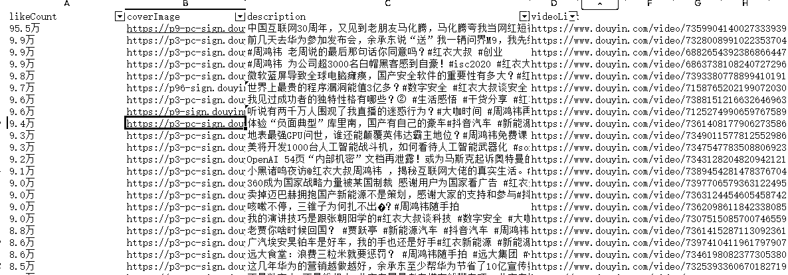
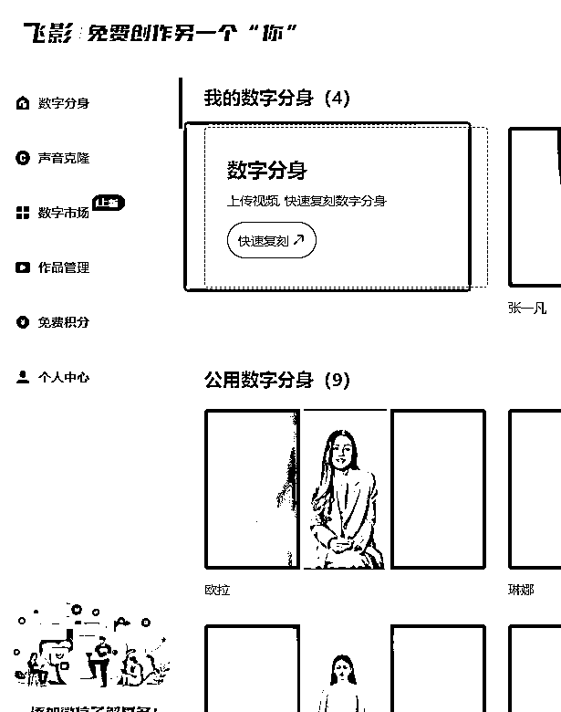

# AI口播工作流

> 来源：[https://tcnmgv0907ip.feishu.cn/docx/MHTEdP7K1oPUgfxrdzsc8nPUnQc](https://tcnmgv0907ip.feishu.cn/docx/MHTEdP7K1oPUgfxrdzsc8nPUnQc)

# 一、获取抖音作者视频

由于抖音官网有反爬，所以没办法直接在coze搭建插件来抓取数据

这里采用浏览器插件-提取网页元素-筛选对应视频元素

插件可以让gpt帮你写，这里我已经写完了，可以直接用

#### 完整的插件包

#### 抓取效果

#### 抓取教程

手机分享作者主页链接，粘贴到浏览器，打开插件提取

# 二、视频文案提取

#### 完整工作流

#### 1.数据输入提纯（可以采用代码，这里采用了大模型直接处理）

由于我们爬取的数据是文本格式，且用不到那么多参数，只需要把视频链接给大模型就行，所以这里先用大模型把数据里的视频链接提取出来，并以数组Array格式输出（这是因为后续要用到批处理，只能处理数组格式的数组）

注意大模型的输出是Array<string>，只有这样后续批处理才能接收这批链接</string>

#### 2.提取文案

由于链接众多，所以需要对每一个视频链接都进行文案提取，所以就要用到批处理，批处理的输入值就是上一个节点输出的链接组，插件的输入值（url）这里就要引用本插件处理的数据，因为这个插件是循环处理的（比如10条链接就是分别运行10次）

#### 3.错别字修改

由于提取的文案经常会有错别字，语句不通顺的地方，所以需要用大模型进行校准补充，但是不可能百分百就是原文那样，所以可以要求大模型把改正前后的内容都写出来，方便你进行使用

这里一样是需要用到批处理，跟上一个节点一样的处理方式即可（注意：因为你提取的文案有多有少，有些长视频文案很长，一般大模型都处理不了，就会报错，这里模型选择kimi的128K效果好很多）

#### 4.内容上传飞书云文档

输出的内容也是分批上传到云文档，方便查看使用

# 三、文案风格改写

### 1.自己的风格

把自己的内容放到一个文档里上传，让大模型学习你的风格

### 2.某一主播风格

# 四、数字人分身

这里我用飞影数字人做展示，其他数字人产品也可以，本人无利益相关

1.数字人制作

录制自己一段视频，尽量面部表情，肢体语言都到位。背景可以自己定义

2.声音克隆

3.生成作品

4.短视频

导出生成的视频，再导入剪辑工具，增加字幕

效果对比（目前停顿需要自己手动插入）

注意：目前整个流程是分散开的，可以借用rpa工作整合整个流程，一步到位