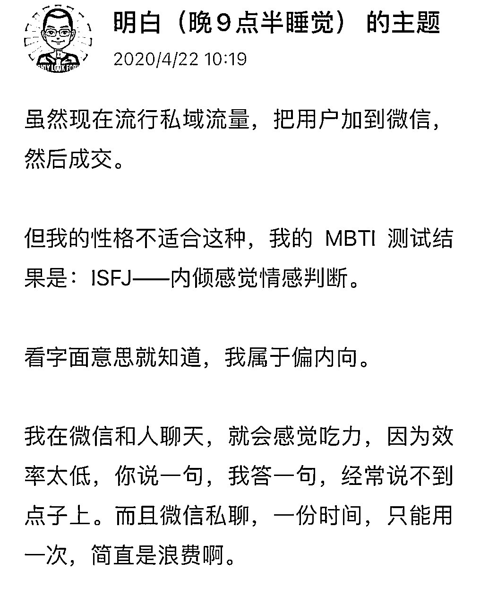
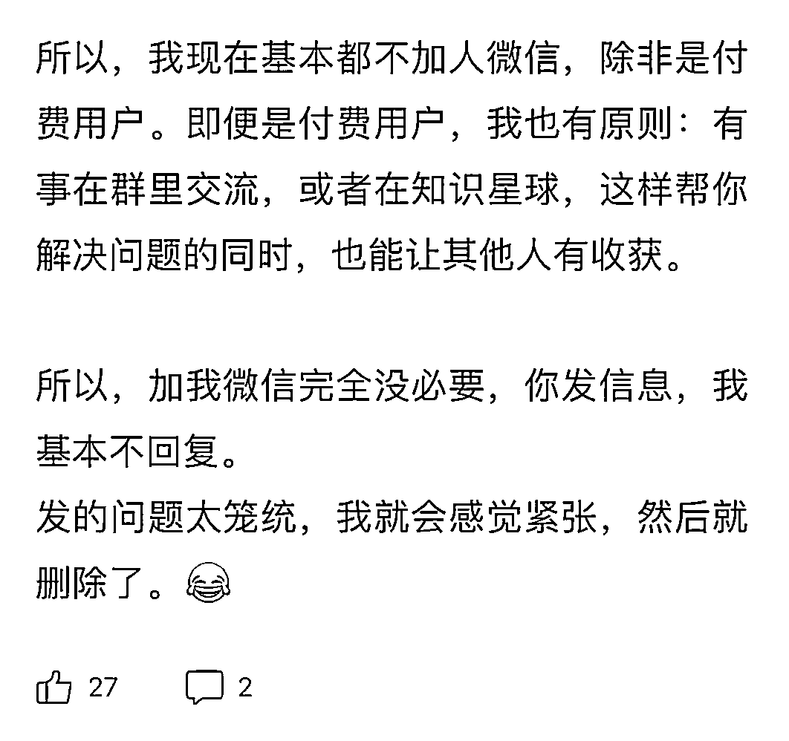

# 决定你能否赚钱的不是优势，而是刻意练习！

> 来源：[https://pznme756ly.feishu.cn/docx/JQDudjkfko6k9lxcQc8crz19neg](https://pznme756ly.feishu.cn/docx/JQDudjkfko6k9lxcQc8crz19neg)

大家好，我是明白。

赚钱这件事，和优势、天赋、热爱、「适合自己」有没有关系？

有人说：我一定要找到喜欢的事情，才能专注、坚持。于是，他就一直把时间花在找自己的喜欢。

做了一件项目，发现不喜欢，换另一个项目，发现不适合，再换下一个，还是不喜欢。于是，就一直陷在这样的一个循环里。

一个人把一个副业项目做成，并且赚到钱，真的是因为他喜欢做这件事吗？

假设

A：我喜欢做这件事

B：做这件事赚到钱

我们需要认真的思考下面这几个问题 ——

（1）A 真的是 B 的原因吗?

（2）如果A是B的原因，那么，A是B的唯一原因吗?

（3）如果A不是B的唯一原因，那么还有哪些原因?

（4）如果A不是B 的最重要原因，那么最重要的原因到底是什么?

任何一个副业项目，用这样的逻辑深入思考一番，我们就能发现，很多我们本能觉得对的事情，往往是错的。

# 1 我非常内向，不适合做销售？

曾经有一个同学，问过我一个问题 ——

我性格内向，不善言谈，所以线下和人沟通的时候，总是紧张，不知道怎么说话。线上和别人聊天，也不知道说什么。我这样的情况，是不是不适合做销售呀？

看到这个提问，我就觉得，这不就是我吗？

我之前是一个性格非常内向的人，几乎从来不和人聊天，也几乎从来不去线下参加各种聚会。

我日更公众号前 1000 天，每篇文章 3、4 千阅读，我从来没有放过微信二维码。就是觉得有人加我微信，和我聊天我会很紧张，不知道该聊啥。所以，为了避免这种情况发生，我就尽量从源头掐灭这个事情。

上面的帖子，是 2020 年的我。

但现在如果你和我聊过天，一定会感觉到我和之前完全不一样了。

非常健谈，和我聊天也会感觉很开心。

# 2 简单的因果性

如果按照天赋、优势、热爱的理论，我以前是程序员，我肯定是

*   擅长写作、逻辑思考，

*   不擅长，和别人交流、聊天。

那就意味着，我不应该在沟通这件事上花费精力。毕竟我没有优势呀。

从表面上来看，这个逻辑挺简单的——因果性。

*   因为我性格内向、不善言辞、没天赋、不擅长。

*   所以，我做不好。

*   所以，我在这方面花费再多精力，也不如别人。

我以前也是这样的思维逻辑，后来发现这种线性的思维，对我的成长并没有帮助。

# 3 重新思考热爱和成事的关系

但根据我的经验，性格、天赋、擅长，和我能不能做好这件事之间，从来不是因果性。

一个人能不能做好一件事，只和一个因素有关，就是 ——

他在这件事上，刻意练习的时间、次数。

我以前是程序员，只会写代码，我也曾经觉得我是直男、理工思维，不可能站在别人的视角：写出好文章、做出好课程、解答别人的问题。

但后来这些事情，我都做到了，而且做的还不错。

原因无它，就是我在这件事上，花费了足够的时间，认真学习、练习。

我得出这个结论，不是一个主观的感觉，感受。

有一本书叫《刻意练习》，就是讲任何一个人，都可以从新手到高手，只需要用对的方法，刻意练习足够的次数。

你可以回忆一下，自己刚大学毕业，开始工作的时候，你做的事情一定也是磕磕绊绊。但现在做了几年，你会发现自己在这件事上，已经非常熟练了、擅长了，甚至，你会觉得自己在这件事上有天赋。

*   1 是因为你有天赋才能做好一件事？

*   2 还是因为你足够认真、勤奋，刻意练习的次数多，让你能把一件事做的更好，于是，你在这件事上变得「有天赋」？

这里更深入一点，我觉得有一个更重要的问题，值得我们思考 ——

上面哪一种人生，是你希望过的？

# 4 梳理自己的价值观

我觉得这是价值观的选择。

选择 1 的话。

那人生就会是这样 ——

遇到不擅长，有难度的事情，就会觉得我没天赋，算了，这件事我做不好，换一个其他的。

然后，下一件事，发现不擅长，有难度，还会觉得我没天赋算了，这件事我做不好，换一个其他的，

循环往复。

人生的时间都在寻找我「有天赋」「热爱」的事情。

选择 2 的价值观，那人生就会是这样 ——

遇到不擅长，有难度，但我做好了会对我有帮助、能帮我赚到更多钱、让我人生变得更好的事情，我就认真、勤奋去学习，花足够的时间，刻意练习做好这件事，让它变成我的「天赋」。

于是，人生就会越来越平顺，人生会越活越活，对生命会越来越有掌控感。

我选择的是 2 的价值观 ——

*   我不擅长写作，但我练习次数多了，能做到更好。于是，写作变成了我的「天赋」。

*   我不擅长做课，但我练习次数多了，能做到更好。于是，做课变成了我的「天赋」。

*   我不擅长沟通，但我练习次数多了，能做到更好。于是，沟通变成了我的「天赋」。

*   我不擅长情绪控制，但我练习次数多了，能做到更好于是，情绪控制变成了我的「天赋」。

*   我不擅长销售，但我练习次数多了，能做到更好于是，销售变成了我的「天赋」。

*   我不擅长营销，但我练习次数多了，能做到更好于是，营销变成了我的「天赋」。

*   ……

嗯，当你在某件事上，投入足够多的时间，它就会变成你的天赋。

换句话说，你的「天赋」是可以创造出来的。

# 5 赚钱从来都需要刻意练习

我们从一个功利的角度看，

这个社会上能让我们提高收入、赚到钱的技能，最底层的就是那几个 ——

写作（影响力）、逻辑思考（执行力的根源）、学习能力、沟通 销售能力、网感、用户视角以及遇到问题解决问题，不逃避困难的特质。

任何一个应用层面的商业模式：做课、社群、个人IP、社群团购、抖音、小红书、抖音、淘宝等等，都是建立在上面几个的基础上才能做好。

如果因为觉得自己「没天赋」，就不去做这件事，甚至，都不会开始去认真刻意练习，那人生的路，就会越走越窄。

所以，从赚钱的角度上来说，要不要学习、练习上面这些重要的底层技能，不是「我喜不喜欢、热不热爱」的问题，而是，你不学，你就大概率走不通赚钱的闭环，就赚不到钱的问题。

就好像，一个人说，我想减肥，但我不喜欢运动。我能不能不运动啊？

嗯，不行。因为运动是减肥成功这个目标，不可或缺的一个影响因素。

少了这件事，减肥就一定没法成功。

更重要的是，有人觉得找到天赋后，我就可以更轻松的做好这件事。

且不说能不能找到，就算找到了，但其实任何一个技能的熟练，都遵循熟能生巧的客观规律，没有大量刻意练习，天赋就没法熟练应用到真实生活中，解决问题。

这点我们可以去翻一下星球里的精华帖，每一个赚到钱的人，都经历过那种没日没夜，花大量时间，把一个知识、技能、事情，死磕非常久的阶段。这个就是在刻意练习。

所以，从这个角度上来说，当我们在考虑，要不要去做一个项目，要不要学习一个知识、技能的时候，

*   不应该考虑的是，我在这件事上有没有天赋，或者，擅长与否。

*   而是做好这个项目，学好这个知识、技能，能不能让我人生变得更好？让我能力更强，赚钱更多，关系更好，情绪更稳定……

如果能，那就认真去学习，认真去练习，投入足够的时间，干掉一切困难，让自己做好这件事。这是唯一的路径。

在这个问题上，看这个帖子的几乎所有人，都比我有 10 倍强的优势。

因为我有强直性脊柱炎，这是一个慢性病，所以我身体几乎每天都会疼痛，人一旦身体不舒服，就完全没有能量，去静下来思考、学习。

我 2016 年- 2019 年，刚开始从程序员转型，学习写作、做课、营销、产品这些的时候，每天都是这个状态。所以，我能投入的时间、精力、能量，比群里每个人都更少。

从客观条件上来讲，连我这个状态都能靠自己投入时间，从 0 开始，把一个以前完全没接触过的东西学会，然后把事情做成，拿到结果。其他人就一定没问题。

这类从 0 到 1 ，学会一个技能，把事情做好，获得结果的经历，只要你做成过一次，你内心就会生出一种自信，你会 120% 相信自己。

你会相信，这个世界上，如果一件事有人能做到，那我也一定能做到！

希望这个帖子，可以带给你一些思考，和力量。

我一直都觉得，赚钱路上，如果能多一些耐心、勤奋、认真，就没有什么事情是做不好的。

祝各位都能创造出自己的「天赋、热爱、优势、适合」。

* * *

# 小尾巴：历史介绍~

我是明白，生财有术 8 期老圈友，星球编号 20。

程序员出身，目前自己创业，做一个成长社群《日新月异俱乐部》

以下是我在生财的历史 26 篇精华帖合集

也代表我的一个成长轨迹，

如果有兴趣，点击链接直达 ——

2024年（x1）

1.  《参加航海实战，如何让自己每天都有正反馈？》https://t.zsxq.com/9e2ns

1.  《详解：写作和赚钱的 4 个关系！看完你一定会忍不住想开始写！》 https://t.zsxq.com/192OLDlds

1.  《7 年生财拉新 1100 +，我只做对了一件事》https://t.zsxq.com/19SqL7McC

1.  《当思考成为习惯，赚钱会更容易》https://t.zsxq.com/19vgy7kcp

(这个还没得精华，但我觉得写的很好哈哈，是赚钱最重要的一个环节）

2023年（x1）

1.  《身体残疾卧床 3 年，我在人生最低谷加入生财有术，有哪些成长？》 https://t.zsxq.com/19KWDvzz0

2021年（x3）

1.  《复盘 | 亦仁 3 年前的帖子，帮我每月被动收入 1 万块》 https://t.zsxq.com/19jaotwbv

1.  《嘉宾问答|“想去更好的公司，我该如何利用好时间？”》 https://t.zsxq.com/1952Q3a92

1.  《2883 人向朋友介绍生财有术时，说的最多是 16 个词！》 https://t.zsxq.com/19MYWwvCl

2020年（x6）

1.  《产品想要获得更大收益，应该不断向用户的真实需求靠近》 https://t.zsxq.com/19kQ7NILy

1.  《 我的2019：普通人如何培养自己的用户视角？》 https://t.zsxq.com/19fyFdZRL

1.  《如何通过分析成功案例，帮自己建立赚钱清单》 https://t.zsxq.com/19FNjtIjB

1.  《思路详解：如何为某个细分领域用户提供产品，并赚钱》 https://t.zsxq.com/19qoI1QQB

1.  《学习和赚钱是什么关系？》 https://t.zsxq.com/19uQcuMzJ

1.  《5000 字深度拆解 | Manchuan 公众号 2 个月涨粉百万，普通人如何复制？》 https://t.zsxq.com/19cD1keUB

2019年（x8）

1.  《在生财有术，普通人如何从 0 到 1，培养赚钱思维》 https://t.zsxq.com/19rA0kWrD

1.  《生财有术第 3 期，我是如果做到邀请 245 个用户的？》 https://t.zsxq.com/1968tlTAx

1.  《公众号和抖音之间的赚钱机会》 https://t.zsxq.com/19OfzDckK

1.  《可复制，零门槛 | 如何借别人的流量，打造一个稳定的被动收入系统》 https://t.zsxq.com/19sVRn6Yx

1.  《做自己擅长的事，把技能树打通，然后再去赚钱》 https://t.zsxq.com/19evWC1Xl

1.  《信息整合：一个可复用，低门槛的成熟商业模式》 https://t.zsxq.com/192zoSooT

1.  《产品名字，只有一个目的：降低用户认知成本》 https://t.zsxq.com/19QUBrDOT

1.  《数据是需求的抽象化 | 帮你快速找到 100 个赚钱思路 》 https://t.zsxq.com/19QrIpsuC

2018年（x3）

1.  《分享一下，抓取其他微信号的方式，而且是精准粉》 https://t.zsxq.com/19sKQT9bF

1.  《如何几乎零成本做到1w多付费学员？》 https://t.zsxq.com/198XWAGhV

1.  《36 个小而美赚钱项目之一：蛋黄酥白皮书》 https://t.zsxq.com/19G4PKUXr

2017年（x2）

1.  《一个零成本，为公众号增粉，并高转化率为付费社群，进而再次付费转化加入小密圈的案例》 https://t.zsxq.com/19WJ8NILt

1.  《一款软件，webscraper，帮助非技术领域的朋友，做到爬虫可以做的事情》 https://t.zsxq.com/19RSl40n5