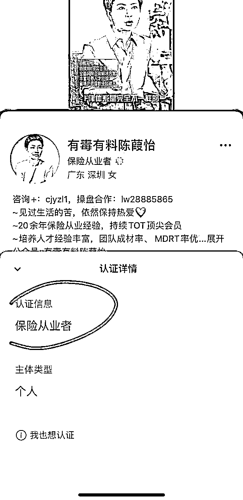
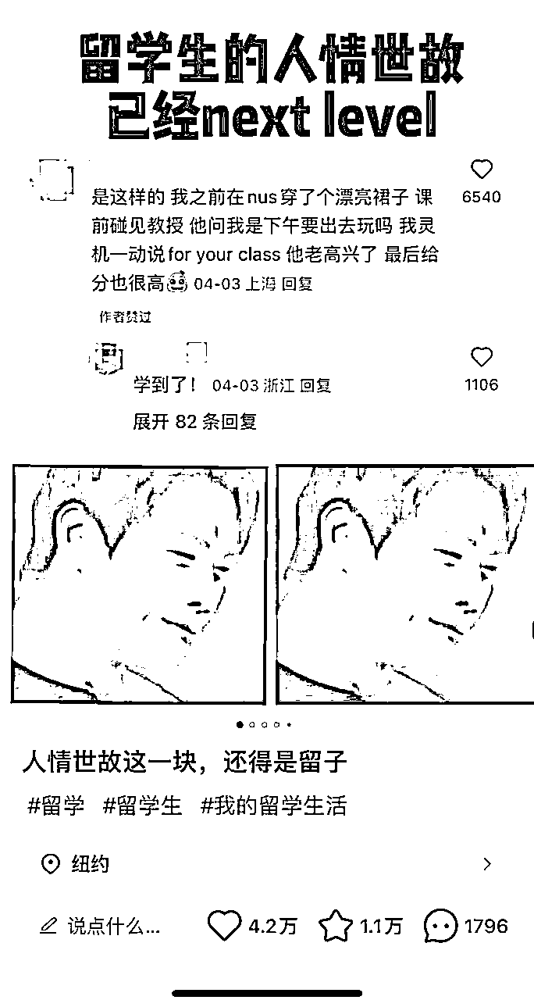

# 2024，哪些赛道的人要「提桶跑路、去哪里找蓝海」❓留学赛道转行2个月卖出1个亿后的分析❓

> 来源：[https://ht16ej1tui.feishu.cn/docx/JUtKd8BmSoSV6KxotikcGqbZndf](https://ht16ej1tui.feishu.cn/docx/JUtKd8BmSoSV6KxotikcGqbZndf)

小红书留学赛道，哪些最不能做？2024年，哪些赛道会下行，哪些赛道会上升？什么时候是从一个赛道提桶跑路的最好时机？截止到24年8月20日，40多个小红书高客单赛道的卷王程度如何？怎样找蓝海赛道？

Hi大家好呀，

我是22-23年在小红书教育赛道做了2700万营收的珍妮子，和我的合伙人陈铭Ivy靠1500块白手起家。

在所有留学同行急得焦头烂额觉得引流成本越来越贵的时候，我们早已悄悄转换了方向，去了另一个高客单上升赛道，在两个月内卖了11套房，合计1个小目标。

很多老板想了解：为什么我们可以提前知道危机，并且早些转型、提桶跑路。

今天和大家分享：

1）小红书留学相关赛道，哪些最不能做？

2）什么人，才适合做留学赛道？

3）24年，留学同行怎么样了？

4）2024年，哪些赛道的人要转行？

①什么时候，咱们要离开现有的赛道？

②哪些行业会下行，哪些行业会上升？

③24年，各个赛道（含40+赛道）的卷王程度如何？

5）怎样找蓝海赛道？

6）本文后续补充1，关于各赛道卷王程度打分表

7）本文后续补充2，关于男剪女布和男剪女布赛道释义

以前有老板问我怎么找蓝海赛道，我没有发出来，因为有些信息，是不能透露的。

这篇文章是我24年3月写的，原计划先拖一年，再发出去，保障最先知道信息的人的利益。

受「理白」邀请，我也给这篇文章加入了新元素和最新的信息，分享给圈子里的友友们。

大家知道后，自己默默转行就好。

不用让太多人知道这回事，不然一群人涌入同一个行业，中国人太聪明太勤奋啦，可能又把一个行业变成大红海。

这是Ivy和我往期写过的帖子，感兴趣可戳戳：

1⃣https://t.zsxq.com/DT1SJ

2⃣https://t.zsxq.com/aPL7f

3⃣https://t.zsxq.com/XXl6X

4⃣https://t.zsxq.com/Fvvr8

5⃣https://t.zsxq.com/LhyXR

6⃣https://t.zsxq.com/2Wg9U

7⃣https://t.zsxq.com/49u9r

8⃣https://t.zsxq.com/r7CMz

9️⃣https://t.zsxq.com/k8Nsa

# 小红书留学相关赛道，哪些最不能做？

除去英澳留学硕士申请，能避雷就一定要避雷以外，以下留学相关赛道，最不能做：

## 1）留学保录取，死号赛道top1

留学保录取这个赛道，我们是亲身体验，含泪放弃。

保录取这个赛道，客单价极高，从30万到500万不等，从985保到牛津剑桥，但这也需要客户对商家有非常高的信任度。

这个赛道，如果线上销售能力一般，又没有个人ip，没有身边人帮客户背书，想靠做自媒体（不仅仅是小红书）赚到客户的钱，比登天还难。

这个赛道看似利润很高，笔记非常好写，但死号率非常高。素人发保录取，基本一发就是违规。

如果开了蓝v，开口价调到80-100一个，还会来很多同行天天点进广告，消耗商家的投放费。

最主要的是，这个赛道不仅烧钱，还“哪怕烧了钱也不让过审”（可能仅仅是小红书赛道的原因，视频号也许好一些）。

在小红书，就算开聚光烧钱了，笔记也卷不出什么花样，因为每次稍微有点花样，就投放违规了，这不让说，那不让说。

最尴尬的是，这个赛道已经被以前的商家洗过，很多保录取的客户会误以为30万就能进澳洲八大，所以他们对保录取的价格和服务有不切实际的需求。

留学保录取简直是是小红书的top1死亡赛道。

## 2）不要在小红书做香港保险，但可以去视频号。

香港保险在小红书上的资质认证，比大陆保险要麻烦很多很多，相比留学行业50块就能买个海南个体工商户营业执照认证蓝v，港险要花很多钱才能拿到资质。

如果不做资质认证，发一篇就会被自动删帖一篇，是个疯狂死号的赛道。

如果只是把身份认证为咨询公司（比如50块买个信息咨询中心为尾缀的个体工商户，认证为咨询公司），是可以被举报成功的。

4月份那会我看到一个博主铺矩阵号，有的号他认证了咨询公司，有的认证了保险公司，结果7月中旬一看，认证为保险公司的账号还在更新，但认证为咨询公司的账号全都断更几个月了，估计是违规得太惨。

如果是认证为保险公司资质，比如保险中介公司，我们就得解决营业执照的问题，看谁愿意卖咱们这个资质，有的资质要5000块才能买到，看通过啥渠道买了。

而且据有的业内人提到：资质也不能靠花钱买到了（此数据为珍妮7月中旬之前统计的）。

【不过听说小红书8月之后慢慢开放保险行业的白名单了，这会不知道弄一个资质要啥价钱。】

但如果是去视频号做香港保险，会发现资质认证松得多，认证一个保险从业者就ok了，甚至可以不用认证。

# 什么人，才适合做留学赛道？

我曾给留学赛道列出过下方常见的14个品类：

哪怕是新人也能进入的留学赛道有：中外合办

最蓝海的有：国外租房，买车，二手交易

需要一些专业知识，但不多，而且能洗矩阵号引流的有：移民，香港永居，小众留学申请

除此以外，上方14个品类的其他赛道，如果没在这个行业深耕过好几年，熟悉每个流程，就不用进去了。

因为一个深耕过四五年甚至10年的人，都在铺留学行业的矩阵号，对方已经是自媒体界的卷王天花板，从20年卷到24年，看遍了行业所有变化，知道哪些选题不能再写，哪些模版不能再用，哪些爆款标题过时了。

此时一个不懂这个行业的新手小白进去卷，他不知道这个行业曾经发生过什么变化，进去多半会被卷到亏钱。

# 24年，留学同行怎么样了？

24年的留学界特别卷，除了上面说的几个没那么卷的赛道，其他赛道已经卷出花来了。

比如我认识的大厂，一个月花10万投聚光费，结果半个月就把钱花掉了，下个月公司没有预算继续花聚光了。

也有“给机构送线索的”第三方机构，因为发现24年引流越来越不顺畅，把整个运营团队裁员了，重新招人。

还有很多老板来问我“珍妮，雅思赛道怎么继续卷出花来，课程辅导赛道引流下滑严重怎么办？”

实际上：

雅思赛道从22年开始就是留学赛道卷王天花板了，一个卷王都卷不出花来的时候，其他人更加别想卷出花。

而课程辅导赛道，由于海马课堂等大厂强势开矩阵号+投放，导致很多小厂的自然流越来越差。今年做课程辅导能引流比较顺利的，都是“以个人名义出来接单，而不是以机构名义来接单的”。

可能有人说：珍妮，我看现在留学申请界的爆款笔记也挺多的呀？

珍妮答：爆款和利润，是两回事。一篇提供情绪价值或者实用价值的笔记，就是会引起很多人点赞收藏，或者评论区吐槽，或者来白嫖领资料。

可是没有几个人问价呀？都没人礼貌问价，赚什么钱呢？

今年很多大厂自欺欺人，以为把2022年的图文笔记打法变成视频打法就能获得流量，实际上早就不一样了。同一个素材，一定是：图文能火，但做成视频不一定火，因为视频里的人不一定会演。

还有很多创始人，出来拍摄视频，以为自己是在做个人IP，实际上：他们绝大多数都是把以前的图文笔记又录制了一遍视频念出来。

如果不能传达自己的价值观，显示出自己是一个有观点有态度有温度的人，那么创始人出来拍视频就是自我麻痹“我很努力，我在拯救我的公司”。

其实观众对一个“拍视频的讲干货机器人”并没有兴趣。图文就能看懂的干货，何必看视频呢？（美女帅哥出来拍视频除外，因为他们的颜值本身就是为观众提供观赏价值和情绪价值）

另外，24年的留学行业还有一个风气，就是：

因为不知道该怎样引流了，所以菜鸡互啄，其实A公司早就亏本经营，但B公司不知道，B公司的运营团队也在照抄A公司的爆款，随后B公司也跟着亏本经营，谁都以为自己这样能赚到钱，实际上最后两家公司要么集体裁员降薪，要么倒闭。

还有的公司，会派人去上各种自媒体课，可是自媒体上靠其他行业创业成功的人，根本不懂留学行业。

不懂留学行业的人只能教运营技巧，但整个留学行业现在陷入的不是技巧的问题，而是留学行业负责引流的人在20-23年赚了太多快钱。

当初赚钱最多的那波人开始引入资本进场，矩阵号+投放可以把新手卷到连小虾米都吃不到。

当初赚钱少，或者只是靠引流技巧赚钱，但没在这个行业深耕过的人，接下来都会面临大洗牌。

无论一个公司，账号铺了多少，爆款有多少，Ivy和我有双火眼金睛，从他的引流笔记类型和账号起号时间，就能算出这家公司的运营部门，是不是在亏本经营。

# 2024年，哪些赛道的人要转行？

要了解“哪些赛道的人要转行”，我们首先得明白：

1）什么时候，咱们要离开现有的赛道？

2）哪些行业会下行，哪些行业会上升？

## 1）什么时候，咱们要离开现有的赛道？

在红海卷是没有意义的，同样的努力，蓝海给咱们500万，红海给咱们10万，顺带送咱们一张身体有问题的体检单。

### 判断红蓝海方法1：

对于红海赛道：23年6月开始，小红书陆续要求商家要持有资质，注册蓝V。此外，从23年7-9月，小红书逐步推动聚光业务，要求商家要投放才能发出联系方式。这一切导致大量商家开始付费，小红书逐渐减少了硬广笔记&重复度相似的干货笔记的自然流量。

所以，红海赛道的产品，如果能在23年9月及之后依旧能靠硬广拿到50+人在下方“咨询”，能靠干货拿到上百个点赞收藏，就是不错的运营数据。

但大部分红海赛道的产品，在23年9月后，只能做到3-20人在下方“咨询”，发出去的干货千篇一律，小眼睛低于500。甚至有些产品，除了水军，没有任何人在下方咨询。

对于蓝海赛道，无论是否过了23年9月，只要依旧有上百个人在硬广下方“礼貌问价”，就是好的运营数据。

如果一个人给你晒出的业绩，都是23年6月之前的数据，而23年6月甚至9月后没有特别好的数据，说明他更多的是在赚：“时代给他的钱”，而不是靠运营能力赚到的钱。

### 判断红蓝海方法2：

参考「金枪大叔」在「借势」这本书中说的话，

如果咱们的赛道开始内卷，咱们该及时离开了。

很多人刚认识我，可能是因为23年7月，我发的「小红书教育赛道GMV1600万/年，小团队创业心法」这篇帖子。

我发这篇帖子的时候，是小红书刚开始在留学赛道要求商家搞聚光充值的第一个月，不充值，商家就是「站外引流、账号内容不被推荐」。

那时候我给自己休年假，我没有留意太多局势变化，还总想着用「花式发微信号的骚操作」去避开官方的打压，但这让我们流失了很多客户。

因为我们再怎么花式，也比不上直接发一个微信联系方式来得快。

如果我们不花钱，我们的同行就会花钱，第一时间把微信号发出去，把我们的客户抢走。

虽然我在休假，但整个留学赛道的走向，我却是从23年3-4月左右开始、就一直在观察的。

我在23年3-4月的时候，报过我一个贵人姐姐的ip课。她是在中国已经红了20年的人，穿越周期，影响力已经扩大欧洲还有中国周边的小国家，早就财富自由。我知道她的建议，一定会对我很有帮助。

她在23年3-4月那会，点拨过我：哪些行业会下行，哪些行业会崛起。所以我知道：留学行业会下行。出国留学的留学生会越来越少。能送孩子去国外上学的，接下来要么是超级大富豪、一开始就送孩子去英美名校，要么就是本来就已经在国外生活的海外华人。

（注意：如果留学行业从业者继续做留学生意，也许未来送外国人反向在中国留学还差不多。我就遇到一个能源界的俄罗斯高管要来中国刷人脉，想读个EMBA水硕。但是2000多块的入学费他到现在都没交，可能是嫌项目还不够好。）

至于中产，他们能移民的会移民，因为接下来，他们在中国的日子会越来越不好过。（注意：这里也是暗示：移民类生意还有最后一波客户量）

至于底层，小康小资这种，一开始他们可能咬咬牙卖套房送孩子出国，现在他们可能选择不出国，或者送孩子去马来西亚、爱尔兰这类国家读书。（这代表商家的客单价会要降低，也代表「免押金，只为了拿学校返佣」的中介会越来越多）

国家会慢慢变成M型社会，从此中产会慢慢没落。

那时候贵人姐姐在课上推AI。我知道她推AI而不是推别的东西，背后一定有她的原因。我马上开始学gpt，midjourney。也利用gpt把我们矩阵号的文案洗了洗，避开了「20多个账号，用几乎同一个文案，把自己作死到抄袭封号」的惨剧。我也有利用midjourney生成美女图，做素人号，吸引别人点进去。

从贵人姐姐点醒我：「留学赛道会下行」开始，我就第一时间和Ivy（我合伙人）说了这件事。那时候可能是没有聚光投放之前、留学赛道最后一波红得如日中天的时候了，买单的留学生汹涌如潮。

但这个趋势，果然不长远。在我写完23年7月那篇帖子后，留学赛道，尤其是英澳留学中介，他们的笔记最后一次火，基本是23年9-10月。在那之后，就很难见到一篇笔记下面一堆人礼貌问价的局面了。

学AI是我个人转型的一个方向，它对我来说更像一个工具，让我有机会快速挖到各行业信息差。

但同时，我们在23年试了所有留学相关的赛道，找了很多合作商，整个留学行业，任何细分的小市场，基本就没有我们没试过的。

最后发现留学行业果然下行。这个下行倒不是说这个行业已经彻底不赚钱了。而是从业者以前，付出20分的努力赚120块，现在从业者付出100分的努力赚120块，并且即将付出110分的努力赚120块。为这10块去努力，还是算了。

都有100分的努力和能力了，去别的蓝海赛道卷，岂不是咔咔乱杀。

所以我也写了这些文章，只发在了知识星球。

原文如下：

上图是留学行业的14个细分品类，

接下来我会分析：各个品类的未来趋势、利润空间。

我能作出这些分析，除了有穿越周期，红了10多年的贵人姐姐在上面点拨过我以外，也是因为：在贵人姐姐点拨后，我一直有在留意留学整个行业的趋势。

👉其中1-2，国际高中，从疫情开始，能招收到的学生就越来越少了，大家可以自己去查学校的招生数据&和学校老师聊天。

疫情之后，家长发现国外还是不太靠谱，所以没有那么想把孩子送出过国了。国际高中生越来越少，上AP，A level，IB相关课程的学生也会越来越少。

👉7.高端定制，这个是永远的需求，专门服务中国最有钱的富人，这个赛道不会没落，前提是咱们有足够的能力，而且咱们的稿子不会因为“保录取”这样的词而触及到广告法、被小红书教育赛道的总监拉黑。

👉12国外租房，买车，二手交易，不会没落，这是永远的需求，已经移居过去的华人会在那里有后代，再加上做国外小红书运营的人跟不上国内人的网感，所以他们写的小红书笔记都比较菜鸡。如果我们拿国内的打法去发笔记，能把他们市场份额侵占完…

我们不做真的只是因为我们全团队都住在国内，没法飞过去做市场调查，拍摄资料，不然这个赛道、我们会把他的市场份额抢光。

👉13.移民澳洲、香港永居。其中移民类的项目还能做做，因为男剪女布（主要是中产群体）在国内的日子会越来越不好过，他们就是更适合国外的生活环境，所以这群人如果还有积蓄，是非常向往移民的。

香港永居，小小的地方，经济发展也比不上深圳，虽然也能赚钱，但是目标客户群还是没有移民大。这类业务也是主要吸引大富豪和中产。但中产已经越来越没钱了。

如果留学行业从业者一定要做，可以做：帮客户拿身份，方便他们孩子上学。咱们还可以过去卖保险、卖房子，帮客户做资产配置。

👉3.5.6 雅思托福、免收中介费的留学申请、英澳留学申请，已经卷成了狗。天天都有人免费送学习资料、不收中介费不收押金、就为了送学生出国，自己拿校方佣金。

拿到免费资料的学生一般都只愿意上大班课或者几百块的网课，所以留学商家的利润空间太小。

如果学生最后没去读书，留学商家一分校方佣金都收不到。

👉（3中的gre，act，sat, gmat因为门槛高，没那么卷，独立老师还能做做。如果咱们是做代kao，已经卷成狗，而且弄错源头供应商会把学生一辈子都害惨，请慎重。）

👉绿圈4，小众国家留学申请，勉强还能做做，一般会吸引想来刷学历的体zhi内、事业单位的人，或者支付不起英澳学费、想去留学拿学历的人。

这群目标客户很能砍价，他们大多加上学费的总预算是10万/年（甚至可能是10万读2年）。如果碰上预算有20万的人，咱们多多珍惜，但他们也大多不会签约，这类人里，很多人三年前说自己要留学，三年后雅思还没考出来，消耗商家的精力。

咱们中介费如果收1-1.5万，可能就要被这类客户拉黑了。

而且他们会多方比价。尤其是纯粹为了刷学历，但又没有30万预算的那波人，他们会考不出语言成绩，不愿意上网课，不愿意每年抽60天去上线下课，没有20万预算，竟然还想让咱们帮他代kao【哭了真的】。

这个服务，是吸引「既要又要还要」最多的人群。如果有友友一定要选择赚他们的钱，那么可以去赚。

但我本人真的无能为力成交这类客户。能者多劳，能做这个的可以去狠狠赚一波钱，因为这类客户群体基数很大，但我是没有这个福气了。

👉紫圈8.9.10.11，其中8英文润色与降重，在gpt出来后已经不行了。

👉9留学辅导，涉及到代xie，代kao。请慎重考虑，没做好的话，会有学生跳楼/退学的。

哪怕咱们是做纯辅导，现在也已经卷成狗。

👉10背景提升，比如付费实习，是一个中产和富豪家庭才会买的东西。中产已经越来越没钱，对于可有可无的消费，他们已经不咋消费了，所以整个市场趋势在下滑。

👉11国内外找工作需要的求职辅导，还能做做，有人在卖，卖599左右的求职课，卖的还挺好。但如果咱们要卖几万的产品，就不好卖了。还是一个道理，几万的产品都是中产和富豪才买的东西。中产没钱了。咱们的客户群减少了。

👉14\. 留学申诉，还能做。水分还大竟然还收学生1万块一次，哪怕申诉没成功，咱们给学生退一半的钱也能赚一笔，就因为抓住学生的焦虑心理所以报超高的价钱。

当然，不是所有人都会挂科，而且这个是有淡季旺季的。比如期中期末考结束后是旺季。

我本人不做这种业务，至少不收这么高的价钱，毕竟收1万块1次就整整这点东西，还是有点愧对我的良心。

之前我一直没发出去，只在小众圈子偷偷和大家说，因为怕引起留学界的行业波动。

但是现在，又一个半年过去了，我遇到越来越多留学行业老板急得到处找人做流量，到处报课。

他们不明白，他们遇到的困境，已经不是“代运营”或者“报课”就能解决的了。

因为留学本就是全网自媒体最卷的行业，一个卷王活不下去，多半是行业的问题，不是去请教一个“非卷王赛道”的老板，给他花钱，就能给自己续命的。

续不了，要么换赛道，要么聚光烧钱，要么就要能拿出证据，证明“自己提供的服务是性价比最高、最有保障、绝对不坑客户”，（此处不是指单单是几个聊天记录截图那么简单）再多的花式打法，都没有晒证据好使。

于是也在今年，Ivy和我接了留学某行业排名第一公司的企业咨询单，4月培训，到7月，这个公司把全司所有人（比如做百度流量的，做公众号流量的）都调过来做小红书了，因为他们突然收到了市场的正反馈。

但这种方法，根本不是“上几节自媒体课”就有得救的，而是需要在这个行业深耕过。自媒体课程对于留学行业从业人员来说，都只是提供情绪价值的服务，小白想靠现在的自媒体课程在留学行业搞钱，完全不可能。

留学行业现有的矩阵号，已经变成了我们的候补。我们在24年砍掉了自营业务，只留我们原有的某赛道代运营业务，并且我司全员，在铺新的蓝海赛道。

当一个赛道有金枪大叔提到的「内卷现象」的时候，咱们就要着手转型了。

外人只看到22-23年留学行业的人赚钱，就想进来也分一杯羹，他们注意不到：其实留学行业赚到钱的那波人，有更好出路的，都转行了。没有更好出路的，只能死磕或者增加引流成本。

## 2）哪些行业会下行，哪些行业会上升？

下行行业：

所有曾经主要服务中产、是国外的舶来品，而不是天朝自古以来就有的行业，包括：

健身房、咖啡、金融、留学、英语、宠物、做发型和染色的美发馆（护发/白转黑除外）、动刀子的医美（不用动刀子的除外）、酒吧、ktv、电影院、卖轻奢产品的店、高尔夫、轻食、卖得死贵死贵的面包店 等等。

上升行业：

1.看国家政策现在在补贴哪些行业。如下图：

2.如果这些赛道咱们都没有积累，咱们就看哪些行业，是天朝自古以来就有，而不是外国人来了之后才有的行业，比如：中医、艾灸、推拿、食疗、教育、书法等等。

比如有人问我：情感博主，婚姻中介是不是好赛道，当然是，因为我国自古以来就有媒婆。

这里也粘贴一篇我在知识星球以前的分享，是从「Ivy老公分析股票」一事，做的行业观察案例分析，主要分享的是：为什么宠物经济接下来会下行？

原文如下：

2024开始，哪些行业会渐渐没落？

Ivy和我分享她老公（前基金经理、股票分析师）分析的一个股票，18亿市值，账上8亿现金，是全球宠物卫生纸代工厂，估值才12倍，便宜的令人发指，但之前还是暴跌到他不敢加仓。

为什么会这样呢？

其实娃姐在23年1月已经分析过了：所有因为外国人进入中国而慢慢兴起的行业，接下来在我们国jia的运势会越来越差。

包括：宠物这个概念。

老一辈中国人不养猫。养狗只是为了看家。

外国人进来后，才有了“宠物”的概念。

与宠物相关的行业，是与“舶来品”有关的行业，接下来的运势会下行。

所以，无论咱们现在看到谁说做英语培训发财了，做金融、咖啡、Ktv、酒吧、宠物经济发财了，咱们都不要再进去卷。

别人发财，是因为别人在这个行业做了很多年了，他们再怎么发财，如果不及时转行，那么能发的财就会越来越少。不要在1949年的时候进宫当太jian，无论别人有多赚钱。

所有和舶来品相关的行业都会没落。而那些5000来一直都存在的行业，会慢慢崛起。

## 3）24年，各个赛道（含40+赛道）的卷王程度如何？

我从24年3月1号开始，一周6天，都在分析各个赛道的打法，一是为了保持运营人员对一线的敏感程度，二是为了看哪个赛道最不卷，把卷王界的打法降维打击到非卷王界。（如下图，左边红圈处是各个赛道）。

基于24年3月1日至24年8月18日的数据，我对这些赛道的卷王程度打分，数值越高，越卷（仅限小红书平台）：

留学申请，课程辅导，雅思，卷王10分；

代理记账，卷王1分；

盖洛普，卷王0.5分；

职场，卷王4分；

K12，英语，卷王8分；

KET，PET的具体考试，卷王2分；

国际高中择校，卷王4分；

求职辅导（我做过相关调查，但没有对外说），卷王5分；

养生，卷王2分；

国内旅游，卷王8分；

海外MBA（比如马来西亚MBA），卷王4分；

专升硕，卷王3分；

香港/海外保险，卷王1分（但是容易死号，劝退。资质也很难买，5000块几乎买不到一个蓝V资质）

国内保险，卷王4分；

留学保录取，卷王8分（看似写法很简单，实际死号赛道top1）；

英国25大公学保录取，卷王3分（但需要25大公学保录取，而不是自己申请去上私立初高中的客户，一般不在小红书）；

艺术留学，卷王5分；

香港身份，卷王3分；

手串&珠宝&疗愈，卷王3分（但容易违规）

海外高端定制游，跟团游，卷王10分，堪比留学赛道，这个赛道已经开始大洗牌了。

海外游学，卷王5分；

高端租房，卷王5分；

红酒，卷王0.5分；

公考，卷王3分；

中外合作办学，卷王2分。

新西兰花胶，卷王2分。

高考复读，卷王1分。

职场考证，卷王3分（这3分是因为他们小学生互啄卷，不是因为他们引流能力强。）

青少年抑郁，卷王1分。

青少年厌学，卷王0.1分。

酵素，卷王1分。

公司礼品/礼品采购，卷王1分。

喊别人来做跨境电商，但不是自己去做跨境电商，卷王3分。

以上打分低于5分的赛道，还能做，

等于5分的赛道，也能做，但会有一丢丢小卷，如果没有人带，新手就不要进去卷了。

超过5分=死亡赛道，新手这时候进小红书，别想赚钱。

# 怎样找蓝海赛道？

新闻女王里那种全公司上下，抢来抢去就为了200多万广告赞助费的事情，简直让人笑掉大牙。

但凡一个赛道需要Ivy和我，去红海里拼死拼活抢200块钱，我们碰都不会碰。

我俩很擅长找蓝海，我们两年做2700万营收，蓝海赛道占了很大因素，

在留学行业下滑的时候，我们又找了一个新的蓝海，并且开始铺B端品牌。今年顺利转型，继续卷C端+B端。

我们是怎么找蓝海的呢：

## 1）同样的服务，改变目标群体。

比如很多留学类服务，都是针对留学生写笔记的，留学生已经看腻这个笔记了。但是为留学生买单的、这个「决策者」，是他们的父母。我们可以针对他们的父母写稿子。

他们的父母可能在小红书平台，也有的可能在百家号，甚至有的在头条号，有的在抖音。他们的爸妈到底用什么平台，我们回访几个以前「来咨询过我们/买单过我们」的留学生爸妈就行了。

他们的爸妈在关心什么，我们去他们「账号主页看看他们在发什么，在收藏什么，朋友圈在发什么」就行了。

我们还可以去看看：「哪些赛道，家长群体的热门评论最多？」

那有的做大学生赛道的老板，如果大学生已经看腻这个笔记，我们也可以去针对「这些为大学生买单的决策者」发笔记。甚至我们可以看看：我们这个赛道的高客单价都是谁在买，我们就针对高客单价的目标群体发笔记。

总之，如果一个赛道变成红海，我们又不想换赛道，我们就可以去找找：哪个目标群体，还没看腻这类稿子？

## 2）同样的目标群体，把所有拓展服务都扒出来，上游，下游，平行端全部扒一遍。

上游，下游，平行端是什么意思呢？

平行端：目标客户所在的年龄段，目前正在做的事情

上游：目标客户未来要做的事情

下游：目标客户以前做过的事情

举个例子：

大学生的上游，是考研，考博，考公，考事业编

平行端是：考证，比如考专四专八，考catti，考各种资格证，考雅思，考托福，大学生创业竞赛，大学生期末复习，各种大学生在读期间要参与的竞赛

下游是：高考升学规划，高中各科考试，国际高中，国际高中竞赛等等

再比如，盖洛普行业的平行端，是霍兰德测试，mbti，pdp职场测试，考证，disc。

如果在小红书做盖洛普流量，要去多看平行端是怎么做的，而不是一直植入“盖洛普”这个词，因为小红书很多客户都不知道啥是盖洛普。（注：这段话是珍妮今年3月在小众圈子说的，当时小红书几乎没有盖洛普爆款笔记。）

每个行业都能找到这样的上游或者平行端的定义，要靠联想以及搜索。

假如咱们以前只做大学生赛道的A方面，现在咱们把除了「考研&考公&求职&内推」这种上游扒一遍以外，

咱们可以扒平行端：各个专业的考证（考证的时候，要避开那些「舶来品行业」的相关证书，比如：咖啡师证、专四专八证、潜水员证。）

咱们也可以扒下游，比如「高考志愿」等等。

去找找，有没有蓝海赛道，是咱们还没发现的。

这一步，是最最最能发现蓝海的。一般来说：

如果一个赛道，输入关键词到小红书后，发现最近三个月有很多爆款笔记，且笔记下方都是礼貌问价，而不是白嫖来要资料/想要白嫖服务，说明他是蓝海的可能性达到了80%。

如果都是免费送资料，那就算了。如果都是煽动情绪的文章，比如“留学生的人情世故已经next level”这种帖子，那就算了吧。

如果爆款笔记全在发“免费提供blabla服务”，比如“免费提供留学申请辅导”，那也是不行的。

因为任何东西，只要免费，就会天生自带流量。

如果随便下滑三四个屏幕，就能看到2022年的爆款了，排除这个赛道的人“运营能力很菜”的情况下，说明这个赛道发生过行业大变动，可能曾在2023年大范围死号，或者这个赛道就是很不好做，不能再进去了。

## 3）目标群不变，改变产品/服务权益，改变定价。

举个例子，其实下图这个商家的服务，是很吸引「疫情之后，家里资产缩水」的留学生的。

但这个账号的运营人员不太会运营，没有反复宣传自己的这点优势，导致他们数据也很一般般。

如果我们不想变更现有的产品和目标群体，我们就把产品服务啥的重新组装一遍，拆解成性价比超高的产品。就好比上图中的「半DIY」，每一项都可以拆解单卖。

之所以要这样做，依旧是因为：中产在没落。

大家接下来：要么赚大富豪的钱，要么赚底层的钱。

如果咱们还是想赚中产的钱，中产不是傻子，他们哪怕瘦死的骆驼比马大，他们也会开始注重性价比。

除了「自带送礼属性」的产品以外，如果咱们还想靠「牛逼的营销，华丽的包装」去卖一个「性价比不高，溢价」的东西，咱们基本卖不动了。中产会用脚投票，告诉咱们什么才值得买。

## 4) 目标群不变，改变地理位置。（这也是各位做小红书矩阵号的老板们的另一个优势，也就是：去跟线下传统行业老板谈合作，把他们的业务搬到小红书，把蓝海做大）

举个例子:

我和比比老师曾经聊到：为什么「少儿体能训练上门、女子私教上门」这类小红书业务越来越火。

这类业务，我的贵人姐姐在23年3-4月的时候，也点拨过我。所以我也一直在留意。

以下是我们对这类业务的分析，也许对传统行业的老板有帮助。

少儿体能，体能私教啥的， 其实都是类似以前的健身房，瑜伽馆，现在改成了上门私教的模式， 因为三年疫情下来，很多实体商家，都被租金和经常关门困扰，所以他们一直在找破局的路子， 然后大概在2022年，有的商家开始走起了上门私教这个路线。 包括珍妮22年怀孕那会，也是优先找上门私教的。 那时候那个赛道比现在更蓝，虽然现在也比较蓝。

但那时候那个赛道蓝到：发一张跟ppt一样的丑图就能有客户咨询。 到了23年，可能越来越多人尝到了甜头，有些私教老师就想自己做小红书，就导致很多个体户出来接单了，而且很多人没认证蓝V。

这就相当于抢了一开始“做上门私教”的机构老板的流量。

22年我买的孕妇瑜伽上门私教课、这背后的瑜伽店老板，她22年的小红书还被我扒到过。 她现在再想在小红书做私教，竞争度是比以前大了一点点的。 但这没关系，因为小红书都是散户在玩上门私教， 稍微来一个矩阵号大佬，能把全国各地的流量抢完。

这时候的上门私教都得针对具体地点去写，比如长沙孕妇瑜伽上门私教这样子。

尤其是孕妇瑜伽这个品，是个非常好的品类，价格又高，孕妇也不太喜欢跑到门店去练习瑜伽，以免被残留的新冠病毒感染。但是上门瑜伽，是会做好消毒工作的，同时又能通过多多练习，让孕妇生小孩更顺产，不容易到了孕晚期耻骨痛。

这个品类，比一般的瑜伽要贵，又更容易吸引有钱的孕妇买。这个上门私教，会比女子体能私教，更容易赚钱。

因为有钱的孕妇，要么是自己有钱，要么是老公有钱，总之她们打钱毫不手软。

但女子体能这个东西，不一定是老公有钱，纯粹就是女生本人有钱。那么客户群就少了一波人。

而且孕妇瑜伽这个东西是关系到下一代，关系到孩子的。家人会愿意花这个钱，所以挣这个钱，会比女子体能私教这个钱更好挣。

少儿体能又是另一码事，少儿体能，就肯定是家长有钱了，所以少儿体能又比女子体能训练更好赚钱。

未来这种健身房，瑜伽馆的人，会越来越多的走向私教模式，而不是去租店面搞实体。

其实我刚说的那些，都是根据商科理论中的4p理论去分析的：

关于4p理论，如果有非商科的朋友不了解，可以微信搜索“营销4p”

或者去刘润公众号，得到app搜都okk。

如果咱们的赛道不好做了，那么要么

1.  改变产品

1.  改变价格

1.  改变获客渠道、推销渠道

1.  改变促销方案

（4P具体指这4个P：Product-产品、Price-价格、Place-渠道、Promotion-促销。）

以上，就是蓝海赛道有关的分享啦，

主要包括：

1）小红书留学相关赛道，哪些最不能做？

2）什么人，才适合做留学赛道？

3）24年，留学同行怎么样了？

4）2024年，哪些赛道的人要转行？

①什么时候，咱们要离开现有的赛道？

②哪些行业会下行，哪些行业会上升？

③24年，各个赛道（含40+赛道）的卷王程度如何？

5）怎样找蓝海赛道？

# 本文后续补充1，关于各赛道卷王程度打分表：

关于各赛道的卷王程度打分表，是他们在小红书平台引流的容易和困难程度。

有些赛道虽然在小红书很容易引流，实际竞品很多，比如代理记账。客户不止去小红书搜，还可能淘b或者拼dd搜。

有的赛道虽然在小红书很难引流，但是去视频号引流很简单，比如香港保险。

有的赛道是已经在小红书卷出花来了，引流成本日益变高，客户还特别爱比价，比如英澳留学常规申请、海外旅游。

有的赛道在国内做已经特别难了，但在国外做又很好弄，比如国内的留学生课程辅导，引流成本吓人，但直接去国外当地做，效果又很好。

K12在回暖，K12也是和辅导&报班相关的赛道。这类赛道，包括雅思（虽然不属于k12），做成“督学”或者“陪练”性质，都比包装成大机构出来卖课，更容易赚钱。

# 本文后续补充2，关于男剪女布和男剪女布赛道释义：

男剪女布是指人的属性。

男剪女布的人并一定从事男剪女布的赛道。举个例子：正骨医生，如果是女人，那么一般是女布，否则她没有力气帮人正骨推拿。但是正骨医生主要服务的是“喜欢推拿正骨的男布女石家庭”。所以正骨是一个石头赛道，而不是男剪女布赛道。

男剪女布赛道是指：我们服务的人主要是男剪女布。现在男剪女布的收入锐减，继续服务他们，我们就没啥钱赚了。

举个例子：

海外旅游服务的就基本是男剪女布，因为只有男剪女布这个属性最爱旅游。男布女石和男石女剪都不怎么爱旅游。当男剪女布收入锐减，海外旅游赛道的从业者就会面临被客户砍价比价，会越来越艰难。

留学服务的客户也主要是男剪女布和男布女石家庭的孩子。但是男剪女布收入减少后，就基本只有男布女石这个客户群了。所以这时候，留学行业也会面临经常被人砍价比价。

同理还有：健身房。因为健身房的消费者也一般都是男剪女布。

# 致谢：

感谢我的合伙人陈铭Ivy，感谢给我们派单代运营的幕后大boss，感谢和我们一起做卖房业务的合伙人海里！

感谢理白，没有理白，这篇稿子会不成型，只是一些散乱的观点。

我是在【理白和Coco的小宇宙】的指点下，把这篇文章打磨出来的，他们的指点让我突然注意到了【很多我以前从来没注意到的细节】。

感谢梁靠谱梁医生、芷蓝姐、拱卒平时对我的帮助，我是泡在他们的圈子里悄悄获取信息差的。

感谢生财这个大圈子，

之前提到过：

Ivy和我是22年进的生财，22年2月我们其实就在小红书陷入了引流危机，相当于刚创业成功不到两个月，马上就要倒闭了。

但是进生财后，通过看精华帖，突然明白了自己的误区，所以活到了2024年，并且因为生财这个有能量的大圈子给我们赋予了太多影响力，我们得以在生财遇见给我们派单代运营的老板，遇到和我们一起操盘的合伙人，所以才能顺利转行。

感谢生财，Ivy和我的再生父母！！两次救我们于倒闭危机之中！