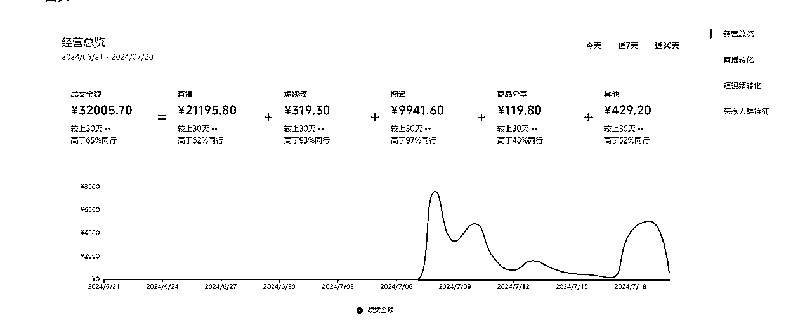
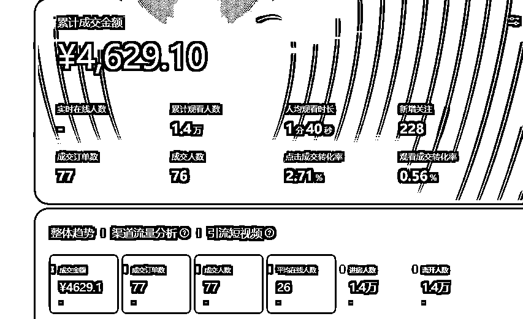
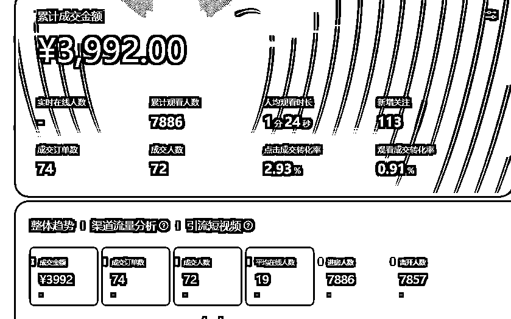
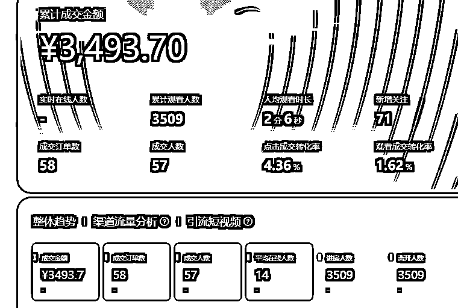
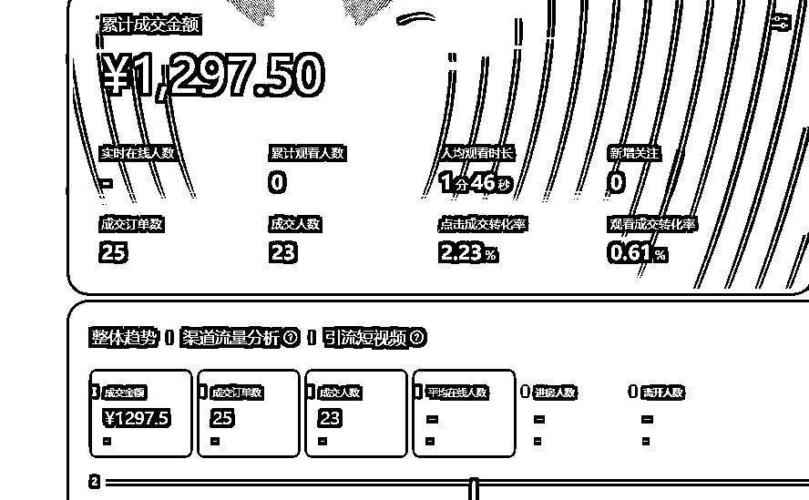
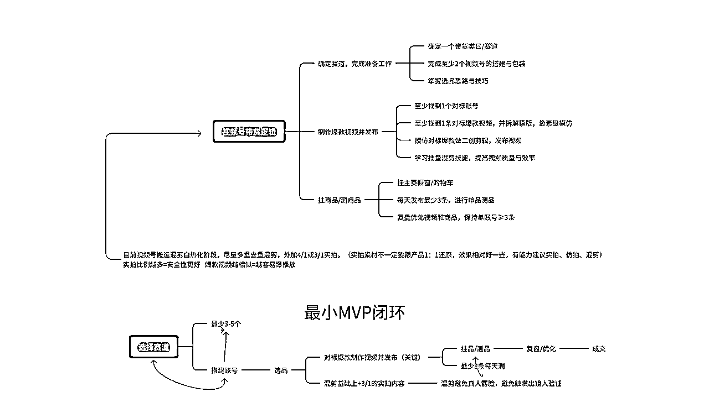
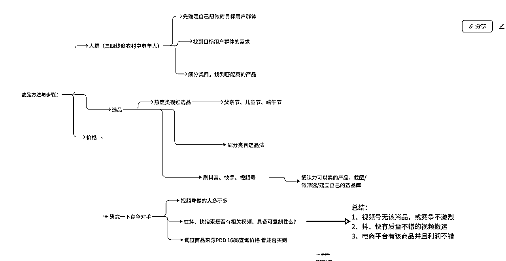
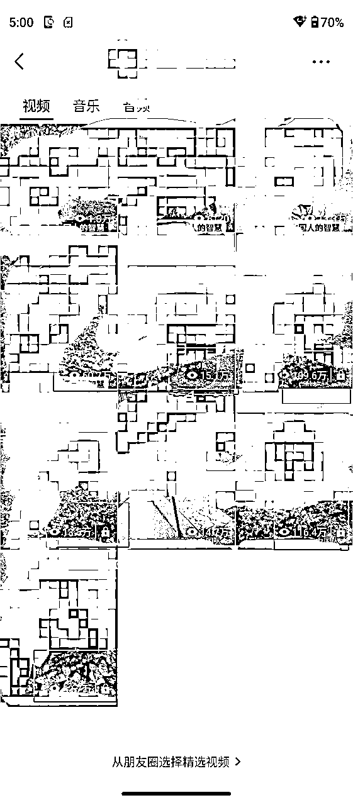
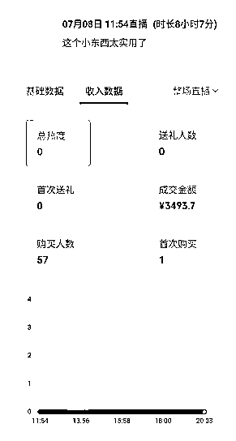

# 从操场到直播间：体育老师参加【视频号带货】航海，如何7天打造百万爆款视频，GMV突破5W+ ？

> 来源：[https://c3kvccg2ub.feishu.cn/docx/JxYudaG7goUXIsxEdKKc0mtbnEg](https://c3kvccg2ub.feishu.cn/docx/JxYudaG7goUXIsxEdKKc0mtbnEg)

大家好，我叫春哥。坐标：长沙，做视频号带货大概有1年多时间，累积变现20W+ 。经常有朋友问我是怎么找到爆款的，那今天和大家分享下我参加【视频号带货】航海的经历和关键环节，希望对你有启发～

## 一、千招会不如一招精，选择并坚持视频号赛道

目前我的本职工作是一位中学体育老师，我比较喜欢追求一种非对称性的杠杆，就是不管咋样我必须有一个稳定的保底收入，然后再去利用自己空余时间，去做一些具有一定风险，但收益更高的事情。

在不断追求副业的路上，让我链接到了生财有术这个平台。其实跟众多刚加入的伙伴一样，我起初加入也是把项目都看花了眼，但我们学体育的有一句话是这么说的“千招会不如一招精。真正厉害的功夫往往都是一招致命的。一个武术的马步扎3年才算入门，一个跆拳道的横踢，我也整整踢了10多年。

所以为了练手我在众多项目中，我选择了视频号，整个1年左右，我没有换过其他项目，所有的学习都是与视频号有关。

我对项目的预期也不高，因为我觉得基础很重要，项目的整个路径很重要。所以我降低了预期，先打基础。这里说一句，在项目探索期你是赚不到的钱的，甚至有好几个月赚不到钱，我感觉这就是学徒阶段。所以做副业的前提是，必须有一份可靠的稳定收入，这样可以让我减少焦虑，更加专注做事。

在上次航海期间，我自己新建2个账号主要用来实拍+混剪，操盘了之前的3个账号。累积发布了200+左右的作品，其中做出了4个百万播放的爆款视频，账号累积涨粉10000+。期间还有3个授权矩阵账号也有出单，累积GMV5W+。 篇幅有限附上部分截图。

视频爆了以后直播了大概十几场左右，附上部分截图。

## 二、参加航海加强基本功，打通赚钱任督二脉

接下来，我将从以下6个方面分享一下，我是如何跟着航海来加强我的基本功，来打通赚钱的任督二脉的。

### 1、思维导图串联基本动作，卡住就搜索，不会就举手。

航海手册，可以说就是一个项目的赚钱秘籍，对于重视基本功的我来说就必须要熟透这个内容，先看3遍这是最起码得。任何不能被频繁使用的知识，都是容易遗忘的。

一般在航海前我会把往期的视频号内容，进行提前熟悉。我有个习惯就是在看手册的过程中，我会把关键的一些项目知识，整理出一份思维导图，来加深我对这个知识点的印象。这样很慢，但效果挺好，我对手册内容就是这么熟悉起来的。然后再执行过程中碰到卡点，我会去看一下思维导图，具体是如何做的。如果导图里面没有，刚好我自己琢磨出来或问教练也得到解决了，我会把内容直接补充进去，进而优化这个环节。

我认为对于航海手册，我们必须在短时间内对关键知识足量重复的学习，而且必须边看边执行。卡住就搜索，不会就举手。做项目一定要对内容熟悉，手册已经整理了这个项目的详细完整的路径。而在观看手册过程中自己提炼出来的思维导图就是最符合你的一套执行方法。

就像练体育动作一样，刚开始对于新动作我们肢体会很僵硬，而且反复练习的时候很难受很枯燥。但当你先把这个动作路线搞熟练，再练习发力技巧，然后不断的在短时间内大量重复练习，我们就能做出一个标准有力的动作，所以建议大家一定要多花时间研读手册，并在研读的过程中执行，通过自己的制作的思维导图，不断迭代优化整个流程。

### 2、“刷”不断的“刷'，发掘潜力蓝海产品

选品是做视频号的关键，现阶段自己还不是那种大IP、大V的时候，别人选择在你这里购买，大概率不是因为你这个人，而是因为你这个产品的吸引了他们。当需求达到，价格又合理的时候，大概率会购买。所以选品一定要多花心思，在选品上面我也没有太多花里胡哨的东西。继续遵循千招会不如一招精，就是：“刷”不断的“刷'.每天重复这个动作。

我每天用手指划屏幕不下1千次吧，对这就是短时间内大量重复。我没有用什么考古加、蝉妈妈等。在不断的刷过程中，我刷到了我这次航海一个爆品。属于夏季的防晒类目。刷到后，我就感觉这个品很不错。为什么我会这么判断？

第一、应季品。防晒是每一个人的必须啊。但防晒品这么多，我怎么判断它有潜力？

第二，在视频号里面搜关键词。一搜发现这个品在视频号里面还没有出现。我当时就挺兴奋的，我觉得可以去测试一下。

第三、找素材，测试成功。我把抖音相关的素材全部下载下来，然后去找同类防晒类目的爆款，看看别人是怎么制作的。

我首先把同类目爆款音频拷贝下来，然后拆了一个差不多的模板，开始了第一阶段的混剪。果不其然，测试第一条，40多分钟就跑了5000多播放。我马上把视频隐藏了，因为自己手上没样品。当天我就联系了供应链，然后在多多买了样品回来，为后续实拍和直播做准备，在等样品过程中，我就开始混剪素材，按照第一个爆款模板，混剪了10条。

第二天，我由于没忍住，就直接发了3条测试，事实验证了我的正确性，当天3条都直接爆了。由于手上没样品，我就把样品打印了一个模型出来就开始播了，当天直播就出了3000多GMV。橱窗也出了好几十单。

拿到好结果后，我发现这个品是可以的，后续又增加了2个号，继续混剪发。另外2个号也同时爆了百万播放。由于自己一个人播不过来，就请了代播帮忙播。等样品到了后，我意识到这个品最少可以打1个月，我就开始每天出去实拍素材，进行剪辑，然后直播。

事实证明，我这条路是对的。每天播基本上出单挺猛，播放量也挺高。一直持续到第8天，期中一个出单很猛的号，突然限流了。原因是视频脚本重复度过高，心里顿时想死的心都有了。还好布了另外2个号，没办法，我就换号直播了。然后也陆陆续续出单。但收益明显下滑了，当然后面跟品人也慢慢多了起来。

选品成果法则：

第一：多刷广场（每天45分钟） 看到好品，马上转发到自己创建的小群，然后收藏到自己的选品库，这个品如果爆了，下次也有可能会继续爆，收藏起来，另外如果检查到视频号里面这个品的内容不多，必要时候，可以直接跟品。

第二：多刷抖音（快手）多多视频等。这次的爆款就是我通过刷抖音找到的，首先你需要把账号刷垂直，刷到的好品你就点赞收藏（就是一打开就是带货视频)然后利用空余时间去整理，建立自己的选品库，然后去分析。把在抖音快手里面找到的品，去视频号里面搜一下，看看内容多不多，到底是蓝海还是红海，内容不多的话，可以考虑马上混剪测品。当你刷到的品会有一个异常值。A 点赞量在300-500左右 B 评论区有评论需求 C 视频号目前还没出现太多。这个时候，你可以马上混剪测试。

第三：学会举一反三。刷到的爆品，打了一段时间后学会迁移联想到同类目的品。可以让你的账号持续盈利。比如;你刷到了一个夏季品“空调清洗剂”那关于空调周边的品，是不是也可以去尝试，如;空调挡风板、空调万能遥控器等等。

### 3、测品，最重要的是测起来

当找到了一个自己觉得不错的品之后，就开始去找对标，或者同类型的品，找到做的好的账号，整体数据不错的内容（看点赞、转发、评论）直接去拆解视频+拆解账号。然后模仿爆款拍摄或者或混剪内容。

那找到后具体应该怎么去测嘞？

第一：刷到品，搬运测品

我在抖音上刷到的品，我第一时间就会用软件自动搬运测试，虽然现在平台明确不支持搬运，但有一些很小众的号，他没有同步发在视频号上，我们是可以直接搬运测试的。

6月份我搬运的一个品，从搬运转到实拍也卖了4万多GMV,说明这个方法是可行的。（这里说一下搬运测品，首先你需要准备多一点的账号，现在容易违规了）在搬运测试中，你会碰到2种情况。

第一、有播放，说明没有人同步发，那继续监测5天，播放量大于3000的品，就可以买样品回来，继续深耕（继续搬运、混剪、实拍）。

第二，显示视频号内容高度重复限制推荐，这里面你可以直接放弃这个品或者扒取素材进行混剪，我一般混剪测品3-5天为一个周期，每天定时发布3条。如果播放量稳定在2000-5000或中间有出单我就会深耕，不行我就直接换品。

第二： 选到品，交叉测品

准备2-3个账号，然后找到自己认可的类目，每个品进行素材准备后，交叉测试。

比如A、B 2个账号。我选择防晒类目的品和家居类目的品，每个品混剪2条作品，进行混剪测试。A账号你发布4条，2条发防晒，2条发另外一个品。连续更新测试3-5天，哪个品播放量高，就做哪一个品。把另外一个直接删除即可。这个方法比较耗时间，因为前期的素材准备需要花一定的时间，而且自己的剪辑能力也需要一定能力。但我认为却是做项目的一个基本功。

第三： 遇到爆品，“复制”“复制”“复制”

在广场或短视频刷到爆款，我会酌情考虑，买回来进行实拍跟品。跟品的方法大同小异，就是直接复制爆款去拍摄。但这里面会涉及到样品买回来不及时的情况。流量就可能抢不到。我一般会选择美团等直接送货上门，来增加我跟品的速度，尽量在蓝海品里面分一杯羹。

事实证明在测品和跟品过程中最好的办法就是复制爆款脚本文案。我这次爆款素材的音频，就是同类品的音频，我只不过稍微修改了一下。测品的时候套用了同类品的脚本，如果找不到这个品的对标，可以去找这个品的同类型爆品去拆解也是可以的。因为后期我实拍的脚本播放量，都没有第一个脚本的播放高。后面为了保障账号不违规我基本上都是混剪慢慢过渡到实拍，实拍的大体框架要跟爆款模板相似。

这里要注意的是，为了避免账号内容出现重复度过高的问题，可以多准备几个模板。然后账号的整体营销感不要太重。可以加入一些类似的生活元素进去，或者把产品融于到一个具体的场景中去。由于这块我并不是很懂，导致一个主号直接限制流量了，问题就是脚本重复度过高。按照我上面讲的调整，我发现这样账号的违规会降低很多。

测品成果密码：

第一、不断的刷品。我认为特别是百货类目，真的需要不断刷品，让自己看得更多，你在选品测试的时候就会有感觉，一刷到，你潜意识就会告诉你，有可能会爆。

第二、多备几个账号。做视频号真的容易违规。做视频号你不搞废几个号，你还真不好意思说你做过视频号，因为规则变化真的太快了。多备几个号我们就有更多去试错的成本，不然你测几个就违规了，手上没账号玩了，也很难拿到结果！

第三、快速测试。我认为在测品过程中，对自己认为的品不要总是犹豫不决，你只有快速测试才知道，这个品到底符不符合用户的需求。测试最重要的就是，先把第一个视频最快速度制作出来，扔到市场上去验证，不要怕违规，账号对我们来说只是消耗品，即使违规了，大不了直接删除申诉。但你把账号晾在那里不去测品，那也没有变现的途径也是浪费了。

第四、运气加持。有时候你辛苦选的品不一定爆，但你不怎么在意的品，却爆了。做视频号总感觉还有一定的运气成份，但坚持久了，运气的概率就会大大提高，当你测试出来拿到正反馈的时候，你是特别兴奋睡不着的。我最高一次持续播了十多个小时，看到GMV不断提高，自己是越来越亢奋的。但不坚持，我们就有可能没有这个概率。

### 4、直播，在实践过程中不断优化解决问题的过程

我一般会提前把产品参数全部准备在文档中，然后在直播的时候，直接把文档的内容去复制到直播间，与观众积极互动。然后准备一个成交的那个响铃敲一敲。我做的是百货，对直播间要求没那么高，最多准备2个灯光差不多了。

这里面我讲一下，在视频爆了的时候，发现直播间不进人的情况，3步check法则：

第一：大概率是掉直播入口。

检查一下最近30分钟短视频进入人数。如果30分钟只有几个人，再用自己的小号去看自己的短视频，头像有没有显示在直播中。最好是安卓手机和苹果手机都交叉看一下）

解决办法：重新开直播，继续拉。

第二： 直播入口没有掉，显示正常。

优先看看账号有没有被限流，如果被限流了，马上去解（很多是自拍10条特效、风景、读古诗等）我一般是屯了一些备用素材，专门用来解号用的。

第三： 都显示正常，但直播间不进人。

这里有可能是流量不精准，可以尝试拉直播时长，把流量洗精准一点。或者必要的时候，用自己的小号在直播间引导下单，我一般是用自己的小号做鱼，去刷到10X的热卖。类似于鱼塘那种。拉时长的时候，如果自己熬不住，必要时候，可以请代播。或者暂停直播。反正就是把整个时长拉久一点，然后检查一下人群画像，一般会慢慢精准一点，后面几场陆续就开始有出单。

### 5、不爆是常态，关键是做好每一步

我认为我之所以在航海期间能拿到结果，有一些运气成分，有时候你辛苦选的品不一定爆，但你不怎么在意的品，却爆了。所以还是要加大测品的频率，不断试错，运气的概率就会大大提高。航期期间的这个品，我就是在不断刷的过程中找到的，我算是第一个找到去混剪测试发的，所以我才拿到结果了。后面也出现了很多跟品的账号，经过我的跟踪观察，发现这个品在我之后陆续增加了6-8个左右类似的账号，出单依旧不错。

能做出百万播放出来除了运气加持，同时我认为跟我关键的几个动作分不开，我在航海期间一直专注自己应该做的几件事（基本功），在关键的几个动作上面，做到短时内足量重复，我大部分时间用来做最关键的几个步骤。

找品（不断刷）-测品（每天发视频验证）-直播（不断去卖）-总结（复盘优化）。品测出来后，就专注这个品，增加账号去扩大效益。不断优化，话术、直播、短视频、文案封面等等。直到把这个品赚到一些钱，再考虑换品，或者找同类目品去横向测品。

不要去羡慕别人一场爆单几十万，作为我们刚入门的来说，每天能够稳定哪怕几百GMV都是好的。做视频号不爆是常态，把刷品、日更内容、混剪作品、拍摄、测品、创建素材库等当做自己的日常功课，每天不管啥情况都必须严格执行，相信最后收获的一定是属于坚持下去人。

## 三、知行合一，成功就是集齐所有赚钱碎片的时刻

❤️心态上，每天该干嘛就干嘛，不受心态影响。

我觉得赚钱这件事也一样真的挺难的，真的需要很多技能。特别是对于小白来说，需要在短时间内掌握这么多技能，真的需要具备足够的耐心不断的自学、搜索、练习才行，不然动作很容易变形，导致不达标。

我在航海期间基本上很少看消息，也很少看别人的战绩。只做自己每天应该做的事，大部分时间用来解决自己碰到的难题和不断地搜索、自学相关必要的知识。但往往“每天该干嘛就干嘛，不受心态影响”就挺难的。我认为掌握一项技能，像我们教学生一个体育技能一样的，刚开始学生练习的时候动作僵硬、不协调、还总是失误，心态还真容易崩，不仅仅是学生本人，就连老师看了也直摇头，我真碰到过很多类似的学生，在视频号学习中，我也是这个学生。

💃行动上，所以我们一定要具备超长的耐心，不断去重复这个动作的关键步骤，在练习时候把步骤再剖析的更具体一点，然后不断重复练习优化。

这个步骤不能省，也没办法走捷径去跨越，这就是在打基础啊！打地基啊！我们只能我们耐着性子磨。但如果在磨的过程中，你没钱，没收入，只希望在短期内拿到大结果，你大有可能磨不下去，很容易就放弃了。但当我们磨出来后，哪怕微小的进步，也将会是我们坚持做下去的动力。

总之，专注项目最关键的几个动作，具备超强的耐心，短时间内足量重复练习，直至把最小MVP跑通，我们的基本功才会真正打牢。把时间放在最关键的动作上去，不断的去重复练习吧，缺什么技能就学什么技能，练什么技能。当你把所有赚钱的技能碎片集齐，任督二脉一定会打开的。

最后，跟大家分享最近感悟比较深的3句话：

⛽️天下之至拙可胜天下之至巧！花足够多的时间，做大量的练习，重剑虽无锋但也能发挥出巨大威力。

⛽️⛽️勤奋和努力是创业者的基本素养，而不应该是夸赞的话。同时，好好赚钱，真的挺省钱的。航海那段时间基本上每天测品+直播一天就很快过去了。

⛽️⛽️⛽️做项目不要太感性，踏踏实实做好自己事。每天该干嘛就干嘛。别人赚再多，跟我半毛钱关系都没有。

最后祝大家在搞钱的路上不断精进，每天都能爆单，感谢生财有术这个平台。如果对你有启发，欢迎你评论区留言，一起交流～