# 00后大学生做小红书境外游，2个月出了12单，gmv32w➕，纯利润3w➕，我是如何去做的？

> 来源：[https://ci4gfx0d76u.feishu.cn/docx/AwYadBHy6oII4txYjUkcoR0knrc](https://ci4gfx0d76u.feishu.cn/docx/AwYadBHy6oII4txYjUkcoR0knrc)

大家好，我是北哥，00后大学生，2023年4月多加入生财，现在已经潜水一年多了，今天来给大家简单分享一下我做高端旅游如何在2个月出了12单，gmv32w➕，纯利润3w➕，我是如何去做的？

现在头像已换

出单证明如下:

# 自我介绍

00后大学生，真诚利他，现专注聚焦流量和私域已经跑通截流，自热，投流三大板块

目前在跑的主要是小红书高端旅游、ai代写、百度seo、淘宝虚拟项目

所有项目收益均在w上

现在主要是在打磨自己的后端产品、形成自己的护城河

【我能提供】

1、擅长从 0 到 1 跑通项目，帮助小白快速建立自信心，从项目中赚到第一块钱

2、全平台引流打粉sop，自热模板

3、小红书矩阵机：一人管理一百账号

4、小红书炮机： 设置好钩子 当天见效

5、抖音炮击 ：无限私信 精准采集客户 自动采集 精准用户 不缺流量

6、视屏号：精准私信 截流 视屏号可直接发微信

7、国外高端旅游相关培训资源

8、可对接出粉渠道，也可以自己打

9、自动rap 引流软件 欢迎各位老板l来沟通交流 跑通没跑通都是哥们， 小白也可以来问问题知无不言言无不尽！！！

10、提供做项目手机【非工作室机、发之前帮忙测是否可以过恭喜】

需要资源：

1.  优质私域社群，创业社群（可付费），加入更好的社群，了解最新资讯，重要的是交个朋友，

1.  长期分享，链接资源，想要解决公域引流获客，学习各种引流黑科技和骚操作，提升引流效率的老板或者有引流需求的超级个体、流量团队等

3.真诚、人品好、懂得感恩、有执行力的合作伙伴

发个老照片，和大家见面打个招呼。

说一下我为啥会突发奇去写这个文章，是因为我想吃一下私域的红利，在大环境不好的时候，知识付费低迷，各个领域大佬都在哭穷，我也不知道为啥，大环境咋也不太懂，通过和七小哥深度链接交流，我觉得更应该提早布局自己私域积累，先布局的先吃肉。

观察了一下互联网上稳定年入百万，千万，甚至这几年一直还在不断增长的大佬，绝大多数都是表达怪！

这个时代，表达怪是一定有巨大红利的。

持续流量➕好的人设=无敌

## 我是如何走入互联网这个行业的？

## 1.在大一的时候放手一搏

那时候我记的20年的时候是付费1980，跟着黄岛主，去做淘宝虚拟，那时候想的就是每天赚点饭钱，几十块钱就可以，蹦着这个目标我不断去学习开店选品等等，虽说没赚到什么大钱，但是这个确实是我开始网赚的第一步

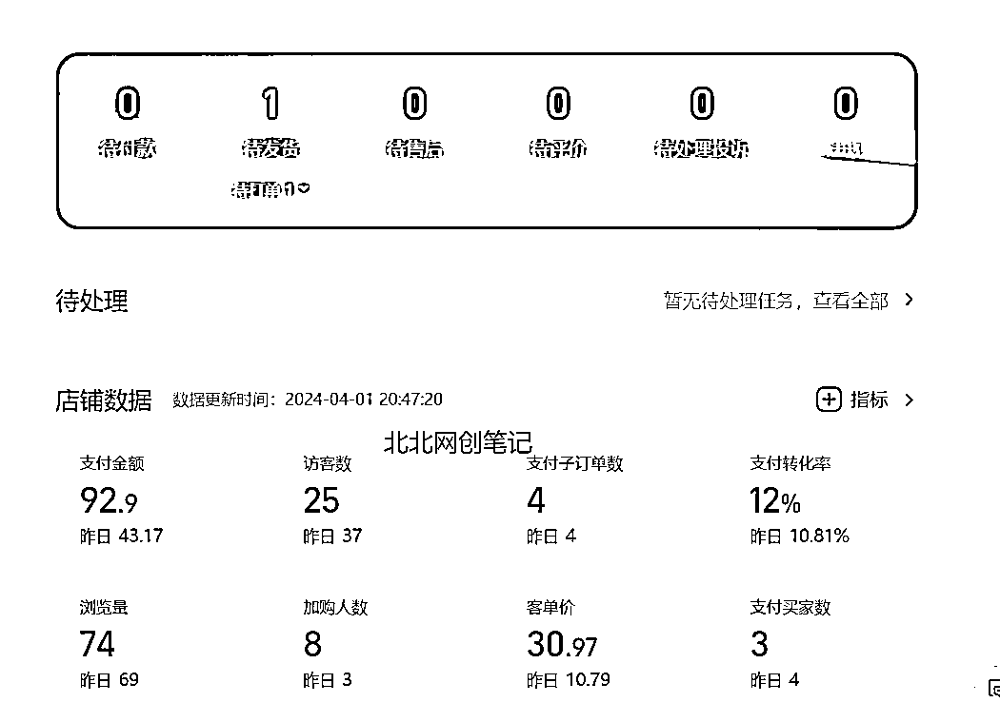

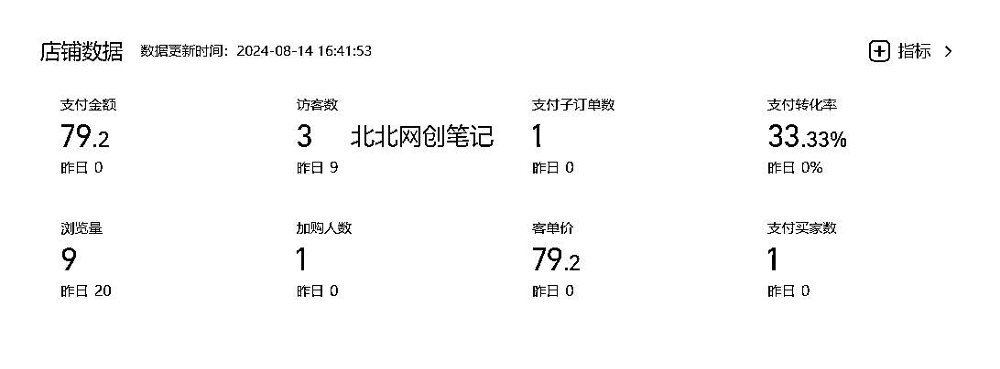

顺便附上自己最近的收益截图

## 2.闲鱼卖货无货源已跑通

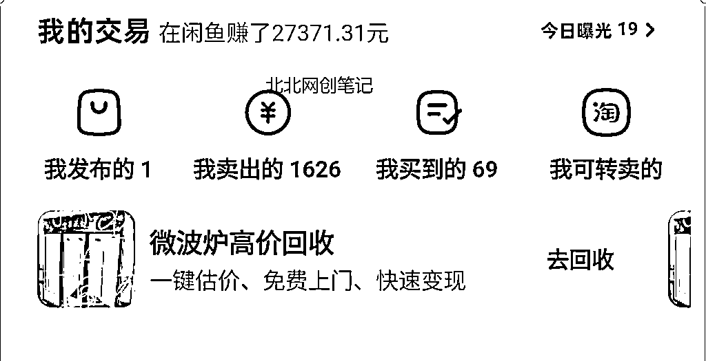

通过这个项目会写基础的卖货文案，了解了一个整体的变现逻辑。但这个别看这么高的销售额，做的百货，最后利润到手才几千块钱，前几年好多割韭菜就是这么来的，自己选品上品➕售后都是一个人，赚的钱太累了【放弃】

## 3.小红书学科虚拟

这个能让我月入2w➕，其实是那个时候吃住了平台红利，单号的利润就能搞这个么多，单价才是三四十，但撑不住量多呀，最后以封号截止，那时候单天，最少也得进100➕流量，而且这个流量持续了半个月，那时候做的人少，现在一个爆款最多几十个人的咨询

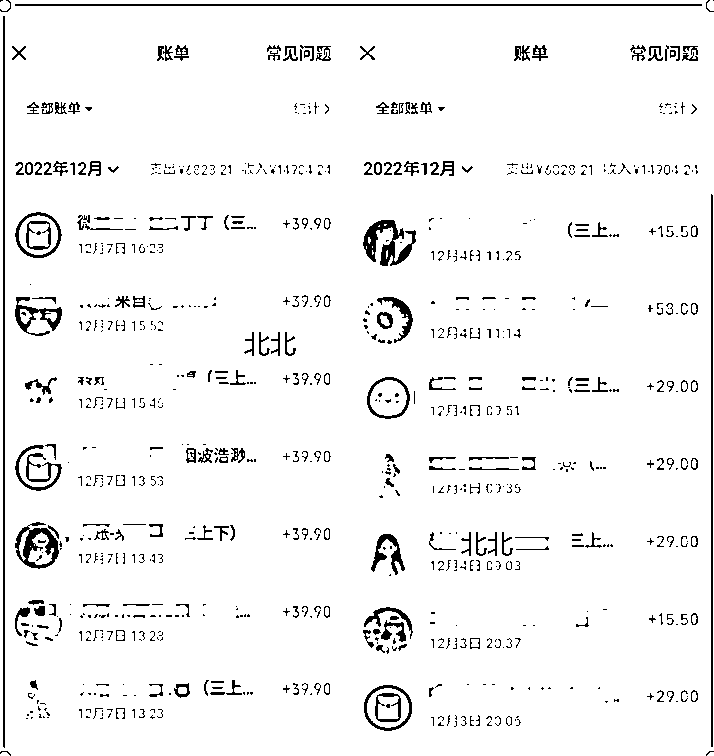

但那个时候平台规则不是很严，直接套一个模板来回套，都可以吃一波肉，但后期因为一个人干起来实在太累了，放弃了。

其他项目经历等我以后慢慢分享，暂时就写这么多吧，咱们回到正题上面

# 我高端旅游是如何去做的？

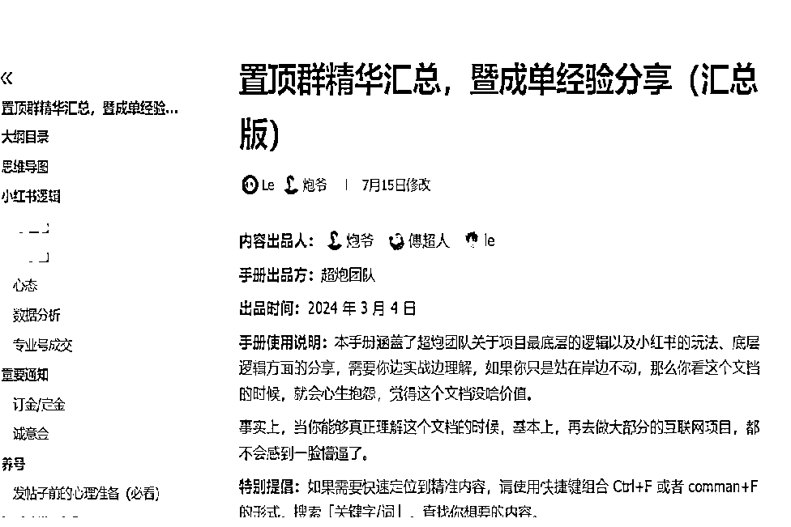

## 首先肯定是阅读sop

炮爷超人那边的万字小红书旅游精华sop

https://xsej9se9cv.feishu.cn/docx/NYK4d5hEKoaTI3xO...

即使自己从头到尾了看了四五遍，但是感觉还是一头雾水，怎么办呢？

大部分新接触一个项目的小白，肯定会焦虑，什么玩意呀，我什么也不了解，心理承受能力不足的甚至可以直接看哭了，但新接触一个领域谁也是这样，大家都是普通人，学会和自己和解，想赚这份钱，想在这一赛道上，做出自己的成绩，那就硬着头皮也要啃下来。

1、要想成事，一定要想清楚自己是来干嘛的，首要目的是什么，想要什么样的结果

比如我上学期大三的时候，我觉得上大学的目的就是为了赚到钱，那种无聊的课，我能不去肯定不会去的

我只会一股脑的提升自己花钱，找大佬链接

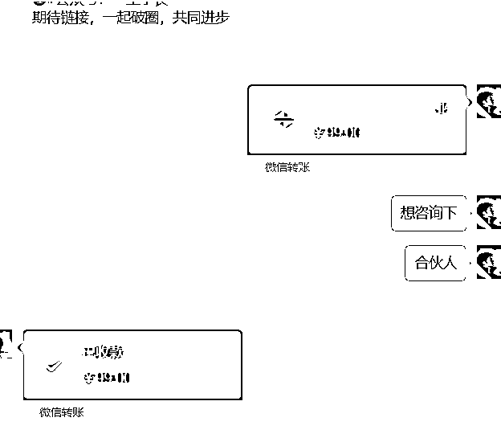

虽说没进一尘大佬的合伙人哈，但是大佬电话聊了十几分钟，也是很有收获的，我最后和一尘大佬说，我考虑下，如果确定我会补齐尾款，如果不确定这个99就当咨询费就可。

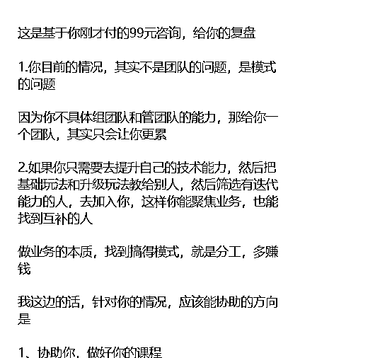

当然大佬也很好的指出我的问题，然后给我精准复盘了一下

之后我其实就是清楚了，大佬也是人，不要怕打扰，红包开道，即使是很小白的问题，相信也一定会得到，200%的回复

## 聊聊我怎么做起来爆款的？

核心就是“抄”，但是“抄”也分方法，正确的动作才能保证出不错的结果

sop里文案框架是这4块：

1，自己的情况

2，攻略

3，为什么选这个团

4，引导互动

我们先逐个拆解，知道每一步是为什么，再去做就会很丝滑

先给出总框架

自己的情况 对应 流量筛选

攻略 对应 收藏价值

为什么选择这个团 对应 流量筛选+给用户跟团的理由

引导互动 对应 留钩子+讨论价值

“自己的情况”这部分文案不是直接照搬就好的

每做一个新产品要想明白，这个产品对应的人群，他们的痛点是什么，他们为什么会选择跟团而不是自由行

境外游属于高客单产品，这样的产品对应的是有钱/付钱爽快/不喜欢做攻略/懒得做攻略/觉得自由行麻烦的群体，所以在写“自己的情况”时要对应提到这些点

超人一直讲要“代入角色”，如果大家写文案一直找不准感觉，可以模拟角色

假装自己真的要去某个地方旅行，然后以用户视角去体验下

具有收藏价值的本质其实是“这篇笔记解决了用户的问题”

举个例子

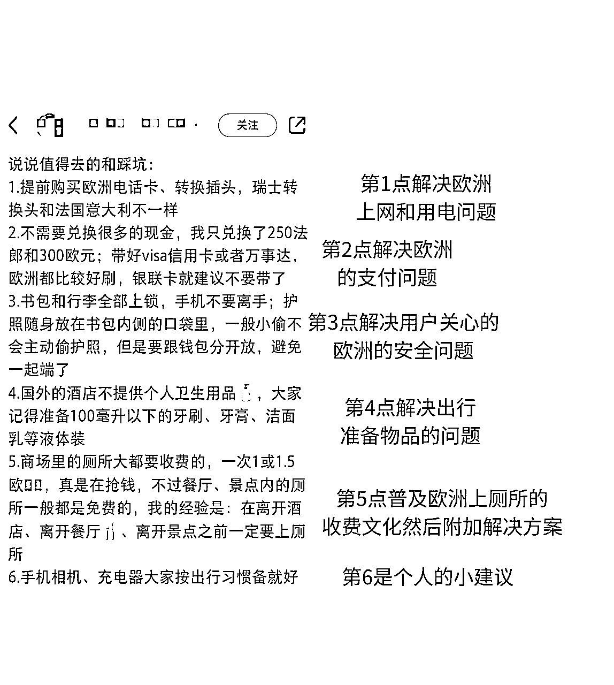

写了这几百字，真的很费功夫，这类干货类我现在还是差点意思写的

我这边就讲一下简单粗暴有用的

搭建自己的爆款sop素材库

然后抄就完了

文案框架不是有4块么？：

1，自己的情况

2，攻略

3，为什么选这个团

4，引导互动

所以你就找最近的爆款不用多50个足够，把这四部分做成素材库，

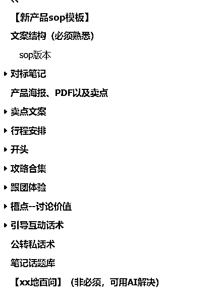

记录模板--放对标博主的信息，如下图

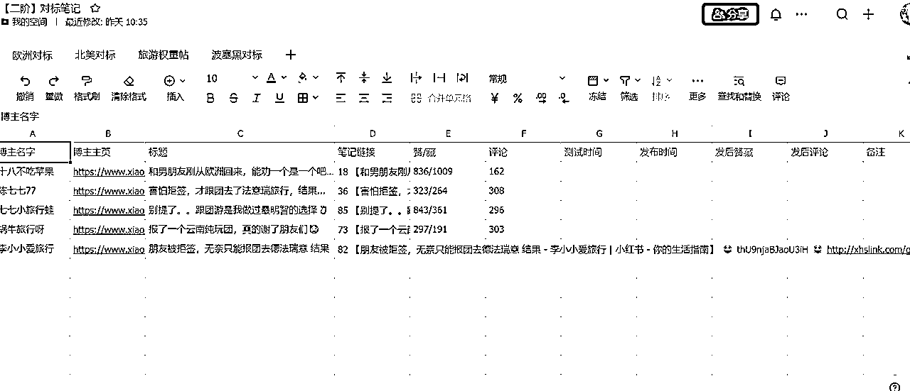

然后回家抽空慢慢处理把一个文案按照四个模块分类好，然后之后直接拼接就好了

找到自己写的国家/还有团的信息，然后把拼接好的直接，自己顺一遍，然后直接发布就好了

## 发布之后没有爆、流量低怎么办？

1、自查素材是否和同行的重复，标题是否是参考同行，不是自己原创的，记得千万记住前期

一定不要自己原创

一定不要自己原创

一定不要自己原创

同行的成功案例一定要学会去借鉴，

2、小红书的主图，一定要精致，就是美的意思，即使你文案写的狗屁不是，主图是美女什么的推流也会很好

3、常规的检测笔记是否限流，有敏感词

http://www.ju1.cn/我一般不了解的就用这个网站检测一下，后期熟练了就没必要了

我在这边分享一个我测出来的方法，首先发出去0流量，三天不过200小眼睛，这个大概率是和同行的素材重复，只需要换主图隐藏，直接发就好，亲测有效哈

## 之后就是不断测试测出一个爆款【可以吃2-3月的长尾哦，本人亲测】

测试的时候我遇到的心态问题

不敢发布笔记，对的你没听错，就是不敢发，害怕自己这个没做好，那个没顾及到，发出去被人骂怎么办

但事实上，是咱们都想多了，敢发敢测，干就完了

小红书号是咱们自己的被骂删了，大不了隐藏笔记重新发这个没啥事的，自己的号自己做主哈哈哈

接下来说下，怎么去测爆款

1.  首先先找50个点赞和收藏在100以上的，将标题直接copy下来

前期直接改地区就行，后期有经验了，可以结合俩到3个爆款标题去创作

*   话虽然难听！但这确实就是川西现状😓

*   法意瑞跟团归来，打破了我的一些幻想…

*   和男朋友刚从欧洲回来，能劝一个是一个吧…

*   大理很好，但是不想再来了

*   北京现状。。有些话不能乱说哦

*   泰国平安回来啦，能救一个是一个（听劝）

1.  内容参考我上面的sop爆款库打造就可以

1.  标签上面其实没太大影响参考同行即可

1.  下面附一张我8.19号的图，基本每天都会有2-5个精准用户咨询，长尾下来很香的的，这一个号可能就产出1w了，没细算，少说出了六七单。投产比还是很香的

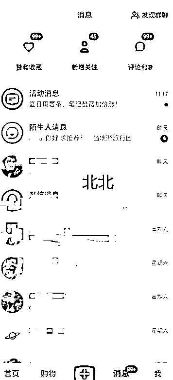

# 新手小白要怎么度过前期的迷茫期？

1、要想顺利度过新手期，先耐心地把SOP看一遍（做到哪儿就先看到哪儿，不追求一下看完），听话照做，至关重要。

2、千万不要保姆级的教程摆在了眼前，饭都喂到了嘴边，你还在那里瞎搞一桶，然后没反馈，各种抱怨和散发各种负能量，没人会喜欢这样的人。

3、调整好心态，戒骄戒躁，静下心来去实操，去反复验证。跟自己比较，不要老是盯着别人去比较，每个人的基础、能力、技能、网感、执行力都不一样，只要是在持续进步，就是好样的。

4、降低预期，先跑通0到1，不要一上来就想着我要通过这个项目赚10w，赚100w。

先跑最小MVP，把0到1拆解成一个个更小的0到1，比如发出第一篇笔记，做出第一篇1000赞藏的小爆款，第一个私信，引流第一个客户到微信，等等，

# 如何从1到10去放大

当一个项目从0到1跑通的时候、之后遇到的问题肯定是从1到10去放大，这个我跟超人私下交流过，说我跑通项目之后，一个月再赚一万或者5千对于我来说是没啥区别的，我现在最需要锻炼我的复制➕带人能力，这些是谁也教不了的，需要我刻意练习

但是带的人找什么人带呢？

那时候我在我的公众号发布了一篇招募助理的文章，陆陆续续的也有人加入，最后也招了十个人，但做出来的只能说差点儿全军覆没了😭，每天付出的时间跟沟通成本还不少，最后对项目却没有一点点增长。

最后我明白了一个道理，不要去免费带人，没付费真的没有执行力，尊重他人命运，放下助人情怀，能干就干，干不成就换，做项目不能凑付，应该不断放大渠道去赛选对的人去合作，而不是花费时间和精力把一个小白从0分带到60分，应该想办法把一个60分的带到80分为目标

延迟满足，不拉一些低质量的人进步，不给白嫖党、心态差的人机会，认知打不开，自己不执行，其实是爱做不做的

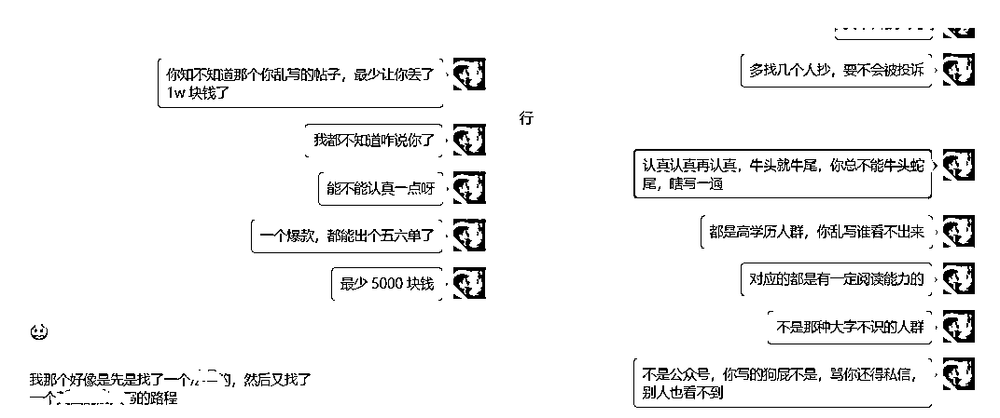

你说他乱写吧，引流5个人，还成交了一单，我只能说是天选之子、欧皇附体，我自己成交都是测到过百的粉量才开始稳定出单🤣

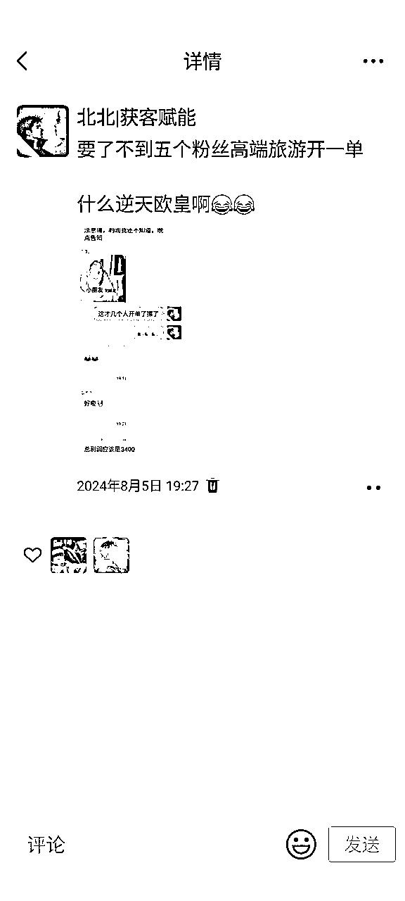

# 踩过的坑：

1、能赚钱的时候不要小富及安，要all in，不然错过了，会猛拍大腿。

2、不要去想着去赚穷人的钱，要学会去赚有钱人的钱，

比如高端旅游，向高净值人群靠拢，而不是跟一些低价人群，去扯皮那1块俩块的，原先做淘宝、闲鱼电商的时候真的牛鬼蛇神，什么人都可以遇到，很好的交付完，然后秒差评的，还有搞心态的那种，但最后忍住了，骂一句扣200，真的很搞人心态。

后来接触高端人群之后，我感觉这种让人很恶心的操作很少遇到了，但不能一竿子打死，比如和一个富婆姐姐聊聊天，热心回答问题，就收到30奶茶奖励

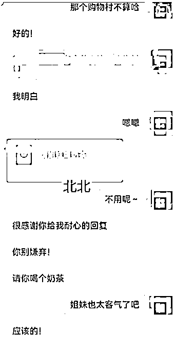

复盘一下我上面的故事：

1、打开认知，比如认认真真花时间把生财有术的你感兴趣的平台精华都看一遍（向各个领域的大佬去学习，多看一些大佬分享的文章什么的）

2、抓住和大佬交流的机会，把大佬的朋友圈/公众号看一遍，看完这个文章之后，直接红包开道，和大佬进行交流，你要知道大佬也是人，人其实最渴望得到他人的认可的，结合自己的现状比如我就是喜欢写文章或者剪视频或者录口播，找到自己的优势方面，筛选出几个靠谱并且符合自己的爱好的项目躬身去做就好了（小白的话，看准成本小，正反馈快，不要嫌少，先赚到第一块钱）

3、日拱一卒的执行力 + 反思复盘

4、跑通了0到1，想一想怎么规模化（花钱提高效率，比如招助理做一些机械的活，花钱买量），流程化（整理出sop，什么是sop？就是把大象装进冰箱需要三步，打开冰箱，把大象放进去，关掉冰箱）

5、这个项目里面收获到的经验，以及项目经历，怎么复利到下一个项目。

当然，每一步都会有 100 个人加入，最后认真做好的，可能只有 1 个人。最好的办法其实是做好筛选，不合适的人直接pass掉就可以，之后做的事，筛选就好了

把每一件简单的事做好就是不简单，把每一件平凡的事做好就是不平凡。

# 简单总结下我能在互联网上面搞到钱的核心点：

1、

听话照做！

听话照做！

听话照做！

做项目前期都是这样，28定律，有的人人家就是天命之子，运气好，一发笔记/视频就会爆，也有网感比较差的小白，甚至半个月、一个月就爆不了，作号这种是很正常的。

2、不管是做项目还是创业，新手期少不了，谁也得熬，没有正反馈的时候坚持才是胜利，当然负反馈也是很重要的，这都是为了之后避免踩坑的经验。

3、调整好心态，把战线拉长，做一些长期的事，最好还是能穿越周期的项目，有人抱着那种保姆级教程了已经，饭都喂到嘴边了还在那边瞎搞一通，没有正反馈，就开始各种散播负能量，这种人谁也不想接触的，戒骄戒躁，钱最后自然而然的就来了、降低预期，先从赚到第1块钱开始，不要好高骛远。

4、我们今天的成功，其实来自过去的努力；而我们未来要成功，一定是因为今天的努力。其实更准确地说，应该是：我们今天的成功，来自过去做对了一些事；而未来的成功，一定是因为今天做对了一些事。