# 知识付费频频暴雷的今天，该如何提升交付水平＆质量

> 来源：[https://vnr4jule4g.feishu.cn/docx/KRSHdp4WMowKmsxlLcAcM4rjnEg](https://vnr4jule4g.feishu.cn/docx/KRSHdp4WMowKmsxlLcAcM4rjnEg)

我是米杰，简单做下自我介绍

一个从大学开始折腾，做过实体、公众号、私域变现、知识付费....的男人

*   知识付费从业3年，千元以上客单价学员超3000+，百元以上客单价超1W+；

*   教了点学生，300位网创老师背后的老师；

*   组了个草班台子，公司有18位网创博主线下联合办公；

*   懂00后的男人，公司90%以上的00后伙伴；

通过这篇帖子，我希望能够帮助一些同样在知识付费领域奋斗的圈友找到关键问题，整体提升交付水平和质量。当然，我也深知自己只是凡人，无法凭借一篇文章就改变整个培训行业的乱象。但如果能影响到一些真心想做好交付，但不知从何下手的伙伴们，我的帖子也算起到了一点作用。

* * *

# 一、认清现状，洞察人性

## 一切不看市场数据说话的观点都是耍流氓。

在我看来，知识付费行业频繁暴雷的现象背后，存在着诸多具体的原因，比如【用户需求与产品交付不匹配】、【过度营销和承诺】、【市场监管机制加强】、【平台监管严格】等。然而，这些都不是根本原因。

经济基础决定上层建筑。真正的根本原因还是经济问题。随着各行各业经济下滑，大家的消费能力受到影响，手头的钱紧，甚至有钱也不敢随便花。

回顾上半年的行业观察，我发现了一些明显的变化：

1.  中部、尾部受到的影响比较大，头部影响略小。

竞争加剧，市场就自动会对没有壁垒的团队进行自动的筛选。

1.  中低客单价收不上、高客单价产品反而不受影响。

有高客单价交付能力的团队，目标客户绝大多数是高净值人群，他们的购买心理和决策成本和普通消费者不一样。

1.  灰色地带的东西拿到台面来讲的情况越来越多。

原本只能出现在灰产圈子或者私下聊的东西，如今的群聊、社群、平台评论区都充斥着。可以说是乌烟瘴气，也可以说是法律边界感越来越低，辐射人群越来越广，侧面也是体现了正规行业门槛高了。

1.  线上线下融合趋势明显，越来越多博主开线下课。

线上聊千遍，不如线下见一面。原本线上就业绩不错的团队，现在不得不开线下课程，这也筛选了很多没有线下交付能力的团队，行业门槛进一步加深了。

1.  抱团取暖的小团队越来越多。

过去很多团队自己能搞定一系列的链路：搭人设→搞流量→搞销转→搞交付。

但是当下是：

*   即便经济下行，懂抓住人性懂搞流量的人依旧很多，但是背后却没有好的交付产品。

*   即便优质项目越来越少，懂得剑走偏锋抓住差异化开发优质产品的人也很多，却不懂得搞流量。

在环境苛刻的今天，很多人没办法做到全链路，就只能寻求合作，抱团取暖了。

*   镰刀多过韭菜

如今，越来越多的人意识到，相比于真正做项目，卖项目更为赚钱。这种现象导致了一个恶性循环——认真研发项目和提升交付质量的人越来越少，而选择【恶意竞争】、【虚假宣传】、【价格战】等手段的人却越来越多。

以上是我结合数据和现象提炼的几条结论，这些分析也反映了我个人的一些观点和见解。如果你有不同的看法，欢迎在评论区补充和讨论。

* * *

## 知识付费圈子用户付费的真实情况

*   大部分人买知识付费最终是买情绪价值。

在知识付费圈子里，用户付费的真实情况往往与我们想象的不同。事实上，大多数人购买知识付费产品，最终买到的更多是情绪价值。

很多人通过购买知识付费课程来满足情感上的需求，用“花钱学习”来掩盖内心的懒惰，或者寻找一种归属感和认同感。对于他们来说，知识付费不仅仅是学习的工具，更是一种心理安慰和情感寄托。

*   卖课的本质是卖海报、卖图文。

然而，卖课的本质，其实是卖海报、卖图文。许多小白用户并没有足够的主观判断能力，他们往往因为一张看起来高端的海报就轻易买单。正是基于这两个原理，造就了一批镰刀手，他们利用视觉元素进行过度包装，从而提高成交率，并抓住用户的焦虑，不断贩卖焦虑和梦想。

在我看来，这是一把双刃剑，关键在于持刀者是谁。如何平衡这种矛盾，是当今知识付费行业面临的主要挑战。

* * *

## 当今知识付费行业的主要矛盾

韭菜日益增长的对实质性提升的需要和镰刀交付水平不平衡、不充分发展之间的矛盾。

经过多年的发展，知识付费行业本应伴随消费者的成长而成熟。然而，割韭菜的现象依然在市场中肆虐，导致大量维权团队的兴起，消费者的决策成本也随之大幅增加。

作为一名从业者，多年来我总结的经验是：被割的人，依旧还是会被割。听起来似乎很矛盾，但背后的原因在于：贪念。这种贪念只有骗子才能满足，这就是为什么一些人会一次次地上当受骗，甚至到最后都不敢承认自己被骗了，反而编造谎言来试图说服自己。

* * *

针对以上现象和结论，我认为心态尤为关键。在我看来：

*   行情差反而是机会：这是我们甩开对手、实现弯道超车的绝佳时机。逆境中往往蕴藏着最好的机遇。

*   消费者的心理短期内难以改变：尽管市场环境复杂，但我们依然可以通过精准找到需求点和痛点，进行有效的切入。

*   提升交付水平和质量是永恒的真理：无论市场如何变化，持续提升交付质量始终是成功的关键。

* * *

# 二、明确交付水平概念

纯割=诈骗

一切没有交付的知识付费都是诈骗。

不多解释，类似“AI图文带货”“老年剪辑课、无门槛、0元学”等，都是存存马扁。

* * *

交付水平≠交付感

交付水平是硬实力。

交付水平是衡量知识付费产品或服务是否达到预期标准的关键指标。

高质量的内容、有效的学习支持、以及明确的交付标准。

交付感是软实力。

交付感则是用户在实际体验中形成的感受。

比如整一个开营仪式、颁发一个结业证书、社群的欢迎仪式......

所有的交付感、仪式感都是锦上添花，建立在交付水平达标的情况下。

我见过有些人纳闷，我明明交付做的很好了呀，为什么他还是要退费？往往就出在了交付内容质量不高，整的都是一些虚头巴脑的东西。这个就容易自我感动，纯小白还吃这一套，遇到稍微有点经验的基本被一眼识破。

最好的状态就是，既要交付水平达标，也要有交付感，仪式感。

* * *

做好交付一个公式：

交付超级高水平=交付质量高+交付感强+超预期交付

# 三、做不好交付就两种人

什么人？1、只会教干货，不懂服务的人2、只有服务，没有干货的人

## 1、只会教干货，不懂服务的人

就是你的厨艺很好，但是从来都不亲自下厨让食客品尝。

提供三个解决思路：适当降低姿态；知识是需要包装的，避免知识诅咒；情绪价值拉满

*   适当降低姿态

千万不要用高傲的语气和消费者对话，建议用就是采用日常交流的方式。

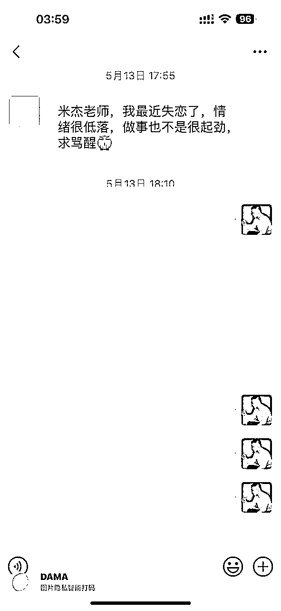

当你尝试与学员建立朋友般的关系后，你会发现她们不仅会在学习上向你寻求帮助，甚至连生活中的事情也会来找你出谋划策。比如，我有一个学员在失恋后找到了我。她真的希望我替她解决问题吗？其实不然，她心里早已有了答案。更多的时候，她只是把我当作朋友，希望从我这里得到一份鼓励和支持。

*   知识是需要包装的，避免知识诅咒

知识诅咒，是一种认知偏差，指的是当一个人掌握了某种知识或技能后，难以想象或理解那些没有这些知识的人是如何看待和理解这个问题的。这种现象在知识付费行业中尤为明显，因为知识付费的内容生产者往往难以将自己置于学习者的角度，导致内容难以被学习者有效吸收和理解。

人们会更加容易接受自己本身懂得内容，因此就需要老带新，利用对方已知的信息作为起点，逐步引导对方理解新知识。

举个例子：比如教一个新软件使用，假设你要教一位不熟悉电脑操作的朋友使用新的办公软件。首先，你可以通过展示一个简单的文档编辑过程来吸引他们的兴趣，而不是一开始就介绍软件的所有功能。接着，你可以用日常工作的例子来类比软件的使用，比如将制作PPT比作准备一次演讲，这样对方就更容易理解软件的实际用途。最后，鼓励对方亲自尝试操作，并在他们遇到困难时提供具体的指导和帮助。

最好的解决方案，就是把自己当作小白来梳理整个事情的线索，要多细有多细，颗粒度拉满。

*   情绪价值拉满

其实这就是一个"同理心"的展示，学员付费后就渴望的就是得到认可！

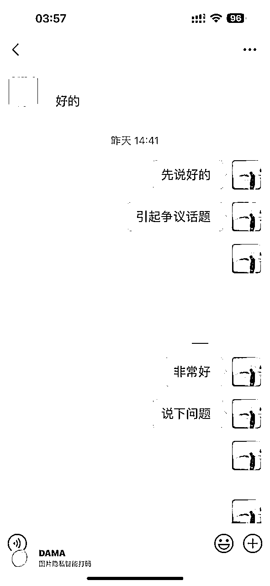

一个简单的技巧：

在给学员答疑时，我总喜欢先夸奖她们做得好的地方。即使没有特别突出的表现，能够主动提出问题本身就是值得肯定的。无论如何，先给予认可。这就像面对一个情绪失控、嗷嗷大哭的人，不管情况如何，先给她一个大大的拥抱。

别小看这点，你对于他的一个小小的鼓励也许就他坚持下去的最大理由。

## 2、只有服务，没有干货的人

菜本身并不好吃，总是喜欢用米其林的装盘，不如走大排档风格

同样提供三个解决思路

*   不要做知识付费界的海底捞，要做知识付费界的黄埔军校

恋爱中不要做舔狗，舔到最后一无所有。

同样的道理在教学过程中也适用，重要的是树立正确的心态，摆正自己的位置。有些伙伴在面对学员的质疑或反对时，会开始动摇自己的项目、思路和玩法……这也是很多教师无法控场的原因，归根结底，还是经验不足。

如果你已经取得了一定的成果，那么一定要坚定自己的观点和态度。学员可以有反对意见，也可以表达不同的观点，但如果他们执行错误、观点偏激、态度傲慢……就必须要严肃批评，直截了当地指出问题。不要因为客户付了费就把他们当作大爷、上帝去伺候！

相反，我们应该专注于培养有实力的学员和用户，就像黄埔军校那样，致力于输出专业、严谨且有深度的知识和技能。

*   拿捏好干货比，不低于30%。

我对于干货比就一个评判标准，每一个教学视频，每一个教学文件，让消费者看完都要不禁感叹：wc，这个米杰老师有点东西啊。

*   讲100句道理，都不如把123说好。

对于许多实操项目教学或陪跑训练营类的产品，仅仅讲理论是毫无意义的。你可以把平台的前世今生像讲历史故事一样娓娓道来，学员听得津津有味，但一旦进入实操环节，他们就懵逼。

因此，教学步骤必须具体、具象化，就像这样：

1.  第一步：把冰箱门打开

1.  第二步：把大象塞进去

1.  第三步：把冰箱门关闭

# 四、提升交付水平和质量的技巧

## 技巧一：合作

如果你不擅长做交付，直接找靠谱的交付团队合作是不二之选，起码别人跑通了整个闭环，

1.  一定要进行线下考察：亲自了解项目的真实情况，评估团队的技术能力。

1.  考察合作案例：了解他们是否有成功的合作经验，这一点至关重要。

1.  敲定细节，签署合同：明确合作中的各项细节，确保双方权益得到保障。

1.  评估交付成本：以副业培训市场为例，交付成本通常在30%左右，有些团队甚至可以控制在10%，具体视团队能力而定。

## 技巧二：高品质的音频/视频课程

不用说录制成为电影级别的音质和画质，但是最起码要让用户看起来、听起来是舒服的就可以。

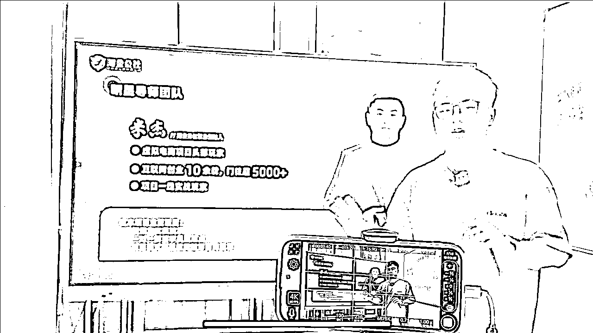

会议屏+手机录制+收音麦克风

电脑+收音麦克风

录制手机推荐

*   苹果13以上

收音麦克风推荐

*   罗德

*   大疆

如果有需要，也可以布置场景+提词器+单反+收音麦克风+灯光道具

## 技巧三：先说Why再说How

如果有听过周老师的演讲的小伙伴一定知道，在做演说的时候有一个技巧是先说why再说how，同理我们在做课程交付的时候也可以用一些演讲思维在里面，让我们的课程更加有条理性。

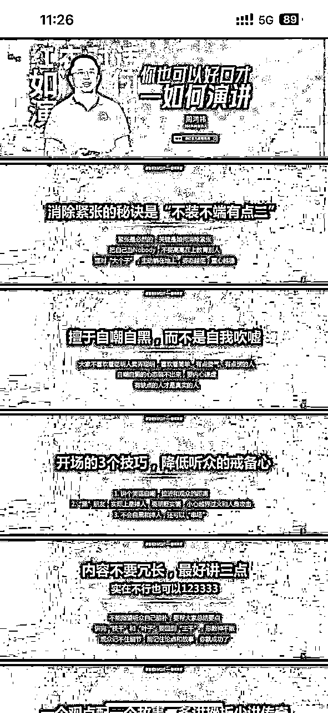

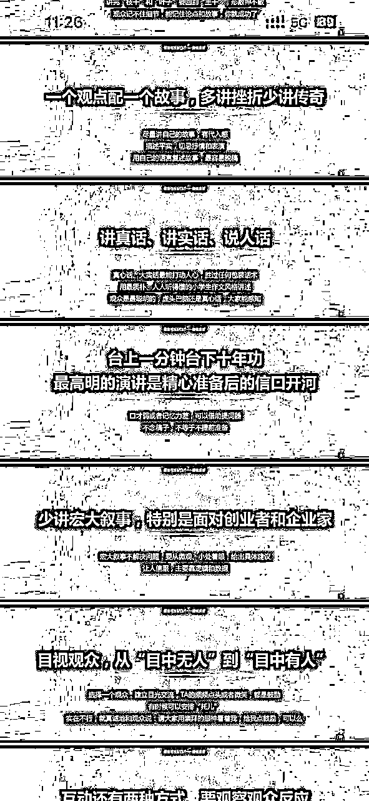

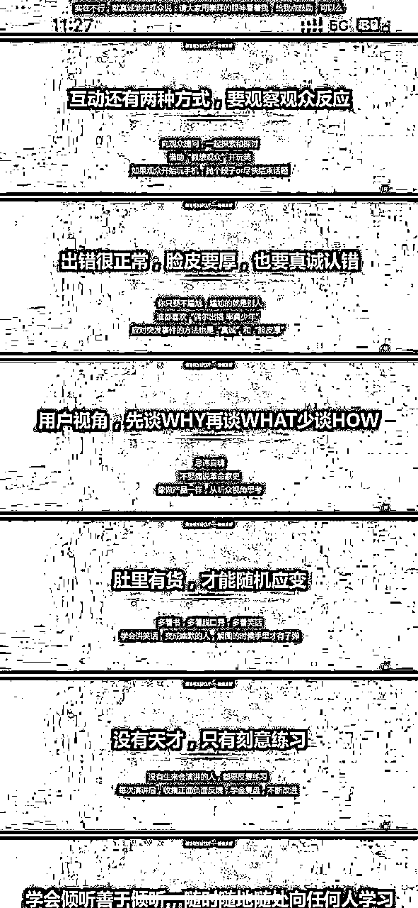

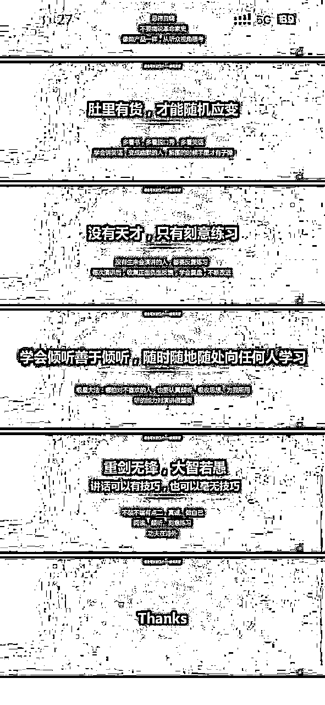

## 技巧四：信息传递效率

*   能用视频讲解的就不要用图片

*   能用图片讲解的就不要用文字

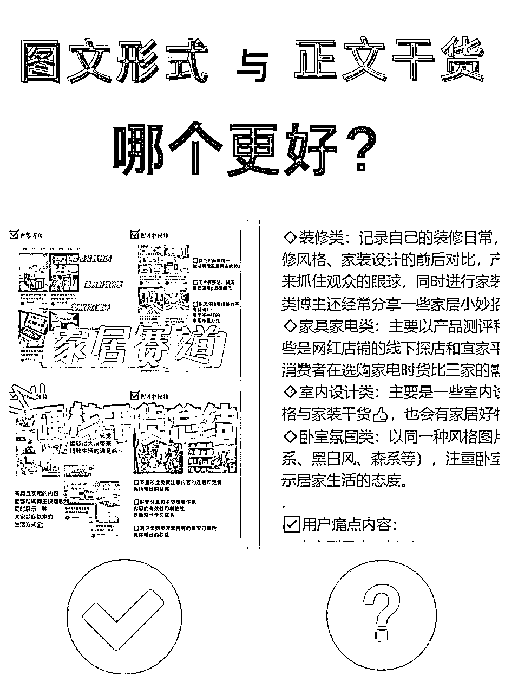

## 技巧五：可感知素材

举个例子说明：

概念包裹： “在小红书运营中，内容创作和用户互动是关键。通过持续发布高质量的原创内容，并积极回复用户评论，可以有效提升账号的曝光率和粉丝粘性。”

可感知素材： “我是在2021年开始做小红书的。当时我的账号只有几百个粉丝，发的内容也没有什么互动。我记得有一天，我收到了一位粉丝的私信，她问我如何搭配她刚买的一件衣服。我意识到这可能是一个与粉丝互动的好机会，于是我耐心地回复了她，还把她的搭配建议做成了一篇帖子发布。没想到，这篇帖子引起了很多粉丝的关注，大家开始在评论区讨论搭配技巧。为了保持这种互动，我每天都会花一个小时回复粉丝的评论，并根据他们的反馈调整内容。几个月后，我的粉丝数突破了一万，互动率也显著提高。”

## 技巧六：一课一重点

很多人恨不得在一节课里塞满全部内容，试图让学员一口气吃成胖子。我明白你肚子里有很多货，迫不及待地想要快速传达给学员这种情绪。

但是，学习一定要循序渐进。为了确保最佳的学习效果，我建议在设计课程时，每个小节只讲一个重点。

*   避免内容过载：让学员有足够的时间消化和吸收知识。

*   突出重点知识：集中精力讲解关键内容，帮助学员更好地掌握。

*   增强学习动机：通过逐步推进，保持学员的兴趣和动力。

# 五、提升交付感的技巧

同行没做的是服务，同行做过的是义务。

## 1、排版整洁干净

现在越来越多的培训公司喜欢用飞书代替word、ppt作为载体去承载资料。因而呀，使得用户获得观感的满足也是提升交付感的一种方式。

## 首先，你可以选择一张好看的封面 😃

### 你知道嘛？飞书文档封面支持动图 😎

# 🖥️ 常见的知识付费产品

未来发展趋势：

*   平民IP的崛起

*   行业细分和定制化

*   知识服务的转型

切忌：

*   同质化严重

*   运营模式单一

*   内容质量参差不齐

知识星球

一个深度连接铁杆粉丝和创作者的高品质社群平台，专注于内容创作、知识付费，提供社群运营和管理工具。

小报童

专注于创作的平台，摒弃冗余套路，专注于内容创作，提供创作收益和正向激励。

FlowUs订阅中心

为知识创作者和用户提供的知识付费服务平台，支持付费订阅和内容形态丰富，包括文本、图片、文件、音视频等。

1咖啡

让观众通过购买咖啡来支持内容创作者的平台，提供简单的方式让粉丝对创作者进行小额资助。

### 如何做出这种分区效果？

*   无边框的高亮块配合分栏使用，会给人带来规整干净的分区式视觉效果。

*   标题前加emoji再加一个空格，能大大减轻人阅读长篇文章的视觉疲劳感。

*   有的时候可以使用行内代码代替加粗或高亮，强调效果更明显。

*   emoji获取方式：一个emoji网站，总有一款你喜欢

*   分栏教程：如何使用文档的分栏能力 - 飞书帮助中心（飞书官网还有其他入门技巧）

# 📚 色彩搭配技巧

### ❤ 如果你喜欢浅色系列

### ❤ 如果你喜欢深色系列

#### 你不需要任何色彩搭配知识：

#### 同一篇文档中色彩不要太多：

高亮块的边框颜色和填充颜色，

因为色彩太多会影响阅读注意力，

选择同一列即可（点随机也可）。

当然本文档的色彩是为了排版举例。

#### 不知道你是否已经发现：

#### 如果你是一个选择困难症：

高亮块中的标题不会显示在左侧目录

你可以选择纯圆作为高亮块的块头

因此可以变相作为字号调节神器，可用于需要超级强调的内容

这样不容易搞得花里胡哨或者产生歧义，而且无需思考即可选择。

# 标题 H1

# 标题 H1

# 标题 H1

# 标题 H1

### 如何做出这种标题效果？

*   只需要在行首敲三个空格，然后把第一个空格填充背景颜色即可。

*   很妙的地方在于空格在左侧的目录上并不会有任何显示异常。

*   操作步骤参考：设置内容块背景色 - 飞书帮助中心

以上这些只是抛砖引玉，如果你想更深入地学习排版，可以去飞书官网多研究研究。

如果你用PPT授课，没有专门的美工设计团队，也没有请专人设计，那就记住一个关键词：简约大气。

## 2、建立回访机制

学员付费后最渴望的就是得到重视，定期回访和要求主动报备学习进度能大大提升学员的信任感！

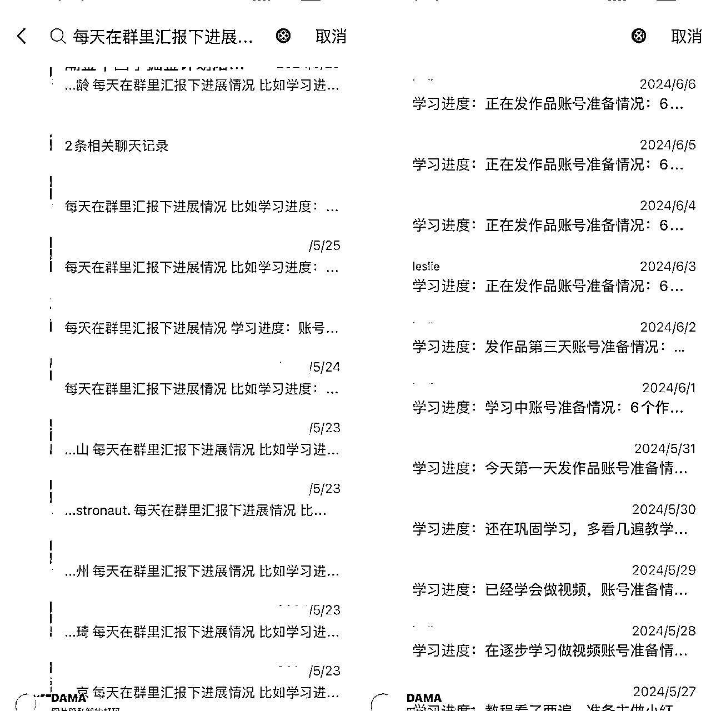

## 3、建立学员学习档案

例如你是做副业培训的，要把项目的步骤量化出来，让学员根据学习进度如实填写。一来起到督促学员实战的作用，二来也是快速学员掌握进度，可以及时进行督促。

举个例子，我在针对小红书运营教学上，就将整个流程拆分成几个步骤。

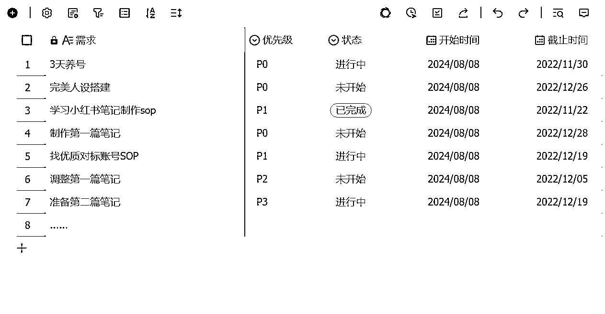

## 4、展示更新动态

产品经理、运营的同学们应该知道。任何应用上架应用市场，都会有必填项需要遵守，完成内容填写后才可以发布应用更新或上传。

产品更新就是对用户负责的一种行为，我知道这个行为本身不难，但能做到的同行很少。

举个例子，在虚拟电商这个项目教学上，我在每次更新教学手册后都做好更新记录的展示

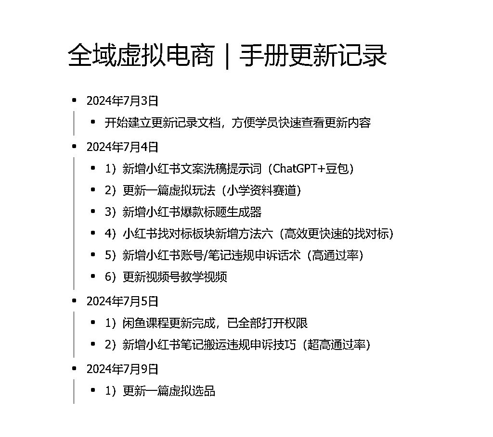

## 5、超预期交付

这点很重要，平淡的生活总是需要一些惊喜的。

例如以下这些行为都是能大大提升交付感的动作：

*   邀请行业大咖赋能

*   邀请优秀学员分享经验

*   直播课在线答疑

*   一对一交流指导

*   组织线下沙龙

*   赠送纸质版书籍

实操案例1：组织优秀学员一起组织聚餐交流活动

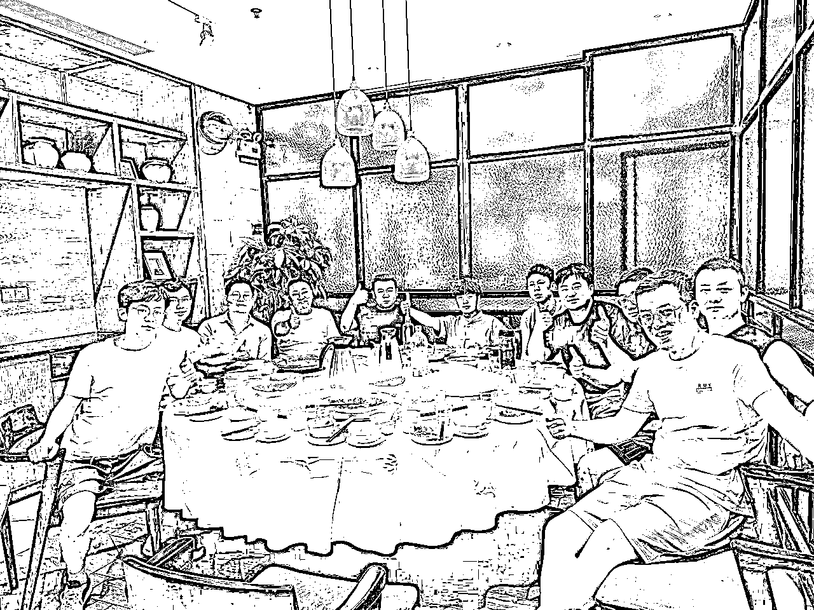

实操案例2：赠送配套纸质版书籍

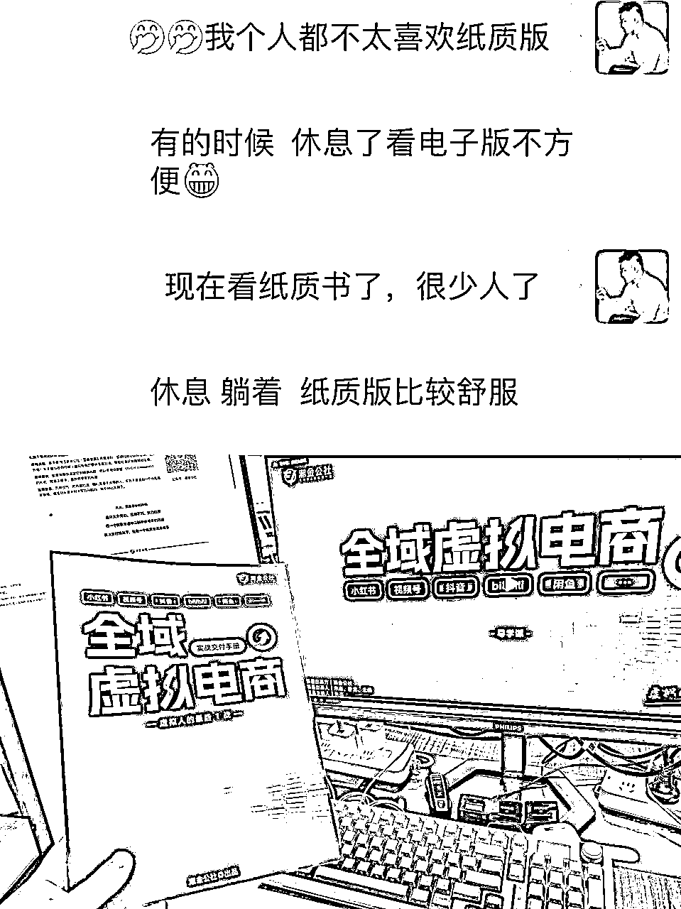

实操案例3：定期给学员一对一的交流指导

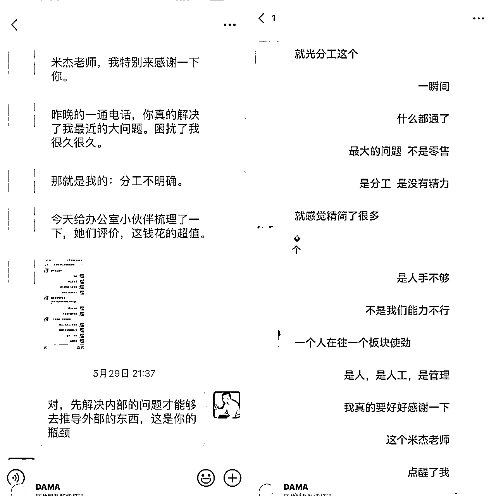

# 六、符合人性的健康机制

## 打卡机制

比如坚持打卡21天，全额退款。

## 群聊机制

有交付能力的团队建议搭建大群交付，有助于信息快速通知和建立高强度的信任感。

## 任务机制

课程内容分成不同的阶段，每个阶段设置相应的任务，学员完成任务后解锁下一阶段内容，这样可以帮助学员逐步掌握知识。

## 积分与奖励机制

学员通过完成课程、打卡、互动等行为获得积分，积分可以用于兑换课程折扣、实物礼品等。

## 社交激励机制

定期在课程平台上展示优秀学员的学习成果或分享他们的学习经验，激励其他学员积极参与。

# 七、做课必备工具大全（这就是超值交付）

## 1.课程设计

Xmind：https://xmind.cn/

让你轻便设计出吸人的课程框架

幕布：mubu.com

让你随时随地快速列出课程大纲

Processon：https://www.processon.com

简单免费的做课课流程梳理工具

## 2.详情页制作

创客贴：https://www.chuangkit.com/

精美课程详情页和做课海报设计神器

稿定设计：https://www.gaoding.com/

通过“拖、拉、拽”简单操作，轻松实现作图

快设计：https://sheji.tuchong.com/official

傻瓜式课程详情页制作工具，海量做课模板任你套

Fotor懒设计：https://www.fotor.com.cn/

全球最受欢迎的在线图片制作神器，做课好帮手

## 3.课件模板

Officeplus：https://www.officeplus.cn/

海量微课做课工具模板任你选，一分钟设计一节微课

Hippter：http://hippter.com/

课件PPT设计利器，海量正版做课PPT模板免费下载

## 4.课件素材

设计师网址导航：https://hao.uisdc.com/

各式各样的设计素材，解决做课用图，字体素材问题

ISlide：www.islide.cc

即点即用，点击即可插入PPT，省去搜集素材时间

## 5.录课工具

Camtasia Studio：https://luping.mairuan.com/

一款专业屏幕录像及视频编辑软件，简单容易上手

OBS：https://obsproject.com/

功能强大，操作简单，免费无广告的做课直播和录课工具

EV录屏：https://www.ieway.cn/evcapture.html

新手小白录课首选工具，操作简单、免费、无水印

## 6.课程剪辑

剪映：https://lv.ulikecam.com/

操作简单免费、功能全，一分钟剪辑完成做课出课

快剪辑：https://lv.ulikecam.com/

新手小白视频剪辑课程后期首选，自带各类素材、字幕模板和转场

小丸工具箱：https://maruko.appinn.me/

一款用于处理音视频的软件，让视频压制变得简单、轻松。

## 7.字幕处理

讯飞听见：https://www.iflyrec.com/

提供字幕生成功能，满足录课做课添加字幕需求。

ArcTime：https://arctime.org/

专业的字幕软件，导入视频就能自动生成字幕

我是米杰，我的分享就到这里啦~

秋分已至，下半年是旺季，祝大家下半年顺顺利利，财源滚滚。

如果你觉得我的分享对你有帮助，不妨动动手指点个赞，你的支持就是我继续分享的最大动力。