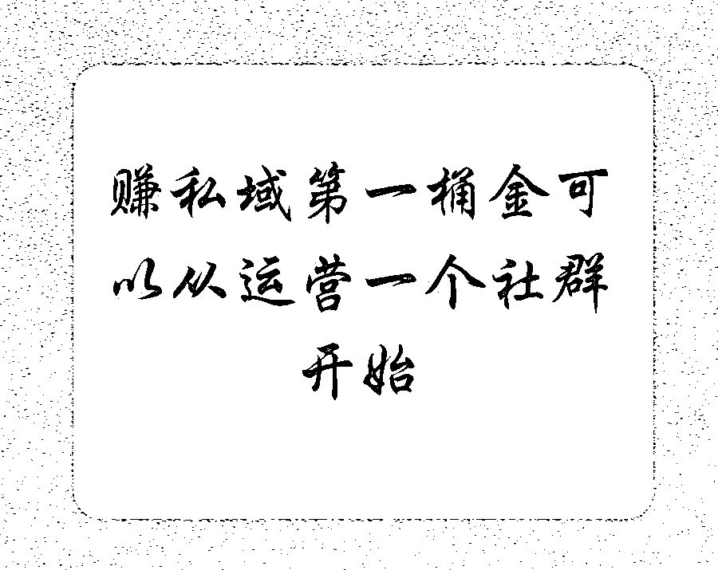
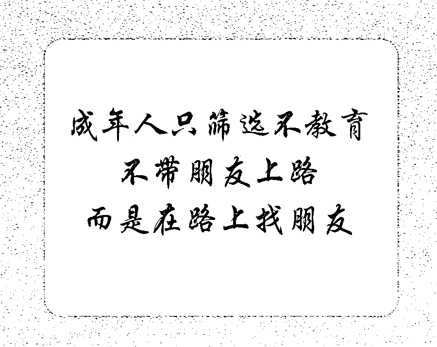

# 靠 3000 人通过私域实现月入 16 万+，我做对了什么？

> 来源：[https://vwyrp1o8uqk.feishu.cn/docx/KiRTdVlGboboEExNIVdccbVqnSg](https://vwyrp1o8uqk.feishu.cn/docx/KiRTdVlGboboEExNIVdccbVqnSg)

大家好呀，我是私域文姐，一个专为 i 人打造的不销而销私域教练。

我曾经怀疑过副业月入 10 万这种事情是不是真的，直到我自己实现了，我才发现其实是能做到的，而且作为一个素人，我的副业收入第一次突破 10 万的时候只有短短不到半年。

今天想和大家聊聊以下几个方面：

1、这 16 万+ 的构成，包含了哪些收入

2、我的 4 次副业之路

3、这中间我做对了什么？

4、第一次副业月入 10 万+ 是什么样的感觉

5、在私域中我们要做些什么？

希望能给各位带来启发。

# 一、16 万+ 的构成

发售自己产品：7 万+

发售他人产品操盘收益：1 万+

分销 5 位数客单价产品：2.2 万+

分销 3 位数客单价产品：5000+

分销 2 位数客单价产品：2000+

分销 10 元小报童：5000+

与大佬合作报酬：6000+

主业的收入、有些小的有点忘了，不爱记账的我......

发现了吗，我基本都是在卖别人的优质产品，简直是个分销小达人，但其实这就是在做私域最原始的操作。

私域最大的特点就是有利于成交。

目前来说最主流的方式也是： 公域引流，私域成交。

# 二、我的副业之路

第 1 份副业：卖面膜，摆地摊卖花

我副业赚的第一份钱是卖面膜，代理费 400 元，但是我羞于开口，那个时候也不敢发朋友圈，最后只卖了一盒给同学，赚了 10 块钱，最终亏了 390 元。

接着我的朋友在云南，我看她有在卖云南的鲜花，非常便宜，跃跃欲试的我批发了一大箱鲜花，开启了我的摆地摊卖花的幻想。

收到花后，我忙着剪枝，醒花，摆花，最终没有艺术细胞的我，还是拿了一个大麻袋和一个小凳子找到一个地下通道开始我的摆摊之旅。

最终的结果就是，我花了一下午，在地下通道，我一句话也不敢说，就等着别人来问，最终卖了 100 多元，最后摊平了我的成本。

我的第一次副业 Game over，最终以亏本 390 元结尾。

第 2 份副业：优势教练

看到了吧，其实我是一个典型的 i 人，曾经一度，我极度自卑，永远活在别人的评价里。

最终到了我的人生低谷，我遇到了一个非常擅长PUA的领导，再加上我也很擅长自我PUA，所以我开始有了抑郁倾向，觉得人生都没有意义，不想上班，什么也不想做，每天上班对我来说就是一种恐惧，这个时候我必须拯救自己。

于是我就开始学习心理学，学习优势，我从一个大V的公众号那里看到了优势发掘的训练，从这里我也开始了知识付费。

优势体系的学习改变了我，所以我也想改变别人，所以我开启了第二份副业：优势解读教练。

我做的第一件事情就是提供 10 个免费的解读名额。

但当我和别人聊天去分析他的优势时，我发现我整个人是内耗的，我每次和对方解读完后就非常累，我并不享受，所以我最终放弃了。

于是我的第二份副业在一个月后戛然而止，最终以花费了几十个小时结尾。

第 3 份副业：搜商教练

在学优势的过程中，也就是各种知识付费的过程中，我认识了很多不同的朋友。

随着和朋友们认识的越来越多，我突然发现我身上有了别人没有的优势，那就是搜索能力比较强，于是我去系统的学习了一下搜索相关的技能，开启了我的第 3 次副业。

这里其实也是我私域的启蒙，从这里我开始第一次勇敢的发朋友圈，开始运营免费社群。

让我意外的是我发朋友圈的时候是把支付码直接发出来的，然后真的就有人默默的付款了，有时候我带着耳机，收款的提醒有时把我吓了一跳～

（这个就是我第一次的私域启蒙，但其实，那个时候，我不知道这就叫私域）

这里我做了 2 年，居然也招了 50 多个学员，其中我也做了很多分销，分销一个大佬的理财课程，2 年期间大概有 1 万左右的收益。

第 4 份副业：私域营销

直到 23 年的 3 月，我加入了一个大佬的职场 VIP 星球，本来是想向他学职场的内容的，没想到一段时间后AI 突然之间就爆发了，于是我又加入了 AI 的学习并且开始朋友圈分销这个俱乐部。

不知不觉我通过朋友圈分销了 40 多个星球的时候，看到大佬发帖说分销了 20 个星球的可以找他领红包。

其实我当时是不好意思去领红包的，但是想到其实是一个和大佬链接的机会，所以我鼓起勇气的找到了大佬。在这里我和这位大佬真正链接上了，后来我分销了快 100 个星球了，大佬把我加到了一个“分销大佬”的群。

在这里我第一次体验了什么叫 KOL 的影响力，这里面基本都是各种公域的大 V，他们的聊天都能给我带来认知的改变。

于是我做了什么呢？

我做了群红，我做了群里那条鲶鱼，我把“分销大佬”群置顶了，只要有人说话我就会找机会发言，我只有一个目标：让大佬们对我有印象，熟悉我，在这里我也和大佬更加的熟悉起来。

（想要当群红的可以学起来）

然后，7 月份大佬开始了合伙人的内招，他给我打了个电话，我当时是有些不知所措的，因为我从来没有这么付费这么高过。

我找了我老公商量，我老公说要是我觉得有用就报名吧。于是我当天就报名了。

在这里大佬给我做了定位，他告诉我，我适合做私域，我的关系处理方面非常有优势，于是我开启了我的第四份副业：私域营销。

这就是我到现在的副业路线。我喜欢在社群里聊，喜欢和人打交道，喜欢在朋友圈分享。当然我也在不断付费学习中。

现在的我付费了更多的优质圈子，认识了更多优秀的人，看到了更多我从来没有接触到的认知面。

第 4 份副业已经让我实现了主业加副业超过7位数的小目标，并还在继续.....

所以大家看，其实定位也不是一下子就能搞定的，为此我花了很多年，未来也可能会再变

# 三、这中间我做对了什么

1、足够热心，足够利他

我自己建了很多社群，但因为责任心很强的我，其实是全力以赴运营的，这个群的朋友需要帮忙我都有求必应，大家对我的信任也越来越高了，而且经常说要推荐朋友进群，群里粘性很高，有时候会推荐一些产品，大家也会很买单。

（建议想赚私域第一桶金的朋友可以从运营一个社群开始）

2、愿意用付费撬动资源杠杆

我曾经一度认为所有的知识都是可以免费获取的（典型的程序员思维），但我发现一个是效率问题，一个是认知问题，一个是方向问题，还有一个是行动。

这些是付费能大大的帮助我的，所以我愿意付费，然后接触了很多优秀的人，看到了很多优秀的做法，也结识了很多信任我的人。

现在的我基本每年都会有 10 万左右的预算去付费圈子，付费高能量的牛人，因为他们很能感染到我们。

3、真诚待人，给人营销感很低

现在大家防御心理都很强，我几乎不会私聊推荐产品，更永远不会群发广告，只会朋友圈和社群推荐，主要不销而销，大家永远可以有选择的权利，需要的人自然会入手，不需要的人也不会感到压迫和难堪。

4、对人强筛选

我是很愿意和优秀的人认识的，我会不断的给予他们正反馈，礼品和红包也会适当出现，情绪价值和物质价值一个也不会落。

对于不同频的人，我会直接过滤，只有和志同道合的人在一起做事才会不断出现正反馈，减少内耗。

成年人只筛选不教育，不带朋友上路，而是在路上找朋友

5、懂得感恩

但凡有朋友或者贵人帮助过我，我都会及时反馈感恩，也会送礼物，送的礼物不会很贵，但一定是体现了我中间的用心。

自己做出了成绩，一定会及时反馈，让贵人们能够感受到，因为他们也需要情绪价值。

6、懂人性，善于顺应人性

营销的关注的一个是真正有需要的人，人们的痛点，以及针对痛点的解决方案。

剩下的就是对人性的了解，最高级的营销就是不启动用户的心里防御。

让用户自己觉得“你适合我、我需要你”然后直接匹配，双方共赢，高级，得体，不讨人嫌。

7、细节里存在魔鬼

细节里存在魔鬼，当别人做不到的细节，你做到了，当别人没注意的事情，你注意到了，那你这个人就会被别人发现，佩服。

所以我接手了一件事后要么不做，要么尽善尽美，尤其是别人的事，我的责任心驱使我做的更完美。

8、立即行动，路上调整

我做的副业方向已经很多了，没有人的方向是一开始就对的，都需要慢慢调整，但最重要的是先动起来。

想都是问题，做才有答案。

# 四、副业月入 10 万+是什么样的感觉

是赚到钱的快感吗？ 会有一点！

但更多的是内心世界被丰富的感觉，是一种幸运且幸福的感觉。

那是一种被围绕着信任的感觉

是一种幸福的感觉

是一种感动的感觉

有那么几个铁粉，只要是我推荐的，他们需要就从来不问我，默默下单。

还有那么几个铁粉，在别人那看到信息，特意来问我有没有分销，要从我这买。

还有那么一波人，在我发售产品的时候，一天收到 52 个加入我发售产品的信号，10 分钟内 34 人来向我付费，有几个人直接打钱再说话。

到这里，大家也能看到，其实私域更多的经营是人与人之间的关系，是为人处事的道理。

除了一群铁粉，还有那么一些贵人，他们总是能把我向前推了一把，给我指明正确的方向，不然我还是一步一步的慢慢来。

所以如果有一个贵人愿意帮你，你更应该好好的把握机会。

就像在我需要的时候，大佬们总是能够提供力所能及的帮助。

（这个也是付费牛人的作用）

# 五、如何经营好自己的私域？

最后我们来聊聊如何做好私域，私域是值得一辈子的事情，你所有的人脉，铁粉几乎都是在私域中获得的

第一步：做好自己的初始定位

定位的本质是通过极简的信息去占据用户的心智！

目的就是为了让用户能在第一时间想起你，来找你！

简单的来说，比如你想学私域就会想到文姐，这就是定位。

具体怎么找，文字有点多，我从我的私域小册附上一篇文章截图

第二步：精进自我，先修己再达人

我们要在自我成长中不断的去洞悉人性，与金钱和平共处，学会向上学，向下帮，提升自己的学习力，行动力与商业思维。

在对人性的洞察中，我们要知道人际交往中最大的武器其实是真诚，成年人都有自己的经历和判断，他们身上的防御心态会比直接的信任更多。

在有了对人性的洞察能力之后，我们要学会和金钱和平共处，首先需要打破对金钱的卡点，之后要在财富，健康，幸福中间取得平衡。

在和人相处中，我们可以秉持中 3 个原则，对于比我们优秀的人，我们愿意付费贴身学习，对于学员，我们可以重点培养帮助，让他们成为自己的核心力量，对于同盟，我们要学会相互帮助。

........

下面也是我小册中的一篇节选文章。

第三步：学会流量增长，打造一条源源不断的河流

无论是公域，还是私域，流量不能是一潭死水，需要源源不断的过来，新的流量永远会更加有价值。

在公域中，我们可以通过各个自媒体平台去引流，

目前有大量的自媒体平台都可以用来引流，图文类、音频类、视频类太多了。

图文类：微信公众号、微博、企鹅号、头条号、百家号、脉脉、知乎、豆瓣、简书等

视频/短视频类：抖音、快手、小红书、短视频、B站

音频类：喜马拉雅FM、网易云音乐、荔枝微课、小鹅通、播客等

在私域中，我们还可以社群引流，产品发售，知识星球，小报童，微信互推等

总的来说，粉丝质量 付费社群 > 免费社群 > 公域粉丝

第四步：私域运营，立人设处关系赢信任

在运营过程中，我们不断把自己人 IP 立起来，多维度的展示真实的自己，优秀的自己，你的IP定位就是人设，让大家多维度了解你，从而信任你。

在私域运营中，维系客户是最重要的，其中社交礼仪是重中之重，这是个人情社会，很多时候你的一个不注意，就已经在别人那打下了不好的标签。

还有私聊过程中也有很多注意事项。

第五步：内容打造， 私域界的“葵花宝典”

无论是公域的各个平台，还是私域的朋友圈，知识星球，这些都是我们的基本功力，内容力是我们的内功，这个是必备功能。

这里朋友圈是我们做私域的一个重要平台，朋友圈是一个展示自我的平台，也还是免费的广告平台。

而且朋友圈底层逻辑是人性，只要掌握了人性，就可以达到不销而销。

第六步：销冠技巧，不销而销的秘诀

在私域中，成交是我们的目的，“卖”产品是我们必修的技能，学习销冠技巧，完成不销而销的最高销售秘诀。

在这个过程中，我们要学会如何吸引用户的注意力，如何增加用户对产品的兴趣，如何提高用户的购买欲望，增加彼此的信任。

要解决用户为什么买？为什么要现在买？为什么要找你买的问题。

下面是解决为什么买的一个节选：

第七步：产品发售，越卖越有的发售技巧

来到这里，恭喜你完成了从 0 到 1，到了私域的高阶阶段，我们要学会产品的打磨和发售，一场好的发售不会损害用户的信任，而是越卖越有。

一次产品发售基本要经历准备期，造势期，预售期，发售期和跟进留存期。

第八步：产品打磨，交付力才是根基

内容力是我们的内功，产品的交付力验证我们能否做大的磨刀石，是我们的根基，一个好的产品才能靠口碑自发传播。

怎么做好产品，应该有一个什么样的产品体系？引流品，利润品，锚定品应该怎么设置，都值得思考。

# 六、结语

私域是一件值得做一辈子的事情，无论是为了更好的变现，还是为人处世，或者提升影响力，提升人脉，他都值得。

最后祝大家像我的 slogan 那样，做私域，只需放大优势，做真实的自己。

愿大家爱自己，做自己，成为能自洽的那个人。