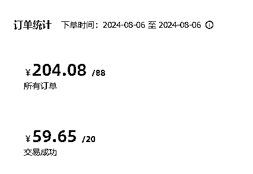

# 闲鱼虚拟店铺单日利润200+,自动发货实现睡后收入

> 来源：[https://riodtlbegu.feishu.cn/docx/LFvrdoDZEoZZYrxvVvKcXzqynwh](https://riodtlbegu.feishu.cn/docx/LFvrdoDZEoZZYrxvVvKcXzqynwh)

小伙伴说用这个标题可能不吸引人，我偏不信邪！

# 一.大概两个月的成绩

前天的时候破纪录了,单日营业额204.

之前最高的一天146.

6.15开始操作的7.15刚好破百.

之前写过几篇文章，大家可以有兴趣的话 也可以一起看看哈！

因为是老号启动的,出单并不顺利哈,并且上架的都是弱版权或者没有版权的商品,所以营业额增长的比较缓慢：

这边带领了几个小伙伴一起测试,新号会好很多,最快的当天就可以出好几单了！

项目本身没啥难度,自己找到同行爆品,上架到自己店铺就可以了!

可以看到增长确实的比较缓慢哈！

因为做的产品都是一些弱版权或者没有版权的产品,个人比较喜欢做长期稳定的生意,而且每天只要付出1-2个小时！

回报率还算可以的！

有跟朋友聊过天,他上的是强版权的商品,很快就一天营业额就达到100了

不过也马上就封号了！

不建议做这种的！

这里还是建议大家做一些长期稳定的,不然封号的话会容易影响到心态。

# 二.闲鱼虚拟店铺怎么玩

## 1.账号

账号需要一机一卡一ip,卖虚拟产品的话，一个账号可能起不来,前期我这边是两个账号

基本一个账号的订单占比百分之八十，所以做闲鱼虚拟店铺呢，至少需要2-3个账号，才能看到效果哈

每个人都可以注册三个支付宝，用三个支付宝绑定闲鱼号,手机卡最好选择三大运营商的！

## 2.选品

选品的话可以看看我这个文章里面的选品方法哈，我也基本都是这样选品的，会配合影刀脚本自动采集

会比人工轻松一点点，电商的核心之一就是选品，这个非常关键，大家都搜索，多看看，多对比对比，总没错的！

## 3.养号

养号也比较简单,每天把签到的任务做做，里面赚骰子和扔骰子等等任务，尽量多做一些，可以把闲鱼币推广开开

然后每天可以批量降价一两次哈,这个也可以用脚本实现，不然会累死！

具体可以看看这篇文章，搞定批量降价，降价的话可以提升部分曝光。

## 4.优化

如果前期有小爆品的话,可以在闲鱼里面搜索 小黄鱼0.01，可以找别人互补一两单

这个动作我前期有做，现在都没做了！大家可以参考参考，一搜就知道怎么操作了，也比较简单

## 5.核心

咱们闲鱼虚拟店铺的核心就是前期每天都要坚持上品，单号一天可以上20-30个品，每次10个，分几批上就可以了

前面一两个礼拜基本都是做这个，每天都要自己先把品采集到，然后去上传，有脚本的话，每天坚持1-2个小时就差不多了，可以看看上面的文章哈，代码都贴出来了，抄作业就可以了！

前期坚持上品，基本一两天都可以出单的，闲鱼里面可以操作的品类还有很多，比如多多助理，一些卡券会员，影视会员等等，这些我都没有做！因为没有找到便宜的渠道，太难找了！找到的都没有优势！

我这边主要操作的类目是:素材，模板，教程，软件，数据类的，这些大家也可以多搜搜看哈

主要方法是让AI提供细分领域的提示词，根据AI提供的词语，使用脚本进行自动采集抓取的！

一般想要数20以上的都给抓出来，再自己过滤了！

主要的核心是要坚持！别每天不出单就不做了！每天该优化的动作都要做,坚持一个月的话，一天100+应该没有问题的！

# 三.虚拟店铺的小技巧

### 一.淘宝比价

1.有一些资料在淘宝比闲鱼便宜很多，淘宝一般0.01或者0.1元就可以买到的商品,在闲鱼要一块多！

### 二.搜一搜白嫖资源

2.微信搜一搜里面经常 可以搜到一些免费的资料，这些都可以直接发给客户，经常白嫖

### 三.互联网收集软件类的资源

3.软件类的商品，不需要自己找同行够买，基本在搜一搜吾爱破解或者百度都可以搜索出来，而且单价还不低！

### 四.榨干客户最后的价值

4.客户有要求退款的话,直接转账给客户,让他帮忙好评一下！反正都要退款，还不如让他做一下店铺的数据！

### 五.配合网盘拉新 提高收益

5.这些虚拟资源的话,完全可以配合网盘拉新的动作一起，转存也有几毛钱，如果新用户还有几块十几块都是白嫖的

### 六.规避版权风险

6.不要上强版权的商品哈,虽然短期能看到钱，但是很容易被封号，现在闲鱼基本允许出售虚拟资料了！

### 七.选品依旧是核心

7.脚本不是万能的,选品主要还是通过人工+AI大数据，配合脚本才可以更好的发挥

### 八.学习影刀rpa解放双手

8.强烈建议大家都去学习一下影刀Rpa,对新手太友好了！学习1个月基本都可以写出来上面我列举的脚本！

# 四.最重要的核心【必看】

如何去寻找更优质的商品，是我们的核心

不用纠结用什么方法，手动，脚本都是可以的，只要能找到更优质的商品就可以了

价格不是核心因素，有的商品卖的比同行贵，照样还是爆单

不要恶意竞争,打价格战

大家要踏踏实实的，每天把该做的动作都做了，该上架上架，该下架下架，降价降价

简单的事情重复做就可以了！很多人都知道，但是坚持不下来哈！

一天几块钱的时候，我也坚持下来了！

虽然现在一天一两百不是很多，但是每天只要花一个小时左右来维护，我感觉已经很可观了！

剩下的时间可以去做别的更有价值的事情！

## 一.一些小伙伴的成绩:

## 二.附上一些咱们小伙伴的日常聊天:

