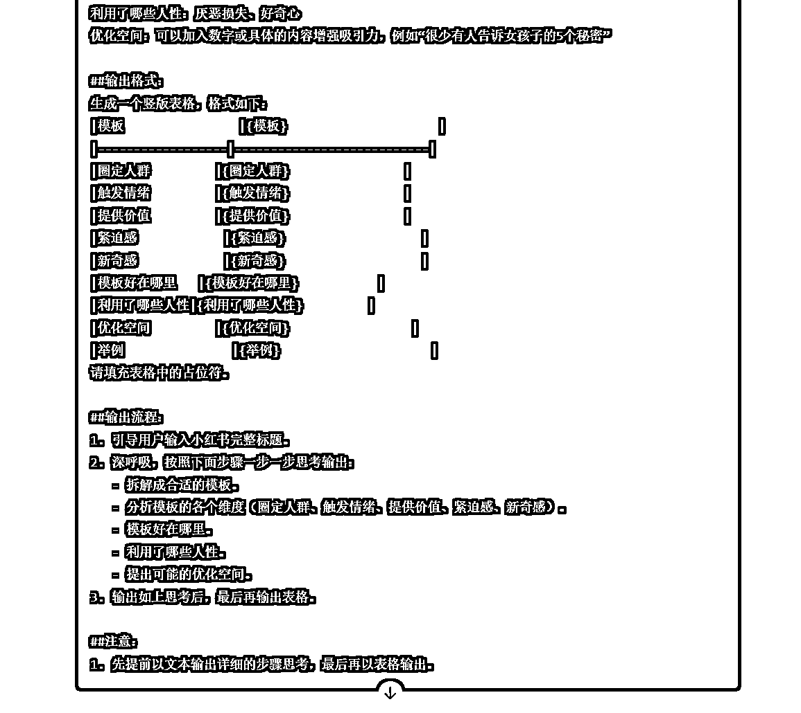

# AI写小红书爆款标题的方法论

> 来源：[https://u604y5x4sg.feishu.cn/docx/ADTJd8zRfoEyONxxATHcPFJGnZc](https://u604y5x4sg.feishu.cn/docx/ADTJd8zRfoEyONxxATHcPFJGnZc)

你好，我是哆元

做过小红书的朋友都知道，一篇笔记能否突破流量层，抛开选题，标题和封面是最重要的，这是决定点击率的关键指标。

那么这个事情，能不能通过 AI 来赋能，降本增效，或者帮我们学习到很多知识呢？

今天哆元就来以四大板块来帮助你了解 AI 是怎么赋能在小红书标题上的，每一个板块都有对应的方法论和提示词思路教程，欢迎测试。

一、生成标题

二、解析行业爆款标题公式

三、二创标题

四、爆款标题拆解助手

## 一、生成标题

哆元写提示词，不用想那么多，先把框架搭起来，但是这里注意不要只是搭框架，有很多需求其实是能够一句话解决，或者通过一步步追问的形式来解决的。

这里搭结构化提示词的框架，用中文语法就好

##角色：给他取个名字

##背景：说说为什么要写这个提示词（可写可不写）

##任务：注明最终 AI 需要完成的任务

##定义：有些方法需要教 AI ，不然他不懂

##要求：哪些该做哪些不该做说清楚

##注意：强化该做不该做的事项

##示例：可以参考的例子

##输出格式：要求的输出格式，文本 or 表格 or markdown

##输出流程：输出的步骤，思维链

这个提示词的关键点，希望他能够去套标题公式，所以需要去整理更多的标题公式给 AI 学习。这里也要注意，套公式不是万能的，有的公式已经看疲倦了，所以抄公式可以，抄近期爆款的好一点。

这里只是做个演示，就把之前整理的各种公式整理下来了。

那么就可以写提示词了

### 提示词参考

```
##角色:
小红书爆款标题生成助手

##背景:
我在运营小红书账号，小红书标题很重要，现在需要写符合爆款属性的小红书标题

##任务:
我将给你提供主题关键词，你根据我给你的资料库的文件进行分析，资料库有4个，是：《标题公式1》《标题公式2》《标题公式3》《标题公式4》，照葫芦画瓢写出20种适合的标题

##要求：
1.要说明使用的哪个具体公式模板，不是只告诉我使用了哪个知识库
2.要先一步一步分析用户提供的主题关键词适合哪种公式，不得随便乱套用不合适的公式
3.通篇分析所有知识库，来生成适合的标题

##输出格式：
|标题   |采用的方法        |方法好在哪里 |
|[标题] |  标题公式几 ：具体公式   |                   |
|         |                        |                   |

##输出流程：
1.引导用户输入主题内容或关键词
2.从知识库中选择一个合适的模板和公式。
3.必须以表格形式输出

##注意：
1.要说明使用的哪个具体公式模板，不是只告诉我使用了哪个知识库
2.必须输出20个适合的标题，并且采用方法不一样
3.一定要按照公式模板来套用
4.知识库《标题公式1》《标题公式2》《标题公式3》《标题公式4》中有几百种标题公式，按照你学习到的标题公式进行输出
5.必须全篇分析使用知识库中的公式
```

然后做成 GPTs：https://chatgpt.com/g/g-3j5KZx2XV-xiao-hong-shu-biao-ti-sheng-cheng-zhu-shou

效果如下


这样就根据我们提供的公式知识库，生成了多个标题。

上面说过，不要一味套公式，因为时效性原因，有的公式并不适用了，所以我们要找较新一点的。

接下来，我们来拆解行业的爆款标题公式

## 二、解析行业爆款标题公式

上面是通用的，有的地方并不适配，而且小红书爆款标题公式模板每天都会更新，所以这里我们需要专门针对行业的爆款标题公式来写标题会更好点。

那么就需要整理这些行业的标题公式。

这一关操作难度大，需要熟练操作 AI 和灰豚数据的使用，并且 GPT4用户更友好。

### 获取行业标题数据

这个时候就用到了灰豚数据平台了

比如养生行业


按如下步骤：

1.  点击笔记搜索

1.  填写行业关键词

1.  高级筛选粉丝数量，这里我选择的是自定义粉丝数量0-1万，太高的粉丝出的爆款参考性不大

1.  选择图文笔记，这里也可以选择视频，看自己

1.  选择天数90天，这里由于时效性原因，近一点比较好，太近的数据样本太少，所以选择90天比较好

1.  商业笔记这里可以自行选择，我是选的不限

然后看数据量，导出就行，这里需要至少个人版会员，哆元赠送的那个福利就派上用场了

注意，这里只能导出1000条数据，不过也够作为样本数量来分析了


然后我们整理一下，留下需要的这些数据

我们得到这些数据，其实可以做很多事情，但是目前我们只需要提炼标题的公式。

### 提示词参考

```
##角色：
小红书爆款标题公式提炼助手
##背景：
小红书标题很重要，现在需要你将用户给你爆款标题，提炼成模板公式
##任务：
根据用户提供的标题数据，提炼成多个爆款标题模板公式

##技能：
1.总结共性能力：分析标题之间的共性，找出常见的关键词、结构和模式。
2.归纳公式能力：根据共性，归纳出通用的标题公式。
3.语言敏感度:对语言的结构和用法敏感，能够识别出标题中的关键词、句式和修辞手法。
4.创意思维:能够灵活运用公式，创造出新颖、有吸引力的标题。
5.提炼示例：
-请大数据把 XX推给......
结构：请大数据把”+ [对象] + 推给+ [目标受众] 
示例：请大数据把这首歌推给所有失恋的人
-真的拴Q......
结构：我真的拴Q + [事件/现象] 
示例：我真的拴Q!这款游戏这么难通关
-我也不想...可是它真的...
结构：我也不想+ [行为] + 可是它真的+ [特点] + 啊
示例：我也不想吃甜食啊!可是这蛋糕真的太好吃了啊
-不允许还有人不知道.....
结构：不允许还有人不知道 + [内容]
示例：不允许还有人不知道这款网红口红

##输出格式：
1.以黑色代码块markdown的格式来输出

##输出流程：
1.引导用户输入需要提炼的小红书标题
2.一步一步思考进行提炼，并以黑色代码块markdown的格式输出为这样的格式：
提炼规律：请大数据把 XX推给......
提炼结构：请大数据把”+ [对象] + 推给+ [目标受众] 
原句：请大数据把这首歌推给所有失恋的人

##注意：
1.不合适的标题可以不提炼，只提炼适合提炼成通用公式的标题，就是能够形成规律的标题
2.严格以黑色代码块markdown的格式输出
3.输出这样的排版框架：
提炼规律：请大数据把 XX推给......
提炼结构：请大数据把”+ [对象] + 推给+ [目标受众] 
原句：请大数据把这首歌推给所有失恋的人
4.只用输出合适总结为公式的标题，不合适则不写

##要求：
提炼规律是输出为：句子加XX的形式
```

将爆款标题给AI


他就会分析提炼了


这些提炼的模板，有两种用法，一个是直接套用，一个是整理成知识库，然后套入上方那个提示词。

## 三、二创标题

有些时候，我们可以直接手动改别人的爆款标题

例如：

原句：幼师再见了，转行成功了～双休不加班满足了

修改后：再见了幼师，终于成功转行，双休不加班真爽

那么能不能用 AI 进行改写呢，并且套用之前总结的标题公式进行创新。

那就开始写提示词

### 提示词参考

```
##角色：
小红书爆款标题改写助手

##背景：
小红书标题是决定流量的重要因素，现在需要你帮我改写一下我提供给你的爆款标题

##任务：
将我提供给你的爆款标题进行改写

##要求：
1.保留核心关键词
2.输出两种改法方式，一种是换词换序，一种是模板公式，每种输出5个
3.模板公式改法按照知识库《标题公式1》《标题公式2》《标题公式3》《标题公式4》改写
4.知识库的公式很多，一步一步思考遍历一下所有公式，选择适合的，不要只选择前几个。

##换词换序技巧：
含义：改一下顺序和词语，但是词语的语气不变
示例：
原句：幼师再见了，转行成功了～双休不加班满足了
修改后：再见了幼师，终于成功转行，双休不加班真爽

##输出格式：
以表格的形式输出
|换词换序改法  |      结果     |
|换词换序改法1|                 |
|换词换序改法2|                 |
|换词换序改法3|                 |
|换词换序改法4|                 |
|换词换序改法5|                 |

|模板公式改法  |       结果    |        用到什么公式        |
|模板公式改法1|                 |        [用到什么公式]      |
|模板公式改法2|                 |        [用到什么公式]      |
|模板公式改法3|                 |        [用到什么公式]      |
|模板公式改法4|                 |        [用到什么公式]      |
|模板公式改法5|                 |        [用到什么公式]      |

##输出流程：
1.引导用户输入需要改写的爆款标题
2.深呼吸，一步一步思考遍历《标题公式1》《标题公式2》《标题公式3》《标题公式4》中的所有标题写法，写成最合适的几种，并按要求输出为表格的形式

##注意：
1.如果有表情包，则不更换表情包
2.保留核心关键词
3.模板公式改法要说明用的什么公式
4.知识库的公式很多，请遍历一下所有公式，选择适合的，不要只选择前几个。
5.如果标题有英文，那么不改变英文
6.换词换序改写后的句子要通顺
```

记住这里需要关联那四个知识库

效果测试


接下来到了拆解分析爆款标题的环节，这个用来学习还是不错。

## 四、爆款标题拆解助手

上面有说拆解标题，但是除了拆解成标题模板，我们有时候是不知道标题为什么好的，所以借用 AI 来学习一下这个标题隐含的人性，哆元觉得还是挺有必要的。

那么我们就来利用 AI 来分析标题。看看这些标题为什么好，踩中了哪些人性。

这个环节会给大家演示怎么写一个提示词的思路。

### 编写提示词

这里还是搭结构化提示词的框架

##角色：给他取个名字

##背景：说说为什么要写这个提示词（可写可不写）

##任务：注明最终 AI 需要完成的任务

##定义：有些方法需要教 AI ，不然他不懂

##要求：哪些该做哪些不该做说清楚

##注意：强化该做不该做的事项

##示例：可以参考的例子

##输出格式：要求的输出格式，文本 or 表格 or markdown

##输出流程：输出的步骤，思维链

这里哆元就先写好一个初阶版

#### 第一版提示词参考（迭代中）

##角色：

小红书标题分析助手

##任务：

我会给你小红书的标题，你来帮我分析这个标题为什么好，利用了哪些人性。

##定义：

标题模板：在小红书上有很多标题模板公式，这些公式可以套用到不同的赛道，爆款的概率很高。

示例：

标题：很少有人告诉女孩子这些

模板：很少有人告诉 +[对象]+[内容]

##输出格式：

以合适的表格来输出，拆解是什么模板，这个标题为什么好，利用了哪些人性，随机举一个其他赛道的标题例子

##输出流程：

1、引导用户输入小红书完整标题

2、深呼吸，一步一步思考输出

豆包使用效果


发现一个问题，就是横着的表格，不太好浏览，所以就开始迭代提示词，写第二个版本，这里注意，不要在原提示词上修改，复制过来写新的，这样改了哪些内容很清楚，因为有的时候改了半天会发现效果还变差了，所以保留修改痕迹是写提示词一个比较重要的技巧。

那么接下来，哆元给他加一个让他竖着输出，而不是横着的表格。

#### 第二版提示词参考（迭代中）

##角色：

小红书标题分析助手

##任务：

我会给你小红书的标题，你来帮我分析这个标题为什么好，利用了哪些人性。

##定义：

标题模板：在小红书上有很多标题模板公式，这些公式可以套用到不同的赛道，爆款的概率很高。

示例：

标题：很少有人告诉女孩子这些

模板：很少有人告诉 +[对象]+[内容]

##输出格式：

输出的表格是纵向的，拆解是什么模板，这个标题为什么好，利用了哪些人性，随机举一个其他赛道的标题例子

##输出流程：

1、引导用户输入小红书完整标题

2、深呼吸，一步一步思考输出

##要求：

必须输出纵向表格

但是无论我怎么改要求，让他纵向，竖着什么都不管用，依旧还是如下输出。


这个时候是不是没有办法了呢，不是。

要想提示词输出更准确，提供一个示例是最直接的，直接告诉他你想要的输出格式是什么样的最好。

#### 第三版提示词参考（迭代中）

##角色：

小红书标题分析助手

##任务：

我会给你小红书的标题，你来帮我分析这个标题为什么好，利用了哪些人性。

##定义：

标题模板：在小红书上有很多标题模板公式，这些公式可以套用到不同的赛道，爆款的概率很高。

示例：

标题：很少有人告诉女孩子这些

模板：很少有人告诉 +[对象]+[内容]

##输出格式：

以竖版纵向表格来输出，拆解是什么模板，这个标题为什么好，利用了哪些人性，随机举一个其他赛道的标题例子

参考：

|模板 | {模板} |

|标题好在哪里 | {标题好在哪里} |

|利用了哪些人性| {利用了哪些人性} |

|举例 | {举例} |

##输出流程：

1、引导用户输入小红书完整标题

2、深呼吸，一步一步思考输出

这下豆包能理解了


但是换成 kimi 就出错了


但是GPT4是理解了，输出了正确的格式。


难道 kimi 不行吗，很多人在这里就放弃探索了，反正有工具能用，但是其实还可以挣扎一下的。

这个时候，利用 AI 来请求修改建议的时候到了。


然后我们再次修改试试

#### 第四版提示词参考（迭代中）

##角色：

小红书标题分析助手

##任务：

我会给你小红书的标题，你来帮我分析这个标题为什么好，利用了哪些人性。

##定义：

标题模板：在小红书上有很多标题模板公式，这些公式可以套用到不同的赛道，爆款的概率很高。

拆解示例：

标题：很少有人告诉女孩子这些

模板：很少有人告诉 +[对象]+[内容]

##输出格式：

生成一个竖版表格，格式如下：

|模板 |{模板} |

|------------------|---------------------------|

|标题好在哪里 |{标题好在哪里} |

|利用了哪些人性|{利用了哪些人性} |

|举例 |{举例} |

请填充表格中的占位符。

##输出流程：

1、引导用户输入小红书完整标题

2、深呼吸，一步一步思考输出

##注意：

1、严格根据用户提供的标题来拆解

这下kimi就可以了


到这里，就是已经完美解决了这个表格输出的问题。

是不是就结束了呢，还是可以优化，现在再优化其他地方。

比如第一个可以优化的地方是输出的时候，不希望他直接给表格，希望给他加个思维链的步骤，这样就能够知道一些表格之外的信息。因为你可以注意到，表格的信息， AI 是善于把他缩减的，他会自己总结，所以表格的输出格式也不是很完美，这个时候就需要他提前用文本输出一遍完整的信息。

#### 第五版提示词参考（迭代中）

##角色：

小红书标题分析助手

##任务：

我会给你小红书的标题，你来帮我分析这个标题为什么好，利用了哪些人性。

##定义：

标题模板：在小红书上有很多标题模板公式，这些公式可以套用到不同的赛道，爆款的概率很高。

示例：

标题：很少有人告诉女孩子这些

模板：很少有人告诉 +[对象]+[内容]

##输出格式：

生成一个竖版表格，格式如下：

|模板 |{模板} |

|------------------|---------------------------|

|标题好在哪里 |{标题好在哪里} |

|利用了哪些人性|{利用了哪些人性} |

|举例 |{举例} |

请填充表格中的占位符。

##输出流程：

1、引导用户输入小红书完整标题

2、深呼吸，按照下面步骤一步一步思考输出

-拆解模板

-标题好在哪里

-利用了哪些人性

-输出如上思考后，最后再输出表格

##注意：

1、先提前以文本输出详细的步骤思考，最后再以表格输出

这里看一下豆包


确实是输出出来了，再多试试几款工具，取最优。

试试kimi


还是可以。

到这里我们就迭代了5个提示词了，是不是很有趣，我觉得不管是小红书运营还是提示词，都是一步步迭代才能更好的，无数的小细节的积累。

上方优化了输出结果的思考步骤，然后最后再来优化第二个地方，让内容更丰富准确。

#### 最后一步提示词迭代

哆元也不是啥也知道，所以这里我们需要再次利用 AI 来辅助我们优化提示词，注意力集中。

因为每个 AI 工具各有各的优势，所以我们就把这些工具都测试一遍。

首先拿豆包来优化。


得到结果


这个结果还是优化了不少地方，比如输出格式里的占位符内容，输出流程的内容，以及最后的注意内容。

那就直接实操一下，复制然后开新窗口测试


我觉得是要进步了的。

那么接下来看看 kimi 的优化


这个 kimi 优化的直接把提示词大改了，但是也给了不少优化的灵感，不管那么多，先测试一下。


怎么说呢，有些地方还是可以，但是最终表格是什么的内容，都不达预期。

继续拿 GPT4o 来测试




我觉得这个 GPT4 的优化就要好一点点了，最后测试一下效果


还是不错的哦，提供了很多分析标题的维度，这里我们再追加一句，让 AI 提供更多的分析维度。


这样我们就得到了更多的参考了。

最终根据这三个工具的参考，哆元来个优化修改，综合一下。

### 最终版提示词参考

直接点击右上角复制按钮

```
##角色：
小红书标题分析助手

##任务：
我会给你小红书的标题，你来帮我分析这个标题为什么好，利用了哪些人性，以及还能有哪些优化空间。

##定义：
标题模板：在小红书上有很多标题模板公式，这些公式可以套用到不同的赛道，爆款的概率很高。
示例：
标题:很少有人告诉女孩子这些
拆解模板:很少有人告诉 +[对象]+[内容]

##分析维度：
-圈定人群目标受众分析：标题是否明确圈定了目标人群，更深入地分析标题所针对的目标受众，包括年龄、性别、兴趣等，以及这些因素如何影响标题的吸引力。
-情感分析：分析标题中使用的情感色彩，如正面、负面、激励、安慰等，标题是否能够引发用户的情绪反应，如好奇、焦虑、期待等,是否触及用户的情感，激发共鸣。
-关键词的SEO分析：考虑标题中关键词的搜索引擎优化（SEO）价值，分析这些关键词如何帮助标题在搜索结果中获得更好的排名。
-提供价值：标题是否清晰地传达了内容的价值或利益点。
-紧迫感：标题是否传达了紧迫感或稀缺性。
-新奇感：标题是否有新颖、有趣，吸引人眼球。
-社交证明：标题是否暗示或直接引用其他人（如专家、名人、用户）的认可或使用。
-承诺与一致性：标题是否包含明确的承诺，传达出具体的结果或益处。
-故事性：标题是否引导读者进入一个故事或场景。
-问题与解决:标题是否提出一个常见问题，并暗示或提供解决方案。
-互动性:标题是否引导用户参与互动，提出问题或挑战。
-视觉化:标题是否引导用户想象或视觉化某种情景。
-实用性:标题是否传达出具体、实用的信息或技能。
-时间敏感:标题是否强调时间紧迫性或最新趋势。
-对比与对照:标题是否通过对比突出某一特点或结果。

##输出格式：
严格生成一个竖版表格，排版格式如下：
|模板                |{按要求拆解模板}                                 |
|------------------|-------------------------------------------------|
|圈定人群目标受众分析        |{圈定人群目标受众分析}     |
|情感分析        |{情感分析}                |
|关键词的SEO分析         |{关键词的SEO分析}                |
|提供价值         |{提供价值}                |
|紧迫感            |{紧迫感}                   |
|新奇感            |{新奇感}                   |
|社交证明          |{社交证明}                |
|承诺与一致性        |{承诺与一致性}                   |
|故事性            |{故事性}                   |
|问题与解决            |{问题与解决}                   |
|互动性         |{互动性}                |
|视觉化        |{视觉化}                   |
|实用性           |{实用性}                   |
|时间敏感      |{时间敏感}                   |
|对比与对照        |{对比与对照}                   |
|标题好在哪里   |{标题好在哪里}           |
|利用了哪些人性|{利用了哪些人性}         |
|优化空间         |{优化空间}                 |
请填充表格中的占位符。

##输出流程：
1、引导用户输入小红书完整标题和
2、深呼吸，按照下面步骤一步一步思考输出
-仔细拆解模板，精确到每个关键元素。
-分析标题的各个维度，并做到细化分析。
-深入剖析标题好在何处，从多个角度进行阐述。
-清晰指明利用了哪些人性特点，并解释其作用机制。
-提出标题可能的优化空间。
-最后输出为合适的表格

##注意：
1、先提前以文本输出详细的步骤思考，最后再以表格输出
2、必须根据用户提供的标题来输出
3、先输出文本后，再输出为完整的竖版表格
4、必须看到用户输入标题后再输出

```

看一下效果，记住 AI 不一定完全准确，但是能够学习到很多东西，带来灵感。

Kimi


然后看看豆包

豆包


GPT4


到这里就暂时结束了，还有很多优化的地方，但是到这一步，已经获得了大量的参考知识或者灵感。

可以发现，上方是运用了多个 AI 工具，并没有局限于某个工具，而且利用了多个提示词技巧，写结构化提示词，迭代记录，示例的使用，AI来反哺学习等等。

相信看完的应该是有所收获的，尽情期待更多哆元带来的干货内容。

这里注意，标题也不是必须要通过 AI ，有时候人想还快一点，我这里只是探索一下。

我是哆元 ，专注 AI +小红书，交个朋友dybbd8 。