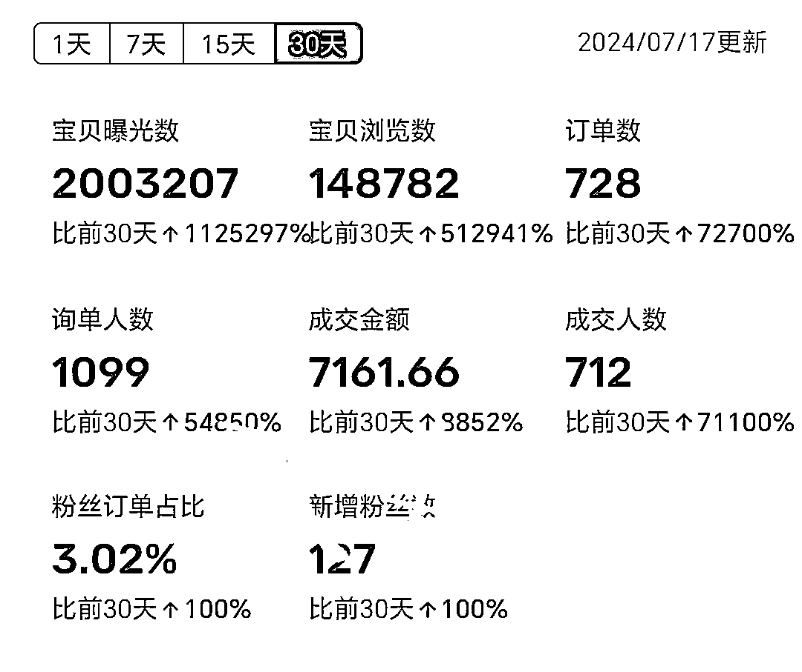
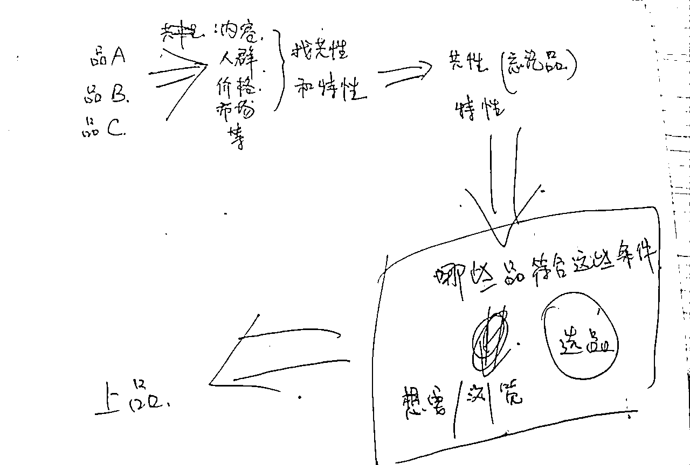

# 一个账号收入放大5倍———不做矩阵，闲鱼虚拟资料项目也能办到！！！

> 来源：[https://wabqhwd11nx.feishu.cn/docx/Lx5NdGe6qoxu0txjidFcKciknkh](https://wabqhwd11nx.feishu.cn/docx/Lx5NdGe6qoxu0txjidFcKciknkh)

正文的开始，先秀下肌肉：

# 一、为什么选择闲鱼虚拟资料项目

*   门槛低

*   出单快

*   自动发货

*   进货成本低（只需出第一单买，然后循环使用）

*   自然流量可矩阵稳定出单（一个身份证可开三个闲鱼号）

# 二、怎么操作

## 搬运，步骤：

1.  找对标，搬它的标题、描述、主图

1.  出单后，复制标题→搜价格最低的同款→购买→发给你的买家

1.  继续上架，出单之后发货已买好的网盘链接

# 三、如何选品

## 选品方法

*   ① 我没有借助任何选品工具和平台选品，只通过闲鱼展示的数据和内容选品。比如的推荐、想要/浏览

*   ②做自己擅长的赛道，更能把握产的质量和选择合适的衍生品

选品思路

## 选品思路

我的思路很简单：找品A、B、C，分析它们的买家画像，找共性、特性然后表格列出来。再忘掉品A、B、C，分析这些共性和特性跟出单有什么关系！这些因素如果能影响出单，那么哪些品有这些性质/共性，然后再去闲鱼刷品，看想要/浏览，看同一个品不同的店是什么情况。附件手写思路图

# 四、单号放大5倍的方法

为什么要做高客单？

只要出单就比低客单爽，只要小爆就200左右/日收入，大爆500+/日收入

方法很简单：

1.  当大家都在做劣币驱逐良币的事——不管多好的品，都卖1块，我已经在卖5-10块，甚至更高的价格。

1.  当大家都在不停的铺货，我在一个一个的研究分析别人的爆款和店铺

1.  当大家都在因为出了100单赚了200块开心的时候，我在想怎么样卖更高的价格

# 五、客服促成交技巧案例

1.  案例一：

这个品的文案描述有56个内容，我回复有100多个（实际有200+个内容）。如果我不说实际内容可能这单就流了。

在成交之前，他以为只有56，但是事实是有200。你告诉他，就等于跟他说：快来占便宜，错过了我家下一家可没这么便宜。所以，说了和不说是有区别的

1.  案例二：

遇到买家砍价，不管什么理由，降价一点点就行，能成就成，成不了就不成。第一次降价太多了，就容易被砍第二次（案例品原价5.5）

# 六、衍生的收益

1.  全店会员：会员全店免费下载。基本上用一次，跟健身卡一样。

1.  引流到微信：小技巧：着重引流主动下单的买家

1.  网盘拉新：目的是做项目，注册了拉新有益就行，不要投入精力，到时间了就去体现。

# 最后

希望大家永不内耗！天天运动！吃嘛嘛香！