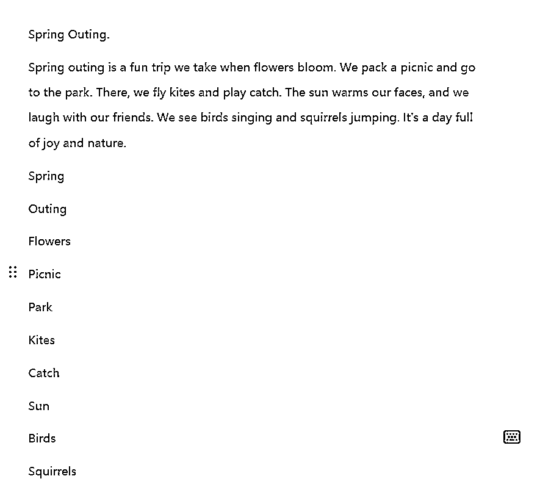
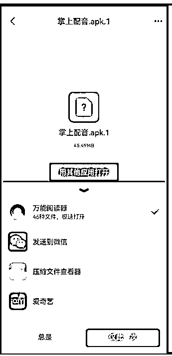
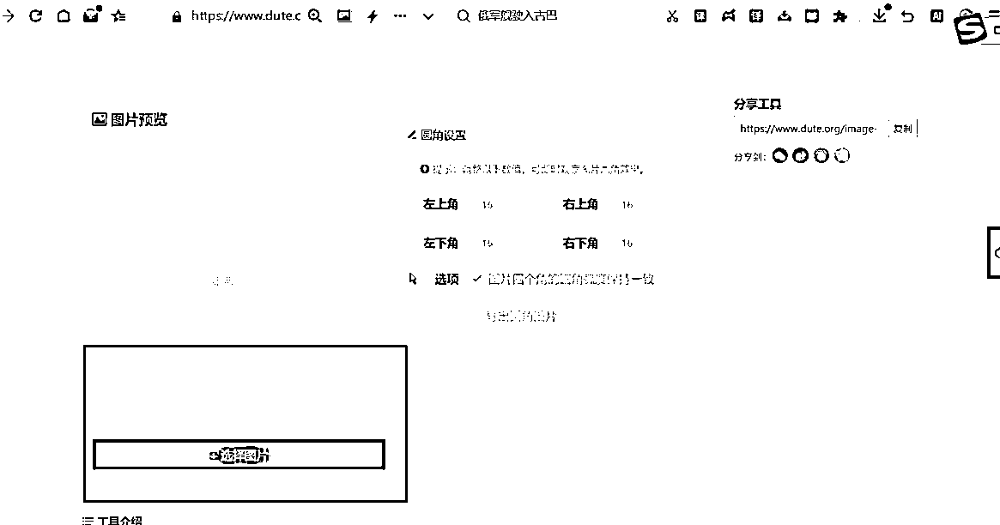
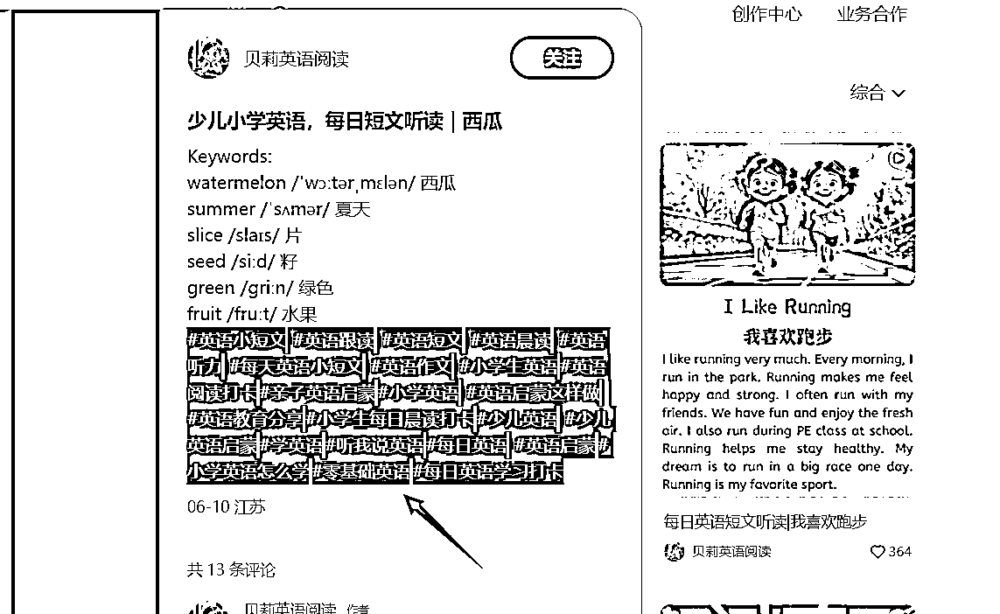

# 拆解小红书AI英语短文赛道，高单价19.9-39.9变现，实操玩法一条龙分享给你

> 来源：[https://o0yvn3o31a.feishu.cn/docx/M4R5d79zsoDCuqxvYzxco4QKnWf](https://o0yvn3o31a.feishu.cn/docx/M4R5d79zsoDCuqxvYzxco4QKnWf)

大家好，我是黄岛主！

今天分享的是我们最近操作的一个小红书AI赛道的项目，这个项目主要做的方向是“每日英文短文”，也就是通过短文内容让孩子学到短语。目前市面上没什么人去做，除了北京那边的一个团队在做，剩下的就是我们在做，可以锁这个赛道的内容相对于蓝海一点吧，整体都是AI去生成的。而且变现方式也很简单，就是引流私域或者开店变现，然后就是千粉卖号等变现方式。

可能大家对这个赛道比较陌生，这里我来简单介绍下：我们通过AI工具去生成短文，然后图片也是用AI生成的，然后用编辑工具去生成图片。然后这个英语短文也很简单粗暴，听说只要孩子坚持一个月，就可以给孩子营造外语环境，而跟读10分钟，就会词汇量暴涨，同时也会轻松开口说英语!说的有点夸张，但确实不虚假。

这个之前生财里也有圈友发过这个风向标，这里我截图给大家看看，对标账号就是我们的同行，变现方式跟我们一样，都是卖电子书和音频，销量都是非常不错的。但说真的，我们没人家牛逼做不过人家，惭愧的一逼！

好了，来看下AI英语短文视频的案例：

这个视频包含用户想要的关键词，也就是单词，譬如：

milk [mɪlk] 牛奶、white [waɪt] 白色、clouds [klaʊdz] 云朵、morning ['mɔrnɪŋ] 早上、calcium ['kælsiəm] 钙、teeth [tiːθ] 牙齿、bones [boʊnz] 骨头、honey ['hʌni] 蜂蜜

基本上用户买完这个，就是为了让小孩去学习这个单词，每天听听英语短语，肯定是最佳的磨耳朵利器！

这个项目针对的人群也很简单：一些懂英语的宝妈、老师群体。说真的，小红书上的宝妈群体非常适合。所以，宝妈的需求很大，适合小红书变现，而且还是虚拟项目，没什么成本的！

之前写过一篇小红书英语启蒙项目，应该很多人都看过【https://articles.zsxq.com/id_gb3b4kxjaw4x.html】其实很这次的AI英语短文是一样的，基本上都是用户买来磨耳朵，而且单价也非常可观，例如合集价格49.99、单个价格19.99，或者包月19.9、合集39.9都可以。我建议大家从英语赛道入局，因为这类英语赛道在小红书上很吃香。

还可以去小红书半无人直播去卖：

目前的话，市面上有人在培训这个项目，培训的价格500-1000，但是学费交完之后，学习制作的时候从里到外都是收费的，这软件收费，那软件收费。后来经过我们拆解和整理之后，我们基本上都免费化操作了！各类软件都是免费了，但是制作时间可能会长一些，30-60分钟，这个也是熟能生巧吧。所以，这次我们也会把操作步骤分享给大家。

当然，这个不光小红书可以做，也可以分发到抖音、快手、短视频上做私域引流变现：

好了，下面我详细给大家分享这个AI英语项目的详细玩法：

# 一、账号注册

小红书注册还是很简单的，有手机号和手机设备就可以去注册，流程包含这些：

1、手机里下载小红书APP

2、选择手机号登录

3、输入手机号，获取验证码，勾选已阅读并同意

4、然后点击登录

这里不详细说明了，这个大家都会注册，但是有几个细节要点，我简单说下：

1、一机一号一ip：单独一台手机，一张手机卡，用流量注册哈，需要流量卡渠道也可以找我推。只要你保证注册的是新号就行了。

2、注册时，生日选择大概1个月内的。因为小红书生日当天会发一张生日流量券，有效期半个月，这个到时候有利于发笔记的时候使用！

3、小红书注册需要选择年龄：30出头就行了；性别填写女的，爱好什么的，随便选就行了。

4、先不用修改小红书名字，也不写简介。建议发了3篇笔记后，再改名字和写简介，不要一上来就改哈。

5、我是建议大家新开账号，或者把老账号注销掉变成新账号，不要用发过其他内容的老账号来做这个项目。

第一点：老账号如果长期发一个领域的内容，标签已经定死了，换个赛道不容易热门

第二点：你的老账号可能长期没发布，账号权重流失严重，再发就不热门了

所以：空白新号，你从0-1去做会更顺畅，不会有那么多的烦心事

注册的每次都老生常谈，大概这些就可以！

# 二、养号操作

养号很简单的，按照我下面讲的就行，但要注意：养号期间不要做任何动作，不要发作品，养号成功了，再去发作品。

下面是具体养号天数，跟着做就行：

第1天：

在小红书刷别人作品，分时段，刷2个小时就行，刷的时候多点赞、收藏（第一天不评论）

可以在小红里手动搜索一些关键词：每日英语短文、每日英语短文听读、每日英文短文、每日英语小短文、每日英语背诵小短文、英文短文 等等

看到搜索出的视频之后，要对他们的作品，适当的点赞、收藏、评论以及关注，只要模拟正常人操作即可。

比如，这个是我们对标的账号：

第2天：

延续第1天养号操作（每天2小时，分不同时间段），正常点赞、收藏，关注（关注对标看看人家咋做的视频）

然后看看推荐的有无每日英文短文的视频？如果有也对推荐里的进行正常的点赞与关注等操作。

同时，第二天要对刷到的作品评论下，这个要做下哈！

细节操作：

1、要适当的评论，大概5个点赞率评论1个，要做到5：1的比例。

2、评论的内容，我们可以直接复制其他人的评论内容，粘贴去评论就好了，这个很简单，跟风即可！

第3天：

延续第2天的养号操作，每天两小时，没事就刷刷2-3小时都行！

第4天：

第4天的时候，我们看下账号养的综合情况，看看是否都能推荐的我们要做的这个行业的视频，如果首页基本上都是，那么恭喜你：说明你养号差不多了。

但是，养号不能断，我们要继续重复前一天的养号哈！

然后，我们需要改头像资料和发作品了！

改头像和资料，按照任务1的完善资料去改哈！

发作品，我们会在养号结束前，提前教大家制作！

发作品的数量提前说下，每天发3-4个作品！

分时间段：早上7点一个、中午11点一个、下午4点一个、晚上8点一个

第5天：

第5天之后，我们都正常发布笔记就行了！

持续发布几天看下养号的效果，同时养号别忘记了，这个养号是每天都需要养下的，可以花30-60分钟去养号，养成习惯。

切勿操之过急，如果粉丝量不多，账号权重不高，正常新号在200左右浏览量，后期越来越好，这个都需要等周期7-15天的。

平时操作的细节注意：每天都要刷视频养号，边发边做边养。

总结下：真正的养号就是把自己当成，使用小红书的一个普通用户，去刷小红书就可以了，去看和关注相关领域，系统会认定我们是真实优质用户，只有养好号之后再发内容，系统才会给更多的曝光。

# 三、素材搜集

先看下对标账号，我们要做参考的，直接看对标账号去搜集素材即可：

记住：我们主要搜集的素材是对方爆款的主题，然后我们到时候再用AI工具重新生成，图片最好也要做到1:1的模仿才可以。

这些是我们整理的一些一些对标账号和主题关键词，都可以看看：无法下载，可以找黄岛主私聊要

还有一些关键词参考：无法下载，可以找黄岛主私聊要

# 四、操作软件

做这个项目的视频，需要用到这些软件，你们看下：

以下均为电脑端操作的软件！

1、手机光标不好做

2、AI文字和图片不用电脑生成不了

AI绘画软件：

1、讯飞星火网址：https://xinghuo.xfyun.cn/

文字图片合成软件：

1、稿定设计

https://www.gaoding.com/

视频配音软件：

1、南瓜配音小程序（要钱，可开月版用于孵化）（扫码即可）

2、掌上配音用安卓手机打开使用（免费，安卓可用）

下载链接：https://pan.baidu.com/s/1LCBsxmIfR2115cVTrH5v8g?pwd=21v5

提取码：21v5

视频制作软件：

1、剪映

https://www.capcut.cn/

图片处理软件：

1、美图秀秀（裁剪图片）

https://pc.meitu.com/

2、WinkStudio（图片高清处理）

https://wink.meitu.com/

这里下载链接：https://pan.baidu.com/s/18WQx7n0bpSCyr6yYzBkZ3g?pwd=e1ro

提取码：e1ro

3、图片圆角网站

https://www.dute.org/image-round

图片圆角工具更新，直接复制链接到浏览器打开就可以使用，圆角大小可调节，网址：https://www.pcccp.cn/yj/

# 五、视频制作

关于视频制作，其实很简单，包含了：AI短文、文案配音、AI图片，剪映制作成视频，然后我用图文的形式给大家拆解了出来，你们可以根据图文去进行操作！

## 1、AI短文操作

先确定主题，方便我们后期AI短文，包含如下：

季节：春天，夏天，秋天，冬天

节日：端午节，中秋节，国庆节，清明节，儿童节，春节

我的：我是家乡，我的房间，我的一天，我的妈妈，我的生日，我的自行车，我的小仓鼠，我的秘密，我的愿望，自我介绍，我很棒，愉快的周末，我的好朋友，我的梦想

做什么：坐火车，看电视，贴春联，年夜饭，坐飞机，赛龙舟，包粽子

动物：老虎，猴子，熊猫，小蚂蚁

食物：草莓，西瓜，香蕉，苹果，冰淇淋，向日葵，玫瑰花

活动：春游，露营，晨跑，游泳，刷牙，大扫除，放风筝

等等！

下面是目录，辅助大家的：

下面是AI指令，可以参考看下：

1、请帮我写一篇8-10句话的英语小短文，适合英语零基础和中国一二年级的学生，主题是【】，不要用数字隔开，是一个连贯的小短文，包含标题，并将文章的翻译发给我。出现的10个关键词及其美式音标以及对应中文，两个提问及其中文单独发给我。关键词开头不要出现数字，翻译和音标用空格隔开，按照单词，音标，英文缩写属性，中文翻译顺序发给我。

2、请帮我写一篇8-10句话的英语小短文，适合少儿启蒙，主题是【】，不要用数字隔开，是一个连贯的小短文，包含标题，并将文章的翻译发给我。出现的10个关键词及其美式音标以及对应中文，两个提问及其中文单独发给我。关键词开头不要出现数字，翻译和音标用空格隔开，按照单词，音标，英文缩写属性，中文翻译顺序发给我。

3、请帮我写一篇8-10句话的英语小短文，适合英语零基础的成年人，主题是【】，不要用数字隔开，是一个连贯的小短文，包含标题，并将文章的翻译发给我。出现的10个关键词及其美式音标以及对应中文，两个提问及其中文单独发给我。关键词开头不要出现数字，翻译和音标用空格隔开，按照单词，音标，英文缩写属性，中文翻译顺序发给我。

实操来看下：

比如以端午节为例：打开讯飞星火，https://xinghuo.xfyun.cn/端午节刚刚过去，把上面准备的三段话，总共3种格式的，随便用哪一种都可以，打开讯飞星火，找到写作助手，点开之后把这段话复制进去，主题是端午节，点击发送，生成的内容包括主题、文章、关键单词、问题，全部生成完之后复制到语雀或者飞书，新建一个文档，把这个内容粘贴进去。

再输入：请生成这篇短文的主题图片详细描述词，汉语

再比如主题是春游，生成完之后，再输入：请生成这篇短文的主题图片描述词。

## 2、AI文案配音

配音之前把整体文章拍一下版，只留下要配音的这一段英语和单词部分，放到一起方便配音。

我们这里使用免费配音：

这个只适合安卓手机，安装好之后，把在讯飞星火生成好的文案复制，通过QQ传输发送到手机端上，把配音软件也发到手机端上。

把软件下载到手机上，点开掌上配音，用其他应用打开，用QQ浏览器，微信是打不开的，点击QQ万能阅读器，需要去下载，下载完之后就可以点进去安装，安卓手机才可以用。

打开之后点击全部，找到童声，往下滑Tunes，这个是英语的，免费的配音软件。

然后把文案粘贴进去，插入0.5秒的停顿，声音设置，语速和播放语调都可以去调，点击试听音频，然后保存确定，点击导出下载MP4或者MP3都可以的，下载方式可以给它下载到QQ，然后发送到电脑上去。

## 3、AI绘画图片

1、AI绘画

把上面在讯飞星火生成好的主题图片描述词，在生成的描述词里面，自己加上人物描述，其他人物+服饰+场景+动作）,某某风格（比如迪士尼风格）。

比如：一个可爱的小女孩，在温馨时尚的厨房里与妈妈一起做面包。她有着棕色的小辫子，面带微笑，活泼可爱。厨房光线明亮，色彩柔和，有粘土和彩色粉笔装饰，还有流行的波普艺术元素。整个场景充满了迪士尼式的欢乐，3D渲染，技术让一切看起来更加生动。

比如：一幅生动的春游场景图，画面中，一群漂亮的小孩笑着在繁花似锦的公园里玩耍。孩子们穿着色彩鲜艳的衣服，有的正在树荫下摆放野餐垫，有的在花坛边追蝴蝶。背景是一片湛蓝的天空和洁白的云朵，几只小鸟在枝头欢唱。阳光透过树叶洒在草地上，一切显得生机勃勃，充满春天的气息，3D渲染，画质超清。

比如：一个充满夏日气息的场景，画面中一个可爱的小女孩，扎着两个棕红色的短辫子，在是一片闪耀着阳光的湛蓝海洋和金黄色沙滩上，在海边嬉戏，忙着堆沙堡，天空是晴朗的蓝色，几朵慵懒的白云悠悠飘过，迪士尼风格，挖沙子，3D渲染，画质超清。

比如：一个可爱的小女孩，扎着棕色双马尾辫子，戴着发夹，手里拿着粽子，在草地上微笑，清晰脸庞，身穿仙子连衣裙，干净唯美的背景，温柔的光线，现代，迪士尼皮克斯SD风格，最高画质，精美画面，16K超高分辨率。

比如：两个可爱的小女孩在写字，书桌，台灯，书房，飘窗，高清画质，3D迪士尼皮克斯风格，卡哇伊，3D渲染, --sref--v 6 --ar 16:9

两个可爱的小女孩在包粽子，端午节，窗户，桌子，池塘，树木，高清画质，3D迪士尼皮克斯风格，卡哇伊，3D渲染。

比如：一个可爱的小女孩在公园里，扎着头发，戴着帽子，微笑着吃着西瓜，她穿着粉色珍珠质感的连衣裙，大眼睛里闪烁着光芒，五官清晰可爱，背景干净且美观，光线明亮，整体呈现出现代感和立体感，就像迪士尼动画风格一样，画质超清。

生成好图片，鼠标右键保存图片到电脑上去，点击下载。

2、裁剪图片，下载好的图片放到美图秀秀里面，把尺寸改成16:9，导出图片之后，把图片放到wink里面，画质清晰度提升一下，点击画质修复，把图片拖进来，点击超清，开始处理。

3、图片圆角制作，打开网站： https://www.dute.org/image-round

点击选择图片，找到在wink里面处理过的超清图片，圆角数值设置一下，一般20以内，点击导出圆角图片。

## 4、文字背景图片制作

需要用到搞定设计，打开之后点击创建设计，输入宽和高的尺寸比，给大家一张图片，里面有小红书、微博、抖音、B站短视频平台的尺寸大小，这里以小红书为例，小红书竖版1080乘以1440，也就是3比4。输入1080乘以1440，点击创建，创建之后右边不透明度拉到最低。

尺寸看下：

调完之后先把AI图片放上去，调到合适的位置，拖拽到中间，中间线出现就是中间位置了，可以放到最上面，下面点击文字，点击标题，输入主题spring outing,调整大小，移动到合适位置，字体样式和颜色自己去调，找一个比较喜欢的字体样式，再添加一个副标题，也就是汉语下面输入《春游记》，调整字体，有很多特效可以自己去选，一定要拖拽到中间位置，要沿着中间这个线，才是中间位置。

接下来添加正文，下面需要留出一点空，用来做字幕，然后把字体调一下，想用哪个就用哪个，大家推荐两个字体，仓耳与墨W02，和汇文明朝体，字体比较好看，字迹也比较工整，给大家做个参考，我就比较喜欢用这两个，看起来比较正规一点。

接下来把重点单词标注出来，选中单词之后，文字颜色调成红色或者黄色、绿色都可以，自己去调就行，然后加粗一下，然后上面这张图片需要删掉，放在这是为了后期在剪映制作的时候，方便我们把它的位置放上去，制作文字图片不需要，删掉，然后把这张图片保存，点击右上角，下载，名称比如春游第一张，把模板保存一下，之后就可以直接用了。

保存完之后再输入第二张图片的内容，把文字改一下，移动到左边，字体样式调一下，把内容复制粘贴进去，格式调成左对齐，根据文字的多少调整大小，做好之后同样的导出、下载，名称春游2。

再添加一张图片，添加问题和译文进去，复制一层出来，放到下面写上译文的英语translation，这就是翻译，一定要对齐，把这一段再复制一层拉到下面，找到中文翻译复制粘贴，下载导出，春游3.

## 5、剪映视频制作

制作图片很简单了，基本上有基础的就可以干，下面来详细的看下操作方式：

打开剪映，先把配音放进去，再把制作好三张文字图片放进去，还有圆角的图片放到主轨道上，视频比例3比4，把配音语音分离出来。

背景填充打开，选择模糊，第二个或者第三个都可以，看自己的喜欢，把主轨道图片拉到和语音对齐，对齐之后拖到上面缩小一下，放在合适的位置就可以。

接下来需要给它打上字幕，点击文本，新建，添加，把中文翻译挨个放上去，调一下字体样式，随便用哪个都行，后面单词部分不需要放字幕了。

接下来我们做光标移动，就是根据音频，让字幕跟着移动的效果，先找到一个背景图，颜色自己去选，想选哪个就选哪个，用黄色给大家举例，直接下载一些纯色的背景图就可以，比如用黄色，拉到剪映里面，颜色图层一定要放在文字图层的下面，主题图片的上面。

接下来做光标跟着字移动的效果，选中之后，先做第一句，对齐音频之后分割，点击右边的蒙版，点击矩形蒙版，往下拉盖住需要的文字，调到合适的大小。

如果是上下两句话的话，就需要用到两排的光标，拉到和音频对齐就可以了，重复调蒙版，矩形蒙版的步骤，后面的重点单词也要调，全都都调好之后，视频就做差不多了，这步是最浪费时间的。

然后把图片和音频对齐，第三张图片上的翻译和问题不需要读出来，所以就直接在视频最后空出5-秒时间就可以了，全部对齐之后就做好了，制作完之后导出去发布就可以了。

最终视频做出来的效果：

OK，视频制作到此结束！

# 六、发布操作

发布篇数

发作品的数量，每天发3-4个作品！

分时间段：早上7点一个、中午11点一个、下午4点一个、晚上8点一个

注意：时间多点，就多发，时间少点最少保持2-3个视频发布

发布流程

笔记内容和图片准备好之后，可以按照下面的去发布！

标题：

可以看同行的标题，基本上都是统一，那么我们也这样统一去做！

标题格式：

少儿小学英语，每日短文听读|我的身体（这个位置就是短文名字）

每日少儿英语短文听读|我的身体

Day6每日英语听读，坚持打卡100天｜冰激凌 （备注签名的数字是1-7 七天）

注意：多参考同行的，然后标题基本上一个格式，只是短文名字变了而已，也可自己创建

封面：

用自己视频上的图作为封面图，不要搬运，如果搬运违规了，号就废了，我们做店铺的笔记图片要原创

描述：

AI生成的内容，直接用，如图

标签：

参考同行对标的，直接复制来

#少儿英语 #小学英语 #亲子英语 #宝宝英语 #英语启蒙 #英语打卡 #少儿英语启蒙 #少儿英语口语 #少儿英语学习 #少儿英语阅读 #小学英语怎么学 #小学英语语法 #小学英语外研版 #小学英语学习 #小学英语单词 #小学英语作文 #小学英语阅读 #小学英语听力 #小学英语听力音频 #亲子英语启蒙 #亲子英语打卡 #亲子英语口语 #日常亲子英语口语 #英语学习打卡亲子英语启蒙 #英语亲子阅读 #亲子启蒙英语早教视频 #零基础亲子英语 #英语渣妈打卡亲子英文 #亲子英语天天练 #宝宝英语启蒙 #宝宝英语启蒙这样做 #宝宝英语早教启蒙 #宝宝英语启蒙动画 #宝宝英语口语 #宝宝学英语英语早教磨耳朵英语 #宝宝启蒙学英语 #宝宝学英语 #宝宝开口说英语 #家庭英语 #家庭英语启蒙 #家庭英语启蒙常见问题 #家庭英语陪跑营 #英语打卡 #英语听力 #英语阅读 #英语词汇 #英语 #每日英语 #每日英语学习打卡 #每日英语听力

位置：

不需要同步

最后发布即可！

发布后的操作

发完之后，给自己的笔记点个收藏、点个红心、发个评论等。

建议大家在评论区互动可以找小号，发布笔记之后用小号带节奏，比如多发一些求分享 等 引导文字

# 七、变现方式

变现我们三种为主，我这里简单说下：

1、小红书开店卖资料

流程我简单说下：

店铺自己开好，然后产品上架的步骤如下：

后台直达地址：https://ark.xiaohongshu.com/app-system/home?from=ark-login

由于时间，我先以软件工具产品为主，演练上架步骤，具体的英语都差不多，然后等我慢慢再完善这个孵化文档

这个是对标店铺：https://www.xiaohongshu.com/goods-detail/6665a4fd1f018200014c58e4?instation_link=xhsdiscover://goods_detail/6665a4fd1f018200014c58e4%3Ftrade_ext=eyJjaGFubmVsSW5mbyI6bnVsbCwiZHNUb2tlbkluZm8iOm51bGwsInNoYXJlTGluayI6Imh0dHBzOi8vd3d3LnhpYW9ob25nc2h1LmNvbS9nb29kcy1kZXRhaWwvNjY2NWE0ZmQxZjAxODIwMDAxNGM1OGU0P2FwcHVpZD02NjU1NDg4MTAwMDAwMDAwMDcwMDQ1YjMiLCJsaXZlSW5mbyI6bnVsbCwic2hvcEluZm8iOm51bGx9

图片制作

主图看下：

这里先把产品的主图制作好，方便我们后期用到哈！

详情图制作：

跟主图下载方式是一样的哈，下载下来只要没水印，就直接用就行， 可以把对标的下载下来修改，也可以直接用，只要没水印就行。

然后正常上架就行了！

2、小红书、抖音等平台引流私域卖资料

这个很简单了，我们现在做的方式，都是私信有人问了之后，直接发图片微信，然后导流到微信，然后用话术转化，其实也没啥话术，就是对方问多少钱，我说单月多少钱，合集多少钱，其他其实没啥，他们付款很痛快，基本上咨询的很少。

3、千粉账号去卖，差不多180-200块左右，粉丝越高越值钱

这个我们有渠道的，账号做到1000粉丝，直接拿给渠道估价去卖，就是变现太少，如果账号作废了，不出单了，可以直接卖掉。

给客户的资料我给大家看看对标同行的，操作方式也很简单：

我给了下载链接，可以参考人家的：https://pan.baidu.com/s/1sYDEFfLSPauBWmXqNFbhmA?pwd=2fqa

提取码：2fqa

# 写在最后：

以上是我的拆解复盘，基本上差不多这些，目前这个赛道还是不错的，大家感兴趣也可以去操作看看，如果有问题可以跟我交流，没问题就开干，搞起来！