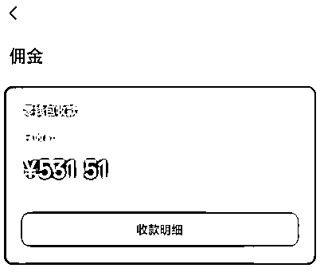

# 视频号口播航海复盘：从新手到爆款的蜕变之旅

> 来源：[https://x0cr0t4ciy.feishu.cn/docx/MPmqdlGQJohCvfx0ITfc4m8Hn3d](https://x0cr0t4ciy.feishu.cn/docx/MPmqdlGQJohCvfx0ITfc4m8Hn3d)

本次视频号口播航海马上结束了，正好今天有时间就把近期做口播的几次经历都写下来，回顾分享给大家，希望对大家有用。

今年在生财新增设的3次长线航海，我都去报名参加了：

1.5月的视频号口播带货

2.6月的视频号带货

3.7月的视频号口播带货

这不仅是一次成绩的回顾，更是一次心路历程的分享。

### 起航

5月16日，一个平凡的日子，却成了我视频号口播带货旅程的起点。

当时我正在考察郭晓文老师的视频号口播项目，偶然发现了生财有术上的航海活动。晓文老师带队，这对我来说，就像瞌睡时有人递来了枕头，简直是天赐良机！我毫不犹豫地报了名，交了999元的押金，满怀期待地开始了我的航海之旅。

### 成长：

这28天的航程，是一段从生疏到熟练，从迷茫到坚定的转变。起初我需要花费一整天的时间来准备一条视频，那是一段心理和技能上的双重磨砺（之间有做过职场类IP的视频内容，录制技能很快熟练）。之后在录制的过程中，我逐渐能够一天录制并剪辑发布七八条视频，这么大的改变得益于不懈的学习和实践。这个过程中，我经历了从心理建设到技能提升的全方位成长。一开始视频号屏蔽熟人，到最近连抖音都可以随便发（抖音无法屏蔽人，老号发布，就代表一定会被身边人看到）；一开始剪辑视频需要自己写SOP照着做，生怕忘了，现在熟练到完全不需要看SOP

### 探索：

最初，我跟随手册里的产品库进行录制，尝试了多种产品的推广——过做厨师，卖过小炒酱、包饺子的料汁。虽然开过单，但数量并不多。我意识到需要转换赛道，于是开始尝试卖书。没想到，这一转变让我发现了自己的潜力——我发现自己在介绍书籍时情感更投入，于是决定深耕这一领域。书籍推广成了我的新选择，在介绍书籍时，我能够更深刻地投入情感，这让我坚信，情感的力量能够打动人心。

### 突破与成就：

三天的专注尝试，我迎来了自己的小爆发。《朝鲜战争-未曾透露的真相》这本书籍的推广，让我在五个账号上都取得了显著的成绩。尤其是两个账号的收益分别达到了500元，总额超过了1000元。最火爆的视频获得了20万+的播放量，这是我不断尝试、不断录制的结果，也是我克服直播恐惧、逐渐熟悉并最终达到麻木的过程。

### 航海心路历程：

这次航海，不仅是技能的提升，更是心理的成长。我学会了如何在镜头前自如表达，如何在有限的时间内传递更多的信息，如何与观众建立起真挚的情感连接。

此时，本次航海结束了。进入了和群友自我驱动的过程，过了没几天视频号带货航海开始了。为了给自己找一个团队氛围，我加入了第2次的视频号带货航海。但其实看完手册之后发现，和视频号口播带货是完全不懂的两个品类。视频号带货主打的是混剪，所以接着做的是自己的视频号口播内容，通过带货航海学习了混剪技术，通过混剪将口播视频一条变三条。在此期间也按时完成了打卡。输出了有100+的视频。

回顾这段旅程，我深刻体会到，每一次尝试都是向成功迈进的一步。

这个过程中逐渐确定了自己对录制视频有一种蜜汁热爱，接受了自己就是个显眼包，喜欢露脸出境的过程，也坚定了想要在口播这条路上走下去。

在视频号带货的尾声，视频号口播带货又开了新的一条船。毅然决然地加入了。与此同时，通过航海小伙伴儿的一些渠道加入了一些素材群，素材都是比较爆的产品，但同时风险也高。经过10天左右的摸索，成功的把7个账号当中的所有账号全都关进了小黑屋。其中的两个账号，因为是自己找的一些高爆的文案直接被原作者给点了，导致账号直接封禁，都没有办法重新注销使用。（如下图，第二天登录就是这个状态，至今无法使用）

这个时候我才明确的意识到，在账号有限的情况下（10个以下），绝对不要触碰高风险的文案。不然就会发现自己明明也能找到对标产品，也有录制的能力，但是没有账号让你发布了。这种感觉就像你脚下就有钱，能看见，但你腰疼，弯不下腰

#### 敲个黑板避避坑~~

这里要重点说下，高风险的文案自己要学会辨别，另外还有那种IP属性比较强的，带的是自己独家产品的。最好也不要抄袭，如果非要抄的话要记得写稿，我就是被原作者私信提醒了一下，但我没太当回事儿，结果第二天那两个账号就都被封禁了。（自己家的减肥酸奶和燕麦）

这也让我意识到视频和口播真的是一个很需要账号的事情。我的7个账号除了之前朝鲜战争赚了1000块钱，后来一共也就赚了不到500。而这500块钱就是零散的带的货，比如塔木德、肥皂、卡包等等爆品，但其实我并没有做爆。

在航海手册当中有一句话说的特别对，要有情景感。我发散一下，要优先选择自己感兴趣的。可以发挥出自己真情实感的文案和货品，因为这种情感在你录制视频的时候会通过眼神、动作、表情传递给视频另一方的人。我爆的那一条视频自己是真的觉得说的那些战争中的人们真的很惨，所以有那种比较悲悯的表情和悲壮的情绪。

所以最近选择的产品还是书籍。最近小爆了一个视频1w+播放，但是没有出单。讲的是爱国的，有那种微笑着的哭腔。

另外要找到自己发音比较动人的那个发声区域，我之前曾经录制过类似于播音员一样的文案，就之前说的是新闻，后半部分是带货，那个效果很好。我就发现我自己的声音在提高音调的时候很像正经播音员，那个效果就很好。但是播音员本身是没有情感的，所以对于书籍这一类需要有情感传递的，所以并不太适合，所以我逐渐的降低了自己的声音，让自己的声音变得温柔一些。这样传递的情绪会多一点。

口播本身我是比较喜欢的，所以会坚持做下去，这其中就是要不断提升自己的选品能力，以及后续的改编文案、原创文案的能力。希望自己可以做个小IP出来。

3个月的航海，我已为自己的未来铺就了坚实的基石。我期待着在视频号口播带货的道路上，继续前行，不断探索，创造更多的可能。

以上就是我做这一段带货以来能够分享出来的过程和一些经验，未必是对的，大家自行挑选观看哈。